# DESIGN.md — Design Loop, the branching-questionnaire design tool

**Status: version 3, in execution (2026-08-02).** No code, no file plan, no step ordering, no test
plan — those live in `PLAN.md` beside this file. This is the mini project that must finish before
`solatro/design/spotlight/DESIGN.md` resumes — Spotlight is its first real client.

Version 1–2 are the questionnaire rounds (§11, §13). **Version 3 is the gap round of 2026-08-02**
(§14): GAP-001 and GAP-002, answered in the tool's own gap surface, closed in `gaps/`.
**Version 4 is the owner's review of the answering screen, 2026-08-03** (§15): seven findings about
how the screen is driven, none of them reversing a settled answer.

Written with the workflow it describes (`.claude/skills/flowchart-design`), so it is also the
workflow's own dogfood: if answering this questionnaire is annoying, that is data about the tool.

---

## 0. How to review this document

Identical to `solatro/SPOTLIGHT_DESIGN.md` §0, restated so this file stands alone.

1. **Every flowchart box has an ID** (`B4`, `E2`). Every question has an ID (`Q31`). Answer by ID.
2. **Every question carries a recommended default.** *default* is a complete answer.
3. **The questionnaire (§9) is a decision DAG, not a list.** Each question carries a gate:

```
- **Q31** `[Q4=b]` — question text? · **(a)** option — consequence · **(b)** option — consequence · *default* (b) · notes
             ^gate                                                                     ^recommended  ^expect to need free text here
```

| Notation | Meaning |
|---|---|
| `[root]` | always asked |
| `[Q4=b]` / `[Q4=b\|c]` / `[Q4=b & Q9=a]` / `[Q4≠a]` | conditional |
| `⚑gate` | this answer prunes other questions, so each option previews what follows (`→ next:`) |
| `⇒ skips …` | what answering this way prunes |
| `notes` | a fork where the options are especially likely to be insufficient |

**Always available on every question, so never written on the line:** free text ("none of these —
here is what I actually want"), and **not relevant / not worth answering**, which records the
recommended default and flags it as unreviewed.

4. **If a step is missing, say where** — "between C3 and C4 there must be …".
5. Nothing is built until every reachable node and question is settled.

**~117 questions; longest path ~85, plausible path ~60.** Start at §9.0.

---

## 1. What this is, in one paragraph

The owner braindumps a feature into chat and triggers the flowchart-questionnaire skill. The agent
researches the codebase and authors two artefacts: a **question DAG** and a **draft design graph**.
It then hands over a local URL. The owner answers questions **one at a time**, never seeing the
count and never seeing a question their earlier answers made irrelevant. Every answer is on disk
before the next question appears, and any earlier answer can be revisited and changed, which may
send the session down a different path. When the reachable questions run out, the agent notices by
itself, reads the answers, and either sends the owner back for a follow-up round or publishes the
finished design graph. The owner then reviews that graph on a pan-and-zoom canvas, annotating nodes
and edges, with a side panel listing assumptions, out-of-scope items and open notes — and either
**Confirms** it or hits **Review again** for another cycle. A confirmed graph is a versioned,
agent-consumable artefact that an implementation agent turns into an execution plan.

**The five rules of a question** (fixed requirements, not open questions — they define the whole
answering experience):

1. **Prefilled, clickable options.** Answering is a click. Composing prose is the escape hatch, not
   the expected path.
2. **Every option states its consequence** in a few words — what it *does*, not a restatement of
   the label.
3. **Free text is always available**, and so is **"not relevant / not worth answering"**, which
   records the recommended default and flags it as unreviewed.
4. **Every question is self-contained.** Read alone on a screen with no document around it, it must
   be answerable without looking anything up. If it needs a section, a chart, or "the brief", the
   question is broken.
5. **Gating questions preview their branches.** A question whose answer prunes others shows, per
   option, what kind of questions follow. Choosing a path blind is how a questionnaire produces a
   design nobody wanted.

And one consequence of (5): **free text at a gating question ends the round immediately** and hands
back to the agent to author the new branch, rather than being queued until everything else is
answered — because there is no path for an answer the DAG does not know about, and every question
after it would be asked down a branch the owner has just rejected.

---

## 2. Audit facts — what exists to build on

Verified 2026-08-01.

| Fact | Consequence for this design |
|---|---|
| The repo is a multi-project workspace: `solatro/` (Godot), `palette/` (Node/npm), `worldgen/` (Godot), plus ~10 smaller game dirs. | The tool is project-agnostic and must live at the root, not inside any one project. `designloop/` is a sibling. |
| `palette/` already uses **Node + npm** and its test run is a normal `npm test`. | Node is present on this machine and is a legitimate runtime choice. |
| `solatro/tools/*.py` are run with `py` and are deliberately **stdlib-only** ("no PIL, no numpy, same rule the rest of tools/ follows" — though `snapshot_diff.py` has since broken that rule). | Python 3 is present. A stdlib-only `http.server` tool would need zero install. |
| `.claude/skills/` holds `handoff`, `fx-verify`, `flowchart-design`. `.claude/agents/plan-auditor.md` is a read-only auditor. `.claude/hooks/block-process-kill.ps1` blocks name-based process kills. | The tool integrates as a skill; any process management must not trip the kill hook. |
| The owner drives git through **GitHub Desktop** and does not want agents staging or committing. | Artefacts must be plain files that show up as ordinary diffs, and the tool must never touch git. |
| The repo's doc culture: living docs state what IS; plan docs are folded and deleted; no "what happened on date X" logs in living docs. | A confirmed design graph is a living artefact; the question/answer transcript is history and can live beside it without polluting it. |
| `solatro/SPOTLIGHT_DESIGN.md` is the first client: **188 questions, 8 root gates, 14 mermaid design charts, ~200 nodes.** | These are the real sizes the UI must handle. Not a toy. |
| Existing precedent for "agent hands the owner a URL": none. Existing precedent for a **local tuning tool the owner drives while the agent watches**: `fx_editor.tscn`, `formation_editor.tscn` — both live in the Godot editor. | This is the first browser-based one. The "agent notices you are done" loop has no precedent and is the riskiest part of the design (chart E). |

**Standing constraint inherited from the project:** *no mocks in tools* — a tool hosts the real
thing. Here that means the review canvas renders **the same graph file** an implementation agent
consumes, not a prettied-up copy of it.

---

## 3. The state model

Six independent facts. Keeping them separate is what lets the agent and the owner work on the same
project without stepping on each other.

| # | Fact | Lives | Written by |
|---|---|---|---|
| 1 | **Question DAG** — every question, its gate, options, default | `questions.json` | agent only |
| 2 | **Answers** — one record per answered question, plus notes | `answers.json` (+ append-only `answers.log`) | UI only |
| 3 | **Design graph** — the flowcharts as nodes/edges, IDs stable | `graph.json` | agent authors, UI annotates |
| 4 | **Annotations** — owner notes attached to graph nodes and edges | `annotations.json` | UI only |
| 5 | **Session status** — whose turn it is | `status.json` | both, one field each |
| 6 | **History** — a frozen snapshot per review cycle | `versions/NNN/` | agent only |

**No file is written by both sides.** That is the whole concurrency design: the agent never edits
answers, the UI never edits questions, and `status.json` has one agent-owned field and one
UI-owned field. There is no lock, no merge, and no way to lose the owner's work.

---

## 4. Flowchart A — the whole loop

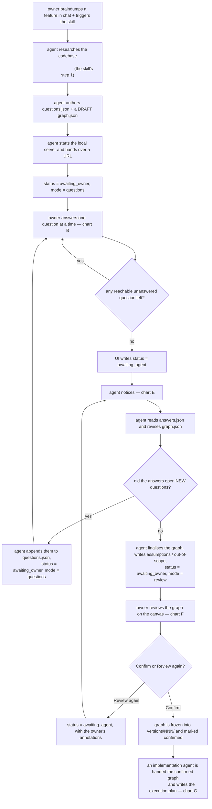

Open forks: whether the agent stays running while the owner answers (**Q20–Q24**), what happens if
the owner closes the browser mid-round (**Q31**), and whether A11 is the agent's judgement or is
itself driven by owner-visible criteria (**Q45**).

---

## 5. Flowchart B — the answering session

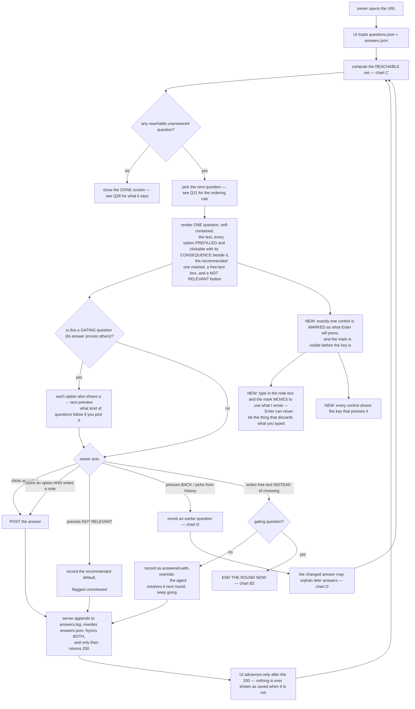

- **B7** — one question, no progress bar, no count (the owner's explicit ask). What the screen shows
  *instead* of progress is **Q26**. The question is self-contained by construction: rule 4 makes
  that the agent's authoring obligation, and the UI simply has nowhere to link to.
- **B7b** — the branch preview. Only gating questions get one; on an ordinary question it would be
  noise.
- **B11** — NOT RELEVANT is not "skip": it commits the recommended default as the real answer and
  flags it, so the design is never left with a hole and the agent can list everything that was
  waved through.
- **B12** — the durability rule. Write-then-respond, never respond-then-write, with an append-only
  log beside the materialised file so a crash mid-write can always be reconstructed.
- **B15/B17** — the asymmetry that matters: free text on an ordinary question is an override the
  agent reads later, but free text on a *gating* question invalidates every question after it, so
  the round ends on the spot.
- **B18–B20 — what Enter does, said out loud (owner review, 2026-08-03, design version 4).** Q12
  settled that Enter accepts the recommendation and that doing so is recorded as its own state,
  because it was not really considered. Nothing on the screen *said* so, so the only way to learn
  it was to have it happen — the owner's words: *"pressing enter on new question automatically
  takes recommended top answer, but this is bad UX"*. The decision stands; the silence does not.
  One control is always marked as Enter's target, and the mark moves with the situation.
  Q108's three states survive intact: the mark sitting where it was **put** is a `defaulted`
  answer, the mark the owner **moved** there is a `chosen` one.
- **B19 is a bug this made unrepeatable.** Enter with text in the note box took the recommendation
  and threw the text away, and because the textarea was replaced wholesale the browser's own undo
  had nothing left to undo. Typing now moves the mark to *use what I wrote*, the note rides along
  with every answer including a defaulted one, and what was typed is kept against its question
  until it is committed. **Nothing the owner typed is ever destroyed by a keystroke.**

### Flowchart B2 — free text at a gating question

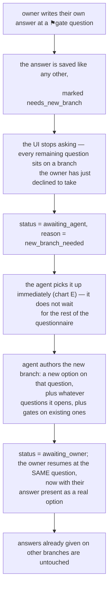

**P7 is the point of the whole mechanism:** the owner's prose becomes a first-class option in the
DAG, so the next person down that path clicks it, and so re-answering later is possible.

---

## 6. Flowchart C — reachability (what makes a question disappear)

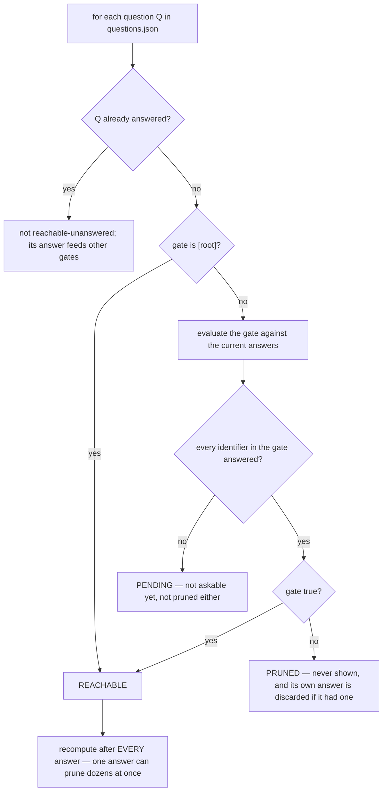

- **C7 vs C10** is the subtle case and it is why this is a DAG rather than a tree: a question gated
  on `Q4=b | Q9=c` is *pending* while neither is answered, becomes *reachable* the moment either
  matches, and is *pruned* only when both are answered and neither matches.
- **C10** — an answer to a question that later gets pruned is **kept on disk but marked inactive**,
  not deleted, so backing up and forward again does not lose it (**Q35**).
- A question whose gate can never be satisfied by any option of its referents is a DAG bug the agent
  must catch when authoring, not something the UI papers over (**Q39**).

---

## 7. Flowchart D — going back, and changing your mind

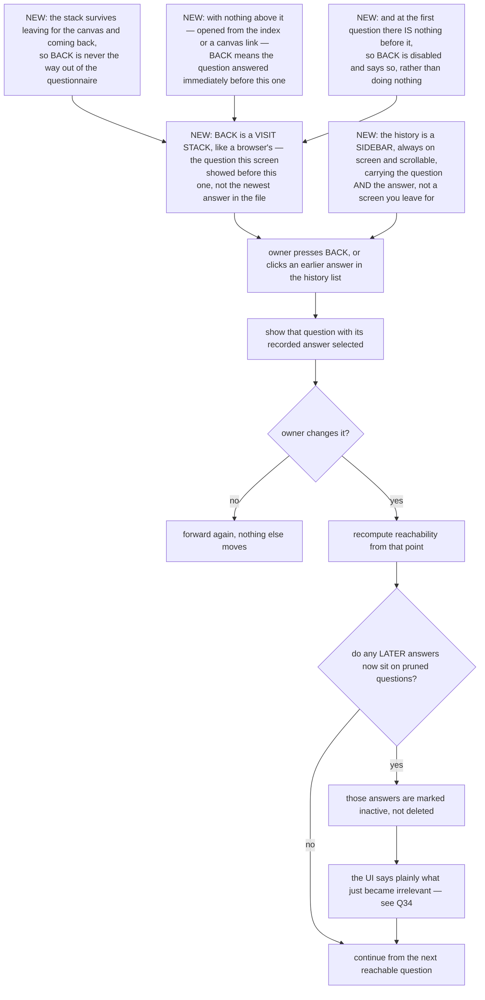

**Q32–Q36** cover this whole chart: whether BACK exists at all, whether a history list is visible
(it leaks the question count, which the owner asked to hide), and how loudly a re-answer announces
its blast radius.

**D10–D14 — what BACK means (owner review, 2026-08-03, design version 4).** Q33=a asked for a BACK
button *and* a clickable history, and both existed; what they did was wrong. BACK meant "the last
answer in the file", so standing on that answer it pointed at itself and the click did nothing —
the owner's report was that it "does not really go back to previous already answered page
sometimes, pressing it does nothing and forced to use history instead". A button that silently
does nothing is worse than no button, because it costs a click and a doubt every time.

It is now a **visit stack**: the questions this screen has shown, in the order it showed them.
BACK steps down it. The stack outlives leaving for the canvas, because the owner named that case
exactly — *"in case user checks another page then comes back"*. Where the stack has nothing above
the current question the fallback is the question answered immediately **before** this one, never
the newest answer in the file: at the first question of a round that would send BACK *forwards*.
And where there is genuinely nowhere to go, the button is disabled and says why. **Leaving the
questionnaire is what the link in the corner is for; BACK never dead-ends at the index.**

**D14 — the history sidebar.** It was a button that replaced the question with a list of IDs and
option letters: you had to leave the question to read it, and what it showed was not enough to
recognise an answer by. It is a sidebar now — always there, scrolling, and carrying **both halves**,
what was asked and what you said.

---

## 8. Flowchart E — how the agent knows you are done

This is the riskiest mechanism in the design: there is no precedent for it in this repo.

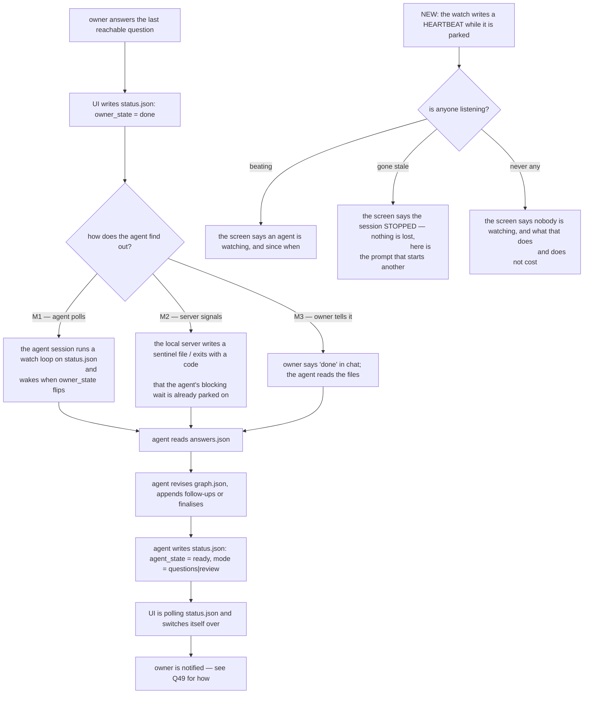

- **M1/M2 require the agent session to still be alive** while the owner answers. A long answering
  session outlives a chat turn. **Q20** decides the model, and it is a root question because it
  changes the shape of everything downstream.
- **M3 always works** and needs nothing. It is the honest fallback and should exist regardless of
  which of M1/M2 is chosen (**Q22**).

**E12–E16 — the same question, asked from the owner's side (owner review, 2026-08-03, design
version 4).** This whole chart is about how the AGENT finds out. Nobody had asked the mirror
question, and it turns out to be the one the owner is actually sitting with: *is anything listening
to me right now?* Answering a whole round into a directory no session is parked on is invisible —
it works, every answer is on disk, and nothing wakes up.

The watch writes a heartbeat while it is parked, so the screen can say which of three situations
this is: **watching**, **stopped** (a session that was there and ended — a killed process, a chat
that finished), or **none**. Staleness is the signal rather than a goodbye flag, because the case
worth reporting is precisely the one where nothing got to say goodbye.

None of it changes what is true underneath, and the screen says that too: **no answer depends on
anyone watching.** Q22=a's fallback — tell the agent in chat — was always the honest route, and
"stopped" is a prompt to paste, not an error.

---

## 9-preview. Flowchart F — review mode

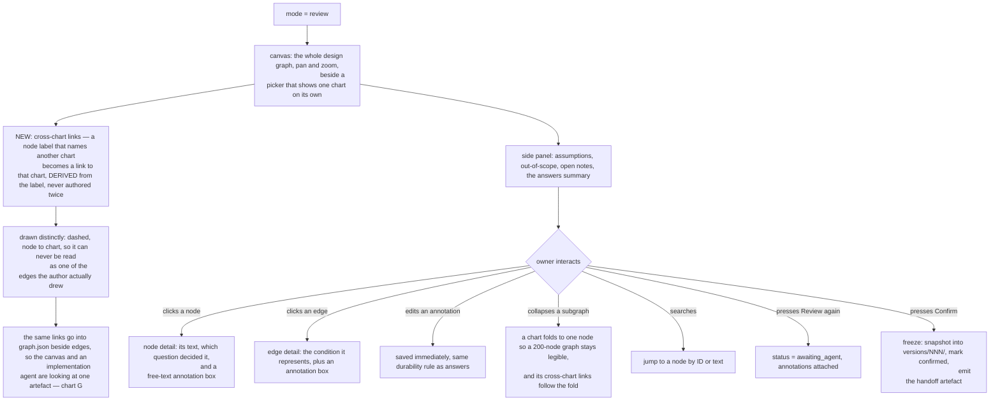

**Q52–Q66** cover the canvas: layout engine, how a 200-node graph is made legible, whether the
owner can edit the graph structurally or only annotate it, and what Confirm actually locks.

**F12–F14 — cross-chart links (GAP-002, resolved 2026-08-02).** Charts never point at each other:
measured on both real documents, every one of this document's 133 edges and every one of
Spotlight's 182 stays inside its own chart. The references *are* there — they are written in prose
inside a node's label, `A6 "owner answers one question at a time — chart B"` — so the whole-graph
view, the one view whose whole purpose was to show all the connections, was the view that showed
none. The link is now read out of the label it was already written in:

- A label naming another chart is a **link from that node to that chart**, not to a node in it. The
  author wrote the name of a chart; inventing a specific endpoint inside it would be inventing
  structure the document does not have.
- It is drawn **dashed and distinct** from a real edge, because it is derived and a real edge is
  authored. A reader must never have to wonder which of the two they are looking at.
- Resolution is **exact and conservative**. `chart B2` finds the chart headed *Flowchart B2* even
  though its nodes are prefixed `P`; `chart E3` finds chart E through its node `E3`; a name that
  resolves to nothing at all is a **warning to the author**, never a guessed link. A reference that
  lands on the node's own chart is not a link — Spotlight's chart E says "chart E2" about its own
  E2 three times, and drawing those would be noise.
- The links live in `graph.json` beside the edges, not only in the canvas. A picture that shows a
  connection no consumer of the file can see is the mock this project's rules exist to forbid
  (**Q64=a**).

The alternative the owner did not take was widening the chart language so an author writes
`A6 --> B1` by hand. It stays available: these documents can gain real cross-chart edges later, and
the derived links are what they mean in the meantime.

## Flowchart G — the handoff artefact

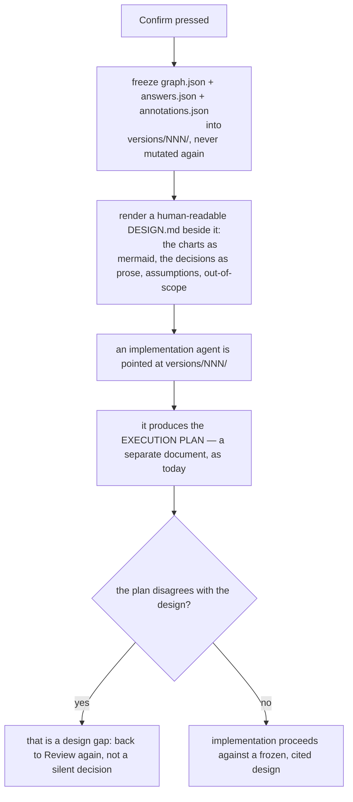

**G3 is what makes the artefact durable**: a JSON graph nobody can read will rot. The markdown
render is generated from the graph, never hand-edited, so the two cannot drift (**Q71–Q76**).

## Flowchart H — projects, history and re-opening

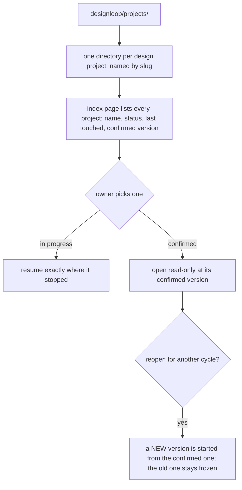

## Flowchart J — execution hits design space the plan does not cover

The loop is not finished at Confirm. An implementing agent — often a fresh session that has never
seen this tool — will reach decisions the design does not answer. Without a route back it decides
quietly, and the owner finds out from the diff.

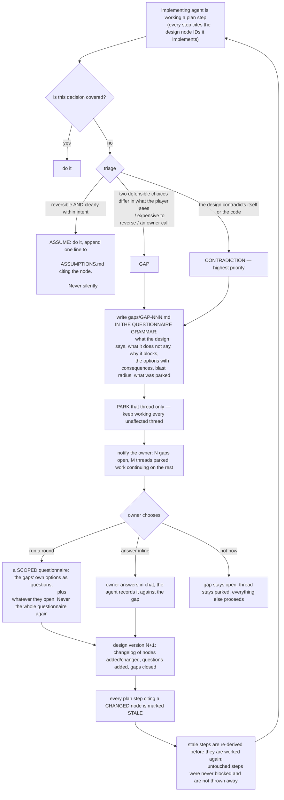

Three things make this cheap rather than ceremonial:

- **J8 — a gap is a draft question.** Written in the same grammar as everything in §9, so its
  options drop into the next round unchanged. Escalating costs the agent one file.
- **J16 — blast radius needs traceability**, which is why every plan step must cite design node IDs.
  Without that citation nothing can say what a changed node invalidates, and the honest fallback is
  "re-check the whole plan", which nobody does.
- **J9 — parking a thread, not the implementation.** A gap in the beam maths must not stop the row
  expansion work.

**The rule that has no exception:** an executing agent may not resolve a gap by picking an answer,
may not proceed on the parked thread, and may not delete or edit a gap. A gap is closed by a new
design version.

### How the protocol reaches an agent that has never heard of it

By travelling in the document it is guaranteed to read. A short **propagation block** — provenance,
the triage table, where to file, and the instruction to copy itself onward — sits in the design doc,
is copied verbatim into the execution plan, into the handoff doc, and into anything derived from
those in turn. It is a self-propagating clause, like a licence header. The block is in
`.claude/skills/flowchart-design/SKILL.md`, and `solatro/SPOTLIGHT_DESIGN.md` §20 carries the first
live copy.

## Flowchart I — failure modes

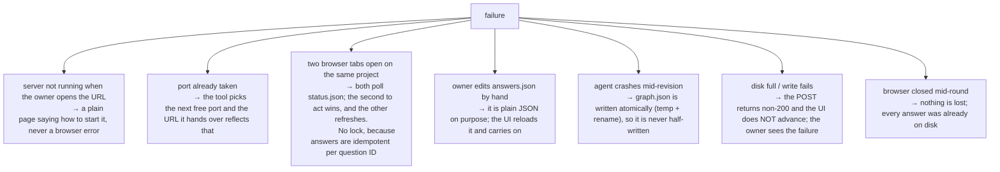

---

## 9. THE QUESTIONNAIRE

### 9.0 ROOT FORKS — answer these first

- **QR1** `[root]` ⚑gate — When you finish a round of questions, how does the agent find out? It has to notice before it can read your answers and write the next round. · **(a)** the agent session stays alive and watches a status file while you answer, waking the moment you finish — **→ next:** how often it checks, what it does if you stop halfway, whether it can work while you answer · **(b)** you tell it in chat when you are done, and it reads the files then — **→ next:** nothing about watching; straight to progress and rounds · **(c)** both — it watches, and telling it always works as a fallback — **→ next:** same as (a), plus the fallback · *default* (c) · notes

A: (c) agent waits for it to finish similar to how pending background tasks work

- **QR2** `[root]` ⚑gate — What has to be installed on this machine for the tool to run? · **(a)** nothing new — a Python server using only the standard library (`py` already runs `solatro/tools/`) — **→ next:** nothing about runtimes · **(b)** Node, which `palette/` already requires — **→ next:** nothing about runtimes · **(c)** no server at all: one HTML file that saves through the browser — **→ next:** questions about how answers reach disk and how the agent sees them, because neither works the usual way · *default* (a) — (c) cannot give you "saved to disk immediately" or let the agent watch, and both are explicit asks · notes

A: (b) I want website supporting mouse clicks which I assume python server does not provide

- **QR3** `[root]` ⚑gate — After the questions are answered, the tool can show you the finished design as a graph you pan, zoom and annotate. Is that in the first version? · **(a)** yes, questionnaire and canvas together — **→ next:** ~20 questions on canvas layout, annotation, versioning and the handoff artefact · **(b)** questionnaire first, canvas in a second pass — **→ next:** none of that; the round ends much sooner · *default* (b) — the questionnaire alone already replaces the current chat workflow, and the canvas is the larger half of the work · notes ⇒ (b) defers §9.5 and §9.6

A: (b) no point canvassing before questions are answered since it will create canvas that is useless

- **QR4** `[root]` — On the review canvas, how much can you change directly? · **(a)** annotate only — notes on nodes and edges, and the agent applies them on the next cycle, so the graph always matches the research behind it · **(b)** full structural editing — add, delete and rewire nodes in the browser, and the agent works from what you left · *default* (a) · notes

A: (a) ill just annotate an edge if it should be rewired, and existing nodes if it needs to be split into more nodes


- **QR5** `[root]` — Does the tool handle several design projects at once from day one? · **(a)** yes — one directory per project under `designloop/projects/`, with an index page · **(b)** one project at a time; generalise when a second one exists · *default* (a) — the directory shape costs nothing now and retrofitting it later is a migration

A: a

- **QR6** `[root]` — Where do the questionnaire and graph files live? · **(a)** in the repo, committed like any other doc, so a design is versioned alongside the code it describes — half-finished questionnaires show up in your diffs · **(b)** outside the repo in a user directory — diffs stay clean, but a design is not versioned with its code · **(c)** in the repo but gitignored until you press Confirm — clean diffs and versioned results, at the cost of a rule to remember · *default* (a) · notes

A: a

- **QR7** `[root]` ⚑gate — The questionnaire has to exist in some authored form. Which one is the source of truth? · **(a)** markdown, exactly as `SPOTLIGHT_DESIGN.md` is written today, parsed into the tool's format — the document stays readable and answerable in chat with no tool at all — **→ next:** questions about parsing strictness and converting existing docs · **(b)** JSON authored directly, with markdown generated from it — **→ next:** questions about how you read and review a design that only exists as data · *default* (a) — (a) means the 188 Spotlight questions convert with no rewrite, and the workflow keeps working if the tool is ever unavailable · notes

A: (b) having it start data first makes more sense to me as it would be easier to convert to questionnaire. Goal is creating flowcharts in an md like the one we are in right now, so data -> flowchart md makes much more sense to me than plan md -> data -> flowchart md


### 9.1 The answering experience

- **Q10** `[root]` — Confirm: one question on screen at a time, and the total count is never shown · **(a)** confirmed · **(b)** show a coarse indicator anyway (see Q26) · *default* (a)
- **Q11** `[root]` — When several questions are reachable, which comes next? · **(a)** highest gate-weight first — the question that prunes the most, so the tree collapses fastest · **(b)** document order, so related questions stay together · **(c)** document order within a section, sections by gate-weight · *default* (c) · notes
- **Q12** `[root]` — How is the recommended default presented? · **(a)** the option is marked "recommended" and pre-selected · **(b)** marked but not pre-selected, so every answer is a deliberate click · *default* (b) — pre-selection plus a big button is how a questionnaire gets speed-run by accident
- **Q13** `[root]` — Keyboard input? · **(a)** yes — letter keys pick options, Enter accepts the default, Backspace goes back · **(b)** mouse only · *default* (a)
- **Q14** `[root]` — Is there a SKIP button that records the default? · **(a)** yes, and skipped answers are flagged as unreviewed so the agent can list them · **(b)** yes, indistinguishable from a deliberate answer · **(c)** no skip — every question gets a click · *default* (a)
- **Q15** — *settled: a free-text box is on every question, always. Not asked.*
- **Q16** — *settled: free text without choosing an option is allowed everywhere; on an ordinary question it is an override the agent resolves next round, on a gating question it ends the round (chart B2). Not asked.*
- **Q17** `[root]` — Does the UI show the gate — i.e. why you are being asked this? · **(a)** yes, collapsed by default, expandable to "asked because QR3 = beams and circles" — costs nothing, and it is the fastest way to spot a wrong gate · **(b)** no, it is noise on a screen that is meant to hold one question · *default* (a)
- **Q17b** `[root]` — What exactly does **NOT RELEVANT** record? · **(a)** the recommended default, flagged unreviewed — the design never has a hole, and the agent can list everything waved through · **(b)** an explicit "no opinion", leaving the agent to decide and list it as an assumption · **(c)** nothing; the question comes back in a later round · *default* (a) · notes

A: functionally same as skip (there shouldnt be both skip and not relevant buttons), I feel for whatever reason that answering the question will not contribute, and acts as shortcut for me to communicate that without needing to use text box to say that

- **Q17c** `[root]` — How long may an option's consequence note be? · **(a)** one short clause, so the options stay scannable side by side · **(b)** up to a sentence or two where the choice is genuinely intricate · *default* (b) — several Spotlight options need a sentence, and a truncated consequence is worse than a long one
- **Q17d** `[root]` — On a gating question, how detailed is the **→ next** preview? · **(a)** the topics that follow ("beam shape, origin placement, overlap") · **(b)** the topics plus a rough sense of how many · **(c)** the actual first question of that branch · *default* (a) — (b) leaks the count the owner asked to hide · notes
- **Q17e** `[root]` — When the agent has authored a new branch from your free-text answer (chart B2, P7), how are you returned? · **(a)** straight back to that same question, with your answer now present as a real option to click · **(b)** to the start of the round · *default* (a)
- **Q17f** `[root]` — Rule 4 says a question must be answerable with nothing else on screen, which makes some questions long. Trade-off · **(a)** accept long questions — repeating context is cheaper than making you go look it up · **(b)** keep them short with an expandable "background" section · *default* (a) · notes

A: (a) but dont actually repeat duplicate knowledge, redundant information should be saved same way we reduce duplicates in code to save on tokens. Something like tabs for repeated knowledge, but other than that implementation detail, yes it should all be on 1 screen.

- **Q18** `[root]` — Does a question show which flowchart nodes it decides? · **(a)** yes, as a link into the canvas (once the canvas exists) · **(b)** just the node IDs as text · **(c)** no · *default* (b) if QR3=(b), else (a)

A: (a) node ids as text seems pretty useless UX wise, also allow oppsite direction, clicking on node or edges can link to question and answer that created it. Likely need some way to show if 1 question impacted multiple nodes and if 1 node has multiple source questions that created it.

- **Q19** `[root]` — Long questions with code or geometry in them (the Spotlight set has several). Does the UI render markdown in question text? · **(a)** yes — inline code, bold, and small tables · **(b)** plain text only · *default* (a)

### 9.2 The session and the handover

- **Q20** `[QR1=a|c]` — While you answer, does the agent session sit idle waiting, or end and get restarted? · **(a)** it parks on a blocking watch and wakes on the status flip · **(b)** it ends; a fresh session picks the project up from disk when you say so · *default* (a) · notes
- **Q21** `[QR1=a|c]` — How often does the agent check? · **(a)** a blocking watch, effectively instant · **(b)** poll every ~30 s · **(c)** poll every few minutes · *default* (a)
- **Q22** `[root]` — Confirm the "just tell it in chat" path always works as a fallback · **(a)** confirmed, always available · **(b)** not needed · *default* (a)
- **Q23** `[QR1=a|c]` — If you stop halfway and never finish, what should the agent do? · **(a)** nothing — it waits, and picking the project up later resumes it · **(b)** time out after a while and report what it has · *default* (a) · notes
- **Q24** `[root]` — Can the agent be working on the graph WHILE you answer, or only between rounds? · **(a)** only between rounds — simpler, and nothing changes under you mid-session · **(b)** continuously, so the canvas is always current · *default* (a)
- **Q25** `[root]` — Does the tool ever open the browser for you? · **(a)** it prints the URL, you click it · **(b)** it opens your browser automatically · *default* (a) · notes

### 9.3 Progress, ending, and rounds

- **Q26** `[Q10=a]` — With no count shown, what does the screen show instead? · **(a)** nothing at all — just the question · **(b)** a coarse phase label ("root questions", "detail questions") · **(c)** the number answered so far, but never the number remaining · *default* (b) · notes

A: (b) having labels for type of question seems fine since it communicates importance of the question. Additionally if flowchart has been created at this point since we are past very first review, there should be visible interactable flowchart on the side I can reference to help with question, and highlight the impacted nodes and edges by current question if there is a connection. 

- **Q27** `[root]` — Can you tell how much is left indirectly (e.g. by the history list length)? Is that acceptable? · **(a)** acceptable — hiding the count is about not being daunted up front, not about secrecy · **(b)** no, hide anything that leaks it · *default* (a)
- **Q28** `[root]` — What does the DONE screen say? · **(a)** "that is everything for now — the agent is reading your answers", then it waits and switches itself over · **(b)** "you are done, go back to chat" · *default* (a)
- **Q29** `[root]` — When the agent adds follow-up questions, are you told how they arose? · **(a)** yes — a short round summary at the top of round 2 ("your answer to Q31 opened these") · **(b)** no, just more questions · *default* (a)
- **Q30** `[root]` — Is there a hard cap on rounds? · **(a)** no · **(b)** yes, and past it the agent must proceed on assumptions and list them · *default* (a) · notes
- **Q31** `[root]` — You close the browser mid-round and come back tomorrow · **(a)** the URL resumes exactly where you stopped · **(b)** it restarts the round · *default* (a)

### 9.4 Changing your mind

- **Q32** — *settled: back navigation is required, and changing an earlier answer may send you down a different path. Not asked.*
- **Q33** `[root]` — How do you reach an earlier question? · **(a)** both a BACK button and a scrollable history list you can click into · **(b)** BACK one at a time only, so the history never leaks how much you have done · **(c)** history list only · *default* (a) · notes
- **Q34** `[root]` — Changing an earlier answer can strand later ones. How loudly is that said? · **(a)** a clear summary before it applies — "this makes 14 of your answers irrelevant, continue?" · **(b)** applied silently, listed afterwards · **(c)** applied silently, never mentioned · *default* (a)
- **Q35** `[root]` — Stranded answers are · **(a)** kept on disk, marked inactive, and restored intact if you change back — nothing you typed is ever lost · **(b)** deleted · *default* (a)
- **Q36** `[root]` — Can you change an answer during REVIEW mode, after the questions are done? · **(a)** yes, and it sends the project back to the agent for another pass · **(b)** no — use Review again with a note instead, so the graph and the answers can never disagree · *default* (a) · notes

A: (a) this seems good if I realize an answer I gave was not descriptive enough or missing crucial details. Have original answer be editable if I go back and change it, and tool should pick up that I changed an existing answer.

- **Q36b** `[root]` — Going back to a gating question and picking a different branch abandons a whole subtree of answers · **(a)** allowed, with the Q34 warning — it is the main reason back navigation exists · **(b)** allowed only before that subtree has been answered · *default* (a)

### 9.5 The canvas `[QR3=a]`

- **Q52** `[QR3=a]` — How is a 200-node graph made legible? · **(a)** one chart at a time, with a chart picker, plus an overview map · **(b)** everything at once, pan and zoom only · **(c)** everything at once, with collapsible subgraphs · *default* (c) · notes

A: both (a) and (c). (a) if I want easy access to all charts and be able to focus on specific subcharts without needing to see entire graph, (c) if I want to see all connections and whole picture

- **Q53** `[QR3=a]` — Layout · **(a)** automatic (a layered graph engine) — nothing to maintain, but node positions move between versions · **(b)** automatic, then positions frozen at Confirm so a version always looks the same · **(c)** manual positioning · *default* (b)
- **Q54** `[QR3=a]` — Are pruned branches shown on the canvas at all? · **(a)** hidden by default, revealable — "here is what you ruled out" · **(b)** never shown · **(c)** always shown, greyed · *default* (a)
- **Q55** `[QR3=a]` — Does a node show which question decided it? · **(a)** yes, with your answer · **(b)** no · *default* (a)
- **Q56** `[QR3=a]` — Annotations on EDGES as well as nodes (the owner asked for both) · **(a)** yes, both · **(b)** nodes only · *default* (a)
- **Q57** `[QR3=a]` — Does the side panel list assumptions, out-of-scope items and open notes as separate sections? · **(a)** yes, three sections · **(b)** one combined list · *default* (a)
- **Q58** `[QR3=a]` — Where do "assumptions" come from? · **(a)** the agent writes them explicitly as it works — every place it filled in structure rather than asking · **(b)** derived from skipped/defaulted answers · **(c)** both · *default* (c)
- **Q59** `[QR3=a]` — Can you mark an individual node as approved, so a second cycle only re-reviews the rest? · **(a)** yes, per-node approval with a visible diff of what changed since · **(b)** no, approval is whole-graph only · *default* (a) · notes

A: Since there may be too many nodes to manually approve each, instead make it a disapproval flagger where I mark nodes and edges I don't like, with approval being default for ones I don't click, but assume I may have not reviewed it yet so its not a hard approval.

- **Q60** `[QR3=a]` — Does Confirm require every node approved, or is it one button for the lot? · **(a)** one button; per-node approval is a convenience, not a gate · **(b)** every node must be approved first · *default* (a)
- **Q61** `[QR3=a]` — What does Confirm LOCK? · **(a)** it freezes a version; the working copy stays editable and a later Confirm makes a new version · **(b)** it locks the project outright · *default* (a)
- **Q62** `[QR3=a]` — Can you diff two versions? · **(a)** yes, node-level added/changed/removed · **(b)** no, versions are just snapshots · *default* (a) · notes
- **Q63** `[QR3=a]` — Is the canvas usable on a phone/tablet? · **(a)** desktop only · **(b)** must work on a tablet · *default* (a)
- **Q64** `[QR3=a]` — Does the canvas render the SAME graph file the implementation agent consumes? · **(a)** yes — no second copy, per the no-mocks rule · **(b)** a rendering copy is fine · *default* (a)
- **Q65** `[QR3=a]` — Can you export a chart as an image for pasting elsewhere? · **(a)** yes, SVG and PNG · **(b)** no · *default* (a)
- **Q66** `[QR3=a]` — Colour-coding on the canvas · **(a)** by chart · **(b)** by status (new / approved / annotated / pruned) · **(c)** both, switchable · *default* (c)

### 9.6 The artefact and the handoff `[QR3=a]`

- **Q71** `[QR3=a]` — Is a human-readable `DESIGN.md` rendered beside the JSON at Confirm? · **(a)** yes, generated, never hand-edited · **(b)** no, JSON only · *default* (a)
- **Q72** `[QR3=a]` — Does it include the full Q&A transcript? · **(a)** the decisions and their rationale, with the raw transcript in a separate file · **(b)** everything inline · **(c)** decisions only, transcript discarded · *default* (a)
- **Q73** `[QR3=a]` — Does the implementation agent get the graph, the markdown, or both? · **(a)** both — the graph for structure, the markdown for the reasoning · **(b)** graph only · *default* (a)
- **Q74** `[QR3=a]` — If the execution plan disagrees with the design, what happens? · **(a)** it is reported as a design gap and goes back for another cycle — never resolved silently · **(b)** the implementer decides and notes it · *default* (a)
- **Q75** `[QR3=a]` — Are confirmed designs folded into the project's living docs and deleted, as plan docs are today? · **(a)** no — a confirmed design graph is a durable artefact and stays · **(b)** yes, same hygiene rule as plan docs · *default* (a) · notes
- **Q76** `[QR3=a]` — Should the tool ever generate the execution plan itself? · **(a)** no — that is an agent's job, with the codebase in front of it · **(b)** yes, a first draft · *default* (a)

### 9.7 Storage and safety

- **Q80** `[root]` — Confirm: every answer is on disk before the next question appears, and the UI never advances on a failed write · **(a)** confirmed · **(b)** buffering a few answers is fine · *default* (a)
- **Q81** `[root]` — Storage format · **(a)** plain JSON files, one directory per project — readable, diffable, hand-editable, agent-consumable · **(b)** SQLite · *default* (a)
- **Q82** `[root]` — Is there an append-only log beside the materialised answers file? · **(a)** yes — the materialised file can always be rebuilt from it · **(b)** no, one file is enough · *default* (a)
- **Q83** `[root]` — Does the tool ever touch git? · **(a)** never — you commit through GitHub Desktop as always · **(b)** it commits at Confirm · *default* (a)
- **Q84** `[root]` — Is the questionnaire transcript kept forever, or trimmed? · **(a)** kept — it is small text and it is the record of why · **(b)** trimmed to the last N rounds · *default* (a)
- **Q85** `[root]` — Can a project be renamed, archived or deleted from the UI? · **(a)** archive and rename, never delete — deletion is a file-manager job · **(b)** all three · *default* (a)

### 9.8 Scope of v1

- **Q88** `[root]` — Is Spotlight the first client, converted from its existing markdown? · **(a)** yes — it is the reason this exists and it is a real 188-question load test · **(b)** start with a small throwaway questionnaire · *default* (a)
- **Q89** `[root]` — Must the tool handle the existing `SPOTLIGHT_DESIGN.md` without editing it? · **(a)** yes — the grammar in its §0 is already the interchange format · **(b)** a conversion pass is acceptable · *default* (a)

A: (b) you can edit the md since it is only a draft from before this plan and so can be updated

- **Q90** `[root]` — Is the tool itself designed to be used by future you without an agent present (reading an old design)? · **(a)** yes — a confirmed design opens read-only from the index with no agent involved · **(b)** agent-mediated always · *default* (a)
- **Q91** `[root]` — Does the flowchart-design SKILL change to emit tool artefacts instead of markdown? · **(a)** no — markdown stays the source (QR7=a) and the tool parses it, so the skill keeps working with no tool at all · **(b)** yes, the skill emits JSON directly · *default* (a)

A: (b) the SKILL's goal is to orchestrate this entire workflow when I trigger it, with the first thing I read after triggering skill be first page of the website, which may include a short summary of what questionnaire topic is and version so I can tell questionnaire was created on corect context and differentiate from other questionnaires. No reading an md first, but the json can contain an info section at the top with content same to what an md would have meant only for an agent to read so information is not lost, with a descriptive header summary for human readers to immediately figure out what topic of the json is.

### 9.85 Gaps found during execution (chart J)

- **Q86** `[root]` — When an implementing agent hits a decision the design does not cover, what should it do by default? · **(a)** triage it: do the reversible ones and log them as assumptions, park and report only the ones that genuinely block · **(b)** stop and report every single one, however small · **(c)** decide everything itself and list the decisions afterwards · *default* (a) — (b) makes implementation unusable, (c) is exactly the failure this whole workflow exists to prevent · notes
- **Q87** `[root]` — Where is the line between "just decide it" and "stop and ask"? · **(a)** stop if two defensible choices differ in what the player sees, OR the choice is expensive to reverse, OR it is an owner call (balance, look, scope) · **(b)** stop only if it is expensive to reverse · **(c)** stop for anything not literally written down · *default* (a) · notes
- **Q88b** `[root]` — When a gap is filed, does work stop? · **(a)** only the affected thread parks; everything else keeps going · **(b)** the whole implementation stops until the gap is answered · *default* (a)
- **Q89b** `[root]` — How are you told a gap exists? · **(a)** in chat when it happens, with a running count · **(b)** silently filed; you find them when you look · **(c)** in chat, plus a badge in the tool's project index · *default* (c) · notes
- **Q90b** `[root]` — What can you do with an open gap? · **(a)** run a scoped questionnaire round covering only the gaps, answer it inline in chat, or defer it and let the rest proceed · **(b)** only a full questionnaire round · **(c)** only answer inline · *default* (a)

A: (b) scoped questionnaire round in the website, since website would have better UI than inline chat

- **Q91b** `[root]` — A gap round asks only the gaps' own questions plus whatever they open — never the whole questionnaire again. Confirm? · **(a)** confirmed · **(b)** re-ask anything the new answers might have changed · *default* (a) · notes
- **Q92b** `[root]` — When a gap round changes a design node, what happens to execution-plan steps that cite it? · **(a)** marked stale and re-derived before being worked again; untouched steps are untouched · **(b)** the whole execution plan is regenerated · **(c)** nothing automatic; the agent re-reads and decides · *default* (a)
- **Q93b** `[root]` — Every execution-plan step must cite the design node IDs it implements, or nothing can compute a blast radius. Accept that as a hard requirement? · **(a)** yes, hard requirement · **(b)** best-effort · *default* (a)
- **Q94b** `[root]` — Are the ASSUME-level decisions (the reversible ones the agent just made) surfaced to you? · **(a)** yes, as a list at the end of each work session, and in the review canvas' assumptions panel · **(b)** logged to a file you can read if you want · **(c)** not surfaced · *default* (a)
- **Q95b** `[root]` — Can you promote an assumption to a gap after the fact ("actually I do want a say in that")? · **(a)** yes, and any step that relied on it is marked stale · **(b)** no, assumptions are settled once made · *default* (a)
- **Q96b** `[root]` — Are closed gaps kept? · **(a)** yes, with their resolution — they are the record of where the design was thin, and the best input into making the next questionnaire better · **(b)** deleted once resolved · *default* (a)
- **Q97b** `[root]` — Should a repeated gap pattern feed back into the flowchart-design skill (e.g. "designs keep missing the empty-collection case")? · **(a)** yes — the skill has a self-improvement clause and this is its best evidence source · **(b)** no, keep them separate · *default* (a) · notes

### 9.9 Explicitly out of scope — confirm

- **Q92** `[root]` — Multi-user / anyone but you answering · **(a)** out of scope · **(b)** in scope · *default* (a)
- **Q93** `[root]` — Hosting it anywhere but localhost · **(a)** out of scope · **(b)** in scope · *default* (a)
- **Q94** `[root]` — The tool authoring questions itself (an LLM inside the tool) · **(a)** out of scope — the agent authors questions, the tool presents them · **(b)** in scope · *default* (a)

---

## 10. What this document deliberately does not contain

No file list, no framework choice beyond the runtime question (QR2), no schemas, no step ordering,
no test plan. All of that is the implementation plan, written after this questionnaire is answered.

The two questions that restructure everything else: **QR1** (how the agent learns you are done —
the mechanism with no precedent in this repo) and **QR3** (whether the review canvas is in v1 —
it is roughly half the work).

One thing this design deliberately does NOT treat as out of scope, despite being about execution
rather than about questionnaires: **chart J, the gap loop.** A design tool whose output cannot be
reopened when reality disagrees with it just moves the silent decision one step later.

---

## 11. ROUND 1 — answers of record (2026-08-01)

Everything not listed took its recommended default. Answers that **changed** a default are marked ⚑;
answers that added a requirement beyond the option are quoted.

| Q | Answer | Note |
|---|---|---|
| QR1 | (c) | agent watches **and** you can tell it in chat |
| QR2 | ⚑ **(b) Node** | you answered (a) *"need to check if python or node is better first"* — researched below, and the evidence flips it. **Confirm at Q100.** |
| QR3 | ⚑ (a) | canvas IS in v1 — §9.5/§9.6 all live |
| QR4 | (a) | annotate only |
| QR5 | (a) | multi-project from day one |
| QR6 | (a) + | *"as separate project like solatro/palette/worldgen… file structure needs to be robust for projects with multiple design docs"* → **Q101–Q107** |
| QR7 | (a) | markdown is the source of truth |
| Q10 | (a) | one question at a time, count never shown |
| Q11 | ⚑ (c) | document order within a section; sections by gate weight |
| Q12 | (b) + | not pre-selected — *"but Enter repeatedly accepts defaults; mark/log those separately as I did not actually think about them"* → **Q108–Q111** |
| Q13 | (a) + | keyboard — *"mouse must do everything too; arrow keys + Enter navigate everything"* → **Q112–Q113** |
| Q14, Q17, Q17b, Q17d, Q17f | (a) | |
| Q17c | ⚑ (b) | consequences may run to a sentence or two |
| Q26 | ⚑ (a) | **nothing shown at all** — *"progress is impossible to determine with branching paths"* → **Q114** |
| Q29, Q30, Q33, Q34 | (a) | |
| Q52 | ⚑ (c) | whole graph at once, collapsible subgraphs → interacts with Q53, **Q115** |
| Q53 | (b) | auto-layout, frozen at Confirm |
| Q54, Q55, Q57, Q59, Q62, Q65 | (a) | |
| Q58 | ⚑ (c) | assumptions come from both the agent and defaulted answers → **Q116** |
| Q66 | ⚑ (c) | colour by chart **and** by status, switchable |
| Q71, Q72, Q80, Q81, Q83, Q84, Q85, Q87 | (a) | |
| Q89b | ⚑ (c) | chat notification **and** a badge in the project index |
| Q95b, Q96b, Q97b | (a) | |

### QR2 answered: Node, and the reason is not preference

You asked whether Node is much better for an entirely local app. Measured on this machine today:

| Evidence | Finding |
|---|---|
| Runtimes present | Node **v26.4.0**, npm 10.9.0. `py` → Python **3.9.7** (old), `python` → 3.14.6. Two Pythons that disagree is itself a small hazard. |
| **The precedent already exists** | `palette/tools/serve.mjs` is a **435-line dependency-free Node server** doing nearly this exact job: static hosting + a small JSON API backed by files on disk, plus ping/shutdown so re-launching reclaims the port. Not hypothetical — running code in this repo. |
| Dependencies | `palette` has **none**. `node --test` is built in. Node stdlib alone covers http, fs, atomic rename, fsync and file watching. So "Node" does not mean "npm install". |
| **The decisive one** | The question-grammar parser and the graph schema are needed **in the browser and on the server**. With Node that is one module imported twice. With Python it is two implementations of the same grammar — and "two copies drift" is this repo's most-repeated scar (`fx_behind` vs `fx_snapshot` shooting different frames, `ROLE_NAMES`, the hand-rolled PNG decoder). |
| Not a factor | The graph layout engine is JavaScript in the browser either way, so it does not favour either side. |

Python's only real advantage was "nothing to install", and Node is already installed and already
serving a local tool in this repo. **Recommendation: Node, zero dependencies, `serve.mjs` as the
model.** Confirm or override at **Q100**.

---

## 12. ROUND 2 — questions your answers created

Same grammar as §9. Free text and *not relevant* are available on all of them; unanswered takes the
default.

### 12.1 Runtime

- **Q100** `[root]` — Given the evidence above — Node already installed, a dependency-free local server already running in this repo, and one shared parser instead of two — is the runtime Node? · **(a)** yes, Node with zero dependencies, modelled on `palette/tools/serve.mjs` · **(b)** no, Python stdlib anyway, and accept a second parser implementation · **(c)** Node, but allow a small number of vetted npm dependencies where they save real work (a graph layout engine is the likely one) · *default* (a) · notes

### 12.2 File structure for many projects and many designs `[QR6=a]`

You asked for a structure robust enough that Solatro can hold Spotlight *and* other feature designs.
That means a two-level hierarchy, and the open question is where it physically lives.

- **Q101** `[root]` ⚑gate — Where do the design artefacts for a feature live? · **(a)** centrally, under `designloop/projects/<project>/<design>/` — every design in one place, the tool needs no knowledge of other repos, and the index is trivial — **→ next:** how designs are named, and whether the markdown doc also lives there · **(b)** beside the code they describe (`solatro/design/spotlight/`), with `designloop/` holding only the tool — designs are versioned in the same directory tree as what they describe, which is what "versioned with the code" meant — **→ next:** how the tool discovers designs scattered across sibling projects · **(c)** split: the human-readable markdown beside the code, the tool's working files (answers, graph, gaps) centrally — **→ next:** questions about keeping the two halves in sync · *default* (b) · notes
- **Q102** `[root]` — What is a "project" in the hierarchy? · **(a)** a top-level repo directory — `solatro`, `palette`, `worldgen`, `designloop` itself · **(b)** an arbitrary label you type, unrelated to directories · *default* (a)
- **Q103** `[root]` — Can one design span two projects (a change touching `solatro` and `worldgen` together)? · **(a)** yes — a design lists the projects it touches, and appears under each in the index · **(b)** no — one design belongs to exactly one project; cross-cutting work is two designs · *default* (a) · notes
- **Q104** `[root]` — `solatro/SPOTLIGHT_DESIGN.md` already exists at the top level of its project. When the tool arrives, does it move? · **(a)** yes, into whatever structure Q101 picks — one layout, no exceptions · **(b)** no, it stays put and is registered where it is; only new designs use the structure · *default* (a) · notes
- **Q105** `[root]` — Where do a design's gaps and assumptions live (chart J)? · **(a)** inside that design's own directory — `.../spotlight/gaps/`, `.../spotlight/ASSUMPTIONS.md` — so a design is entirely self-contained and can be moved or archived whole · **(b)** one shared `gaps/` per project, covering every design in it · *default* (a)
- **Q106** `[root]` — Naming · **(a)** a short slug you choose (`spotlight`), with a longer human title stored alongside — the directory stays typeable and the index stays readable · **(b)** the directory name IS the title · *default* (a)
- **Q107** `[root]` — Can a design be renamed or archived after work has started? · **(a)** renamed and archived, never deleted from the UI — a frozen version's path must stay valid for anything citing it · **(b)** rename only · **(c)** neither; pick the name once · *default* (a)

### 12.3 Enter-to-default `[root]`

You want repeated Enter to walk through defaults, with those answers marked because you did not
actually consider them. That creates a third kind of answer, alongside deliberate choices and the
NOT RELEVANT button — and NOT RELEVANT (Q17b=a) also records the default. They must be
distinguishable or the flag means nothing.

- **Q108** `[root]` — How are the three recorded? · **(a)** three distinct states — `chosen`, `not_relevant` (you decided it does not matter), `defaulted` (you hammered Enter past it) — and the agent lists the last two separately · **(b)** two states: chosen, and everything else · *default* (a)
- **Q109** `[root]` ⚑gate — Does Enter-hammering stop at ⚑gate questions? · **(a)** yes, a gate always requires a deliberate choice — a gate picks a whole path, and defaulting past one silently commits you to a branch you never saw — **→ next:** whether it also stops at `notes` questions · **(b)** no, Enter walks straight through gates too, taking the recommended branch — **→ next:** nothing more; it is uniform · *default* (a)
- **Q110** `[Q109=a]` — Does it also stop at questions marked `notes` (the forks where the options are likely to be insufficient)? · **(a)** yes, stop there too — those are flagged precisely because they need thought · **(b)** no, only gates stop it · *default* (a)
- **Q111** `[root]` — After a run of Enter-hammering, are you shown what you just accepted? · **(a)** yes — a short "you accepted N defaults" list you can click back into, shown when you stop hammering · **(b)** no, they are just flagged in the log for the agent · *default* (a) · notes

### 12.4 Input parity `[root]`

- **Q112** `[root]` — Mouse and keyboard must both do everything. How are options navigated? · **(a)** arrow keys move a visible focus ring, Enter picks the focused one, letter keys jump straight to an option, and every one of them is also a click target · **(b)** letter keys and clicking only, no focus ring · *default* (a)
- **Q113** `[root]` — Does the same navigation cover the non-question controls (back, history, notes box, not-relevant, and later the canvas)? · **(a)** yes — full keyboard reachability everywhere, including the canvas · **(b)** questions only; the canvas is mouse-driven · *default* (a) · notes

### 12.5 Consequences of "no progress indicator at all"

- **Q114** `[root]` — With nothing on screen but the question, the end of a round arrives with no warning. Is that right? · **(a)** yes — and the DONE screen makes it obvious when it happens · **(b)** show a one-question-ahead warning ("this is the last one I have for now") · *default* (a) · notes

### 12.6 Canvas interactions from Q52 + Q53

- **Q115** `[QR3=a]` — Layout is auto-generated then frozen at Confirm (Q53=b), but subgraphs collapse and expand (Q52=c), which changes the layout. What is frozen? · **(a)** the fully-expanded layout is frozen; collapsing is a live view state that is never saved · **(b)** the layout AND your collapse state are both frozen, so a version reopens exactly as you left it · **(c)** freeze the layout, remember collapse state per-viewer but outside the frozen version · *default* (b) · notes
- **Q116** `[QR3=a]` — Assumptions come from both the agent and from defaulted answers (Q58=c). With Q108's three states, which count? · **(a)** agent assumptions, plus `defaulted` (Enter-hammered) answers, plus `not_relevant` ones — all three listed, visually distinguished · **(b)** agent assumptions and Enter-defaults only; `not_relevant` was a deliberate act · *default* (a)

---

## 13. ROUND 2 — answered "all defaults" (2026-08-01)

Every round-2 question took its recommended default. The consequential ones:

| Q | Answer | What it settles |
|---|---|---|
| Q100 | (a) | **Node, zero npm dependencies**, modelled on `palette/tools/serve.mjs` |
| Q101 | (b) | design artefacts live **beside the code**: `<project>/design/<slug>/`; `designloop/` is the tool only |
| Q102–Q103 | (a) | a project is a top-level repo dir; a design may span several and appears under each |
| Q104 | (a) | `solatro/SPOTLIGHT_DESIGN.md` **moves** into the structure — one layout, no exceptions |
| Q105–Q107 | (a) | gaps + assumptions live inside the design's own directory; slug + title; rename/archive, never delete |
| Q108 | (a) | three answer states: `chosen`, `not_relevant`, `defaulted` |
| Q109–Q110 | (a) | Enter-to-default **stops at gates and at `notes` questions** |
| Q111 | (a) | "you accepted N defaults" list when hammering stops |
| Q112–Q113 | (a) | full mouse + keyboard parity everywhere, canvas included |
| Q114 | (a) | no end-of-round warning; the DONE screen is the signal |
| Q115 | (b) | Confirm freezes **layout and collapse state** — a version reopens exactly as left |
| Q116 | (a) | assumptions list all three sources, visually distinguished |

**The design is fully answered. The questionnaire is closed.**

→ **`PLAN.md`** (beside this file) is the execution plan: 17 steps in 5 phases, each citing the design node
IDs it implements, ordered so that stopping after Phase 1 still leaves a working tool.

Reopening this design is not a rewrite: file a gap (chart J), and a scoped round covers only what
the gap opens.

---

## 14. VERSION 3 — the gap round (2026-08-02)

The first scoped round the tool ran on itself, through its own gap surface (S15), on gaps filed
during its own execution. Chart J working on chart J's author.

| Gap | Answer | What it settles |
|---|---|---|
| GAP-001 | (b) | a `⚑gate` option with no `→ next:` is a **warning**, not an error — the document parses, the shortfall reaches the agent who can fix it and the owner sees **→ next: not described** |
| GAP-002 | (b) | **cross-chart links are derived** from labels that name another chart, drawn dashed, and written into `graph.json` beside `edges` |

**Changed** — F2 (the picker named beside the whole graph), F8 (a collapsed chart keeps its links).
**Added** — F12, F13, F14, and the prose under chart F that states the resolution rule.
**Questions added** — none. Both gaps were decided by their own filed options; neither opened a new
fork.
**Gaps closed** — GAP-001, GAP-002, both in place with their resolutions.

**Stale, and re-derived in `PLAN.md`:** S11 (ingestion derives the links), S12 (the whole-graph view
draws them), S14 (a frozen version records them). `PLAN.md` §4.6 grows the `links` list and §6 grows
§6.1, the derivation rule. Every other step was never blocked and is untouched.

---

## 15. VERSION 4 — the owner's review of the ANSWERING screen (2026-08-03)

The canvas was reviewed on 2026-08-02 and the question screen was not. Seven findings, all of them
about being driven rather than about what is asked. None reverses a settled answer; each one is a
decision this document had made and the screen had failed to *show*, or a case it never covered.

| # | The finding, in the owner's terms | What it settles |
|---|---|---|
| 1 | history is a button; wants a **scrollable sidebar with question and answer** | **D14** |
| 2 | BACK "does nothing" sometimes, forcing the history list | **D10, D13** |
| 3 | **shortcut keys** like the canvas has, on **every** button | **B20** |
| 4 | Enter silently taking the recommendation is bad UX — **pre-highlight what Enter will press** | **B18** |
| 5 | Enter after typing a custom answer **deleted it** and took the recommendation; undo did nothing | **B19** |
| 6 | BACK must mean **the question before this one appeared**, browser-style, and never the index | **D10–D12** |
| 7 | say whether **a session is tracking**, how to start one, and what to paste if it disconnected | **E12–E16** |

**Added** — B18, B19, B20; D10, D11, D12, D13, D14; E12, E13, E14, E15, E16.
**Changed** — nothing. Every finding was an unshown decision or an uncovered case, which is why
this is a version rather than a re-answered question.
**Questions added** — none. The owner decided all seven in the report itself.

**In `PLAN.md`:** §4.9 is the new `session.json` contract, §4.8 gains `?poll=1`, and **S19** is the
step that implements the lot. Nothing already built was invalidated: no step cites B18–B20,
D10–D14 or E12–E16, because until this review none of them existed.

⚠ **The lesson for the skill, and it is the general one:** every finding here is a decision the
design had already made — Enter takes the default (Q12), BACK exists (Q33), the agent is woken by a
watch (QR1=c) — that the *screen* never said out loud. A questionnaire settles what the thing does.
It does not settle whether the person using it can tell. Those are two reviews, and this document
only ever asked for the first.
