# SPOTLIGHT_DESIGN.md — the Spotlight mechanic and its visual effects

**Status: DESIGN ONLY, and PAUSED (2026-08-01).** No code, no file plan, no step ordering, no test
plan. The questionnaire (§17) has been converted to the branching-DAG format and is ready to be
answered either in chat or by the **Design Loop** tool — see `designloop/design/designloop/DESIGN.md`,
which is the mini project being designed first. Nothing here is blocked by that: §17 can be
answered by ID today. Conversion contract in §19.

This document exists to be *argued with*. It is the complete behavioural and visual specification of the
Spotlight system as a set of numbered flowcharts, plus every question whose answer changes what
gets built. A separate IMPLEMENTATION plan is written only after every node here is approved.

> **Doc hygiene (START_HERE):** this is a temporary in-flight plan doc. When Spotlight lands, its
> regression-critical residue folds into ARCHITECTURE_REVIEW (§4g for the FX contract, a new §4j
> for the mechanic), DESIGN_DOC §7 gets updated, and **this file is deleted** — git keeps the text.

---

## 0. How to review this document

1. **Every box in every flowchart has an ID** (`D4`, `G2`, …). Every question has an ID (`Q57`).
   Answer by ID. "D4 wrong: it should …" and "Q57: default" are both complete answers.
2. **Every question carries a recommended default.** If the default is right, the answer is the
   single word *default*. Only the overrides need writing out.
3. **Nodes marked `NEW`** do not exist in the code today. Nodes without the marker are existing
   behaviour, named with their real function so you can see exactly where the new work is spliced
   in. `§` references point at the audit facts in §1.
4. **If a step is missing, say where** — "between D6 and D7 there must be …". The flowcharts are
   deliberately over-decomposed so there is somewhere to point.
5. The plan is done when every REACHABLE flowchart node is approved and every REACHABLE question is
   answered. Until then nothing is implemented.

### The questionnaire is itself a flowchart

§17 is **not a flat list** — it is a decision DAG. Every question carries a **gate**: the condition
under which it is asked at all. Answering a root question prunes whole sections.

```
- **Q57** `[Q31=a]` — question text? · **(a)** option — consequence · **(b)** option — consequence · *default* (b) · notes
             ^gate                                                                       ^recommended  ^expect to need free text here
```

| Notation | Meaning |
|---|---|
| `[root]` | always asked |
| `[Q4=b]` | asked only if you answered Q4 with (b) |
| `[Q4=b\|c]` | b or c |
| `[Q4=b & Q9=a]` | both |
| `[Q4≠a]` | any answer but (a) |
| `⚑gate` | this answer prunes other questions, so each option previews what follows (`→ next:`) |
| `⇒ skips …` | what answering this way prunes (a convenience — the gates are the truth) |
| `notes` | a fork where the options are especially likely to be insufficient |

**Always available on every question, so never written on the line:**

- **write your own answer** — "none of these, here is what I actually want". On an ordinary question
  that is an override I resolve on the next pass. On a `⚑gate` question it invalidates every
  question below it, so it stops the round then and there and I go author the new branch.
- **not relevant / not worth answering** — records the recommended default and flags it as
  unreviewed, so the design never has a hole and I can list everything that was waved through.
- **go back and change an earlier answer**, including a gate answer, which may put you on a
  different path. Answers stranded on the abandoned path are kept and marked inactive, never
  deleted, and come back intact if you change your mind again.

**Start at §17.0.** Those eight root questions gate most of the rest: answer them first and a large
part of the document may simply not apply to you. **188 questions exist; the longest possible path
is ~150 and a plausible path is ~90.** You should never answer a question your earlier answers
already made meaningless — if you do, that is a bug in my gates and worth reporting as one.

---

## 1. Audit facts — what exists today (verified against the code, 2026-08-01)

Everything below was read out of the current source. The design is built on these and nothing else.

### 1.1 "Spotlight" is already in the game, under the name `active`

| Where | What it does |
|---|---|
| `Cards/card_modifier.gd:60` `CardModifier.is_active()` | THE spotlight rule. Rules-deck card → true. `StampGlobal` → true anywhere. Not stage `PLAY`/`ZONE` → false. `StampRevealing` → true even when covered. Otherwise → `game.is_data_topmost(data)`. |
| `Levels/game.gd:603` `Game.is_data_topmost()` | O(1) via the board position index: a card is topmost when it is the last entry of its column, a zone header when its column is empty. |
| `Cards/card_modifier_skill.gd:11` `active` | The CACHED flag. `@export_storage`, so it is saved and rewound with the board. |
| `Scripts/card_environment.gd:136` `skill_active_check()` | Walks every card; where `skill.active != skill.is_active()` it flips the flag and fires `on_active` / `on_deactive`. |
| `Scripts/card_environment.gd:49` `run_all_mods()` | Dispatch. **Type / stamp / status hooks fire with NO activation check at all. Only `skill` is gated on `skill.active`.** |
| `Scripts/card_environment.gd:78` | `skill_active_check()` is awaited after EVERY single mod invocation (owner ruling §8), plus once per prop tick, at game start and at resume. |

**So today: Spotlight gates skills only, has no visual whatsoever, and no card is ever spotlit
because of scoring.** `StampRevealing` and `StampGlobal` are the two shipped overrides;
`Ghost Light` and `Kuroko` (a `blocks_spotlight()` seam) are catalogued but not built.

### 1.2 The board's geometry — what "row", "column" and "covered" actually mean

```
UpperZoneRight / LowerZoneRight  : HBoxContainer
  └─ one VBoxContainer per COLUMN   (board coord v.y)
       ├─ child 0            = zone/type header card   (v.z == -1)
       ├─ child 1            = row card v.z == 0
       ├─ child 2            = row card v.z == 1
       └─ …  last child gets custom_minimum_size = FULL card
```

- A **column** is one VBox; a **row** is one child index across every VBox of a zone.
- Every non-last control is `card_separation_play_custom` tall — **35 screen px at defaults** —
  while the card art hanging off it is **125 px** tall. So a covered card shows only its top
  **~45 px** (strip + separation) and the rest is painted over by the row below it.
- **Higher `z` draws LATER and therefore ON TOP** (`_order_board_cards`, row-major). The last card
  of a column is both the lowest on screen and the topmost/uncovered one — i.e. the spotlit one.
- The **card art square is 32×32 art units centred on the card** (`Art` polygon, −16..16 on both
  axes, inside a 38×50 card). At `card_scale = 2.5` that is **80×80 screen px centred 62.5 px
  below the card's top edge**. ⚠ **On a covered card only the top ~22 px of that 80 px art square
  is visible** — which is precisely why a spotlight circle of radius 16 art units cannot be shown
  on a covered card without pushing the row below it out of the way first.
- Numbers at shipped defaults (`card_scale 2.5`, `card_separation_scale 1`, `separation 4`):
  card 95×125 px, strip 35 px, container separation 10 px, row pitch 45 px, art circle r = 40 px.

### 1.3 The three existing ways a control's height already changes

There is precedent for exactly the reveal this feature needs. All three live in
`PlayArea.update_card_zone_visuals` / `on_control_focus_entered`:

1. **Held-stack expansion** — the control ABOVE the grabbed card is set to the FULL card size, so
   the card you are dropping onto is fully visible. This is the same operation Spotlight needs.
2. **Focus expansion** — a focused header/row-0 control grows to a fraction of a strip.
3. **Last-child expansion** — every column's last control is a full card tall.

⚠ **Board controls are POOLED per slot and rebound** (`_bind_slot`). Anything height-related must be
re-derived on every rebuild, never set once.

⚠ `PlayArea.separation` is ONE integer applied as a theme constant to every container
(`set_separation`). It is uniform by construction — **there is no per-row separation today**.

⚠ `PlayArea.slot_center_global()` is **pure math on a uniform row pitch** (owner spec 2026-07-15) and
is what every prop anchors to (`PropLayer._repin`, `_slot_point`). **Any per-row expansion breaks
that formula** unless the formula learns about it. Called out again at I6 and Q59.

⚠ The row score gutters (`UpperZoneLeft` / `LowerZoneLeft`) are separate VBoxes whose labels are
sized `card_separation_play_custom` tall, one per row. **They stay aligned with the rows only if
they expand identically.** Called out at I5 and Q57.

### 1.4 The scoring cascade, exactly as it runs today

```
GameView submit_button.pressed
  → Game.submit() → Game._perform_submit()
      processing = true; _begin_act(); _begin_action(&"on_run_scorer"); _act_cancellable = true
      → run_all_mods(&"on_run_scorer")
          → SkillScorerCascadeLower.on_run_scorer()          (a RULES-deck card)
              loop rows 0,1,2,… while any column is that deep:
                → run_all_mods(&"on_score_row", zone, row)
                    → SkillEvalPokerBest.on_score_row()
                        gathers the row's cards, Scoring.PokerHands.score(), takes results[0]
                        → Game.score_line(best, is_row = true, zone, row)
              then loop columns 0..n:
                → run_all_mods(&"on_score_col", zone, col)
                    → SkillEvalPokerBest.on_score_col()  → Game.score_line(best, false, zone, col)
      state.apply_act_score(); view.sync_scores(); state.discard_lower_board(); submits_used += 1
      save_state(); _resolve_game() or processing = false
```

and one line is:

```
Game.score_line(result, is_row, zone, index)
  ├ act_cancelled → return immediately
  ├ δ duplicate-class scaling decided
  ├ if view: await view.animate_meld(result)   → PlayArea.popup_meld → CardVisual.anim_jump per
  │                                               MELD card; awaits the longest raise
  ├ Game.add_line_score(...)                   → gutter BigNumber + row_total/col_total
  ├ Game.register_combo(key)
  ├ if view: await view.show_meld_score(result)→ PlayArea.popup_score → TextPopup, waits delay*0.3
  ├ await Game._run_score_effects(result)      → suit prop spawners → Game.run_props (tick loop)
  │                                               → on_score per meld card → on_after_score
  └ if view: view.reset_meld(result)           → CardVisual.anim_reset (drops the jump)
```

⚠ **`result.meld` is the BEST HAND, not the whole line.** A row of 5 with a pair scores a 2-card
meld, and today only those 2 cards jump. Whether Spotlight follows the meld or the whole line is
**Q31**, and it is the single most consequential question in this document.

⚠ Only `state.lower_zone` is ever scored (`SkillScorerCascadeLower`). The upper zone is never a
scoring participant.

### 1.5 The FX layer this has to live beside

- Statuses declare their own effects via `CardModifierStatus.fx_request() -> Array[FxRequest]`;
  `FxAttachment` (a child of `CardVisual/Offset`) renders them and never learns effect names.
- **Draw order is 100% structural, `z_index == 0` everywhere** (LAYERING.md). `CardLayer` →
  `PropLayer` → `OverlayLayer` are siblings inside the SmoothScroll content, so all three scroll
  with the board. The win/lose `Dim` ColorRects are the only existing screen dim, and they live
  OUTSIDE the scroll, as later `PlayContainer` children.
- **Owner ruling 2:** an effect on a card shows only BETWEEN cards — a covering card paints over it.
- **Owner ruling 10:** the focus highlight is allowed to reach effects.
- **Owner ruling 16:** stack changes ease, never jump.
- **Universal VFX rule:** no FX pixel grid ever rotates; quantize first, rotate after.
- **Palette contract §4i:** every colour resolves to a named entry of one N×1 image; ramps SAMPLE,
  never lerp.
- The clock is script-driven (`delta * pacing()`), never shader `TIME`.
- Every animation length is a FRACTION of `Game.get_delay()`, which shrinks under act compression
  and returns **0.0 when an act is cancelled** — so every Spotlight animation must degrade to an
  instant snap for free.

---

## 2. The state model this design proposes

Four independent facts. Keeping them separate is what stops the feature turning into one tangled
flag. **This is structure I have filled in; the questions are about its behaviour, not its shape.**

| # | Fact | Lives | Meaning |
|---|---|---|---|
| 1 | **Natural spotlight** | derived, no storage | `CardModifier.is_active()` as it is today: uncovered / Revealing / Global / rules. |
| 2 | **Forced spotlight** | per-act state on `GameData` (undo rewinds it, §1 rule 6) | "the scoring beam is on this card right now." Set and cleared by the scoring cascade. |
| 3 | **Spotlight instance** | view only | One travelling light: a target card, a circle, a beam, an origin. Has identity and persists across lines so it can *travel* rather than pop. |
| 4 | **Glow** | view only | The per-card light shader. Driven by (1 OR 2). Independent of (3). |

**Effective spotlight = natural OR forced.** That one sentence is the whole mechanical change;
everything else is presentation.

**Vocabulary used throughout** (naming is **Q1–Q5**):

- **spotlit** — effective spotlight is true for this card.
- **the light layer** — the single screen-space surface that draws the dim, the circles and the
  beams. One layer, not one node per beam.
- **a spotlight** — one instance of (3): origin + beam + circle + target.
- **the dim phase** — the span during which the light layer is at non-zero dim.
- **line** — one row or one column being scored, i.e. one `score_line` call.
- **reveal** — growing a row's gap so a covered card shows its whole face.

---

## 3. Flowchart A — where the mechanical spotlight comes from

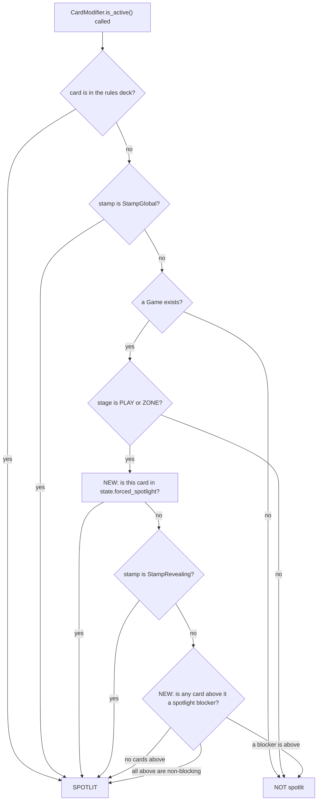

- **A6** is the entire new mechanical fork. Placed AFTER the stage check on purpose: a card that has
  left the board cannot be force-spotlit by a stale entry.
- **A8** is today's `game.is_data_topmost(data)` restated as the general rule the card catalogue
  already assumes (`Ghost Light`, `Kuroko` — cards that do not block the spotlight beneath them).
  Shipping it as "is anything above me that blocks" instead of "am I last" costs nothing now and is
  the only form those cards can ever be built on. **Q9** decides whether it goes in now or later.

**Q6** — does the forced spotlight bypass `blocks_spotlight` (A6 before A8, as drawn), or is a
forced spotlight still blockable? *Default: bypass — the beam is literally pointed at it.*

---

## 4. Flowchart B — activation edges (who gets told, and when)

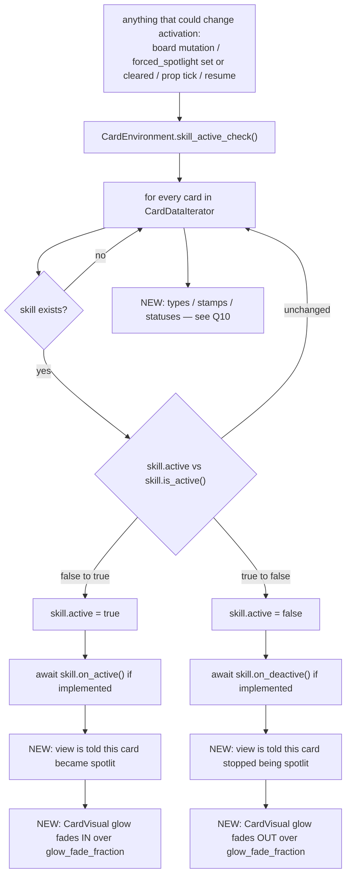

- **B14** is the asymmetry from §1.1: today only skills have an activation flag and activation
  hooks. Types, stamps and statuses fire unconditionally. **Q10** decides whether Spotlight is
  extended to gate them (a real balance change to shipped cards) or stays skill-only.
- **B10/B11** are how the glow learns. The alternative — the view polling `is_active()` per card per
  frame — is rejected: it is an O(board) walk per frame for a fact that changes on a signal.
- ⚠ Because `skill_active_check` runs after *every* mod call, a card can flicker in and out of
  spotlight several times inside one line if an effect moves cards. **Q12** decides whether the
  glow honours that literally or is damped.

---

## 5. Flowchart C — Submit, top level, with the new phases spliced in

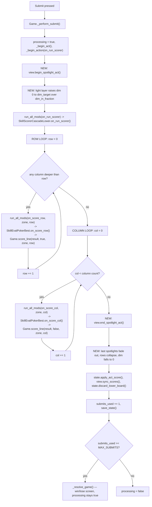

Open forks in this chart:

- **C8 empty row:** the loop breaks at the first fully-empty row. A row where only ONE column is
  deep enough still scores, and today `SkillEvalPokerBest` scores a 1-card high card. Does a 1-card
  line get the full spotlight treatment? **Q33**
- **C9 no meld:** `on_score_row` early-returns when `results` is empty, so `score_line` — and
  therefore the whole spotlight phase — never runs for that line. Is that correct? **Q34**
- **C15/C16 ordering:** the dim comes down BEFORE `apply_act_score` / `discard_lower_board`, so the
  board is still populated while the lights fall. Or after, so the discard sweep happens in the
  dark. **Q78**
- **A cancelled act** (undo mid-submit) short-circuits at `score_line`'s first line and jumps to
  `_restore_pre_act_board`. C15/C16 must still run. **Q151**

---

## 6. Flowchart D — ONE LINE'S SPOTLIGHT PHASE (the core of the feature)

This is the new work. It sits INSIDE `Game.score_line`, before the existing meld jump.

```mermaid
flowchart TD
  D1["Game.score_line(result, is_row, zone, index) entered"] --> D2{"act_cancelled?"}
  D2 -- yes --> D99["return — no spotlight, no scoring"]
  D2 -- no --> D3["NEW: determine the SPOTLIGHT SET for this line"]
  D3 --> D4["NEW: determine the REVEAL SET — which board rows must expand
             to make every member of the spotlight set fully visible"]
  D4 --> D5{"NEW: reveal set empty
             OR skip tunable says nothing here can react?"}
  D5 -- skip --> D8
  D5 -- expand --> D6["NEW: PlayArea grows each reveal row's gap
                       to a full card, tweened over reveal_fraction"]
  D6 --> D7["NEW: await the reveal settle
             (cards ease to their new anchors)"]
  D7 --> D8["NEW: spotlight TRANSITION — chart E
             (assign / travel / spawn / retire)"]
  D8 --> D9["NEW: await every spotlight to arrive on its target"]
  D9 --> D10["NEW: state.forced_spotlight = the spotlight set
              (per-act state, bumps nothing else)"]
  D10 --> D11["await skill_active_check()"]
  D11 --> D12["on_active fires for every card that was NOT already spotlit,
               in board order"]
  D12 --> D13["NEW: await spotlight_hold — the beat that lets those effects read"]
  D13 --> D14["EXISTING: view.animate_meld(result) -> popup_meld -> anim_jump per meld card"]
  D14 --> D15["EXISTING: Game.add_line_score(...) + register_combo(...)"]
  D15 --> D16["EXISTING: view.show_meld_score(result) -> popup_score"]
  D16 --> D17["EXISTING: Game._run_score_effects(result)
               -> suit prop spawners -> run_props tick loop
               -> on_score per meld card -> on_after_score"]
  D17 --> D18["EXISTING: view.reset_meld(result) -> anim_reset"]
  D18 --> D19{"NEW: is there a next line?"}
  D19 -- yes --> D20["NEW: HOLD — forced_spotlight stays set,
                      rows stay expanded, dim stays up"]
  D20 --> D21["next score_line re-enters at D1;
               chart E decides what travels where"]
  D19 -- no --> D22["NEW: clear state.forced_spotlight"]
  D22 --> D23["await skill_active_check() -> on_deactive for the released cards"]
  D23 --> D24["NEW: collapse every expanded row over reveal_fraction"]
  D24 --> D25["NEW: retire every spotlight, drop the dim (chart C, C16)"]
```

### The forks inside D

- **D3 — what is in the spotlight set?** Whole line vs meld only vs "only cards that can react".
  **Q31, Q32, Q35–Q42.**
- **D5 — the skip tunable.** Owner: *"Make that a tunable for row and col separately to skip
  expanding a row if there is no inactive spotlight card to activate."* Two independent booleans.
  What counts as "can react" is **Q47** and it is subtle: a card with no `on_active` handler at all
  cannot react, but a card whose handler is conditional might.
- **D10 vs D12 ordering.** The forced flag is set for the WHOLE set at once, then one
  `skill_active_check` sweep fires every `on_active` in board order. The alternative — set and
  activate one card at a time, so the beams light up one after another — is **Q37**.
- **D12 side effects.** An `on_active` handler may move or discard cards. That mutates the very line
  being scored, AFTER the meld was already evaluated by `SkillEvalPokerBest`. **Q22–Q26.**
- **D13 hold.** Owner: *"triggering spotlight effects first before any scoring happens."* The hold
  is what makes that readable. Length is a tunable fraction; **Q68**.
- **D19/D20 hold-through.** Not collapsing between lines is what makes the light *travel* instead of
  strobing. But it means rows expanded for row 0 stay expanded while row 1 scores — the board keeps
  growing through the cascade. **Q49, Q50.**

---

## 7. Flowchart E — the spotlight transition between lines

The rule from the brief: *"spotlights spawned during scoring phase need to move their spotlights to
next row/col after done with current set, no instant movements or spawning in and out."*

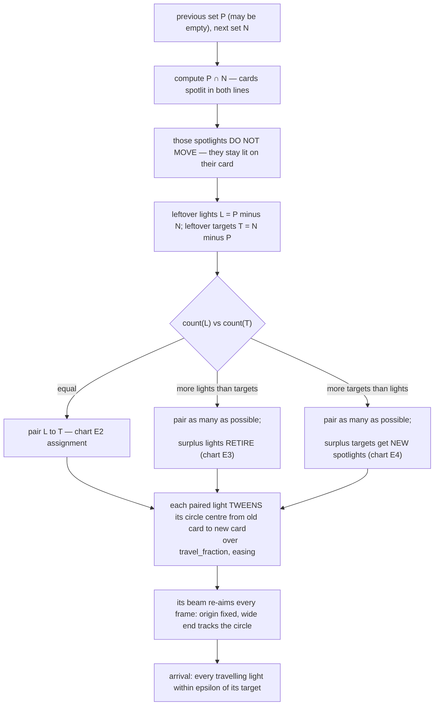

**E2 — the assignment rule** (which leftover light goes to which leftover target):

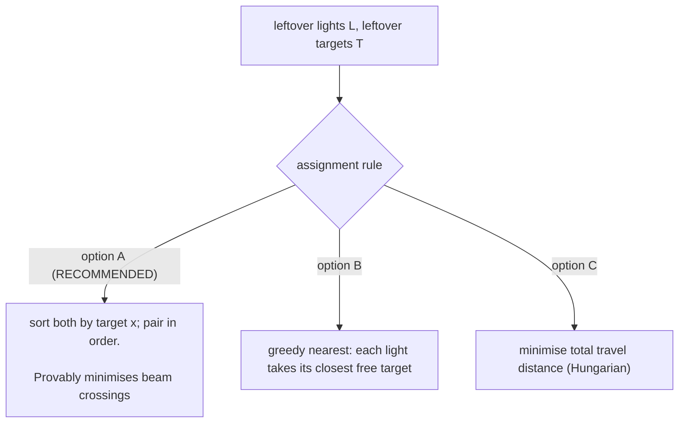

**E3 — retiring a surplus light:** fade the circle and beam to zero over `retire_fraction`, in
place, on the card it was already on. Its ORIGIN is released back to the allocator (or not — **Q109**).

**E4 — spawning a new light:** the allocator hands it an origin (chart G), then it either
(i) fades in already aimed at its target, or (ii) travels in from the origin down the beam.
**Q65.**

Unanswered structure in E:

- **Q61** — is E3 (same card spotlit in two consecutive lines keeps its light) right, or should the
  whole set re-shuffle every line so the lights spread evenly?
- **Q63** — a light that travels: does its circle shrink/dim in transit, or hold full size?
- **Q64** — do lights travel simultaneously, or staggered left-to-right?
- **Q66** — a travelling light passes over cards that are not its target. Do they flicker as it
  crosses, or is the circle only "on" at its endpoints?

---

## 8. Flowchart F — what a card looks like, moment by moment

A card's appearance is the composition of five independent inputs. This chart is the truth table.

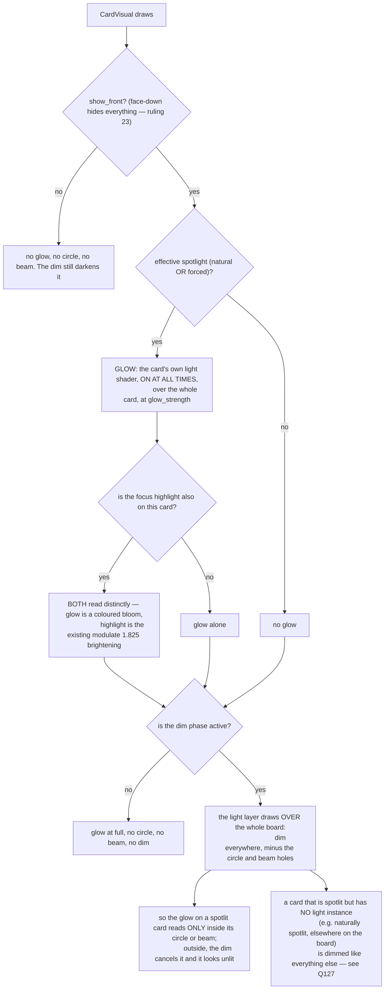

- **G6** — owner: *"cards under spotlight effect have glow shader at all times on entire card.
  Circle and beam parts are only visible during dim screen."*
- **G8** — owner: *"cards under spotlight effect get lit up by shader separately from hover
  highlight, so we know it is active even when covered up it should be visible that card is both
  spotlighted and highlighted."* The two must be distinguishable when both are on: **Q121–Q124**.
- **G13** falls out of the layering for free: the glow lives on the card, UNDER the light layer, so
  the dim multiplies it. No extra machinery needed. This is why the light layer is one screen-space
  surface and not a pile of per-beam nodes.
- **G14** is a real decision, not an oversight: a card that is naturally spotlit (uncovered,
  anywhere on the board) glows all the time — but during the dim phase, with no beam on it, it
  goes dark like everything else. **Q127.**

---

## 9. Flowchart G — the light layer's render model

One full-screen surface. It is handed a list of live spotlights and produces the dim, the circles
and the beams in one pass.

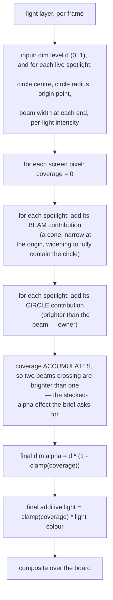

Consequences of this model, stated so they can be rejected:

1. **Everything under the layer is dimmed uniformly** — cards, props, the score popups, the prop
   simulation, the HUD if the layer covers it. Which of those are under it is **Q73–Q77**.
2. **Overlaps get brighter for free** and cannot be turned off independently of the model. If two
   beams cross, that region is brighter than either alone; if the sum exceeds 1 the dim is fully
   punched through and the additive term keeps climbing (or clamps — **Q101**).
3. **There is a hard cap on simultaneous spotlights** (a uniform array). Exceeding it must have a
   defined behaviour: **Q107**.
4. The layer does NOT scroll with the board; it is screen-space. The spotlight positions it is fed
   are converted from board space every frame, which is what makes chart H work.

---

## 10. Flowchart H — beam origins, the allocator, and scrolling

The brief's rules, restated: origins are spread evenly across the top of the screen; an origin
never moves once assigned during a dim phase; extra spotlights take midpoints between existing
origins, chosen randomly; when the midpoints run out, the set doubles and the process repeats.

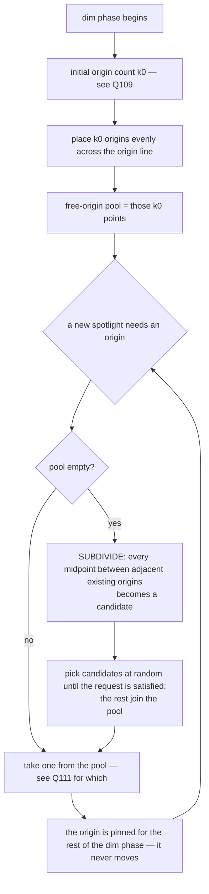

**The origin line itself** is the hard part, and the brief contains two readings that cannot both
be true. Reading them out:

- *"beam origins spread out from across top of screen"* + *"dummy screen size to dictate beam
  origins"* → the origin line is the **top edge of the viewport**, in SCREEN space.
- *"We fake beam origins are static points along board length, so as we scroll down, beam circle
  and origins disappear upwards, new beams and circles spawn from bottom sides of screen and move
  upwards as we scroll down"* + *"fake origin is always higher than its spotlighted card location"*
  → the origin line is a horizontal line in **BOARD/content space**, a fixed distance above the
  card it lights, and it scrolls with the board.

Three concrete models, exactly one of which gets built (**Q113**):

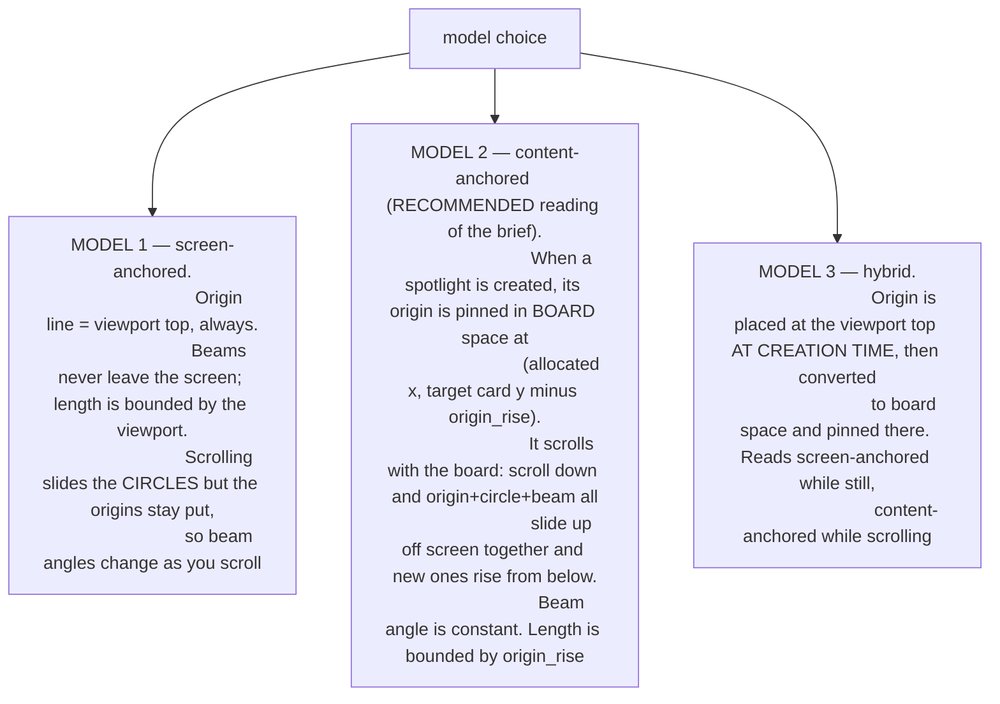

**Deep boards.** The brief flags it: *"if board is extremely deep, spotlights can be extremely far
away and cause incredibly long beams."* Under Model 1 a spotlight 4000 px down the board produces a
4000 px beam at a near-vertical angle. Under Models 2 and 3 the beam is always `origin_rise` long,
which solves it structurally. If Model 1 is chosen, the mitigation is **Q118**.

**Scroll behaviour during the dim phase** is **Q115–Q117**: whether the board auto-scrolls to keep
the scoring line on screen, whether the player may scroll at all while scoring, and what a spotlight
whose target is entirely off screen does.

---

## 11. Flowchart I — the reveal (per-row expansion)

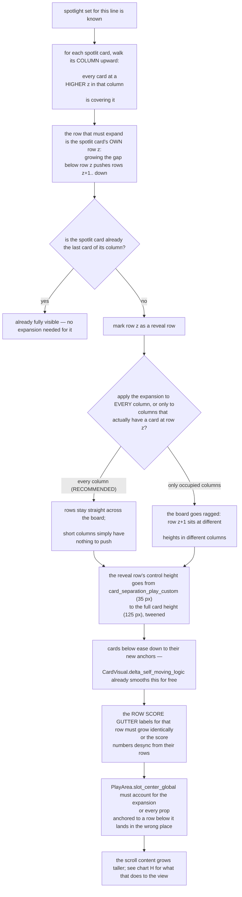

- **K3** is the geometry from §1.2: cards at higher z are drawn later and lower, i.e. "on top" both
  in draw order and in the sense the brief uses. Expanding *this* row's gap pushes *those* away.
- **K7** — the brief says row scoring expands that one row and column scoring expands *every*
  participating card's row ("which yes means expanding entire board if that column is longest").
  Whether the expansion is board-wide per row is **Q51**.
- **K12/K13** are the two things that will silently break if not designed for; both are called out
  as questions (**Q57**, **Q59**) rather than assumed.
- **K10** — full card height, or only enough to clear the art square (which is what the circle
  needs)? The art square's bottom edge is 102.5 px down, so ~103 px reveals the circle but leaves
  the card's bottom 22 px covered. **Q52.**

---

## 12. Flowchart J — interruptions and edge cases

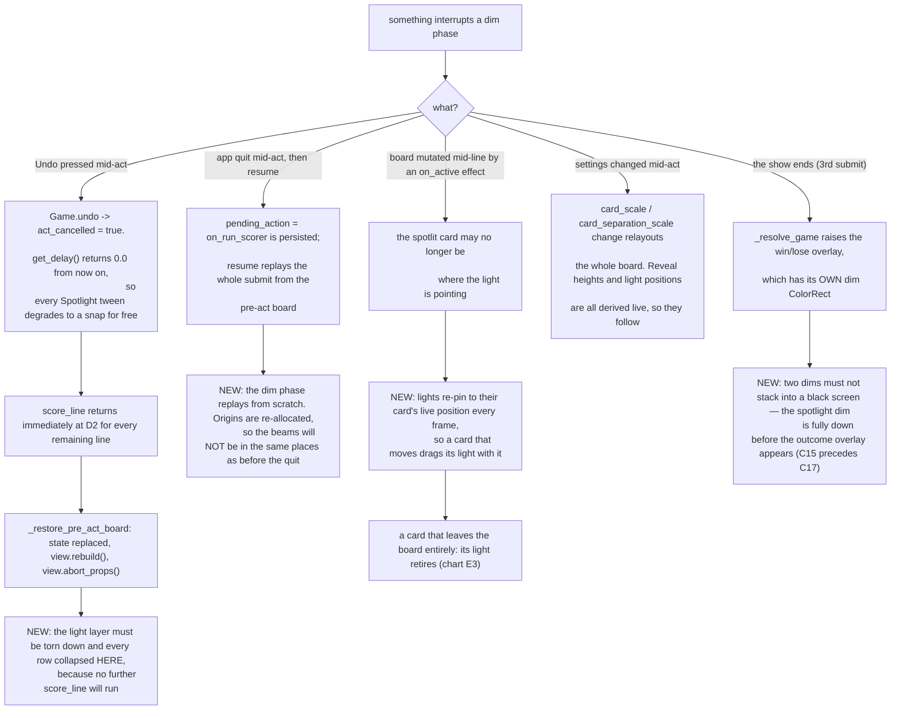

Additional edge cases enumerated as questions rather than drawn:

- Headless (`view == null`): the mechanical spotlight must fire identically, with zero visuals and
  zero waits. **Q19.**
- Act compression: after ~50 activations `get_delay()` shrinks toward zero and past
  `compress_soft_calls` it is exactly 0. A long cascade's spotlight phases become instant.
  **Q158.**
- The runaway cap (`act_event_cap`) cuts an act short. **Q159.**
- A card grabbed by the player while the board is not processing — irrelevant during scoring
  (input is locked) but relevant to the natural spotlight glow. **Q145.**
- Two spotlights land on the same card (a card in both a row set and a col set — impossible within
  one line, possible across lines). **Q62.**

---

## 13. Flowchart K — the non-scoring spotlight (normal play)

Everything above is the scoring cascade. The glow also has a life outside it.

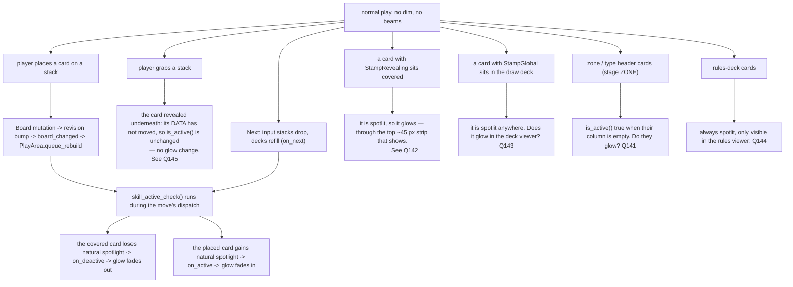

---

## 14. Flowchart L — the tuning tool

The brief asks for two things that are not the same tool:

- *"add new editor similar to fx editor as effect in next column with parameters for tuning, with
  dummy card stack simulating exactly how it looks in game, and dummy screen size to dictate beam
  origins"*
- *"should be like fx editor, but simulate every possible usage of spotlight with a stubbed game
  view gameplay going through every possible usage of spotlight. Include a way to select which type
  of usage is being tested."*

The first is a tuning column; the second is a scenario player. **Q173** picks one, both, or a
staged pair. The standing project rule that decides most of the rest: *no mocks in tools — the tool
hosts the real scene and real data* (this is why `fx_editor` stands up a real `CardVisual` and real
`PropVisual`s).

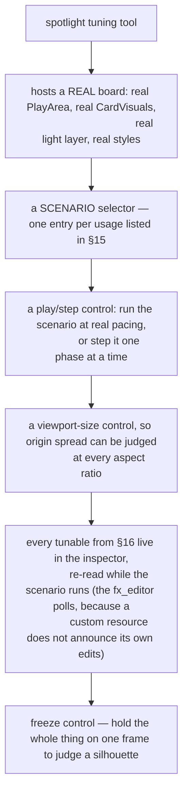

**Scenarios the tool must be able to play** (this list is itself reviewable — **Q182**):

| # | Scenario | What it proves |
|---|---|---|
| S1 | One shallow row, every card already uncovered | The no-expansion path |
| S2 | One row where every card is buried under 3 | The full reveal, board-wide |
| S3 | Row scoring across 5 rows in sequence | Travel between lines, hold-through |
| S4 | Column scoring on the longest column | The whole-board expansion case |
| S5 | Rows then columns, full cascade | The complete act |
| S6 | A line with more spotlights than initial origins | The subdivision allocator |
| S7 | A very deep board, scoring a row near the bottom | Long beams / scrolling |
| S8 | Two spotlights on stacked cards in one column | Unavoidable beam overlap |
| S9 | A card with StampRevealing / StampGlobal in the line | Already-spotlit skip logic |
| S10 | An `on_active` effect that moves a card mid-line | Lights re-pinning |
| S11 | Undo pressed mid-cascade | Snap-and-teardown |
| S12 | Normal play, no scoring | The glow-only path |
| S13 | Hover + spotlight on the same card | The two highlights reading distinctly |
| S14 | `fx_intensity = 0` | The accessibility floor |

---

## 15. Every usage of Spotlight, enumerated

The completeness claim of this document rests on this table. **If a usage is missing, that is the
most valuable thing you can tell me.**

| # | Usage | Mechanical | Visual | Covered by |
|---|---|---|---|---|
| U1 | Card is uncovered on the board | natural spotlight | glow | Chart A, M |
| U2 | Card is covered | not spotlit | none | Chart A |
| U3 | `StampRevealing` while covered | spotlit | glow through the visible strip | Q142 |
| U4 | `StampGlobal` anywhere | spotlit | glow, in every view? | Q143 |
| U5 | Rules-deck card | spotlit | glow in the rules viewer? | Q144 |
| U6 | Zone/type header, empty column | spotlit | glow? | Q141 |
| U7 | Row being scored | forced spotlight | dim + reveal + beams | Chart D |
| U8 | Column being scored | forced spotlight | dim + reveal + beams | Chart D |
| U9 | Line→line handover | forced set changes | lights travel | Chart E |
| U10 | Act begins / ends | — | dim raises / falls | Chart C |
| U11 | Card face-down | — | nothing (ruling 23) | Chart F |
| U12 | Card hovered/focused AND spotlit | — | both, distinct | Q121 |
| U13 | Card grabbed and held | ? | ? | Q145 |
| U14 | Card in the deck / discard / choice viewer | ? | ? | Q143, Q147 |
| U15 | Card on the map screen | ? | ? | Q148 |
| U16 | Undo mid-cascade | forced cleared | snap teardown | Chart J |
| U17 | Resume mid-cascade | forced replays | dim replays | Chart J |
| U18 | Headless | forced fires | nothing | Q19 |
| U19 | `on_active` effect mutates the board mid-line | spotlight set may go stale | lights re-pin | Chart J |
| U20 | A future `Ghost Light` / `Kuroko` card | does not block spotlight beneath | the card beneath glows while covered | Q9 |
| U21 | The QOL "show all abilities" board-spread toggle (DESIGN_DOC §7) | — | reuses the reveal machinery | Q186 |

---

## 16. Proposed tunables

All of these belong in `Scripts/player_settings.gd` (project rule: shared adjustable knobs live
there, and every duration is a FRACTION of `get_delay()`, never wall-clock). Listed so you can
delete the ones you do not want and add the ones I missed — **Q166–Q172**.

**Timing (fractions of `get_delay()`)**

| Knob | Meaning | Suggested |
|---|---|---|
| `spotlight_dim_in_fraction` | dim 0 → target at act start | 0.5 |
| `spotlight_dim_out_fraction` | dim → 0 at act end | 0.5 |
| `spotlight_reveal_fraction` | a row's expand / collapse | 0.4 |
| `spotlight_travel_fraction` | a light moving card → card | 0.5 |
| `spotlight_spawn_fraction` | a new light fading in | 0.3 |
| `spotlight_retire_fraction` | a surplus light fading out | 0.3 |
| `spotlight_hold_fraction` | the beat after `on_active` before scoring | 0.5 |
| `spotlight_glow_fade_fraction` | glow in/out on activation change | 0.3 |

**Behaviour**

| Knob | Meaning | Suggested |
|---|---|---|
| `spotlight_expand_rows` | expand for ROW lines at all | true |
| `spotlight_expand_cols` | expand for COLUMN lines at all | true |
| `spotlight_skip_row_if_no_reactor` | skip a row expansion when nothing there can react | true |
| `spotlight_skip_col_if_no_reactor` | same for columns | true |
| `spotlight_max_lights` | the light layer's uniform-array cap | 16 |
| `spotlight_initial_origins` | k0 for the allocator | 4 |

**Look** (these belong on a `FxSpotlightStyle` resource beside the other FX styles, not in
settings — §4g owner ruling 8: one shared location for all effect tuning)

| Knob | Meaning | Suggested |
|---|---|---|
| `dim_target` | how dark the dim goes | 0.75 |
| `circle_radius` | in ART units | 16 |
| `circle_intensity` | brighter than the beam | 1.0 |
| `beam_intensity` | | 0.45 |
| `beam_width_at_origin` | art units | 4 |
| `beam_width_at_target` | must cover the circle | 34 |
| `beam_softness` | edge falloff | — |
| `origin_rise` | how far above its target an origin sits (Models 2/3) | 600 px |
| `glow_strength` | the card glow | — |
| `glow_falloff` | the card glow's reach | — |
| `light_colour` / `light_ramp` | see Q134 | — |

---

## 17. THE QUESTIONNAIRE (a decision DAG — see §0)

**Start at §17.0.** Gates are in backticks; `[root]` means always asked. *default* is a complete
answer. `notes` means the options may not cover it and free text is welcome.

### 17.0 ROOT FORKS — answer these first

These eight gate most of the document.

- **QR1** `[root]` ⚑gate — Today, a card's abilities only fire while it is uncovered on the board. During scoring, should the cards being scored genuinely COUNT as uncovered — so their abilities fire even if they are buried — or is the spotlight only a light show? · **(a)** mechanical and visual: a scored card really becomes active and its abilities trigger before the hand scores — **→ next:** ~22 questions on what fires, in what order, what happens when an ability moves a card mid-scoring, undo, headless · **(b)** visual only: the lights are theatre, nothing about activation changes — **→ next:** none of that; straight to what gets lit and how it looks · *default* (a) · notes ⇒ (b) skips §17.2 and most of §17.3
- **QR2** `[root]` ⚑gate — During scoring, does the rest of the screen go dark so the lit cards stand out? · **(a)** yes, the house lights go down for the whole submit — **→ next:** ~12 questions on what the darkness covers (HUD, props, popups), how dark, and accessibility · **(b)** no, lights over a normally-lit board — **→ next:** none of that · *default* (a) · notes ⇒ (b) skips §17.6
- **QR3** `[root]` ⚑gate — A theatrical spotlight is two things: a bright circle on the card, and the visible cone of light reaching it from a lamp. Which do you want? · **(a)** both — circle on the card, beam from above — **→ next:** ~24 questions on beam shape, where the lamps sit, what happens on a deep board, overlapping beams · **(b)** circle only, no visible beam — **→ next:** none of that; much shorter · **(c)** beam only, no distinct brighter circle — **→ next:** the beam questions but not the circle ones · *default* (a) · notes ⇒ (b) skips §17.8 and §17.9 (24 questions)
- **QR4** `[root]` ⚑gate — Stacked cards cover each other: a buried card shows only its top ~45 px of 125, so a light on it would fall almost entirely on the card in front. Should the board push its rows apart to uncover a card before lighting it? · **(a)** yes, rows slide apart so the lit card is fully visible, then close again — **→ next:** ~18 questions on how far it opens, whether the whole board or one column moves, and what that does to score labels and props · **(b)** no, the light lands on whatever part of the card happens to be visible — **→ next:** none of that · *default* (a) · notes ⇒ (b) skips §17.4 (18 questions)
- **QR5** `[root]` ⚑gate — Separately from the scoring show: should every card whose abilities are currently live carry a soft glow the whole time, so you can see at a glance which cards are doing something? · **(a)** yes, always on, during normal play as well as scoring — **→ next:** ~21 questions on what the glow looks like, how it reads next to the hover highlight, and which screens show it · **(b)** only while a scoring dim is up — **→ next:** the look questions but none about normal play · **(c)** no glow at all; the circles and beams are the only lighting — **→ next:** none of that · *default* (a) · notes ⇒ (c) skips §17.10 and §17.12 (21 questions)
- **QR6** `[root]` ⚑gate — Should a tuning tool be built alongside this — a scene that plays every spotlight situation on a real board so you can tune it by eye, like the existing FX editor? · **(a)** in scope, built alongside the feature — **→ next:** ~10 questions on what it hosts and which situations it must be able to replay · **(b)** follow-up; ship the feature first and tune it in-game — **→ next:** none of that · *default* (a) · notes ⇒ (b) skips §17.15
- **QR7** `[root]` ⚑gate — Scoring moves from row to row and then column to column. When it moves on, does a light TRAVEL from the old card to the new one, or does one set fade out and another fade in? · **(a)** travel — the same lamp swings across, which is what a real followspot does — **→ next:** ~12 questions on how they travel, which light goes to which card, and what happens when the counts do not match · **(b)** fresh set each line, fade out and in — **→ next:** almost none of that · *default* (a) · notes ⇒ (b) skips most of §17.5
- **QR8** `[root]` ⚑gate — Does the lighting follow the scorer line by line, or does everything that is going to be scored light up at once and stay lit? · **(a)** per line — the light follows the scorer, row by row then column by column · **(b)** once per act — the whole board lights up at the start of the submit and holds — **→ next:** the travel and per-line-timing questions stop applying · *default* (a) · notes ⇒ (b) collapses §17.5 and much of §17.4

### 17.1 Naming and scope

- **Q1** `[root]` — Is the player-facing name **Spotlight**? · **(a)** yes · **(b)** something else · *default* (a) · notes
- **Q2** `[root]` — Is the internal name renamed from `active` to `spotlight`? · **(a)** name the new surfaces spotlight, leave `CardModifierSkill.active` alone · **(b)** rename everything · **(c)** keep `active` everywhere, Spotlight is only a UI word · *default* (a)
- **Q3** `[QR1=a]` — Is the forced/scoring variant a distinct concept the player is told about? · **(a)** no, it is just Spotlight · **(b)** yes, it is named separately · *default* (a)
- **Q4** `[Q3=b]` — Does card text distinguish "while spotlit" from "while forced"? · **(a)** yes · **(b)** no · *default* (b)
- **Q5** `[root]` — A Spotlight icon in card descriptions (DESIGN_DOC §7 asks for one)? · **(a)** out of scope here, noted in DESIGN_DOC · **(b)** in scope · *default* (a)
- **Q6** `[QR1=a]` — Forced spotlight bypasses blocking (A6 before A8)? · **(a)** yes, the beam is literally on it · **(b)** no, a blocker still suppresses it · *default* (a)
- **Q7** `[root]` — The upper zone, given only the lower zone is ever scored · **(a)** natural glow and dimming, never a beam · **(b)** fully excluded, not even dimmed · **(c)** beams too, somehow · *default* (a) · notes
- **Q8** `[root]` — Do zone/type header cards participate? · **(a)** no beams on headers · **(b)** headers are lit like any other card · *default* (a)

### 17.2 The mechanical rule `[QR1=a]`

- **Q9** `[QR1=a]` — Ship the general `blocks_spotlight` seam (A8) now, or keep `is_data_topmost`? · **(a)** ship the seam now — same cost, and the only shape Ghost Light / Kuroko can be built on · **(b)** keep `is_data_topmost`, add the seam with those cards · *default* (a)
- **Q10** `[QR1=a]` — Does Spotlight gate **types, stamps and statuses** as well as skills (B14)? Today they fire regardless of coverage. · **(a)** no — skills only, as today · **(b)** yes — all four modifier kinds · *default* (a) · notes ⇒ (b) is a balance change to every shipped card
- **Q11** `[QR1=a]` — What hook does a forced spotlight fire? · **(a)** `on_active`, the existing one · **(b)** a new `on_spotlight` distinct from `on_active` · *default* (a)
- **Q12** `[QR5≠c]` — `skill_active_check` runs after every mod call, so a card can flicker spotlit several times inside one line. Does the glow follow that literally? · **(a)** no, minimum on-time damps it · **(b)** yes, literally · *default* (a)
- **Q13** `[QR1=a]` — A card force-spotlit that was ALREADY naturally spotlit — does anything fire? · **(a)** nothing, it never changed state · **(b)** it re-fires · *default* (a)
- **Q14** `[QR1=a]` — On release, a card still naturally spotlit must NOT fire `on_deactive`. · **(a)** confirmed, the release recomputes · **(b)** blanket-clear and let it re-activate · *default* (a)
- **Q15** `[QR1=a]` — A card force-spotlit twice in one act (row pass, then column pass) · **(a)** `on_active` fires once per transition — nothing the second time if it stayed spotlit · **(b)** fires every time it is force-spotlit · *default* (a)
- **Q16** `[QR1=a & QR8=a]` — Does the forced spotlight persist for the whole act or only its line? · **(a)** only its line · **(b)** the whole act, accumulating · *default* (a)
- **Q17** `[QR1=a]` — Does forced spotlight bump `GameData.revision`? · **(a)** no — not a board mutation, and a bump forces a rebuild mid-cascade · **(b)** yes · *default* (a)
- **Q18** `[QR1=a]` — Does forced spotlight survive undo? · **(a)** no, per-act state · **(b)** yes · *default* (a)
- **Q19** `[QR1=a]` — Headless: does the mechanical spotlight fire identically, with no waits? · **(a)** yes — otherwise headless scoring diverges and the resume-replay contract breaks · **(b)** no, headless skips it · *default* (a)
- **Q20** `[QR1=a]` — Do spotlight-triggered activations register combo classes (§15a U)? · **(a)** yes, they count · **(b)** no, they are excluded · *default* (a)
- **Q21** `[QR1=a]` — Do they touch patience? · **(a)** no (patience is already inactive during a submit) · **(b)** yes · *default* (a)
- **Q22** `[QR1=a]` — An `on_active` handler moves a card out of the line. Does the score use the ORIGINAL meld? · **(a)** yes, the meld is fixed before the spotlight phase · **(b)** no, re-evaluate · *default* (a) ⇒ (a) skips Q23
- **Q23** `[Q22=b]` — When is the meld re-evaluated? · **(a)** after all spotlight effects fire, once · **(b)** after each card's effect · *default* (a) · notes
- **Q24** `[QR1=a]` — An `on_active` handler discards a card that is in the meld · **(a)** its light retires, its jump is skipped, the score is unchanged · **(b)** the score is recomputed without it · *default* (a)
- **Q25** `[QR1=a]` — May `on_active` handlers mutate the board during scoring? · **(a)** no, they defer (ruling B10) · **(b)** yes, immediately · *default* (a) ⇒ (b) skips Q26
- **Q26** `[Q25=a]` — When does the deferred work run? · **(a)** after the line, before the next line · **(b)** at the very end of the act · *default* (a)
- **Q27** `[QR1=a & QR8=a]` — Do activations happen per line (chart D) or for the whole act up front? · **(a)** per line · **(b)** whole act up front · *default* (a)
- **Q28** `[QR1=a]` — Is there a MECHANICAL cap on simultaneously force-spotlit cards? · **(a)** no · **(b)** yes, a number · *default* (a)
- **Q29** `[QR1=a]` — Does being spotlit make a card targetable or interactable in any new way? · **(a)** no · **(b)** yes · *default* (a) · notes
- **Q30** `[QR1=a]` — Will content ever QUERY "is this card spotlit" (a card reading "while 3 cards are spotlit")? · **(a)** not in this plan, but the state is queryable so it is possible later · **(b)** yes, design the query surface now · *default* (a)

### 17.3 What is in the spotlight set

- **Q31** `[root]` — **THE BIG ONE.** What is the spotlight set for a line? · **(a)** every card in the line · **(b)** only the cards in `result.meld` (the best hand) · **(c)** every card in the line is lit, but only the meld cards jump · *default* (a) — the brief says "cards in that specific row", and (b) leaves most of a scored row dark while it is being evaluated · notes
- **Q32** `[Q31=a|c]` — A 5-card row whose meld is a 2-card pair: all 5 get beams, 2 jump. Intended? · **(a)** yes · **(b)** no, rethink · *default* (a)
- **Q33** `[root]` — A line with exactly one card (ragged row, 1-card column) · **(a)** full treatment, no special case · **(b)** skipped, not worth a cue · *default* (a)
- **Q34** `[root]` — A line that produces NO meld never reaches `score_line`, so it silently gets no spotlight · **(a)** correct — nothing was evaluated, nothing is spotlit · **(b)** wrong, it should still light up · *default* (a)
- **Q35** `[root]` — A card in the line that is ALREADY spotlit — does it still get a beam and circle? · **(a)** yes, it is being evaluated like the rest · **(b)** no, only newly-spotlit cards get lights · *default* (a)
- **Q36** `[QR4=a & Q35=a]` — Confirm the skip tunable and the beam are independent: skipping the EXPANSION does not skip the LIGHT · **(a)** independent, confirmed · **(b)** no, skipping should skip both · *default* (a)
- **Q37** `[root]` — Do a line's beams arrive simultaneously, or one at a time with each card's `on_active` firing as its beam lands? · **(a)** simultaneously · **(b)** one at a time, left to right · *default* (a) — (b) multiplies cascade length by line width
- **Q38** `[QR3≠b]` — Beam-to-target assignment rule · **(a)** order-preserving (sort by x, pair in order) — provably fewest crossings · **(b)** greedy nearest · **(c)** minimum total travel · *default* (a)
- **Q39** `[root]` — A COLUMN line spans many rows. Every card in it gets its own beam? · **(a)** yes · **(b)** no, one beam for the whole column · *default* (a)
- **Q40** `[root]` — For a column line, does the column's own top card (already visible) count in the set? · **(a)** yes · **(b)** no · *default* (a)
- **Q41** `[root]` — Do zone/type header cards ever join a line's set? · **(a)** no · **(b)** yes · *default* (a)
- **Q42** `[Q7≠c]` — Does the upper zone ever get a beam? · **(a)** no · **(b)** yes · *default* (a)

### 17.4 The reveal `[QR4=a]`

- **Q43** `[QR4=a]` — How far does a row expansion open? · **(a)** the FULL card height (matches the existing held-stack expansion) · **(b)** only enough to clear the 32×32 art square (~103 px of 125) · **(c)** a tunable fraction · *default* (a) · notes
- **Q44** `[QR4=a]` — Reveal before the lights arrive (D6 → D8) or simultaneously? · **(a)** before — the light lands on an already-visible card · **(b)** simultaneously · *default* (a)
- **Q45** `[QR4=a & QR2=a]` — Reveal before or after the dim rises? · **(a)** after — the dim rises once at act start, reveals happen inside it · **(b)** before · *default* (a)
- **Q46** `[QR4=a]` — Is `expand_rows` / `expand_cols` (two independent booleans) the right granularity? · **(a)** yes · **(b)** one shared boolean · **(c)** finer than that · *default* (a) · notes
- **Q47** `[QR4=a]` — What counts as "a card that can react", for the skip tunable? · **(a)** not already spotlit · **(b)** not already spotlit AND its skill implements `on_active` · **(c)** (b) plus type/stamp/status hooks · *default* (b) — (c) only makes sense if Q10=(b)
- **Q48** `[QR4=a]` — If NO card in a line can react · **(a)** it still gets lights, just no expansion — the audience still watches the hand · **(b)** the line is skipped entirely, no lights either · *default* (a)
- **Q49** `[QR4=a & QR8=a]` — Between lines, do expanded rows collapse? · **(a)** collapse the rows the next line does not need · **(b)** stay expanded until the whole cascade ends · *default* (a) — (b) grows the board monotonically through the act ⇒ (b) skips Q50
- **Q50** `[Q49=a]` — Collapsing and re-expanding shared rows will visibly bounce · **(a)** hold shared rows, collapse only the rest · **(b)** accept the bounce, it reads as motion · *default* (a)
- **Q51** `[QR4=a]` — Does a row expansion apply to every column, or only columns with a card in that row? · **(a)** every column — rows stay straight across the board · **(b)** only occupied columns — the board goes ragged · *default* (a)
- **Q52** `[QR4=a]` — Column scoring on the longest column expands nearly every row at once, roughly tripling board height · **(a)** accept (the brief says so explicitly) · **(b)** cap it somehow · *default* (a) · notes
- **Q53** `[QR4=a]` — Does the reveal push rows DOWN or pull the revealed card UP? · **(a)** down · **(b)** up · *default* (a) — up moves the card away from the light travelling to it
- **Q54** `[QR4=a]` — Does the board recentre so the expansion grows symmetrically? · **(a)** no, rows below simply move down · **(b)** yes, recentre · *default* (a)
- **Q55** `[QR4=a]` — All reveal rows expand at once, or staggered? · **(a)** at once · **(b)** staggered top to bottom · *default* (a)
- **Q56** `[QR4=a]` — Do the pushed-down cards react (shove, tilt)? The existing ease already tilts and bobs by travel · **(a)** whatever falls out of the existing ease · **(b)** an authored shove · **(c)** nothing, freeze them · *default* (a)
- **Q57** `[QR4=a]` — Row score gutter labels must expand with their rows or the numbers desync · **(a)** they follow exactly · **(b)** they stay put and desync is accepted · *default* (a)
- **Q58** `[QR4=a]` — Does the column score gutter (horizontal, along the bottom) need anything? · **(a)** no · **(b)** yes · *default* (a)
- **Q59** `[QR4=a]` — Props anchored to rows below an expansion must move with their rows · **(a)** confirmed, props stay glued to their slots · **(b)** props hold screen position · *default* (a)
- **Q60** `[QR4=a]` — Reveal vs the existing focus/hover expansion — which wins? · **(a)** the larger of the two · **(b)** spotlight always wins · **(c)** hover always wins · *default* (a)

### 17.5 Travel and transition `[QR7=a & QR8=a]`

- **Q61** `[QR7=a]` — A card spotlit in two consecutive lines keeps its own light (E3)? · **(a)** yes · **(b)** no, the whole set re-shuffles each line to spread the lights evenly · *default* (a)
- **Q62** `[QR3≠b]` — Can two lights ever target the same card? · **(a)** no, one light per card, enforced · **(b)** yes, they stack and brighten · *default* (a)
- **Q63** `[QR7=a]` — Does a travelling light dim or shrink in transit? · **(a)** no, holds full size like a real followspot · **(b)** dims · **(c)** shrinks · *default* (a)
- **Q64** `[QR7=a]` — Do lights travel simultaneously or staggered? · **(a)** simultaneously · **(b)** staggered left to right · *default* (a)
- **Q65** `[QR3≠b]` — A NEW light appears · **(a)** fades in already aimed at its target · **(b)** travels in along its beam from the origin (reads as a searchlight sweep) · *default* (a)
- **Q66** `[QR7=a]` — Does a travelling light illuminate the cards it passes over? · **(a)** yes, incidentally — the light layer is positional · **(b)** no, the circle is only on at its endpoints · *default* (a) ⇒ (b) skips Q67
- **Q67** `[Q66=a & QR1=a]` — Does a card it passes over get force-spotlit MECHANICALLY? · **(a)** absolutely not — the mechanical set changes only at D10 · **(b)** yes · *default* (a)
- **Q68** `[root]` — Is there a beat (`spotlight_hold_fraction`) between the effects firing and the scoring jump? · **(a)** yes, ~half a delay · **(b)** no, straight into scoring · *default* (a)
- **Q69** `[QR7=a]` — A line's set is IDENTICAL to the previous line's · **(a)** nothing moves; the hold and scoring proceed · **(b)** re-cue anyway (blink) · *default* (a)
- **Q70** `[QR7=a]` — Between the row pass and the column pass (a whole change of axis) · **(a)** same transition machinery, no special case · **(b)** a distinct transition marks the axis change · *default* (a) · notes
- **Q71** `[root]` — The transition already waits for the previous line's props (`_run_score_effects` is awaited). No change? · **(a)** confirmed · **(b)** the next line's lights should start moving during the props · *default* (a)
- **Q72** `[root]` — Any audible or visual "cue" marker at the moment the set changes? · **(a)** out of scope (no audio in this plan) · **(b)** a visual cue, specify in notes · *default* (a) · notes

### 17.6 The dim `[QR2=a]`

- **Q73** `[QR2=a]` — Does the dim cover the **HUD** (buttons, score labels, deck/discard/rules)? · **(a)** yes · **(b)** no, the HUD stays lit · *default* (a)
- **Q74** `[QR2=a]` — Does the dim cover the **props** (the prop sim runs inside the dim phase)? · **(a)** no — props are performers, they stay lit (PropLayer draws above the light layer) · **(b)** yes, props dim with everything else · *default* (a) · notes
- **Q75** `[QR2=a]` — Does the dim cover the **score popups**? · **(a)** no, the number stays readable · **(b)** yes · *default* (a)
- **Q76** `[QR2=a]` — Does the dim cover the **focus inspector panel**? · **(a)** no · **(b)** yes · *default* (a)
- **Q77** `[QR2=a & QR5≠c]` — Does the dim cover the **card glow**? · **(a)** YES — this is the mechanism that makes the glow read only inside the circle and beam (G13) · **(b)** no, the glow punches through · *default* (a)
- **Q78** `[QR2=a]` — Does the dim fall before or after `discard_lower_board` sweeps the board? · **(a)** before — the sweep happens in the light · **(b)** after — the board clears in the dark · *default* (a)
- **Q79** `[QR2=a]` — Dim colour · **(a)** flat multiply toward a dark palette entry, not black · **(b)** a colour cast (cool blue "house lights down") · **(c)** pure black · *default* (a)
- **Q80** `[QR2=a]` — Texture? · **(a)** uniform · **(b)** vignette · **(c)** subtle noise · *default* (a)
- **Q81** `[QR2=a]` — Is the dim level constant through the act? · **(a)** constant · **(b)** deepens as the cascade proceeds · *default* (a)
- **Q82** `[QR2=a & QR8=a]` — Does the dim raise once per act (C5) or per line? · **(a)** once per act · **(b)** per line · *default* (a)
- **Q83** `[QR2=a]` — `fx_intensity = 0` (the accessibility floor) · **(a)** removes beams and glow, KEEPS a reduced dim — removing it entirely makes the mechanic invisible · **(b)** removes everything including the dim · **(c)** removes nothing, dim is not an "effect" · *default* (a) · notes
- **Q84** `[QR2=a]` — A separate player setting for dim depth (a 75 % dim every submit may be fatiguing)? · **(a)** yes, `dim_target` is a player setting · **(b)** no, style-resource only · *default* (a)

### 17.7 The circle `[QR3≠c]`

- **Q85** `[QR3≠c]` — Radius 16 art units, centred on the card's art-square centre? · **(a)** yes · **(b)** different radius (notes) · **(c)** centred somewhere else (notes) · *default* (a) · notes
- **Q86** `[QR3≠c]` — Does the circle scale with `card_scale`? · **(a)** yes, it is defined in art units · **(b)** no, fixed screen pixels · *default* (a)
- **Q87** `[QR3≠c]` — Edge · **(a)** soft falloff over the outer ~15 % · **(b)** hard-edged disc · *default* (a)
- **Q88** `[QR3=a]` — Circle vs beam brightness · **(a)** two independent knobs · **(b)** a fixed ratio · *default* (a)
- **Q89** `[QR3≠c]` — Does the circle pulse or flicker? · **(a)** no, steady followspot · **(b)** yes (notes) · *default* (a)
- **Q90** `[QR3≠c]` — Does the circle track the card's scoring jump (`anim_jump`, 10 art units)? · **(a)** yes, pinned to the card · **(b)** no, it stays where the card was · *default* (a)
- **Q91** `[QR3≠c]` — Does it track the card's idle float/bob? · **(a)** yes · **(b)** no · *default* (a)
- **Q92** `[QR3≠c]` — Does the circle clip at the play-area edge? · **(a)** no, screen-space, draws where it lands · **(b)** clipped to the board rect · *default* (a)

### 17.8 The beam `[QR3=a|c]`

- **Q93** `[QR3=a|c]` — Beam shape: narrow at the origin, widening to contain the circle at the card · **(a)** confirmed · **(b)** the other way round · **(c)** parallel-sided · *default* (a)
- **Q94** `[QR3=a|c]` — Width at the origin · **(a)** ~4 art units, so the lamp reads as a lamp · **(b)** effectively a point · *default* (a)
- **Q95** `[QR3=a]` — Width at the card · **(a)** slightly wider than the circle (34 vs 32) · **(b)** exactly the circle diameter · *default* (a)
- **Q96** `[QR3=a|c]` — Soft edges across the beam's width? · **(a)** yes · **(b)** hard edges · *default* (a)
- **Q97** `[QR3=a|c]` — Fade along the beam's length · **(a)** slight fade toward the lamp, stage end brightest · **(b)** brightest at the lamp · **(c)** even · *default* (a)
- **Q98** `[QR3=a|c]` — Volumetric texture (dust motes / the god-rays noise from the brief)? · **(a)** no for v1, clean cone first · **(b)** yes, from the start · *default* (a) ⇒ (a) skips Q99
- **Q99** `[Q98=b]` — Does the noise scroll? · **(a)** yes, slowly · **(b)** static · *default* (a)
- **Q100** `[QR3=a|c]` — Overlapping beams add and get brighter, including three or four on a stacked column · **(a)** confirmed, that is the ask · **(b)** no, take the max instead of the sum · *default* (a)
- **Q101** `[Q100=a]` — Does accumulated brightness clamp? · **(a)** clamp at 1 · **(b)** unclamped, blows out to white · *default* (a)
- **Q102** `[QR3=a|c]` — Do beams pass in front of or behind cards? · **(a)** in front of everything — a beam is light in the air · **(b)** behind cards, in front of the board · *default* (a)
- **Q103** `[QR3=a|c]` — Does a beam crossing a NON-spotlit card make it visible? · **(a)** yes, incidentally · **(b)** no, mask it to its target · *default* (a)
- **Q104** `[QR3=a|c]` — Beams crossing each other · **(a)** acceptable and rare; the stacked-column case is unavoidable · **(b)** must never cross, even at a cost · *default* (a)
- **Q105** `[QR3=a|c]` — Sway? · **(a)** dead steady · **(b)** slight wobble · *default* (a)
- **Q106** `[QR3=a|c]` — The lamp end · **(a)** a small bright blob, no fixture art · **(b)** nothing at all · **(c)** a drawn fixture · *default* (a)
- **Q107** `[QR3≠b]` — `spotlight_max_lights` exceeded (a 20-card row) · **(a)** the extra cards stay force-spotlit mechanically and share the nearest light — visuals degrade, the mechanic does not · **(b)** raise the cap to the widest board the game can build · **(c)** the extra cards get no light at all · *default* (a) · notes
- **Q108** `[QR3=a|c]` — Minimum spacing below which two beams merge into one wider beam? · **(a)** no · **(b)** yes (notes) · *default* (a)

### 17.9 Origins, scrolling and deep boards `[QR3=a|c]`

- **Q109** `[QR3=a|c]` — `spotlight_initial_origins` k0 · **(a)** the size of the first line's set, minimum 4 — makes the common case perfectly even · **(b)** a fixed number regardless · *default* (a)
- **Q110** `[QR3=a|c]` — Does an origin freed by a retiring light return to the pool? · **(a)** yes · **(b)** no, it is burned for the rest of the dim phase · *default* (a)
- **Q111** `[QR3=a|c]` — With several origins free, which does a new light take? · **(a)** nearest to its target — keeps beams mostly vertical and non-crossing · **(b)** random · **(c)** leftmost first · *default* (a)
- **Q112** `[QR3=a|c]` — The subdivision picks midpoints "at random". Must that be replay-stable? · **(a)** no — presentation only, plain `randf()`; a resume mid-cascade re-rolls · **(b)** yes, seed it off the game state so a resume reproduces it · *default* (a)
- **Q113** `[root]` — **THE OTHER BIG ONE — the origin model.** The braindump contains two incompatible readings; §10 writes all three out. · **(a)** Model 1 screen-anchored: the origin line is the viewport top, always · **(b)** Model 2 content-anchored: the origin is pinned in board space at `origin_rise` above its target and scrolls with the board · **(c)** Model 3 hybrid: placed at the viewport top at creation, then pinned in board space · *default* (b) — the only one that makes long beams structurally impossible, and it is what "fake origin is always higher than its spotlighted card location" describes · notes
- **Q114** `[Q113=b|c]` — `origin_rise` — how far above its target does an origin sit? · **(a)** ~600 px, roughly five card heights · **(b)** a different number (notes) · *default* (a) · notes
- **Q115** `[root]` — Does the board AUTO-SCROLL during the cascade to keep the scoring line visible? · **(a)** yes · **(b)** no, the player scrolls themselves · *default* (a) — otherwise a deep board scores rows nobody can see
- **Q116** `[root]` — May the player scroll manually during the dim phase? · **(a)** yes — input is locked for card actions, not for looking · **(b)** no, the view is locked · *default* (a)
- **Q117** `[QR3=a|c]` — A light whose target is completely off screen · **(a)** its beam still draws, entering from the screen edge · **(b)** it is suppressed until the target is on screen · *default* (a)
- **Q118** `[Q113=a]` — Model 1 only: how is a very long beam mitigated? · **(a)** clamp the length and fade the far end · **(b)** clamp the angle · **(c)** move the origin down toward the target · *default* (a) · notes
- **Q119** `[QR3=a|c]` — Horizontal margins on the origin line? · **(a)** yes, 5 % inset each side · **(b)** no, full width · *default* (a)
- **Q120** `[QR3=a|c]` — Does the origin spread scale with viewport WIDTH (ultrawide gets a wider spread)? · **(a)** yes · **(b)** no, a fixed spread centred · *default* (a)

### 17.10 The card glow `[QR5≠c]`

- **Q121** `[QR5≠c]` — Glow and focus-highlight on the same card must read distinctly (the highlight is a whole-card `modulate` brighten; the glow is a coloured bloom). Enough separation? · **(a)** yes, different mechanism and colour · **(b)** no, the highlight needs changing too · *default* (a) · notes
- **Q122** `[QR5≠c]` — Glow form · **(a)** OUTER glow, a halo around the silhouette · **(b)** INNER lift, the face itself brightens · **(c)** both · *default* (a) — an inner lift is indistinguishable from the focus highlight, the exact confusion the brief wants avoided ⇒ (b)/(c) skip Q123
- **Q123** `[Q122=a|c]` — The reference shader in the brief is `blend_add` with a rounded-rect distance field. Is that the intended look? · **(a)** yes · **(b)** something else (notes) · *default* (a) · notes
- **Q124** `[QR5≠c]` — Does the glow follow the card's deformed star-rig silhouette? · **(a)** no, a plain rounded rect for v1 · **(b)** yes, exact silhouette · *default* (a) — the mask machinery exists but is expensive, and a halo need not be exact
- **Q125** `[QR5≠c]` — Is the glow occluded by covering cards (owner ruling 2, as fire is)? · **(a)** yes, occluded — consistent with every other effect · **(b)** no, it draws over covering cards · *default* (a) · notes
- **Q126** `[QR5≠c]` — Does the glow animate? · **(a)** steady · **(b)** slow breathe · **(c)** flicker · *default* (a) — photosensitivity and board-wide noise both argue against a board of pulsing halos
- **Q127** `[QR2=a & QR5=a]` — During the dim, a naturally spotlit card with no beam on it · **(a)** is dimmed like everything else, so its glow vanishes — that is what makes the beam mean something · **(b)** keeps its glow through the dim · *default* (a)
- **Q128** `[QR5≠c]` — Does glow intensity scale with anything (effect count, rarity)? · **(a)** no, one strength · **(b)** yes (notes) · *default* (a)
- **Q129** `[QR5≠c]` — Does a face-down card ever glow? · **(a)** no (ruling 23) · **(b)** yes · *default* (a)
- **Q130** `[QR5≠c & QR1=a]` — Does a force-spotlit card glow BRIGHTER than a naturally spotlit one? · **(a)** no, same glow — the beam is the difference · **(b)** yes · *default* (a)
- **Q131** `[QR5=a]` — Does the glow appear in the deck / discard / choice viewers? · **(a)** no for v1 — it needs a live game to know activation, and viewers show cards out of context · **(b)** yes · *default* (a) ⇒ (a) makes Q143/Q147 formalities
- **Q132** `[QR5≠c]` — Does the glow ride the card's jump / float / tilt? · **(a)** yes, it is part of the card · **(b)** no, it stays put · *default* (a)
- **Q133** `[QR5≠c]` — Does `fx_intensity = 0` remove the glow entirely? · **(a)** yes · **(b)** no, it is readability not decoration · *default* (a)

### 17.11 Colour and palette

- **Q134** `[root]` — Where do the light colours come from? · **(a)** the existing palette via named roles and a new `PaletteRamp` — try this FIRST, per the brief · **(b)** light gets freedom to use off-palette colour from the start · *default* (a) ⇒ (a) still reaches Q135 as a contingency
- **Q135** `[root]` — If the palette proves too limiting, what is the escape hatch? · **(a)** new entries appended to the palette image · **(b)** an off-palette exception for the light layer only · *default* (a) — extending the palette keeps the one-place rule; an exception restarts the drift the palette work ended
- **Q136** `[root]` — Circle, beam and glow · **(a)** same hue at different intensities — a followspot is one lamp · **(b)** three separately chosen colours · *default* (a)
- **Q137** `[QR2=a]` — Is the dim colour a palette entry rather than pure black? · **(a)** yes · **(b)** pure black · *default* (a)
- **Q138** `[root]` — Additive blending produces off-palette pixels where light overlaps art · **(a)** accepted, as it already is for the FX quads · **(b)** not acceptable, find another blend · *default* (a)
- **Q139** `[root]` — Does the light colour shift with anything (score size, combo count, act number)? · **(a)** no · **(b)** yes (notes) · *default* (a) · notes

### 17.12 Spotlight outside scoring `[QR5=a]`

- **Q140** — *superseded by QR5. Not asked.*
- **Q141** `[QR5=a]` — Do zone/type header cards glow when their column is empty (they are `is_active()` true)? · **(a)** no — a rules slot, not a performer · **(b)** yes, same rule everywhere · *default* (a)
- **Q142** `[QR5=a]` — Does a `StampRevealing` card glow while covered (only its top strip shows)? · **(a)** yes — exactly the case a player needs to know about · **(b)** no · *default* (a)
- **Q143** `[QR5=a & Q131=b]` — Does a `StampGlobal` card glow in the deck / discard viewer? · **(a)** yes · **(b)** no · *default* (a)
- **Q144** `[QR5=a]` — Do rules-deck cards glow in the rules viewer? · **(a)** no — every rules card is always active, so a uniformly glowing list carries no information · **(b)** yes · *default* (a)
- **Q145** `[QR5≠c]` — While the player HOLDS a stack, the card underneath is visually revealed but its data has not moved · **(a)** neither changes — the glow follows mechanical state, not visual state · **(b)** the revealed card glows · **(c)** the held stack glows · *default* (a) · notes
- **Q146** `[QR5=a]` — Does an uncovered card in the input/upper zone glow? · **(a)** yes, same rule everywhere · **(b)** no, lower zone only · *default* (a)
- **Q147** `[QR5=a & Q131=b]` — Do choice-viewer / booster-pack cards glow? · **(a)** no · **(b)** yes · *default* (a)
- **Q148** `[QR5=a]` — Do map-screen cards glow? · **(a)** no · **(b)** yes · *default* (a)
- **Q149** `[QR3≠b]` — Is there ever a beam OUTSIDE a scoring cascade (one dramatic beam when a card triggers something big)? · **(a)** not in this plan — the obvious next use, and the machinery supports it · **(b)** yes, design it now · *default* (a) · notes
- **Q150** `[QR2=a]` — Does anything other than scoring ever raise the dim? · **(a)** no · **(b)** yes (notes) · *default* (a) · notes

### 17.13 Interruptions

- **Q151** `[root]` — Undo mid-cascade: `get_delay()` is 0 during a cancelled act, so dim, lights and expansions all snap away instantly · **(a)** accept the snap — every other cancelled animation snaps · **(b)** force a minimum fade for the dim · *default* (a)
- **Q152** `[root]` — Undo at the win/lose screen — anything spotlight-specific? · **(a)** no, the dim is long gone · **(b)** yes (notes) · *default* (a)
- **Q153** `[root]` — Resume mid-cascade replays the submit, so origins are re-rolled and the beams land elsewhere · **(a)** accept — presentation, and nobody saw the original · **(b)** make it reproduce (see Q112) · *default* (a)
- **Q154** `[root]` — A settings change mid-cascade (`card_scale`) relayouts everything; the lights re-derive from live positions · **(a)** accept the discontinuity · **(b)** block settings changes during an act · *default* (a)
- **Q155** `[QR2=a]` — The win/lose overlay has its own dim; two dims must not stack into black · **(a)** confirmed, the spotlight dim is fully down first (C15 before C17) · **(b)** let them stack · *default* (a)
- **Q156** `[QR2=a]` — Submit on an EMPTY board: no lines, no spotlight phase · **(a)** the dim never raises (it raises lazily on the first line) · **(b)** it raises and falls anyway · *default* (a)
- **Q157** `[root]` — Every column one card deep: one row line, then N single-card column lines. A lot of ceremony for very little board · **(a)** accept · **(b)** collapse trivial lines into one cue · *default* (a) · notes
- **Q158** `[root]` — Act compression zeroes the delay after ~2000 activations, so late lines get instant spotlight phases · **(a)** accept — exempting the spotlight would make a runaway cascade take minutes · **(b)** exempt the spotlight phase from compression · **(c)** exempt it up to a floor · *default* (a)
- **Q159** `[root]` — `act_event_cap` trips ("the audience went home") · **(a)** nothing special, the act ends and the dim falls normally · **(b)** a distinct visual (lights cut out) · *default* (a) · notes
- **Q160** `[root]` — A card's visual is freed mid-line (discarded by an effect) · **(a)** its light retires · **(b)** its light travels to a neighbour · *default* (a)
- **Q161** `[QR2=a]` — Two acts in a row: the dim falls and rises again · **(a)** accept · **(b)** hold the dim between acts · *default* (a)
- **Q162** `[root]` — Does the dim phase block opening the deck / discard / rules viewers? · **(a)** no, they stay clickable as they already do during processing · **(b)** yes, block them · *default* (a)
- **Q163** `[QR2=a]` — A viewer opened during the dim phase · **(a)** not dimmed, it draws over everything · **(b)** dimmed with the rest · *default* (a)
- **Q164** `[QR3=a|c]` — Window resize during a dim phase; origins were placed against the old width · **(a)** hold — an origin never moves during a dim phase · **(b)** re-spread them · *default* (a)
- **Q165** `[root]` — Alt-tab / pause: the light layer's clock is script-driven and stops with the tree · **(a)** accept, same as every other effect · **(b)** keep it running · *default* (a)

### 17.14 Tunables

- **Q166** `[root]` — Is the §16 timing list complete? · **(a)** yes · **(b)** no (notes) · *default* (a) · notes
- **Q167** `[root]` — All timings as fractions of `get_delay()`, never wall-clock? · **(a)** yes, project rule · **(b)** some should be absolute · *default* (a)
- **Q168** `[root]` — Which LOOK knobs are player settings rather than style-resource knobs? · **(a)** `dim_target` and `fx_intensity` in settings, everything else on the style · **(b)** all of them in settings · **(c)** none, style only · *default* (a)
- **Q169** `[root]` — One style resource or two? · **(a)** two — the light layer and the card glow are different shaders, one folder (as fire does for card vs prop) · **(b)** one combined · *default* (a)
- **Q170** `[root]` — Are the suggested VALUES in §16 in the right ballpark? · **(a)** yes, starting points to tune by eye · **(b)** start more dramatic · **(c)** start subtler · *default* (a)
- **Q171** `[QR4=a]` — Do the skip tunables default ON or OFF? · **(a)** ON — skip the expansion when nothing can react · **(b)** OFF — always expand, so the animation is consistent · *default* (a)
- **Q172** `[root]` — Any knob missing? · **(a)** no · **(b)** yes (notes) · *default* (a) · notes

### 17.15 The tool `[QR6=a]`

- **Q173** `[QR6=a]` — Form of the tool · **(a)** a STANDALONE scenario player — a whole-board, multi-phase, screen-space effect cannot be shown on one 70-unit column beside a burning knife · **(b)** a tuning column added to `fx_editor` · **(c)** both · *default* (a)
- **Q174** `[QR6=a]` — Does it host a real `PlayArea` and real `CardVisual`s (the no-mocks rule)? · **(a)** yes · **(b)** a lighter stand-in is fine · *default* (a)
- **Q175** `[QR6=a]` — Does it host a real `Game`? · **(a)** yes, a real headless `Game` with a fixed test deck — the only way the firing order and the cascade are the real ones · **(b)** a fake board with no Game · *default* (a)
- **Q176** `[QR6=a]` — Editor tool or run scene? · **(a)** both — `@tool` for live knob dragging, runnable so an agent can screenshot it without opening the editor · **(b)** editor only · **(c)** run only · *default* (a)
- **Q177** `[QR6=a & QR3≠b]` — A controllable viewport size (the brief's "dummy screen size to dictate beam origins")? · **(a)** yes · **(b)** no · *default* (a)
- **Q178** `[QR6=a]` — Step-by-phase control, like the existing prop-step debug buttons? · **(a)** yes · **(b)** no · *default* (a)
- **Q179** `[QR6=a]` — A freeze control, like `fx_editor`'s `time_scale = 0`? · **(a)** yes · **(b)** no · *default* (a)
- **Q180** `[QR6=a]` — Does the tool ship with the game? · **(a)** editor-side only, like `fx_editor` and `formation_editor` · **(b)** ships as a debug screen · *default* (a)
- **Q181** `[QR6=a]` — Is the tool also the source of reviewable snapshots? · **(a)** yes, a separate snapshot scene reusing `snapshot_scene.gd` · **(b)** no, snapshots are a separate job · *default* (a)
- **Q182** `[QR6=a]` — Is the S1–S14 scenario list complete? · **(a)** yes · **(b)** no (notes) · *default* (a) · notes ⇐ **the one to scrutinise**

### 17.16 Explicitly out of scope — confirm

- **Q183** `[root]` — Audio (a clunk as the lamp strikes, a hum during the dim) · **(a)** out of scope · **(b)** in scope · *default* (a)
- **Q184** `[root]` — The Spotlight ICON in card descriptions (DESIGN_DOC §7) · **(a)** out of scope · **(b)** in scope · *default* (a)
- **Q185** `[root]` — `Ghost Light` / `Kuroko` / other `blocks_spotlight` cards as CONTENT · **(a)** out of scope; only the seam (Q9) is in scope · **(b)** in scope · *default* (a)
- **Q186** `[root]` — The QOL "show all active abilities" toggle that spreads the board (DESIGN_DOC §7) — it reuses this plan's reveal machinery exactly · **(a)** out of scope, noted as the obvious follow-up · **(b)** in scope, build it on the same machinery now · *default* (a) · notes
- **Q187** `[root]` — The "peek over the card blocking them" idle motion for blocked skill cards (DESIGN_DOC §7) · **(a)** out of scope · **(b)** in scope · *default* (a)
- **Q188** `[root]` — Deck-trigger surfacing (effects firing from inside the deck showing on the deck slot, DESIGN_DOC §7) · **(a)** out of scope · **(b)** in scope · *default* (a)

---

## 18. What this document deliberately does not contain

- No file list, no class names beyond the ones that already exist, no method signatures, no step
  ordering, no migration notes, no test plan. All of that is the IMPLEMENTATION plan, written after
  this one is approved.
- No performance numbers. The light layer is one full-screen pass with a small uniform array, which
  is cheap, but "cheap" ships measured or not at all (§4g standing rule) — the measurement belongs
  to the implementation plan.
- No answers substituted for questions. Where the brief was ambiguous (the origin model, Q113; the
  spotlight set, Q31) both readings are written out rather than silently resolved.

---

## 19. Conversion contract — this document is machine-readable on purpose

This plan is **paused** pending the Design Loop tool (`designloop/design/designloop/DESIGN.md`), which
will present exactly this questionnaire one question at a time in a browser. When that tool ships,
this document is ingested rather than rewritten. What makes that possible:

1. **Every question is one line, in the §0 grammar**, and nothing else in §17 is a list item at that
   indent level. A parser recovers `id`, `gate`, `text`, `options[]`, `default`, `notes?` from the
   line alone. There is deliberately **no second machine-readable copy** — two copies drift, and the
   prose is the one a human reads.
2. **Gate expressions use one closed syntax**: `[root]`, `=`, `≠`, `|` (or), `&` (and), over
   `Qn`/`QRn` identifiers and single option letters. No other forms appear.
3. **IDs are stable and never reused.** Q140 is retired in place (superseded by QR5) rather than
   renumbered, so an answer recorded against an ID always means the same thing.
4. **The design flowcharts are mermaid with explicit node IDs**, so they load into the tool's
   canvas as a graph and every node is annotatable.
5. **Section headings carry their own gate** (`### 17.4 The reveal [QR4=a]`), so a whole group can
   be pruned without reading its members.
6. **`⚑gate` questions carry a `→ next:` preview per option**, so a branch is never chosen blind.
   The eight root questions are all marked.

**One known gap, stated rather than hidden.** The tool's rule 4 is that every question must be
answerable *alone on a screen with nothing else visible*. The eight root questions in §17.0 have
been rewritten to that bar. **The other 180 have not** — many still lean on a section reference
("as drawn in chart D", "the brief says", "§10 writes all three out") that works in a document and
fails on a single screen. Making each one self-contained is a mechanical pass over §17, best done
at conversion time when the tool can flag the offenders. Until then, answering in chat is
unaffected: the document is right there.

If the tool is not ready when this plan resumes, nothing is lost: answer by ID in chat exactly as
described in §0. The document is the questionnaire either way.

---

## 20. Gap protocol — what to do when execution meets design space this plan does not cover

This plan claims completeness. That claim will eventually be wrong, and the failure mode to prevent
is an implementing agent deciding quietly and the owner finding out from the diff.

**Gap reports live at `solatro/gaps/GAP-NNN.md`.** Template:

```markdown
# GAP-007 — <one-line title>
status: open | questioned | resolved | withdrawn
raised: <date>, during <execution plan step>
design: SPOTLIGHT_DESIGN.md version <N>, nodes <D6, I10>
severity: GAP | CONTRADICTION

**What the design says** — <quote it, cited by node or section>
**What it does not say** — <the decision that has to be made, stated as a decision>
**Why it blocks** — <which triage test it meets, concretely>
**Options I can see** — **(a)** … — consequence · **(b)** … — consequence · *my recommendation* (a)
**Blast radius** — plan steps <4, 9>; design nodes <D6, D7>
**Meanwhile** — parked <thread>; continued on <threads>
```

Writing the options in §0's questionnaire grammar is not a formality: they become the next round's
questions unchanged, so escalating costs one file.

### The block that travels

```markdown
## Design provenance and gap protocol — COPY THIS BLOCK INTO ANYTHING DERIVED FROM THIS DOCUMENT

Derived from: solatro/SPOTLIGHT_DESIGN.md, version <N>, confirmed <date>. Every step below cites
the design node IDs it implements (`Step 4 — implements D6, D7, I10`).

If you are executing this and you reach a decision the design does not cover:
1. Reversible and clearly within intent → do it, and append one line to `solatro/ASSUMPTIONS.md`
   citing the node you were working on. Never silently.
2. Otherwise — two defensible choices differ in what the player sees, or the choice is expensive to
   reverse (save format, a public seam, art direction), or it is an owner call (balance, look,
   scope) → **park that thread, file a gap, keep working on unaffected threads, and tell the owner.**
3. The design contradicts itself or the code → always a gap, highest priority.

File gaps at `solatro/gaps/GAP-NNN.md` using the template in SPOTLIGHT_DESIGN.md §20. Write the
options in the questionnaire grammar; they become the next round's questions unchanged.

Do not resolve a gap by picking an answer. Do not proceed on the parked thread. Do not delete a gap
— it is closed by a new design version.

This block, unchanged, goes into every document derived from this one.
```

### Closing a gap

The owner is offered a **scoped** round — the open gaps' own options as questions, plus whatever
they open. Never this whole questionnaire again. That produces design version N+1 with a changelog;
every execution-plan step citing a changed node is marked **stale** and re-derived before it is
worked again. Untouched steps were never blocked and are not thrown away.

Closed gaps are kept with their resolutions. They are the record of where this plan was thin, and
the best available evidence for making the next questionnaire better — the `flowchart-design`
skill's self-improvement clause feeds on exactly this.
