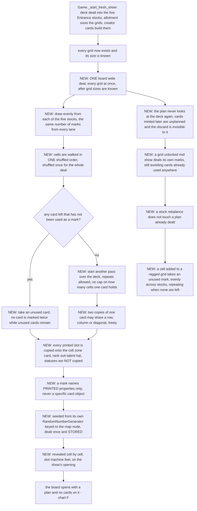
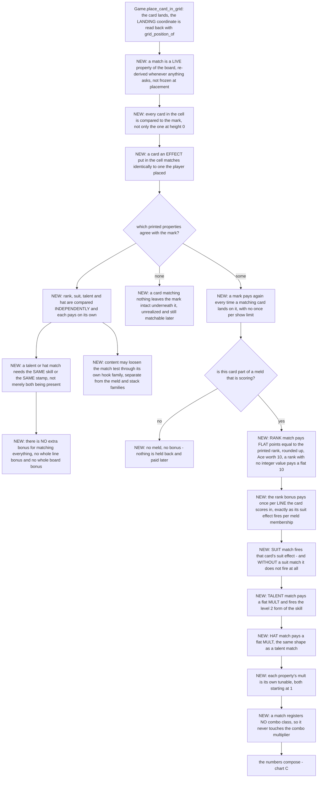
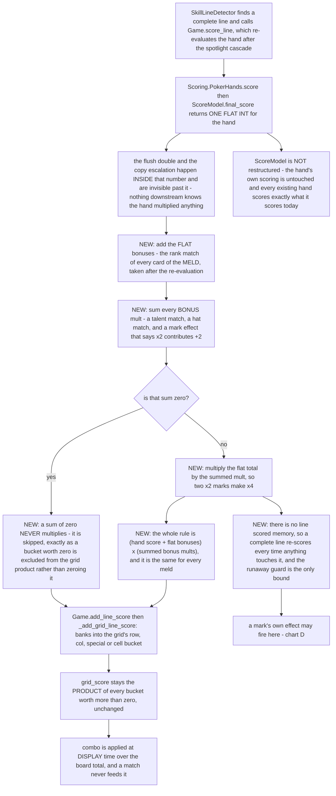
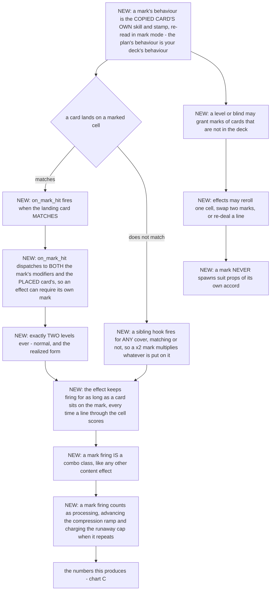
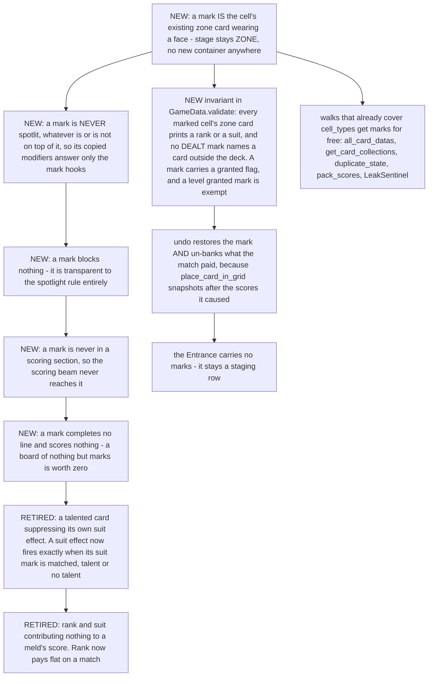
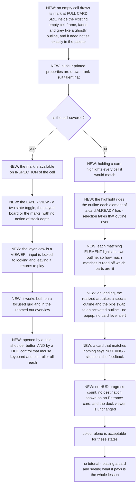

# The board plan — the deck deals the grid its own target, design v1

The grid stops opening empty. At the start of a show the **deck itself deals the board**: copies of
its cards are laid out across the cells as **marks** — planned, unplayable stand-ins that say what
the board is supposed to become. Placing a real card on its mark, matching it on rank, suit, talent
or hat, pays a bonus for every property that agrees. Marks can carry effects of their own, firing
when a real card lands on them. The player therefore builds a deck to shape the board it will be
handed, and plays a show by deciding which parts of the plan to honour and which to overwrite.

**Version 1. Nothing here is implemented. Nothing here is decided except where §1 says the code
already does it.**

⚠ **"Mark" is this document's working word and is itself a question** (`QR7`). The theatre term for
a planned position is a *mark*, and "hitting your mark" is exactly the action this mechanic pays
for — but **"ghost" is already taken** (`Ghost Light`, the stamp that does not block spotlight, in
`DESIGN_RECOMMENDATIONS.md` and `curated effects post grid.csv`), so the braindump's "ghost copy"
cannot be the shipped word. Every question below reads the same whichever name wins.

---

## 0. How to review this document

- **You review by answering questions, not by writing design.** If you finish the questionnaire and
  still have to tell me "you forgot to ask about X", that is a defect in this document and I want
  to hear it.
- **Every question has an ID** (`QR1`, `Q47`). They are stable forever; I never renumber.
- **Every question has a `*default*`.** "Default" is a complete answer — waving a question through
  is a legitimate move and is recorded as unreviewed rather than as agreement.
- **Every question also offers free text and "not relevant"** even though neither is written on the
  line. If none of the options is what you want, say so in your own words.
- **Every question carries a gate** in backticks — the condition under which it is asked at all.
  `[root]` means always. `[QR2=b]` means only if you answered `QR2` (b). Answering a root question
  can prune a whole section in one click.
- **Questions marked ⚑gate change the path.** Their options each say what follows. If you answer one
  in your own words the round stops there and I author the new branch before you continue.
- **Questions marked ⚑contract** fix a literal — a default, a bound, a name, a schema — that gets
  written into the implementation plan verbatim.
- **Answers are revisitable.** Go back and change any answer; answers stranded on an abandoned
  branch are marked inactive, never deleted, and come back if you return to that branch.
- **The flowcharts are §24–§29**, written from your answers after the rounds closed. Review them by
  node id; they state decisions, never questions. `PLAN.md`, `TEST_PLAN.md` and `NAMES.md` are the
  handoff built from them.

**Honest note on path length. Measured, not estimated:** the counts are in §18. The roots that
genuinely shorten the round are `QR3`=(b) (rank and suit only), `QR4`=(b) (marks carry no effects of
their own) and `QR2`=(a) (a mark is never a card). The others fix a shape rather than cut one, so
accepting every default is close to the longest path.

---

## 1. Audit facts — what the code actually does today

Everything downstream cites this section. Every claim was read from source at the line given.

### 1a. A cell already owns a real `CardData` that nothing plays

`GridData` (`Scripts/grid_data.gd`) holds two parallel row-major arrays per grid:

```
cells      : Array[ArrayCardData]   one per cell — that cell's stack, bottom to top
cell_types : Array[CardData]        one per cell — a real card carrying TypeGridCell
```

`build_cells()` makes one `CardData.new().with_type(TypeGridCell.new())` per cell with
`stage = CardData.Stage.ZONE`. It has no suit, no rank, no skill and no stamp — **every slot a
printed card has is empty and already exists.**

`TypeGridCell` (`Cards/Types/type_grid_cell.gd`) is where the "a cell always accepts a card" rule
lives, deliberately, rather than on a removable rules card. Its comment states the other half:
**an occupied cell does not present this card as the drop target; it presents the card sitting on
top of it.**

⚠ **So the cheapest home for a mark is the cell's own zone card, and it costs no new container** —
`validate()`, `all_card_datas()`, `get_card_collections()`, `duplicate_state()`, the save packing
and `LeakSentinel` already walk `cell_types` (`Scripts/game_data.gd:409-446`, `:448-636`). §5 asks
about the consequences of that, never about the container.

### 1b. The cell's zone card is already RENDERED, underneath the stack

`PlayArea._bind_stack(slot, stack, zone_card)` (`UI/play_area.gd:1682`) fits
`stack.size() + 1` controls into a cell slot, binds the stack top-down, and **binds the zone card
into the last one** — so the zone card is the bottom of every cell's pile and is what shows when the
cell is empty. `_bind_grid_panel` (`:2746`) drives it per cell, and `update_grid_zone_visuals`
(`:2765`) sizes them: *"An EMPTY cell takes a FULL card's worth … a covered card shows exactly
`CARD_SEPARATION` of itself and the top card of a stack shows whole."*

⚠ **A mark printed on the zone card therefore appears with no new node, and is reduced to a
`CARD_SEPARATION` sliver the moment a real card lands on it.** That is very close to what the design
wants and it is also the whole of the visibility problem — §15 asks what a covered mark should show.

### 1c. `modulate` is already spoken for on a card

`CardVisual` (`Cards/card_visual.gd:117`) sets `modulate = Color(1.825, …)` when the card is
FOCUSED and back to white when it is not. Per the engine docs, `modulate` propagates to direct
`CanvasItem` children and `self_modulate` does not (§1m). **A mark tint written to `modulate` on the
card or on its slot would be overwritten by the focus highlight and would tint the real card stacked
on it.** The shipped ways to make a card read differently are the palette (§4i of
`ARCHITECTURE_REVIEW.md`), the outline shader and its three override layers (§4j), and
`CardAlert`'s GLARE / THROB modes (`Cards/card_alert.gd`).

### 1d. Rank contributes NOTHING to a meld's score today

`Scoring.ScoreModel.final_score` (`Scripts/scoring.gd:37`) is structural only: `X_OF_KIND` is
`n·(n-1)`, `STRAIGHT` is `2n` with a length ramp, `FLUSH` is `2n`, `FULL_HOUSE` is
`house_base(n/5)`, `HIGH_CARD` is 1, then copy escalation and the flush multipliers. **Rank and suit
appear nowhere in the number.** `Scoring.class_key` says so outright: *"Rank and suit do NOT
differentiate (pair of 2s == pair of 3s)."*

⚠ **So "same rank means +rank to meld score like Balatro" is genuinely new arithmetic**, not a
re-weighting. §7 asks where it lands, because there are three different places it could go and they
are worth different amounts.

### 1e. Where a line's number is banked, and how a grid's score is built

`Game.score_line(result, section)` (`Levels/game.gd:955`) runs the spotlight cascade over the
section, **re-evaluates the hand once afterwards**, and banks `result.score` through
`add_line_score` (`:1074`) → `_add_grid_line_score` (`:1113`). That is **the single write path** —
melds and prop effects both use it, and `CardEffectApi.add_line_score` exposes it to content.

Per grid: a `row` bucket, a `col` bucket, and one `special` bucket every diagonal shares; cell
buckets hold each vertical stack. `grid_score` is **the product of every bucket whose value is > 0**
(a bucket at 0 is excluded, never multiplied in); `board_total` sums the grids; the combo
multiplier is applied **at display time**, never at banking time (`ARCHITECTURE_REVIEW.md` §3a).

⚠ **The economy is a PRODUCT, so a bonus added to one bucket multiplies the whole grid.** A flat
`+rank` into the row bucket is not a flat gain — §7 and §16 ask about that directly.

### 1f. Scoring fires per placement, from a rules card, and re-scores freely

`SkillLineDetector` (`Cards/Skills/Rules/skill_line_detector.gd`) answers `on_board_mutated`,
enumerates `LineGeometry.lines_through(grid, x, y, h)` and scores every complete one in
**ROW, COL, DIAG, HEIGHT_V** order. A compaction scores nothing.

⚠ **There is NO line-scored memory and no within-pass guard** (`ARCHITECTURE_REVIEW.md` §3d): every
completion scores, every time. The only bound is the runaway guard — `act_calls` /
`act_run_repeats`, per meld AND across melds, charging only REPEAT activations
(`Levels/game.gd:133-186`). **Any new per-placement bonus is inside that budget** and any new
recurring trigger has to be countable by `note_processing`.

### 1g. `place_card_in_grid` is the one player-placement path, and it already knows where the card landed

`Game.place_card_in_grid(card, coord)` (`Levels/game.gd:726`): refuses a placement into a grid other
than `state.committed_grid`; opens a fresh activation budget **only when `processing` is false**
(so an effect placing a card mid-cascade spends the same budget); persists a replay marker naming
the Entrance SLOT; **reads the landing coordinate back with `state.grid_position_of(card)` because a
placement appends to the stack and the requested height is not the real one**; broadcasts
`on_board_mutated`, then `on_card_placed(landed)`; refills the Entrance; takes the undo snapshot
last, so the scores the placement caused are inside it.

⚠ **`on_card_placed` fires AFTER `on_board_mutated`, i.e. after the line detector has already
scored.** A bonus that must be inside the meld's own number cannot be applied from `on_card_placed`.
§6 and §7 ask which side of that line the match sits on.

### 1h. `Board.place_in_cell` is the mutation, and every mutation bumps `revision`

`Scripts/board.gd` hosts both move engines. Grid primitives are `place_in_cell` / `move_to_cell` /
`locate_in_cell` / `remove_from_cell`. The MUTATION GUIDELINES block in that file is the
authoritative rule: leave the state consistent FIRST, then bump `GameData.revision` exactly once —
the bump drives the UI rebuild and invalidates the position indexes, the comparator cache and the
save's change detector. ⚠ **Banking a score is NOT a board mutation** and must not bump.

### 1i. The four properties the braindump names, and what they are called in the code

| Braindump | Code | Where |
|---|---|---|
| rank | `CardData.rank : PipRank` | `Cards/card_data.gd` |
| suit | `CardData.suit : PipSuit` | same |
| talent | `CardData.skill : CardModifierSkill` | same — `PropScoreTalents` calls a card with a skill *talented* |
| hat | `CardData.stamp : CardModifierStamp` | same — *"Hats not stamps … stamp stayed in the code; hat is the player-facing word"* (`curated effects post grid.csv`) |

⚠ **A card has two MORE printed slots the braindump does not name:** `type : CardModifierType`
(paper, stone, booster…) and `statuses : Array[CardModifierStatus]` (Burning, Juggling). `QR3` asks
whether they can be matched too.

⚠ **The shipped start deck has no talents and no hats at all.** `deck14` (`Decks/deck.gd:324`) is a
loop over four suits × ranks 1–5 building `_card(suit, rank)` — `TypePaper`, a suit, a rank, and
nothing else. **A talent match and a hat match are unreachable on the starting deck and only become
live once boosters grant skills or stamps.** That is a real content dependency, not a detail; §9 and
§10 say so on the question line.

### 1j. Sameness is not a comparison — it is a dispatch surface, and it has one family per situation

`ARCHITECTURE_REVIEW.md` §3c: melding asks `on_meld_*`, stack legality asks `on_stack_*`, ordering
asks `on_compare_ranks/suits`, and **there is no fallback between them**. `PipComparator.printed_same`
is "do these print the same value" with no dispatch at all. `is_suit_same` / `is_rank_same` were
DELETED for answering a sameness question through the ordering hook.

⚠ **So "does this card match its mark?" is a new SITUATION and, if it is to be moddable, it needs
its own hook family — it must not be routed through the meld or stack families.** `QR3` and §6 ask
about behaviour; whether content can bend the rule is `Q40`.

### 1k. Determinism, saving and undo — the constraints a generated board must satisfy

- `Game.add_deck()` (`:400`) deep-copies the saved deck, relinks every modifier backref, then
  `shuffle_deck` — and **the shuffled ORDER is stored in `state.draw_deck`**, so the randomness
  happens once and everything afterwards reads a stored list. `draw_card()` is `pop_back()`.
- Undo rewinds `GameData`, not `Game`. **Any per-show state undo must rewind lives on `GameData`.**
- `_replay_pending_placement` (`:347`) re-runs an interrupted placement from the restored
  pre-placement board and its comment states the contract it depends on: *"there is no RNG anywhere
  in the path, so replaying reproduces the same board."*
- `BigNumber` is `RefCounted` and invisible to `duplicate_deep` and `ResourceSaver`;
  `CardModifier.data` is a `WeakRef` that `duplicate_deep` does not remap. Both are hand-copied in
  `duplicate_state()` and `pack_scores()` / `unpack_scores()`.

⚠ **A plan generated at show start and STORED behaves exactly like the shuffled draw deck: no RNG
on any later path, so replay, resume and undo are all free.** A plan re-derived on read would break
all three. That is a structural decision and it is taken; `Q8` only asks what the seed is tied to.

### 1l. The board holds 25 cells for a whole run, and that is an OPEN, MEASURED problem

`SkillGridAllotment.target_grid_count` is `ceil(deck / grid_cards_per_unlock)` clamped to
`[1, grid_max_count]`, and `grid_cards_per_unlock` ships at **52** while a run goes 20 → 40 cards.
So a run never unlocks a second grid. Measured, par play (`gaps/GAP-041.md` under
`design/poker-patience/`):

```
    N  ranks  cells  placed   median score
   20   1-5      25    20.0        9360     nodes 0-2
   25   1-13     25    25.0       60984     node  3    board exactly full
   40   1-13     25    25.0       11088     node 12
```

**The score peaks at node 3 and ends at 0.16× the peak**, and `goal_alpha` is pinned near flat
(0.26) because deck size is anti-correlated with score past that point. `GAP-041` is **open**.

⚠ **This design is the first thing that makes deck size change the BOARD rather than only the
draw**, so it lands squarely on that gap. §16 asks whether the plan is meant to be a scoring driver
or a guidance layer, and the answer decides whether `GAP-041` gets easier or harder.

### 1l-bis. The deck is no longer one pile — the Entrance is five stocks, and that is already decided

`design/sidebar/DESIGN.md` §17 is answered, and its answers are facts this design builds on, not
questions to re-ask:

| Answer | What it fixes |
|---|---|
| `QR9`=(a) | per-slot stocks are the **real data model**; the single `GameData.draw_deck` is replaced by them |
| `Q202`=(a) | **one shuffle, dealt round-robin** — slot *i* holds shuffle positions *i*, *i+N*, *i+2N*, … and there is exactly one RNG event, the existing one |
| `Q201`=(a) | a remainder deals round-robin left to right, so the earlier slots get the extras |
| `Q200`=(c) | distributed at show start, and re-distributed whenever the SET OF SLOTS changes |
| `Q210`=(c) | an exhausted slot stays empty; stocks rebalance only on an add or remove |
| `Q211`=(a) | "the deck is empty" means every slot's stock is empty |
| `Q212`=(a) | a discarded card does not return to a stock mid-show |

Three consequences this design cannot ignore:

1. ⚠ **The union of the stocks IS the deck**, because they are one shuffle dealt round-robin. So
   "draw the plan from the deck" and "draw the plan from the stocks" name the same population; only
   the STRATIFICATION differs. `Q93` is that question.
2. ⚠ **Which slot a card is in carries no information — its DEPTH in that slot does.** Slot
   membership is an artefact of the shuffle; depth is arrival TIME, because a slot draws its own
   stock top-down. Any "spread the plan evenly" instinct is about depth, not about slots.
3. ⚠ **The player now partly controls the draw order.** A slot refills from its own stock, so
   choosing which Entrance card to play chooses which lane advances. A visible plan plus steerable
   lanes is a stronger planning loop than either alone — and it is what makes `Q93`=(c) and (d)
   worth asking rather than obviously wrong.

### 1m. Engine capability audit — what Godot already offers, read from its own docs

Nothing in this table came from memory or from grepping the repo.

| Capability the design leans on | Verdict | Source |
|---|---|---|
| A per-instance RNG with a saveable/restorable state | ✅ `RandomNumberGenerator` has a `state` property; **global-scope randomness does NOT** | [Random number generation](https://docs.godotengine.org/en/stable/tutorials/math/random_number_generation.html) |
| Seeding for a reproducible sequence | ✅ *"If you use the same seed, you'll get the same sequence of random numbers every run"* | same |
| `Array.shuffle()` taking a seed | ⚠ **contradicted** — it uses the GLOBAL RNG and cannot be given one; a seeded shuffle is a hand-written Fisher–Yates over `RandomNumberGenerator.randi_range` | [godot-proposals#11853](https://github.com/godotengine/godot-proposals/issues/11853) |
| Tinting one card without tinting what stacks on it | ⚠ **`modulate` propagates to direct `CanvasItem` children; `self_modulate` does not** — and `modulate` is already the focus highlight (§1c) | [CanvasItem](https://docs.godotengine.org/en/stable/classes/class_canvasitem.html) |
| A built-in "ghost / preview node" | ⚠ **none exists.** The engine offers no preview or placeholder rendering mode; a mark's look is this project's own shader/palette work, which §4j and §4i already own | — |
| Extra persisted fields on a `Resource` | ✅ `@export_storage`, which `GridData`, `GameData` and `SkillGridCreator` already use for exactly this | repo, `Scripts/grid_data.gd` |

⚠ **The consequence of row 3 is a contract, not a note.** `Game.shuffle_deck` uses `Array.shuffle()`
and is therefore seeded by whatever the global RNG happened to be. If the plan is to be reproducible
from a stored seed (`Q8`), its generator is a `RandomNumberGenerator` instance and its shuffle is
written out, not `Array.shuffle()`.

### 1n. What the player can already find out mid-show

`GameView` (`Levels/game_view.gd:135-137`) wires the Deck, Discard and Rules buttons to
`DeckViewer.show_deck(...)`. The viewer lists the cards **sorted by rank by default**
(`UI/deck_viewer.gd`, `sorting_type = SORTING_TYPE.RANK`), so the player can already see **what** is
left in the draw deck but not **when** it will arrive.

⚠ **That is exactly the information asymmetry the braindump's "reserved spots" fantasy needs**, and
it means the planning affordance may already be half-built. §15 asks what, if anything, the viewer
should now say about where a card is fated to go.

---

## 2. The state model — the independent facts this feature adds

Structure is decided here, not asked. Where a structural choice has a behavioural consequence, the
question asks about the consequence.

| Fact | Lives | Why there |
|---|---|---|
| **A cell's mark** — the printed properties the plan wants in that cell | on the cell's existing `cell_types[i]` card, in its own printed slots | §1a: the container, the walks, the validation, the save and the rendering all exist. A parallel array would need adding to eight places and would render nowhere. |
| **Whether a cell is marked at all** | derived: the zone card has a rank/suit | no second flag to fall out of step with |
| **Whether a mark has been realized, and how well** | ⚠ **nowhere — nothing remembers it** | this row proposed a ledger and the ANSWERS removed the need for one: the match is derived live (`Q13`=(b)), pays every time (`Q20`=(a)), and there is no board bonus (`Q44`=(b)) and no progress count (`Q72`=(c)), so everything is a function of the live board |
| **The plan's seed / generator state** | `GameData`, `@export_storage` | replay, resume and undo all read it; nothing re-derives (§1k) |
| **What a mark PAYS** | derived at match time from the properties that agree | a stored number is a second representation of one fact |
| **A mark's own effect** (`QR4`) | the modifier on the zone card, exactly as a play card carries one | reuses the whole modifier dispatch; needs the spotlight ruling in `Q59` |
| **The realized count / plan progress** | derived by counting the ledger above | never stored twice |

⚠ **One structural consequence is worth stating because it decides several questions below:** a mark
printed on the zone card means the zone card now has a `suit` and a `rank`, and `CardModifier.is_spotlit`
returns true for a `Stage.ZONE` card that nothing covers (`Cards/card_modifier.gd`). **An uncovered
mark would be SPOTLIT and its modifiers would answer every hook** unless something stops it.
`Q59` is that ruling and it is not optional.

---

## 3. Every usage — one row per situation, and the question that covers it

**If a situation is missing from this table, that is the most valuable thing you can report.**

| Situation | Covered by |
|---|---|
| A fresh show, 20-card deck, 25 cells | `QR1`, `Q1` |
| A late-run show, 40-card deck, 25 cells | `QR1`, `Q2` |
| A deck holding two identical cards | `Q3`, `Q4` |
| A card placed on its mark, all four properties agreeing | `Q17`, §7–§10 |
| A card placed on its mark, one property agreeing | `Q16` |
| A card placed on a cell whose mark it does not match at all | `Q18` |
| A card placed on top of an already-realized cell (height ≥ 1) | `Q15` |
| A card placed on a cell by an EFFECT rather than by the player | `Q14` |
| A card removed from a realized cell, then a different card placed there | `Q20` |
| Undo of a placement that realized a mark | `Q62` |
| Quit and resume mid-show; quit mid-cascade and replay | `Q8` (structural, §1k) |
| A second or third grid unlocked mid-show | `Q10` |
| A card minted or added to the deck mid-show | `Q11` |
| A show with no marks reachable (deck all talents, none matching) | `Q16`, `Q68` |
| Headless — the whole suite, no view | structural: nothing here touches the view layer; every §15 answer is view-only |
| A mark's own effect firing while the act is over budget | `Q57` |
| The player inspects the draw deck mid-show | `Q73` |
| The player inspects the discard | `Q73` |
| A mark on a cell that an effect later deletes (grid removed) | `Q10` |
| The Entrance — does it carry marks | `QR6` |
| A blind / level modifier that pre-fills the board with hazards | `Q77` (out of scope confirmation) |
| Colour-blind play, and play with the palette swapped | `Q71` |
| The very first placement of the very first show — the tutorial case | `Q74` |

---

## 4. § Root forks — answer these first

- **QR1** `[root]` ⚑gate — The braindump says the board is dealt "copies of cards from deck", and separately that the player "will keep certain spots reserved since they know exactly what card they want to play there". Those two sentences describe different mechanics. Which is it? · **(a)** **a PERMUTATION of the deck** — every card in the deck is fated to exactly one cell, so a mark is a promise: that card *is* coming, and a flawless show realizes every one of them — **→ next:** what happens when the deck and the cell count disagree in each direction, whether a mark names the exact card object, whether the Entrance shows a card's destination, and whether the plan is re-dealt when the deck changes mid-show · **(b)** **an independent random SAMPLE with replacement** — each cell independently draws a copy of some deck card, so a card may be marked twice, three times, or never; a mark is a suggestion, not a promise — **→ next:** only the questions everyone answers — how many cells get marked, and whether a degenerate deal gets a floor; nothing about promises, destinations or re-deals · **(c)** **a sample WITHOUT replacement, up to the smaller of deck and cells** — no card is marked twice, but a big deck leaves cards unmarked and a small deck leaves cells blank — **→ next:** the same overflow/underflow questions as (a), but no destination display and no re-deal · **(d)** **a CURATED deal** — the layout is chosen, not rolled, so that some rows and columns already read as melds or near-melds and the player can see what the board wants to become — **→ next:** everything in (b) plus what the curation optimises for, how much of the board it guarantees, and how the "slot machine" feel survives a deal that is not random · **(e)** **YOUR ANSWER, promoted to an option so its subtree can be reached — COVER THE DECK, THEN REPEAT:** *"If deck does not have enough cards to fill up grid, choose again from existing decks, such that board may have multiple ghost copies of 1 card."* Every card is fated to at least one cell; a deck shorter than the board deals again from the top, so some cards hold two cells or more — **→ next:** the same promise and destination questions as (a), plus how many copies one card may hold and whether two copies may share a line · *default* (e) · notes — this is the fork the whole design hangs from. (a) is the planning fantasy, (b) is the slot machine, (d) is the "partial melds are already on the board" sentence taken literally, and (e) is (a) with the short-deck case answered. ⇒ (b) skips §5.1's promise questions entirely

- **QR2** `[root]` ⚑gate — An unrealized mark is a picture of a card sitting in a cell. Does the board treat it as a CARD for anything other than matching? The braindump says *"already created melds or partial melds will already be on board"* and calls it *"solving a board like more classic flipping solitaires"*, which reads two very different ways. · **(a)** **a mark is never a card** — it completes no line, scores nothing, and an all-marks board is worth zero; the whole value of a mark is what it pays when a REAL card lands on it — **→ next:** nothing about mark scoring; the economy questions are only about the match bonus · **(b)** **a mark completes a line but pays a reduced rate** — a row of five marks is a scored hand at some fraction, and realizing a mark upgrades that cell's contribution to full — **→ next:** what the fraction is, whether a line re-scores each time one of its marks is realized, what that does to the runaway guard, and whether an untouched board pays on the first placement anywhere · **(c)** **a mark completes a line at FULL rate** — the board opens fully scored and the player's job is to overwrite the cells that make the worst lines — **→ next:** everything in (b), plus what stops a show being won by pressing End immediately, and how the goal curve absorbs a board that starts at its opening score · *default* (a) · notes — (b) and (c) both make the show's score non-zero before the player has acted, which is a direct hit on the goal curve `GAP-041` already calls unfitted. ⇒ (a) skips §11

- **QR3** `[root]` ⚑gate — The braindump names four properties a placement can match on: rank, suit, talent and hat. A card actually prints six — those four plus its **type** (paper, stone, glass…) and its **statuses** (Burning, Juggling). Which of them can a match key on in v1? · **(a)** **all four named** — rank, suit, talent and hat, each paying its own bonus — **→ next:** what each of the four pays, and how a partial match is priced · **(b)** **rank and suit only in v1** — the two the braindump gives a concrete rule for; talent and hat matching is deferred — **→ next:** the rank and suit sections only; §9 and §10 vanish · **(c)** **all six** — type and statuses match too — **→ next:** everything in (a), plus what a type match and a status match pay and whether a status applied mid-show can retroactively match · *default* (a) · notes ⚠ **the shipped start deck has NO talents and NO hats** (§1i), so under (a) two of the four are dead until boosters grant them — which is a content dependency, not a bug. ⇒ (b) skips §9 and §10

- **QR4** `[root]` ⚑gate — The braindump's second half is that a mark can carry an effect *because* it is a mark: *"a x2 skill card that multiplies cards placed on top by 2"*, *"certain card effects only trigger when realized on their fated spot"*, *"trigger a lvl 2 version of effect instead"*. Does that content API exist in v1? · **(a)** **yes, the full family** — new hooks fire when a mark is covered and when a card is realized on its own mark, and effects can declare a stronger form for the realized case — **→ next:** the hook names and signatures, what the ×2 example multiplies, where a "level 2" form is authored, whether a non-matching cover still fires it, and how it counts against the runaway guard · **(b)** **no — matching is all a mark does in v1** — a mark is a target and a bonus, and carries no behaviour of its own — **→ next:** nothing in §13; the design is the match rule plus its presentation · **(c)** **the "only on the fated spot" half only** — an effect may declare that it fires ONLY when its card is realized on its own mark, but a mark never acts on a card that covers it — **→ next:** one hook rather than a family, and no ×2 question · *default* (a) · notes — (a) is the half that makes deckbuilding-for-the-board real; (b) makes this a much smaller feature. ⇒ (b) skips §13 entirely

- **QR5** `[root]` ⚑gate — Once the plan is dealt, can it change? · **(a)** **fixed for the show** — dealt at the start, and nothing rerolls it; overwriting a mark with a wrong card is a permanent cost — **→ next:** nothing about rerolling · **(b)** **fixed, but a realized cell's mark is CONSUMED** — the mark stops existing once matched, so a cell that is emptied later has no mark to match again — **→ next:** what an emptied realized cell shows, and whether the second card into that cell can match anything · **(c)** **rerollable by effects** — the plan is fixed by default but content may redraw one cell, swap two marks, or re-deal a line — **→ next:** what a reroll is allowed to touch, whether it can create a mark on an occupied cell, and what the player sees when one changes · *default* (c) · notes — (c) is a superset of (a); the question is whether the seam is designed now or retrofitted later, and retrofitting a reroll onto a "fixed" plan is the kind of thing that turns out to need a container change

- **QR6** `[root]` ⚑gate — Which parts of the board carry marks? · **(a)** **every grid's cells, and nothing else** — the Entrance is a staging row and stays unmarked — **→ next:** what happens when a grid is unlocked or removed mid-show · **(b)** **every grid's cells, and the Entrance slots too** — the five Entrance slots also show what is fated to arrive there — **→ next:** everything in (a), plus what an Entrance mark means when the card that arrives is not it, and whether the Entrance's own marks pay anything · **(c)** **only the committed grid** — a grid the player has not committed the Entrance to shows no plan until it is entered — **→ next:** everything in (a), plus when a grid's plan appears and whether it was decided at show start or at commit time · *default* (a) · notes — the Entrance is `upper_zone`, a different container with a different move engine (§1h), so (b) is a materially larger change than it reads

- **QR7** `[root]` ⚑contract — What is this called, in the player's language and in the code? **"Ghost" is unavailable** — `Ghost Light` is already a stamp that does not block spotlight. · **(a)** **the Plan / a mark / realizing a mark** — theatre's own words: a performer *hits their mark*; the board shows the plan for the show · **(b)** **the Blocking / a blocking / blocked** — the literal theatre term for planned positions, but it collides with `blocks_spotlight` in the code and with "blocked" meaning "prevented" in every other sentence · **(c)** **the Rehearsal / a rehearsed card / performing it** — reads well and carries the circus theme, but is a long word for something named on every cell · **(d)** **the Running Order / a slot / filling a slot** — the showman's word, but "slot" is already the UI's word for a cell control · **(e)** **YOUR ANSWER, promoted to an option so it has a letter:** *“the composition mark hitting the mark (didnt know hitting the mark was official term, so am okay with mark terminology now)”* — the mechanic keeps the word **mark**, and "hitting the mark" is the action; nothing else in the document changes · *default* (e) · notes — whatever wins goes into `NAMES.md` and every localisation key; this document uses (a) throughout and nothing else depends on the choice

---

## 5. Dealing the plan

### 5.1 Deck and board do not fit each other

- **Q1** `[root]` — Today's start deck is 20 cards and one grid is 25 cells, so a plan cannot fill the board from a 20-card deck without repeating something. What happens to the five spare cells? · **(a)** they stay **unmarked** — a plain empty cell, exactly as the board looks today, and the player may put anything there for no bonus · **(b)** they are marked with **repeats** — the deal keeps going round the deck, so five cards are fated to two cells each · **(c)** the grid is **shrunk to the deck** — a 20-card deck deals a board with 20 live cells and five dead ones that accept nothing · **(d)** they are marked with a **wildcard** that matches whatever is placed there and pays a reduced bonus · *default* (a) · notes — (c) changes `GridData`'s shape and every line that runs through the dead cells, which is a much bigger change than it looks

- **Q2** `[root]` — Late in a run the deck reaches about 40 cards against the same 25 cells, so most of the deck cannot be marked. Which cards get marks? · **(a)** a **random 25** of the deck, redrawn each show — **(b)** the 25 that would make the **best board** if realized, so the plan is a hint about your own deck's ceiling · **(c)** a random 25 **weighted toward cards you have not been dealt marks for in recent shows**, so a big deck cycles through its own contents · **(d)** all 40 are represented — cells hold **more than one mark**, stacked, and a card matching any of them scores · *default* (a) · notes — (d) is the only option that keeps a big deck fully visible, and it is also the only one that changes what a cell IS

- **Q3** `[QR1=a|c|e]` — Does a mark name the exact card, or only what it prints? Two identical 3-of-Hoops in a deck are two different `CardData` objects with the same printed face. · **(a)** **printed properties only** — either copy of the 3-of-Hoops realizes the mark, and the design never has to survive a card being destroyed or transformed · **(b)** **the exact card object** — that specific copy is fated there, and the other one matches nothing; a card destroyed mid-show leaves an unrealizable mark · **(c)** **the exact card, but any card printing the same face satisfies it** — identity is recorded for display ("this one goes there") and matching is by print · *default* (c) · notes — (b) is the only one that can strand a mark, and (c) is what makes the Entrance destination display in `Q70` possible without it lying

- **Q4** `[root]` ⚑contract — Which of a card's printed slots are COPIED onto its mark? This is separate from which ones can be MATCHED (`QR3`) — a mark could show a talent it does not pay for. · **(a)** **exactly the slots that can be matched**, and nothing else — a mark shows what it wants · **(b)** **every printed slot**, matched or not — the mark is a faithful picture of the card, and the unmatched slots are pure information · **(c)** **rank and suit only**, whatever `QR3` says — the mark reads as a plain card and the talent/hat match is tested against the source card without being drawn · *default* (b) · notes — (b) is the only one where the mark and the card it copies look the same, which is what makes "that is my 5 of Fire" readable at a glance

- **Q5** `[root]` — Are a card's **statuses** copied onto its mark? A Burning card in the deck is burning because something set it alight this run. · **(a)** **no** — a mark copies the printed card, and a status is a runtime condition, not a print · **(b)** **yes, shown but inert** — the mark displays the status so the plan is accurate, and the status does nothing from a mark · **(c)** **yes and live** — a Burning mark burns, which is how a blind would poison a board · *default* (a) · notes — (c) is the door to hazard boards (`curated effects post grid.csv`'s *Venationes*), and it is also the door to a mark damaging a player who never touched it

- **Q6** `[root]` — Is the deal allowed to produce a board nobody would want — every cell marked the same rank, or a plan whose every line is a bust? · **(a)** **yes, pure chance** — the slot-machine reading; a bad plan is a bad spin and the player plays around it · **(b)** **no, one guard rail only** — reroll the whole deal if it is degenerate by one stated test, and otherwise leave it alone · **(c)** **no, the deal is shaped** — see `QR1`=(d) · *default* (a) · notes — if you want (c), answer `QR1` with (d) instead; this question is about whether a RANDOM deal gets a floor

- **Q7** `[QR1=d]` — A curated deal is chosen rather than rolled. What is it choosing FOR? · **(a)** **a fixed number of already-complete lines** — the plan contains, say, one complete meld the player can realize by matching five cards · **(b)** **near-melds only** — every line is one or two cards short, so nothing is free but everything is close · **(c)** **a spread** — some lines strong, some deliberately hopeless, so overwriting is always part of the plan · **(d)** **the player's own best hand** — the curation finds the best meld the deck could make and lays it out · *default* (b) · notes — (a) and (d) both hand the player a score for placing five cards correctly, which is a very different difficulty curve from (b)

- **Q8** `[root]` ⚑contract — The plan is generated once and stored, so replay, resume and undo cost nothing (§1k). What is its randomness tied to? · **(a)** **its own `RandomNumberGenerator` seeded from the map node** — the same node always deals the same plan, so a re-entered show is the same show · **(b)** **its own generator, seeded freshly each show** — replaying a node after losing deals a different plan · **(c)** **the global RNG, like `shuffle_deck` today** — simplest, and it means the plan is only reproducible via the stored result, never re-derivable · *default* (a) · notes ⚠ `Array.shuffle()` cannot take a seed (§1m), so (a) and (b) both mean a hand-written shuffle over a `RandomNumberGenerator`; only (c) can reuse the existing call. ⚠ And the existing call is now the STOCK deal (`sidebar Q202`=(a), §1l-bis) — one shuffle dealt round-robin — so under `Q93`=(c) or (d) the plan needs no RNG of its own at all, while (a) and (b) need a second draw over an already-shuffled order

- **Q93** `[root]` ⚑gate — The deck is five per-slot stocks now (§1l-bis), and their union is the deck. Where are the marks drawn FROM? · **(a)** **the combined deck**, ignoring the stocks — one uniform draw over every card, exactly as if the split did not exist — **→ next:** nothing extra; the plan and the Entrance stay independent systems · **(b)** **evenly from each stock** — the same number of marks from every lane, so no lane is over- or under-represented — **→ next:** what "evenly" means when the stocks are uneven (`Q201`=(a) gives the earlier slots the extras) and what a rebalance does to a plan already dealt · **(c)** **the TOP of each stock** — the plan is the next few cards each lane will actually produce, so it is a FORECAST rather than a cross-section — **→ next:** how far ahead it reaches, whether it extends as the stocks draw down, and what an exhausted lane's cells show · **(d)** **stock bound to COLUMN** — grid column *j* takes its marks from slot *j*'s stock, so the lane you draw from is the column you are building — **→ next:** what happens when the grid is not as wide as the Entrance, what a second grid does, and how the binding is shown · *default* (b) · notes ⚠ **(a) and (b) differ only on an axis the player cannot see.** Measured over 20,000 deals at a late-run deck of 40 into 25 cells: (b) makes the per-lane spread exactly 0 where (a) averages 3 and reaches 8 — but the two are IDENTICAL on arrival time (marks among the five cards you will draw first: mean 3.13 sd 1.03 under (a), 3.12 sd 1.09 under (b)). And under `QR1`=(a) with today's 20-card deck they are not merely similar, they are the SAME PLAN, because a permutation marks every card exactly once however you enumerate it. ⚠ **The case that DOES favour (b) is the tail, which the sentence above understates.** Measured, 40,000 deals under the cover-then-repeat model (`QR1`=(e)): at a 20- or 25-card deck a starved lane is IMPOSSIBLE, because every card is marked at least once; at 40 cards, 10.5% of deals leave some lane with 2 or fewer of its 8 cards marked and 0.03% leave one with none — so a fifth of the draw stream can arrive unfated. (b) removes that tail for nothing. (c) and (d) are the two that make the split MEAN something

- **Q94** `[Q93=c]` ⚑contract — A forecast plan shows the top of each stock. How deep? · **(a)** **as many as the board has cells to spare** — 25 cells over 5 lanes is the top 5 of each, so the plan is the next five rounds · **(b)** **a tunable depth**, and cells past it are unmarked · **(c)** **the whole stock**, with cells running out before the stock does · *default* (a) · notes — under (a) every one of the first ten cards you will ever draw is marked (measured), which is a very different opening from a random cross-section and is either the best part of this option or the thing that kills it

- **Q95** `[Q93=c]` — A forecast is consumed as the stocks draw down. Does it extend? · **(a)** **no** — dealt once, and once played out the remaining cells are unmarked; the show has a planned first half and an improvised second · **(b)** **yes, rolling** — as a lane's marked cards are drawn, new marks appear for whatever is now on top · **(c)** **yes, but only into cells that are still empty** · *default* (b) · notes — (a) is the only one where the plan is a fixed target for the whole show, which is what every other question in this document assumes; (b) quietly changes `QR5` from "can the plan change" to "the plan changes constantly"

- **Q96** `[Q93=b|d]` — `Q200`=(c) re-distributes the stocks whenever the set of slots changes, and `Q204`/`Q205` move cards between them. A plan drawn from the stocks is no longer evenly drawn afterwards. What happens? · **(a)** **nothing** — the plan was dealt from the stocks as they were and does not track them · **(b)** **the affected cells are re-dealt** · **(c)** **the whole plan is re-dealt** · *default* (a) · notes — (b) and (c) both rewrite a board the player has been playing against, which `Q10` already flags as the shape that reads as a bug even when it is intended

- **Q97** `[Q93=d]` — Column binding needs the grid to be as wide as the Entrance. Today both are 5, by coincidence rather than by contract, and `sidebar Q208` lets a future effect change the slot count. What happens when they disagree? · **(a)** **the binding degrades** — an unmatched width falls back to a combined draw for the whole board · **(b)** **columns wrap** — column *j* uses slot *j mod N* · **(c)** **the two are made to AGREE** — the Entrance's slot count follows the grid's width, which is a rule change in the sidebar design rather than in this one · *default* (b) · notes — (c) is the only one where the binding is always true, and the only one that reaches outside this design to get there

- **Q98** `[Q93=d]` — With three grids there are 15 columns and 5 stocks. Which stock feeds column 7? · **(a)** **`j mod N`**, the same wrap as `Q97`=(b) · **(b)** **only the committed grid is bound**; the others draw combined · **(c)** **each grid repeats the binding**, so every grid's column *j* comes from slot *j* — five lanes feeding three boards · *default* (c)

- **Q99** `[root]` ⚑gate ⚑contract — Marks are dealt round-robin from five stocks. If the CELLS are filled in row-major order at the same time, cell *(x, y)* always takes its mark from stock *x* — an accidental column binding — and a repeated card always lands the same distance away from its first copy. In what order are the cells filled? · **(a)** **YOUR ANSWER — a shuffled cell order:** *"grid cells must be randomly chosen for next random ghost card to prevent a round robin situation where copies always end up in the same position on the grid"* — the 25 cells are shuffled once and the deal walks that order — **→ next:** whether that shuffle is taken once for the whole deal or again for each pass through the deck · **(b)** **row-major, and the round-robin is broken on the STOCK side instead** — the lane order is shuffled per card rather than the cell order — **→ next:** nothing; the cell walk is fixed and there is no per-pass question · **(c)** **both are shuffled** — **→ next:** the same per-pass question as (a) · *default* (a) · notes — (a) and (b) break the same correlation from opposite ends and cost the same; (a) is the one whose randomness is visible in where things landed rather than in an order nobody sees

- **Q100** `[Q99=a|c]` — Is the cell order shuffled ONCE for the whole deal, or again for each pass through the deck? Under `QR1`=(e) a 20-card deck makes two passes over 25 cells. · **(a)** **once** — one shuffle of the cells, walked start to finish, so the second pass simply continues into whatever cells are left · **(b)** **once per pass** — each pass shuffles the remaining cells again · *default* (a) · notes — with one shuffle the repeats land in the LAST cells of the walk, which are as random as any others, so (b) buys nothing; it is here to be rejected on the record rather than discovered later

- **Q101** `[QR1=e]` — Two marks of the same card land in the same row, column or diagonal. That line's plan then contains a guaranteed pair before the player has done anything. Is that allowed? · **(a)** **yes, freely** — it is a lucky deal and a good one to aim at · **(b)** **no, copies are kept out of a shared line** — the deal rejects and redraws a cell that would put two copies of one card in any line through it · **(c)** **no, and further — copies are kept non-adjacent** · *default* (a) · notes — (b) and (c) both turn a one-pass deal into a constrained placement that can fail and need backtracking, which is real machinery; (a) is free and the pair is only "guaranteed" if the player draws that card twice, which they cannot

- **Q102** `[QR1=e]` ⚑contract — How many cells may one card hold? With 20 cards over 25 cells the deal needs 5 repeats, so at least one card holds two. · **(a)** **as many as the cycling produces** — a full second pass would give every card two, a third would give three, with no cap · **(b)** **capped at two**, and a board needing more than 2× the deck leaves the remainder unmarked · **(c)** **capped at a tunable number** · *default* (a) · notes — today's smallest legal deck against one grid is 20 into 25, which needs no cap; (b) and (c) only matter if a deck can get small enough to need a third pass, which nothing does today

### 5.2 The plan against a board that changes

- **Q9** `[root]` — Is the plan dealt before or after the grids exist? At show start the allotment card sizes the grid count to the deck, then each creator card builds its grid, then the Entrance refills (`Levels/game.gd:252-278`, a four-step order the comments call load-bearing). · **(a)** **after every grid exists**, as one more step in that sequence — one deal covering the whole board · **(b)** **by each grid as it is built** — a grid deals its own cells from the deck when it is created, wherever that happens · **(c)** **YOUR ANSWER, promoted to an option so it has a letter:** *“across all existing grids at once after grid sizes are known. each grid gets its marks from the same stock. such that 2 5x5 grids use 50 different cards from the same stock, such that 50 out of 52 cards of the deck appear marked on the 2 different grids with no reused cards for marking.”* — ONE board-wide deal after every grid exists, drawing from the shared stocks with **no card marked twice across grids** — 2 grids of 5×5 spend 50 distinct cards · *default* (c) · notes — (b) is the only one that answers `Q10` for free

- **Q10** `[QR6=a|b]` — An effect unlocks a second grid mid-show, or removes one. What happens to the plan? · **(a)** **a new grid deals its own marks from the current deck** when it appears, and a removed grid takes its marks with it · **(b)** **a new grid opens UNMARKED** — the plan was the opening plan and it is not extended · **(c)** **the whole board is re-dealt** whenever the grid count changes · *default* (a) · notes — (c) rewrites a board the player has already been playing against, which is the kind of thing that feels like a bug even when it is intended

- **Q11** `[root]` — A card is added to the deck mid-show — minted by an effect, or returned by one. Does it get a mark? · **(a)** **no** — the plan is dealt from the deck as it stood at the start, and later arrivals are unplanned · **(b)** **yes, on the first unmarked cell** if one exists · **(c)** **yes, replacing an unrealized mark** so the plan stays a picture of the live deck · *default* (a) · notes — under `QR1`=(a) the permutation reading, (a) means the promise "every deck card has a home" quietly stops being true mid-show; say so on the card that mints, or accept it

- **Q12** `[root]` — Does the plan know about cards that have already left — placed, discarded, or burnt? · **(a)** **no, it is dealt once and never looks again** · **(b)** **yes, a mark whose card is in the discard is shown as unreachable** — greyed further, so the player stops planning around it · **(c)** **yes, and it is re-dealt to a card still available** · *default* (b) · notes — (b) is presentation only under `Q3`=(a) or (c), because matching is by print and another copy may still arrive; it is a real mechanic under `Q3`=(b)

- **Q85** `[QR6=c]` — Under the committed-grid-only reading, a grid the player has not entered shows no plan. When does its plan appear, and when was it decided? · **(a)** **decided at show start, revealed at commit** — the plan existed all along and the player simply could not see it, so nothing about their play changes it · **(b)** **decided at commit** — the grid deals itself from whatever the deck holds at the moment the player commits to it, so playing one grid first changes the next one's plan · **(c)** **decided at show start and revealed at show start for the FIRST grid only**, later ones at commit · *default* (a) · notes — (b) is the only one where the order the player enters grids is itself a decision, which is either a nice depth or an invisible trap depending on whether the player can see it coming

---

## 6. What counts as a match

- **Q13** `[root]` ⚑gate — When is a match tested? · **(a)** **at the moment of placement, once** — the card lands, the properties are compared, the bonus is applied, and the answer never changes — **→ next:** what happens for cards an effect moves in, and nothing about a match changing later · **(b)** **continuously, as a property of the board** — whatever card is currently at height 0 of a cell is compared against the mark whenever anything asks, so an effect that changes a card's suit mid-show can create or destroy a match — **→ next:** everything in (a), plus what happens to a bonus already paid when a match is undone, and whether a line re-scores when a match appears · *default* (a) · notes — (b) is more expressive and it makes "the bonus already banked" a real problem, because banking is not reversible without an undo

- **Q14** `[Q13=a|b]` — A card is put into a cell by an EFFECT rather than by the player's hand (`place_card_in_grid` is the same function either way; `processing` is what distinguishes them — §1g). Does it match? · **(a)** **yes, identically** — a card in a cell is a card in a cell · **(b)** **no, only a placement the player made** — matches are a reward for planning, and an effect that scatters cards should not farm them · **(c)** **yes, but the bonus is halved** · *default* (a) · notes — (b) is the only one that needs a new distinction in the data layer; the `processing` flag exists but it is about activation budgets, not about authorship

- **Q15** `[root]` — A mark sits under height 0. A card placed on TOP of an already-occupied cell lands at height 1 or above. Does it get compared to the mark? · **(a)** **no** — only the card at height 0 can realize a mark; a stack's upper cards are unplanned · **(b)** **yes, every card in the cell is compared** — so a cell's mark can be matched several times by stacking matching cards · **(c)** **yes, but only until the mark is realized once** — the first match consumes it · *default* (a) · notes — (b) is what makes `QR4`'s "×2 multiplies cards placed on top" read naturally, because that effect is explicitly about the things above it

- **Q16** `[root]` ⚑contract — A card can agree with its mark on some properties and not others. Is each agreeing property paid on its own? · **(a)** **yes, fully independent and additive** — matching rank alone pays the rank bonus, and nothing else is needed · **(b)** **yes, but rank or suit is a PREREQUISITE** — a talent or hat match pays nothing unless rank or suit also agrees · **(c)** **no, all-or-nothing** — only a card agreeing on every property the mark prints scores anything · *default* (a) · notes — (a) is what "triggers additional effects for each matching property" says; (c) makes a match a rare event, which is a very different feel and makes the starting deck's missing talents/hats (§1i) into a hard wall

- **Q17** `[root]` — Is there an extra bonus for matching EVERYTHING the mark prints, over and above the per-property bonuses? · **(a)** **yes, a full-match bonus** — a distinct, larger reward for hitting the mark exactly · **(b)** **no** — the sum of the parts is the whole, and a perfect match is simply the biggest sum · **(c)** **yes, and it is multiplicative** — a full match multiplies the per-property bonuses rather than adding to them · *default* (a) · notes — under `QR3`=(a) and the shipped deck, a "full match" is rank+suit today because nothing prints a talent or a hat, which makes (a) much easier to reach than it will be later

- **Q18** `[root]` — A card is placed on a cell whose mark it matches on nothing at all. What happens to the mark? · **(a)** **nothing** — it stays under the card, unrealized, and can still be matched if that card leaves · **(b)** **it is destroyed** — overwriting the plan is permanent, which is what makes a wrong placement cost something · **(c)** **it is destroyed and something is LOST** — a small penalty, a combo class denied, or the line's bonus reduced · *default* (a) · notes — (b) and (c) both make the board a resource you can spend badly; (a) makes the plan pure upside, which is the safer starting point but removes the tension the braindump's "cover bad spots" sentence implies

- **Q19** `[root]` — Once a cell holds a card, its mark is reduced to a `CARD_SEPARATION` sliver by the existing stack sizing (§1b). Can the player still find out what the mark was? · **(a)** **yes, on inspection** — focusing or hovering the cell shows the mark in the sidebar or inspector · **(b)** **yes, always visible** — the sliver is enough, and the mark's identity is readable from it · **(c)** **no** — once covered, the plan for that cell is history · **(d)** **YOUR ANSWER, promoted to an option so it has a letter:** *“yes on inspection, also needs to include mode to view board by layers, such that the mark cards making up grid is viewable even when everything is covered.”* — inspection shows a covered cell’s mark, AND the board gains a **layer view** that reveals every mark at once under whatever covers them · *default* (d) · notes — (a) is the only one that survives a stack three cards deep, where the sliver is not the mark's

- **Q20** `[QR5=a|c]` — A card that realized a mark is removed, and a different card is placed in the same cell. Does the mark pay again? · **(a)** **yes, every time a matching card lands** · **(b)** **no, once per show** — realizing a mark spends it · **(c)** **yes, but only if the new card matches MORE properties than the old one did** · *default* (b) · notes — (a) is a re-scoring loop by construction, and §1f says the runaway guard is the only thing that bounds those

- **Q41** `[root]` — Should content be able to change what counts as a MATCH — the printed-value comparison this whole section describes — a card that matches any rank, a mark that accepts an adjacent rank, "more lenient stacking to get board bonus"? · **(a)** **yes, a new hook family per situation**, in the shape §1j requires — no fallback from the meld or stack families · **(b)** **no in v1** — matching is a fixed printed-value comparison and leniency effects are deferred · *default* (a) · notes — the braindump names leniency effects explicitly, and retrofitting a dispatch surface onto a hard-coded comparison is the exact mistake `is_suit_same` cost this project once already

- **Q83** `[QR5=b]` — Under a consumed mark, a cell whose mark has been realized and whose card is then removed is an empty cell with no plan. What does it show? · **(a)** **a plain empty cell**, exactly like an unmarked one — the plan for that cell is finished · **(b)** **a spent mark** — the mark still draws, visibly used up, so the board keeps its history · **(c)** **the mark comes back**, unspent, which is `QR5`=(a) by another route · *default* (b) · notes — (a) makes a board that has been played and unplayed indistinguishable from a board that was never marked there, which is the information the player used to plan

- **Q84** `[QR5=b]` — And can a card placed into that emptied cell match anything at all? · **(a)** **no** — the mark is spent and there is nothing to agree with · **(b)** **yes, at a reduced bonus** — the plan is spent but the cell remembers what it wanted · *default* (a)

---

## 7. Rank match — "+rank to the meld score"

Rank contributes nothing to a meld's score today (§1d), so all of this is new arithmetic.

- **Q21** `[root]` ⚑contract — What number does a rank match add? · **(a)** **the printed rank value** — a 7 adds 7, exactly as the braindump says · **(b)** **the rank value scaled by a tunable** — a 7 adds `7 × rank_match_step`, so the whole mechanic has one dial · **(c)** **a flat amount regardless of rank** — every rank match is worth the same, so high cards are not simply better marks · *default* (b) · notes — under (a) the number is fixed forever at design time, which §17's tunables rule says is the wrong home for anything you might want to turn

- **Q22** `[root]` ⚑gate — Where does the rank bonus land? The economy is a PRODUCT of buckets (§1e), so this decides whether it is a small addition or a large multiplication. · **(a)** **into the meld's own score, before it banks** — the line's number is bigger, so the bucket it feeds is bigger — **→ next:** whether it applies once per line or once per card, and what happens when the line re-scores · **(b)** **into the grid's bucket directly, as a separate banking** — through `add_line_score` with its own section, so it is visible as its own number — **→ next:** which bucket, and what happens when the card is in no complete line at all · **(c)** **into the show's running total, outside the buckets entirely** — a flat add that never multiplies — **→ next:** whether it is shown as its own HUD number, and nothing about buckets · *default* (a) · notes — under (a) a rank match on a card in a complete row raises the row bucket, and the row bucket multiplies the column and special buckets; the same +7 is worth wildly different amounts depending on board state, which may be exactly the point or may be the thing to avoid

- **Q23** `[Q22=a|b]` — A card sits in a row, a column, a diagonal and a height run at once, and each is scored separately (§1f). How many times does its rank bonus pay? · **(a)** **once per line it scores in** — the same card pays into every line it completes, exactly as its suit effect fires per meld membership today · **(b)** **once per placement** — the bonus is a property of the placement, and it goes into the first line that scores · **(c)** **once per line, but only rows and columns** — diagonals and height runs get nothing · *default* (a) · notes — (a) is consistent with how the shipped suit props already work, and it is also a 4× swing on a well-placed card

- **Q24** `[Q22=a]` — Does the bonus go in before or after the meld's own multipliers — the copy escalation, the full-flush doubling? · **(a)** **after** — the structural score is computed, then the rank bonuses are added on, so a flush does not double them · **(b)** **before** — the bonus joins the base and everything the hand does multiplies it too · **(c)** **YOUR ANSWER, promoted to an option so it has a letter:** *“meld score should be a base. flush double can only multiply base value and should not have any insight to bonuses. take base meld score, then add additional rank bonuses, with any mult done after all flat bonuses have been added. all mult can be added together basically.”* — the score composes as **(hand score + flat bonuses) × summed bonus mults** — the hand’s own score is a flat number whose internals are nobody’s business, and only BONUS mults are summed · *default* (c) · notes — (b) makes a rank match on a 5× flush worth ten times a rank match on a lone pair, which is a very steep reward for something the player controls only partly

- **Q25** `[Q22=a|b]` — A card realizes its mark but completes no line, so nothing scores this placement. Does the rank bonus pay anyway? · **(a)** **no** — it is a meld bonus and there is no meld · **(b)** **yes, held** — it is remembered and paid when that cell's line eventually scores · **(c)** **yes, immediately, into the running total** — a match always pays something the moment it happens · **(d)** **YOUR ANSWER, promoted to an option so it has a letter:** *“only cards part of a meld can score their meld bonuses.”* — a match pays only when its card is part of a scored meld — no meld, no bonus, and nothing is held for later · *default* (d) · notes — (b) is the only one where the reward feels like it arrived when the player earned it AND scales with the line; it is also the only one that needs the ledger in §2 to hold a number rather than a flag

- **Q86** `[Q22=c]` — A bonus that goes straight into the running total never appears in any bucket, so nothing on the board shows where it came from. Is it given its own HUD number? · **(a)** **yes, its own running figure** beside the score — "plan: 143" · **(b)** **no, it is folded into the total silently** and only the popups say it happened · **(c)** **yes, and it is shown as a separate END-of-show line** rather than live · *default* (a) · notes — (b) means a player cannot tell whether matching is worth doing, which is the one thing this whole mechanic needs them to learn

- **Q26** `[root]` — Ranks are not all numbers. `PipRankNumeral` carries a float value, boosters roll 1–13, and `HalfStepRank` is stubbed at five-and-a-half. What does a non-integer or special rank add? · **(a)** **its value, rounded down** · **(b)** **its value as-is**, so a half-step adds 5.5 and the score stops being an integer at that point · **(c)** **a fixed amount** for any rank that is not a plain numeral · **(d)** **YOUR ANSWER, promoted to an option so it has a letter:** *“its value rounded up, if it doesnt have a value convertable to int, a flat amount like 10.”* — a rank’s value rounded UP, and a rank with no integer value pays a flat amount instead · *default* (d)

- **Q27** `[root]` — Does the rank bonus care about WHICH rank, beyond its size? · **(a)** **no** — rank 1 adds 1, rank 13 adds 13, and that is the whole rule · **(b)** **yes, low ranks are worth more than their value** — so that a deck of small cards is not simply a worse plan · **(c)** **yes, it is the rank's value times the number of cards in the line** — so a rank match is worth more in a longer meld · **(d)** **YOUR ANSWER, promoted to an option so it has a letter:** *“ace can be worth 10”* — the Ace is worth 10 rather than 1, so a low pip is not automatically the worst mark · *default* (d) · notes — (b) exists because the start deck is ranks 1–5 and boosters are 1–13, so under (a) every booster card is a straight upgrade as a mark

---

## 8. Suit match — "the suit effect becomes active"

Suits are prop spawners: a scored card's suit fires **once per meld membership**, and a talented
card **suppresses its own suit effect** (`ARCHITECTURE_REVIEW.md` §4). So "the suit effect becomes
active" has to say *whose*, *when*, and *instead of what*.

- **Q28** `[root]` ⚑gate — Whose suit effect does a suit match fire? · **(a)** **the placed card's, a second time** — it already fires when the card scores; matching its mark makes it fire again — **→ next:** when the second firing happens and whether it can chain · **(b)** **the mark's** — the mark's suit fires as if the mark were a card that scored, which is what makes a mark of a suit you do not otherwise play worth planning around — **→ next:** where the props spawn from, what row or column they travel, and whether the mark's suit can differ from the card's and still match · **(c)** **both** — two firings, one from each — **→ next:** both sets, plus the ordering between them · **(d)** **neither: it UNSUPPRESSES** — a talented card normally cancels its own suit effect, and a suit match is what lets a talented card have both — **→ next:** what happens for an untalented card, which is the common case and gets nothing under this reading · *default* (a) · notes — (d) is the narrowest and the most surgical; (b) is the one that makes the plan a deckbuilding target in its own right, which is what the braindump asks for

- **Q29** `[Q28=a|b|c]` — When does it fire? · **(a)** **when the card next scores a line** — folded into the existing per-meld suit phase, so props behave exactly as they do today · **(b)** **at placement, immediately** — a match spawns props there and then, whether or not anything scored · **(c)** **both — at placement AND when it scores** · *default* (a) · notes — (b) means props run outside a scoring pass for the first time, which is where `_run_score_effects` and the prop simulation are currently anchored

- **Q30** `[root]` — A talented card suppresses its own suit effect today. Does a suit match change that? · **(a)** **no** — the suppression rule is untouched, and a talented card that matches its mark's suit still spawns nothing of its own · **(b)** **yes** — a suit match overrides the suppression · *default* (a) · notes — under `Q28`=(d) this question is the mechanic rather than an exception to it

- **Q31** `[Q28=a|b|c]` — At what strength? A suit spawner's output scales with the card's rank today. · **(a)** **the same as an ordinary firing** — nothing about a match makes it stronger · **(b)** **at the MARK's rank**, so a high-ranked mark makes a bigger effect than the card that realized it · **(c)** **at a tunable multiple** of the ordinary firing · *default* (a)

- **Q32** `[Q28=a|b|c]` — Does the suit match need the card to be part of a scored meld at all? · **(a)** **yes** — no meld, no suit effect, exactly as today · **(b)** **no** — a suit match is its own trigger and fires on a card sitting alone in a cell · *default* (a) · notes — (b) makes the first placement of a show able to spawn props into an otherwise empty board, which nothing does today

- **Q87** `[Q28=d]` — Under the unsuppression reading a suit match only does something for a card that carries a talent, because only a talented card has a suppressed suit effect. What does an UNTALENTED card get for matching its mark's suit — which is the common case on the shipped deck? · **(a)** **nothing** — the suit match is a talented-card mechanic and untalented cards get their suit effect anyway · **(b)** **a flat points bonus** instead, so a suit match always pays something · **(c)** **a second firing**, i.e. `Q28`=(a) for untalented cards and unsuppression for talented ones · **(d)** **YOUR ANSWER, promoted to an option so it has a letter:** *“the suit pip effect itself is suppressed unless on top of a matching suit mark. if it matches, effect triggers normally.”* — a card’s suit-pip effect is SUPPRESSED unless it sits on a matching suit mark; on a match it triggers normally · *default* (d) · notes — (a) means that on `deck14`, where nothing is talented (§1i), a suit match is worth exactly zero and the mechanic does not exist until boosters arrive

---

## 9. Talent match `[QR3=a|c]`

⚠ **Unreachable on the shipped start deck** — `deck14` grants no skills (§1i), so nothing here fires
until boosters do.

- **Q33** `[QR3=a|c]` ⚑gate — Two cards "match on talent" when they carry the same skill. What does that pay? · **(a)** **the talent fires an extra time** — the skill on the placed card triggers twice — **→ next:** whether the second firing can chain into a third, and what it does for a skill that is not a "when this happens" effect at all · **(b)** **the talent fires at a stronger level** — the same trigger, a bigger number, which is the "lvl 2 version" the braindump names — **→ next:** where a level-2 form is authored and what a skill with no level-2 form does · **(c)** **a flat bonus, like the rank match** — talent matching pays points and does not touch the skill itself — **→ next:** what the number is and where it banks · **(d)** **the talent becomes PERMANENT for the show** — it keeps firing from that cell even after the card leaves — **→ next:** what happens when the cell is emptied, and how the player is shown that a cell is now an engine · *default* (b) · notes — (b) is the same machinery `QR4`'s level-2 questions need, so answering both the same way is cheaper than answering them differently

- **Q34** `[QR3=a|c]` — Does a talent match need the skills to be the SAME skill, or just both present? · **(a)** **the same skill** — a Sparkler on a Sparkler mark · **(b)** **any talent on a talented mark** — the plan asked for a talented card there and it got one · **(c)** **the same skill pays full, any talent pays a reduced bonus** · *default* (c) · notes — (b) is enormously easier to hit and turns "talent" into a fifth suit-like category rather than a specific ask

- **Q35** `[QR3=a|c & Q33=b]` — A skill with no authored level-2 form is matched. What happens? · **(a)** **nothing extra** — the match is worth zero for that card · **(b)** **a default upgrade** — the effect fires twice, as `Q33`=(a) · **(c)** **a flat points bonus** as a fallback · **(d)** **YOUR ANSWER, promoted to an option so it has a letter:** *“flat mult bonus always, even for effects that have upgraded form.”* — a matched talent always pays a flat MULT bonus, and it pays that whether or not the skill has an upgraded form · *default* (d) · notes — (a) means the first talents to ship are worthless as marks until each one is hand-upgraded, which is a content backlog with no floor

- **Q88** `[QR3=a|c & Q33=a]` — The matched talent fires an extra time. Can that second firing trigger a third — a skill that re-triggers other skills, matched on its own mark? · **(a)** **no, one extra firing, full stop** — the second firing is not itself a trigger anything can answer · **(b)** **yes, ordinary rules** — it is a normal activation and whatever chains off activations chains off it, bounded only by the runaway guard (§1f) · *default* (a) · notes — (b) is the same unbounded-by-design shape the line detector already has, and it is legitimate here; (a) is the safe start

- **Q89** `[QR3=a|c & Q33=a]` — Many skills are not "when X happens, do Y" — a skill that changes a rule, or that is a passive property. What does "fires an extra time" mean for one of those? · **(a)** **nothing** — such a skill is worth nothing as a matched talent · **(b)** **a flat points bonus** as a fallback, so every talent match pays · **(c)** **the passive doubles in strength** for the rest of the show · *default* (b)

- **Q90** `[QR3=a|c & Q33=c]` — A flat talent-match bonus needs a number and a home. · **(a)** **the same treatment as the rank bonus** — whatever `Q22` decided, applied to a tunable flat amount · **(b)** **a fixed number, banked into the grid's special bucket** so it is visible as its own factor · **(c)** **scaled by the skill's rarity** · *default* (a)

- **Q91** `[QR3=a|c & Q33=d]` — A talent made permanent for the show keeps firing from its cell. What happens when the card that put it there is removed? · **(a)** **it keeps firing** — the cell is now an engine and the card is free to be moved elsewhere · **(b)** **it stops** — the talent is the card's, not the cell's · **(c)** **it keeps firing until a different card is placed there** · *default* (a)

- **Q92** `[QR3=a|c & Q33=d]` — And how does the player see that a cell has become a permanent engine? · **(a)** **the cell's outline carries a standing alert**, using the existing GLARE/THROB modes · **(b)** **the mark redraws as the talent**, so the cell visibly holds a skill rather than a plan · **(c)** **nothing, it is in the inspector only** · *default* (b) · notes — (c) hides the single most valuable thing on the board, which the project's own review history says is the failure that keeps recurring

---

## 10. Hat match `[QR3=a|c]`

⚠ **Also unreachable on the shipped start deck** — `deck14` grants no stamps (§1i). "Hat" is the
player-facing word for the `stamp` slot.

- **Q36** `[QR3=a|c]` — What does a hat match pay? · **(a)** **the stamp's effect fires again**, the same shape as the talent match · **(b)** **the stamp is COPIED onto the card permanently** — the card leaves the show wearing the hat the plan asked for, which is a run-level reward rather than a show-level one · **(c)** **a flat bonus** · **(d)** **the stamp is copied onto the card for the rest of the SHOW only** · **(e)** **YOUR ANSWER, promoted to an option so it has a letter:** *“flat mult bonus same as talent.”* — a matched hat pays the same flat MULT bonus a matched talent does · *default* (e) · notes — (b) is the only answer here that changes the player's deck between shows, which is a different kind of reward from everything else in this document and needs the run/save layer, not just the board

- **Q37** `[QR3=a|c]` — Same/any question as `Q34`, for hats: does the hat have to be the same stamp? · **(a)** **the same stamp** · **(b)** **any stamp on a stamped mark** · **(c)** **same pays full, any pays reduced** · *default* (c)

---

## 11. Marks that count as cards `[QR2=b|c]`

- **Q38** `[QR2=b]` ⚑contract — At what fraction does a line of marks score? · **(a)** **a tunable fraction of the hand's normal score**, one number for every kind of line · **(b)** **the hand scores normally but banks into a separate, weaker bucket** · **(c)** **only the STRUCTURE counts** — the line's meld is recognised for combo purposes but banks nothing until it is realized · *default* (a)

- **Q39** `[QR2=b|c]` — A line contains four real cards and one mark. Does it score? · **(a)** **yes, mixed lines score, with the mark at its reduced weight** · **(b)** **no — a line scores at full only when every cell is real, and at the reduced rate only when every cell is a mark** · **(c)** **yes, and it re-scores every time one of its marks is realized**, so a line is scored up to five times as it fills · *default* (a) · notes ⚠ (c) is a re-scoring cascade by construction and §1f says the runaway guard is the only bound; that is a legitimate archetype in this engine but it needs `Q57`'s accounting

- **Q40** `[QR2=b|c]` — Do the comparator hooks see a mark? Melding consults `on_meld_*` to decide which cards count as the same (§1j). · **(a)** **yes, a mark is an ordinary member of the hand** for grouping purposes · **(b)** **no, a mark's rank and suit are compared by printed value only, with no dispatch** — so no content rule can make a mark wild · **(c)** **yes, and there is a new hook family for "is this card the same as this mark"** so content can make matching looser · *default* (c) · notes — under `QR2`=(a) this question is only about the last clause, and it is asked again as `Q41`

---

## 12. The board bonus

- **Q42** `[root]` ⚑gate — Realizing every mark in a whole LINE — five cards, five marks, all matched — is the clearest "you solved this" moment the board can produce. Is it rewarded on its own? · **(a)** **yes, a line bonus** on top of everything the cards individually paid — **→ next:** whether the bonus needs a full match on every card or just some match on every card, and at what size · **(b)** **no** — the per-card bonuses are the reward and a full line is simply five of them — **→ next:** nothing; the line-bonus threshold question is skipped and §12 is only the board-wide reward and the leniency seam · **(c)** **yes, and it is a multiplier on the line's score** rather than an addition — **→ next:** the same threshold question as (a), and it matters more, because a multiplier on a line that feeds a product bucket (§1e) compounds · *default* (a)

- **Q43** `[Q42=a|c]` — Does the line bonus need a FULL match on every card, or just some match on every card? · **(a)** **some match on every card** — every cell in the line agreed with its mark on at least one property · **(b)** **a full match on every card** — the line is exactly what the plan drew · **(c)** **both, at different sizes** · *default* (c)

- **Q44** `[root]` — Is there a whole-BOARD reward for realizing every mark in a grid? · **(a)** **yes, a large one** — the plan completed is the show's best possible outcome · **(b)** **no** — filling a 25-cell board from a 20-card deck is impossible today anyway (§1l), so the reward would be unreachable · **(c)** **yes, scaled by how much of the plan was realized** — a percentage, paid at End · *default* (c) · notes — (c) is the only one that pays anything on a board the player cannot finish, and (b)'s objection is real: under `Q1`=(a) five cells are unmarked and under `Q1`=(b) two cards must each be placed twice

- **Q45** `[root]` — "Effects that allow more lenient stacking to get board bonus" — what does a leniency effect actually relax? · **(a)** **the match test** — an adjacent rank counts, or any suit counts, for that card or that cell · **(b)** **the height rule** — a card at height 1 or 2 can realize the mark below it, which `Q15` otherwise forbids · **(c)** **the line/board bonus threshold** — the bonus in `Q42`/`Q44` needs fewer matched cells · **(d)** **all three are separate effect families** · *default* (d) · notes — this is a content-space question, and (d) simply says the three seams exist; whether any given effect ships is `effect-review`'s job

---

## 13. Marks that act — the copy-variant content API `[QR4=a|c]`

- **Q46** `[QR4=a]` ⚑contract — The braindump's example is *"a x2 skill card that multiplies cards placed on top by 2"*. A mark needs a hook that fires when something lands on it. What is the trigger, exactly? · **(a)** **`on_mark_covered(card, coord)` — fires for ANY card landing on the cell**, matching or not, on the mark's own modifiers · **(b)** **`on_mark_realized(card, coord)` — fires only when the landing card MATCHES**, so a mark's effect is a reward for planning · **(c)** **both hooks, separately** — one for any cover, one for a match · **(d)** **YOUR ANSWER, promoted to an option so it has a letter:** *“both hooks for now, but mark is a bad name for this.”* — both hooks ship — one for any cover, one for a match — and the word "mark" is **not** the right name for them, so the hook names are open · *default* (d) · notes — the ×2 example reads as (a) ("cards placed on top", no match mentioned) and the "only trigger when realized on their fated spot" example reads as (b); asking for both is the only way to have both

- **Q47** `[QR4=a]` ⚑contract — And the mirror: a card whose own effect should fire only when IT is the one hitting its mark. Where does that live? · **(a)** **the same `on_mark_realized`, dispatched to the PLACED card's modifiers as well as the mark's** — one hook, two recipients · **(b)** **a separate hook on the placed card** · **(c)** **a flag on the modifier** — `only_on_mark`, checked by the ordinary dispatch, with no new hook at all · *default* (a) · notes — (c) is much smaller but it can only gate an EXISTING trigger, so a card that does nothing except when realized has nothing to gate

- **Q48** `[QR4=a]` — The ×2 example: what exactly does it multiply? · **(a)** **the card's contribution to whatever it scores** — the placed card's own points, wherever they land · **(b)** **the whole line's score**, every time a line through that cell scores · **(c)** **the match bonuses only** — the rank/suit/talent/hat bonuses double, the meld does not · *default* (c) · notes — (b) turns one cell into a permanent multiplier on up to four lines, which under the product economy (§1e) is the strongest effect in this document by a wide margin

- **Q49** `[QR4=a]` — Where does a mark's effect come from? · **(a)** **it is the copied card's own skill/stamp, re-read in mark mode** — so the plan's behaviour is your deck's behaviour, which is what "build deck around statuses you want on the grid" means · **(b)** **a separate roll** — marks get their own modifiers from a pool, independent of the deck · **(c)** **both** — copied modifiers, plus level modifiers a blind may add · *default* (a) · notes — (b) breaks the whole deckbuilding premise and is only here because it is the obvious alternative

- **Q50** `[QR4=a|c]` ⚑contract — "Trigger a lvl 2 version of effect instead." Is **level** a general concept? · **(a)** **yes, a modifier declares levels and the engine picks one** — the same seam serves the talent match (`Q33`=b), a mark's realized form, and any future upgrade mechanic · **(b)** **no, each effect hand-writes its stronger form** behind whichever hook fired · **(c)** **yes, but only two levels ever** — normal and realized · *default* (a) · notes — (a) is the one that will still be true when the third thing that wants an upgrade arrives, and it is a contract that goes in `NAMES.md` if you pick it

- **Q51** `[QR4=a]` — Does a mark's own effect fire when a NON-matching card covers it? · **(a)** **yes** — the ×2 mark multiplies whatever is put on it, which is what makes it worth covering with anything · **(b)** **no** — a mark only acts for a card that honoured it · **(c)** **yes, at reduced strength** · *default* (a) · notes — this is `Q46` seen from the content side; if you answered `Q46`=(b) this is already settled and (b) is the only consistent answer

- **Q52** `[QR4=a]` — Does a mark's effect keep firing, or once? · **(a)** **once, when it is covered** · **(b)** **for as long as a card sits on it** — every time a line through the cell scores · **(c)** **for the rest of the show**, whether or not anything is on it · *default* (b) · notes — (b) is what makes a mark an ENGINE rather than a one-off, and it is also what makes the re-scoring cascade in §1f reachable from content

- **Q53** `[QR4=a]` — Can a mark's effect be a mark of a card that is not in your deck — granted by a blind, a level modifier, or the map node? · **(a)** **yes** — this is how a level poisons or blesses a board · **(b)** **no in v1** — every mark comes from the deck, so the plan is always yours · *default* (b) · notes — (a) is the same door `Q5`=(c) opens; `blinds.csv` already carries hazard-and-payoff level modifiers that would want it

- **Q54** `[QR4=a]` — Does a mark's effect count as a combo class? Every rules-deck card returns `""` from `combo_key` so engine machinery is never a class (`ARCHITECTURE_REVIEW.md` §3a). · **(a)** **yes, like any content effect** — a mark firing raises the combo multiplier · **(b)** **no** — marks are board furniture and never feed the combo · **(c)** **yes, but it shares a class with its source card**, so a mark and its card firing do not count twice · *default* (c)

---

## 14. Marks and the rest of the engine

- **Q55** `[root]` — Does a mark spawn suit props of its own accord, independently of `Q28`? · **(a)** **no** · **(b)** **yes, when a line through its cell scores** · *default* (a)

- **Q56** `[root]` — Does the SPOTLIGHT beam land on a mark? During scoring, every card in the section is force-spotlit and every `on_spotlight` fires in board order (`Levels/game.gd:1006`). · **(a)** **no** — marks are never in a scoring section, so the beam never reaches them · **(b)** **yes when they count as cards** — under `QR2`=(b) or (c) a mark in a scored line is lit like anything else · **(c)** **yes, always** — a mark is lit when its line scores, whether or not it counted, purely so the player sees the plan being fulfilled · *default* (b) · notes — (c) is a presentation answer to a mechanical question and it would fire `on_spotlight` on mark modifiers, which is `Q59`'s problem

- **Q57** `[QR4=a]` — Mark effects fire inside the same activation budget as everything else (§1f). Does a mark firing count as processing? · **(a)** **yes, exactly like any modifier** — it advances the compression ramp and charges the runaway cap when it is a REPEAT · **(b)** **no** — marks are free and never contribute to an overrun · *default* (a) · notes — (b) is how a mark-driven re-scoring loop becomes unbounded, because §1f says only counted activations bound it

- **Q58** `[root]` — What is a mark's `CardData.stage`? Cell zone cards are `Stage.ZONE` today (§1a), and `is_spotlit` returns false for anything that is neither `PLAY` nor `ZONE`. · **(a)** **`ZONE`, unchanged** — a mark is the cell's zone card wearing a face · **(b)** **a new stage, `PLAN`** — so every existing check that asks "is this a zone card" keeps its meaning and a mark is separable everywhere · *default* (b) · notes — (a) is free and (b) costs a migration on every saved run, but (a) means every future "for each zone card" walk silently includes marks

- **Q59** `[root]` ⚑contract — **The one that is not optional.** An uncovered mark on a zone card would be SPOTLIT by the existing rule (§2), and its copied modifiers would answer every broadcast hook — an uncovered mark of a Sparkler would score, an uncovered mark of a Burning card would burn. What stops that? · **(a)** **a mark is never spotlit** — its modifiers answer only the mark hooks in §13 and nothing else, no matter what is on top of it · **(b)** **a mark is spotlit only while covered** — the inverse of a card, which reads oddly but means a mark acts exactly when the design wants it to · **(c)** **a mark is spotlit like any uncovered card**, and every mark-borne effect is written to check for itself · *default* (a) · notes ⚠ (c) is how this ships broken: §1a's zone cards are walked by `run_all_mods` through `get_card_collections()`, so a copied skill would fire on the whole board's hooks with nobody having asked for it

- **Q60** `[root]` — Does a mark block the spotlight of anything, the way a covering card does? A mark is at the BOTTOM of a cell, so nothing is under it — except that a cell's zone card is also what `is_data_topmost` reports on for an empty cell. · **(a)** **no, marks are transparent to the spotlight rule entirely** · **(b)** **yes, exactly as the zone card behaves today** · *default* (a)

- **Q61** `[root]` — Does a mark appear in `LeakSentinel`'s reachable set, `validate()`'s invariants, and `all_card_datas()`? These already walk `cell_types` (§1a). · **(a)** **yes, automatically, because a mark IS a cell zone card** — nothing to add · **(b)** **yes, plus a new invariant** — every marked cell's zone card prints a rank or a suit, and no cell holds a mark of a card that is not in the deck · *default* (b) · notes — this is the only place in the document where a structural answer is being asked for, because the invariant is a design claim about the plan

- **Q62** `[root]` — Undo rewinds `GameData` (§1k). A placement that realized a mark is undone. What comes back? · **(a)** **everything** — the mark is unrealized again, the bonus is un-banked, and the board is bit-identical to before · **(b)** **the board but not the bonus** — scores banked are not rewound · *default* (a) · notes — (a) is what the existing snapshot already gives for free, because `place_card_in_grid` takes its snapshot AFTER the scores it caused (§1g); (b) would need work to achieve and would be a bug

---

## 15. Seeing it — the plan on screen

⚠ **A decision nobody can see is a decision nobody made.** Every question above settles what happens;
these settle whether the player can tell.

- **Q63** `[root]` ⚑gate — How does a mark read, next to a real card? `modulate` is taken by the focus highlight and propagates to children (§1c), so it is not available. · **(a)** **the palette and the outline** — a mark draws in a desaturated palette role with a distinct rim, using the three override layers §1c names — **→ next:** which role, what the rim does, and how it survives a palette swap · **(b)** **face-down** — a mark is the card's back, and its identity is only in the inspector, which is the "classic flipping solitaire" reading — **→ next:** how the player plans against a board they cannot read, and whether flipping is a mechanic · **(c)** **a smaller card** — drawn at a fraction of card size, centred in the cell, so it is obviously not a played card — **→ next:** what the size is, and what happens to the sliver when it is covered · **(d)** **an overlay ON the empty cell frame** — pips and art drawn into the existing empty-slot frame rather than as a card — **→ next:** how a talent or hat is shown in a space with no room for one · *default* (a) · notes — (b) is a genuinely different game: it removes the planning information the braindump's whole argument rests on, and adds a reveal mechanic instead

- **Q64** `[root]` — A card lands on a mark and matches. What does the player see, in the moment? · **(a)** **a popup naming what matched** — "RANK +7", one per matching property · **(b)** **the card's outline alerts** — a GLARE or THROB in a match colour, using the existing `CardAlert` modes · **(c)** **both** · **(d)** **the mark itself animates out from under the card** — the plan being fulfilled rather than the score being paid · **(e)** **YOUR ANSWER, promoted to an option so it has a letter:** *“activated art gets special outline, pips get their outline replaced with a different version to indicate activated”* — the realized card’s art takes a special outline and its pips swap to an activated outline — no popup and no card-level alert · *default* (e) · notes — the score popups already exist (`view.show_meld_score`), and `CardAlert` already exists; (d) is new work with no precedent

- **Q65** `[root]` — And a MISS: a card lands on a mark it does not match at all. Does anything say so? · **(a)** **nothing** — silence is the feedback · **(b)** **the mark shows briefly** before being covered, so the player sees what they gave up · **(c)** **a muted alert** on the card · *default* (b) · notes — under `Q18`=(b) or (c) a miss destroys something, and silence on a destructive action is the thing this project's own review rules keep catching

- **Q66** `[root]` ⚑gate — The braindump's stated purpose is that the plan *"relieves decision paralysis"*. Does the board tell the player where the card they are holding wants to go? · **(a)** **yes, holding a card highlights every cell it would match**, at whatever strength — this is the affordance the whole feature exists for — **→ next:** how full and partial matches are distinguished in that highlight, what it does across three grids, and whether it is optional · **(b)** **no** — reading the board is the skill, and highlighting it plays the game for the player — **→ next:** nothing; §15's remaining questions shrink to the static presentation · **(c)** **yes, but only the FULL matches** — partial matches are the player's to find — **→ next:** the same as (a) minus the strength distinction · *default* (a) · notes — (b) is a defensible design and it is the opposite of the braindump's stated reason for the feature, which is why it is on the list

- **Q67** `[Q66=a|c]` — How is the highlight drawn? The board already has a focus highlight, a spotlight beam, and outline alerts. · **(a)** **the cell's outline**, in a match colour, using the same three-layer override the alerts use · **(b)** **the mark itself brightens** · **(c)** **a separate overlay layer** above the cells · **(d)** **YOUR ANSWER, promoted to an option so it has a letter:** *“each art in card has an outline already, selection takes over the outline to show which ones match”* — the highlight rides the outline every element of a card already has: selection takes the outline over to show which elements match · *default* (d) · notes — whatever it is, it has to be distinguishable from the focus highlight and from the scoring beam, both of which can be on the same cell at the same time

- **Q68** `[Q66=a]` — A partial match and a full match both highlight. How does the player tell them apart? · **(a)** **intensity** — a full match is brighter · **(b)** **a count** — the cell shows how many properties would agree · **(c)** **colour** — one role per strength · **(d)** **YOUR ANSWER, promoted to an option so it has a letter:** *“each partial art has its own outline that highlights”* — each matching ELEMENT lights its own outline, so the count is read off which parts of the card are lit rather than from a number · *default* (d) · notes — (a) and (c) both fail the readability rule §1c's palette section states; (b) is a number and survives any palette

- **Q69** `[root]` — Is the plan revealed all at once at show start, or dealt out? The braindump calls the board *"kind of like a slot machine"*. · **(a)** **dealt, cell by cell**, with the spin-and-settle feel that sentence asks for · **(b)** **all at once**, instantly, because a 25-cell reveal is a delay before every show · **(c)** **dealt, but skippable** — any input fast-forwards it · *default* (c) · notes — every animation length in this project is a fraction of `get_delay()` and never a wall-clock literal, so the reveal's duration is a tunable either way

- **Q70** `[QR1=a|c|e]` — A card is sitting in the Entrance waiting to be played, and under a permutation the plan knows exactly which cell it is fated to. Does the Entrance card say so? · **(a)** **yes, and the fated cell is highlighted while the card is in the Entrance** — the strongest version of the "reserved spots" idea · **(b)** **yes, but only while the card is picked up** — same information, less clutter at rest · **(c)** **no** — the player finds it by reading the board · **(d)** **YOUR ANSWER, promoted to an option so it has a letter:** *“no idea what you mean by fate. matching properties gets highlighted and thats it”* — nothing about a card’s destination is shown; matching properties highlight and that is the whole affordance · *default* (d) · notes — (a) makes the game close to solitaire-with-instructions on the first placement of every show, which may be exactly the on-ramp you want or may be too much

- **Q71** `[root]` — Does any of this presentation depend on colour alone? The palette is swappable and every colour is a named role (`ARCHITECTURE_REVIEW.md` §4i). · **(a)** **no, every state also has a shape or a number** — a match count, a rim style, a glyph · **(b)** **colour is enough** · *default* (a)

- **Q72** `[root]` — Does the HUD show how much of the plan has been realized? · **(a)** **yes, a count** — realized / total, beside the score · **(b)** **yes, only if there is a whole-board bonus to earn** (`Q44`) · **(c)** **no** · *default* (b)

- **Q73** `[root]` — The Deck and Discard buttons already open a sorted card list (§1n). Does the plan change what they show? · **(a)** **no** · **(b)** **yes — the deck viewer marks which cards are fated and where**, so the planning information is available on demand rather than only from the board · **(c)** **yes, and it adds a third button that lists the plan itself** · *default* (b) · notes — (b) is a small change to an existing screen and is the cheapest way to make a 25-cell plan legible; (c) is a new screen

- **Q74** `[root]` — The first placement of a player's first show is now made against a board that is already full of information. Does anything teach the mechanic? · **(a)** **no, it teaches itself** — placing a card and seeing "RANK +5" pop is the whole lesson · **(b)** **the first show of a run highlights one full match** and says what it is · **(c)** **a one-line prompt** the first time a match is available · *default* (a) · notes — this is a scope question as much as a design one; there is no tutorial system today

---

## 16. Economy and balance

- **Q75** `[root]` ⚑gate — What is the plan FOR, in the scoring economy? `GAP-041` is open on the fact that the board holds 25 cells for a whole run and a show's score peaks at node 3 and then falls (§1l). · **(a)** **a scoring driver** — match bonuses are a meaningful fraction of a show's score, and a bigger deck therefore makes a better plan, which is the growth term the goal curve currently lacks — **→ next:** what fraction, whether the goal curve is refit against it, and how a deck that cannot match its own marks is protected · **(b)** **guidance, paying a garnish** — matching is worth a few percent and the show is still won by making melds; the plan's job is to remove decision paralysis, not to score — **→ next:** what the ceiling on the garnish is, and nothing about the goal curve · **(c)** **a driver AND the answer to `GAP-041`** — the plan is explicitly the mechanism by which a bigger deck raises a show's ceiling, and this design closes that gap — **→ next:** everything in (a), plus what happens to the other options `GAP-041` lists · *default* (b) · notes ⚠ **this is the question with the largest downstream cost.** Under (a) or (c) every number in §7–§12 has to be calibrated against `Tools/scoring_sim.py` before anything ships, and the goal constants are refitted; under (b) the numbers can be tuned by feel

- **Q76** `[root]` — Does realizing a mark register a combo class? Combo counts distinct meld classes and distinct mod activations, never resets, and is applied at display time (§1e). · **(a)** **yes, one class for "a match"**, so the first match of a show raises the multiplier and later ones add the repeat step · **(b)** **yes, one class per matched PROPERTY** — a rank match and a suit match are different classes · **(c)** **no** — matching pays points and does not touch the combo · *default* (a) · notes — under (b) a single perfect placement registers four classes at once, which at the shipped `combo_unique_step` of 1.0 is a `×5` from one card

---

## 17. Out of scope — please confirm these exclusions

- **Q77** `[root]` — Blinds and level modifiers pre-filling the board with hazard marks (the *Venationes* idea in `curated effects post grid.csv`). · **(a)** **out of scope here** — this design ships the deck's own plan and a level's plan is a later feature built on the same seam · **(b)** **in scope** · *default* (a)

- **Q78** `[root]` — Changing the grid's SIZE or shape to fit the deck. · **(a)** **out of scope** — `GridData`'s size stays as it is and `Q1`/`Q2` handle the mismatch · **(b)** **in scope** · **(c)** **YOUR ANSWER, promoted to an option so it has a letter:** *“sure you can add tests that test non square grids, like adding 1 extra cell at every 5x5 edge one by one at random locations. new cells should randomly choose new mark from deck that hasnt been used as a mark yet, evenly distributed across stocks too.”* — ragged grids stay in scope for TESTING — cells added one at a time at a 5×5 edge — and a new cell draws an as-yet-unused mark, still evenly across the stocks · *default* (c)

- **Q79** `[root]` — Any change to how cards are DRAWN into the Entrance — drawing toward your marks, reordering the draw deck to match the plan. · **(a)** **out of scope** · **(b)** **in scope** · **(c)** **YOUR ANSWER, promoted to an option so it has a letter:** *“out of scope, already in the sidebar design plan which will run first”* — out of scope here because the sidebar design already owns it, and that design runs first · *default* (c) · notes — under `QR1`=(a) this is tempting, because a permutation plus a random draw order means the plan is often unrealizable through no fault of the player

- **Q80** `[root]` — Shop, booster and deckbuilding UI showing what a card would do to your plans. · **(a)** **out of scope** · **(b)** **in scope** · *default* (a)

- **Q81** `[root]` — Multi-show or run-level plans — a plan that persists across shows, or a map node that shows its plan before you enter. · **(a)** **out of scope** · **(b)** **in scope** · **(c)** **YOUR ANSWER, promoted to an option so it has a letter:** *“a possible future card that saves what you actually played that game on the board as new plan”* — out of scope, with one idea recorded for later: a card that saves the board you actually played as the next show’s plan · *default* (c)

- **Q82** `[root]` — Retiring or reworking any EXISTING mechanic to make room — the Entrance commitment, the height rules, the diagonal family. · **(a)** **out of scope, nothing is retired** · **(b)** **in scope** · *default* (a)

---

## 18. Measured question counts

Measured by `npm --prefix designloop run check -- solatro/board-plan`, never estimated.

```
questions   125 live, 2 retired      104 answered over three rounds
charts      6 ingested, 92 nodes, 88 edges, 4 cross-chart links, 0 unresolved
errors 0    warnings 0    stale 0    unquoted 0
in prose    21, of which 20 promoted to a lettered option
```

⚠ **33 of 104 answers overrode the recommendation — 32%.** So "the owner accepted the defaults" is
never a safe reading of this document. Every chart node in §24–§29 was written from
`answer_sheet.mjs`'s resolved option text, never from the question line.

**The one unpromoted prose answer is `Q118`, and that is correct** — the answer to it was that the
question should not exist. `Q118` and `Q119` are **retired in place** by `Q104`=(d); their reasons
say why, and the correction itself is carried as `Q104`'s option (d), verbatim.

**§23 holds the only open question, `Q120`** — when the goal curve is refitted.

⚠ **`check` reports one `dag audit` line and it is the legitimate shape, not a defect.** It says
`QR2`'s default (a) reaches nothing gated — which is exactly what (a) means, since it declines the
sub-feature §11 asks about.

⚠ **`Q105` and `Q106` were STRANDED for one minute when `Q104` gained option (d), and were
restored** by widening their gate to `[Q104=a|b|d]`. Nothing was lost and no answer was re-asked.

## 22. Round 2 — what your answers opened

⚠ **Nothing here re-asks something you settled.** Every question below exists because two of your
answers cannot both be built, or because an answer named something the questionnaire had no
question for. `Q75` and `Q87` come back with your previous answers already selected — one of the
two has to move, and which one is yours.

### 22.1 The suit rule — two of your answers cannot both hold

- **Q103** `[root]` ⚑gate ⚑contract — `Q87` says *“the suit pip effect itself is suppressed unless on top of a matching suit mark. if it matches, effect triggers normally.”* Today every scored card's suit fires once per meld membership, and only a TALENTED card suppresses its own (`ARCHITECTURE_REVIEW.md` §4) — suits are the whole prop subsystem: hoops, knives, balls, fire, Juggling, Burning. `Q75` says the plan is *guidance, paying a garnish … the show is still won by making melds*. Under `Q87` the plan is not a garnish, it is the ON SWITCH for that subsystem. Which one moves? · **(a)** **`Q87` stands and `Q75` moves to (a) — the plan is a scoring DRIVER** — suits fire only on a matched mark, so building toward the plan is how you turn your deck on, and the goal curve is refitted around it — **→ next:** what fraction of a show's score the plan carries, and whether this closes `GAP-041`; I also update your `Q75` answer to (a) so the record does not hold both · **(b)** **`Q87` narrows to talented cards — what `Q28`=(d) originally asked** — an untalented card's suit fires as it does today, and a match is what lets a TALENTED card have both its skill and its suit — **→ next:** nothing; `Q75` stays a garnish and §8 is unchanged from your other answers · **(c)** **`Q87` stands but only for the MARK's own suit** — the placed card's suit fires normally, and the MARK's suit additionally fires when matched, so a match adds rather than gates — **→ next:** where the mark's props spawn from and whether they can differ from the card's · **(d)** **`Q87` stands, `Q75` stands, and the suppression is a per-SHOW rule a level turns on** — normally suits fire freely; some levels suppress them and the plan is the way through — **→ next:** which levels, and how the player knows before committing · *default* (b) · notes ⚠ **Measured, not estimated:** `deck14` is exactly five cards in each of four suits, so under random play a placed card's suit matches its cell's mark **1 time in 4**. `Q87` as written therefore silences about **75% of all suit effects** for a player who is not chasing marks — which is either the point of the whole design or the thing that kills the prop subsystem, and that is what this question is asking

### 22.2 The score composes differently now — and it reaches outside this design

- **Q104** `[root]` ⚑gate ⚑contract — `Q24` says *“meld score should be a base. flush double can only multiply base value and should not have any insight to bonuses. take base meld score, then add additional rank bonuses, with any mult done after all flat bonuses have been added. all mult can be added together basically.”* Today `ScoreModel.final_score` does the opposite: the full-flush doubling multiplies the ALREADY-ESCALATED total, and copy escalation multiplies the base — and `test_scoring.gd` SECTION 8 pins the current numbers with a leaderboard. Is rewriting that composition in scope here? · **(a)** **yes, `ScoreModel` is restructured to base → flat → summed mult** — one composition for the whole game, and every existing hand's score changes — **→ next:** whether the flush and copy multipliers become summed mults like the match mults, and what re-pins the leaderboard · **(b)** **no — the rule applies only to the PLAN's own bonuses** — the meld scores exactly as it does today, and the match bonuses are composed base → flat → mult on top of whatever number the meld came to — **→ next:** just where that composition sits relative to the bucket · **(c)** **yes, but as a separate design** — this one assumes today's `ScoreModel` and a later one restructures it — **→ next:** nothing; the plan's bonuses are flat points and the mult questions are deferred · **(d)** **YOUR CORRECTION, promoted to an option — THERE IS NOTHING TO RESTRUCTURE:** *“flush x2 is part of the poker scoring system. scoring a meld should return the score of that hand only, with no knowledge that it used multiplication internally to arrive at that score, since returned score should be a flat amount with no hint to how score was arrived at. meld score should therefore be ((hand score) + (bonus scores)) x (bonus mults) The fact that this is being discussed at all implies an abstraction leak. this is same for other melds.”* — `ScoreModel.final_score` already returns ONE flat int; the flush double and the copy escalation are internal to that number and are invisible past it, so nothing about them composes with a bonus and nothing is restructured. The plan’s bonuses compose OUTSIDE the hand: `(hand score + flat bonuses) × summed bonus mults` — **→ next:** only what a bonus mult is worth and where it is applied, which are the two questions that survive; nothing about restructuring `ScoreModel`, because nothing is restructured · *default* (d) · notes — (a) is a genuinely large change: it moves every score in the game, not only a matched one, and §20 of this document said scoring maths was out of scope. (b) gets you the composition you described for everything the plan does, and changes no existing number

- **Q105** `[Q104=a|b|d]` ⚑contract — `Q35` and `Q36` both say a matched talent and a matched hat pay *“flat mult bonus”*. A mult needs a size and a home, and there is no such number anywhere in the game today. What is it? · **(a)** **`+1` mult per matched property**, summed — two matched properties on one card is `+2` · **(b)** **a per-property tunable** — talent and hat may be worth different amounts, and both start at 1 · **(c)** **`+1`, and a rank or suit match ALSO becomes a mult** rather than the flat points `Q21` settled — one currency instead of two · *default* (b) · notes — (c) would reopen `Q21`, which you answered as flat printed rank; it is here only so the "one currency" option exists on the record

- **Q106** `[Q104=a|b|d]` — The show already has a multiplier: combo, applied at DISPLAY time over the whole board (`ARCHITECTURE_REVIEW.md` §3a), and `Q76` says a match does not feed it. So a match mult is a SECOND multiplier. Where does it live? · **(a)** **inside the line's own score** — it multiplies that meld and nothing else, then banks into the bucket as one number · **(b)** **a board-wide multiplier alongside combo** — every match this show raises one figure that multiplies the whole total · **(c)** **inside the line, and the HUD shows the two multipliers separately** · *default* (a) · notes — (b) compounds with the product economy across every grid at once and is by far the strongest of the three; (a) keeps a match's value local to the card that earned it

- **Q107** `[root]` — `Q48` says a ×2 mark multiplies **the whole line's score, every time a line through that cell scores**, and `Q52` says it keeps doing that for as long as a card sits on it. There is no line-scored memory (§1f): a complete line re-scores every time anything in it is touched. Does the ×2 re-apply on every one of those? · **(a)** **yes, every time — that is the archetype** — and the runaway guard is the only bound, which `Q57` already accepted · **(b)** **yes, but once per placement** — a line re-scored several times inside one placement's cascade is multiplied once · **(c)** **once per line per show** — the first scoring of each line through that cell is doubled and later ones are not · *default* (b) · notes — under (a) a ×2 mark on a cell in a row, a column and two diagonals multiplies four lines, repeatedly, inside a product economy; that is the strongest single effect this document can produce and `Q75` calls the plan a garnish

### 22.3 The deal, where your answers left a hole

- **Q108** `[root]` — `Q9` says the whole board is dealt at once with **no card marked twice across grids**, and `Q1` says a deck shorter than the board deals again from the top so some cards hold two cells. Those meet when the deck runs out. I am reading them as: **no reuse within a pass; a repeat only once every card has been marked once.** Is that right? · **(a)** **yes, exactly that** — one pass over the deck, then another pass for whatever cells are left · **(b)** **no — no-reuse is absolute**, and a board with more cells than the deck has cards leaves the remainder unmarked · **(c)** **no — reuse is free** and `Q9`'s no-reuse was only describing the 52-into-50 case, where it falls out anyway · *default* (a)

- **Q109** `[root]` — `Q10` says a grid unlocked mid-show *deals its own marks from the current deck*. Under `Q9`'s no-reuse, does that new grid avoid cards already marked on the grids that exist? · **(a)** **yes** — no-reuse holds across the whole show, so a late grid takes only unused cards and repeats only when there are none · **(b)** **no** — no-reuse applies within a deal, and a new grid is a new deal that starts fresh · **(c)** **the whole board is re-dealt** so no-reuse holds by construction — which `Q10` already rejected · *default* (a)

- **Q110** `[root]` — `Q78` says a cell added to a ragged grid *“should randomly choose new mark from deck that hasnt been used as a mark yet, evenly distributed across stocks too”*. What happens when every card has already been used as a mark? · **(a)** **it repeats**, evenly across stocks, exactly as `Q1` does · **(b)** **it stays unmarked** · **(c)** **it takes the card whose mark count is lowest**, so repeats stay balanced · *default* (c)

### 22.4 Names, and one thing nobody can see yet

- **Q111** `[root]` ⚑contract — `QR7` settles the player-facing word as **mark**, and `Q46` says *“both hooks for now, but mark is a bad name for this.”* So the two hooks need names that are not "mark". They fire when a card lands on a planned cell, and when the card landing MATCHES it. · **(a)** **`on_planned_covered` / `on_planned_matched`** — the cell holds a *planned card*; the player-facing word stays *mark* · **(b)** **`on_cue_taken` / `on_cue_hit`** — theatre's word for the thing you are waiting for, and it is not used anywhere in the code · **(c)** **`on_cell_covered` / `on_cell_matched`** — names the place rather than the plan, and reads correctly even for a cell with no mark · **(d)** **YOUR ANSWER, promoted to an option so it has a letter:** *“mark is fine, i found out after i made that comment that mark is official terminology for stage choreography since thats what they call marks on the floor on_mark_hit would be fine”* — the hooks keep the word **mark** — `on_mark_hit` for a match, and its sibling for a plain cover · *default* (d) · notes — whichever wins goes in `NAMES.md`; (c) is the only one that still reads right when a card lands on an unmarked cell, which is most of them

- **Q112** `[root]` — `Q63` puts the mark in the empty cell's own frame, *“faded out like a ghostly outline, gray version”*, and `Q4` says **every printed slot** is copied onto it — rank, suit, talent and hat. A faded overlay inside a cell frame is a small space for four things. What does it actually show? · **(a)** **all four, laid out as the card lays them out** — the mark is a grey miniature of the card and nothing is dropped · **(b)** **rank and suit always; talent and hat only as a single "this card is modified" glyph** — the detail is in the inspector · **(c)** **all four, but talent and hat only appear when the mark HAS them**, which on today's deck is never, so the common case is two · **(d)** **YOUR ANSWER, promoted to an option so it has a letter:** *“all four. should be same size as a normal card.”* — the mark draws all four printed properties at **full card size**, filling the empty cell frame it sits in · *default* (d)

### 22.5 The layer view `Q19` asked for

`Q19` says: *“yes on inspection, also needs to include mode to view board by layers, such that the mark cards making up grid is viewable even when everything is covered.”* Nothing in the document covered that, so these are new.

- **Q113** `[root]` ⚑gate — What IS a layer? · **(a)** **height** — layer 0 is every cell's bottom card, layer 1 every cell's second, and the marks are the layer BELOW 0 — **→ next:** how the player steps between layers, what a cell with nothing at that layer shows, and whether scores follow · **(b)** **just two states — board, and marks** — a toggle that shows the plan instead of the played board, with no notion of stack depth — **→ next:** only how it is entered and left · **(c)** **height, and the Entrance is a layer too** — **→ next:** everything in (a) plus what the Entrance shows at each layer · *default* (a) · notes — (a) is the one that also answers "what is under this three-card stack", which is the same question for a covered card as for a covered mark

- **Q114** `[Q113=a|c]` — How does the player move between layers? · **(a)** **a modifier held down** — hold a key or button and the board shows the layer below; release and it returns · **(b)** **a mode with its own step controls** — entered once, then up/down walks the layers · **(c)** **both** — hold for a peek, click to stay · *default* (c)

- **Q115** `[Q113=a|b|c]` — Is the board live while the layer view is open — can the player place a card from it? · **(a)** **no, it is a viewer** — input is locked to looking, and leaving it returns to play · **(b)** **yes** — placing works normally and the view is purely how the board is drawn · *default* (a) · notes — (b) means every drop target, prop path and animation has to be correct at every layer, which is a much larger surface than a viewer

- **Q116** `[Q113=a|b|c]` — Does the layer view work in the zoomed-out overview, or only on a focused grid? · **(a)** **focused only** · **(b)** **both** · *default* (a)

- **Q117** `[Q113=a|b|c]` — Multi-modal input is required for every UI in this project. What opens the layer view on a controller? · **(a)** **a shoulder button held**, matching `Q114`'s peek · **(b)** **a button on the HUD** that keyboard, mouse and controller all reach the same way · **(c)** **both** · *default* (c)

## 23. The three questions `Q104`=(a) promised

`Q104`=(a) restructures `ScoreModel` for the WHOLE game, and its **→ next:** owed you these. They
are the last open decisions in the document; everything else is settled and the charts in §24
onward are drawn from your answers.

- **Q118** — *Retired by your `Q104`=(d). It asked where the full-flush multiplier sits once every multiplier is summed — a question that only exists if the hand’s internal multipliers are visible outside `ScoreModel`. They are not: `final_score` returns one flat int. The flush double multiplies the hand and stops there.*

- **Q119** — *Retired by your `Q104`=(d), for the same reason as `Q118`. Copy escalation is internal to the hand’s own score and never meets a bonus, so there is no stage for it to be placed in.*

- **Q120** `[root]` — `Q75`=(a) makes the plan a scoring DRIVER, and `Q87` makes a suit match the only thing that fires a suit effect at all. Both move the numbers the goal curve was fitted against (`goal_g0` 5376, `goal_alpha` 0.26, fitted by `Tools/scoring_sim.py`). When is the curve refitted? · **(a)** **as part of this work, before it ships** — the sim is extended to model marks and matches, and the constants are refitted against the new economy · **(b)** **after, as a separate balance pass** — this ships with today’s constants and a knowingly wrong curve for a while · **(c)** **as part of this work, and `GAP-041` is closed with it** — the plan becomes the growth term the curve has been missing, which is what `Q75`=(a) implies · *default* (c) · notes — `GAP-041` is open on exactly this: the board holds 25 cells for a whole run, a show’s score peaks at node 3 and ends at 0.16× the peak, and `alpha` is pinned near flat because deck size is anti-correlated with score. A plan dealt FROM the deck is the first mechanism that makes a bigger deck change the board

- **Q121** `[root]` ⚑contract — **Two of your answers cannot both hold, and the gap rehearsal found it.** `Q53`=(a) says a level or blind may grant marks of cards that are **not in the deck**. `Q61`=(b) adds an invariant to `GameData.validate()` saying **no cell holds a mark of a card that is not in the deck** — which would fail the moment a level did that. Which gives? · **(a)** **the invariant gains an exception** — a mark carries a flag saying it was granted rather than dealt, and the invariant checks only the dealt ones · **(b)** **the invariant is narrowed** to “every marked cell's zone card prints a rank or a suit” and drops the deck-membership half entirely · **(c)** **`Q53` gives** — levels may not grant marks in v1, and §13's `Q53` becomes a deferral · *default* (a) · notes — (a) is the only one that keeps both answers; it costs one boolean on the mark and it is what a hazard board will need anyway

- **Q122** `[root]` ⚑contract — `Q104`=(d) fixes the rule as `(hand score + flat bonuses) × summed bonus mults`. A matched talent or hat contributes a mult (`Q105`=(b), each a tunable starting at 1). But `Q48`=(b) says a mark carrying a **×2** multiplies the whole line, every time it scores. Is that ×2 one of the summed bonus mults, or a separate multiplication on top of the whole thing? · **(a)** **it is a bonus mult like any other, and the sum is `1 + Σ`** — so a “×2” mark contributes `+1` to the sum, and two of them make `×3` rather than `×4` · **(b)** **it multiplies the finished line score, after the summed mults** — so two of them really do make `×4`, and mark effects are a second multiplicative stage · **(c)** **it is a bonus mult, and the sum is a PRODUCT rather than a sum** — which contradicts your “all mult can be added together” and is here only so the third reading is on the record · **(d)** **YOUR ANSWER, promoted to an option so it has a letter:** *“ideally two x2 should be a x4. +2 to mult, do not multiply 0 ever similar to current overall scoring system.”* — bonus mults SUM, and the sum is the multiplier itself rather than `1 + Σ`: a ×2 mark contributes **+2**, so two of them make **×4**. A sum of **0 never multiplies** — it is skipped, exactly as a bucket worth 0 is excluded from the grid product rather than zeroing it · *default* (d) · notes — under (b) two ×2 marks in one line, each also sitting in a column and two diagonals, compound across a product economy every time any of those lines re-scores (`Q107`=(a)); (a) keeps every multiplier in one summed stage, which is what `Q24` asked for


## 24. Flowchart A — dealing the plan

Every node states a decision you made. Review by node id.



## 25. Flowchart B — a placement, and what a match pays



## 26. Flowchart C — how a line's number is built now



## 27. Flowchart D — marks that act, the content API



## 28. Flowchart E — marks against the rest of the engine



## 29. Flowchart F — seeing it



## 19. Tunables this design introduces

Every one lives in `Scripts/player_settings.gd` under `Balance — board plan`, read live through
`SettingsManager.settings`. `PLAN.md` §1.12 is the normative list; this one says why each exists.

| Knob | Space | Start | From |
|---|---|---|---|
| `plan_rank_match_step` | multiplier on the printed rank, unitless | 1.0 | `Q21`: a rank match pays the printed rank |
| `plan_rank_flat_fallback` | raw points | 10 | `Q26`: a rank with no integer value |
| `plan_ace_value` | raw points | 10 | `Q27`: the Ace as a rank bonus |
| `plan_talent_mult` | contribution to the summed bonus mult | 1.0 | `Q35`, `Q105` |
| `plan_hat_mult` | contribution to the summed bonus mult | 1.0 | `Q36`, `Q105` |
| `plan_reveal_fraction` | fraction of `get_delay()` | 0.5 | `Q69`: one cell's share of the opening deal |

⚠ **A bonus mult of 1 is neutral** — mults sum and the sum IS the multiplier (`Q122`), so the useful
range starts at 2.

**Deliberately absent**, because your answers removed what they would have tuned: a full-match bonus
(`Q17`=(b)), a line bonus (`Q42`=(b)), a board bonus (`Q44`=(b)) and a mark-line fraction
(`QR2`=(a), a mark is never a card).

**Derived, never registered:** the number of marks a board carries and how many per stock both follow
from the grid's own shape and the stock count.

---

## 20. What this document deliberately does not contain

- **No code, no file lists, no method signatures, no step ordering, no test plan.** Those are the
  implementation plan's, written after every reachable node is approved.
- **No implementation detail.** The flowcharts in §24–§29 state behaviour and cite no file, function or step order; those belong to `PLAN.md`, written after you confirm the charts.
- **No content.** Which specific cards get mark-borne effects, which talents get level-2 forms, and
  which leniency effects ship are `design/effect-review/`'s questions, not these.
- **No balance numbers.** §19 lists knobs and their homes; the values come from
  `Tools/scoring_sim.py` after `Q75` decides whether they matter.
- **No migration plan** for saved runs. A run in flight when this lands is a plan-less board; whether
  that is a migration or a wipe is an implementation decision, not a design one.

---

## 21. Design provenance and gap protocol — COPY THIS BLOCK INTO ANYTHING DERIVED FROM THIS DOCUMENT

Derived from: `solatro/design/board-plan/DESIGN.md`, version 1. Every step in any derived plan cites
the design node IDs it implements.

If you are executing this and you reach a decision the design does not cover:
1. Reversible and clearly within intent → do it, and append one line to `ASSUMPTIONS.md` citing the
   node you were working on. Never silently.
2. Otherwise — two defensible choices differ in observable behaviour, or the choice is expensive to
   reverse, or it is an owner call (balance, look, scope) → **park that thread, file a gap, keep
   working on unaffected threads, and tell the owner.**
3. The design contradicts itself or the code → always a gap, highest priority.
4. ⚠ **Two documents disagreeing is NOT automatically (3).** If both are restating the same answer,
   go read that answer — the conflict is a documentation bug to fix against the source, not a
   decision to escalate. Quote the note in the gap and say why it does not settle the question; if
   you cannot, it was never a gap.
5. ⚠⚠ **THE CODE BEING BROKEN IS NOT A GAP — FIX IT.** If the design says what should happen and the
   code does not do it, that is a BUG, and the only open question is *how* to fix it, which is
   yours. Filing it spends an owner round to be told "yes, fix the bug". Measured: one run filed
   ~50 gaps and a large share were this. **Before filing anything, ask in order:** does the design
   already answer it (→ fix the code); would any defensible choice be invisible in the product
   (→ assume it, log one line); would the owner recognise this as a decision they want (→ only now,
   a gap). A gap asks for a RULING, never for permission — if you are filing to be told it is fine
   to proceed, write the assumption instead.

File gaps at `solatro/design/board-plan/gaps/GAP-NNN.md` using the template below. Write the options
in the questionnaire grammar; they become the next round's questions unchanged.

```markdown
# GAP-007 — <one-line title>
status: open | questioned | resolved | withdrawn
outcome: answered | withdrawn | superseded      (added when it closes)
raised: during <execution plan step>
design: <doc> version <N>, nodes <D6, I10>
severity: GAP | CONTRADICTION

**What the design says** — <quote it, cited>
**What the ANSWER says** — <the verbatim note from `answers.json` for every question involved, and
  why it does not settle this>
**What it does not say** — <the decision that has to be made, stated as a decision>
**Why it blocks** — <which triage test it meets, concretely>
**Options I can see** — **(a)** … — consequence · **(b)** … — consequence · *my recommendation* (a)
**Blast radius** — plan steps <4, 9>; design nodes <D6, D7>
**Meanwhile** — parked <thread>; continued on <threads>
```

Do not resolve a gap by picking an answer. Do not proceed on the parked thread. Do not delete a gap
— it is closed by a new design version.

This block, unchanged, goes into every document derived from this one.
