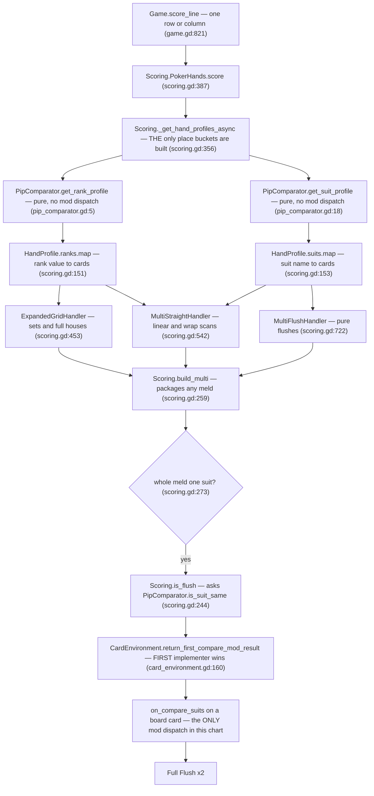
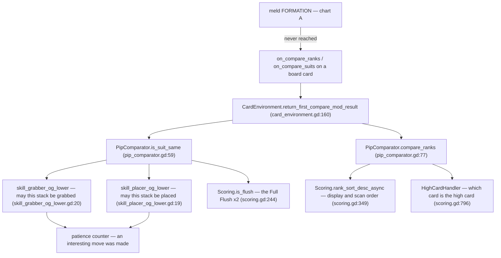
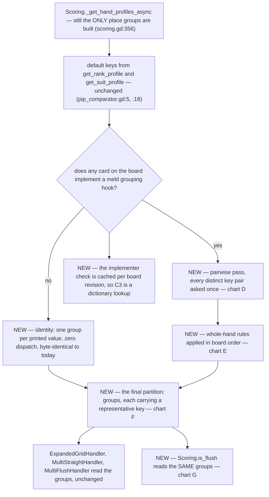
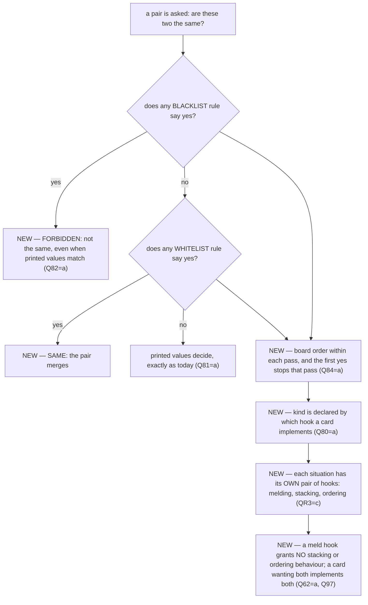
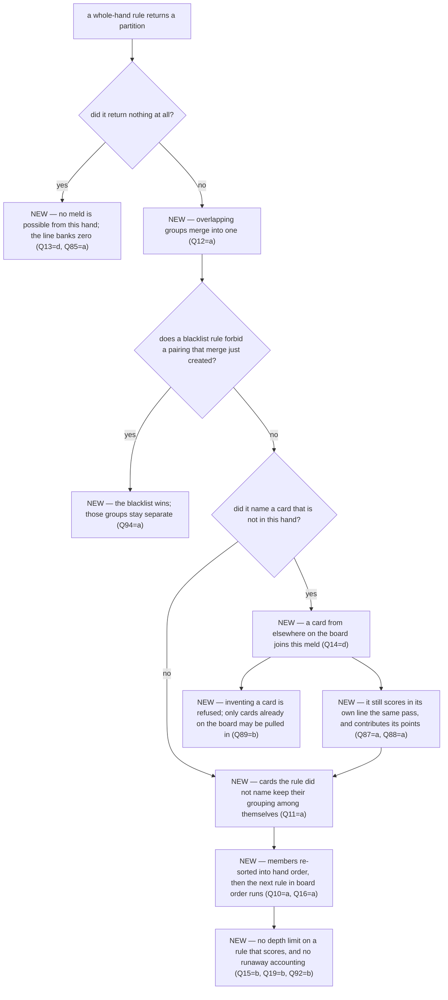
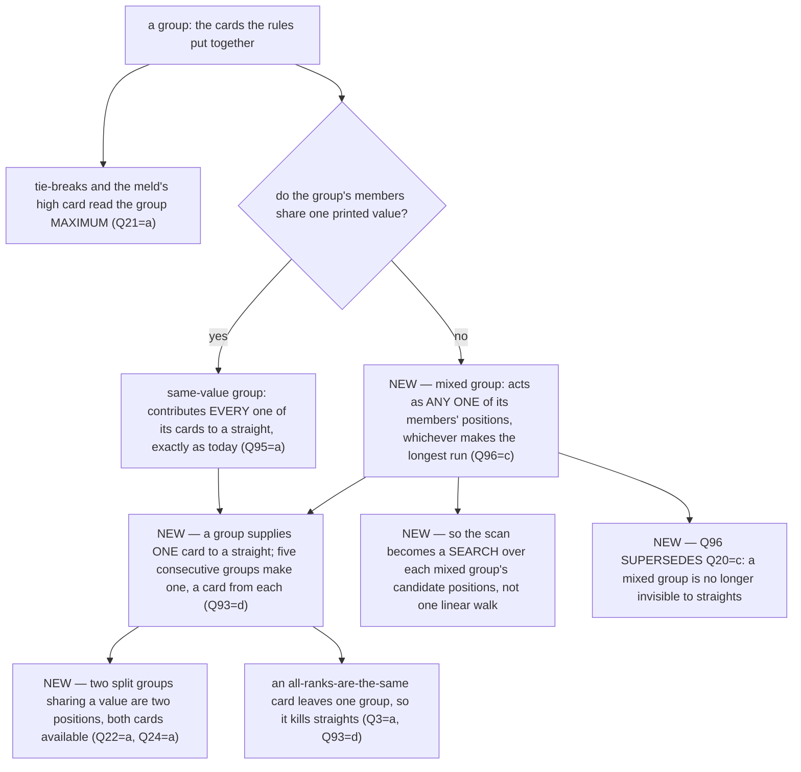
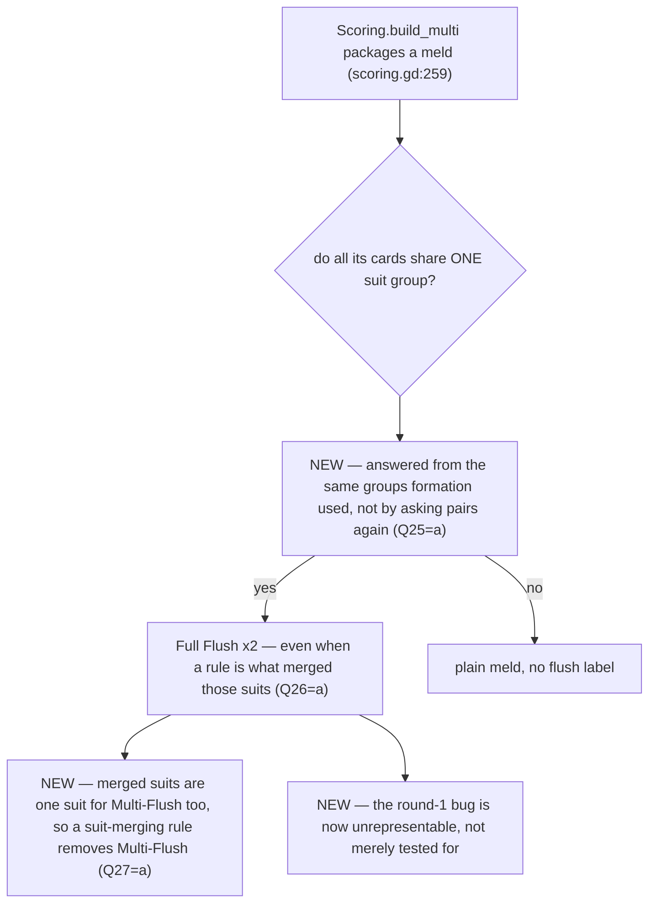
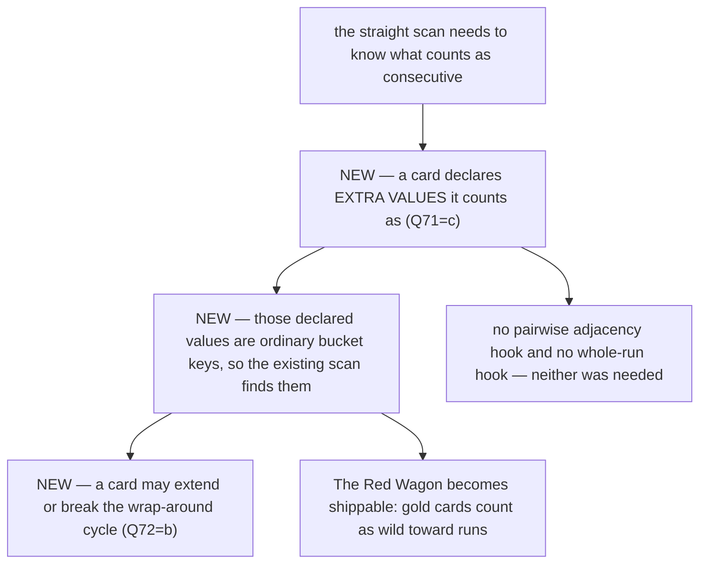
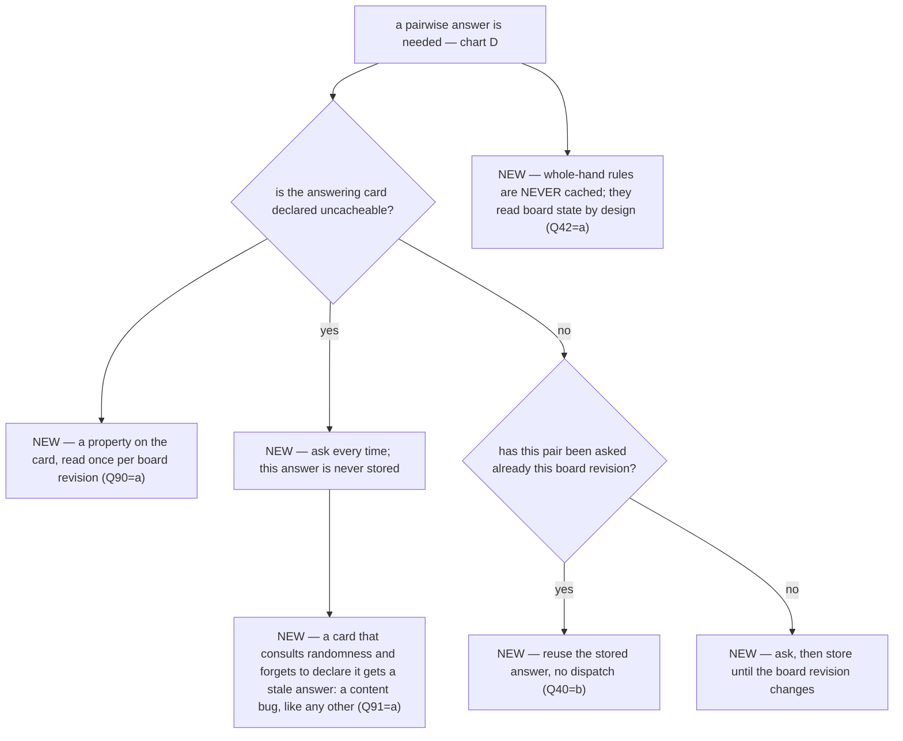

# Comparator buckets — how mods decide which cards count as the same

## How to review this document

- **Everything has an ID.** Questions are `QR*` (root forks) and `Q*`. Charts number their nodes
  `A1`, `B2`… Review by ID: "Q22 should be (b)" is a complete piece of feedback.
- **Every question has a *default*.** Answering nothing means every default is taken, and the
  design is still complete. You are correcting defaults, not composing a design.
- **Questions are gated.** Each carries `[…]` saying when it is asked at all. Answering a root
  question can remove whole sections. The tool never shows you a question your earlier answers
  made irrelevant, and you can always go back and change an answer — anything stranded on the
  abandoned path is marked inactive, never deleted, and comes back if you do.
- ⚠ **The roots here mostly default to "include it", so the DAG did NOT make the common path
  short.** Measured, not estimated: **80 questions, longest path 69**, and three rounds answered
  65 of them. What the branching bought you was amputating whole sub-features in one click —
  QR5(a), QR6(a) and QR7(a) each deleted a section.
- **"A step is missing" is the most valuable feedback you can give.** If a situation this feature
  can be in has no question covering it, say so — that is a hole in the design, not in your
  reading of it.
- **Nothing is implemented until you confirm the flowcharts.** §6 and §7 chart what the code
  does *now* — they were written first because they are read out of the source and cannot go
  stale from an answer. §9 to §14 chart what it *will* do and were written only after round 3,
  because a chart drawn before the answers is a guess with an ID on it. §8 lists what your
  answers changed.

There is an implementation plan beside this file (`PLAN.md`), and **`DEFERRED.md` indexes every
improvement and deferred feature this design left undone** — the cards blocked on each and the
seam where each would land. **This document is the authority on behaviour; where they disagree,
the plan is wrong.**

---

## 1. Audit facts

Read out of the code, not out of the docs. Everything downstream cites this section.

### 1a. The seam, stated exactly

*"Are these two cards the same?"* is answered **two different ways** inside one scoring pass:

| | how it answers | asks a mod? |
|---|---|---|
| **FORMATION** — which cards cluster into a meld | bucket keys built in `Scoring._get_hand_profiles_async` (`scoring.gd:356`) from `PipComparator.get_rank_profile` (`pip_comparator.gd:5`) and `get_suit_profile` (`:18`) | **no.** Both are pure functions of the pip, not even `async` — they *cannot* dispatch to a mod without being rewritten |
| **CLASSIFICATION** — what an already-formed meld is worth | `Scoring.is_flush` (`scoring.gd:244`) → `PipComparator.is_suit_same` (`pip_comparator.gd:59`), reached from `build_multi`'s Full-Flush branch (`scoring.gd:273`) and its Multi-Flush branch (`:295`) | **yes** |

Every meld maker consumes those two bucket maps and nothing else: sets and houses
(`scoring.gd:460`), the straight gate (`:406`) and both scanners (`:634`, `:659`), the pure-flush
gate (`:412`) and the flush handler (`:731`).

**Consequence, live today:** a suit mod cannot make five distinct suits into a flush, but *can*
turn an already-formed structure into a Full Flush and double its score. Same question, same
cards, two answers one step apart.

**Owner ruling (this is why the work exists):** *"If I wanted to override on compare, I would not
expect a valid hand to fail because it went down high card path instead before ever checking
valid on compare."*

⚠ **It is entirely latent.** No shipped card implements either hook — `grep "func on_compare_"
Cards/` finds nothing. The first card that does will look like a broken card rather than an
engine boundary. That also means **every signature involved can still be changed for free.**

### 1b. Where the compare hooks DO reach today

Move legality (`skill_grabber_og_lower.gd:20`, `skill_placer_og_lower.gd:19`), the Full-Flush
multiplier (`scoring.gd:273`), rank sort order (`scoring.gd:349`), the best-high-card walk
(`scoring.gd:796`), and — through the placement legality query — the patience counter.

`PipComparator.is_rank_next_to` (`pip_comparator.gd:120`) has **no production caller at all**;
straight adjacency is plain arithmetic on bucket keys (`scoring.gd:646`).

### 1c. Dispatch facts

- `CardEnvironment.return_first_compare_mod_result` (`card_environment.gd:160`) returns **the
  first implementing mod's answer** and never calls the rest. Pinned by
  `test_comparator.gd:212`.
- `_compare_implementers` (`card_environment.gd:141`) is **cached per board revision**
  (`_revision_key()`, `:138`), so "does anything implement this hook" is a dictionary lookup on
  Game and an uncached walk in tests and on the map.
- A skill's `spotlit` flag flips **without** a board revision bump; that is why the dispatch path
  re-checks it at use time (`:162`) rather than trusting the cache.

### 1d. Cost facts

`_get_hand_profiles_async` runs **more than once per scored line**: the shared gate profile
(`scoring.gd:399`), straights path A (`:566`) and path B (`:596`), flushes (`:727`), and once per
suit bucket of five-or-more per iteration of path A's extraction loop (`:623`). Four builds
minimum, `ESTIMATE` eight to sixteen on a wide board. `Game.score_line` (`Levels/game.gd:821`)
runs the whole thing once per scored row and column, and `skill_eval_poker_best.gd:18/27` scores
rows and columns again from inside a skill.

Distinct rank keys are capped by the cycle at 13 and suit keys at about 5, so a question asked
**per distinct key pair** has a hard ceiling of 78 and 10 — independent of board size. The same
question asked **per card pair** is 435 on a 30-card board. ⚠ **No benchmark exists for the
scoring path** (PERFORMANCE.md §4d), so every number here is arithmetic, not measurement.

### 1e. What planned content demands

Mined from `CARD_CATALOG.csv`. These are authored cards, not invented stress cases.

| card | what it needs |
|---|---|
| **The Best Bower** | counts as every suit **for flush evaluation, never for suit-stacking rules** — the same question needs different answers at different call sites |
| **Harlequin** | dual-suit: counts as both printed suits at once |
| **The Turk** | its rank is the rank of the card beneath it in the stack |
| **Clever Hans** | copies its highest adjacent neighbour's rank; alone, it is rank 1 |
| **Humbug** | while covered, copies the most valuable card in its row |
| **The Wildcard** | becomes a rank/suit present in its row, chosen deterministically, on every board change |
| **The Forged Ace** | counts as **two** Aces in melds |
| **Flea Circus** | counts as **five** rank-1 cards for combo counting |
| **The Red Wagon** | gold cards count as wild **toward runs** — adjacency, not sameness |
| **The Jongleur / One-Man Band / Greasepaint** | the identical question over **class tags**, not ranks or suits |
| **The Fire Marshal** | a **town hazard** — a modifier with no board card to live on |
| **The Courier / Puszta Five** | membership in several **melds**, which is a different axis entirely |

⚠ Four of these — context, multiplicity, class tags, non-card sources — are things the current
mechanism cannot express at any setting. Each gets a root question so it can be scoped in or out
deliberately rather than discovered later.

### 1f. Contracts this feature must obey

Board mutations bump `GameData.revision` after consistency (ARCHITECTURE_REVIEW §2). Per-act
state that undo must rewind lives on `GameData`. Warnings are errors, so every array and loop
variable is typed. User-facing strings go through `TRANSLATION.find`. Tuning knobs live in
`Scripts/player_settings.gd`.

---

## 2. State model

Every fact this feature introduces, and where it lives.

| fact | kind | lives | notes |
|---|---|---|---|
| **default bucket key(s)** of a pip | derived | computed per profile build | today's behaviour; one key per pip, several for a dual-suit card |
| **the class partition** — which cards count as the same | derived | rebuilt on every profile build | ⚠ never stored, never persisted |
| **representative key** of a class | derived | with the class | what the straight scanners read as a position |
| **card → its classes** reverse index | derived | with the profile | what incremental removal during extraction relies on |
| **"does anything implement this hook"** | cached | `CardEnvironment`, keyed on board revision | already exists |
| **`spotlit`** per skill | live flag | the skill | changes without a revision bump |
| **the call's context** (melding / stacking / ordering) | parameter | the call site | proposed; QR3 |

⚠ **Nothing here is persisted, saved, or undoable.** The partition is recomputed from the board
every time, so undo, save/load and resume need no work — and a stale cached partition is the only
way this feature could ever produce a wrong answer twice.

---

## 3. Usage enumeration

One row per situation this feature can be in. **A row with no question is a hole — say so.**

| situation | covered by |
|---|---|
| scoring a row / a column | QR1, §4, §5 |
| a skill that scores rows and columns from inside scoring (`skill_eval_poker_best`) | Q15 re-entrancy |
| grab legality / place legality | QR3, Q17 |
| rank sort order and best-high-card | QR3 |
| patience counter fed by the legality query | Q19 |
| Full Flush / Multi-Flush classification | Q25, Q26 |
| straights: linear scan and wrap-around scan | Q22, Q23, Q24, QR8 |
| a dual-suit card (Harlequin) | Q1, Q20 |
| a card whose identity depends on the board (Turk, Humbug, Clever Hans, Wildcard) | QR1=b\|c, Q16 |
| several grouping mods at once | Q10 |
| a mod on a rules card that is not itself in the scored hand | Q18 |
| a malformed or hostile mod return | Q11–Q14 |
| empty hand / one card / all stones | Q13, Q14 |
| a 30-card macro board | Q31 |
| undo, save/load, resume | §2 — nothing persisted, no question needed |
| headless and windowed test environments | §2 — the implementer cache is uncached in base environments |
| the map screen and deck viewer (no board environment) | §2 — no `CardEnvironment.CURRENT`, so the identity path is taken |
| the player trying to understand why a meld formed or did not | §8 — **the whole of §8 exists because a decided behaviour nobody can see is half a decision** |

---

## 4. Tunables

This feature introduces almost no numbers — it is structural. The ones it does introduce belong
in `Scripts/player_settings.gd` with the rest.

| knob | suggested start | what it means |
|---|---|---|
| grouping re-entry depth cap | 1 | how deep a grouping mod may re-enter scoring before the engine refuses (Q15) |
| runaway-event weight per grouping dispatch | 1 | what each grouping call costs against the existing per-act event cap (Q19) |

⚠ Everything else the plan discusses — representative keys, ordering, sanitize rules — is a
**contract**, not a knob. Making them configurable would mean two boards could disagree about
what a hand is.

---

## 5. The questionnaire

### § Root forks

- **QR1** `[root]` ⚑gate — Today, a rules card that overrides "are these two cards the same?" changes move legality and the Full-Flush bonus, but has **no effect on which cards clump into a meld** — five distinct ranks under an "all ranks are the same" card still score as High Card. How far should a card's influence over meld FORMATION go? · **(a)** pairwise only — the existing compare hooks drive grouping; a card answers one pair at a time and the engine works out the groups — **→ next:** how chains and conflicts resolve, and what a mixed group's rank is · **(b)** pairwise plus a whole-hand hook — the compare hooks drive grouping **and** a second, more powerful hook lets a card rewrite the grouping for a hand at once — **→ next:** everything in (a), plus ordering between such cards, malformed output, and what they may read · **(c)** whole-hand hook only — the pairwise compare hooks stay out of melding entirely — **→ next:** as (b), plus how a compare-only card is stopped from looking broken · **(d)** nothing changes — formation stays mod-proof — **→ next:** only the out-of-scope confirmations · *default* (b) ⇒ (d) skips §6–§11
- **QR2** `[QR1≠d]` ⚑gate — May a card make two cards that print the **same** rank or suit count as **different** — splitting a three-of-a-kind into a pair plus a loner? · **(a)** yes, merge and split — **→ next:** what happens when two groups both claim the rank "7", and what a split does to straights versus sets · **(b)** merge only — cards printing the same value always stay together — **→ next:** nothing about collisions; groups stay one-per-value as they are today · *default* (a) · notes ⇒ (b) skips Q22, Q24, Q33 and simplifies §8
- **QR3** `[root]` ⚑gate ⚑contract — **The Best Bower** is authored as *"counts as EVERY suit for flush evaluation (never for suit-stacking rules)"*. One hook currently answers for melding, stacking legality, sort order and high card alike, so that card cannot be written at all. Should the hook be told which question is being asked? · **(a)** yes, one marker set by the caller, distinguishing melding from stacking from ordering — **→ next:** which contexts exist, and what a card that ignores the marker does · **(b)** no, one answer covers every use — **→ next:** nothing; The Best Bower needs redesigning · **(c)** separate hooks per use instead of one marker — **→ next:** how many hooks there are, and what happens when a card implements only one · *default* (a) — ⚠ nothing implements these hooks yet, so changing them is free today and never again · notes
- **QR4** `[QR1≠d]` ⚑gate — Two cards on the board both answer "are these the same?", and they disagree. Today the first one found wins and the second is never asked. · **(a)** union — if **any** card says "same", they are the same — **→ next:** nothing about precedence; order stops mattering for this question · **(b)** first in board order wins, as today — **→ next:** how a player learns which card is first · **(c)** union, but a card may explicitly veto a merge — **→ next:** what beats what when a veto meets a merge · **(d)** two ordered passes — a rule declares itself a **blacklist** or a **whitelist**; every blacklist rule is asked first and the first "yes" FORBIDS the pairing outright, then whitelist rules are asked and the first "yes" allows it — **→ next:** how a rule declares which kind it is, what happens when neither pass answers, and whether the same two passes govern stacking legality · *default* (d) — your words, round 1: *"On first returned true. Certain types of legality are either blacklist or whitelist types. First checks blacklist type mods, first true means effect is blacklisted. Then checks whitelist, where first returned true is accepted."*
- **QR5** `[root]` ⚑gate — **The Forged Ace** counts as *two* Aces; **Flea Circus** counts as *five* rank-1 cards. Grouping puts each card in exactly one group exactly once, so it cannot express either. · **(a)** out of scope — those cards wait for a later change — **→ next:** nothing · **(b)** yes — such a card materialises extra copies of itself before grouping — **→ next:** whether the copies score points, and what undo does with them · **(c)** yes — a card carries a weight that counting respects — **→ next:** which counts respect it: set size, copy size, straight steps · *default* (a) ⇒ (a) skips §12a
- **QR6** `[root]` ⚑gate — **The Jongleur** counts as every *class*, **Greasepaint** adds one. That is the same "which group is this card in" question over class tags rather than ranks or suits. · **(a)** ranks and suits only for now — **→ next:** nothing · **(b)** build it generic and include class tags in this change — **→ next:** what a class group means for group effects and leader bonuses · *default* (a) ⇒ (a) skips §12b
- **QR7** `[root]` ⚑gate — **The Fire Marshal** is a town hazard that makes every Flames card count as Wax for a show. The engine only walks **cards on the board** looking for rules, so a hazard has nowhere to live. · **(a)** out of scope — hazards cannot change grouping yet — **→ next:** nothing · **(b)** add a run-level rule source that the walk also visits — **→ next:** where it lives, and whether undo rewinds it · *default* (a) ⇒ (a) skips §12c
- **QR8** `[root]` ⚑gate — **The Red Wagon** makes gold cards *"count as wildcards toward every column run"*. That is **adjacency** — what counts as consecutive — not sameness, and nothing in this change touches it. · **(a)** out of scope — straights keep using printed values — **→ next:** nothing; The Red Wagon cannot ship as written · **(b)** in scope — cards may also declare what counts as consecutive — **→ next:** how adjacency is asked, and whether the wrap-around cycle is affected · *default* (a) ⇒ (a) skips §12d

### § 6. Pairwise grouping — one pair at a time becomes groups `[QR1≠d]`

- **Q1** `[QR1=a|b]` ⚑contract — A hand holds an ordinary 7 and an exotic 7 of a different pip class. They already share a bucket today. When a card is asked "are these the same?", is that **one** question about the value 7, or **two** questions about two different pips? · **(a)** one — pips printing the same value are interchangeable to whoever is asked · **(b)** two — ask separately per pip class, so a card can tell them apart · *default* (a) · notes
- **Q2** `[QR1=a|b]` — A rule like *"ranks within 1 of each other are the same"* says 1 matches 2 and 2 matches 3, but **not** 1 and 3. What should the hand 1, 2, 3 become? · **(a)** one group of three — matches chain, so the answer is defined and does not depend on which pair was checked first · **(b)** leave them apart — a rule that is not self-consistent is refused · **(c)** whichever the engine happens to check first · *default* (a) — ⚠ (c) means two identical boards can score differently
- **Q3** `[QR1=a|b]` — An "all ranks are the same" card turns a five-card run into one five-of-a-kind and **destroys the straight**, because only one rank position is left to walk. Is that the intended reading? · **(a)** yes — the rule says the ranks are the same, so there is no run · **(b)** no — scoring should try both the merged and the unmerged reading and keep whichever scores better · *default* (a) — ⚠ (b) roughly doubles the scoring work whenever such a card is in play · notes
- **Q4** `[QR2=a]` — A card answers "different" for two cards printing the **same** rank. Honour it? · **(a)** yes, they split · **(b)** no — printed sameness is a floor nothing can undo · *default* (a)
- **Q5** `[QR1=a|b]` — A **skill** card carries the rule, and skills only act while spotlit. Should an unspotlit skill's rule affect grouping? · **(a)** no — it is dormant like every other skill effect · **(b)** yes — grouping is structural and ignores the spotlight · *default* (a)
- **Q6** `[QR4=c]` ⚑contract — A card vetoes a merge another card asked for. Which wins? · **(a)** the veto, always · **(b)** the merge, always · **(c)** whichever card is earlier in board order · *default* (a)
- **Q7** `[QR1=c]` — With the pairwise hooks out of melding, a card implementing only the compare hook silently does nothing to melds. How is that stopped from looking like a bug? · **(a)** the engine refuses to load such a card · **(b)** allowed and documented — the compare hook is for legality and ordering only · **(c)** the engine treats it as a whole-hand rule automatically · *default* (c)

### § 7. Whole-hand grouping — the powerful hook `[QR1=b|c]`

- **Q10** `[QR1=b|c]` ⚑gate — Two cards both want to rewrite the grouping. In what order do they act? · **(a)** board order — the second sees the first's work, the way joker order matters in the genre — **→ next:** how the player learns the order, and what the second card is allowed to see · **(b)** an authored priority number per card — **→ next:** what the numbers mean and what a tie does · **(c)** a fixed, arbitrary but stable order the player cannot influence — **→ next:** nothing about ordering as a mechanic · *default* (a)
- **Q11** `[QR1=b|c]` ⚑contract — A card rewrites the grouping but mentions only three of the eight cards in the hand. What happens to the five it did not mention? · **(a)** they keep their grouping among themselves — mentioning three means "put these three together", not "shatter everything else" · **(b)** each becomes its own group · **(c)** the answer is rejected as incomplete · *default* (a)
- **Q12** `[QR1=b|c]` ⚑contract — A card returns overlapping groups, one card appearing in two of them. · **(a)** merge them into one group, so the result is always internally consistent · **(b)** the first group wins and later mentions are ignored · **(c)** reject the whole answer and log an error · *default* (a)
- **Q13** `[QR1=b|c]` ⚑gate ⚑contract — A card returns nothing at all — an empty or absent grouping. · **(a)** treat it as "no change" — **→ next:** nothing · **(b)** treat it as "every card alone", which still leaves a High Card — **→ next:** nothing · **(c)** reject it and log an error, keeping the previous grouping — **→ next:** nothing · **(d)** honour it as "no meld is possible from this hand" — a real effect, distinct from (b) — **→ next:** whether the line then scores absolutely nothing, or still scores its High Card · *default* (d) — your words, round 1: *"assuming an actual no grouping would be 1 group of 1 card per card in meld. If mod is basically saying, ignore all cards in this hand, no meld possible, then allow it."*
- **Q14** `[QR1=b|c]` ⚑gate ⚑contract — A card returns a grouping naming a card that is not in this hand. · **(a)** drop the stray silently — **→ next:** nothing · **(b)** drop it and log an error — **→ next:** nothing · **(c)** reject the whole answer — **→ next:** nothing · **(d)** accept it — a rule may pull a card in from elsewhere on the board, or an invisible card of its own making, and make it part of this meld — **→ next:** whether a pulled-in card also scores in its own line, whether it earns points, and how an invisible card relates to QR5 · *default* (d) — your words, round 1: *"Why not? if a mod purposely adds an extra invisible card or chooses an existing card on the board to participate in the meld as well, why reject it?"*
- **Q15** `[QR1=b|c]` ⚑gate ⚑contract — A grouping card **scores a hand from inside the grouping call**. Not hypothetical: a shipped skill already scores rows and columns from inside scoring. · **(a)** allowed, but only one level deep — deeper is refused and logged — **→ next:** nothing · **(b)** allowed with no limit — **→ next:** whether anything at all stops a runaway, given you also removed grouping from the runaway cap · **(c)** forbidden — a grouping card may not score — **→ next:** nothing · *default* (a) · notes
- **Q16** `[QR1=b|c]` — May a grouping card see the grouping **as the cards before it left it**, or always the untouched original? · **(a)** as the cards before it left it — rules build on each other · **(b)** always the original — every card answers independently and the engine combines the results · *default* (a) — ⚠ (b) makes ordering irrelevant, and also makes "split what that card merged" impossible to express
- **Q17** `[QR1=b|c]` — Should whole-hand grouping also govern **stacking legality** — what may be placed on what — or melding only? · **(a)** melding only; legality keeps asking pairwise · **(b)** both · *default* (a)
- **Q18** `[QR1=b|c]` — Must the card carrying a grouping rule be **in the hand being scored**, or does any card on the board or in the rules deck apply? · **(a)** any board or rules card applies — it is a rule, not a participant · **(b)** only when its own card is in the hand being scored · *default* (a)
- **Q19** `[QR1=b|c]` — A grouping card runs arbitrary work, several times per scored line. Should each call count against the runaway-event cap that already protects an act from a pathological card? · **(a)** yes — a runaway grouping card trips the same guard as any other · **(b)** no — grouping is engine work, not card work · *default* (a)

### § 8. What a group IS `[QR1≠d]`

- **Q20** `[QR1≠d]` ⚑contract — A group formed from ranks 3 and 7 has to occupy **one** position when the engine walks for straights. Which? · **(a)** the lowest member — the group sits at 3 · **(b)** the highest member — it sits at 7 · **(c)** the group is invisible to straights entirely · *default* (a) · notes
- **Q21** `[QR1≠d]` ⚑contract — That same mixed group has to report a rank for tie-breaks and for "the meld's high card". Which? · **(a)** the highest member · **(b)** the lowest member · **(c)** the same one it uses for straights · *default* (a)
- **Q22** `[QR2=a]` — After a split, **two** separate groups both print rank 7. When the engine walks for a straight, is position 7 available once or twice? · **(a)** twice — both cards are available; splitting affects sets, not runs · **(b)** once — a split removes the other card from runs too · *default* (a)
- **Q23** `[QR1≠d]` — Merging reduces how many distinct rank positions exist, so a merging card makes sets bigger and straights **shorter**. Confirm that is the intended trade? · **(a)** yes · **(b)** no — see Q3(b); scoring should try both readings · *default* (a)
- **Q24** `[QR2=a]` — Symmetrically, a split makes sets **smaller** while leaving runs untouched. Confirm? · **(a)** yes — they are different questions and may have different answers · **(b)** no — a split should shrink both · *default* (a)

### § 9. Classification — the Full Flush `[QR1≠d]`

- **Q25** `[QR1≠d]` ⚑contract — "Is this whole meld one suit?" decides the Full-Flush x2 bonus. Should it read the same groups melding used, or keep asking pairwise as it does today? · **(a)** the same groups — formation and classification can then never disagree · **(b)** keep pairwise · **(c)** both, and it only counts as a flush when they agree · *default* (a) — ⚠ (b) preserves exactly the inconsistency this change exists to remove
- **Q26** `[QR1≠d]` — A card makes five different suits count as one, so the hand now forms a flush. Does it also get the Full-Flush **x2 multiplier**? · **(a)** yes — it is a flush by the rules in play · **(b)** no — the x2 is reserved for printed single-suit melds · *default* (a)
- **Q27** `[QR1≠d]` — Same question for **Multi-Flush**, which needs two or more *distinct* suits. A card that merges suits makes distinct suits one, so Multi-Flush disappears. Intended? · **(a)** yes — merged suits are one suit for every purpose · **(b)** no — Multi-Flush should keep counting printed suits · *default* (a)

### § 10. How the player can TELL `[QR1≠d]`

- **Q30** `[QR1≠d]` ⚑gate — A card is making unlike cards count as the same. How does the player see that it happened? · **(a)** nothing extra — the existing meld highlight already shows which cards scored together — **→ next:** nothing more about cues · **(b)** the affected pips carry a cue while the rule is live — **→ next:** when the cue shows · **(c)** the meld's name says so — **→ next:** how the name is phrased · *default* (b)
- **Q31** `[Q30=b]` — When does that cue appear? · **(a)** permanently, while the rule card is in play — the board reads differently all show · **(b)** only during the scoring animation, on the cards being counted · **(c)** only on hover or inspect · *default* (a)
- **Q32** `[Q30=c]` — How should the meld name read when a rule made it? · **(a)** the ordinary name, unchanged · **(b)** the ordinary name with a marker · **(c)** the name plus the rule card's name · *default* (b)
- **Q33** `[QR2=a]` — A split means the meld is **smaller than it looks**: three matching cards on screen, only two of them counted. How is that explained? · **(a)** nothing — the highlight shows which two counted · **(b)** the excluded card visibly dims or is marked out during scoring · **(c)** the score breakdown names the rule that excluded it · *default* (b) — ⚠ (a) is the reading most likely to be reported as a scoring bug
- **Q34** `[Q10=a]` — Board order decides which grouping card acts first, so two identical boards with those cards swapped score differently. How does the player learn that order? · **(a)** nothing — board order is on screen already · **(b)** the grouping cards carry a visible index while more than one is out · **(c)** the score breakdown lists them in the order they applied · *default* (b)

### § 11. Cost and caching `[QR1≠d]`

- **Q40** `[QR1≠d]` ⚑gate — Asking a card the same pair question over and over could be avoided by remembering the answer until the board changes. **No benchmark for the scoring path exists**, so building it now would be a guess. · **(a)** wait for a benchmark, then decide — **→ next:** nothing · **(b)** build the cache now — **→ next:** the promise content must then obey · **(c)** never cache — always ask — **→ next:** nothing · *default* (a)
- **Q41** `[Q40=b]` ⚑gate ⚑contract — Caching requires promising that a card answers **the same way for the same two pips until the board changes**. A card consulting a die roll or a timer would break it. Accept that as a rule content must obey? · **(a)** yes — **→ next:** nothing · **(b)** no, which means no cache — **→ next:** nothing · **(c)** cache everything by default, and let a card that consults randomness declare itself uncacheable — **→ next:** how it declares that, and what happens when one forgets · *default* (c) — your words, round 1: *"cache everything except cards that consult rng then"*
- **Q42** `[QR1=b|c]` — Whole-hand grouping cards read board state by design — Humbug reads cover, The Turk reads the card beneath — so their answers **cannot** be cached the way pairwise answers can. Confirm they re-run on every scoring pass? · **(a)** yes, always fresh · **(b)** cache them too, with an explicit "recalculate" the card must call · *default* (a)

### § 12a. Branches opened by non-default answers

Nothing here is asked on the default path. Each of these exists because a root option promised it.

- **Q60** `[QR3=a]` ⚑contract — Which situations should the marker distinguish? · **(a)** three — melding, stacking legality, ordering (sort and high card) · **(b)** two — melding and everything else · **(c)** four — as (a), but the patience counter's legality query is its own case so a card can be interesting without being wild · *default* (a)
- **Q61** `[QR3=a]` ⚑contract — A card answers without looking at the marker. What did it mean? · **(a)** the same answer everywhere — the marker is opt-in · **(b)** melding only — the safest reading, and stacking stays printed-value · *default* (a) — ⚠ (b) silently changes what a card written before the marker existed would do, but nothing is written yet
- **Q62** `[QR3=c]` ⚑contract — With separate hooks per situation, what happens when a card implements only the melding one? · **(a)** it affects melding only; the others fall back to printed values · **(b)** the one hook answers for all of them · **(c)** melding only — and on top of that, a card may not implement more than one of the per-situation hooks at once · *default* (c) — your words, round 2: *"then only effects dependent on meld hooks are affected. A hook cannot have multiple potential implementers or implement different hooks at the same time."*
- **Q63** `[QR4=b|d]` — With "first card found wins", two identical boards score differently depending on card order. How does the player learn which card won? · **(a)** nothing — board order is on screen · **(b)** the losing card visibly does nothing while the winner is live · **(c)** the score breakdown names the card that answered · *default* (c)
- **Q64** `[QR5=b]` — A card that materialises copies of itself for melding: do the copies **score points** as well as count toward the meld? · **(a)** no — they count for structure only, the way Flea Circus is authored ("combo counting, not points") · **(b)** yes — a copy is a card in every way · *default* (a)
- **Q65** `[QR5=b]` — Do those copies exist anywhere outside the scoring pass — can a prop hit them, can undo see them? · **(a)** no — they exist only while the hand is being evaluated · **(b)** yes — they are real cards on the board for the duration of the show · *default* (a)
- **Q66** `[QR5=c]` ⚑contract — A card carries a weight of 2. Which counts respect it? · **(a)** set size and copy size, but not straight steps — a doubled card is two of a kind, not two positions in a run · **(b)** every count, straights included · **(c)** set size only · *default* (a)
- **Q67** `[QR6=b]` — With class tags in scope, what does a class group mean for group effects — "every Clown scores again", say? · **(a)** membership is membership; a card grouped into Clown is a Clown for every group effect · **(b)** grouped-in members count for effects but not for "how many classes do you have" totals · *default* (a)
- **Q68** `[QR6=b]` — **The Jongleur** counts as every class *at half value*. Does grouping carry that kind of scaling, or is it membership only? · **(a)** membership only — scaling stays each card's own business · **(b)** a group membership may carry a weight · *default* (a)
- **Q69** `[QR7=b]` ⚑contract — Where does a run-level rule source live? · **(a)** on the run, beside the other per-run state, so it is saved and restored with the run · **(b)** on the act, cleared when the show ends · **(c)** as an invisible card the board walk already visits · *default* (a) · notes
- **Q70** `[QR7=b]` — Should undo rewind a hazard's grouping rule? · **(a)** no — a hazard is a property of the town, not a move · **(b)** yes — anything that changes scoring must be rewindable · *default* (a)
- **Q71** `[QR8=b]` ⚑contract — How should a card declare what counts as consecutive? · **(a)** the same pairwise shape as sameness — "is this rank next to that one?" · **(b)** a whole-run hook — the card is handed the run so far and says what may extend it · **(c)** by declaring extra values a card counts as, so the ordinary scan finds it · *default* (c) — ⚠ (c) is the cheapest and is expressible as bucket keys today; (a) and (b) both need new scanner machinery
- **Q72** `[QR8=b]` — Does a card's adjacency rule also change the **wrap-around** cycle — whether King connects back to Ace? · **(a)** no — the cycle's ends are fixed · **(b)** yes — a card may extend or break the wrap · *default* (a)
- **Q73** `[Q10=b]` ⚑contract — With authored priority numbers, what does a tie mean? · **(a)** board order breaks the tie · **(b)** a tie is an authoring error and is logged · *default* (a)

### § 12b. Opened by round 1's own-words answers

Everything here exists because of something you wrote rather than clicked. Nothing in this section
was askable in round 1.

- **Q80** `[QR4=d]` ⚑contract — How does a rule declare itself a blacklist or a whitelist? · **(a)** two separate hooks, one per kind — consistent with your QR3(c) choice of separate hooks per situation · **(b)** one hook plus a property on the card saying which kind it is · **(c)** the returned value carries the kind · *default* (a)
- **Q81** `[QR4=d]` ⚑contract — Neither pass answers: no blacklist rule forbade the pairing and no whitelist rule allowed it. What then? · **(a)** printed values decide, exactly as they do today — the passes only ever override · **(b)** not the same — silence means deny · **(c)** the same — silence means allow · *default* (a)
- **Q82** `[QR4=d]` — May a blacklist rule forbid a pairing that **printed values already make the same** — splitting two ordinary 7s? · **(a)** yes — that is the same power QR2(a) and Q4(a) already granted · **(b)** no — a blacklist may only cancel what another rule merged · *default* (a)
- **Q83** `[QR4=d]` ⚑contract — Do the two passes govern **every** situation — melding, stacking legality, ordering — or melding only? Your note spoke of "types of legality", and QR3(c) gives each situation its own hook. · **(a)** each situation gets its own blacklist/whitelist pair · **(b)** melding only; the others keep first-found-wins · *default* (a)
- **Q84** `[QR4=d]` — Within one pass, the first "yes" decides. Are the remaining rules of that kind still **asked** (their side effects fire, and they feed the patience counter), or skipped? · **(a)** skipped — stop at the first yes, as the engine does today · **(b)** asked anyway, so a rule always knows it was consulted · *default* (a)
- **Q94** `[QR4=d]` ⚑contract — You accepted Q12(a) — overlapping groups merge — with the note *"as long as resulting merged group is legal according to the rules"*. Under the two passes, merging two overlapping groups can produce a pairing a blacklist rule forbids. Which wins? · **(a)** the blacklist — the groups stay separate and the overlap is dropped · **(b)** the merge — group structure outranks a pairwise rule · *default* (a)
- **Q85** `[Q13=d]` ⚑contract — "No meld is possible from this hand": does the line then score **absolutely nothing**, or does it still score its High Card? · **(a)** nothing at all — the line banks zero · **(b)** High Card survives, because a single card is not a meld · *default* (a) · notes
- **Q87** `[Q14=d]` — A rule pulls in a card that belongs to another row or column. Does that card **also** score in its own line during the same pass? · **(a)** yes, both — it is on the board twice over, and that is the effect · **(b)** no — being pulled in consumes it for this pass · *default* (a)
- **Q88** `[Q14=d]` — Does a pulled-in card contribute its **points**, or only complete the structure? · **(a)** points too, like any scored card · **(b)** structure only — it makes the meld without adding value · *default* (a)
- **Q89** `[Q14=d]` ⚑contract — An "invisible card of its own making" is the same thing QR5(b) describes — a card materialising extras. ⚠ If you keep QR5(a) *out of scope* while Q14(d) lets a rule invent a card, the design says two different things. · **(a)** they are one mechanism — answering Q14(d) pulls QR5 into scope with it · **(b)** they are separate: Q14(d) may only pull in cards that **already exist on the board**, never invent one · *default* (b) · notes
- **Q90** `[Q41=c]` ⚑contract — How does a card declare itself uncacheable? · **(a)** a property the card sets, checked once per board revision · **(b)** a dedicated hook name the engine looks for · **(c)** the engine detects randomness automatically — ⚠ not reliably implementable; a card can reach a die roll through any call · *default* (a)
- **Q91** `[Q41=c]` — A card consults randomness and **forgets** to declare itself uncacheable. What happens? · **(a)** it gets a stale answer for the rest of the board revision — a content bug, like any other · **(b)** the engine invalidates the cache whenever the run's randomness advances, so forgetting is harmless but the cache is weaker · *default* (a)
- **Q92** `[Q15=b]` — You allowed unlimited re-entrancy (Q15 b) **and** removed grouping from the runaway-event cap (Q19 b). Together, nothing currently stops a grouping rule from hanging a submit — not a hypothetical, since a shipped skill already scores from inside scoring. Should there be a backstop? · **(a)** a hard ceiling — after N nested scoring passes the engine aborts that grouping call and logs it · **(b)** no backstop; content is trusted · **(c)** put grouping back under the existing runaway cap, reversing Q19 · *default* (a) · notes
- **Q93** `[root]` ⚑contract — ⚠ **Two of your round-1 answers disagree.** Q3(a) said the merged reading stands, so an "all ranks are the same" card destroys the straight. Q23(b) said scoring should instead try both the merged and unmerged readings and keep whichever scores better. Which holds? · **(a)** Q3 — one reading only, the merged one; a merging card genuinely kills straights · **(b)** Q23 — evaluate both readings and keep the higher score, at roughly double the scoring work whenever such a card is out · **(c)** both readings, but only when a card explicitly asks for the double evaluation · **(d)** Q3 holds — one reading, the merged one — **and** a grouping counts as one card in a straight: five groupings that are consecutive form a straight, taking one card from each · *default* (d) — your words, round 2: *"Q3. groupings count as 1 card in a straight. 5 groupings where each one is connected straight wise should be a straight choosing 1 card from each grouping."* · notes

### § 12c. Opened by round 2 — the straight rule, and one contract to disambiguate

Your Q93 note settled the Q3/Q23 conflict in Q3's favour and then added a rule the questionnaire
had never asked about: *"groupings count as 1 card in a straight. 5 groupings where each one is
connected straight wise should be a straight choosing 1 card from each grouping."* That is a
clearer model than anything on offer — and it reaches further than the case it was answering.

- **Q95** `[root]` ⚑contract — Today, three 7s sitting in one bucket give the wrap-around straight scan **three** cards at position 7, so a long multi-loop run can use all three. Read literally, "a grouping counts as 1 card in a straight" would cut that to one and change shipped behaviour. Does the one-card rule apply to an **ordinary** group of same-value cards? · **(a)** no — same-value groups keep contributing every card, exactly as today; the one-card rule governs groups a rule MERGED across different values · **(b)** yes — every group contributes exactly one card to a straight, and today's multi-loop wrap behaviour changes with it · *default* (a) · notes
- **Q96** `[root]` ⚑contract — Q20(c) said a group merged across different values — a 3 and a 7 together — is **invisible to straights**. Q93 says five connected groupings make a straight, one card from each. So what position is a MIXED group connected at? · **(a)** none — Q20(c) stands; only a group whose members share a printed value has a position at all · **(b)** its lowest member's position · **(c)** any one of its members' positions, whichever makes the longest run — the wild-card reading · *default* (a) · notes
- **Q97** `[QR3=c]` ⚑contract — Your Q62 note added *"A hook cannot have multiple potential implementers or implement different hooks at the same time."* Two readings, and they differ sharply. · **(a)** one **card** may implement only one of the per-situation hooks — several different cards may still implement the same hook, which is exactly what QR4(d)'s blacklist and whitelist passes walk · **(b)** only one card on the board may implement a given hook at all; a second card carrying it is an authoring error — ⚠ this contradicts QR4(d), whose whole shape is asking every blacklist rule and then every whitelist rule · **(c)** a meld hook is never reused for another situation; a card wanting stacking rules as well implements the stacking hook too · *default* (c) — your words, round 3: *"I only meant that you cannot directly reuse a card with a meld hook for stuff like stacking hooks. if i wanted a card to also have stacking rules then it needs to implement stacking hook too."*

### § 12. Deliberately out of scope — confirm each `[root]`

Confirming an exclusion is cheap. Discovering one late is not.

- **Q50** `[QR5=a]` — **The Forged Ace** and **Flea Circus** cannot be implemented after this lands. Confirm they wait, and that it is recorded against those cards? · **(a)** yes · **(b)** no, raise them into scope · *default* (a)
- **Q51** `[QR8=a]` — **The Red Wagon**'s "wild toward runs" cannot be implemented after this lands. Confirm? · **(a)** yes · **(b)** no, raise it into scope · *default* (a)
- **Q52** `[QR6=a]` — Class-tag grouping — **The Jongleur**, **Greasepaint** — waits for a later change, though the machinery will be built so it can be reused. Confirm? · **(a)** yes · **(b)** no · *default* (a)
- **Q53** `[QR7=a]` — Town hazards cannot change grouping. Confirm? · **(a)** yes · **(b)** no · *default* (a)
- **Q54** `[root]` — **The Courier** and **The Puszta Five** put one card into several *melds* at once. That is a different axis and no amount of grouping work addresses it. Confirm it is untouched here? · **(a)** yes · **(b)** no, it belongs in this change · *default* (a)
- **Q55** `[root]` — Ordering comparisons — sort order, high card — keep the "first card found wins" rule even if sameness becomes a union (QR4). Numbers cannot be merged the way group memberships can. Confirm? · **(a)** yes · **(b)** no, ordering needs a composition rule too · *default* (a)
- **Q56** `[root]` — Half-step ranks such as a 2½, and multi-suit pips beyond the dual-suit case, are already stubbed as future work and stay stubbed. Confirm? · **(a)** yes · **(b)** no · *default* (a)
- **Q57** `[root]` — The scoring path rebuilds its groups several times per scored line (§1d). Making it build once is a separate optimisation and is **not** in this change. Confirm? · **(a)** yes · **(b)** no, fold it in · *default* (a)

---

## 6. Flowchart A — TODAY: how a hand becomes buckets, and who reads them

⚠ **This is the only kind of chart that may exist before the first answer round: it is read out
of the code and cannot go stale from an answer.** The charts describing the new behaviour are
written after this round, from the answers.



**Read the shape, not the boxes:** everything from `A3` down the left is pure — no card is ever
asked anything. The single mod dispatch in the whole chart hangs off `A12`, *after* the meld has
already been built. That gap between `A6`/`A7` and `A15` **is** the seam.

## 7. Flowchart B — TODAY: where the compare hooks DO reach



`B11` is the whole design problem in one dashed thought: formation is the one consumer that never
arrives at `B1`.

---

## 8. What your answers changed

Written after round 3, from the answers — not from the draft that went in. Five things came back
differently from what the plan assumed, and two of them are structural.

| | what the plan assumed | what you decided |
|---|---|---|
| **composition** | union — any rule saying "same" merges | **QR4(d)** two ordered passes: every blacklist rule first, the first "yes" forbids outright; then whitelist, first "yes" allows; silence means printed values decide (Q81 a) |
| **adjacency** | out of scope; The Red Wagon unshippable | **QR8(b)** in scope — and by the cheap route: a card declares extra values it counts as, so the ordinary scan finds them (Q71 c), and it may break the wrap (Q72 b) |
| **a mixed group in a straight** | it sits at its lowest member's position | **Q96(c)** it acts as **any one** of its members' positions, whichever makes the longest run — ⚠ **this supersedes your Q20(c)**, which had made mixed groups invisible to straights |
| **an empty return / a stray card** | reject and log | **Q13(d)** an empty grouping means "no meld is possible", and the line banks zero (Q85 a); **Q14(d)** a rule may pull a board card into this meld, though it may not invent one (Q89 b) |
| **caching** | wait for a benchmark | **Q40(b)** build it now, with **Q41(c)** cards declaring themselves uncacheable |

Two answers I want to name plainly rather than bury, because both are yours to own and neither is
a mistake I should quietly design around:

- **Q92(b) — no backstop.** With unlimited re-entrancy (Q15 b) and grouping outside the
  runaway-event cap (Q19 b), nothing stops a pathological grouping card from hanging a submit. It
  is recorded as an accepted risk, not smoothed over.
- **Q30(a), Q33(a), Q34(a) — no player-facing cue at all.** Q33 is the one to watch: three
  matching cards on screen and only two counted is the shape most likely to be reported as a
  scoring bug.

And one place the answers **increase the work** beyond anything the plan costed: Q96(c) turns the
straight scan from a single walk into a **search** over each mixed group's candidate positions.
Chart F, node F8. It is bounded — thirteen positions, few merged groups — but it is not the
linear scan the code has today, and no benchmark exists for it.

## 9. Flowchart C — where a hand's groups now come from



**C4 is the whole safety argument.** No shipped card implements any of these hooks, so C4 is the
path taken today, and behaviour cannot change until content asks for it.

## 10. Flowchart D — one pairwise question, under the two passes



⚠ **D3 is the power that makes splitting real.** A blacklist rule can separate two ordinary 7s,
which is what QR2(a) and Q4(a) allow and what chart F's F7 then has to represent.

## 11. Flowchart E — a whole-hand rule's answer, and what the engine does with it



## 12. Flowchart F — what a group is, and how a straight reads it



⚠ **F8 is the cost this design did not previously carry.** Today `_scan_linear` and `_scan_wrap`
walk sorted positions once. Under F5 a mixed group has several candidate positions and the longest
run depends on which one it takes, so the walk becomes a search. Bounded by thirteen positions and
by how many mixed groups a board actually has — and unmeasured, like everything else on this path.

## 13. Flowchart G — classification can no longer disagree with formation



## 14. Flowcharts H and I — adjacency, and the cache

Adjacency came into scope at QR8(b), by the route that needs no new scanner machinery.





## 15. What this document deliberately does not contain

- **No code, no signatures, no file lists, no step ordering, no test plan.** Those live in
  `PLAN.md`, which was re-derived from this document after confirmation.
- **No charts of the proposed behaviour.** They are written from the answers, then reviewed, then
  confirmed — in that order.
- **No balance numbers.** Whether a merging card is too strong is a playtest question, and the
  sim cannot answer it.
- **No art or cue design.** §10 asks *whether* the player is told and *when*; what the cue looks
  like is a later art call.

---

## 16. Gap protocol

## Design provenance and gap protocol — COPY THIS BLOCK INTO ANYTHING DERIVED FROM THIS DOCUMENT

Derived from: `solatro/design/comparator_buckets/DESIGN.md`, version 1, confirmed <pending>. Every
step below cites the design node IDs it implements.

If you are executing this and you reach a decision the design does not cover:
1. Reversible and clearly within intent → do it, and append one line to `ASSUMPTIONS.md` citing the
   node you were working on. Never silently.
2. Otherwise — two defensible choices differ in observable behaviour, or the choice is expensive to
   reverse, or it is an owner call (balance, look, scope) → **park that thread, file a gap, keep
   working on unaffected threads, and tell the owner.**
3. The design contradicts itself or the code → always a gap, highest priority.
4. ⚠ **Two documents disagreeing is NOT automatically (3).** If both are restating the same answer,
   go read that answer — the conflict is a documentation bug to fix against the source, not a
   decision to escalate. Quote the note in the gap and say why it does not settle the question; if
   you cannot, it was never a gap.

File gaps at `solatro/design/comparator_buckets/gaps/GAP-NNN.md` using the template in
`solatro/design/comparator_buckets/DESIGN.md` §gap-protocol. Write the options in the questionnaire
grammar; they become the next round's questions unchanged.

Do not resolve a gap by picking an answer. Do not proceed on the parked thread. Do not delete a gap
— it is closed by a new design version.

This block, unchanged, goes into every document derived from this one.

### The gap file template

```markdown
# GAP-007 — <one-line title>
status: open | questioned | resolved | withdrawn
outcome: answered | withdrawn | superseded
raised: <date>, during <execution plan step>
design: DESIGN.md version <N>, nodes <A3, Q11>
severity: GAP | CONTRADICTION

**What the design says** — <quote it, cited>
**What the ANSWER says** — <the verbatim note from answers.json for every question involved, and
  why it does not settle this>
**What it does not say** — <the decision that has to be made, stated as a decision>
**Why it blocks** — <which triage test it meets, concretely>
**Options I can see** — **(a)** … — consequence · **(b)** … — consequence · *my recommendation* (a)
**Blast radius** — plan steps <4, 9>; design nodes <A3, Q11>
**Meanwhile** — parked <thread>; continued on <threads>
```

---

## 17. Prior art

Checked before committing to the design. **Nothing here is novel, which is the point** — both
halves of the pipeline are shipped patterns in games with far harder rules than this one.

### Magic: The Gathering — the layer system (CR 613)

The canonical solution to "many continuous effects rewrite one object's characteristics." Two
properties this plan copies:

- **Base state vs projected state.** The stored object is never mutated; a projector recomputes
  what players see by replaying every active effect over the base, in a fixed order. Removing an
  effect needs no undo — you drop it and recompute. That is exactly §3: default partition is the
  base, each stage is an effect, the profile is the projection. It is also why §3 rebuilds per
  profile rather than mutating buckets in place.
- **Ordered application with an explicit tiebreak.** Effects apply in layer order, and within a
  layer in timestamp order.

**What we deliberately decline: the dependency rule.** Magic reorders same-layer effects when one
effect's application changes what another does, and the *Humility* / *Opalescence* interaction is
the textbook nightmare. An open-source engine (Argentum) implements it with a **trial
application** pass — apply tentatively, detect dependencies, establish the order, then apply for
real. That is roughly double the machinery of the whole pipeline here, for a class of interaction
Solatro has no authored card for. **Board order is our timestamp; if a dependency case ever
ships, the trial-application shape described here is the escape route.**

### Balatro / Steamodded — positional order and context

Balatro evaluates jokers in **strict left-to-right order**, and its modding guide describes
`context` as *vital*: the same joker is invoked at several pipeline stages and must answer
differently at each. Two direct confirmations:

- **Positional order as a mechanic, not a defect** — the precedent for §3a's ordered stages, in
  the closest neighbouring game.
- **A context per stage** — arrived at independently by *The Best Bower*'s catalog pseudocode
  (`if in_scoring_pass()`), which is §2b. That two designs reached the same parameter from
  opposite directions is the strongest argument for adding it before content exists.

### Union-find

Textbook (Galler & Fischer, 1964) and unremarkable — path compression plus union by rank. Worth
recording that **searching for a card-game-specific precedent found none**: the literature on
wild cards in hand evaluation is patents describing rules, not grouping algorithms, and the
disjoint-set material is generic. So the closure is standard computer science applied to a
question nobody seems to have written up in this domain; there is no established idiom to copy
and no known trap being walked into.

**Sources:** [MTG Wiki — Layer](https://mtg.wiki/page/Layer) ·
[Building Argentum, an MTG rules engine](https://wingedsheep.com/building-argentum-a-magic-the-gathering-rules-engine/) ·
[Pocket Judge — How Layers Work](https://www.pocket-judge.com/guides/how-layers-work) ·
[Steamodded — Guide: Joker Calculation](https://github.com/Steamodded/smods/wiki/Guide-%E2%80%90-Joker-Calculation) ·
[HackerEarth — Disjoint Set Union](https://www.hackerearth.com/practice/notes/disjoint-set-union-union-find/)

---

## 18. Alternatives, and why they lost

- **B — keep today's split.** Cheapest, trap stays. Rejected by the owner ruling.
- **C — route `is_flush` through profiles** so mods affect neither formation nor classification.
  Removes the contradiction, costs suit mods their Full-Flush effect. Absorbed: §3d does the
  profile-driven `is_flush` for the opposite reason — so mods affect *both*.
- **D — no buckets: cached pairwise checks inside each meld maker.** ⚠ Rejected on
  **correctness**, not cost. With a non-transitive hook the partition depends on probe order, so
  `ExpandedGridHandler` and `MultiStraightHandler` can derive DIFFERENT partitions of the SAME
  hand in one pass — a Full House whose trip and pair overlap. The straight scanners also cannot
  consume pairwise answers at all: they need an ordered key domain, not sameness. And the memo
  stops being optional, which puts §5d's purity and `spotlit` hazards on the critical path.
- **E — partition over KEYS instead of cards.** One dispatch instead of `k²/2`, but it keeps the
  key atomic, so no card-level rule ("stone stamps never match", "top row counts as the same
  rank", "each card matches at most one other") can be written. **Superseded by §2/§3b**, which
  takes cards and is strictly more expressive at the same dispatch count.

---

⚠ **The owner chose none of these.** QR4(d) — two ordered passes, deny then allow — was written in
their own words at the gate and became the design. A/B/C/D/E are kept only so the next person can
see what was weighed.
