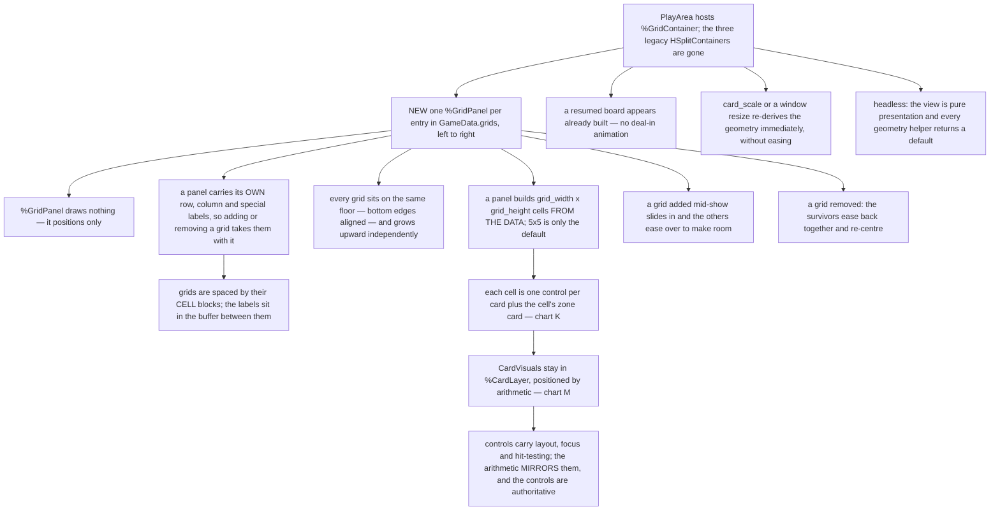
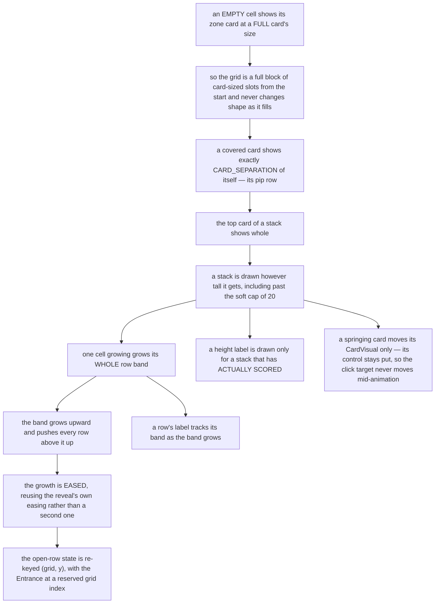
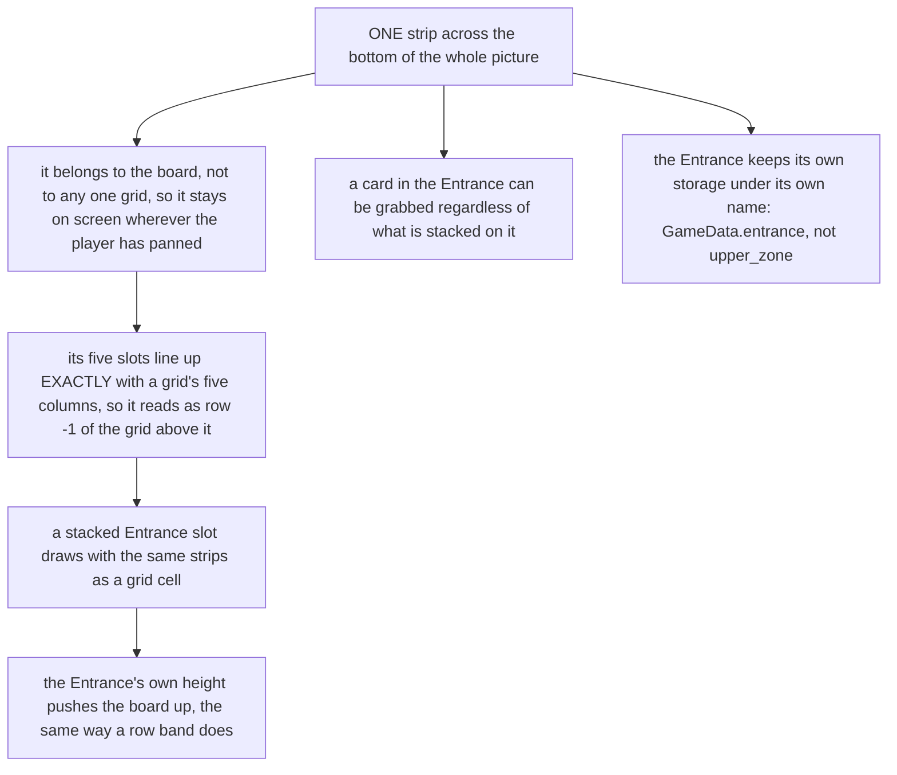
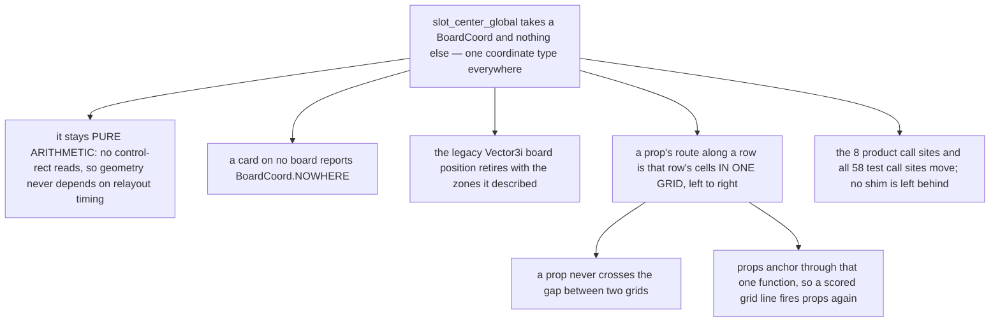
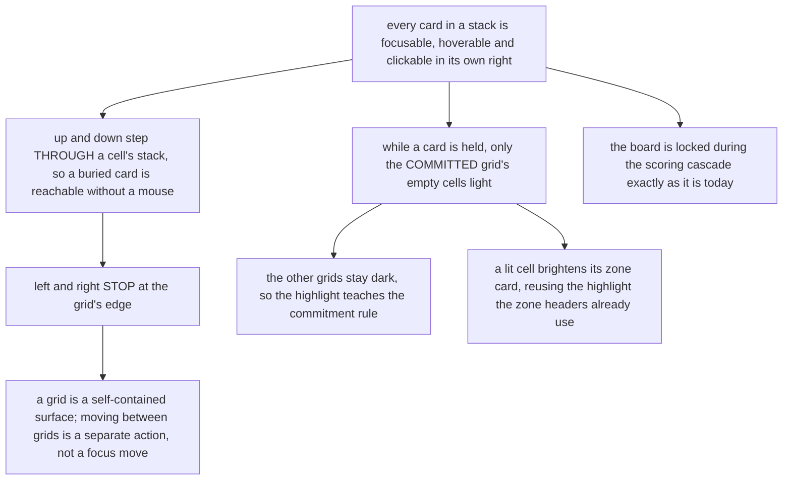
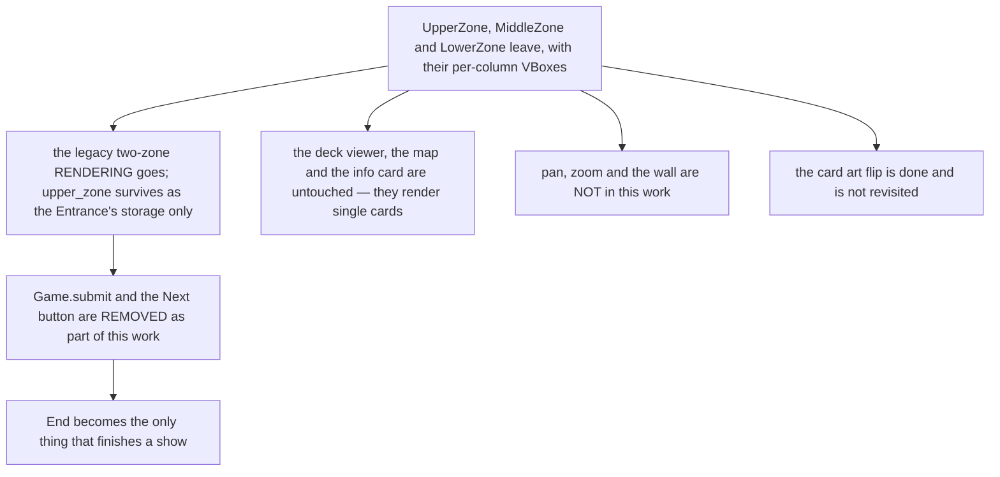

# The grid view replaces the play area

## How to review this document

- Every decision has an **ID** (`QR1`, `Q14`, and later `A6` for chart nodes). Review by ID.
- Every question carries a **`*default*`** — a complete answer. "Default" everywhere is a valid
  way to finish, and it records which questions you did not look at.
- Questions carry a **gate**: `[QR1=b]` means the question is only asked if you answered `QR1` b.
  Answering a gate prunes whole groups. You can go back and change any answer; answers stranded on
  a path you abandon are marked inactive, never deleted, and come back if you return.
- ⚠ **The most valuable feedback is "you did not ask about X".** A missing question is a decision
  that would otherwise get made during implementation, by whoever hits it first.
- **Version 2 — round 1 is answered and the flowcharts (§7-§12) are derived from those answers.**
  They are what you review now: the questionnaire settled the decisions, the charts settle sequence
  and completeness. "Between `K7` and `K8` there must be..." is exactly the feedback this stage is
  for, and it is the last gate before an implementation plan is written.

### What this round is NOT re-asking

`GAP-009`'s answer scopes this tightly. The behaviour of the grid board is already designed in
`design/poker-patience/DESIGN.md` and is **inherited, not re-opened**:

| Already settled | Where |
|---|---|
| Stacks grow upward; a covered card shows its bottom strip; newest draws in front | chart `E7`, `E8`, `E9` / `Q308` |
| Every row's cards share a **bottom** edge; a tall stack pushes the rows **above** it up | `E10`, `E11` / `Q307`=(b) |
| The `_row_open` machinery is reused with its direction inverted, eased not snapped | `E12` |
| The Entrance is row −1 and its own height pushes the board up the same way | `E13` |
| The spring: a jumping card lifts the stack above it rigidly and OVERLAPS the rows above | `E14`, `E15`, `E16` |
| A height score label sits above the topmost card of its stack | `E17` / `Q309` |
| Scroll anchors at the bottom on entry | `E18` |
| A whole row grows when one cell in it grows | `Q73`=(a) |
| Row labels left, column labels below, one special label right of grid centre | `Q107`, `Q108`, `Q110` |
| **No subtotal is displayed anywhere** | `D22` / `Q326` |
| `%GridPanel` draws nothing — the gap defines a grid | `Q14`=(b) |
| A cell's zone card renders visibly, and is what a highlight attaches to | `Q206`=(a) |
| Cross-grid row alignment is a setting, default off, and must not change scoring | §19, `Q245`, `Q251` |
| `slot_center_global` is **pure math, no control-rect reads** | §1h, standing owner spec |
| The grid view REPLACES the legacy two-zone rendering, and subsumes the coordinate migration | `GAP-009` |

**This document asks only what the REPLACEMENT creates**: where the controls live, what a cell is
made of, how the Entrance attaches, what the coordinate seam becomes, and what happens to the
things the old board owned.

---

## 1. Audit facts — what the play area is today

Every claim below is `file:line` in the worktree. Docs go stale; the code is the source.

### 1a. The scene is three zones and four Node2D layers

`UI/play_area.tscn`:

```
PlayArea (Control)                                    :15
└── SmoothScrollContainer (ScrollContainer)           :24   ⚠ named Smooth, typed plain
    └── TopLevelVBox (VBoxContainer)                  :41
        ├── UpperZone     (HSplitContainer)           :47
        │   ├── UpperZoneLeft  (VBoxContainer)        :53   row-score labels
        │   └── UpperZoneRight (HBoxContainer)        :59   the Entrance's cards
        ├── MiddleZone    (HSplitContainer)           :66
        │   ├── MiddleZoneLeft  (Control)             :76
        │   └── MiddleZoneRight (HBoxContainer)       :82   column-score labels
        ├── LowerZone     (HSplitContainer)           :88
        │   ├── LowerZoneLeft  (VBoxContainer)        :96
        │   └── LowerZoneRight (HBoxContainer)        :103  the tableau's cards
        ├── CardLayer     (Node2D)                    :109  every CardVisual
        ├── PropLayer     (Node2D)                    :112
        ├── ParticleLayer (Node2D)                    :116
        └── OverlayLayer  (Node2D)                    :120
```

⚠ **`grids` appears nowhere in `UI/play_area.gd`.** A card on a grid has no control, no visual and
no on-screen position. That is `GAP-009`, and it is what this design fills.

### 1b. THE DUAL MODEL — controls lay out, Node2D draws, and math bridges them

This is the single most important fact in the audit, because it is the precedent for everything
below and it is already what makes the spring possible.

- **Controls carry layout, focus and hit-testing.** `set_card_zone` (`play_area.gd:409`) builds one
  `VBoxContainer` per column; child 0 is the zone/type header, children 1..n are the cards.
  `create_card_control` (`:585`) makes a bare `Control` with focus and hover wired.
- **`CardVisual`s are NOT in those containers.** They live in `%CardLayer`, a `Node2D`
  (`play_area.tscn:109`), and their draw order is set by an explicit row-major pass,
  `_order_board_cards` (`play_area.gd:483`).
- **`slot_center_global` (`:328`) is the bridge, and it is pure arithmetic** that MIRRORS the
  container build rather than reading it:

  ```
  x = hbox.global_position.x + col * (card_width + separation) + card_width/2
  y = hbox.global_position.y + separation + row * (strip_height + separation) + card_height/2
      + _row_open_offset(zone_x, row)
  ```

  Its doc comment states why: *"geometry is deterministic and independent of container relayout
  timing, and the one formula covers occupied, empty, and off-board slots alike"*.

⚠ **The spring (`E15`) only works because of this split.** A card that overlaps the row above is a
`CardVisual` moving in `CardLayer`; the layout containers never see it. See §1m row 2 for why a
container could not do it.

### 1c. The strip trick: a stacked card is a thin control, the last is full height

`update_card_zone_visuals` (`play_area.gd:536`) sizes every card control to
`card_size_play.x × card_separation_play_custom` — a thin strip — **except the last child of each
column** (`:561`), which gets a full `card_size_play`. That is what makes a covered card show only
its strip while the top card shows whole. The zone header (child 0) is `x × 0` unless a grab is
live.

### 1d. The reveal machinery is keyed by (zone, row) and is already eased

`_row_open : Dictionary[Vector2i, float]` (`play_area.gd:34`) — key `(zone_x, row_z)`, value the
eased 0..1 the row is through its opening. `_row_open_wanted` (`:37`) holds what WANTS to be open so
a row that leaves the set eases back rather than snapping. `_row_open_height()` (`:46`),
`row_open_extra()` (`:75`), `_row_covers_anything()` (`:101`), `_row_open_offset()` (`:111`).

Two rules inside it that a height-driven version has to decide about explicitly: a row that
**covers nothing** does not open at all (`:101`), and the strip must subtract the container's own
`separation` or the opening overshoots by one gap.

### 1e. The migration surface, measured

| Symbol | Total refs | In product code | In tests |
|---|---|---|---|
| `slot_center_global` | 66 | **8** (`play_area.gd` 4, `prop_layer.gd` 2, `spotlight_tool.gd` 2) | 58 |
| `Vector3i.MIN` | 56 | — | — |
| `find_data_vec3` / `Board.locate(` | 37 | — | — |

⚠ **The product-side seam is far smaller than it looks** — eight call sites, not fifty. The bulk is
test code, which moves mechanically once the signature is fixed. An earlier estimate in the handoff
said ~50 product callers; that was wrong and this table replaces it.

### 1f. What the grid model already provides, headless

`GameData.grids : Array[GridData]`, each with `grid_width`/`grid_height` (default 5×5, nothing
hard-codes 5), `cells : Array[ArrayCardData]` row-major, and `cell_types : Array[CardData]` — 25
real zone cards per grid. `GameData.card_at(coord)`, `grid_position_of(card)` and
`cell_type_coord(card)` already resolve both directions. `TypeGridCell.on_can_place_stack` accepts,
`TypeInput.on_can_grab_stack` grabs. **The engine half of the board is complete and tested; only the
view is missing.**

---

## 1m. Engine capability audit

⚠ Nothing in this table comes from memory or from grepping this repo. Each row cites the source.

| # | Capability the design leans on | Verdict | Source |
|---|---|---|---|
| 1 | `GridContainer` sizes each row to the tallest child and each column to the widest | ✅ **confirmed, and it is the MAX of children's minimum sizes**: `col_minw[col] = MAX(col_minw[col], col_width)`, the same pattern per row. So `Q73`(a) — "one cell grows, the whole row grows" — is free if a `GridContainer` is used. | [grid_container.cpp](https://github.com/godotengine/godot/blob/master/scene/gui/grid_container.cpp) |
| 2 | A container's children can still be positioned by hand | ⚠ **CONTRADICTED, and it is load-bearing.** *"All children Control nodes give up their own positioning ability… any attempt to manually alter these nodes will be either ignored or invalidated the next time their parent is resized."* **The spring (`E15`) therefore CANNOT be done by moving a control** — it has to move the `CardVisual` in `CardLayer`, which is exactly what §1b already does. | [Using Containers](https://docs.godotengine.org/en/latest/tutorials/ui/gui_containers.html) |
| 3 | A child can sit at the BOTTOM of its allotted row band (`E10`, the shared bottom edge) | ✅ exists — size flag **Shrink End**: *"When expanding, try to remain at the right or bottom of the expanded area."* | [Using Containers](https://docs.godotengine.org/en/latest/tutorials/ui/gui_containers.html) |
| 4 | Hidden children still hold their cell's size | ⚠ **No** — `as_sortable_control(..., SortableVisibilityMode::VISIBLE)` skips them entirely, so a hidden cell control contributes nothing to its row's height. An empty cell that must still occupy space has to be present and sized, not hidden. | [grid_container.cpp](https://github.com/godotengine/godot/blob/master/scene/gui/grid_container.cpp) |
| 5 | `GridContainer` can align row *r* across two grids | ⚠ **No — it aligns rows only WITHIN one container.** Two side-by-side containers derive their row heights independently. This is why §19 exists and why `Q245`'s setting is a real feature rather than a container property. | already in `poker-patience/DESIGN.md` §1m′ row 5, citing [GridContainer](https://docs.godotengine.org/en/latest/classes/class_gridcontainer.html) |
| 6 | `GridContainer` can host the `CardVisual`s directly | ⚠ **No** — it *"only arranges child nodes inheriting from Control"*, and `CardVisual` is a `Node2D`. The split in §1b is not a style choice; it is forced. | [GridContainer](https://docs.godotengine.org/en/latest/classes/class_gridcontainer.html) |
| 7 | The number of columns is fixed and rows follow | ✅ *"The number of columns is specified by the `columns` property, whereas the number of rows depends on how many are needed for the child controls."* Matches `GridData.grid_width` driving `columns`. | [GridContainer](https://docs.godotengine.org/en/latest/classes/class_gridcontainer.html) |

**What rows 2, 4 and 6 together mean, stated plainly so no question has to re-derive it:** a
container can own the *layout grid*, but it can never own the *cards*. The cards are `Node2D`s
positioned by arithmetic, every empty cell needs a real sized control rather than a hidden one, and
anything that overlaps (the spring, a held card) happens in the `Node2D` layer. That is the shape
the board already has.

---

## 2. State model — the facts the grid view introduces

Structure is filled in here rather than asked about. Where a structural choice has a *behavioural*
consequence, the questionnaire asks about the consequence.

| Fact | Lives | Derived from | Notes |
|---|---|---|---|
| Which grids exist and what is in each cell | `GameData.grids` | — | persisted; already built and tested |
| A cell's control | view only | the grid list | one per cell or one per card — `QR2` |
| A card's on-screen position | derived | the layout numbers | never stored; `slot_center_global`'s successor |
| A row band's height | derived | the tallest stack in that row, plus its opening | `Q73`(a) already fixes that it is per row, not per cell |
| How far a row is opened | view only, eased | the spotlight set | today `_row_open`, keyed `(zone_x, row)`; re-keying is `Q6` |
| Which grid the view is looking at | view only | pan state | Phase 6 owns it; not this design |
| The Entrance's slots | `GameData.upper_zone` | — | storage unchanged; where it DRAWS is `QR3` |
| Cross-grid row alignment | setting | `grid_align_rows_globally`, default false | §19; already decided |

---

## 3. Usages — every situation the view can be in

If a row here has no question, that is a hole and it is the most valuable thing to report.

| # | Situation | Covered by |
|---|---|---|
| 1 | One grid, every cell empty (a fresh show) | `Q1`, `Q2` |
| 2 | One grid, one cell 15 deep, the rest empty | `Q3`, `Q4`, `Q5` |
| 3 | Three grids side by side, different row heights | `Q7` (and §19, decided) |
| 4 | A grid is added mid-show by the allotment card | `Q8` |
| 5 | A grid is REMOVED mid-show and its cards discard | `Q9` |
| 6 | A card is held; legal cells must be shown | `Q10` (chart `A5`, never built) |
| 7 | A placement lands and a line scores (the cascade runs) | `Q11`, `Q12` |
| 8 | The spring: a card jumps mid-stack | decided (`E14`–`E16`); `Q13` asks only what owns the offset |
| 9 | Undo rewinds a placement | `Q14` |
| 10 | Resume rebuilds a board from a snapshot | `Q15` |
| 11 | Headless (`view == null`) — the whole engine suite | `Q16` |
| 12 | The window resizes / `card_scale` changes mid-show | `Q17` |
| 13 | Keyboard and controller move across cells and between grids | `Q18`, `Q19` |
| 14 | The Entrance, uncommitted vs committed to a grid | `QR3`, `Q20`, `Q21` |
| 15 | Score labels around a grid | `QR4`, `Q22`, `Q23` |
| 16 | A prop crosses a row / anchors to a slot | `Q24`, `Q25` |
| 17 | The deck, discard and rules cards — not on any board | `Q26` |
| 18 | The 58 test call sites of `slot_center_global` | `Q27` |

---

## 4. The questionnaire

⚠ **A note on how much this prunes.** Four roots gate the rest, but the defaults are the
*continue-as-today* answers, so answering everything "default" still walks most of the document.
The saving is real only when a root's answer amputates a branch — `QR1`(b) and `QR2`(b) each remove
a group. Do not expect a short path from taking the recommendations.

### § Root forks

- **QR1** `[root]` ⚑gate ⚑contract — A grid is 25 cells that must line up in rows and columns, and one cell's stack can grow taller than its neighbours. Where does the LAYOUT come from — a Godot container that measures its children and places them, or arithmetic the play area computes itself? (Whichever you pick, the cards themselves are `Node2D`s positioned by arithmetic — a container cannot hold them and cannot let them overlap, which the spring needs.) · **(a)** a `GridContainer` per grid — rows size themselves to the tallest cell for free, and the board's shape follows the engine's layout pass; cross-grid alignment does NOT come free and needs its own pass on top — **→ next:** what a cell control's minimum size is, how the eased opening survives the container's own sizing, how empty cells hold their space · **(b)** arithmetic only, the way `slot_center_global` already works — one formula owns every position, every grid reads the same row heights so cross-grid alignment is nearly free, and nothing depends on container relayout timing; every sizing rule the container would have given must be written by hand — **→ next:** where the row-height numbers live, how focus order is built without a container, how the scrollable extent is computed · **(c)** both, as the board does today — controls in a container for focus and hit-testing, visuals positioned by arithmetic that mirrors it — **→ next:** which side is authoritative when they disagree, and what keeps the mirror honest · *default* (c) · notes — (c) is the shipped precedent and the reason the spring works at all; (b) is the smallest number of moving parts and the easiest to reason about; (a) is the least code and the most engine magic
- **QR2** `[root]` ⚑gate — A cell holds a stack. Is every CARD in that stack its own clickable thing, or is the CELL the clickable thing? · **(a)** one control per card, as the board does today — every card in a stack can be focused, hovered and clicked in its own right, which is what the Entrance's "grab regardless of stack" rule needs something to click on — **→ next:** how tall a covered card's strip is, the focus order within a stack, what the top card does differently · **(b)** one control per cell — the cell is the target and the stack is drawn inside it; far simpler layout, but picking a card that is not on top needs some other affordance — **→ next:** how a buried card is selected at all, and whether it can be · *default* (a) · notes — the Entrance already allows grabbing a covered card; a cell on the grid cannot be re-stacked by hand, so the two may not need the same answer
- **QR3** `[root]` ⚑gate — Where does the Entrance DRAW, now that there are several grids? (Its storage does not change, and that its height pushes the board up is already decided.) · **(a)** one strip across the bottom of the whole picture — always on screen wherever you have panned, and it belongs to the board rather than to any one grid — **→ next:** how its five slots line up with a grid's five columns, what it does while you are panned between grids · **(b)** row −1 inside the panel of the grid it is committed to — it is literally the row below that grid and moves with it — **→ next:** where it is while UNCOMMITTED, and whether an uncommitted Entrance appears under every grid or none · **(c)** one strip across the bottom, but it slides to sit under the committed grid — a compromise: always visible, and it still says which grid it is feeding — **→ next:** what the slide looks like and when it happens · *default* (a) · notes — the design says the Entrance is "row −1 of whichever grid it is attached to", which reads like (b), but with three grids side by side (b) means the Entrance can be off screen while you are looking at another grid
- **QR4** `[root]` ⚑gate — The row, column and special score labels sit around a grid (left, below, right — already decided). Whose children are they? · **(a)** part of each grid's own panel — a grid carries its labels, so adding or removing a grid takes them with it and they can never drift out of alignment with their rows — **→ next:** how the panel is composed, what the labels do when a row's band grows · **(b)** a separate layer positioned around each grid by the same arithmetic that places the cards — labels never disturb the board's layout, at the cost of another thing to keep aligned — **→ next:** what positions them, and what happens on a relayout · *default* (a)

### § The cell and its stack

- **Q1** `[root]` — An EMPTY cell shows its zone card (already decided). How much room does an empty cell take? · **(a)** a full card's worth — the grid is always a full 5×5 of card-sized slots and never changes shape as it fills · **(b)** the same thin strip a covered card gets, growing to a full card when something lands — the grid starts compact and grows · *default* (a) · notes — (a) is what makes a grid look like a board before anything is on it
- **Q2** `[root]` — A grid's cells are always drawn, but a grid can be 5×5 or another shape later. When a grid's `grid_width`/`grid_height` are not 5, does the view read them? · **(a)** yes — the view builds whatever shape the data says, and 5×5 is just the default · **(b)** no — the view assumes 5×5 and a different shape is a later feature · *default* (a) · notes — the engine already carries per-grid width and height and nothing hard-codes 5
- **Q3** `[QR2=a]` — In a stack, how much of each covered card shows? · **(a)** exactly `CARD_SEPARATION` — the strip that shows its pip row, the same rule the board uses today · **(b)** a proportion of the cell, so a very tall stack compresses to fit · *default* (a) · notes — (b) would break the promise that a covered card's pips are readable, which is what the whole art flip was for
- **Q4** `[root]` ⚑contract — A stack has a soft cap of 20 (`stack_soft_cap`, a `push_error` past it, not a hard limit). What does the VIEW do at a stack taller than the cap? · **(a)** draw it, however tall it gets — the row band grows and the board grows with it · **(b)** draw the cap's worth and let the rest overlap in place, so one runaway cell cannot stretch the board without bound · *default* (a) · notes — at `CARD_SEPARATION` 16 and `card_scale` 2.5, twenty cards is a 800 px column before the top card's own height
- **Q5** `[root]` — When a cell's stack grows, its whole row grows (already decided). Does the growth ANIMATE, or appear immediately? · **(a)** eased, reusing the same eased opening the reveal already uses · **(b)** immediate — the card lands and the board is already its new shape · *default* (a) · notes — the reveal's easing is already written and already feeds `slot_center_global`
- **Q6** `[root]` ⚑contract — The reveal's open-row state is keyed `(zone, row)` today. A grid row is `(grid, y)`, and the Entrance is row −1 of no grid in particular. What is the key? · **(a)** `(grid, y)` with the Entrance as a reserved grid index — one key shape everywhere, and the Entrance is just another row · **(b)** `(grid, y)` for grids and a separate flag for the Entrance — no reserved index to remember, at the cost of two paths · **(c)** a global row index across all grids, so row 2 of every grid is one key — makes cross-grid alignment automatic and makes per-grid opening impossible · *default* (a) · notes — (c) quietly decides §19's setting for you, in the ON direction

### § Grids appearing and disappearing

- **Q7** `[root]` — With the alignment setting OFF (the default), grid B's row 2 sits at a different height from grid A's. What are the grids aligned to, then? · **(a)** their bottom edges — every grid sits on the same floor and grows upward independently, which matches the board growing up from the Entrance · **(b)** their top edges · **(c)** their centres · *default* (a)
- **Q8** `[root]` — The allotment card can add a grid mid-show. Does the new grid appear animated? · **(a)** it fades/slides in and the other grids ease over to make room · **(b)** it appears and the board is immediately its new width · *default* (a) · notes — grids are added at game start today, so this is only visible if a later card adds one mid-show
- **Q9** `[root]` — A grid is removed and its cards are discarded. What does the view do with the gap? · **(a)** the remaining grids ease back together and re-centre · **(b)** the gap stays until the next natural relayout · *default* (a) · notes — the design already says the remaining grids re-centre when the FOCUSED grid is removed; this asks about any removal

### § Holding a card, and the scoring pass

- **Q10** `[root]` ⚑gate — Chart `A5` says legal cells are highlighted while a card is held, and it has never been built. Every empty cell is legal now, so the highlight would light every empty cell at once. Is that what it should do? · **(a)** yes — every empty cell lights, which reads as "put it anywhere", and it is honest about the rule — **→ next:** what the highlight looks like and whether the committed grid differs · **(b)** only the committed grid's empty cells light, and the others stay dark — the highlight teaches the commitment rule — **→ next:** what an UNCOMMITTED hold lights, and what the other grids look like · **(c)** no highlight at all — an empty cell already renders its zone card, and that is enough of an affordance — **→ next:** nothing about the highlight · *default* (b) · notes — (b) is the only one that shows the player something they cannot already see
- **Q37** `[Q10=a|b]` — What does a highlighted legal cell look like? · **(a)** the cell's zone card brightens, reusing the highlight the zone headers already use · **(b)** an outline is drawn around the cell · **(c)** the cell tints toward the held card's suit colour · *default* (a) · notes — (a) is the existing affordance and needs no new art
- **Q11** `[root]` — During the scoring cascade the board is locked. Does the view show that? · **(a)** yes, the way it does today — the same processing lock that greys the buttons · **(b)** yes, and the board itself dims · *default* (a)
- **Q12** `[root]` — A completed line lights its cards (the spotlight cascade, unchanged). On a grid, a line can be a row, a column, a diagonal or a vertical stack. Does a DIAGONAL line's reveal open rows the way a column's does? · **(a)** yes — the reveal set is every row a lit card sits in, whatever shape the line was; the existing rule already works this way · **(b)** no — diagonals light without opening rows · *default* (a)
- **Q13** `[root]` — The spring lifts a jumping card and everything above it, overlapping the row above without re-flowing the board (already decided). Since a container would invalidate that, the lift is applied to the `CardVisual`s. Does the CONTROL under a lifted card move at all? · **(a)** no — controls stay put, so focus and hit-testing are unaffected while a card is mid-jump · **(b)** yes — the control follows, so clicking always hits where the card looks · *default* (a) · notes — (b) means the click target moves during an animation, which is how mis-clicks happen

### § Undo, resume, headless

- **Q14** `[root]` — Undo rewinds a placement. Does the card animate back to the Entrance? · **(a)** no — the board rebuilds into its previous state, as undo does today · **(b)** yes — the card flies back · *default* (a)
- **Q15** `[root]` — A resumed show rebuilds the whole board from a snapshot. Does it animate in? · **(a)** no — it appears already built, as it does today · **(b)** yes — cards deal in · *default* (a)
- **Q16** `[root]` ⚑contract — The whole engine runs headless with `view == null`, and a hard gate asserts a headless show and a viewed show end byte-identical. Does anything in the grid view need to run headless? · **(a)** no — the view is purely presentation and every geometry helper returns a default when there is no view · **(b)** yes — the layout numbers are needed headless for something · *default* (a) · notes — if any answer in this document would make a view function decide a game outcome, it breaks the parity gate
- **Q17** `[root]` — `card_scale` and the window size can change while a show is running. On a change, does the board re-derive its geometry immediately? · **(a)** yes, immediately and without animation · **(b)** yes, eased · *default* (a)

### § Focus and input

- **Q18** `[root]` — Keyboard and controller move focus between cards. On a 5×5 grid, what does "right" from the rightmost column do? · **(a)** moves to the next GRID's leftmost column in the same row — the board reads as one continuous surface · **(b)** stops at the edge — grids are separate surfaces and you change grid another way · *default* (a) · notes — the design already gives panning its own actions, so (b) is not leaving the player stranded
- **Q33** `[QR2=b]` — With the CELL as the only control, a card that is not on top has nothing of its own to click. How is a buried card selected? · **(a)** it is not — a grid cell's stack is not something the player takes cards out of, so only the Entrance ever needs it, and the Entrance can keep per-card controls even if grids do not · **(b)** clicking the cell repeatedly cycles down through the stack · **(c)** holding a modifier while clicking picks the card under the top one · *default* (a) · notes — (a) is consistent with the rule that a placed card cannot be moved or stacked on; if it is right, the whole per-card control question only ever mattered for the Entrance
- **Q19** `[QR2=a]` — Within one cell's stack, does focus step through every card? · **(a)** yes — up and down move through the stack, which is the only way to reach a buried card without a mouse · **(b)** no — focus lands on the top card and moving up/down goes to the next ROW · *default* (a) · notes — (b) makes a buried card unreachable by keyboard, which matters because the Entrance explicitly allows grabbing one

### § The Entrance

- **Q20** `[QR3=a|c]` — The Entrance is five slots and a grid is five columns wide. Do the slots line up with the columns? · **(a)** yes, exactly — the Entrance reads as row −1 of the grid above it · **(b)** no — the Entrance is its own strip, sized independently · *default* (a)
- **Q34** `[QR3=b]` — If the Entrance draws INSIDE the committed grid's panel, where is it while the Entrance is uncommitted (which is how every show starts, and again every time the commitment lifts)? · **(a)** under the leftmost grid, moving to whichever grid the first placement commits to · **(b)** under every grid at once, and all but the committed one empty as the batch commits · **(c)** in a neutral position below the whole board, sliding into the committed grid once it commits · *default* (a) · notes — this is the cost of (b) at `QR3`: the Entrance has to be somewhere before it belongs to any grid
- **Q21** `[root]` — The Entrance can hold a stack (a slot deeper than one card). Does it draw a stack the same way a grid cell does? · **(a)** yes — same strips, same rule · **(b)** no — the Entrance fans or spreads instead · *default* (a)

### § The score labels

- **Q22** `[root]` — A row's label sits to the left of its row. When that row's band grows, does the label stay centred on the band? · **(a)** yes — it tracks the band · **(b)** no — it stays at the row's baseline · *default* (a)
- **Q35** `[QR4=a]` — If the labels are part of a grid's own panel, the panel is wider and taller than the 5×5 of cells. Does that padding count as part of the grid for spacing and centring? · **(a)** yes — grids are spaced by their whole panels, so the gap between two grids is a gap between their labels · **(b)** no — grids are spaced by their CELL blocks and the labels sit in the buffer between them · *default* (b) · notes — (a) makes the visible gap between two grids much larger than `grid_buffer_px` suggests
- **Q36** `[QR4=b]` — If the labels are a separate layer, they are positioned by the same arithmetic that places the cards. What happens to a label whose row does not exist yet (a grid with no cards in that row)? · **(a)** it is not drawn until that row has scored something · **(b)** it is drawn showing nothing, so the strip reads as a coordinate axis · *default* (a) · notes — `Q114` in the poker-patience design asked the same shape about height labels and chose the "reads as an axis" answer; this can differ
- **Q23** `[root]` — Height score labels sit above their stack (already decided). With 25 cells, up to 25 of them could be on screen at once. Is a height label shown for every stack that has one? · **(a)** yes, all of them · **(b)** only for the tallest stack in each row · **(c)** only for stacks that have actually scored · *default* (c) · notes — a cell banks a height score only at multiples of 5, so (c) is far fewer labels than (a)

### § The coordinate seam

- **Q24** `[root]` ⚑contract — `slot_center_global(v: Vector3i)` is the function every prop anchors through. What is its signature after the migration? · **(a)** `slot_center_global(coord: BoardCoord)` only — one coordinate type everywhere, and the eight product call sites plus 58 test call sites move to it · **(b)** it takes `BoardCoord` and a second function keeps the `Vector3i` form for anything still off-grid · *default* (a) · notes — the Entrance is the only legacy zone left, and `BoardCoord` already represents it as row −1
- **Q25** `[root]` ⚑contract — Props anchor to a slot and travel along routes built from board positions (`row_slot_path`, `entity_side_for_row`, `mancala_targets`, `column_rise_path`). A grid row is five cells wide; the old zone rows were six columns. What is a prop's ROUTE on a grid? · **(a)** the cells of that row in that grid, left to right — a prop crosses one grid · **(b)** the cells of that row across EVERY grid, so a prop can fly from grid 0 into grid 1 · *default* (a) · notes — this is the decision that has kept props from firing at all since the grid board landed; (b) is much longer routes and crosses the gaps between grids
- **Q26** `[root]` ⚑contract — Cards in the draw deck, the discard and the rules row are not on any board. Today `position_of` returns `Vector3i.MIN` for them. What does the new one return? · **(a)** `BoardCoord.NOWHERE`, which already exists for exactly this · **(b)** null · *default* (a)
- **Q27** `[root]` — 58 of the 66 `slot_center_global` references are in tests. Do those tests move to the new signature, or do they get a shim? · **(a)** they move — a shim is a second way to say the same thing and it would outlive the migration · **(b)** a shim, so the migration lands in fewer edits · *default* (a)

### § Out-of-scope confirmation

Confirming an exclusion is cheap; discovering one late is not.

- **Q28** `[root]` — The zoomed-out view, panning between grids, and the pan buttons are Phase 6 and are NOT part of this work. Correct? · **(a)** correct — this design ends at "the board is drawn and can be played on at one grid's zoom" · **(b)** no, pan and zoom come with it · *default* (a)
- **Q29** `[root]` — The wall's wide picture and the render-target clamp are Phase 7 and are not part of this. Correct? · **(a)** correct · **(b)** no · *default* (a)
- **Q30** `[root]` — The card ART flip (pips to the bottom) is done and is not revisited here. Correct? · **(a)** correct — Phase 0 landed and `CARD_SEPARATION` is re-derived and gated · **(b)** no · *default* (a)
- **Q31** `[root]` — `Game.submit()` and the Next button are vestigial (chart D retires the act; chart A retires Next), but no step removes them. Does this design remove them? · **(a)** no — out of scope, they go with their own change · **(b)** yes, while the view is being rebuilt anyway · *default* (a) · notes — the End button already ends the show; Next only triggers a refill that placements ask for themselves
- **Q32** `[root]` — The deck viewer, the map, and the info card also show cards. Does the flip/replacement touch them? · **(a)** no — they render single cards and are unaffected by the board's layout · **(b)** yes · *default* (a) · notes — chart `E19` says the flip applies in every view, but that is about the card ART, which is already done

---

## 5. Tunables

Every number this feature introduces, in `Scripts/player_settings.gd` with the rest.

| Knob | Suggested start | What it means |
|---|---|---|
| `grid_cell_gap_px` | `4.0` | The gap between cells inside one grid. Separate from `separation`, which is the legacy board's. |
| `grid_buffer_px` | `220.0` (already registered) | The gap BETWEEN grids. Centring is fixed; the gap is the knob. |
| `grid_row_ease_time` | `= the reveal's existing ease` | How long a row band takes to grow. Starts equal to the reveal's so the two cannot disagree. |
| `grid_add_ease_time` | `0.35` | How long a newly added grid takes to slide in (`Q8`). |
| `grid_highlight_alpha` | `0.25` | How strongly a legal cell lights while a card is held (`Q10`). |

⚠ **Every one of these is a knob because you could tell it was wrong from a screenshot.** None of
them belongs in the implementation plan as a fixed literal, and the tuning tool should expose all
of them live.

---

## 6. What this document deliberately does not contain

- **No flowcharts yet.** They are derived from the answers to §4 and reviewed in the next round.
- **No code, no file lists, no method signatures, no step ordering, no test plan.** Those are
  `PLAN.md`, `TEST_PLAN.md` and `NAMES.md`, written after the charts are confirmed.
- **No re-litigation of the geometry rules.** Everything in "What this round is NOT re-asking" is
  inherited from `design/poker-patience/DESIGN.md`.
- **No pan, zoom, or wall work.** Phases 6 and 7.

---

---

## 7. Flowchart J — building the board, and keeping it in step

Derived from the answers, not from the questions. Every node states a decision.



## 8. Flowchart K — a cell, its stack, and the row band



## 9. Flowchart L — the Entrance



## 10. Flowchart M — the coordinate seam, and the props that ride it



## 11. Flowchart N — focus, input, and what a held card shows



## 12. Flowchart P — what this work RETIRES



---

## 13. Changelog — version 2

**Round 1 answered: 38 of 41 questions; 3 correctly pruned** (`Q33` by `QR2`=a, `Q34` by `QR3`=a,
`Q36` by `QR4`=a). No free-text answers, no stranded answers, no overrides reverted in the log.

**Two answers overrode the recommendation, and both change the shape of the work:**

- **`Q18`=(b)** — keyboard focus **stops at a grid's edge**. Grids are separate surfaces and
  changing grid is its own action, not a focus move. The recommendation was that the board read as
  one continuous surface; it does not. Chart `N3`, `N4`.
- **`Q31`=(b)** — **`Game.submit()` and the Next button are removed as part of this work**, rather
  than left for a change of their own. This is a real scope addition and it is now chart `P3`.

Everything else took the recommendation. The dual model survives (`QR1`=c), per-card controls
survive (`QR2`=a), the Entrance becomes one strip across the whole picture rather than a per-grid
row (`QR3`=a), and each grid carries its own labels (`QR4`=a).

### The ruling on the deprecated zones, and the charts confirmed

Owner, verbatim: *"you can remove deprecated stuff like the upper lower zones. i approve, but this
should all go in the existing plans, not create new ones."*

- **`lower_zone` / `lower_zone_type` are DELETED**, fields and all. `Q213` already rules that old
  saves are not migrated, so the change of saved shape costs nothing.
- **`upper_zone` / `upper_zone_type` are RENAMED to `entrance` / `entrance_type`.** The owner named
  both zones, and the Entrance was only ever "zone 0" of a board that no longer exists; keeping the
  old name would leave the retired two-zone model alive in the vocabulary. Its STORAGE survives —
  only the name and the rendering change. ⚠ This supersedes `L7` as first drawn, and `L7` now says
  so. It is a pure rename and cheap to reverse if the Entrance was meant to keep its old name.
- **The charts are APPROVED.** ⚠ Per the same instruction there is no `design/grid-view/PLAN.md`,
  `TEST_PLAN.md` or `NAMES.md`: the steps, tests and identifiers are folded into the EXISTING
  `design/poker-patience/` documents as `S20b` / `S20c` and `TP-80b`–`TP-80j`. This document stays
  as the design record those steps cite.

## Design provenance and gap protocol — COPY THIS BLOCK INTO ANYTHING DERIVED FROM THIS DOCUMENT

Derived from: `solatro/design/grid-view/DESIGN.md`, version 1, and inheriting
`solatro/design/poker-patience/DESIGN.md` version 2 for every rule listed as already settled.
Every step below cites the design node IDs it implements.

If you are executing this and you reach a decision the design does not cover:
1. Reversible and clearly within intent → do it, and append one line to `ASSUMPTIONS.md` citing the
   node you were working on. Never silently.
2. Otherwise — two defensible choices differ in observable behaviour, or the choice is expensive to
   reverse, or it is an owner call (balance, look, scope) → **park that thread, file a gap, keep
   working on unaffected threads, and tell the owner.**
3. The design contradicts itself or the code → always a gap, highest priority.
4. ⚠ **Two documents disagreeing is NOT automatically (3).** If both are restating the same answer,
   go read that answer — the conflict is a documentation bug to fix against the source, not a
   decision to escalate. Quote the note in the gap and say why it does not settle the question; if
   you cannot, it was never a gap.

File gaps at `solatro/design/grid-view/gaps/GAP-NNN.md` using the template in
`solatro/design/poker-patience/DESIGN.md` §gap-protocol. Write the options in the questionnaire
grammar; they become the next round's questions unchanged.

Do not resolve a gap by picking an answer. Do not proceed on the parked thread. Do not delete a gap
— it is closed by a new design version.

This block, unchanged, goes into every document derived from this one.
