# The diegetic picture-wall UI shell — design v1

Every screen in Solatro becomes a framed picture hanging on one wall. The camera lives on that
wall: entering a screen is zooming into its picture until the frame leaves the view; leaving it is
zooming back out until the frame appears, travelling across the wall, and zooming into the next
one. The wall itself is the app shell — there is no scene switch any more, only a camera move.

**Version 1. Nothing here is implemented. Nothing here is decided except where it says so.**

---

## 0. How to review this document

- **You review by answering questions, not by writing design.** If you finish the questionnaire and
  still have to tell me "you forgot to ask about X", that is a defect in this document and I want
  to hear it.
- **Every question has an ID** (`QR1`, `Q47`). They are stable forever; I never renumber.
- **Every question has a `*default*`.** "Default" is a complete answer — waving a question through
  is a legitimate move and it is recorded as unreviewed rather than as agreement.
- **Every question also offers free text and "not relevant"** even though neither is written on the
  line. If none of the options is what you want, say so in your own words.
- **Every question carries a gate** in backticks — the condition under which it is asked at all.
  `[root]` means always. `[QR3=b]` means only if you answered QR3 (b). Answering a root question
  can prune fifty downstream questions in one click.
- **Questions marked ⚑gate change the path.** Their options each say what follows, because at those
  questions you are choosing a route, not just an answer. If you answer one in your own words the
  round stops there and I author the new branch before you continue.
- **Questions marked ⚑contract** fix a literal — a default, a bound, a name — that gets written into
  the implementation plan verbatim.
- **Answers are revisitable.** Go back and change any answer; answers stranded on an abandoned
  branch are marked inactive, never deleted, and come back if you return to that branch.
- **There are no flowcharts in this document yet, and that is deliberate.** A chart drawn before
  the answers is a guess with an ID on it. I write the charts from your answers, you review the
  charts, and only then does an implementation plan exist.

⚠ **Honest note on path length.** The eight root forks mostly default to *include this sub-feature*,
because that is what the braindump asks for. So the all-defaults path is close to the longest path
— the DAG saves you time when you decide to **cut** something (answering QR2 (b) removes §19
entirely, QR3 (b) removes §17, QR5 (b) removes §23), not when you accept every default.

**Measured** (not estimated — path length is a property of the whole DAG and intuition is bad at
it): **233 live questions, longest reachable path 220, and the all-defaults path is 212.** So
accepting every default saves you 21 questions out of 233. Cutting one sub-feature saves far more.

---

## 1. Audit facts — what the code actually does today

Everything downstream cites this section. Every claim is pinned to a line and was read from source,
not from a doc.

### 1a. There is no shell. There is a scene swapper.

`Levels/main.gd` is the whole of the current navigation model, and it is 87 lines.

- `main.gd:8-10` preloads three scenes: `menu.tscn`, `map.tscn`, `game_view.tscn`.
- `main.gd:12-13` **pre-instantiates the menu and the map once, as script-level initialisers** —
  they exist for the whole process lifetime.
- `main.gd:45-49` instantiates a **fresh `GameView` per show**, and `main.gd:53-59` / `:63-74`
  `queue_free()` it on the way out. The board is the only screen that is built and destroyed.
- `main.gd:76-87` `switch_scene` **removes the old scene from the tree but does not free it** —
  `remove_child`, not `queue_free`. So menu and map already survive out of view with their state
  intact. **This is the existing precedent for "screens keep their state while not focused"**, and
  it is half of what §18 asks about; what does *not* exist is any notion of a screen being paused,
  because a node outside the tree does not process at all.
- `main.gd:41-43`, `:53-59`, `:63-74` call `LeakSentinel.request_check()` at each hand-over,
  described in comments as "quiescent moments". A shell that keeps every screen alive forever
  changes what those checks can mean.

⚠ `Levels/main.tscn:35-41` contains a `Menu` Control node with hard-coded offsets that `main.gd`
never touches — it instantiates `menu.tscn` instead. It is dead scene furniture and will be
deleted, not migrated.

### 1b. Display settings and the resolution the game is actually built for

From `project.godot`:

- `[display] window/stretch/mode="canvas_items"`, `window/stretch/aspect="expand"`,
  `window/size/always_on_top=true`.
- **No `window/size/viewport_width` or `viewport_height` is set**, so the project runs at the engine
  default **1152 × 648** (16:9). `aspect="expand"` means widening the window today reveals *more*
  world rather than scaling what is there.
- `[rendering] renderer/rendering_method="gl_compatibility"` on desktop and mobile.
- `[rendering] textures/canvas_textures/default_texture_filter=0` — **NEAREST, project-wide.** This
  is pixel art.

The only hard-coded UI geometry found is `Levels/main.tscn:35-41` (dead, above) — screens are
otherwise anchored Controls, so they already stretch. Nothing has been verified at a non-16:9
aspect.

### 1c. There is no SubViewport anywhere in the running game

`SubViewport` appears only in tests and tools: `Tests/Visual/test_pixels.gd:89`,
`Tests/Visual/test_outline.gd:70`, `Tools/outline_atlas.gd:479`, `Tools/spotlight_tool.gd:460`.
The game draws everything into the root viewport.

⚠ **A `SubViewport` carries its own `canvas_item_default_texture_filter` and it defaults to LINEAR
— it does not inherit the project's NEAREST.** This trap is documented four separate times in this
repo (`Tests/Visual/test_pixels.gd:110`, `Tools/spotlight_tool.gd:463-470`,
`Tests/Visual/test_outline.gd:77`, `Tools/outline_atlas.gd:484`) because it has bitten every author
who reached for one. Every screen viewport this design creates must set it explicitly.

### 1d. Godot already has a pause system. This project has simply never used it.

**Corrected in v3.** v1 and v2 of this document described pausing as a choice between
`PROCESS_MODE_DISABLED` on a subtree and a hand-rolled per-screen contract. That was a false
dichotomy, invented out of never having read the engine's own page, and the owner said so. The
facts, from
[the pause tutorial](https://docs.godotengine.org/en/latest/tutorials/scripting/pausing_games.html):

- **`SceneTree.paused` is GLOBAL.** Setting it true stops 2D/3D physics for all nodes and changes
  what processes according to each node's `process_mode`. The docs are explicit that pausing "only
  affects the entire game" — **there is no built-in per-subtree pause.**
- **`Node.process_mode` decides who survives it.** `INHERIT` (the default — resolves up the
  ancestors, falling back to the SceneTree's own state), `PAUSABLE` (runs only while NOT paused),
  `WHEN_PAUSED` (only while paused), `ALWAYS` (always), `DISABLED` (never).
- **So "exactly one screen live" is expressed as: `get_tree().paused = true` permanently, the wall
  and its camera `ALWAYS`, and the live screen's root flipped to `ALWAYS` while every other screen
  stays `PAUSABLE`.** That is the shape the owner named at `QR6`, and it is the engine's intended
  one. Nothing here needs inventing.

⚠ **Two things escape that system, and they are the whole difficulty.** Neither is on the tutorial
page, which is why they belong in this audit rather than in a question:

1. **`SceneTree.create_timer()` defaults `process_always = true`**, so every
   `await get_tree().create_timer(t)` keeps counting straight through the pause unless that argument
   is passed false ([godot-proposals#9924](https://github.com/godotengine/godot-proposals/issues/9924)).
   The show's act pacing awaits timers throughout. `Q75` is what to do about it.
2. **Shader `TIME` keeps advancing while paused** — a known open engine issue
   ([godot#27127](https://github.com/godotengine/godot/issues/27127)); the standard fix is to feed a
   CPU-driven uniform instead of reading `TIME`. Sources disagree about whether a PAUSABLE
   material's `TIME` stops, so ⚠ **this one is UNVERIFIED in this project and must be checked by eye
   before anything is built on it** (repo rule 4). `Q222` is what to do about it.

**Tweens do NOT escape it.** A `Tween` created by `node.create_tween()` is bound to that node and
pauses with it, so every animation in `Levels/game_view.gd`, `Cards/card_visual.gd` and
`UI/prop_layer.gd` is handled by the engine for free.

What is true about *this* project is only this: **`get_tree().paused` appears nowhere in production
code, and the single `process_mode` write in the whole repo is `Tools/fx_editor.gd:229`, in an
editor tool.** The system is unused here, not absent from the engine.

### 1e. Camera, zoom and pan already exist — on the map only

`Levels/map.tscn:15` holds the project's single `Camera2D`, driven by
`Scripts/Map/world_map_controller.gd`:

- `:24` the camera reference, `:74` follow-the-token, `:262` drag-pan
  (`camera.position -= mm.relative / camera.zoom.x`), `:289-291` `_zoom_at` clamping to
  `ZOOM_MIN := 0.5` / `ZOOM_MAX := 4.0` (`:20-21`), `DRAG_THRESHOLD := 8.0` px (`:22`).
- **The zoom is instant, not tweened** — `_zoom_at` writes `camera.zoom` directly. There is no
  precedent in this project for a tweened camera move; every existing tween animates a Control or a
  card (`Levels/game_view.gd:172`, `:187`; `Cards/card_visual.gd`; `UI/prop_layer.gd`;
  `Scripts/Map/map_player_token.gd`; `UI/big_number_label.gd`).
- The map's keyboard/controller model is `_unhandled_input` at
  `world_map_controller.gd:217-260`: `ui_right`/`ui_down` cycle forward, `ui_left`/`ui_up` cycle
  back, `ui_accept` travels, `ui_cancel` clears the selection. Mouse wheel zooms, drag pans.
  ⚠ It consumes all four direction actions and `ui_cancel` — the wall's own navigation and Back
  button will collide with this and §13/§14 has to say who wins.

### 1f. Layering is structural and one of its lines is a written contract

`LAYERING.md`: the board draws on **one canvas layer with no `CanvasLayer` anywhere**, every board
`CanvasItem` at `z_index == 0`, order decided purely by sibling position and nesting.

⚠ **`LightLayer` is the LAST sibling of `SceneRoot` and its position is a contract, not a
convenience** (`LAYERING.md` lines 77-83, citing GAP-004): the spotlight dim exempts nothing — props,
score popups, the focus panel, the HUD and the card glow all dim, and that is the entire mechanism
by which a glow reads only inside its beam. Moving it earlier silently un-dims whatever now draws
after it, with no error and no failing test.

For this design that cuts both ways: putting the board inside a screen viewport means the dim
covers the board and **stops at the frame**, which is probably right — but it is a behaviour change
nobody has chosen yet, and §25 asks.

**The meta screens are not on that layer.** `UI/deck_picker.gd:2` and `UI/deck_viewer.gd:2` extend
`CanvasLayer`, and `Levels/map.tscn:23` has a `UI` CanvasLayer. ⚠ **A `CanvasLayer` ignores the
`Camera2D` of its viewport.** Inside a screen's own SubViewport that is harmless and in fact useful.
Anything the wall itself draws must NOT be on a CanvasLayer, or it will not move with the wall
camera.

### 1g. The FX system reads the viewport rect, and it reads it for culling

- `UI/Fx/fx_attachment.gd:995-1021` `_on_screen()` culls uniform uploads using
  `get_viewport_rect().grow(margin).has_point(get_global_transform_with_canvas().origin)`. Inside a
  SubViewport that rect becomes the *screen's* rect, which is the correct answer — but the comment
  block at `:997-1002` records that this call already returns the wrong thing in the editor and had
  to be short-circuited with `if Engine.is_editor_hint(): return true`. A third context is a third
  chance for it to be wrong.
- `UI/spotlight_director.gd:136`, `:312`, `:400`, `:440` read `_layer.get_viewport_rect()` to place
  beams and the dim.
- `UI/map_hover_panel.gd:64` clamps a tooltip to `get_viewport_rect().size`. **This is the closest
  existing precedent for Info mode's paper card** (§17) — a panel anchored to a hovered thing's
  screen position with a grace period before it hides (`Levels/map.gd:35-37`).

### 1h. There is no meta-progression save, and no unlock system of any kind

Persistence today is exactly two files:

- `user://settings.tres` — `Scripts/settings_manager.gd:6`, loaded `:19-20`, saved `:30-31` via
  `ResourceSaver`/`ResourceLoader` on the `PlayerSettings` resource.
- `user://run_save/run.tres` plus a baked map directory — `Scripts/run_manager.gd:8-11`, written on
  a background thread with coalescing (`:33+`).

Grepping `unlock` across the project finds **only mutex unlocks** (`run_manager.gd`,
`leak_sentinel.gd`). QR2 (a) therefore requires a third persistence home that does not exist.

### 1i. Tunables and pacing have one home each

- All knobs live in `Scripts/player_settings.gd` as `@export`s with setters that emit
  `settings_changed`; `SettingsManager.settings` is the access path (project rule 4).
- Durations are **fractions of `get_delay()`, never wall-clock** (project rule 4). Base
  `get_delay()` is `SettingsManager.settings.base_delay` (`Scripts/card_environment.gd:63`); `Game`
  overrides it with per-activation compression that can reach **0.0** during a fast-forward
  (`Levels/game.gd:130-143`).
  ⚠ The wall's transitions are outside any show. Deriving them from `Game.get_delay()` would make
  the camera snap instantly whenever the player cancelled an act. §8 asks which clock the wall uses.

### 1j. The tool precedent

`Tools/fx_editor.tscn`, `Tools/spotlight_tool.tscn`, `Tools/formation_editor.tscn` and
`Tools/outline_atlas.tscn` are all `@tool` scenes opened in the editor.
`Tools/fx_editor.gd:27-33` records the rule that binds them: **every script such a tool touches must
itself be `@tool`**, or the editor loads it as a placeholder and silently drops properties on save.
A wall-layout tool means the wall, the frame and the layout resource are all `@tool` scripts.

### 1k. Project rules this design is bound by (facts, not questions)

1. **Multi-modal input is required for every UI** (`START_HERE.md` rule 10): mouse **and** keyboard
   **and** controller. ⚠ **Touch is not a supported medium anywhere in the project today** — the
   braindump adds it, so §15 is new ground, not an audit of existing behaviour.
2. **All user-facing text** goes through `TRANSLATION.find` + `Locale/localization.csv` (rule 4).
3. **Warnings are errors**; every array and loop variable typed (rule 3).
4. **New files and architecture changes need owner approval and a design doc first**
   (`START_HERE.md` coding practices).
5. **The test suite runs WINDOWED** and includes a PIXELS suite that asserts on rendered pixels.
   31 suites; judge by suite count and failure set.

### 1m. Engine capability audit — what Godot already provides

Added in v4, from a verification pass against the engine's own documentation. **The purpose is
anti-invention:** every row is either something we no longer have to build, or something we assumed
and must not.

| Claim | Verdict | Source |
|---|---|---|
| A `Control` can be scaled by a camera and still forward input correctly | ⚠ **CONTRADICTED** — `SubViewportContainer`'s docs say scaling it distorts its contents and to use margins instead. **GAP-001=(b): the container is out of the design; a `Sprite2D` + `ViewportTexture` carries each picture and input is routed by hand** | [class docs](https://docs.godotengine.org/en/stable/classes/class_subviewportcontainer.html), [proposals#4342](https://github.com/godotengine/godot-proposals/issues/4342) |
| Wall-view render resolution has to be built | ⚠ **ALREADY EXISTS, but on the node we dropped** — `stretch_shrink` belongs to `SubViewportContainer`. **GAP-002: the same one-property idea survives as `SubViewport.size` written directly, which is any size rather than an integer divisor** | [class docs](https://docs.godotengine.org/en/stable/classes/class_subviewportcontainer.html), [SubViewport](https://docs.godotengine.org/en/stable/classes/class_subviewport.html) |
| An expandable frame needs a shader and custom nine-slicing | ⚠ **ALREADY EXISTS** — `NinePatchRect` / `StyleBoxTexture` do 3×3 scaling with fixed corners, tiled *or* stretched edges (`axis_stretch_mode`) and expand margins. **`QR4`=(b)'s one shared parameterised frame is a `NinePatchRect`, not a system**, and it already satisfies the braindump's "edge and corner art that can expand" | [NinePatchRect](https://docs.godotengine.org/en/stable/classes/class_ninepatchrect.html), [StyleBoxTexture](https://docs.godotengine.org/en/stable/classes/class_styleboxtexture.html) |
| Freezing a picture keeps its texture | ✅ `render_target_update_mode = UPDATE_DISABLED` — "do not update the render target"; `UPDATE_ONCE` renders one frame then disables itself, which is exactly `Q78`'s force-render-at-startup | [SubViewport](https://docs.godotengine.org/en/stable/classes/class_subviewport.html) |
| The NEAREST↔LINEAR swap needs viewport-level machinery | ✅ **simpler than charted** — `CanvasItem.texture_filter` is a per-node override defaulting to *Inherit*. The swap in **H5** is one property on the node showing the picture. ⚠ Still distinct from the SubViewport's own `canvas_item_default_texture_filter`, which governs the pixel art *inside* and must be set NEAREST explicitly (§1c) | [CanvasItem filter](https://docs.godotengine.org/en/stable/tutorials/2d/2d_antialiasing.html) |
| Pinch-to-zoom arrives as an input event | ⚠ **NOT ON WINDOWS** — `InputEventMagnifyGesture` is macOS, plus Android behind a project setting. OS-agnostic gestures are an open proposal | [class docs](https://docs.godotengine.org/en/stable/classes/class_inputeventmagnifygesture.html), [proposals#4340](https://github.com/godotengine/godot-proposals/issues/4340) → **GAP-003** |
| `screen_get_dpi()` gives a usable physical size | ⚠ **UNRELIABLE** — bad EDID, and on multi-monitor Windows the primary screen's DPI is reported for all screens; Android cannot obtain true DPI | [proposals#2661](https://github.com/godotengine/godot-proposals/issues/2661), [godot#110106](https://github.com/godotengine/godot/issues/110106) → **GAP-004** |
| Godot cannot ask the OS about reduced motion | ⚠ **WRONG, AND `Q174`'s NOTE SAID IT** — `DisplayServer.accessibility_should_reduce_animation()` shipped with AccessKit in 4.5; this project is on 4.7 | [4.5 release](https://godotengine.org/releases/4.5/) → **GAP-005** |
| A tween pauses with its node | ✅ a tween from `node.create_tween()` is bound to that node and pauses with it — chart D5 needs no code | [pause tutorial](https://docs.godotengine.org/en/latest/tutorials/scripting/pausing_games.html) |
| `SceneTree.paused` can pause one subtree | ⚠ **NO** — it is global; `process_mode` decides who survives it (§1d) | as above |

**Not found, and therefore genuinely ours to build:** the elliptical radial packer, the wall itself,
the transition choreography, the Back/Forward stack, Info mode, and the layout tool. No engine
feature and no established addon covers a diegetic picture-wall shell; a bespoke `Node2D` +
`Camera2D` scene is the ordinary way to do it.

### 1l. The performance baseline, and what it is blind to

`PERFORMANCE.md` §2a, Intel UHD, `Tests/Visual/fx_cost.gd`, minimum of 3 runs:

| row | ms |
|---|---|
| burning + juggling, FULL SCREEN (78 cards, worst reachable window) | **5.82 GPU** |
| burning, FULL SCREEN | 4.66 GPU |
| `_push_live`, 78 hosts / 234 quads | ~1.3 **CPU** |

⚠ **The card layer itself — ~390 individually-materialled `Polygon2D`s — has never been measured by
any instrument in this repo.** So "how expensive is it to render N screens at once" cannot be
answered from existing data for any screen containing a board. QR8 and §26 are asked in that
knowledge: the honest options differ by *how much rendering we are gambling on*, not by a measured
delta.

---

## 2. The state model

The independent facts this feature introduces, and where each one lives. **I have filled these in;
they are not questions.** Where a structural choice has a behavioural consequence, the consequence
is asked about in §4's questionnaire instead.

| Fact | Kind | Home | Notes |
|---|---|---|---|
| The set of pictures that exist | persisted | new profile save (QR2=a) or a constant list (QR2=b) | §1h: no such save exists today |
| Each picture's authored identity — id, scene, frame style, size class, ring/slot | authored | a `WallLayout` Resource | the thing QR5's tool edits |
| Each picture's **resolved** wall rect | derived | recomputed from layout + unlocked set + window aspect | never persisted; a pure function of the three |
| The focused picture, or "wall" | view-only | the wall controller | §18 asks whether it survives a quit |
| The focus history | view-only | a stack on the wall controller | §9 fixes its depth and whether wall view is on it |
| Camera pose (position, zoom) | view-only | `Camera2D` | always derivable from focus + transition phase |
| Transition phase (idle / out / travel / in) | derived | the wall controller | drives pause and render gating |
| Which screen is live | derived | focus + phase | never stored: two sources of "who is live" can disagree |
| Per-screen internal state (book page, scroll, selection) | in-node | the screen itself, kept alive | `main.gd:76-87` already does the "alive but out of view" half |
| Info mode on/off | persisted | `PlayerSettings` (§1i) | a setting, not a mode flag on the wall |
| Frame appearance per picture | authored | a `FrameStyle` Resource | QR4 decides how rich |
| Wall tuning numbers | persisted | `PlayerSettings` (§1i) | §5 tunables |

**Two separations worth naming, because conflating them is the usual failure:**

- **Focus** and **camera pose** are different facts. Focus is where we are going; pose is where we
  are. A transition is exactly the interval where they disagree, and every pause and render rule in
  §10/§11 keys off *pose*, not focus.
- **A picture** and **its screen** are different objects. A picture is a rect, a frame and an id and
  it always exists once unlocked. A screen is a scene instance that may not be built yet, may be
  paused, and may be freed. QR8 is the question of how far apart they are allowed to drift.

---

## 3. Every usage this feature has to survive

One row per situation, including the boring ones. **If a row has no question, that is a hole and it
is the most valuable thing you can report.**

| # | Situation | Covered by |
|---|---|---|
| 1 | Cold launch, first ever run — start menu with no frame, no wall visible | Q60, Q141 |
| 2 | Cold launch, existing save — same, then the wall reveal on save select | Q61, Q141 |
| 3 | Focused screen → adjacent picture | Q45–Q52 |
| 4 | Focused screen → picture on the far side of the wall | Q49, Q50 |
| 5 | Focused screen → wall view (wall button) | Q68, Q69 |
| 6 | Wall view → a picture | Q70, Q71 |
| 7 | Back button, one level | Q63–Q66 |
| 8 | Back button pressed repeatedly, past the bottom of the stack | Q65 |
| 9 | Back pressed *during* a transition | Q56, Q57 |
| 10 | A new picture unlocks while the player is inside another picture | Q152–Q156 |
| 11 | A new picture unlocks while in wall view | Q155 |
| 12 | Window resized while focused | Q26, Q27 |
| 13 | Window resized mid-transition | Q26 |
| 14 | Window resized in wall view | Q22, Q25 |
| 15 | Fullscreen toggled | Q28 |
| 16 | Portrait / ultrawide / tiny window | Q23, Q24 |
| 17 | Alt-tab away, window loses focus | Q205 |
| 18 | Window minimised for a long time, then restored | Q205, Q206 |
| 19 | The only picture on the wall (one-element case) | Q19 |
| 20 | A picture with frame thickness 0 (the corkboard) | Q35, Q40, Q41 |
| 21 | Info mode on, hovering a picture in wall view | Q127–Q131 |
| 22 | Info mode on, hovering something *inside* a focused screen | Q132–Q134 |
| 23 | Info mode toggled mid-transition | Q136 |
| 24 | A screen opens its own internal popup | Q160–Q166 |
| 25 | A popup is open and the player presses Back | Q164 |
| 26 | The board mid-act, player presses the wall button | Q186–Q189 |
| 27 | The board mid-act, an undo is pending | Q190 |
| 28 | Player quits from inside a picture, relaunches | Q145–Q148 |
| 29 | Player quits during a transition | Q149 |
| 30 | Mouse-only player, whole flow | Q88–Q97 |
| 31 | Keyboard-only player, whole flow | Q98–Q107 |
| 32 | Controller-only player, whole flow | Q108–Q117 |
| 33 | Touch-only player, whole flow | Q118–Q123 |
| 34 | Player switches medium mid-session (mouse to controller) | Q124, Q125 |
| 35 | Headless / test environment with no camera and no window | Q196, Q197 |
| 36 | The PIXELS test suite asserting on rendered pixels | Q196 |
| 37 | A screen whose FX cull now reads a SubViewport rect | Q193 |
| 38 | The spotlight dim inside a framed board | Q194, Q195 |
| 39 | Music playing across a transition | Q167–Q171 |
| 40 | A paused screen that was making sound | Q168 |
| 41 | A player who cannot tolerate the zoom motion | Q172–Q176 |
| 42 | Frame rate collapse during a transition | Q184, Q185 |
| 43 | A screen that has never rendered a frame being shown on the wall | Q78, Q154 |
| 44 | Memory after many pictures have been visited | Q179–Q183 |
| 45 | The layout tool run against a wall the player has partly unlocked | Q200 |
| 46 | Localisation: picture names and info text | Q198, Q199 |
| 47 | A run is lost and the map picture's contents become meaningless | Q157 |
| 48 | Two transitions requested in the same frame | Q58 |
| 49 | Entering a show when the board is *not* a picture (QR1=b/c) | Q215–Q217 |
| 50 | An act still resolving in a screen the player has left | Q219 |
| 51 | An act cancelled by leaving the board | Q220 |
| 52 | An act **frozen** by leaving the board, and resumed | Q221–Q226 |
| 53 | A shader-driven effect running on through a pause | Q222 |
| 54 | A `SceneTreeTimer` outliving the pause that was meant to stop it | Q75 |

---

## 3b. Changelog

**v5 — the five engine gaps are answered and the affected nodes re-derived.**

- **GAP-001=(b): `SubViewportContainer` is out.** Each picture is a `Sprite2D` carrying a
  `ViewportTexture`, and the wall routes input itself with `make_input_local` +
  `SubViewport.push_input`. Nodes **B5**, **I1**, **I1b**, **I2** re-derived. Screens still see
  ordinary events in their own coordinates, so no screen changes.
- ⚠ **GAP-002=(a) collided with that and the collision is resolved in GAP-002's own file, not
  silently.** `stretch_shrink` is a `SubViewportContainer` property, so answering GAP-001=(b) made
  it unavailable in the same message. The *principle* you picked — one engine property, not a
  manager — carries over as `SubViewport.size` written directly, which is strictly better here: any
  size, rather than the integer divisor. Node **E5** re-derived. **If that is not what you meant,
  say so — it is one line.**
- **GAP-003=(a): pinch is hand-derived** from `InputEventScreenTouch`/`ScreenDrag`, because
  `InputEventMagnifyGesture` never fires on Windows. Node **I8** split into **I8/I8b**. Your
  addendum is recorded: a gesture addon is a **later testing convenience, never a shipping
  dependency**, and nothing in v1 may assume it.
- **GAP-004=(b): 9 mm from `screen_get_dpi()`, clamped.** New node **I8c**, and the clamp is a
  contract — three new rows in the tunables table.
- **GAP-005=(a): reduced motion takes its first-launch default from
  `accessibility_should_reduce_animation()`**, then is an ordinary stored setting. Supersedes
  `Q174`=(a), which was answered against a false note of mine. Node **K8** re-derived, with the
  fallback-to-OFF and the UNVERIFIED-on-Windows caveat carried on the node.

**v3 — the pause premise was wrong, and 12 questions were never asked.**

- **§1d rewritten against [Godot's pause tutorial](https://docs.godotengine.org/en/latest/tutorials/scripting/pausing_games.html).**
  v1/v2 framed pausing as "`PROCESS_MODE_DISABLED` on a subtree **or** a hand-rolled contract". That
  dichotomy did not exist — the engine has a global `SceneTree.paused` plus a per-node
  `process_mode`, which is exactly what you named. It was a research failure, not a design choice,
  and the skill that produced it has been changed so the next design searches first.
- **`QR6` re-authored on the corrected premise**, with your answer as option (a) and the default.
  `Q76`/`Q77` were rewritten to ask what a notification adds *on top of* `PAUSABLE`, which is the
  only part still open.
- **`Q75` re-asked with a sharper premise.** You answered it "use godot pause system" — but this is
  the one thing the pause system does **not** cover: `create_timer()` defaults `process_always =
  true` and runs straight through a pause. Something still has to handle it.
- ⚠ **12 questions were silently pruned and never reached you.** A free-text answer has no letter,
  so gates reading `[QR6=b|c]` and `[Q186=d]` could never be true: `Q76`, `Q77`, `Q187`, `Q188`,
  `Q219`–`Q226` were withheld with nothing on screen to say so. `QR6`, `Q75` and `Q186` are on the
  **ask list** and come back first, with your previous answers prefilled.
- **`Q186` still holds your round-1 prose.** Option (d) was authored from it in v2, but an
  already-answered question never re-enters the queue, so you never saw it. It is on the ask list;
  confirming (d) is one keystroke and it opens `Q221`–`Q226`.
- **`Q222` softened to UNVERIFIED.** Sources disagree on whether shader `TIME` stops for a
  `PAUSABLE` material; it gets checked by eye before anything rests on it (repo rule 4).

**v2 — after round 1's first two answers.**

**v2 — after round 1's first two answers.** Nothing was removed and no answer was stranded; both
round-1 answers (`QR1`=a, `Q186`) are still live.

- **`Q186` gained option (d)** — your own words, verbatim, and it is now that question's *default*.
  You answered it in free text, which is what ended the round. Options (a), (b) and (c) are
  untouched; (b) was reworded to say unambiguously that the act *keeps resolving*, which is what
  now distinguishes it from (d).
- **`Q218` retired in place** — it asked exactly what (d) already states. IDs are never reused.
- **§24a added, six new questions (`Q221`–`Q226`)**, reachable only from `Q186`=(d). They are what
  "resumes at exactly the same moment" has to mean once you look at the three clocks that drive a
  running act — and one of them, a shader's built-in `TIME`, cannot be stopped from GDScript at all
  (`Q222`).
- **`Q75` widened from `[QR6=a|c]` to `[root]`** and reworded. It was the timer question and it was
  gated behind the pause *mechanism*; (d) makes it unconditional, because a frozen act that keeps
  firing timers is not frozen.

**Re-asked: `Q186` only.** It is also where you resume, so nothing else changes on your screen.

---

## 3c. The flowcharts — derived from your answers

**These are statements, not proposals.** Every node cites the answer that put it there. Nodes marked
`NEW` do not exist yet; everything else is named by its real function so each chart reads as a diff
against the code. **Review by node ID** — "between C4 and C5 there must be…" is the feedback this
stage exists to catch.

⚠ **Read §3d first.** Six of your answers pull against each other or against the braindump, and I
have charted my reading rather than silently picking. Those are the ones to check hardest.

### Flowchart A — how navigation works TODAY

Read out of the code, not proposed. This is what the shell replaces.

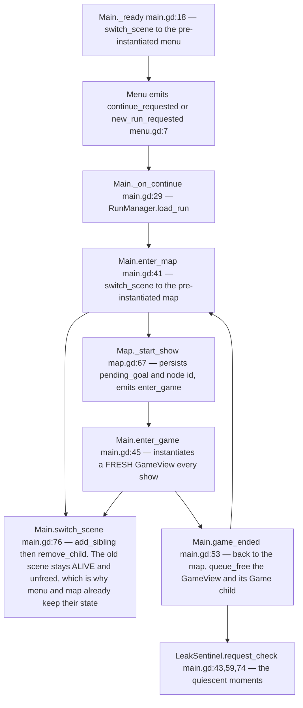

### Flowchart B — what the shell is made of

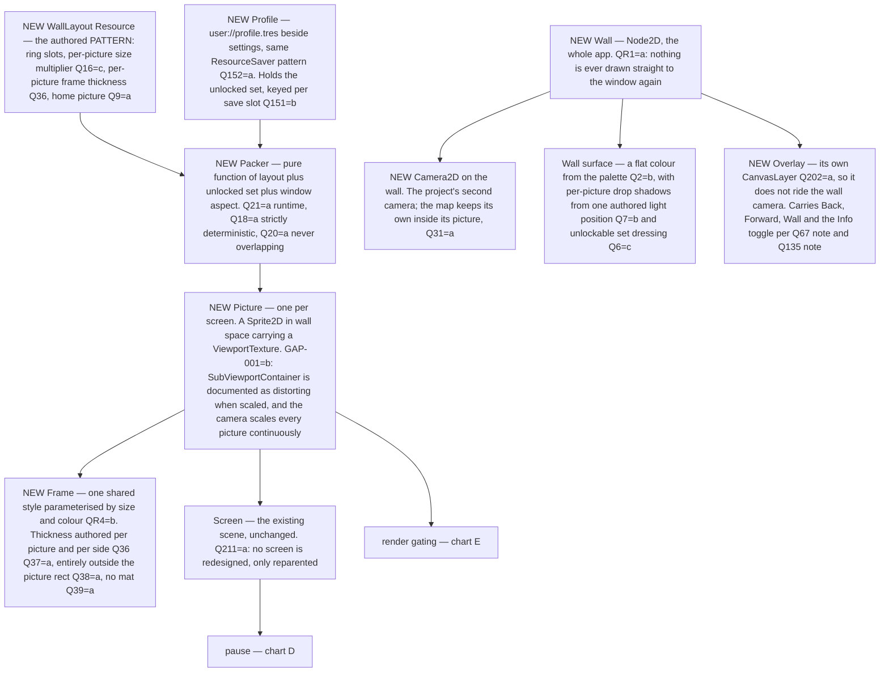

### Flowchart C — the transition, the core loop

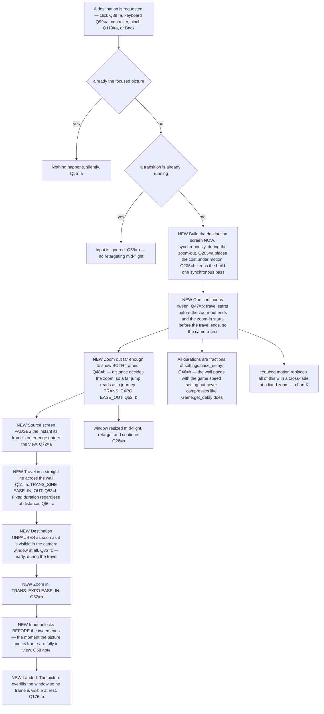

### Flowchart D — pause, and the one live screen

Rewritten in v3 against the engine's own pause system.

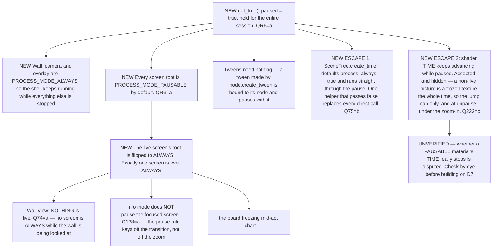

### Flowchart E — what a picture shows

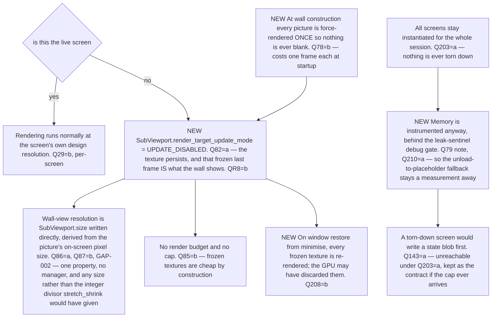

### Flowchart F — focus, Back, Forward, Wall

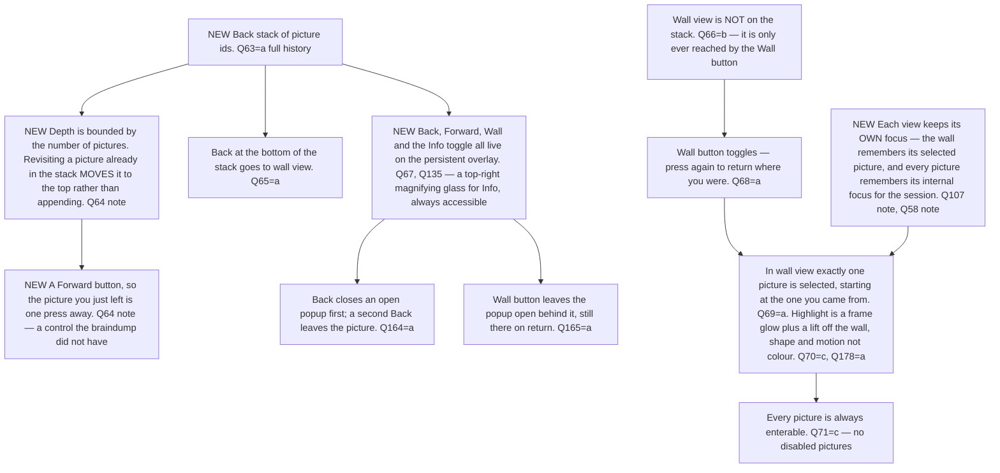

### Flowchart G — layout and re-packing

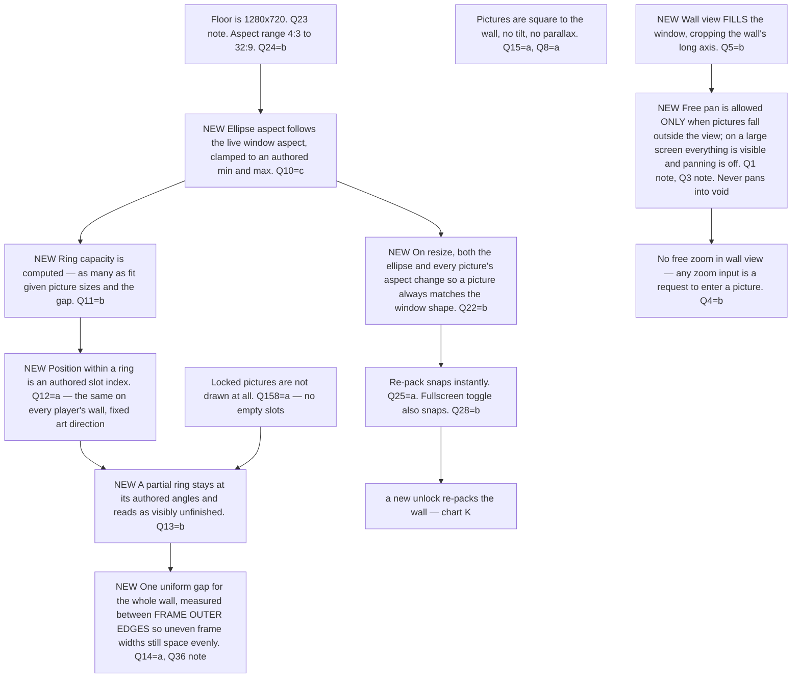

### Flowchart H — resolution and sharpness

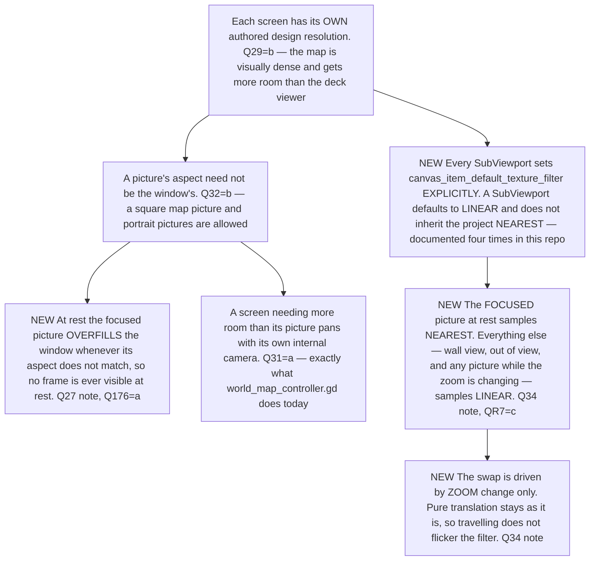

### Flowchart I — input routing

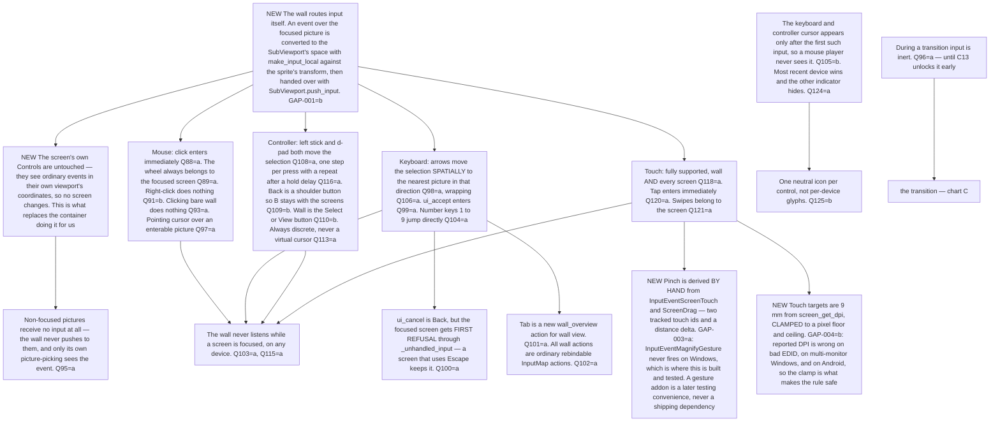

### Flowchart J — Info mode

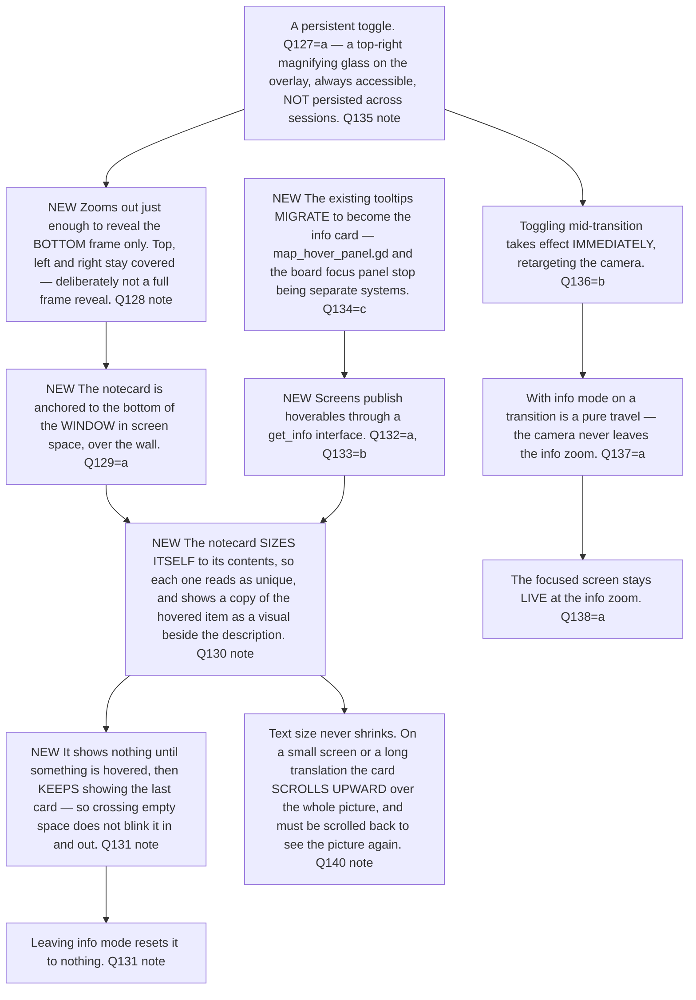

### Flowchart K — unlocks, persistence, motion

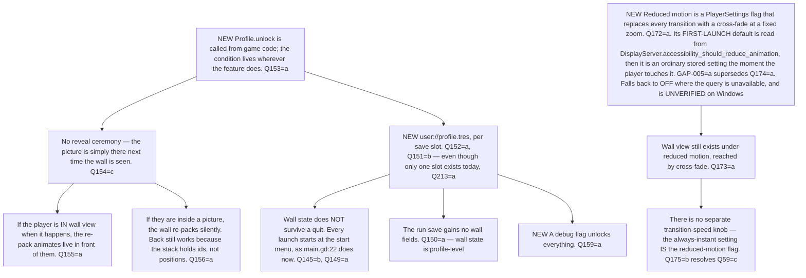

### Flowchart L — the board as a picture

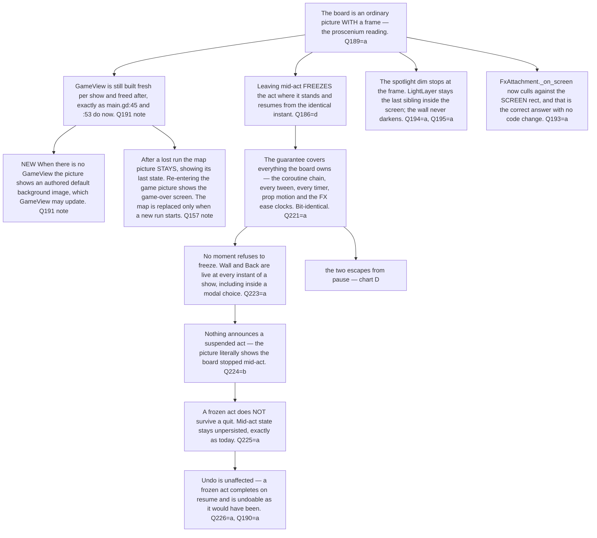

### Flowchart M — startup, and the tool

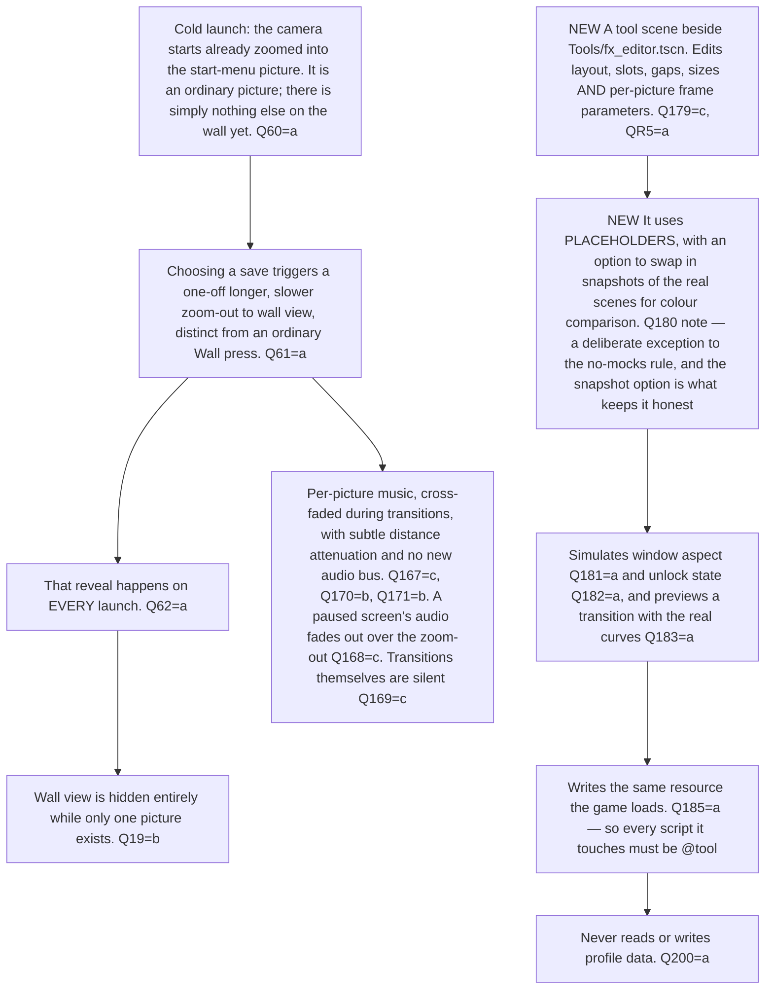

---

## 3d. Where your answers pull against each other

I have charted a reading for each of these rather than picking silently. **These are the six to
check hardest** — if my reading is wrong, the chart is wrong.

1. **`Q27` names option (b) but describes option (c).** You wrote *"yes by default. but map picture
   which is perfectly square will require overfill, so (b) for edge cases"* — overfill is (c), and
   `Q176`=(a) explicitly rests on (c). **Charted as H3:** exact fill when the picture's aspect
   matches the window, overfill whenever it does not. If you meant (b) literally — a sliver of frame
   visible at rest on odd aspects — then `Q176`=(a) is the answer that has to move.
2. **`Q13`=(b) reverses the braindump.** You originally wrote *"all pictures should always be
   clustered with no empty space in between except for preset separation gap borders"*; `Q13`=(b)
   plus `Q158`=(a) gives a wall with **visible gaps** where locked pictures will go. Charted as
   G4/G6 — deliberate, since it telegraphs that there is more to unlock. Flagging because it is a
   direct reversal.
3. **`Q17` was answered uncertainly** — *"b more likely? But possibly a for performance…"*. Charted
   as (b) — a bigger picture means a bigger screen — because `Q29`=(b) already gives per-screen
   resolutions. The performance instinct behind "possibly a" is separately satisfied by
   `Q86`/`Q87`: wall-view resolution derives from on-screen size, which is the mipmap behaviour you
   described. **Chart H1 + E5.**
4. **`Q118`=(a) versus `Q211`=(a).** Full touch support for *every screen* is hard to reconcile with
   *no existing screen is redesigned*. Charted as I8 — the wall is fully touch-driven and screens
   inherit what touch they get from being Controls. Any screen that turns out to need real touch
   work becomes a follow-up, not part of this.
5. **`Q212`=(b) says the settings screen is designed here — but nothing in this document designs
   it.** Charted as: settings is a registered picture on the wall, and its *contents* are its own
   design, exactly as the information book is under `Q214`=(a). If you meant its contents too, that
   is a separate round and I should write it.
6. **`Q167`=(c) is more audio work than it looks.** `main.tscn:13-16` plays one
   `AudioStreamPlayer` for the entire app today. Per-picture music, cross-fading, and distance
   attenuation with **no new bus** (`Q171`=b) is a new subsystem. Charted as M10, flagged for cost.

Two smaller ones, charted without concern: `Q56`=(b) "input ignored until it lands" is refined by
`Q58`'s note to unlock *just before* the tween ends (C13), and `Q59`=(c)'s "always instant" setting
is the same flag as reduced motion per `Q175`=(b) (K10).

---

## 4. The questionnaire

Grammar reminder: `ID` · `[gate]` · question · lettered options with consequences · `*default*`.
Free text and "not relevant" are available on every question and are never written on the line.

### R. Root forks — answer these first; they prune whole sections

- **QR1** `[root]` ⚑gate — Which screens become pictures on the wall in v1? · **(a)** every screen including the in-run card game board — the wall is the entire app shell and nothing is ever drawn straight to the window again — **→ next:** how the board behaves inside a frame, whether you can leave a show mid-act, what the spotlight dim does at the frame edge · **(b)** meta screens only (start menu, map, deck, book) — entering a show still hands the whole window to `game_view.tscn` as `main.gd:45-49` does today — **→ next:** nothing about the board; instead, how the wall hands off to a full-window scene and back · **(c)** meta screens in v1, but the board's picture seam is built and left unused — **→ next:** as (b), plus one contract question fixing the seam's shape · *default* (a) · notes ⇒ (b)/(c) skip §24

- **QR2** `[root]` ⚑gate — Do pictures unlock over time in v1? · **(a)** yes — a new persistent profile save records the unlocked set; none exists today, persistence is exactly `user://settings.tres` and `user://run_save/run.tres` (§1h) — **→ next:** where unlocks live, what the reveal looks like, how the wall re-packs while the player is standing in it · **(b)** no — every picture exists from first launch and the wall never changes shape; unlock hooks deferred — **→ next:** nothing about unlocks, new persistence, or re-packing · *default* (a) · notes ⇒ (b) skips §19

- **QR3** `[root]` ⚑gate — Is Info mode in v1? · **(a)** yes — **→ next:** what turns it on, what the paper card shows, where it sits, how it behaves for each input medium · **(b)** no, deferred to its own design — **→ next:** nothing in §17 · *default* (a) · notes ⇒ (b) skips §17

- **QR4** `[root]` ⚑gate — How much frame art does v1 carry? · **(a)** per-picture shader frames with expandable edge and corner art, each frame visually distinct — **→ next:** shader inputs, how corner art expands to arbitrary sizes, per-picture authoring, GPU cost against the 5.82 ms budget in §1l · **(b)** one shared frame style parameterised by size and colour, the shader and art pass deferred — **→ next:** the parameters of that one style only · **(c)** flat placeholder rectangles; all frame appearance deferred to its own design — **→ next:** nothing about frame appearance at all, only frame *geometry* in §6 · *default* (a) · notes ⇒ (b) narrows §7, (c) skips it

- **QR5** `[root]` ⚑gate — Does v1 include an authoring tool for the wall layout? · **(a)** yes, an in-editor `@tool` scene alongside `Tools/fx_editor.tscn` and `Tools/spotlight_tool.tscn` — **→ next:** what it edits, what it writes to disk, whether it previews live, and the `@tool` contagion rule from §1j · **(b)** no — layout is a hand-authored `Resource` and the tool comes later — **→ next:** the resource's shape only · **(c)** a debug overlay inside the running game rather than an editor tool — **→ next:** how it opens, whether it can write back to disk, whether it ships in release builds · *default* (a) · notes ⇒ (b) skips §23

- **QR6** `[root]` ⚑gate ⚑contract — **Premise corrected in v3** (the previous option set was wrong and you said so). Godot's pause system is a **global** `SceneTree.paused` plus a per-node `process_mode`; "only this screen runs" is expressed as `get_tree().paused = true` held for the whole session, the wall and its camera `ALWAYS`, the live screen's root flipped to `ALWAYS`, and every other screen left `PAUSABLE` (§1d). Given that, what stops a non-live screen? · **(a)** *"this should be easy with simple `get_tree().paused = true` and `process_mode = Node.PROCESS_MODE_PAUSABLE`"* — the engine's system and nothing else; the only extra work is the two things that escape it — **→ next:** just the timer and shader-clock escapes, both already asked at Q75 and Q222 · **(b)** the engine's system, plus a `pause()`/`resume()` notification a screen may implement for anything the engine cannot reach on its own — **→ next:** what that notification guarantees, and what a screen that ignores it gets · **(c)** the engine's system, plus that notification made **mandatory** for every registered picture — **→ next:** the same two questions, answered strictly · *default* (a) · notes: (a) is your round-1 answer, verbatim

- **QR7** `[root]` ⚑gate — How does a screen stay sharp while the camera zooms? Every screen is nearest-filtered pixel art (`default_texture_filter=0`, §1b) shown through a `ViewportTexture` at continuously varying scale. · **(a)** fixed design resolution per screen, texture scaled by the camera; cheapest, but nearest at non-integer zoom shimmers and drops whole rows of pixels for the length of every transition — **→ next:** nothing extra; the shimmer is accepted and §8's curves are the only lever on how long it lasts · **(b)** the SubViewport is resized to its live on-screen pixel footprint as zoom changes; always 1:1 crisp, but every zoom step is a viewport resize and a full redraw, mid-transition — **→ next:** how often the resize may fire, since a resize clears the viewport · **(c)** fixed design resolution; the picture samples LINEAR while the camera is moving and snaps to NEAREST at rest; soft during the transition, crisp whenever the player is actually reading it — **→ next:** what exactly counts as "the camera is moving" · **(d)** fixed design resolution, camera zoom quantised to integer steps; always crisp, but the transition lands only on integer zooms and a frame cannot be shown at a continuous size — **→ next:** nothing extra here, but it constrains §8's zoom stops and §6's frame thickness to whatever the integer ladder allows · *default* (c)

- **QR8** `[root]` ⚑gate — What does a picture show while it is not the live screen? · **(a)** its live screen, still rendering every frame; the wall is genuinely alive, and cost scales with picture count in a way §1l cannot price — **→ next:** what "inside the camera window" means for gating, and whether wall view needs a hard render budget · **(b)** the last frame it rendered, frozen; rendering stops when the screen pauses and the texture persists — **→ next:** how rendering is stopped, and what a picture shows before it has ever rendered · **(c)** an authored still-life image per picture; the live screen renders only while focused and its viewport is torn down otherwise — **→ next:** when the picture swaps between still-life and live, in each direction · **(d)** live but throttled while inside the camera window, frozen once outside it — **→ next:** the throttle rate and the visibility test that gates it · *default* (b)

### 2. The wall surface `[root]`

- **Q1** `[root]` ⚑contract — Is the wall a finite authored rect or an unbounded plane? · **(a)** finite — the wall has edges, and the camera clamps to them · **(b)** unbounded — the wall is however big the pictures make it, with no edge to hit · *default* (a)
- **Q2** `[QR4≠c]` — Is the wall surface itself visible art in v1? · **(a)** yes, a textured wall (wallpaper, plaster, wood) — art has to be authored for whatever the wall's largest extent turns out to be · **(b)** a flat colour from the existing palette — costs nothing and reads as a stage flat rather than a room · **(c)** a shader-driven surface with lighting that responds to the camera — the richest, and a full-screen fragment pass on top of the §1l budget · *default* (b) · notes: this is one of the few places where a cheap answer now costs nothing later
- **Q3** `[root]` — In wall view, can the player free-pan the wall with mouse drag or a stick? · **(a)** yes, free pan, clamped to the wall bounds — matches the map's existing drag-pan (`world_map_controller.gd:262`) · **(b)** no — wall view is a single fixed framing that shows everything at once and does not move · *default* (b)
- **Q4** `[root]` — In wall view, can the player free-zoom? · **(a)** yes, wheel/trigger zoom between bounds like the map's `ZOOM_MIN 0.5`/`ZOOM_MAX 4.0` (`world_map_controller.gd:20-21`) · **(b)** no — wall view is one zoom level, and any zoom input is a request to enter a picture instead · *default* (b)
- **Q5** `[root]` ⚑contract — When the wall's aspect does not match the window's, wall view should… · **(a)** fit — show the whole wall with empty margins on two sides · **(b)** fill — cover the window, cropping the wall's long axis · **(c)** fit with a margin percentage so there is always a little wall visible around the outermost frames · *default* (c)
- **Q6** `[QR4≠c]` — Does anything else hang on the wall besides pictures? · **(a)** no — pictures only · **(b)** yes — authored set dressing (a nail, a shadow, a light fitting) placed in the layout resource · **(c)** yes, and set dressing can be unlocked too · *default* (a)
- **Q7** `[QR4≠c]` — Do pictures cast a shadow on the wall? · **(a)** yes, a static offset shadow per picture · **(b)** yes, and the shadow direction derives from one authored light position so pictures across the wall are lit consistently · **(c)** no shadow · *default* (b)
- **Q8** `[root]` — Does the wall parallax — do pictures sit at slightly different depths so camera movement separates them? · **(a)** no — the wall is flat, and everything moves as one · **(b)** yes, a small per-picture depth offset · *default* (a) · notes: (b) interacts badly with a picture having to end up exactly filling the window at the end of a zoom-in

### 3. Wall layout — the elliptical radial packing `[root]`

- **Q9** `[root]` ⚑contract — What sits at the centre of the ellipse? · **(a)** a designated "home" picture, authored per wall · **(b)** empty wall — the first ring is the innermost pictures · **(c)** whichever picture is currently focused, so the ellipse re-centres on where you are · *default* (a)
- **Q10** `[root]` ⚑contract — The braindump says the ellipse's longer side matches the physical screen shape. Concretely: · **(a)** the ellipse's width:height ratio equals the live window's aspect ratio, recomputed on resize · **(b)** it equals the screens' design aspect (16:9 per §1b) and ignores the window · **(c)** it equals the window aspect, clamped to an authored min/max so an ultrawide window does not produce a pancake · *default* (c)
- **Q11** `[QR2=a]` — How many pictures go in each ring? · **(a)** an authored count per ring in the layout resource · **(b)** as many as fit given picture sizes and the separation gap, computed · **(c)** authored count, but the packer may overflow into the next ring early if a picture is oversized · *default* (c)
- **Q12** `[root]` ⚑contract — What decides a picture's position within its ring? · **(a)** an authored slot index — position is fixed art direction, the same on every player's wall · **(b)** unlock order — the wall grows the way that player played · **(c)** category grouping (run screens together, collection screens together), authored order within a category · *default* (a)
- **Q13** `[root]` ⚑contract — "Clustered with no empty space" — what is the packing rule when a ring is not full? · **(a)** the occupied slots spread evenly around the full ring, so gaps are equal and large · **(b)** the occupied slots stay adjacent at their authored angles and the ring is visibly partial — the wall looks unfinished, which telegraphs that there is more to unlock · **(c)** the occupied slots stay adjacent and the whole ring is *compacted* toward the authored start angle, with the ring's radius shrinking to keep spacing tight · *default* (c)
- **Q14** `[root]` ⚑contract — The separation gap between adjacent pictures is… · **(a)** one uniform number in wall units for the whole wall · **(b)** per-ring — inner rings tighter · **(c)** per-picture-pair, authored where it matters, uniform elsewhere · *default* (a)
- **Q15** `[QR4≠c]` — Do pictures tilt on the wall? · **(a)** no, all square to the wall · **(b)** a small authored per-picture rotation, static · **(c)** a small deterministic pseudo-random tilt derived from the picture id · *default* (b) · notes: any tilt means the zoom-in has to un-rotate to land the screen square in the window, which §8 then has to sequence
- **Q16** `[root]` ⚑gate ⚑contract — May pictures be different sizes? · **(a)** yes — an authored size class per picture (small / medium / large) — **→ next:** whether a bigger picture means a bigger *screen* or the same screen scaled · **(b)** no — every picture is the same size and importance is expressed by position only — **→ next:** nothing; the packer only ever places one rect size · **(c)** yes, freely — an authored size multiplier, any value — **→ next:** the same screen-versus-scale question as (a) · *default* (a)
- **Q17** `[Q16=a|c]` — Does a bigger picture mean a bigger screen (more content visible) or the same screen scaled up? · **(a)** the same screen, scaled — every screen has the same design resolution and a large picture is just physically larger on the wall · **(b)** a bigger screen — the picture's size class picks its SubViewport resolution, so a large picture genuinely shows more · *default* (a) · notes: (b) means a screen has to lay out at more than one resolution, which is a real cost across every existing screen
- **Q18** `[root]` — Is the layout deterministic — same unlocked set and same window, same wall, always? · **(a)** yes, strictly — the packer is a pure function and nothing is random · **(b)** yes, but seeded per profile so two players' walls differ slightly · *default* (a)
- **Q19** `[root]` — What does the wall look like with exactly one picture on it? · **(a)** the single picture centred, wall view framing it with the standard margin — visually identical to being focused except the frame shows · **(b)** wall view is unavailable until there are at least two pictures, and the wall button is hidden · *default* (b)
- **Q20** `[root]` — May pictures ever overlap? · **(a)** never — the packer guarantees it and asserts · **(b)** overlapping is allowed as a deliberate authored effect · *default* (a)
- **Q21** `[root]` ⚑contract — When is the layout computed? · **(a)** at runtime whenever the unlocked set or the window changes — the layout resource holds the *pattern*, not the positions · **(b)** baked at author time into explicit positions, one baked variant per unlock count · *default* (a)

### 4. Resolution and aspect adaptation `[root]`

- **Q22** `[root]` ⚑contract — When the window resizes, what changes? · **(a)** the ellipse's aspect only — pictures keep their size and just move · **(b)** the ellipse's aspect and every picture's aspect, so a picture always matches the window shape · **(c)** the ellipse's aspect, and picture sizes scale uniformly so the whole wall keeps filling the same share of the view · *default* (b)
- **Q23** `[root]` ⚑contract — What is the smallest supported window? · **(a)** the current default 1152 × 648 is the floor and the window is made non-resizable below it · **(b)** half that (576 × 324) with everything scaling · **(c)** no floor — the layout degrades gracefully and the frame simply gets thin · *default* (a)
- **Q24** `[root]` — What is the supported aspect range? · **(a)** 16:10 to 21:9 — anything outside is letterboxed to the nearest supported aspect · **(b)** anything from 4:3 to 32:9, ellipse clamped per Q10 · **(c)** anything at all, including portrait, with the ellipse flipping its long axis in portrait · *default* (b)
- **Q25** `[root]` — Does a resize re-pack instantly or animate? · **(a)** instantly — positions snap · **(b)** tweened over a short duration, so a dragged window edge shows the wall settling · **(c)** instantly while the drag is in progress, then one settle tween when the drag ends · *default* (c)
- **Q26** `[root]` — Resize *during* a transition: · **(a)** the transition retargets to the new geometry mid-flight and continues · **(b)** the transition finishes against the old geometry and the wall re-packs after it lands · **(c)** the transition is cut short — the camera snaps to the destination and the wall re-packs · *default* (a)
- **Q27** `[root]` ⚑contract — Is the focused picture guaranteed to exactly fill the window at rest, at every aspect? · **(a)** yes, exactly — this is an invariant, and picture aspect follows window aspect to make it true · **(b)** it fills the window's smaller dimension and the frame stays slightly visible on the other axis at extreme aspects · **(c)** it always slightly overfills, so the frame is guaranteed off-screen at any aspect · *default* (c)
- **Q28** `[root]` — Fullscreen toggle behaves as… · **(a)** an ordinary resize, using whatever Q25/Q26 said · **(b)** an instant snap regardless of Q25, because the whole display mode changed · *default* (b)

### 5. The picture's screen — design resolution `[root]`

- **Q29** `[root]` ⚑gate ⚑contract — Do all screens share one design resolution? · **(a)** yes, one number for every screen — **→ next:** what that number is · **(b)** per-screen, authored — the map may want more room than the deck viewer — **→ next:** nothing further here; each screen's resolution becomes part of its picture's authored data, and every screen must be verified at its own · *default* (a)
- **Q30** `[Q29=a]` ⚑contract — What is that resolution? · **(a)** 1152 × 648, the current engine default the game is already built against (§1b) · **(b)** 1920 × 1080, so a modern full-screen window is 1:1 and everything below it downsamples · **(c)** a fixed height with the width derived from the live window aspect, so the SubViewport is never letterboxed · *default* (c)
- **Q31** `[root]` — Screens that need more room than the design resolution (the world map is the obvious one) should… · **(a)** use their own internal camera and pan inside their picture, exactly as `world_map_controller.gd` does today — the picture is a window onto a bigger space · **(b)** get a larger design resolution per Q29 (b) · **(c)** be redesigned to fit · *default* (a)
- **Q32** `[root]` — Is a picture's aspect always the window's aspect? · **(a)** yes, every picture — uniform and simple · **(b)** no — a picture may be authored square or portrait, and only the *focused* one is guaranteed to match the window · *default* (a) · notes: (b) is what a "corkboard" or a "book" picture might genuinely want, and it interacts with Q27
- **Q33** `[QR7=b]` ⚑contract — Resizing a SubViewport clears it. How often may the resize fire? · **(a)** on every zoom change, uncapped · **(b)** quantised to power-of-two steps, so a full transition resizes a handful of times · **(c)** only at rest — one resize when the transition lands, the transition itself running at the old resolution · *default* (c)
- **Q34** `[QR7=c]` ⚑contract — What counts as "the camera is moving" for the LINEAR/NEAREST swap? · **(a)** any active transition tween · **(b)** any frame where the camera's zoom or position changed at all, including a resize settle · **(c)** any frame where *zoom* changed; pure translation stays NEAREST · *default* (b)

### 6. Frame geometry `[root]`

- **Q35** `[root]` ⚑gate ⚑contract — The braindump says some screens want frame thickness 0, and also that leaving a screen means "zoom out enough to show the frame". For a 0-thickness picture, leaving it means… · **(a)** zoom out by the same *proportion* every picture uses, so a frameless picture reveals wall around it instead of a frame — **→ next:** that proportion, and whether it is per-picture · **(b)** zoom out until a fixed margin of wall is visible, frame or no frame — **→ next:** that margin as a wall-unit number · **(c)** frameless pictures get an invisible frame of the standard thickness for layout and camera purposes only — **→ next:** nothing extra; the frame is a geometry concept that happens to be undrawn · *default* (c)
- **Q36** `[root]` ⚑contract — Frame thickness is expressed in… · **(a)** wall units, fixed per picture — a large picture's frame is proportionally thinner · **(b)** a fraction of the picture's shorter side — every picture's frame reads the same weight · **(c)** screen pixels at the focused zoom, so the frame is always the same apparent thickness when you are looking at it · *default* (b)
- **Q37** `[root]` — Is frame thickness uniform on all four sides? · **(a)** yes · **(b)** no — authored per side, so a picture can have a deep bottom rail for a nameplate · *default* (b)
- **Q38** `[root]` ⚑contract — Does the frame sit outside the picture rect or overlap its edge? · **(a)** entirely outside — the screen's full design resolution is always visible · **(b)** overlapping inward by an authored amount, so the frame crops the screen's outermost pixels · *default* (a)
- **Q39** `[QR4≠c]` — Is there a mat / passe-partout between the screen and the frame? · **(a)** no · **(b)** yes, an authored width and colour per picture · **(c)** yes, and it is where the picture's title is printed · *default* (b)
- **Q40** `[root]` — May a frameless picture still have a mat (per Q39)? · **(a)** yes — the mat is what reads as its border · **(b)** no — frameless means nothing but the screen, right up to the wall · *default* (b)
- **Q41** `[root]` — Does a frameless picture still get a shadow (per Q7)? · **(a)** yes — it reads as a flush-mounted panel · **(b)** no — it reads as painted directly onto the wall · *default* (a)

### 7. Frame appearance `[QR4=a|b]`

- **Q42** `[QR4=a]` ⚑contract — How does corner art expand to arbitrary frame sizes? · **(a)** nine-slice: fixed corners, tiled edges · **(b)** nine-slice with *stretched* rather than tiled edges · **(c)** corners fixed, edges generated by a shader from a profile rather than from a texture · *default* (a)
- **Q43** `[QR4=a]` — What makes each frame visually unique? · **(a)** a distinct texture set per frame style, authored as art · **(b)** one texture set, per-picture shader parameters (hue, wear, gilding, carve depth) · **(c)** both — a handful of authored art sets, each further parameterised per picture · *default* (c)
- **Q44** `[QR4=a]` — Is the frame animated at all? · **(a)** static · **(b)** subtle idle motion (a slow specular sweep, dust) on the focused picture only · **(c)** animated only during a transition, still at rest · *default* (b) · notes: this is a per-frame full-time shader cost against the budget in §1l
- **Q45** `[QR4=a|b]` — Does the frame react to state — the picture holding an active run, a new unlock, an unread thing? · **(a)** no — frames are pure art · **(b)** yes, an authored "attention" variant per frame style · **(c)** yes, and it is a separate overlay element (a ribbon, a tag) rather than a frame variant · *default* (c)

### 8. Camera choreography `[root]`

- **Q46** `[root]` ⚑gate ⚑contract — Which clock drives the wall's transitions? ⚠ `Game.get_delay()` compresses to **0.0** during an act fast-forward (`game.gd:130-143`), so binding the camera to it makes the wall snap whenever the player cancels an act. · **(a)** a new `wall_transition_delay` in `PlayerSettings`, independent of any show — **→ next:** its value, and per-phase fractions of it · **(b)** `CardEnvironment.get_delay()`'s **base** (`settings.base_delay`, §1i), so the wall paces with the game's overall speed setting but never compresses — **→ next:** per-phase fractions of base_delay · **(c)** `Game.get_delay()` as-is, compression included — **→ next:** what the wall does when the delay is 0 · *default* (a)
- **Q47** `[root]` ⚑contract — The transition is described as three phases (zoom out, travel, zoom in). Do they overlap? · **(a)** strictly sequential — out, then across, then in · **(b)** overlapping — the travel begins before the zoom-out finishes and the zoom-in begins before the travel finishes, so the camera arcs · **(c)** a single continuous path: one tween moves position and zoom together on curves that produce the out-across-in shape as a side effect · *default* (c)
- **Q48** `[root]` ⚑gate ⚑contract — How far out does the zoom-out phase go? · **(a)** exactly far enough to show the source picture's whole frame plus a small margin — **→ next:** whether travel duration scales with distance, since the zoom no longer expresses it · **(b)** far enough to show both source and destination frames, so the distance travelled decides the zoom — **→ next:** whether duration *also* scales, on top of the zoom already expressing distance · **(c)** always all the way to wall view, for every transition — **→ next:** the same duration-scaling question as (a) · *default* (b) · notes: (b) is the one that makes a far jump read as a journey and an adjacent jump read as a step, which is what the braindump describes
- **Q49** `[Q48=a|c]` — With a fixed zoom-out distance, a far-side destination means a long travel at high zoom. Should travel duration scale with distance? · **(a)** yes, proportional with a floor and a ceiling · **(b)** no — every transition takes the same time regardless of distance · *default* (a)
- **Q50** `[Q48=b]` — With a distance-derived zoom, should travel duration *also* scale with distance? · **(a)** no — the zoom already expresses the distance, and a fixed duration keeps the game feeling responsive · **(b)** yes, mildly · *default* (a)
- **Q51** `[root]` ⚑contract — Path shape between two pictures: · **(a)** straight line in wall space · **(b)** an arc following the ellipse the pictures sit on, so travel around a ring feels like turning your head · **(c)** straight, but with position eased separately per axis so it reads as a slight curve · *default* (b)
- **Q52** `[root]` ⚑contract — Which easing curve for the zoom? · **(a)** `TRANS_CUBIC` / `EASE_IN_OUT` — the neutral choice · **(b)** `TRANS_EXPO` / `EASE_OUT` on the way out and `EASE_IN` on the way in, so the frame appears fast and the arrival settles · **(c)** `TRANS_BACK`, so the zoom slightly overshoots past the frame before settling — matches the existing UI pulse feel (`game_view.gd:172`) · *default* (b)
- **Q53** `[root]` ⚑contract — Which easing curve for the travel? · **(a)** the same curve as the zoom · **(b)** `TRANS_SINE` / `EASE_IN_OUT` — a gentler, more even glide than the zoom · *default* (b)
- **Q54** `[root]` — Does the destination picture do anything to announce itself before the camera arrives? · **(a)** no · **(b)** yes — a subtle highlight/glow on its frame from the moment the transition starts · *default* (b)
- **Q55** `[root]` — What happens if the player requests the picture they are already in? · **(a)** nothing at all, silently · **(b)** a small "already here" nudge — a brief zoom-out-and-back · *default* (a)
- **Q56** `[root]` ⚑gate — Can a transition be interrupted by a new destination request? · **(a)** yes — the camera retargets from wherever it is, no restart — **→ next:** how the phase is recomputed mid-flight, and whether pause/unpause has to unwind · **(b)** no — input is ignored until the transition lands — **→ next:** whether the ignored input is queued or dropped · **(c)** yes, but only by a *different* destination; re-requesting the same one is ignored — **→ next:** as (a) · *default* (a)
- **Q57** `[Q56=a|c]` — Interrupted mid-zoom-in on picture A, retargeting to B: · **(a)** continue outward from the current zoom, which may mean reversing direction visibly · **(b)** finish landing on A, then start a fresh transition to B — never reverse · *default* (a)
- **Q58** `[Q56=b]` — Input arriving during a transition is… · **(a)** dropped entirely · **(b)** queued — the last request wins and fires when the transition lands · *default* (b)
- **Q59** `[root]` — Can a transition be skipped? · **(a)** yes — any confirm input during a transition snaps it to the destination · **(b)** no · **(c)** yes, and there is a setting for "always instant" (see §22) · *default* (c)
- **Q60** `[root]` ⚑contract — At cold launch the start menu has no frame and no wall visible. How does that state work? · **(a)** the camera simply starts already zoomed into the start-menu picture — it is an ordinary picture and the shell is identical, there is just nothing else on the wall yet · **(b)** the start menu is genuinely outside the wall system, and the wall is constructed when a save is chosen · *default* (a)
- **Q61** `[root]` — The braindump's "choose your save → zoom out to show the whole wall". Is that reveal special? · **(a)** yes — a one-off longer, slower zoom-out to wall view, distinct from an ordinary wall-button press · **(b)** no — it is an ordinary transition to wall view · **(c)** special only the first time in a session · *default* (a)
- **Q62** `[root]` — Does the reveal in Q61 happen on every launch, or only the first? · **(a)** every launch — it is the shape of the game's opening · **(b)** only when there is more than one picture, so a brand-new profile does not get an anticlimactic reveal of one frame · *default* (b)

### 9. Focus, Back and the Wall button `[root]`

- **Q63** `[root]` ⚑gate ⚑contract — What does Back go back to? · **(a)** a full history stack — Back retraces every picture you visited, in order — **→ next:** stack depth, whether wall view is on it, what happens at the bottom · **(b)** one level only — Back returns to the picture you came from, and pressing it again returns here — a toggle — **→ next:** nothing about depth · **(c)** a hierarchical parent, authored per picture — Back means "up", not "previous" — **→ next:** how the hierarchy is authored and what the root's parent is · *default* (a)
- **Q64** `[Q63=a]` ⚑contract — How deep is the stack? · **(a)** unbounded · **(b)** capped at a fixed depth, oldest dropped · **(c)** unbounded, but consecutive visits to the same picture collapse to one entry · *default* (c)
- **Q65** `[root]` — What does Back do when there is nowhere to go back to — the bottom of the stack, or a toggle with no previous picture? · **(a)** goes to wall view · **(b)** goes to the authored home picture (Q9) · **(c)** the Back control is disabled and visibly so · *default* (c) · notes: ⚠ a Back that silently does nothing is the exact defect this repo's own tool review turned up — whichever answer, the control must *look* unavailable
- **Q66** `[Q63=a|c]` — Is wall view an entry on the stack? · **(a)** yes — Back from a picture you entered from wall view returns to wall view · **(b)** no — the stack holds pictures only, and wall view is always reached by the Wall button · *default* (a)
- **Q67** `[root]` ⚑contract — Where do the Back and Wall controls live? · **(a)** on a persistent overlay drawn on top of everything, outside every screen — one implementation, always in the same place · **(b)** inside each screen's own layout, so each screen places them in its own art · **(c)** on the *frame* — physically part of the picture's border, only reachable when the frame is visible · *default* (a) · notes: (c) is the most diegetic and the most hostile; (b) means editing every existing screen
- **Q68** `[root]` — Does the Wall button go to wall view, or toggle between wall view and where you were? · **(a)** toggle — press again to return · **(b)** one-way to wall view; leaving is done by picking a picture or pressing Back · *default* (a)
- **Q69** `[root]` — In wall view, is a picture "selected" (a cursor sitting on one) or is there no selection until the player acts? · **(a)** always exactly one selected picture, starting at the one you came from · **(b)** no selection for mouse, a selection for keyboard/controller — the medium decides · **(c)** never a persistent selection; hover and press only · *default* (b)
- **Q70** `[root]` — What does hovering/selecting a picture in wall view do visually? · **(a)** nothing until pressed · **(b)** the frame highlights · **(c)** the frame highlights and the picture lifts slightly off the wall · *default* (c)
- **Q71** `[root]` — Can a picture be un-enterable — present on the wall but not currently valid to open (no run in progress, say)? · **(a)** yes — it renders visibly disabled and cannot be selected · **(b)** yes, but it can still be entered; the screen itself explains the empty state · **(c)** no — anything on the wall is always enterable · *default* (b) · notes: (b) is what `menu.gd:29-30` already does for Continue — it disables the button rather than hiding it

### 10. Pause — the one live screen `[root]`

- **Q72** `[root]` ⚑contract — The braindump's rule is "pause once the full frame is visible on the way out, unpause once in vision if it is the next focus, everything paused in wall view". Concretely, the live screen becomes paused when… · **(a)** the zoom-out crosses the exact moment the frame's outer edge enters the view · **(b)** the transition starts, full stop — simpler and one frame earlier · **(c)** an authored fraction of the zoom-out phase, tunable · *default* (a)
- **Q73** `[root]` ⚑contract — And the destination unpauses when… · **(a)** the zoom-in crosses the moment its frame's outer edge leaves the view — the mirror of Q72 · **(b)** the moment the transition begins, so it is running throughout the travel · **(c)** the moment the destination becomes visible in the camera window at all, which during a long travel is early · *default* (c) · notes: the braindump says "unpause once in vision regardless of zoom in", which is (c) — this question exists to confirm that against the cost
- **Q74** `[root]` — In wall view, is anything live? · **(a)** nothing — every screen is paused, as the braindump says · **(b)** the selected picture only · *default* (a)
- **Q75** `[root]` ⚑contract — **Re-asked in v3 with a sharper premise.** Setting `paused = true` does *not* cover this one: `SceneTree.create_timer()` defaults `process_always = true`, so every `await get_tree().create_timer(t)` in the show keeps counting straight through the pause ([godot-proposals#9924](https://github.com/godotengine/godot-proposals/issues/9924)) — the act would advance while its pixels are frozen. The engine will not do this for you; something has to. What? · **(a)** an audited sweep — every `create_timer` call in game code gets its second argument passed `false`, once · **(b)** game code stops calling `create_timer` directly and goes through one helper that passes `false`, so the next one written is right by default and the sweep cannot rot · **(c)** nothing — timers running on through a pause is accepted · *default* (b)
- **Q76** `[QR6=b|c]` ⚑contract — What does the `pause()` notification guarantee, on top of what `PAUSABLE` already gives you for free? · **(a)** the screen releases anything the engine cannot: audio it started, a coroutine holding a resource, an in-flight thread or file write — so a paused screen costs nothing but memory · **(b)** nothing extra is guaranteed; it is purely a chance to react, and a screen may ignore it · *default* (a)
- **Q77** `[QR6=b]` — A screen that does not implement the notification… · **(a)** is fine — `PAUSABLE` already stopped it, and the notification is an opt-in extra · **(b)** logs a warning so the gap is visible · *default* (a)
- **Q78** `[root]` ⚑contract — A screen that has never been focused has never rendered. What does its picture show before its first visit? · **(a)** an authored placeholder image per picture · **(b)** it is force-rendered once at wall construction, then frozen — costs one frame each at startup · **(c)** it renders live until first focused, then follows the normal rules · *default* (b)
- **Q79** `[root]` — Is there a limit on how long a screen may stay paused before it is torn down entirely? · **(a)** no — once built, a screen lives for the session · **(b)** yes — an LRU cap on live screens (see §26) · *default* (b)

### 11. What renders when `[root]`

- **Q80** `[QR8=a|d]` ⚑contract — "Inside the camera window" for render gating means… · **(a)** the picture's rect intersects the camera's visible rect · **(b)** that, grown by a margin, so a picture about to slide in is already rendering · *default* (b)
- **Q81** `[QR8=d]` ⚑contract — What is the throttle rate for a visible non-focused picture? · **(a)** every other frame · **(b)** a fixed 10 Hz regardless of frame rate · **(c)** budget-driven — as many as fit a per-frame millisecond allowance, round-robin · *default* (c)
- **Q82** `[QR8=b|c|d]` ⚑contract — How is rendering actually stopped? · **(a)** `SubViewport.render_target_update_mode = UPDATE_DISABLED` — the texture persists, which is what makes the frozen frame work · **(b)** the whole viewport is freed and recreated · *default* (a)
- **Q83** `[QR8=c]` — With authored still-lifes, when does a picture swap from its still-life to the live screen? · **(a)** at the start of the zoom-in, so the swap is hidden by motion · **(b)** the moment it becomes the destination · **(c)** only at rest, once focused — the entire transition shows the still-life · *default* (a)
- **Q84** `[QR8=c]` — And back to the still-life on the way out? · **(a)** at the moment the frame becomes visible, matching the pause · **(b)** at the end of the transition · *default* (b) · notes: swapping out early risks a visible pop while the player is still looking at the picture
- **Q85** `[root]` — Does the wall view's total render cost get a hard cap? · **(a)** yes — a millisecond budget per frame that the render scheduler respects, dropping the least important pictures first · **(b)** no — the design is cheap enough by construction (QR8=b/c) that a budget is dead code · *default* (b)
- **Q86** `[root]` ⚑gate — Are picture textures rendered at a lower resolution while in wall view, where they are small on screen? · **(a)** yes — a wall-view resolution per picture, distinct from its focused resolution — **→ next:** who decides that resolution · **(b)** no — one resolution always, and a picture 200 px wide on the wall is still rendering its full design resolution — **→ next:** nothing further; the memory ceiling question in §26 carries the consequence · *default* (a)
- **Q87** `[Q86=a]` ⚑contract — Who decides the wall-view resolution? · **(a)** a fixed authored fraction of the design resolution · **(b)** derived from the picture's on-screen pixel size at wall-view zoom · *default* (b)

### 12. Input — mouse `[root]`

- **Q88** `[root]` — In wall view, clicking a picture… · **(a)** enters it immediately · **(b)** selects it; a second click enters — two-step, safer on a dense wall · *default* (a)
- **Q89** `[root]` ⚑gate — Does the mouse wheel do anything on the wall? · **(a)** nothing — the wheel always belongs to whatever screen is focused — **→ next:** nothing further about the wheel · **(b)** zooms, if Q4 said free zoom — **→ next:** nothing further; it is the map's existing wheel-zoom behaviour applied to the wall camera · **(c)** wheel down from a focused picture goes to wall view, wheel up on a hovered picture enters it — the wheel *is* the zoom metaphor — **→ next:** who wins when the focused screen also uses the wheel, as the map does at `world_map_controller.gd:244-246` · *default* (c)
- **Q90** `[Q89=c]` — Does that wheel gesture work inside a screen that uses the wheel itself (the map zooms with it, `world_map_controller.gd:244-246`)? · **(a)** no — inside a focused screen the wheel belongs to the screen, always · **(b)** yes, but only when the screen leaves the event unhandled · *default* (a)
- **Q91** `[root]` — Right-click anywhere means Back? · **(a)** yes · **(b)** no — Back is the on-screen control only · *default* (a)
- **Q92** `[root]` — Middle-drag or space-drag to pan in wall view (if Q3 allowed panning)? · **(a)** yes, matching the map's left-drag pan · **(b)** no · *default* (b)
- **Q93** `[root]` — Does a click on the *wall itself* (not a picture) do anything? · **(a)** nothing · **(b)** in a focused picture it means "go to wall view"; in wall view it means "deselect" · *default* (a)
- **Q94** `[root]` ⚑contract — How does a mouse click inside a focused picture reach the screen's own Controls? The screen lives in a SubViewport that is not 1:1 with the window. · **(a)** a `SubViewportContainer` under the camera, letting Godot transform the events · **(b)** the wall pushes events into the SubViewport manually with an explicit inverse transform · *default* (a) · notes: this is the single highest-risk mechanism in the design — (a) is far less code and is the engine's supported path, but it constrains the picture to a Control-shaped node under the camera
- **Q95** `[root]` — Do non-focused pictures receive mouse events at all? · **(a)** no — only the wall's own picture-picking sees them · **(b)** yes, so a live picture on the wall can be interacted with directly · *default* (a)
- **Q96** `[root]` — During a transition, does the mouse do anything? · **(a)** nothing — input is inert until it lands (unless Q56 allows retargeting) · **(b)** hover highlighting continues so the destination can be changed mid-flight · *default* (a)
- **Q97** `[root]` — Does the mouse cursor change over an enterable picture? · **(a)** yes — a pointing cursor · **(b)** no · *default* (a)

### 13. Input — keyboard `[root]`

- **Q98** `[root]` ⚑contract — In wall view, arrow keys move the selection how? · **(a)** spatially — the nearest picture in that direction · **(b)** around the ring — left/right go around, up/down change ring · **(c)** both: left/right around the ring, up/down between rings, and that *is* spatial enough on an ellipse · *default* (c)
- **Q99** `[root]` — Does `ui_accept` enter the selected picture? · **(a)** yes · **(b)** yes, and a second `ui_accept` on an already-focused picture is passed through to the screen · *default* (a)
- **Q100** `[root]` ⚑contract — Which key is Back? ⚠ `ui_cancel` is `Escape` and the map already consumes it to clear its node selection (`world_map_controller.gd:236-241`). · **(a)** `ui_cancel`, and the focused screen gets first refusal via `_unhandled_input` — a screen that uses Escape internally keeps it · **(b)** `ui_cancel`, unconditionally taken by the wall — screens lose Escape · **(c)** a dedicated new action (`wall_back`), leaving `ui_cancel` entirely to the screens · *default* (a)
- **Q101** `[root]` ⚑contract — Which key is Wall view? · **(a)** a new `wall_overview` action, default `Tab` · **(b)** double-tap of the Back key · **(c)** a new action, default `M` for map/wall · *default* (a)
- **Q102** `[root]` — Can the player rebind the wall's actions? · **(a)** yes, through whatever settings UI exists — they are ordinary `InputMap` actions · **(b)** no, fixed · *default* (a) · notes: there is no key-rebinding UI in the project today; (a) means the actions are rebindable in principle, not that the UI ships in v1
- **Q103** `[root]` — With keyboard focus inside a screen, do arrow keys ever reach the wall? · **(a)** never — the wall only listens in wall view · **(b)** yes, with a modifier held · *default* (a)
- **Q104** `[root]` — Is there a keyboard shortcut that jumps directly to a specific picture? · **(a)** yes — number keys 1..9 map to pictures in ring order · **(b)** no · *default* (b)
- **Q105** `[root]` — In wall view, is the selection visible immediately or only after the first key press? · **(a)** immediately, always visible · **(b)** only once a key is pressed, so a mouse player never sees a keyboard cursor · *default* (b)
- **Q106** `[root]` — Does the wall selection wrap at the ends of a ring? · **(a)** yes, wraps · **(b)** no, stops · *default* (a)
- **Q107** `[root]` — Does the wall trap keyboard focus, or does Godot's own focus-neighbour system handle in-screen navigation independently? · **(a)** independent — the wall never touches `Control` focus; screens keep their own focus chains · **(b)** the wall owns focus and hands it to the screen on arrival · *default* (b) · notes: (b) is what makes "arrive at a screen and it is already keyboard-ready" work, and something has to do it

### 14. Input — controller `[root]`

- **Q108** `[root]` — In wall view, which stick or pad moves the selection? · **(a)** left stick and d-pad both, same behaviour as arrows · **(b)** d-pad steps between pictures, left stick free-pans the camera (if Q3 allowed it) · *default* (a)
- **Q109** `[root]` ⚑contract — Which button is Back? · **(a)** the `ui_cancel` button (B / Circle), already bound project-wide · **(b)** a shoulder button, leaving B to the screens · *default* (a)
- **Q110** `[root]` ⚑contract — Which button is Wall view? · **(a)** a shoulder/bumper · **(b)** the Select/View button · **(c)** hold Back · *default* (a)
- **Q111** `[root]` — Do triggers zoom (if Q4 allowed zoom)? · **(a)** yes · **(b)** no · *default* (b)
- **Q112** `[root]` — Is there rumble on arrival at a picture? · **(a)** yes, a short soft pulse · **(b)** no · **(c)** yes, and it is a setting · *default* (c) · notes: the project has no rumble anywhere today
- **Q113** `[root]` — With a controller, is there ever a free cursor, or is navigation always discrete selection? · **(a)** always discrete · **(b)** a virtual cursor in wall view · *default* (a)
- **Q114** `[root]` — Does the wall need to work before any controller has been detected — i.e. does a controller connecting mid-session change anything? · **(a)** no change; both models are always live · **(b)** the selection cursor appears on first controller input, per Q105's logic · *default* (b)
- **Q115** `[root]` — Do controller inputs inside a focused screen reach the wall at all? · **(a)** no, same as Q103 · **(b)** the shoulder buttons are reserved for the wall in every screen · *default* (b)
- **Q116** `[root]` — Is stick-based selection rate-limited (a repeat delay) so a held stick does not fly across the wall? · **(a)** yes, one step per press with a repeat after a hold delay · **(b)** continuous while held · *default* (a)
- **Q117** `[root]` — Is there a "hold to go home" gesture? · **(a)** yes — hold Back to jump to the home picture (Q9) · **(b)** no · *default* (b)

### 15. Input — touch `[root]`

⚠ Touch is not a supported medium anywhere in this project today (§1k). Everything here is new.

- **Q118** `[root]` ⚑gate — Is touch actually in v1? · **(a)** yes, fully — the wall and every screen work by touch alone — **→ next:** gestures, tap targets, and what each existing screen owes · **(b)** the wall supports touch, individual screens are not audited for it in v1 — **→ next:** wall gestures only · **(c)** no — touch is designed for but not implemented — **→ next:** nothing in §15 beyond a note in the plan · *default* (b)
- **Q119** `[Q118=a|b]` ⚑contract — Pinch to zoom? · **(a)** yes — pinch out on a picture enters it, pinch in goes to wall view · **(b)** no — tap only · *default* (a)
- **Q120** `[Q118=a|b]` — Tap a picture in wall view: · **(a)** enters immediately · **(b)** first tap selects and shows its info, second enters · *default* (a)
- **Q121** `[Q118=a|b]` — Swipe in a focused picture: · **(a)** nothing — swipes belong to the screen · **(b)** swipe left/right moves to the adjacent picture on the ring · *default* (a) · notes: (b) is lovely and will fight every screen that scrolls
- **Q122** `[Q118=a|b]` — Where is Back for touch? · **(a)** the same on-screen control everyone else uses, sized for a finger · **(b)** an edge swipe · **(c)** both · *default* (c)
- **Q123** `[Q118=a]` ⚑contract — Minimum tap-target size for wall and frame controls? · **(a)** 44 px at the design resolution · **(b)** 9 mm physical, derived from the reported DPI · *default* (a)

### 16. Input — mixed and everything else `[root]`

- **Q124** `[root]` — Two media used at once (mouse hovering while the controller selects): who owns the highlight? · **(a)** the most recent input device wins and the other's indicator hides · **(b)** both indicators show at once · *default* (a)
- **Q125** `[root]` — Does the on-screen prompt for Back/Wall change glyph with the active device? · **(a)** yes — keyboard key, controller button, or a touch target as appropriate · **(b)** no — one neutral icon always · *default* (a) · notes: there is no glyph system in the project today, so (a) is new work
- **Q126** `[root]` — Is there any input medium not listed — steam deck touchpads, remote play, a screen reader, a one-handed mode — that must be covered in v1? · **(a)** no, the four listed cover v1 · **(b)** yes — name it in free text · *default* (a) · notes: this question exists precisely because the braindump ended with "and anything else I'm missing"

### 17. Info mode `[QR3=a]`

- **Q127** `[QR3=a]` ⚑gate ⚑contract — What is Info mode, exactly? · **(a)** a persistent toggle — while on, the camera sits zoomed out enough to show the focused frame, and a paper card at the bottom describes whatever is hovered — **→ next:** the toggle's home, the card's content and layout, and what happens on every transition while it is on · **(b)** a momentary hold — the zoom-out and the card last only while a key is held — **→ next:** which key, and whether it can be latched · **(c)** not a mode at all — the card appears on hover with a delay, and the camera never moves — **→ next:** the card only; nothing about zoom · *default* (a)
- **Q128** `[QR3=a & Q127=a|b]` ⚑contract — How far out does Info mode zoom? · **(a)** exactly the frame-visible zoom from Q35/Q48 — the same stop the transition passes through · **(b)** further, so the card has room below the picture without covering it · *default* (b)
- **Q129** `[QR3=a]` ⚑contract — Where does the card sit? · **(a)** anchored to the bottom of the *window*, in screen space, on top of the wall · **(b)** on the wall, below the focused picture, moving with the camera — fully diegetic · **(c)** on the wall but always facing the camera at a fixed apparent size · *default* (a) · notes: the braindump says "exists visually on top of wall scene", which reads as (a); (b) is the more diegetic reading and costs more
- **Q130** `[QR3=a]` — What is the card, visually? · **(a)** a paper label · **(b)** an open book · **(c)** an index card pinned to the wall · **(d)** authored per picture — the deck's card is a card, the book's is a page · *default* (d)
- **Q131** `[QR3=a]` — What does the card show when nothing is hovered? · **(a)** it hides · **(b)** it shows the focused picture's own description · **(c)** it stays visible and empty, so the layout does not jump · *default* (b)
- **Q132** `[QR3=a]` ⚑gate ⚑contract — Does Info mode describe things *inside* a screen (a card, a map node), or only pictures? · **(a)** both — screens publish hoverable things to the info system through a shared interface — **→ next:** what that interface is, and what happens to the hover tooltips screens already have · **(b)** pictures only in v1 — **→ next:** nothing further; the existing per-screen tooltips are untouched and Info mode is purely a wall feature · *default* (a)
- **Q133** `[QR3=a & Q132=a]` ⚑contract — What is that interface? · **(a)** the hovered node emits an existing project signal carrying a description string · **(b)** a `get_info()` method on an interface the hoverable implements · **(c)** an autoload the hovered node pushes to · *default* (b)
- **Q134** `[QR3=a & Q132=a]` — Screens already have their own hover tooltips (`UI/map_hover_panel.gd`, the board's focus inspector panel). With Info mode on, do those still show? · **(a)** no — the info card replaces them while the mode is on · **(b)** yes, both — they answer different questions · **(c)** the existing tooltips are migrated to *be* the info card, so there is only one system · *default* (c) · notes: (c) is the largest and the only one that ends with a single hover system
- **Q135** `[QR3=a]` ⚑contract — Where does the Info-mode toggle live? · **(a)** a `PlayerSettings` field, persisted, matching every other knob (§1i) · **(b)** session-only state on the wall · *default* (a)
- **Q136** `[QR3=a]` — Toggling Info mode during a transition: · **(a)** takes effect when the transition lands · **(b)** takes effect immediately, retargeting the camera mid-flight · *default* (a)
- **Q137** `[QR3=a & Q127=a|b]` — With Info mode on, does a transition still zoom all the way in and back out? · **(a)** no — the camera stays at the info zoom throughout, so a transition is a pure travel · **(b)** yes, unchanged; the info zoom is only the resting pose · *default* (a)
- **Q138** `[QR3=a & Q127=a|b]` — Is the focused screen paused while Info mode holds the camera out? · **(a)** no — the pause rule keys off the transition, not the zoom; Info mode is a resting state and the screen stays live · **(b)** yes — the frame is visible, so by Q72's rule it is paused · *default* (a) · notes: this is a genuine collision between two rules the braindump states separately, and (b) means Info mode freezes your game
- **Q139** `[QR3=a]` ⚑contract — How is Info mode toggled, per medium? · **(a)** one new input action bound across keyboard/controller plus an on-screen button for mouse and touch · **(b)** on-screen button only · *default* (a)
- **Q140** `[QR3=a]` — Does the info card have its own scroll or paging when the description is long? · **(a)** yes, scrollable · **(b)** no — descriptions are authored to fit, and overflow is an authoring error · *default* (b)

### 18. Screen state and session persistence `[root]`

- **Q141** `[root]` ⚑gate ⚑contract — Screens keep their state while not focused. What is the mechanism? · **(a)** the screen node stays in the tree, paused — state is simply never destroyed, the natural extension of `main.gd:76-87`, which already keeps menu and map alive — **→ next:** nothing further about mechanism; §26's live-screen cap carries the memory consequence · **(b)** each screen serialises a state blob on pause and restores it on resume, so the node may be freed — **→ next:** where that blob lives, and every screen owes a serialiser · *default* (a)
- **Q142** `[Q141=b]` ⚑contract — Where does the blob live? · **(a)** in memory only · **(b)** on disk with the profile save · *default* (a)
- **Q143** `[root]` ⚑gate — Does screen state survive being torn down under the LRU cap (Q79)? · **(a)** yes — a torn-down screen writes a blob first, so tear-down is invisible to the player — **→ next:** nothing further; every screen owes a serialiser and the cap applies to all of them · **(b)** no — a torn-down screen returns to its default state on next visit, and screens whose state matters are exempt from the cap — **→ next:** which screens are exempt, and who decides · *default* (b)
- **Q144** `[Q143=b]` ⚑contract — Which screens are exempt? · **(a)** authored per picture — an `keep_alive` flag in the layout resource · **(b)** any screen whose state is not derivable from the run save · *default* (a)
- **Q145** `[root]` ⚑gate — Does the wall's own state survive a quit and relaunch? · **(a)** yes — relaunching returns you to the picture you were in — **→ next:** what exactly persists, where, and what happens when the target no longer exists · **(b)** no — every launch starts at the start menu, as it does today (`main.gd:22`) — **→ next:** nothing about wall persistence · *default* (b)
- **Q146** `[Q145=a]` ⚑contract — What persists? · **(a)** the focused picture id only · **(b)** the focused picture and the whole Back stack · *default* (a)
- **Q147** `[Q145=a]` — And per-screen state (the book's page)? · **(a)** yes, persisted with the profile · **(b)** no — in-memory only, lost on quit · *default* (b)
- **Q148** `[Q145=a]` — What if the persisted picture is no longer valid (the run it showed is over)? · **(a)** fall back to the home picture · **(b)** fall back to wall view · *default* (a)
- **Q149** `[root]` — Quitting during a transition: · **(a)** nothing special — whatever Q145 said applies to the destination · **(b)** the source is treated as the position · *default* (a)
- **Q150** `[root]` ⚑contract — Does the existing run save (`user://run_save/run.tres`) gain any wall fields? · **(a)** no — the wall's state is profile-level, never run-level · **(b)** yes — the focused picture is a property of the run · *default* (a)
- **Q151** `[root]` — Does the wall have anything to say about multiple save slots? · **(a)** no — one profile, one wall; save slots are the run save's business · **(b)** yes — each save slot has its own unlocked set and wall state · *default* (a) · notes: the braindump says "they choose their save", implying slots; there is exactly one run save today (`run_manager.gd:9`)

### 19. Unlocks and the growing wall `[QR2=a]`

- **Q152** `[QR2=a]` ⚑contract — Where does the unlocked set live? · **(a)** a new `user://profile.tres` resource beside settings, using the same `ResourceSaver` pattern (`settings_manager.gd:30-31`) · **(b)** a new field on `PlayerSettings` — no new file · **(c)** in the run save, so unlocks are per-run · *default* (a)
- **Q153** `[QR2=a]` — What triggers an unlock? · **(a)** a call from game code — `Profile.unlock("deck_builder")` — with the conditions living wherever the feature does · **(b)** a declarative condition per picture, evaluated centrally against run/profile stats · *default* (a)
- **Q154** `[QR2=a]` ⚑contract — When a picture unlocks, is there a reveal? · **(a)** yes — the camera goes to wall view, the wall re-packs with the new picture animating in, and control returns · **(b)** yes, but only a notification; the wall shows it next time you look · **(c)** no — it is simply there next time you see the wall · *default* (b)
- **Q155** `[QR2=a]` — Unlock arriving while the player is *in* wall view: · **(a)** the re-pack animates live, in front of them · **(b)** it waits until they leave and come back · *default* (a)
- **Q156** `[QR2=a]` — Unlock arriving while the player is inside a picture: the wall behind them re-packs, so the positions they will return to have moved. · **(a)** re-pack silently — the wall is different next time they look, and Back still works because it stores ids not positions · **(b)** defer the re-pack until they next reach wall view · *default* (a)
- **Q157** `[root]` — A picture whose content becomes meaningless (the map picture after a run is lost, `main.gd:63-74`): · **(a)** stays on the wall, shows its own empty state · **(b)** is removed from the wall until a run exists again, and the wall re-packs · *default* (a) · notes: (b) means the wall's shape changes for reasons unrelated to unlocks, which fights the "preset pattern" idea
- **Q158** `[QR2=a]` — Do locked pictures show as empty slots, or not at all? · **(a)** not at all — the wall is only what you have · **(b)** as covered/blank frames, so the shape of what is coming is visible · *default* (a) · notes: (b) contradicts Q13's compaction — an empty slot IS empty space
- **Q159** `[QR2=a]` — Is there a debug way to unlock everything? · **(a)** yes — a `PlayerSettings` flag · **(b)** no · *default* (a)

### 20. Popups inside screens `[root]`

- **Q160** `[root]` ⚑gate ⚑contract — A screen's own popup (deck picker, lap summary, booster viewer) renders… · **(a)** inside that screen's SubViewport, so it is clipped by the frame and scales with the picture — fully diegetic — **→ next:** whether the existing `CanvasLayer` popups are acceptable inside a SubViewport or must be converted · **(b)** on the window, above the wall — it escapes the frame, which breaks the illusion but guarantees legibility at any zoom — **→ next:** nothing further; the popups keep working exactly as they do today · *default* (a)
- **Q161** `[Q160=a]` — Those popups are `CanvasLayer`s today (`deck_picker.gd:2`, `deck_viewer.gd:2`). Inside a SubViewport a CanvasLayer ignores that viewport's camera but still renders to it (§1f). Is that acceptable? · **(a)** yes — inside a screen it is exactly the right behaviour and nothing changes · **(b)** no — they should be converted to plain Controls for consistency · *default* (a)
- **Q162** `[root]` ⚑gate ⚑contract — The braindump says a screen keeps its own popups "if it's not big". Is there a rule for when a popup should instead become its own picture? · **(a)** yes — anything with its own persistent state or its own navigation becomes a picture; anything transient and modal stays a popup — **→ next:** applying that rule to the four popups that exist today · **(b)** no rule; it is authored case by case — **→ next:** nothing further, and every future screen re-argues it · *default* (a)
- **Q163** `[Q162=a]` — Applying that rule today: the deck picker (`UI/deck_picker.gd`), the deck viewer, the booster viewer, the lap summary (`map.gd:102-119`). Which become pictures? · **(a)** the deck viewer only · **(b)** deck picker and deck viewer · **(c)** none in v1 — all stay popups and the rule applies to future screens · *default* (c)
- **Q164** `[root]` ⚑contract — Back pressed while a screen's popup is open: · **(a)** closes the popup; a second Back leaves the picture · **(b)** leaves the picture, popup and all · *default* (a)
- **Q165** `[root]` — Wall button pressed while a popup is open: · **(a)** goes to wall view, leaving the popup open behind (it is still there on return) · **(b)** closes the popup first · *default* (a)
- **Q166** `[root]` — Does an open popup block the transition out entirely? · **(a)** no · **(b)** yes for popups authored as blocking (an unfinished booster pick) · *default* (b)

### 21. Audio `[root]`

- **Q167** `[root]` ⚑contract — Is there a music track for the wall itself? `main.tscn:13-16` plays one `AudioStreamPlayer` for the whole app today. · **(a)** no — one track continues across everything, as now · **(b)** yes — the wall has its own bed that ducks the focused screen's audio · **(c)** per-picture music, cross-faded during transitions · *default* (a)
- **Q168** `[root]` ⚑contract — A paused screen's audio: · **(a)** stops with the pause · **(b)** continues — audio is exempt from pause · **(c)** fades out over the transition's zoom-out · *default* (c)
- **Q169** `[root]` — Do the transitions themselves have sound? · **(a)** yes — a whoosh out, a settle in · **(b)** yes, plus a per-frame-material sound so a wooden frame sounds different from a gilt one · **(c)** no · *default* (a)
- **Q170** `[root]` — Does audio pan or attenuate with camera distance on the wall? · **(a)** no — audio is not positional · **(b)** yes, subtly, so a live screen you are travelling toward gets louder · *default* (a)
- **Q171** `[root]` — Does the wall need its own audio bus? · **(a)** yes, so wall sounds can be mixed independently of screen SFX · **(b)** no — the existing buses suffice · *default* (a)

### 22. Motion, accessibility and comfort `[root]`

- **Q172** `[root]` ⚑gate ⚑contract — Is there a reduced-motion option? · **(a)** yes — a `PlayerSettings` flag that replaces every transition with a cross-fade at a fixed zoom — **→ next:** what exactly it replaces, and whether wall view still zooms · **(b)** yes — it only shortens the durations — **→ next:** the shortened value · **(c)** no — **→ next:** nothing · *default* (a) · notes: continuous zooming is the single most common trigger for motion discomfort in a UI, and this shell is made of it
- **Q173** `[Q172=a]` — Under reduced motion, does wall view still exist as a zoomed-out view? · **(a)** yes — it is a destination, reached by cross-fade rather than by zooming · **(b)** wall view becomes a flat grid of picture thumbnails instead · *default* (a)
- **Q174** `[Q172=a|b]` ⚑contract — Is reduced motion on by default? · **(a)** no · **(b)** it follows the OS reduced-motion preference where the platform exposes one · *default* (a) · notes: Godot does not expose an OS reduced-motion query on every platform; (b) may reduce to (a) in practice
- **Q175** `[root]` — Is there a "transitions are instant" speed option separate from reduced motion? · **(a)** yes — a transition speed multiplier in `PlayerSettings`, 0 meaning instant · **(b)** no — reduced motion covers it · *default* (a)
- **Q176** `[root]` — Does the frame ever fully hide the fact that a screen is a screen — i.e. is there a hard requirement that at rest the picture is pixel-exactly the window with no frame visible at all? · **(a)** yes, hard requirement (Q27 (c) makes it true by overfilling) · **(b)** a sliver of frame at rest is acceptable and even desirable — it reminds you where you are · *default* (a)
- **Q177** `[root]` — Is there a persistent indicator of where you are on the wall (a minimap of the wall, a breadcrumb)? · **(a)** no · **(b)** yes, a small always-visible wall minimap · **(c)** yes, but only while Info mode is on · *default* (a)
- **Q178** `[root]` — Colour-blind or high-contrast handling of the selection highlight: · **(a)** the highlight uses shape and motion (a lift, an outline) rather than colour alone · **(b)** colour only, matching the existing palette system · *default* (a)

### 23. The layout tool `[QR5=a|c]`

- **Q179** `[QR5=a|c]` ⚑contract — What does the tool edit? · **(a)** the layout resource only — ring counts, slot indices, gaps, per-picture size class and frame style · **(b)** that, plus live drag-to-position with the result written back as authored slots · **(c)** that, plus frame art parameters per picture · *default* (c)
- **Q180** `[QR5=a|c]` — Does the tool show live screen contents in its pictures, or placeholders? · **(a)** live — it hosts the real scenes, per this repo's "no mocks in tools" rule · **(b)** placeholders, for speed · *default* (a) · notes: the no-mocks rule is a standing working agreement, so (b) needs a reason
- **Q181** `[QR5=a|c]` — Can the tool simulate different window aspects to check the adaptation from §4? · **(a)** yes — an aspect slider that re-packs live · **(b)** no · *default* (a)
- **Q182** `[QR5=a|c]` — Can the tool simulate different unlock states? · **(a)** yes — toggle pictures on and off and watch the wall re-pack · **(b)** no · *default* (a) · notes: with QR2=b this reduces to "toggle pictures off", still useful
- **Q183** `[QR5=a|c]` — Can the tool preview a transition? · **(a)** yes — pick two pictures and play the camera move with the real curves · **(b)** no — transitions are verified in the game · *default* (a)
- **Q184** `[QR5=c]` ⚑contract — A runtime debug overlay: does it ship in release builds? · **(a)** no — stripped, like the leak sentinel's debug-only gate (`player_settings.gd` "Leak sentinel (debug builds only)") · **(b)** yes, behind a setting · *default* (a)
- **Q185** `[QR5=a|c]` — Does the tool write to the same layout resource the game loads, or to a copy? · **(a)** the same resource, directly · **(b)** a copy the author promotes manually · *default* (a) · notes: ⚠ §1j — every script the editor touches must be `@tool` or the editor silently drops properties on save

### 24. The in-run game as a picture `[QR1=a|c]`

- **Q186** `[QR1=a]` ⚑gate — May the player leave the board mid-act, while a submit is resolving? · **(a)** no — the wall and back controls are disabled while `Game.processing` is true — **→ next:** how that is communicated, and what happens to a queued request · **(b)** yes, and the act keeps resolving in the background while you are away, so it is finished when you return — **→ next:** whether anything tells you it finished · **(c)** yes — leaving cancels the act, using the existing fast-forward path (`game.gd:130-133`, `act_cancelled`) — **→ next:** whether that is a real cancel or a rewind · **(d)** yes — *"it should pause in the middle of whatever its doing. unpause starts up again at exactly same moment of pausing"*: the act freezes mid-flight and resumes from the identical instant, nothing advancing while you are away — **→ next:** what "exactly the same moment" covers, the shader-clock problem that breaks it, whether any moment still refuses to freeze, and whether a frozen act survives a quit · *default* (d) · notes: (d) is your own answer from round 1, verbatim
- **Q187** `[QR1=a & Q186=a]` — How is the disabled state communicated? · **(a)** the controls grey out and the frame's attention state changes · **(b)** an explicit message on the attempt · *default* (a)
- **Q188** `[QR1=a & Q186=a]` — A wall request made during an act is… · **(a)** dropped · **(b)** queued and fires the moment the act finishes · *default* (b)
- **Q189** `[QR1=a]` — Does the board picture get a frame at all, or is it a frame-0 picture (Q35)? · **(a)** it gets a frame like everything else — the proscenium reading is the whole point · **(b)** frame 0 — the show fills the wall · *default* (a)
- **Q190** `[QR1=a]` — Undo: the board's undo rewinds `GameData` (architecture map, §Seams). Does the wall's Back stack interact with undo in any way? · **(a)** no — they are unrelated stacks and Back never rewinds game state · **(b)** yes — Back inside the board means undo · *default* (a) · notes: (b) is the kind of conflation that produces an unrecoverable bug report
- **Q191** `[QR1=a]` — Entering a show today constructs a fresh `GameView` (`main.gd:45-49`). Does it still? · **(a)** yes — the board picture's screen is built on entry and freed on exit, exactly as now; only the *navigation* changes · **(b)** no — one persistent `GameView` that is reset between shows · *default* (a) · notes: (b) would collide with the LeakSentinel checks at `main.gd:43,59,74`, which rely on the graph actually dropping
- **Q192** `[QR1=c]` ⚑contract — The unused seam: what shape is it? · **(a)** the board is registered as a picture with its scene reference null, so adding it later is a one-line data change · **(b)** an explicit interface the board will implement, with a stub · *default* (a)
- **Q218** — *superseded by Q186 (d), which says this outright. Not asked.*
- **Q219** `[QR1=a & Q186=b]` — If an act completes while the player is looking at another picture, does anything tell them? · **(a)** yes — the board's frame takes the attention state from Q45 · **(b)** no — they find out when they go back · *default* (a)
- **Q220** `[QR1=a & Q186=c]` ⚑contract — Leaving cancels the act through the existing fast-forward path (`game.gd:130-133`, `act_cancelled`). Is that a true cancel or a rewind? · **(a)** fast-forward — the act resolves instantly with every animation snapped, exactly as cancelling does today, and its results stand · **(b)** a rewind — the act is undone and the board returns to the state before the submit · *default* (a) · notes: (b) is a new capability; undo rewinds `GameData` at act boundaries, not mid-act

#### 24a. Freezing an act mid-flight `[QR1=a & Q186=d]`

Your round-1 answer. Freezing a running act and resuming it from the identical instant is the most
demanding of the three readings, because an act is a chain of `await`s (`card_environment.gd`
`run_all_mods`) and three separate clocks drive what it looks like. These questions are what
"exactly the same moment" has to mean for each of them.

- **Q221** `[QR1=a & Q186=d]` ⚑contract — What is inside the "exactly the same moment" guarantee? · **(a)** everything the board owns — the act's coroutine chain, every tween, every timer, prop motion and the FX ease clocks — the board is bit-identical across the pause · **(b)** game state and animation only; ambient looping effects (fire, embers, juggling) are allowed to run on, because they carry no state and nobody can tell where a loop was · *default* (a)
- **Q222** `[QR1=a & Q186=d]` ⚑contract — The second escape from `paused` (§1d): a shader's built-in `TIME` is reported to keep advancing while the tree is paused ([godot#27127](https://github.com/godotengine/godot/issues/27127)), so a burning card resumes further into its flame than it stopped. ⚠ Sources disagree on whether a `PAUSABLE` material's `TIME` stops, so this will be **checked by eye before anything is built on it** — the question is what to do if it does drift. · **(a)** every FX shader takes its clock from a CPU-fed uniform instead of `TIME` — the only way Q221 (a) is literally true; a change to every shader in `Shaders/` plus a per-frame upload · **(b)** accepted as a visible jump — looping effects skip ahead on resume · **(c)** accepted, and hidden by the shell: you answered QR8 (b), so a non-live picture is a frozen texture the whole time you are away and the jump can only happen at the instant of unpause, underneath the zoom-in · *default* (c)
- **Q223** `[QR1=a & Q186=d]` — Is there any moment inside an act where leaving is still refused? · **(a)** no — freezing is always safe, so the wall and Back controls are live at every instant of a show · **(b)** yes — while a modal choice is open inside the act (a booster pick, a targeting prompt), leaving waits until it resolves · *default* (a)
- **Q224** `[QR1=a & Q186=d]` — Does anything signal that the board you left is frozen mid-act rather than sitting idle? · **(a)** yes — its frame carries the attention state from Q45 while an act is suspended · **(b)** no — the picture literally shows the board stopped mid-act, which is the signal · *default* (b)
- **Q225** `[QR1=a & Q186=d]` ⚑contract — Does a frozen act survive a quit? · **(a)** no — mid-act board state is not persisted today (`main.gd:29-39` restarts the show fresh when a run is resumed mid-node) and that stays true: quitting mid-act loses the act exactly as it does now · **(b)** yes — the frozen act is serialised with the run save · *default* (a) · notes: (b) is a large new serialisation surface — the act's coroutine position is not data today
- **Q226** `[QR1=a & Q186=d]` — Undo rewinds `GameData` at act boundaries. May the player leave mid-act, come back, finish the act and then undo it? · **(a)** yes — freezing changes nothing about undo; the act completes on resume and is undoable exactly as it would have been · **(b)** no — an act that was frozen is not undoable · *default* (a)

### 24b. Handing off to a full-window show `[QR1=b|c]`

With the board outside the wall, entering a show is the one place the shell stops being the shell.

- **Q215** `[QR1=b|c]` ⚑contract — What does that hand-off look like? · **(a)** the camera zooms into the map picture and the show cross-fades in over the whole window — the wall is simply hidden while the show runs · **(b)** the camera zooms into the map picture past the point where the frame is gone, and the show replaces the picture's contents in place, so the wall is never seen to leave · **(c)** a hard cut, no transition at all · *default* (b)
- **Q216** `[QR1=b|c]` — During a show, are the wall's Back and Wall controls available? · **(a)** no — the show owns the window entirely and its own resolution is the only way out, exactly as today · **(b)** yes — they float above the show and return to the wall · *default* (a)
- **Q217** `[QR1=b|c]` — When a show ends, where does the camera come back to? · **(a)** the map picture, focused — matching `main.gd:53-59`, which returns to the map today · **(b)** wall view · *default* (a)

### 25. Collisions with existing contracts `[root]`

- **Q193** `[root]` ⚑contract — `FxAttachment._on_screen()` culls against `get_viewport_rect()` (`fx_attachment.gd:995-1021`). Inside a screen's SubViewport that becomes the screen's rect. Is that correct? · **(a)** yes, and no change is needed — a card off the *screen's* edge genuinely is not visible · **(b)** it needs a third case alongside the existing `Engine.is_editor_hint()` short-circuit, because a paused screen should not be culling at all · *default* (a)
- **Q194** `[QR1=a]` ⚑contract — The spotlight dim (`LightLayer`, the last sibling — a written contract per `LAYERING.md:77-83`) now stops at the frame. Is that right? · **(a)** yes — the dim is the show's lighting and the frame is the proscenium; it should not touch the wall · **(b)** no — the dim should reach the wall too, so the whole room darkens during a spotlight · *default* (a)
- **Q195** `[QR1=a]` — Does anything on the *wall* respond to the board's spotlight — the frame catching light, the wall dimming? · **(a)** no · **(b)** yes, the frame only · *default* (a) · notes: (b) is beautiful and is a whole second lighting system
- **Q196** `[root]` ⚑contract — The PIXELS suite renders effects into its own SubViewport and asserts on pixels; it runs WINDOWED (§1k). Does the wall change what those tests see? · **(a)** no — those suites build their own viewport and never touch the shell, so they are unaffected by construction · **(b)** they should be re-pointed at the real shell so they test what ships · *default* (a)
- **Q197** `[root]` ⚑contract — Can the wall be constructed headlessly, with no window and no camera, so logic tests can exercise layout and focus? · **(a)** yes — layout, packing, focus and the Back stack are pure logic with no node dependency, and are tested that way · **(b)** no — the wall is a scene and is tested only in a windowed run · *default* (a)
- **Q198** `[root]` ⚑contract — Picture names and info text go through `TRANSLATION.find` + `Locale/localization.csv` (§1k rule 2). Confirm: · **(a)** yes, every user-facing string, no exceptions · **(b)** picture ids are internal and only descriptions are localised · *default* (a)
- **Q199** `[root]` — Does the pseudo-localisation cycler (`PseudoLocalisationCycler` autoload) need to exercise the wall's strings — i.e. must the frame's nameplate survive a 2× longer string? · **(a)** yes, and the nameplate must handle overflow · **(b)** no · *default* (a)
- **Q200** `[QR5=a|c & QR2=a]` — The tool edits a layout the player may have partly unlocked. Does the tool ever see or write player profile data? · **(a)** never — the tool edits authored data only and simulates unlock states (Q182) without touching the profile · **(b)** it may read the profile for convenience · *default* (a)
- **Q201** `[root]` ⚑contract — `main.gd`'s `switch_scene` (`main.gd:76-87`) and its `LeakSentinel.request_check()` calls at `:43`, `:59`, `:74` mark "quiescent moments". With the wall, what is a quiescent moment? · **(a)** the end of a transition, once the destination has unpaused · **(b)** the same points as today — a show ending, a run being lost — regardless of camera state · **(c)** both · *default* (c)
- **Q202** `[root]` — The board's draw order is 100% structural with no `CanvasLayer` (`LAYERING.md`). Anything the wall draws over a picture (the Back control per Q67 (a), the info card per Q129 (a)) is outside that. Confirm the wall may use a `CanvasLayer` for its own overlay: · **(a)** yes — the wall's overlay is a different canvas from any board, and the structural rule is about the board's interior · **(b)** no — the wall must be structural too · *default* (a)

### 26. Performance and memory `[root]`

⚠ §1l: the card layer has never been measured. Every option below is a bet, not a calculation.

- **Q203** `[root]` ⚑gate ⚑contract — How many screens may be instantiated at once? · **(a)** all of them — screens are cheap and stay alive for the session — **→ next:** the memory ceiling that assumption implies · **(b)** an LRU cap of N live screens; the rest are torn down and rebuilt on demand — **→ next:** N, and which screens are exempt · **(c)** exactly two: the focused one and the destination during a transition — **→ next:** what the rebuild cost does to the transition · *default* (b)
- **Q204** `[Q203=b]` ⚑contract — What is N? · **(a)** 3 · **(b)** 5 · **(c)** derived from a memory budget rather than a count · *default* (b)
- **Q205** `[root]` — The braindump asks to "offset any lag during transitions". Which lag, concretely? · **(a)** build the destination screen during the zoom-out phase, so its construction cost lands while the camera is already moving · **(b)** build it during the travel phase, later but with more motion to hide it · **(c)** build it eagerly at wall construction and never pay it during a transition (implies Q203 (a)) · *default* (a)
- **Q206** `[root]` — Is screen construction split across frames? · **(a)** yes — a screen is built in chunks with a frame budget, so a heavy screen never stalls the transition · **(b)** no — one synchronous build, positioned per Q205 · *default* (b) · notes: `GameView._ready` is currently synchronous by design (`main.gd:47` comment says so explicitly); (a) is a significant change to every screen
- **Q207** `[root]` — Window unfocused (alt-tabbed): · **(a)** nothing special — the game keeps running as it does today · **(b)** everything pauses, including the live screen · *default* (a)
- **Q208** `[root]` — Window minimised for a long time, then restored: · **(a)** nothing special · **(b)** every frozen picture texture is re-rendered on restore, because the GPU may have discarded them · *default* (b) · notes: (b) is defensive and cheap; (a) risks a wall of black rectangles on some drivers
- **Q209** `[root]` ⚑contract — What is the memory ceiling for picture textures? At 1152 × 648 RGBA8 a single screen viewport is ~3 MB. · **(a)** no explicit ceiling — the count is small enough that it does not matter · **(b)** an explicit budget in `PlayerSettings`, with the wall-view resolution (Q86) reduced until it fits · *default* (a)
- **Q210** `[root]` — Is there any instrumentation for the wall — a debug readout of live screens, render calls, transition frame times? · **(a)** yes, behind the same debug gate as the leak sentinel · **(b)** no · *default* (a) · notes: §1l's whole lesson is that unmeasured layers stay unmeasured

### 27. Out-of-scope confirmations `[root]`

Confirming an exclusion is cheap. Discovering one late is not.

- **Q211** `[root]` — Is redesigning any *existing screen's own layout or content* in scope? · **(a)** no — screens are moved into frames unchanged; anything that looks wrong at a new aspect is a follow-up · **(b)** yes, screens get reworked as part of this · *default* (a)
- **Q212** `[root]` — Is a settings/options screen part of this design? · **(a)** no — it does not exist yet and gets its own design; it will be a picture when it does · **(b)** yes, it is designed here as a picture · *default* (a)
- **Q213** `[root]` — Is save-slot selection (the braindump's "they choose their save") in scope? · **(a)** no — there is one save today (`run_manager.gd:9`) and multi-slot is its own design; the start menu's existing Continue stands in for it · **(b)** yes · *default* (a)
- **Q214** `[root]` — Is the "information book" screen itself in scope, or only the fact that it would be a picture? · **(a)** only the fact — the book is a future picture and this design just has to not preclude it · **(b)** the book is designed here · *default* (a)

---

## 5. Tunables

Every number this feature introduces. Home: `Scripts/player_settings.gd`, `@export` with a setter
emitting `settings_changed`, per project rule 4 (§1i). Starting values are proposals and become
normative only once the questions that fix them are answered.

⚠ **The gap, the view margin and the ellipse clamps are NOT here.** They live on `WallLayout`
(`PLAN.md` §1.2) as `gap_px`, `view_margin`, `ellipse_aspect_min` / `_max`, because `WallPacker` is
a pure function that cannot read `SettingsManager` — **GAP-008**=(a). `wall_view_texture_scale` is
gone too: **GAP-002** writes `SubViewport.size` straight from the on-screen footprint, so there is
nothing for a scale factor to do.

| Knob | Start | Meaning | Fixed by |
|---|---|---|---|
| `wall_transition_delay` | 0.6 s | the wall's own clock, independent of `Game.get_delay()` | Q46 |
| `wall_zoom_out_fraction` | 0.35 | share of the transition spent zooming out | Q47 |
| `wall_travel_fraction` | 0.40 | share spent travelling | Q47 |
| `wall_zoom_in_fraction` | 0.35 | share spent zooming in (sums > 1 when phases overlap) | Q47 |
| `wall_frame_reveal_margin` | 0.08 | extra share of the picture's size revealed beyond the frame at the zoom-out stop | Q35, Q48 |
| `wall_reduced_motion` | false | replaces transitions with cross-fades | Q172 |
| `wall_info_mode` | false | Info mode toggle | Q135 |
| `wall_frame_thickness_fraction` | 0.06 | frame thickness as a fraction of the picture's shorter side | Q36 |
| `wall_live_screen_cap` | 5 | LRU cap on instantiated screens | Q203, Q204 |
| `wall_unlock_all` | false | debug — unlocks every picture without touching the profile file | Q159 |
| `wall_view_min_texture_px` | 64 | floor on a wall-view texture's short axis | Q87, GAP-002 |
| `wall_design_height` | 648 | screen design resolution height; width derived from aspect | Q29, Q30 |
| `wall_selection_repeat_delay` | 0.4 s | held-stick repeat delay | Q116 |
| `wall_debug_readout` | false | debug instrumentation, debug builds only | Q210 |
| `wall_touch_target_mm` | 9.0 | touch target size in millimetres | Q123, GAP-004 |
| `wall_touch_target_min_px` | 32 | clamp floor — a bad DPI reading cannot make controls smaller than this | GAP-004 |
| `wall_touch_target_max_px` | 96 | clamp ceiling — nor larger | GAP-004 |
| `wall_pinch_threshold_px` | 24 | distance delta before a two-finger drag counts as a pinch | GAP-003 |
| `wall_overfill_margin` | 1.02 | how far a focused picture overfills the window at rest, as a multiplier on `focused_scale()`'s fill zoom | H3, GAP-011 |
| `wall_light_offset` | (18, 26) | one authored light position (wall-space offset), shared so every picture's shadow reads as lit from the same direction | B10, Q7=b |
| `wall_info_card_width` | 480 px | the info card's fixed width, screen space | Q129=a |
| `wall_info_card_max_height` | 320 px | height past which the card scrolls instead of growing further | J12, Q140 override |

---

## 6. What this document deliberately does not contain

- **No code, no file lists, no method signatures, no step ordering, no test plan.** Those belong to
  the implementation plan, which is written after the flowcharts are confirmed — not before.
- **No flowcharts yet.** They are derived from the answers (§0), reviewed as their own gate, and
  only then does a plan exist.
- **No decision about any existing screen's internal layout** (Q211).
- **No save-slot design** (Q213), **no settings screen** (Q212), **no information-book content**
  (Q214).
- **No performance claim about the card layer.** §1l says plainly that no instrument in this repo
  has ever pointed at it, and nothing here pretends otherwise.

---

## 7. Design provenance and gap protocol — COPY THIS BLOCK INTO ANYTHING DERIVED FROM THIS DOCUMENT

Derived from: `solatro/design/picture-wall/DESIGN.md`, version 1, confirmed *(not yet)*. Every step
of any plan below cites the design node IDs it implements.

If you are executing this and you reach a decision the design does not cover:
1. Reversible and clearly within intent → do it, and append one line to `ASSUMPTIONS.md` citing the
   node you were working on. Never silently.
2. Otherwise — two defensible choices differ in observable behaviour, or the choice is expensive to
   reverse, or it is an owner call (balance, look, scope) → **park that thread, file a gap, keep
   working on unaffected threads, and tell the owner.**
3. The design contradicts itself or the code → always a gap, highest priority.
4. ⚠ **Two documents disagreeing is NOT automatically (3).** If both are restating the same answer,
   go read that answer — the conflict is a documentation bug to fix against the source, not a
   decision to escalate. Quote the note in the gap and say why it does not settle the question; if
   you cannot, it was never a gap.

File gaps at `solatro/design/picture-wall/gaps/GAP-NNN.md` using the template below. Write the
options in the questionnaire grammar; they become the next round's questions unchanged.

Do not resolve a gap by picking an answer. Do not proceed on the parked thread. Do not delete a gap
— it is closed by a new design version.

This block, unchanged, goes into every document derived from this one.

### The gap file template

```markdown
# GAP-007 — <one-line title>
status: open | questioned | resolved | withdrawn
outcome: answered | withdrawn | superseded      (added when it closes)
raised: <date>, during <execution plan step>
design: DESIGN.md version <N>, nodes <D6, I10>
severity: GAP | CONTRADICTION

**What the design says** — <quote it, cited>
**What the ANSWER says** — <the verbatim note from answers.json for every question involved, and
  why it does not settle this>
**What it does not say** — <the decision that has to be made, stated as a decision>
**Why it blocks** — <which triage test it meets, concretely>
**Options I can see** — **(a)** … — consequence · **(b)** … — consequence · *my recommendation* (a)
**Blast radius** — plan steps <4, 9>; design nodes <D6, D7>
**Meanwhile** — parked <thread>; continued on <threads>
```
