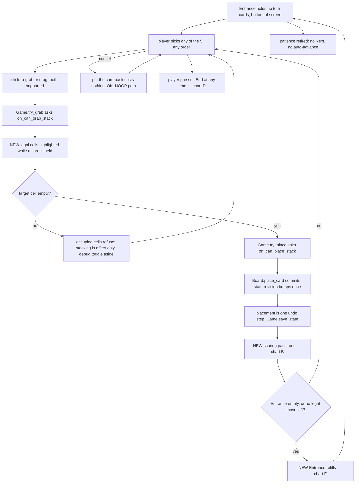
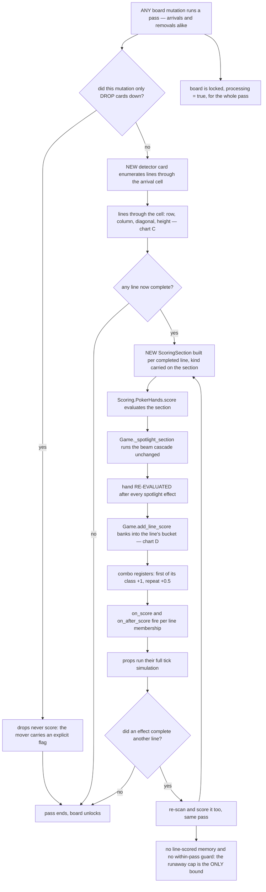
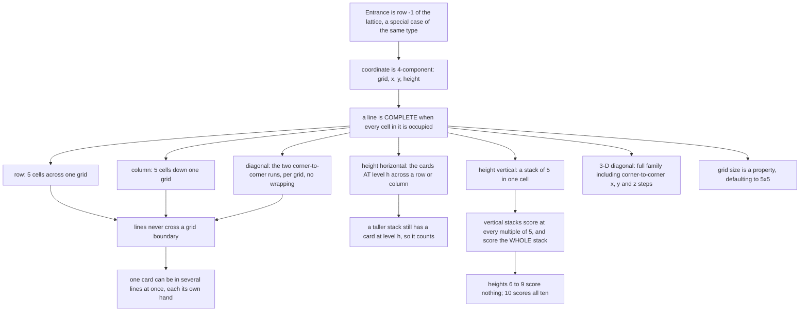
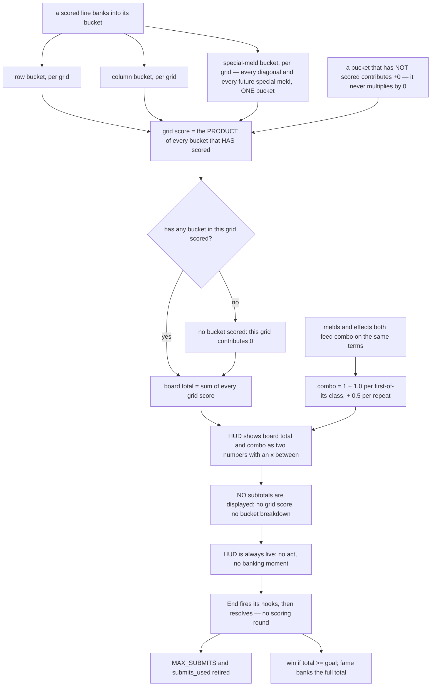
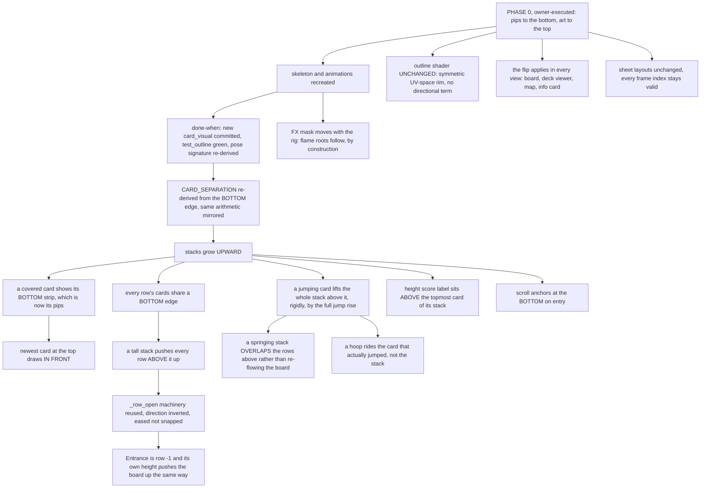
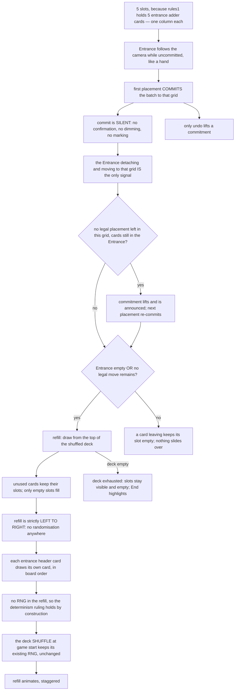
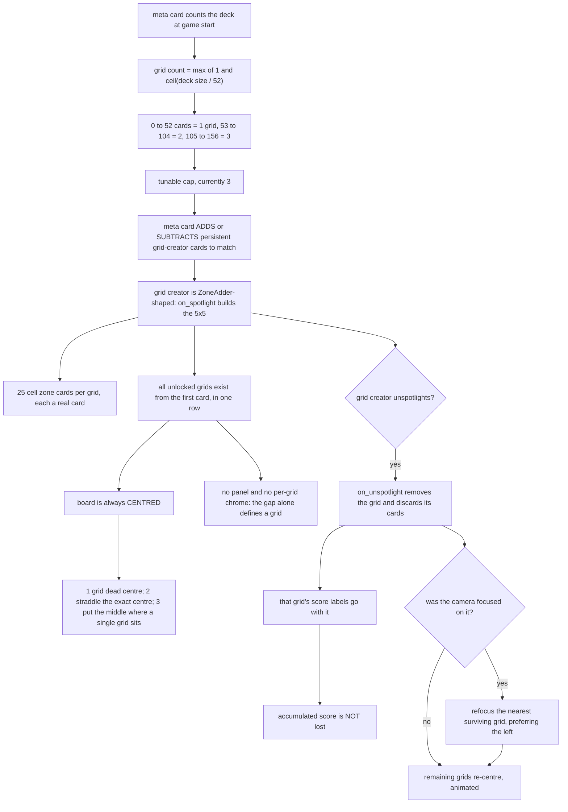

# Poker Patience — the 5×5 grid core-gameplay overhaul, design v2

The board stops being a Klondike/Canfield tableau and becomes a **Poker Squares grid**. Cards are
placed by hand into a 5×5 lattice, every completed row / column / diagonal scores the instant it
fills, several grids can be open side by side, and cards may stack upward into a fourth
coordinate — height — which scores its own lines.

**Version 2. Nothing here is implemented. Nothing here is decided except where it says so.**

## Changelog — what v2 changed, and what you are asked again

**The card is being flipped.** Pips move to the BOTTOM of the card and the art / talent to the TOP,
so cards stack **upward** instead of downward. You are doing that work yourself as **Phase 0** — pip
placement, skeleton, animations — and the code follows. §1o is the audit of what that touches.

⚠ **Nothing you answered has been thrown away.** Five questions are **retired in place** because your
decision settled them outright, seven had their wording re-derived for the new direction **without
changing a single option letter**, so every recorded answer still means what you chose:

| Retired (settled by your decision) | Was |
|---|---|
| `Q72` | stacks grow down → now **up** |
| `Q74` | cards share a top edge → now a **bottom** edge |
| `Q108` | column labels above → now **below** the grid |
| `Q111` | height label below the stack → now **above** it (contract moved to `Q309`) |
| `Q247` | cell outline at the top of its band → now the **bottom** |

**Re-derived wording, same letters, no re-ask:** `Q2`, `Q39`, `Q41`, `Q73`, `Q77`, `Q113`, `Q225`.

**You are asked exactly TWO things again**, because only these two had their option set change:

- **`Q4`** — your recorded answer (a) says *"a 52-card deck gets 2"*; your later message says 0–52 is
  **one** grid. Those are different formulas. A new option **(d)** states your table exactly and is
  now the default.
- **`Q13`** — gained an option for the centring rule you described (1 grid centred, 2 straddling the
  exact centre, 3 with the middle grid where a single grid sits).

**New: §28**, twelve questions covering what the flip actually opens — the `CARD_SEPARATION`
re-derivation, the spring propagation up a stack, draw order, scroll anchoring, and the rig/FX-mask
consequences — plus `Q318`, the grid-refocus case you spotted that nothing in v1 covered.

---

## 0. How to review this document

- **You review by answering questions, not by writing design.** If you finish the questionnaire and
  still have to tell me "you forgot to ask about X", that is a defect in this document and I want
  to hear it.
- **Every question has an ID** (`QR1`, `Q47`). They are stable forever; I never renumber.
- **Every question has a `*default*`.** "Default" is a complete answer — waving a question through
  is a legitimate move and is recorded as unreviewed rather than as agreement.
- **Every question also offers free text and "not relevant"** even though neither is written on the
  line. If none of the options is what you want, say so in your own words.
- **Every question carries a gate** in backticks — the condition under which it is asked at all.
  `[root]` means always. `[QR2=b]` means only if you answered QR2 (b). Answering a root question
  can prune fifty downstream questions in one click.
- **Questions marked ⚑gate change the path.** Their options each say what follows, because at those
  questions you are choosing a route, not just an answer. If you answer one in your own words the
  round stops there and I author the new branch before you continue.
- **Questions marked ⚑contract** fix a literal — a default, a bound, a name, a schema — that gets
  written into the implementation plan verbatim.
- **Answers are revisitable.** Go back and change any answer; answers stranded on an abandoned
  branch are marked inactive, never deleted, and come back if you return to that branch.
- **The flowcharts now exist — §29 to §36 — and reviewing them is what you do next.** They were
  written from your 314 answers, after the round, because a chart drawn before the answers is a
  guess with an ID on it. **Review by node ID** (`D6`, `E9`, `G17`); every node states a decision,
  never a question. Confirming the charts is what produces the implementation plan; nothing is
  built until you do.

⚠ **Honest note on path length.** The root forks mostly default to *include this*, because that is
what the braindump asks for. So the all-defaults path is close to the longest path — the DAG saves
you time when you decide to **cut** something (`QR1`=(c) removes §9 and §19; `QR2`=(b) removes §13
and §14; `QR8`=(b) removes §22), not when you accept every default.

**Measured, not estimated: 313 live questions, and the all-defaults path is 293.** Accepting every
default therefore saves you almost nothing. `QR2`=(b) (one grid) takes it to 214, `QR1`=(c) (flat
board, no height) to 243, and the two together to well under 200. `QR4`, `QR5` and `QR6` are
*contract* forks and prune essentially nothing — do not expect them to shorten the round. Full
table in §25.

If the length is the problem, those two roots are the lever — and **"not relevant" on any question
records its default and marks it unreviewed**, which is a legitimate way through.

---

## 1. Audit facts — what the code actually does today

Everything downstream cites this section. Every claim was read from source at the line given, not
from a doc.

### 1a. The board is TWO zones of columns, and the coordinate is already a `Vector3i`

`GameData` (`Scripts/game_data.gd:180-186`) holds the whole board as four arrays:

```
upper_zone_type : Array[CardData]        the Entrance row's header cards
upper_zone      : Array[ArrayCardData]   one entry per Entrance column
lower_zone_type : Array[CardData]        the play board's header cards
lower_zone      : Array[ArrayCardData]   one entry per play column
```

A board coordinate is `Vector3i(x, col, row)` where **x is which zone** (0 upper / 1 lower),
`col` is the column index and `row` is the depth into that column; a zone/type header is `row == -1`
(`game_data.gd:_scan_positions`, `Scripts/board.gd:locate`). `Vector3i.MIN` means "not on the board".

⚠ **So the existing coordinate already has three components, but its first component is the ZONE,
not a grid index.** The braindump's proposed *(grid, x, y, height)* is a four-component coordinate
whose first component means something the existing `x` does not. This is the largest structural
decision in the overhaul, and §5 asks about its behavioural consequences directly.

`GameData.position_of()` (`game_data.gd:198-203`) is an O(1) lazy index rebuilt whenever `revision`
moves; `_scan_positions()` (`:211-225`) is the full rescan and `validate()` (`:246`) is the
invariant checker. Any new container has to appear in **all three**, plus `all_card_datas()`
(`:236`).

### 1b. Every board mutation goes through `Board` and bumps `revision`

`Scripts/board.gd` carries a "MUTATION GUIDELINES" block that is the authoritative statement of the
rule: never write the zone arrays directly; mutate only through `Board.move_stack` / `place_card` /
`add_column` / `remove_column`, or `Game.draw_card` / `discard_data` / `add_deck` / `shuffle_deck` /
`return_to_map`; leave the state consistent FIRST, then bump `state.revision` exactly once. The
bump's setter emits `board_changed`, which drives the UI rebuild and invalidates both the position
index and the comparator cache (`game_data.gd:11-15`).

`Board.move_stack` (`board.gd:126`) is a four-phase move — resolve, validate, mutate, then Game
fires events — and destinations are **anchors** (`Board.Anchor`: `ON_TOP(card)` /
`COLUMN_END(x,col)` / `COLUMN_START(x,col)`), never indices, so extraction cannot invalidate the
destination.

⚠ **`Anchor.ON_TOP` is the closest existing thing to "place this card on top of that one", which is
exactly what a height stack is.** It already exists and already works. §9 asks whether height
stacking reuses it.

### 1c. Scoring today runs ONCE, at Submit, over rows then columns

The chain, end to end:

1. `GameView` Submit → `Game.submit()` (`Levels/game.gd:714`) → `_perform_submit()` (`:724`).
2. `_perform_submit` runs `run_all_mods(&"on_run_scorer")`.
3. The only implementer is `SkillScorerCascadeLower`
   (`Cards/Skills/Rules/skill_scorer_cascade_lower.gd`), a rules card. It walks **the lower zone
   only**: every row top-down until a row is empty, then every column left-to-right, dispatching
   `on_score_row` / `on_score_col`.
4. `SkillEvalPokerBest` (`Cards/Skills/Rules/skill_eval_poker_best.gd`) implements both, collects
   the line's cards, calls `Scoring.PokerHands.score()`, and hands the best result to
   `Game.score_line(result, is_row, zone, index)` (`game.gd:821`).
5. `score_line` builds a `ScoringSection`, runs the spotlight cascade over it, **re-evaluates the
   hand after every spotlight effect has fired**, banks the amount through `add_line_score`
   (`:947`) into `state.row_total` / `state.col_total` and the matching `BigNumber` gutter, and
   registers the combo class.
6. `_perform_submit` then calls `state.apply_act_score()` (`game_data.gd:117`), which is where the
   act payout is computed.

⚠ **The whole scoring engine below `score_line` is shape-agnostic already.** `ScoringSection`'s own
doc comment says so outright: *"Rows and columns are the only shapes today; a future scorer may
evaluate a diagonal, several rows at once, or an arbitrary set, and NOTHING that consumes this may
assume otherwise."* `ScoringSection.of_line()` takes a `_recollect` Callable, so a diagonal or a
height line is a new **collector**, not a new scorer. **This is the single biggest thing the
overhaul does not have to build.**

⚠ **But `score_line`'s SIGNATURE is row/column-shaped** (`is_row: bool`, `zone: Array`,
`index: int`), and `add_line_score` branches on `is_row` to pick `row_total` vs `col_total`. Four
line KINDS cannot be expressed in a bool. §8 and §11 ask about this.

### 1d. The act payout is `row_total × col_total × combo`, banked once per Submit

`GameData.apply_act_score()` (`game_data.gd:117-133`):

```
base       = row_total * col_total        (or row_total + col_total when score_additive)
mult_score = int(base * combo_mult())
total_score += mult_score
row_total = 0 ; col_total = 0 ; combo_classes.clear()
scores_row_upper / scores_row_lower / scores_col all cleared
```

`combo_mult()` (`:112`) is `1.0 + SettingsManager.settings.combo_step * combo_classes.size()`, and
`combo_step` ships at **0.1**. `U` = distinct meld CLASSES scored this act **plus** distinct mod
effects on their first activation this act (ARCHITECTURE_REVIEW §3a).

⚠ **Two collisions with the braindump, both real:**

- *"each effect trigger adds +1 to mult by default"* is **not** what ships. What ships is +0.1 per
  distinct class, once per class per act; a duplicate class adds nothing at all. §12 asks whether
  that sentence is a change you want or a loose restatement of the existing rule.
- **`R × C` pays 0 unless BOTH a row and a column scored.** With rows, columns, diagonals and
  height lines all banking continuously, "which bucket does a diagonal go in" decides whether
  diagonals can pay at all. §12.

`MAX_SUBMITS := 3` (`game.gd:83`) — a show is three acts today, and `submits_used` lives on
`GameData` so undo rewinds it.

### 1e. The Entrance row drops down on Next, and Next is the only refill

`TypeInput` (`Cards/Types/type_input.gd`) is the Entrance column header's modifier. Its `on_next`
does exactly two things: `drop_card()` moves the Entrance column's bottom card to the END of the
**same-indexed** lower column (`Vector3i(1, col, -1)`), then `draw_card()` pops one card off
`draw_deck` and `Board.place_card`s it back into the Entrance column.

So today: upper column *i* is hard-paired to lower column *i*, one card falls per column per Next,
and the refill is strictly **one card per column, left to right, one per act**.

`Deck._build_rules1()` (`Decks/deck.gd:57-79`) builds `rules1`: **5** `SkillAdderInputUpper`,
**6** `SkillAdderInputLower`, and one each of `SkillGrabberOgLower`, `SkillPlacerOgLower`,
`SkillScorerCascadeLower`, `SkillEvalPokerBest`. The 5/6 asymmetry is where "5 entrance cards,
6 play zones" comes from.

`ZoneAdder` (`Cards/Skills/Rules/zone_adder.gd`) is the whole zone-creation mechanism: `on_spotlight`
appends a header + empty column via `Board.add_column`; `on_unspotlight` removes the column and
discards its cards. **A rules card whose lifetime owns a set of board columns is exactly the shape
the braindump's "5×5 grid creation card" needs**, and it is 30 lines long.

### 1f. Grab and place are rules-card decisions, not hard-coded

`Game.try_grab` (`game.gd:340`) asks `on_can_grab_stack`; `Game.try_place` (`:348`) asks
`on_can_place_stack`. Both return an `Array[CardData]` — empty means "no". The only implementers are
`SkillGrabberOgLower` / `SkillPlacerOgLower` (the Klondike run rule) and `TypeInput`
(`on_can_place_stack`: you may drop onto an Entrance header when it is topmost).

⚠ **So "a placed card cannot be moved or stacked on" is achieved by REMOVING rules cards, not by
adding a lock.** With no implementer the answer is already "you cannot".

Player drops call `move_data_ontop_data(..., trigger_mods = false)` — an owner ruling in
ARCHITECTURE_REVIEW §8: `on_card_dropped_on` / `on_stack_cards` fire **only from automated moves**.

### 1g. `CardDataIterator` walks collections in a fixed order, ROW-MAJOR inside a zone

`Game.get_card_collections()` (`game.gd:228-237`) returns, in order:
`draw_deck`, `upper_zone`, `lower_zone`, `discard_deck`, `upper_zone_type`, `lower_zone_type`,
`rules_deck`.

`CardDataIterator` (`Scripts/card_data_iterator.gd`) walks a 2-D collection **row-major**: row 0
across every column, then row 1, stopping when a whole row is empty. This order is load-bearing —
ARCHITECTURE_REVIEW §8: *"First-implementer-wins mod dispatch precedence depends on board order."*

⚠ **The braindump's proposed order differs from today's in TWO ways, not one:** it puts input cards
first (today `draw_deck` is first and the Entrance second), and *"left slot in first row, going down
rows"* reads as **column-major**, the opposite of today's row-major. §17 asks about both.

### 1h. The play area is an HBox of VBoxes, and its geometry is PURE MATH

`UI/play_area.tscn`: `PlayArea > SmoothScrollContainer > TopLevelVBox >` three `HSplitContainer`s —
`UpperZone` (row-score labels **left**, cards right), `MiddleZone` (column-score labels in the
**right** half), `LowerZone` (row-score labels left, cards right) — plus `CardLayer`, `PropLayer`,
`ParticleLayer`, `OverlayLayer` as `Node2D` siblings.

`PlayArea.set_card_zone` (`UI/play_area.gd:409`) builds one `VBoxContainer` per column, holding a
header control at child 0 and one control per card. `update_card_zone_visuals` (`:536`) sizes them:
every card control is `card_size_play.x × card_separation_play_custom` (a thin strip) **except the
LAST child of each column**, which is a full `card_size_play`.

`slot_center_global(v)` (`:328`) is **pure math, no control-rect reads** (an explicit owner spec):

```
x = hbox.x + col * (card_width + separation) + card_width/2
y = hbox.y + separation + row * (card_separation_play_custom + separation) + card_height/2
    + _row_open_offset(zone_x, row)
```

⚠ **`_row_open` / `row_open_extra` / `_row_open_offset` (`:34-115`) ALREADY implement "a row grows
taller and every row below it shifts down".** They exist for the spotlight reveal, they are keyed by
`(zone_x, row)`, they are eased per frame, and `slot_center_global` already adds the accumulated
offset so props stay anchored. **The braindump's height-stack row shift is that same mechanism with
a different height source.** §9 asks whether it reuses it.

⚠ Two rules inside that machinery that a height-driven version must decide about explicitly: a row
that **covers nothing** does not open at all (`_row_covers_anything`, `:101`), and the strip must
subtract the container's own `separation` or the opening overshoots by one gap.

### 1i. Measured geometry — the numbers the layout questions depend on

From `Cards/card_visual.gd:9-42` and `Scripts/player_settings.gd:27-36`:

| Quantity | Art units | Screen px at `card_scale` = 2.5 |
|---|---|---|
| `CARD_ART_SIZE` | 38 × 52 | — |
| `CARD_SIZE` (art + outline rim) | 40 × 54 | `card_size_play` = **100 × 135** |
| `CARD_SEPARATION` (visible strip of a covered card) | 16 | `card_separation_play` = **40** |
| `PlayArea.separation` | 4 | **10** |
| `CARD_JUMP_RISE` = `CARD_SIZE.y / 5` | 10.8 | `card_jump_rise_play` = **27** |

Derived:

- **column pitch** = 100 + 10 = **110 px**; **stacked row pitch** = 40 + 10 = **50 px**.
- **One 5×5 grid, every cell one card deep** = 5·100 + 4·10 = **540 px wide**, and
  5·135 + 4·10 = **715 px tall** (every cell showing a whole card, not a strip).
- **Three grids side by side** at 540 px with a buffer *b* = 1620 + 2*b* px. At *b* = 200 that is
  **2020 px**.
- **A cell holding a stack of *k*** is 135 + (*k*−1)·40 px tall. At the braindump's test ceiling of
  ***k* = 15** that is **695 px for one cell**, so a grid whose every row sits at *k*=15 is
  5·695 + 4·10 = **3515 px tall**.

⚠ **That last number is the one that bites.** See §1m′ row 1.

### 1j. The game screen is a picture on the wall, and its size is authored in one resource

`Assets/Wall/layout_default.tres` holds six `PictureEntry` resources (`start_menu`, `book`, `map`,
`deck`, `game`, `settings`). **Not one of them overrides `design_size`**, so all six run at
`PictureEntry`'s default `Vector2i(1152, 648)` (`Scripts/Wall/picture_entry.gd:22`).

`WallPicture.build()` (`UI/Wall/wall_picture.gd:107-135`) creates a `SubViewport` sized to
`entry.design_size`. `focus()` (`:220`) sets `viewport.size = _design_size` and CLEARS
`size_2d_override`. `unfocus(footprint_px)` (`:246`) sets `viewport.size` to the on-screen footprint
and puts `_design_size` into `size_2d_override` with `size_2d_override_stretch = true`, so an
unfocused picture renders cheap but still LAYS OUT at design size.

`WallPicture.focused_scale(native, window, overfill)` (`:389`) returns
`max(window.x/native.x, window.y/native.y)`, times the overfill margin **only when the two ratios
differ**. That is a FILL, so:

⚠ **A wide picture focused in a 16:9 window ALREADY shows only a slice of itself, with no new code.**
At `design_size` 2020 × 800 in a 1920 × 1080 window: `x_ratio` 0.95, `y_ratio` 1.35, fill = 1.35,
and the window sees 1920 / 1.35 = **1422 px of a 2020 px-wide picture**. The braindump's *"the camera
is technically viewing only a portion of the total wide screen"* is the engine's existing behaviour.

`Main.enter_game()` (`Levels/main.gd:651`) attaches a fresh `GameView` into the `game` picture as a
`live_screen`; `game_ended()` detaches it. The `game` entry has **no `scene`**, by design.

### 1k. The wall's pan exists, but only in WALL VIEW, and there is no per-picture pan

`Wall.pan_by()` (`UI/Wall/wall.gd:489`) and `clamp_pan()` (`:499`) drive the camera by a pointer
delta, clamped to `_wall_extent()` — the union of every packed picture's frame rect. It is armed
only by a left-press on **bare wall in wall view** (`wall.gd:200-215`), and `clamp_pan` collapses to
the extent's centre on any axis that already fits.

**A focused picture has exactly ONE resting camera pose.** `WallPicture.resting_state()` (`:405`)
returns `{position: rect.centre, zoom: focused_scale(...)}` (or the info pose). Every mover aims at
it. There is no notion of "where in this picture the player had scrolled to".

⚠ **So the braindump's *"picture wall transition logic needs to be able to respect and save where
you have currently scrolled to in the picture and treat that as moving camera in real space"* is a
genuinely new concept**: `resting_state` becomes a FAMILY of poses along the picture's width, and
the saved one is per-picture state the transition must read on the way in and write on the way out.
§14 is entirely about this.

⚠ And PICTURE_WALL.md's landmine list already warns that **`focused_scale()` applies its margin only
when the aspects DIFFER**, deliberately, so that "everything visible means panning is off" is an
exact zero. A wide picture makes the aspects differ *always*, which switches that margin permanently
on. §14 asks.

### 1l. Input routing, and the buttons the braindump wants are already taken

`Wall._unhandled_input` (`wall.gd:148`) gives the **focused screen first refusal** through
`WallInput.route()` (`Scripts/Wall/wall_input.gd:12`), which transforms the event into the
SubViewport's pixel space and `push_input`s it. Only if the screen did not consume it does the wall
act.

The wall's own bindings (`project.godot [input]`, read at `wall.gd:250-273`):

| Action | Bound to | Means |
|---|---|---|
| `wall_overview` | Tab / Select-View | go to wall view |
| `wall_back` | **`[` / L1** | Back through the focus stack |
| `wall_forward` | **`]` / R1** | Forward through the focus stack |
| `wall_info` | I / Y | toggle info mode |
| `wall_jump_1..9` | 1–9 | jump to the Nth picture |
| `ui_cancel` | Esc / B | Back |

⚠ **The braindump asks for *"back buttons with controller"* to pan between grids. L1/R1 are already
Back/Forward on the wall.** The game screen gets first refusal, so it *can* eat them — at the cost
of making wall Back/Forward unreachable while a show is open. §15 asks.

⚠ **Touch:** `input_devices/pointing/emulate_mouse_from_touch` is **not set in `project.godot`**, so
it sits at the engine default of **true**. A one-finger drag therefore arrives as
`InputEventMouseMotion` *and* as `InputEventScreenDrag`; the wall's own pan reads the mouse form and
its `PinchTracker` (`wall_input.gd:65`) reads the touch form for two fingers. A new one-finger swipe
reader inside the game screen must pick ONE form or it fires twice. See §1m′ row 4.

### 1m. Testing, determinism, and the rulings this overhaul collides with

- **`Deck.deck4` is already a full standard 52** (`Decks/deck.gd:_build_deck4` — *"every suit at
  every rank 1-13, all plain"*). ✅ The braindump's *"create a test deck of standard 52 card setup if
  it doesnt exist already"* **is already done — do not build it.**
- **`Deck.get_deck()` returns `deck14`, a 20-card deck** calibrated against the §15b goal curve. At
  the braindump's "one grid per 25 cards" that is **zero grids**. §5 asks what the floor is.
- ⚠ **ARCHITECTURE_REVIEW §8: *"Deterministic Submit/Next is load-bearing for pending-action replay
  AND prop-side hashing — do not introduce RNG into act resolution."*** The braindump's *"placement
  should be randomized instead of current going left to right"* puts RNG in exactly that path.
  `RunState.pending_action` (`Scripts/run_state.gd:44`) replays an interrupted action from the
  committed pre-action board, so a re-rolled fill on resume would hand the player a different board.
  §18 asks how this is squared.
- ⚠ **§8 B10: `run_all_mods` iterates LIVE collections mods may mutate — so no board mutations from
  broadcast hooks; defer them.** Scoring-on-placement means a scorer runs while the player's move is
  still resolving. §8 asks where the scorer is invoked from.
- ⚠ **§8 N8: score arrays never shrink on zone removal** — deliberate, so scores are never lost. A
  grid being removed (its creator card unspotlighting) inherits that rule. §16 asks.
- ⚠ **§8: `Game._restore_pre_act_board` deliberately does NOT unlink the doomed state**, and
  `_act_cancellable` brackets exactly the `on_run_scorer` / `on_next` window. If scoring moves out
  of those two windows, the act-cancel model has no bracket. §18 asks.
- The suite is 31 suites and runs **WINDOWED** (`Tools/run_tests.py`); a test that cannot run under
  the current renderer FAILS with a reason, never skips (owner ruling).

### 1o. THE CARD IS BEING FLIPPED — what that actually touches

**The decision (owner, v2):** pips move to the BOTTOM of the card, art / talent to the TOP, so a
stack grows **upward** and a covered card shows its rank / suit rather than its art. **Phase 0 is
owner-executed** — pip placement, skeleton, and animations — and no code phase may begin against
the old art.

⚠ **This is what makes your own `Q71` answer true.** You answered *"lower heights get covered,
showing only the rank/stamp/suit, and talent/skill becomes inactive"* — which is only possible with
pips at the bottom and stacks growing up. The flip is not a new idea bolted on; it is the premise
that answer already assumed.

**The outline shader is NOT affected.** `Shaders/outline.gdshader` draws an 8-directional symmetric
rim and taps in UV space via `TEXTURE_PIXEL_SIZE` — its own rule 2, which exists so the rim rides
skinning deformation rather than holding constant screen thickness. It has no notion of up or down.
Moving a pip polygon moves a polygon; the rim follows the art, and a re-baked skin keeps a correct
rim automatically **provided the new skin still weights all five polygons** (face, rank pip, suit
pip, stamp, art).

**Four things ARE affected, and the first is load-bearing:**

1. ⚠ **`CardVisual.CARD_SEPARATION = 16` is derived from the pip row's distance from the card's TOP
   edge.** Its own comment states the arithmetic: *"the outlined pip row now ends 14 units below the
   card's top edge (4 of margin + a 10-unit outlined pip), and 14 + 2 of clearance for the idle rig
   = 16."* With pips at the bottom that derivation must be redone **from the bottom edge**, or the
   visible strip of a covered card shows the wrong band. It is a `⚑contract` number and it sets the
   whole board's row pitch (§1i: strip 40 px + separation 10 px = 50 px). `Q306` fixes it.
2. ⚠ **The FX mask is RIG-derived, not alpha-derived.** `CardVisual._ready` hands `fx` the star
   rig's arm tips, and the code warns explicitly against reading it from alpha instead, because
   alpha *"cannot say where it went when `Arm_TopLeft` swings out 26 %"*. A recreated skeleton moves
   the mask, so fire / glow / juggle roots move with it.
3. ⚠ **`Tests/Visual/test_pixels` carries a documented deformed-pose signature that comes from the
   current rig** — worst edge/corner **0.00/0.00 at t=0.00, 0.48/1.21 at t=0.15, 1.50/2.45 at
   t=0.30**. A new rig changes those numbers. They must be **re-derived, not "fixed"**; all-zero
   everywhere means the rig stopped moving and the test is measuring the rest pose four times.
4. ⚠ **`UI/Fx/fx_fire_style.gd` uses `CARD_SEPARATION * 0.5 = 7`** so that *"the flames never reach
   the card behind and cover it"*. Post-flip "the card behind" is the card **above**, so that
   clearance reasoning inverts along with everything else.

**And one coupling the spring animation lands on:** `CARD_JUMP_RISE = CARD_SIZE.y / 5` is read by
`PropVisual.rides_card_jump` so a hoop's centre coincides with a jumping card's. If a jumping card
lifts the stack above it, every card in that stack is at a different height and the hoop can only
ride one of them. `Q311` decides which.

**Measured blast radius on the suite: 5 of 39 suites**, by grepping for actual geometry / rig
coupling rather than by name — `UI/test_visual_layers` (59 references, and it contains
`test_the_reveal_opens_a_row_and_moves_the_slots_below_it`, a literal direction assertion),
`UI/test_ui_props` (44), `Visual/test_pixels` (6), `Visual/test_outline` (2), and
`Interaction/test_interaction` (5 PlayArea references). The other 34 are headless logic — scoring,
board, iterator, comparator, map, and all eight wall suites — with **zero** coupling to card
geometry. (`all_tests.tscn` holds 39 suites; `START_HERE.md` still says 31.)

### 1n. What ALREADY EXISTS that the braindump asks to build

Stated plainly, because each of these is a question that should never be asked:

| Braindump asks for | Already exists |
|---|---|
| "a bow animation or jump animation" for cards | `CardVisual.anim_jump()`, driven by `PlayArea.popup_meld` |
| "a test deck of standard 52 card setup" | `Deck.deck4` |
| "rows below shift down to accommodate" | `PlayArea._row_open` / `row_open_extra` / `_row_open_offset` — eased, already summed into `slot_center_global` |
| scoring an arbitrary set of cards, not just a row | `ScoringSection` + `Scoring.PokerHands.score()` — shape-agnostic by contract |
| "a card that owns zones and discards them when inactive" | `ZoneAdder` |
| a camera showing only part of a wide screen | `WallPicture.focused_scale()`'s fill semantics |
| per-line score accumulators that survive save/load | `GameData.scores_*` + `pack_scores` / `unpack_scores` |
| a bounded, smoothed pan camera | `Camera2D.limit_*` + `position_smoothing_*` (§1m′ row 3) |

---

## 1m′. Engine capability audit

One row per engine capability this design leans on. **Nothing here comes from memory or from
grepping the repo** — every row cites the doc or issue it was read from.

| # | Capability the design leans on | Verdict | Source |
|---|---|---|---|
| 1 | A `SubViewport` can be made arbitrarily large to hold a wide or tall board | ⚠ **CONTRADICTED.** Godot does **not** validate `SubViewport.size` against the GPU's maximum texture size. Over the limit the Compatibility renderer reports *"internal FrameBuffer not being ready"*, the framebuffer is destroyed and the size is internally set to 0 — **while the GDScript property still reports the oversized value**, so the failure is silent from script. Modern GPUs cap around 16k; **older GPUs cap at 4096**. This project ships `rendering_method="gl_compatibility"` (`project.godot:163`). §1i's 3515 px worst case is inside 4096, but only just, and *"no limit on height for now"* walks straight past it. | [godot#103181](https://github.com/godotengine/godot/issues/103181) |
| 2 | `size_2d_override` + `size_2d_override_stretch` let a viewport render at one resolution while laying out at another | ✅ confirmed — *"The 2D size override of the sub-viewport. If either the width or height is 0, the override is disabled"*; *"If true, the 2D size override affects stretch as well."* Already used by `WallPicture.update_wall_view_size()`. **This is the lever that decouples board size from render cost.** | [SubViewport docs](https://docs.godotengine.org/en/latest/classes/class_subviewport.html) |
| 3 | `Camera2D` can be bounded and smoothed for a snap-to-grid pan | ✅ **already exists — do not build a pan clamper.** `limit_left/right/top/bottom` (defaults ±10 000 000) with `limit_enabled` and `limit_smoothed`; `position_smoothing_enabled` + `position_smoothing_speed` (*"Speed in pixels per second of the camera's smoothing effect"*); `drag_*_margin`; and `align()`. | [Camera2D docs](https://docs.godotengine.org/en/latest/classes/class_camera2d.html) |
| 4 | A one-finger swipe can be read without double-firing | ⚠ **CONTRADICTED as stated.** With `emulate_mouse_from_touch` at its default of true — and this project does not set it — a touch produces **both** `InputEventScreenDrag` and `InputEventMouseMotion`, so a naive reader fires twice. The documented fixes are to turn the setting off project-wide (which would break the wall's own one-finger pan at `wall.gd:212`) or to filter emulated events by `event.device == -1`. **A new swipe reader must use the device filter, not a project-setting change.** | [Godot forum](https://forum.godotengine.org/t/inputeventscreentouch-and-inputeventscreendrag/58691), [write-up](https://bugnet.io/blog/fix-godot-input-event-screen-touch-fires-mouse-as-well) |
| 5 | `GridContainer` gives a 5×5 grid whose rows all share the tallest cell's height | ✅ exists — *"arranges its child controls in a grid layout"*, `columns` is fixed, and each child's `custom_minimum_size` determines the row height / column width. ⚠ **But it aligns rows only WITHIN one container.** Two `GridContainer`s side by side derive their row heights independently, so *"row 1 across all grids at the same y level"* is **not** something the container gives you. §19 exists for exactly this. | [GridContainer docs](https://docs.godotengine.org/en/latest/classes/class_gridcontainer.html) |
| 6 | A seeded RNG can make a randomised Entrance fill replay identically | ⚠ **QUALIFIED.** `RandomNumberGenerator` reproduces a stream from a seed and can save/restore `state`, and the docs name replay systems as the use case — **but** *"The underlying algorithm is an implementation detail… it should not be depended upon for reproducible random streams across Godot versions."* A seeded fill therefore replays within a session and within an engine version, and a save carried across an engine upgrade could refill differently. §18 asks whether that is acceptable, or whether the fill must be part of the committed snapshot instead. | [RandomNumberGenerator docs](https://docs.godotengine.org/en/stable/classes/class_randomnumbergenerator.html) |
| 7 | The engine can pause one screen while another runs | ✅ exists and **is already in use.** `SceneTree.paused` is global and `Node.process_mode` is per-node; `Wall._ready()` pauses the whole tree permanently and `focus()` / `unfocus()` flip each screen root between `PROCESS_MODE_ALWAYS` and `PROCESS_MODE_PAUSABLE` (`wall_picture.gd:220-260`). **Do not design a second pause model.** | [Pausing games](https://docs.godotengine.org/en/latest/tutorials/scripting/pausing_games.html) |
| 8 | Flipping the card art leaves the outline shader correct | ✅ confirmed by reading the shader: it is an 8-directional symmetric rim tapping in UV space via `TEXTURE_PIXEL_SIZE`, with no directional term anywhere. Its rule 2 exists precisely so the rim rides skinning rather than screen space, which is what makes a re-baked skeleton safe. **Do not redesign the outline for the flip.** | `Shaders/outline.gdshader` header rules 1–5; `Cards/card_outline.gd` |
| 9 | A re-baked skeleton leaves the FX mask correct | ⚠ **CONTRADICTED.** The mask is geometry-derived from the rig's arm tips, deliberately — reading it from alpha is called out in-code as the wrong fix because alpha cannot describe the deformed pose. A new rig therefore moves every flame root, and `test_pixels`' pinned deformed-pose signature must be re-derived rather than repaired. | `Cards/card_visual.gd:15-28`, `:54` |

---

## 2. The state model

The independent facts this feature introduces, and where each lives. **Structure is mine to fill in;
you answer behaviour and appearance.** Where a structural choice has a behavioural consequence, the
question below asks about the consequence, not the structure.

| Fact | Nature | Home | Why there |
|---|---|---|---|
| Which grids exist, and their left-to-right order | persisted | `GameData` | undo must rewind a grid appearing or disappearing |
| A cell's stack of cards, bottom → top | persisted | `GameData` | it is the board |
| A card's 4-D coordinate *(grid, x, y, h)* | **derived** | the position index | never stored twice — §1a's index is the one home |
| Which grid the Entrance is committed to | persisted | `GameData` | undo must rewind a commit; `submits_used` and `patience` set the precedent |
| The Entrance's five slots and their cards | persisted | the existing `upper_zone` | already exists |
| Per-line banked score (row / col / diagonal / height) | persisted | `GameData.scores_*` + packed arrays | already the pattern; `BigNumber` needs the pack/unpack dance |
| Which lines have already scored | **see §8** | — | a real fork, not a structural detail |
| How far each row is pushed down | **derived** | `PlayArea` | derived from stack depths; §1h's `_row_open` is the precedent |
| Which grid is focused / where the camera is | view + session | per-picture pan (§14) | must survive leaving and re-entering the show |
| Zoomed-out vs single-grid view | view only | `GameView` | nothing to rewind |
| The RNG stream for Entrance refills | persisted **or** derived | §18 decides | the determinism ruling forces the question |

---

## 3. Every usage — one row per situation this feature can be in

⚠ **If a usage is missing from this table, that is the most valuable thing you can tell me.** Before
the first answer round there are no flowcharts to point at, which is the point: a usage with no
question is a hole.

| # | Situation | Covered by |
|---|---|---|
| U1 | First card of a show placed into an empty grid | §6 |
| U2 | A placement completes a row | §8 |
| U3 | A placement completes a row AND a column at once | §8 |
| U4 | A placement completes a row, a column and a diagonal at once | §8, §10 |
| U5 | A placement completes nothing | §8 |
| U6 | The 25th card fills a grid while Entrance cards remain | §7 |
| U7 | The Entrance empties and the deck has ≥ 5 cards | §7 |
| U8 | The Entrance empties and the deck has 1–4 cards | §7 |
| U9 | The Entrance empties and the deck is empty | §7, §20 |
| U10 | The deck is too small to unlock even one grid | §5 |
| U11 | The player presses End with the board half full | §20 |
| U12 | The player presses End with every grid full | §20 |
| U13 | A card is stacked onto an occupied cell (height 2) | §9 |
| U14 | A stack reaches height 5 — a vertical line of 5 in one cell | §9 |
| U15 | A stack reaches height 10 | §9 |
| U16 | A height-5 line forms across a row at height 3 | §9 |
| U17 | A card is removed from a stack and the cards above drop | §9 |
| U18 | A card is removed from a scored line and re-added | §8 |
| U19 | A card is moved 5 spaces left, landing in the next grid | §5 |
| U20 | One grid's row 2 grows tall; the other grids' row 2 does not | §19 |
| U21 | Zoomed-out view with 1 grid / 2 grids / 5 grids | §13 |
| U22 | Panning to the leftmost grid and pressing left again | §13 |
| U23 | Leaving the show mid-pan and coming back | §14 |
| U24 | Pressing the wall's Back while the game screen is panned | §14, §15 |
| U25 | The window is resized or goes fullscreen mid-show | §14 |
| U26 | Undo across a placement that scored three lines | §18 |
| U27 | Quitting mid-scoring, then resuming | §18 |
| U28 | Headless (`view == null`) — a whole show with no scene | §21 |
| U29 | A grid creator card unspotlights while its grid holds cards | §16 |
| U30 | Info mode entered on the game picture while panned | §14 |
| U31 | A spotlight cascade fires during a placement's scoring | §8 |
| U32 | Props spawned by a scored line while the player still holds a card | §8 |
| U33 | Touch: one-finger swipe inside the game screen | §15 |
| U34 | Controller: pan grids with no mouse present | §15 |
| U35 | Every cell at height 15 in every grid — the braindump's test ceiling | §21, §1m′ row 1 |
| U36 | The focused grid is removed while the camera is on it | §28, `Q318` |
| U37 | A card jumps at the bottom of a 6-high stack | §28, `Q310`–`Q312` |
| U38 | The Entrance itself holds a stack, pushing the grids up | §28, `Q313` |
| U39 | One grid, two grids, three grids — where each sits horizontally | §5, `Q13` |
| U40 | Phase 0 lands: new art, new skeleton, old code | §28, `Q315`–`Q317` |

---
## 4. § Root forks — answer these first

These eight decide which of the sections below you are ever asked about. Each says what it prunes,
and each option says what follows it.

- **QR1** `[root]` ⚑gate — Cards stacking on top of each other, adding a fourth coordinate (height), is the biggest single addition in the braindump. Is the whole height dimension — stacking, height-based lines of 5, rows shifting down to make room — in version 1, or does version 1 ship a flat 5×5 board first? · **(a)** full height in v1 — stacking, height lines, and the row shift all ship together — **→ next:** how a stack is built, what scores at height 5 vs 10, where a height score label goes, what happens when a card is removed from the middle of a stack, and how grids stay aligned when one grows tall · **(b)** stacking in v1 but NO height-line scoring — cards can sit on cards and the rows shift, but a vertical run of five scores nothing yet — **→ next:** the stack-building and row-shift questions only; every "what scores at height N" question is skipped · **(c)** flat 5×5 only in v1 — a placed card occupies its cell and nothing may go on top — **→ next:** nothing about height at all; §9 and §19 vanish and the coordinate stays three-component · *default* (a) · notes ⇒ (c) skips §9 and §19 entirely
- **QR2** `[root]` ⚑gate — Multiple 5×5 grids side by side, unlocked one per N cards in the starting deck. Is that in version 1, or does version 1 ship exactly one grid? · **(a)** multiple grids in v1 — several grids side by side, with the panning, the zoomed-out view and the wide game screen that implies — **→ next:** how many, how they unlock, committing the Entrance to one grid, panning and snapping between them, the zoomed-out view, the wide picture on the wall, and cross-grid row alignment · **(b)** exactly one 5×5 grid in v1 — the screen stays roughly its current size and there is nothing to pan between — **→ next:** nothing about panning, the zoomed-out view, the wall's wide picture, or cross-grid alignment; the Entrance never has to choose a grid · *default* (a) · notes ⇒ (b) skips §13, §14, §19 and most of §7
- **QR3** `[QR2=a]` ⚑gate ⚑contract — Where does moving between grids actually happen? The braindump says *"treat that as moving camera in real space"*, which reads as the WALL's camera panning across one very wide picture. The alternative is that the game screen stays a normal-sized picture and does its own scrolling inside. · **(a)** the wall's camera pans over a wide picture — the game picture becomes several times wider than the window, and the wall camera's resting pose on it becomes a family of poses instead of one — **→ next:** how wide the picture is, how the saved pan survives leaving and re-entering, what the transition zooms out to, what Info mode does when you are panned, and what happens on a window resize · **(b)** the game screen scrolls internally, the wall is untouched — the picture keeps a normal `design_size` and a camera or scroll container inside `GameView` moves over a wide board — **→ next:** the in-screen camera's bounds and smoothing; §14 shrinks to "nothing about the wall changes" · **(c)** wall camera for the zoomed-out view, in-screen scroll for single-grid panning — the two view modes use different machinery — **→ next:** both sets, plus how the two hand over to each other · *default* (a) · notes — this is the fork with the largest implementation-cost difference; (b) is by far the cheapest and (a) is what the braindump literally describes
- **QR4** `[root]` ⚑gate ⚑contract — Today an act banks `row_total × col_total × combo` once, when Submit is pressed, and clears the per-line gutters. Scoring now happens continuously during placement, and the braindump says the End button *"simply triggers whatever hooks are tied to it, then game ends without a scoring round"*. What is the payout model? · **(a)** each line banks straight into the running total the moment it scores — the HUD total is always current, there is no end-of-show multiply, and `row_total`/`col_total` become display-only accumulators — **→ next:** what the running total does with the combo multiplier, what the per-line gutters mean now, and whether `apply_act_score` survives at all · **(b)** keep accumulating into row/col totals and multiply once, when End is pressed — the running HUD total is then a PREVIEW of the payout, not the payout — **→ next:** how a diagonal or a height line is bucketed into the R×C product, and what the HUD shows before End · **(c)** accumulate and ADD at End rather than multiply — the existing `score_additive` lever becomes the shipped model — **→ next:** the same bucketing questions as (b), minus the "both must be non-zero" trap · *default* (a) · notes — under (b) and (c) a diagonal that banks into neither bucket cannot pay at all, which is why the bucketing questions follow
- **QR5** `[root]` ⚑gate ⚑contract — The braindump says *"each effect trigger adds +1 to mult by default"*. What ships today is `1.0 + 0.1 × U`, where U counts DISTINCT meld classes and distinct mod effects on their first activation, so a repeat of the same effect adds nothing. Which is right? · **(a)** the shipped rule is right and the sentence was a loose restatement — `combo_step` stays 0.1 and U stays distinct-only — **→ next:** only what resets U now that acts are gone · **(b)** literally +1 per trigger, every trigger, repeats included — the multiplier becomes `1 + (number of effect activations)` and grows without a distinctness cap — **→ next:** what stops a re-trigger loop from running the multiplier away, and whether melds still contribute · **(c)** +1 per DISTINCT effect, repeats still free — the distinctness rule survives but the step becomes 1.0 instead of 0.1 — **→ next:** whether the goal curve is refit, since a ×2 at two classes is a very different game from a ×1.2 · **(d)** **YOUR ANSWER, promoted to an option so its subtree can be reached:** *"each grid gets its own row x col x diag = grid score; hud shows total grid score from each grid added together as left number, multiplied by the combo number on the right. Since gameplay has changed, lets have each unique effect add +1 the first time, and repeat non-unique effects worth 0.5, all tunables. hud always shows most updated scores."* — **→ next:** whether a grid with no scored diagonal pays zero, what the two tunables start at, what bounds a re-trigger loop, and how the HUD renders a live product · *default* (d) · notes — (b), (c) and (d) all invalidate the calibrated goal curve (`goal_g0 ≈ 130, ALPHA ≈ 4.2`); the refit question follows either way
- **QR6** `[root]` ⚑gate — The Klondike-style rules cards (`SkillGrabberOgLower`, `SkillPlacerOgLower`, `SkillScorerCascadeLower`, the six lower `SkillAdderInputLower`s) implement the old tableau. The braindump says *"Move cards that wont be usable anymore to an archive in case we want to reuse for future side game mode."* · **(a)** archived — pulled out of the default rules deck, files kept under an archive directory, not reachable in play — **→ next:** where the archive lives, what happens to a save that still holds one, and whether the tests that exercise them are kept · **(b)** kept live and selectable — both the tableau and the grid exist as modes the player or a deck can choose — **→ next:** everything in (a) plus how a mode is chosen, whether one state can hold both board shapes, and which rules cards are mutually exclusive · **(c)** deleted outright — no archive, git history is the archive — **→ next:** only the save-migration question · *default* (a) · notes ⇒ (b) adds a mode-selection sub-section to §16
- **QR7** `[root]` ⚑gate — *"5 long diagonals count"* reads as "diagonals of length 5", and later the braindump asks for exactly *"2 new score labels at corners for the 2 diagonals"* — so, in a flat 5×5, the two main corner-to-corner diagonals. With height added there are many more diagonal directions. What counts? · **(a)** the two main in-plane diagonals of each grid, and (if height ships) diagonals that also climb in height — **→ next:** which 3-D directions count, and which corner label a climbing diagonal updates · **(b)** the two main in-plane diagonals only — height lines are vertical and orthogonal only, never diagonal — **→ next:** nothing about 3-D diagonals; §10 is four questions long · **(c)** no diagonals at all in v1 — rows and columns only — **→ next:** nothing in §10, and the two corner labels are not built · *default* (a) · notes ⇒ (c) skips §10 entirely
- **QR8** `[root]` ⚑gate — The braindump's last paragraph asks for updated versions of `ARCHITECTURE_REVIEW.md`, `DESIGN_DOC.md`, `DESIGN_RECOMMENDATIONS.md`, `DESIGN_REFERENCES.md`, `CARD_CATALOG.csv`, the two effects CSVs and `gam draft.txt` — a re-read and re-derivation of roughly 5 600 lines of design documents and 2 200 rows of CSV. Is that part of THIS design and its plan? · **(a)** yes, as the final phase of this stream — the plan carries it as its own numbered phase with its own acceptance gates — **→ next:** which documents are rewritten versus appended, how the "seen it yet" catalog column is reset, and what "mine the accepted ideas into a new CSV" produces · **(b)** no — a separate design stream after the code lands, so this document stays about the game — **→ next:** nothing; §22 vanishes and the handoff prompt says the docs pass is out of scope · *default* (a) · notes — (a) roughly doubles the size of the implementation plan; (b) risks the docs describing a game that no longer exists for however long the gap lasts

---

## 5. The grid, the coordinate, and how many grids there are

### 5.1 The coordinate

- **Q1** `[root]` ⚑contract — A card's position today is `Vector3i(zone, column, row)` where zone is 0 = Entrance / 1 = play board. The new board needs *(which grid, x, y, height)*. Cards also still live in the Entrance, the draw deck, the discard and the rules deck. How is a position expressed? · **(a)** a four-component coordinate for everything, with the Entrance occupying a reserved grid index — one type, one lookup, one index · **(b)** keep `Vector3i` for the Entrance and off-board cards and add a separate 4-component type for grid cells — two types, and every consumer branches · **(c)** a four-component coordinate where the Entrance is grid −1 — same as (a) but the reserved index is negative so "is this a grid?" is a sign test · *default* (a) · notes — every prop, every score label anchor and `slot_center_global` consume this type, so it is the most-touched contract in the overhaul
- **Q2** `[root]` — Within one grid, is the cell addressed *(x = column, y = row)* with x counted left-to-right and y counted top-to-bottom from the grid's top-left? · **(a)** yes, left-to-right and top-to-bottom from the top-left — matches how the board reads on screen and how the existing zone arrays index · **(b)** x left-to-right, y BOTTOM-to-top — so "up" in coordinates is "up" on screen, which matches the height axis · *default* (a) · notes — this is the kind of thing that is cheap now and expensive after fifty call sites exist
- **Q3** `[root]` ⚑contract — The braindump describes an effect *"move this card 5 spaces to the left"* landing it in the same *(x, y)* of the grid to the left. Does a coordinate arithmetic helper treat the grids as one continuous lattice, so x = −1 in grid 2 automatically means x = 4 in grid 1? · **(a)** yes, continuous — one global x that spans every grid, and the grid index is derived from it · **(b)** no, per-grid — moving off the left edge of a grid is a separate "cross into the neighbouring grid" step the effect must ask for · **(c)** continuous for reads, explicit for writes — a helper can express the neighbour, but a card never silently crosses a grid boundary by accident · *default* (a) · notes — (a) is what makes "5 to the left" a one-liner and is also what makes an off-by-one silently teleport a card into another grid

### 5.2 How many grids, and where they come from

- **Q4** `[QR2=a]` ⚑contract — *"For every 25/50 (tunable for testing) cards in deck at game start, a new 5x5 grid is unlocked."* The shipped start deck (`deck14`) is 20 cards. ⚠ **Your recorded answer (a) says "a 52-card deck gets 2", and your later message says 0–52 is ONE grid. Those are different formulas — this is the re-ask.** · **(a)** always at least one grid, then one more per N cards — a 20-card deck gets 1, a 52-card deck gets 2 · **(b)** strictly `floor(deck_size / N)` with no floor — a 20-card deck is unplayable and that is a deck-building problem, not an engine problem · **(c)** `ceil(deck_size / N)` — one grid per started block, so at N=25 a 20-card deck gets 1 and 26 gets 2 · **(d)** `max(1, ceil(deck_size / 52))` — **your stated table exactly: 0–52 → 1 grid, 53–104 → 2, 105–156 → 3**, with a floor of 1 so a small deck is still playable · *default* (d) · notes — (d) is (c) with N fixed at 52 and an explicit floor; it is the only option that reproduces the table you wrote
- **Q5** `[QR2=a]` ⚑contract — What is the shipped default for N, the cards-per-grid divisor? The braindump offers 25 or 50 and calls it tunable for testing. · **(a)** 25 — a grid holds exactly 25 cards, so one grid per grid's worth of deck · **(b)** 50 — grids are rarer, and you are expected to fill one twice over · **(c)** 25, but exposed as a `PlayerSettings` knob so it can be turned live against a running game · *default* (c) · notes — under (c) the number itself stops being a contract and becomes something you judge by eye
- **Q6** `[QR2=a]` — Is the grid count decided ONCE at game start from the deck size, or does it re-evaluate if the deck grows or shrinks mid-show? · **(a)** once at game start — the count is fixed for the show · **(b)** live — a card added to the deck mid-show can unlock another grid · *default* (a) · notes — (b) makes the grid count a function of a mutable collection, so undo has to rewind grid creation
- **Q7** `[QR2=a]` — Is there an upper bound on grid count? A 200-card deck at N=25 is 8 grids, which is 4 400 px of board width. · **(a)** yes, a tunable cap — beyond it extra deck cards simply do not unlock more grids · **(b)** no cap — the board gets as wide as the deck says, and the camera deals with it · *default* (a) · notes — §1m′ row 1: unbounded width is also unbounded `SubViewport` width
- **Q8** `[QR2=a & QR7≠c]` — Do all grids share one set of diagonals, or does every grid have its own two? · **(a)** every grid has its own two main diagonals, corner to corner within that grid · **(b)** the diagonals span the whole lattice, so a diagonal can cross from one grid into the next · *default* (a)
- **Q9** `[QR2=b]` — With exactly one grid, does the "one grid per N cards" rule exist at all in v1 (unlocking nothing, but present for later), or is it simply not built? · **(a)** not built — one grid, hard-coded, and the unlock card is a later feature · **(b)** built but capped at 1 — the machinery exists and the cap is a knob you can raise · *default* (b) · notes — (b) is what makes turning `QR2` on later a knob change rather than a rewrite

### 5.3 The grid as an object

- **Q10** `[root]` — Is a grid always exactly 5×5, or is the size a property of the grid? · **(a)** always 5×5 — the number 5 is baked in, and poker hands are five cards · **(b)** the grid carries its own width and height, defaulting to 5×5 — a future card could make a 3×3 or a 7×7 · *default* (b) · notes — (b) costs almost nothing now and is the difference between "a 6×6 grid card" being content and being a refactor
- **Q11** `[QR2=a]` — Do grids appear all at once at game start, or one at a time as the player fills the previous one? · **(a)** all at once at game start — every unlocked grid is on the board from the first card · **(b)** one at a time — the next grid appears when the current one fills · *default* (a) · notes — the braindump's *"once you commit to 1 grid"* and *"you can choose grid to place them in again"* both presuppose more than one grid being available at once
- **Q12** `[QR2=a]` — Are the grids in a single row, left to right? · **(a)** yes, one row, left to right — the board is a wide strip · **(b)** a wrapping arrangement — grids flow into a second row once the first is full, so the board stays roughly square · *default* (a) · notes — (b) makes the zoomed-out view fit a normal aspect but breaks "row 1 across all grids is at the same y"
- **Q13** `[QR2=a]` ⚑contract — Where do the grids sit horizontally, and how wide is the gap between them? §1i measures a grid at 540 px wide and a column pitch at 110 px. · **(a)** one column pitch, 110 px, grids packed from the left — the board reads as one continuous lattice with a missing column · **(b)** half a grid, 270 px, packed from the left — clearly separate boards · **(c)** a `PlayerSettings` knob defaulting to 220 px, packed from the left, judged by eye · **(d)** **your stated rule: the board is always CENTRED, and the gap follows from the count** — one grid sits dead centre; two are placed so the exact centre of the picture is the buffer between them; three put the middle grid exactly where a single grid would sit. The gap stays a knob; what is fixed is the centring · *default* (d) · notes — (d) is the only option where adding a grid does not shift the grids you were already looking at off-centre, which is what makes the saved pan survive a deck change
- **Q14** `[QR2=a]` — Does each grid get a visible frame, background panel or label of its own, or is it defined purely by the gap between it and its neighbour? · **(a)** a visible panel per grid — a bordered or tinted rectangle behind the 25 cells · **(b)** nothing but the gap — the cards define the grid · **(c)** a panel plus a per-grid header showing that grid's identity and its own subtotal · *default* (a) · notes — the braindump says *"each grid gets its own separate 'panel'"*, which reads as (a) or (c)

---

## 6. Picking up a card and placing it

- **Q15** `[root]` — The braindump says the player *"manually pick up card from entrance zone and puts it inside one of the 25 empty spaces"*. Is a pickup a click-to-grab / click-to-place, a drag, or both? · **(a)** both, as today — the existing `PlayArea` grab/place path already supports click-and-click and drag · **(b)** click-to-grab then click-to-place only — no drag · *default* (a) · notes — today's path is `try_grab` → `try_place`; multi-modal input is a hard project rule, so keyboard and controller need an equivalent regardless
- **Q16** `[root]` — Can the player pick up an Entrance card and put it back down in the Entrance (cancel the pickup) without it counting as a move? · **(a)** yes, and it costs nothing — no patience, no undo step, exactly like today's `OK_NOOP` path · **(b)** yes, but it costs a patience tick — hesitating is boring to the audience · *default* (a)
- **Q17** `[root]` — Must the player place Entrance cards in a particular order, or may they take any of the five? · **(a)** any of the five, in any order · **(b)** left to right — the leftmost Entrance card must go first · *default* (a) · notes — the braindump says *"all entrance cards must be placed in that grid before entrance automatically refreshes"*, which constrains WHERE, not which one first
- **Q18** `[QR1=c]` — With no stacking, is every one of the 25 cells a legal target for any Entrance card? · **(a)** yes — any empty cell, no adjacency or ordering rule · **(b)** empty cells only, and additionally the cell must touch an already-placed card (so the board grows outward from the first placement) · *default* (a)
- **Q19** `[QR1=a|b]` — With stacking allowed, is an occupied cell a legal target by default in v1? The braindump says *"By default, once card is placed down on an empty zone, it cannot be moved or have cards stacked on it, those actions would be reserved for potential future effects."* · **(a)** no — the player can only place into EMPTY cells; stacking exists only as something a future card effect does · **(b)** yes — the player may stack freely, and height is a normal part of play · **(c)** no by default, but a `PlayerSettings` debug toggle allows it, so the height machinery is reachable without writing a card first · *default* (c) · notes — (a) and (c) mean every height question below is about a mechanism no shipped card triggers yet, which is fine but worth knowing
- **Q20** `[QR1=a|b]` — The braindump also says stacking *"can be stacked with no concern of rules, purely testing scoring"* for tests. Is the test-only unrestricted stacking a separate seam from the player-facing rule, or the same toggle? · **(a)** the same toggle as `Q19`(c) — one knob, used by tests and by the debug bar · **(b)** a separate test-only entry point that bypasses the legality query entirely, so tests never depend on a settings value · *default* (b) · notes — (b) is the "no mocks in tools" rule applied to the seam: a test that flips a shipped knob is testing the knob
- **Q21** `[root]` — Once a card is on the board, can the player move it? The braindump says no by default. · **(a)** no — no player-initiated board-to-board moves at all; the grabber rules card is gone · **(b)** no, but undo is the escape hatch for a misplacement · **(c)** yes, freely — placed cards can be rearranged until End · *default* (b) · notes — (b) is a statement about what the player DOES about a mistake, and it decides whether undo needs to be prominent in the HUD
- **Q22** `[root]` — Can a card effect move an already-placed card? The braindump's *"move this card 5 spaces to the left"* says yes. · **(a)** yes — effects move cards; only the PLAYER cannot · **(b)** no in v1 — the coordinate arithmetic ships but nothing uses it yet · *default* (a)
- **Q23** `[QR2=a]` — Before the Entrance is committed to a grid, may the player place a card into ANY grid? · **(a)** yes — the first placement is what commits · **(b)** yes, but only into a grid that is currently in view · *default* (a)
- **Q24** `[root]` — When the player picks up an Entrance card, are the legal target cells highlighted? · **(a)** yes — every legal cell gets a highlight while a card is held · **(b)** no — the board is uniform and the player just drops · **(c)** yes, and additionally the lines that WOULD complete are marked, so the player can see the consequence before committing · *default* (c) · notes — (c) is a real design decision about how much the game tells you; it is also the difference between a puzzle and a guess
- **Q25** `[QR2=a]` — Once committed to a grid, are the other grids visibly locked out — dimmed, or marked — or do they simply refuse a drop? · **(a)** visibly marked as unavailable — dimmed or desaturated · **(b)** unmarked; they just refuse · *default* (a) · notes — a rule the player can only learn by having a drop refused is a rule the game never told them
- **Q26** `[root]` — Does placing a card cost patience, as a board move does today? Patience currently ticks down on idle moves and holds when a qualifying modifier triggers, auto-pressing Next at 0. · **(a)** no — patience is retired for this mode; there is no Next to auto-press and the Entrance refills on its own · **(b)** yes — placements tick patience, and at 0 something happens (which §20 then has to define) · **(c)** patience is kept but repurposed as a different pressure (a shot clock, a scored-line requirement) — a later design, not this one · *default* (a) · notes — patience is deeply wired (`Game._spend_patience_for_move`, `GameData.patience`, a whole test suite); retiring it is a real deletion, not a no-op

---

## 7. The Entrance zone — commit, fill, and refill

- **Q27** `[root]` — The Entrance stays five slots wide? · **(a)** yes, five — matching the grid's width and today's five `SkillAdderInputUpper` cards · **(b)** the width is a property, defaulting to five, so a card could widen it · *default* (b)
- **Q28** `[root]` ⚑contract — The braindump says *"1st input card is same column and 1st col in 5x5 grid"*. Does Entrance slot *i* line up visually with grid column *i*? · **(a)** yes — the Entrance sits directly above the focused grid, slot *i* over column *i* · **(b)** yes, but this is purely visual — a card from slot 0 may still be placed in any column · **(c)** yes, and it is MECHANICAL — a card from slot *i* may only be placed in column *i* · *default* (b) · notes — (c) would be a much tighter puzzle and a much bigger change; the braindump does not say which
- **Q29** `[QR2=a]` ⚑contract — *"once you commit to 1 grid, all entrance cards must be placed in that grid before entrance automatically refreshes"*. What exactly commits the Entrance to a grid? · **(a)** the first card placed from this Entrance batch — placing into grid 2 commits the batch to grid 2 · **(b)** an explicit choice the player makes before placing — a grid is selected, then cards flow into it · **(c)** the first placement commits, and a confirmation appears so the player knows it happened · *default* (c)
- **Q30** `[QR2=a]` — Can a commitment be undone without using the undo button — for example by picking the placed card back up? · **(a)** no — undo is the only way back, and it rewinds the placement and the commitment together · **(b)** yes — while only one card has been placed, the commitment is provisional · *default* (a)
- **Q31** `[QR2=a]` — *"If a grid is completed and there are remaining cards in input, it is freed up for another grid"*. So when the committed grid fills, the commitment lifts and the remaining Entrance cards may go anywhere? · **(a)** yes — the commitment lifts the moment the grid has no empty cell left, and the next placement re-commits to whichever grid it lands in · **(b)** yes, and the lift is announced — the UI says the Entrance is free again · *default* (b)
- **Q32** `[QR1=a|b & QR2=a]` — With stacking allowed, "the grid is completed" is ambiguous: 25 cells occupied, or genuinely nothing more can be placed? · **(a)** all 25 cells occupied at height ≥ 1 — stacking does not keep a grid "open" · **(b)** no legal placement remains — if stacking is legal, a grid is never complete · *default* (a) · notes — under `Q19`=(a) or (c) the player cannot stack anyway, so (a) and (b) coincide in practice
- **Q33** `[root]` — *"the empty slots are refilled with remaining card persisting in its current slot"* — the Entrance refills only when it is COMPLETELY empty, and a partially emptied Entrance is left as-is? · **(a)** yes — refill happens only on a fully empty Entrance, and the cards still sitting there keep their slots · **(b)** no — the Entrance tops itself up to five after every placement, so there are always five choices · *default* (a) · notes — (b) is a materially different game: (a) forces you to spend all five before seeing new cards
- **Q34** `[root]` ⚑contract — *"If deck cannot refill entire entrance card zones, placement should be randomized instead of current going left to right."* So a FULL refill of five fills left to right, and only a SHORT refill is randomised? · **(a)** yes — five cards fill slots 0–4 in order; fewer than five land in random slots · **(b)** every refill is randomised — with five cards it makes no visible difference, so one code path is simpler · **(c)** every refill is randomised in SLOT ORDER too, so even a full refill draws slot order randomly · *default* (a) · notes — the point of (a) is that a short refill should not read as "the deck ran out on the left"
- **Q35** `[root]` — When the refill is short, may the random slots be any of the five, including ones the player just emptied? · **(a)** any of the five, uniformly · **(b)** any of the five, but never two cards adjacent if that can be avoided — spread them out · *default* (a)
- **Q36** `[root]` — What does the Entrance look like when the deck is exhausted and there is nothing to refill with? · **(a)** the slots stay visible and empty — the Entrance is a permanent fixture · **(b)** the Entrance is hidden once the deck and the Entrance are both empty · **(c)** the slots stay visible and are marked as exhausted, and the End button becomes the obvious next action · *default* (c)
- **Q37** `[root]` — Are the refilled cards drawn from the top of the shuffled draw deck, exactly as `Game.draw_card()` does now? · **(a)** yes, unchanged — the draw ORDER is fixed at shuffle time and only the slot assignment is random · **(b)** the draw itself is randomised too — a card is picked from anywhere in the deck · *default* (a) · notes — (a) keeps the deck a deterministic sequence, which every replay and every frozen test deck depends on
- **Q38** `[root]` — Does the refill animate — cards flying from the deck into the slots — as a drawn card does today? · **(a)** yes, and staggered so the five arrive in sequence · **(b)** yes, all five at once · **(c)** no animation, they appear · *default* (a) · notes — today's spawn origin comes from `CardData.previous_stage`, so this is mostly free
- **Q39** `[QR2=a]` — *"Before player has commited to a grid to place cards in, the entrance card zone follows player view around the grids, aligned, then stays attached to a single grid once card placment has happened."* ⚠ Post-flip (§1o) the Entrance sits at the **BOTTOM** of the screen, not the top. So the Entrance is a floating strip that tracks the view until commit? · **(a)** yes — it follows the camera while uncommitted, then anchors below the committed grid · **(b)** yes, and while uncommitted it is centred on whichever grid is nearest the middle of the view rather than continuously sliding · *default* (b) · notes — your recorded answer was *"yes, follows the camera, think of it like a player hand"*, which survives the flip unchanged; a hand belongs at the bottom of the screen
- **Q40** `[QR2=a]` — Once anchored, what happens if the player pans away from the committed grid? · **(a)** the Entrance stays with its grid and scrolls out of view — you have to come back to place · **(b)** the Entrance detaches and follows again, but the placement rule still restricts it to the committed grid · **(c)** the Entrance stays with its grid, and a HUD marker shows which direction it is in · *default* (c)
- **Q41** `[QR2=a]` — In the zoomed-out all-grids view, where is the Entrance drawn? ⚠ Post-flip (§1o) "above" becomes "below" throughout. · **(a)** below its committed grid, at board scale, shrinking with everything else · **(b)** as a fixed HUD strip at the bottom of the screen, at readable size regardless of zoom · *default* (a) · notes — (b) means the Entrance is not part of the picture, which changes what the wall's transition carries
- **Q42** `[root]` — Is there a visible count of cards left in the draw deck? · **(a)** yes, on the existing deck control — it already exists in `game_view.tscn` · **(b)** yes, and additionally how many more full refills that is · *default* (b)
- **Q43** `[QR2=a]` — Does the player get told which grid the Entrance is committed to, other than by the Entrance's position? · **(a)** yes — the committed grid is highlighted and the others are dimmed (this is `Q25`'s highlight, restated as an information question) · **(b)** no — position is the whole signal · *default* (a)
- **Q44** `[root]` — Do the Entrance header cards keep their existing `TypeInput` modifier, minus its `on_next` drop behaviour? · **(a)** yes — same class, `on_next` removed, `on_can_place_stack` kept so a card can be put back · **(b)** a new type class, with `TypeInput` archived alongside the other tableau cards · *default* (a) · notes — this is a naming and lifetime question, and its answer goes in `NAMES.md`
- **Q45** `[root]` — When a card leaves the Entrance and lands on the board, does its slot stay visibly empty, or do the remaining cards slide over to close the gap? · **(a)** stays empty — slot identity is stable, which matters if `Q28`=(c) ever ships · **(b)** the remaining cards slide left to close the gap · *default* (a)

---

## 8. When scoring fires, and what it evaluates

### 8.1 The trigger

- **Q46** `[root]` ⚑gate ⚑contract — *"scoring is now automatically run after every card move, where a rule card will check for a new 5 line completion containing new card position within that grid."* What exactly triggers a scoring pass? · **(a)** every card ARRIVING at a board cell, whoever moved it — player placement and effect-driven moves alike — **→ next:** which lines through the arrival point are checked, what happens when several complete at once, and how the pass interacts with the spotlight cascade · **(b)** player placements only — an effect that moves a card into a completing position does not score until the next placement — **→ next:** the same, plus what "the next placement" means if the show ends first · **(c)** every board mutation of any kind, including removals — **→ next:** the same as (a), plus the whole "does a removal ever score" branch that the braindump answers no to · *default* (a) · notes — the braindump says *"Removing a card from a 5 line and readding it retriggers scoring event"*, which is an ARRIVAL, so (a) covers it
- **Q47** `[root]` ⚑contract — Which lines are evaluated when a card arrives at a cell? · **(a)** only lines THROUGH that cell — its row, its column, its diagonals if it is on one, and its height lines — and only if now complete · **(b)** every line in the grid, every time — simpler, and immune to a missed case, at the cost of a full rescan per placement · **(c)** lines through the cell, plus any line the pass's own effects completed — a re-scan loop that runs until nothing new completes · *default* (c) · notes — (c) is what makes "an effect moved a card and that completed a different row" score at all; §1c's spotlight cascade is already an unbounded loop of exactly this shape
- **Q48** `[root]` — "Complete" means every cell in the line is occupied. With one card per cell that is five cards. Is a line of five the only scoring shape? · **(a)** yes — exactly five cells occupied, nothing else scores · **(b)** a full line of any length, so a 3×3 grid would score threes · *default* (b) · notes — (b) falls out for free if `Q10`=(b); (a) hard-codes 5 in the completion test
- **Q49** `[root]` — When one placement completes several lines at once — a row and a column, or a row, a column and a diagonal — do they all score? · **(a)** yes, all of them, each as its own hand · **(b)** yes, and the player is shown that several fired — a distinct cue for a multi-line placement · *default* (b)
- **Q50** `[root]` ⚑contract — In what ORDER do several simultaneously completed lines score? Order is visible (each animates in turn) and it is load-bearing (an effect fired by the first can change the second). · **(a)** rows, then columns, then diagonals, then height — matching today's row-then-column order in `SkillScorerCascadeLower` · **(b)** in the order the lines were completed, which for one placement means an arbitrary but fixed geometric order · **(c)** the line containing the most cards first, ties broken by (a)'s order · *default* (a) · notes — whatever this is, it must be deterministic; §18's replay contract depends on it
- **Q51** `[root]` — *"Removing a card from a 5 line and readding it retriggers scoring event."* So a line has no memory of having scored — completing it always scores? · **(a)** yes, no memory — every completion scores, and repeatedly emptying and refilling a cell is a scoring loop · **(b)** no memory, but the same line cannot score twice within one placement's pass · *default* (b) · notes — (a) plus an effect that removes and replaces a card is an unbounded scoring engine; (b) is the minimum guard that keeps one pass finite
- **Q52** `[root]` — Does a completed line's score go up or down if the cards in it later change — an effect swaps a card, say? · **(a)** no — the score banked at completion is banked; a later change scores again as a fresh completion, and the gutter accumulates · **(b)** the line's gutter shows its CURRENT hand's value, recomputed, rather than an accumulation · *default* (a) · notes — (b) makes a line's label a live readout and makes the running total non-monotonic

### 8.2 Where the scorer lives

- **Q53** `[root]` ⚑gate — The braindump asks for *"a card that detects new 5 line cards to score when line of 5 cards is created anywhere across the grids"*. Is that a rules card, like today's `SkillScorerCascadeLower`? · **(a)** yes — a rules card implementing a new hook, so it can be removed, doubled or replaced like any other card — **→ next:** which hook it implements and what that hook is named · **(b)** no — line detection is engine machinery in `Game`, and only the poker EVALUATION stays a card — **→ next:** nothing about the detector's hook; the engine calls the evaluator directly · *default* (a) · notes — (a) keeps the "everything is a card" property the project has been consistent about; it also means a deck without that card scores nothing
- **Q54** `[Q53=a]` ⚑contract — What hook does the detector implement? Today's hooks are `on_run_scorer` (Submit) and `on_score_row` / `on_score_col`. · **(a)** a new `on_card_placed(coord)` broadcast the engine fires after every arrival, which the detector answers by finding and scoring completed lines · **(b)** it reuses `on_run_scorer`, and the engine simply calls that after every placement instead of only at Submit · **(c)** a new `on_line_completed(section)` the ENGINE detects and the card only scores — detection in the engine, evaluation on the card · *default* (a) · notes — this is the single most reused new name in the plan; it goes in `NAMES.md`
- **Q55** `[root]` ⚑contract — `Game.score_line(result, is_row: bool, zone: Array, index: int)` is row/column-shaped. Four line kinds do not fit a bool. What replaces it? · **(a)** a line-KIND enum (`ROW`, `COL`, `DIAG`, `HEIGHT`) plus a line identifier, with `ScoringSection` carrying both · **(b)** the section carries an opaque line key and `score_line` stops caring what shape it is at all — the gutter it banks into comes from the section · **(c)** keep the bool and add a parallel path for the new kinds · *default* (b) · notes — `ScoringSection`'s own contract already says nothing may assume rows and columns are the only shapes, so (b) is the one that honours it; (c) is the one that quietly breaks it
- **Q56** `[root]` — Does the existing spotlight cascade — the beam travelling the section, effects firing, and the hand being RE-EVALUATED after every effect — run for every line scored during a placement? · **(a)** yes, unchanged — a placement that completes three lines runs three cascades in sequence · **(b)** yes, but abbreviated — the reveal beat is shortened when a placement fires several, so the game does not stall · *default* (b) · notes — the cascade includes a paced hold beat (`spotlight_reveal_beat_fraction`); three of them per placement is three holds
- **Q57** `[root]` — `run_all_mods` iterating live collections means broadcast hooks must not mutate the board (ruling B10). Placement-time scoring runs mods while the player's move is resolving. Where is the scoring pass invoked from? · **(a)** after the placement has fully committed — the move finishes, the board is consistent, THEN the pass runs, so B10 is untouched · **(b)** inside the placement, before the commit — cheaper, and squarely against B10 · *default* (a)
- **Q58** `[root]` — Is the board locked (the existing `processing` flag) while a scoring pass runs? · **(a)** yes — the player cannot place another card mid-cascade, exactly as Submit locks today · **(b)** no — placement stays responsive and cascades queue up behind it · *default* (a) · notes — (b) would let a second placement mutate the section a cascade is mid-way through re-reading
- **Q59** `[root]` — Do props spawned by a scored line still run their full tick simulation during a placement? · **(a)** yes, unchanged — a placement that scores a flush runs the whole prop show · **(b)** yes, but they do not block: the player may place the next card while props are still finishing · *default* (a) · notes — (b) contradicts `Q58`(a); if you want (b) here, answer `Q58` (b) too

### 8.3 The hand itself

- **Q60** `[root]` — Does a scored line's hand still go through `Scoring.PokerHands.score()` unchanged, including multi-melds, the flush variants and the comparator surface? · **(a)** yes, entirely unchanged — this is the part of the engine the overhaul does not touch · **(b)** yes, but the score MODEL is retuned, because scoring fires far more often now than three times a show · *default* (b) · notes — (b) is a balance question the sim can answer; §12 asks whether it is refit in this stream
- **Q61** `[QR1=a]` — A height line of 10 cards is one hand of 10 cards. Does the existing multi-meld machinery handle it — two straights, a ten-card flush, and so on? · **(a)** yes, unchanged — `PokerHands.score()` already scores arbitrary-length hands and finds multi-copies · **(b)** yes, and the braindump confirms it: *"when scoring stack of 10, score entire stack since our current system supports it"* · *default* (b)
- **Q62** `[root]` — Does a line that evaluates to nothing but a high card still score its one point and still animate? · **(a)** yes — the existing `HIGH_CARD_SCORE = 1` applies, and a high card never counts toward the combo · **(b)** yes for the score, but no animation — completing a line with nothing in it should feel like nothing · *default* (a)
- **Q63** `[root]` — Is the completed line's hand shown by name, as `popup_score` does today ("Full House / 27")? · **(a)** yes, unchanged · **(b)** yes, and it stays on screen longer for a multi-line placement so the player can read all of them · *default* (b)
- **Q64** `[QR1=a]` — A card in a height stack is in a row line, a column line, a diagonal AND a vertical line. Can one card score in several hands at once? · **(a)** yes — that is the whole point of the geometry, and each line is its own hand · **(b)** yes, but a card scoring in N lines at once gets a visible marker, because the player will not otherwise see why the score jumped · *default* (b) · notes — `ScoringSection`'s code carries a TODO about exactly this ("one card scoring in SEVERAL MELDS"), currently deferred
- **Q65** `[root]` — Do the cards of a scored line jump, as `popup_meld` makes them do today? · **(a)** yes, unchanged · **(b)** yes, and the braindump's *"bow animation"* is a second, different pose for a different occasion (see `Q66`) · *default* (b)
- **Q66** `[root]` — The braindump adds a todo: *"have all cards perform some sort of bow animation or jump animation to add extra flair"*. When does it fire? · **(a)** at the end of the show, all cards on the board bow together — a curtain call · **(b)** when a line scores, the line's cards bow instead of jumping · **(c)** both — a jump on scoring, a bow at the end of the show · *default* (c) · notes — `CardVisual` already has a rig and a jump; a bow is a new authored animation on `card_visual.tscn`
- **Q67** `[root]` — Is the bow a v1 deliverable or a tracked todo? · **(a)** a tracked todo in `todo.md`, not built in this stream · **(b)** built in this stream · *default* (a) · notes — the braindump says *"Add a todo"*, which reads as (a)
- **Q68** `[root]` — Do the existing per-card modifiers that fire on scoring (`on_score`, `on_after_score`, `StampDoubleTrigger`, `SkillEchoingTrigger`) all still fire per line scored? · **(a)** yes, unchanged — they fire per meld membership, as today · **(b)** yes, but a card that is in several simultaneously scored lines fires them once per line, which is a real multiplier — flagged here so it is a decision rather than a discovery · *default* (b)

---
## 9. Height — the fourth coordinate `[QR1=a|b]`

Skipped entirely when `QR1`=(c).

### 9.1 Building a stack `[QR1=a|b]`

- **Q69** `[QR1=a|b]` ⚑contract — A stack is cards in one cell, bottom to top. Is the height index 0-based from the board surface, so the first card in a cell is height 0? · **(a)** yes, 0-based — the flat board is height 0 and the coordinate degenerates gracefully · **(b)** 1-based — "a stack of 5" and "height 5" mean the same thing, which reads better in a card's description · *default* (a) · notes — every "a line of 5 at height N" statement below depends on this; it goes in `NAMES.md`
- **Q70** `[QR1=a|b]` — Is there any limit on stack height? The braindump says *"No limit on height for now"*, and §1i measures a 15-high stack at 695 px, with a whole grid at that height reaching 3 515 px — which §1m′ row 1 shows can silently break the render target on a 4096-capable GPU. · **(a)** no hard limit, but a `PlayerSettings` soft cap defaulting to something safe (say 20) that can be raised for testing, with a `push_error` past it rather than a silent failure · **(b)** genuinely no limit — the board grows and the render deals with it · **(c)** no limit on the DATA, and the VIEW handles tall boards by scrolling instead of growing the render target · *default* (c) · notes — (c) is the answer that makes §1m′ row 1 a non-issue rather than a deferred crash
- **Q71** `[QR1=a|b]` — Is a stacked card drawn as a full card, or as the thin strip a covered card shows today (40 px of a 135 px card)? · **(a)** the strip, as today — you see the top card whole and a 40 px sliver of each card below · **(b)** a larger offset than today, because a grid cell has more room than a tableau column · **(c)** a `PlayerSettings` knob, defaulting to today's `card_separation_play_custom`, judged by eye · *default* (c)
- **Q72** — *Settled by owner decision (v2, §1o): stacks grow **UP**. The card art is being flipped so pips sit at the bottom, which is what makes a covered card show its rank/suit — the premise of your own `Q71` answer. IDs are never reused.*
- **Q73** `[QR1=a|b]` — When a cell's stack grows, the row it is in gets taller. Does EVERY cell in that row get taller, or only the tall cell, with the others staying short and leaving a gap? · **(a)** the whole row gets taller — every cell in that row occupies the same vertical band, and short cells simply have empty space above their card · **(b)** only the tall cell grows and the row's cards keep their own bottoms, so the row's tops are ragged · *default* (a) · notes — (a) is what `GridContainer` does naturally and what keeps "row 1 is at the same y" true
- **Q74** — *Settled by the same decision: with stacks growing up, every row's cards share a **BOTTOM** edge, so a short cell sits at the bottom of its band. Superseded by `Q307`, which fixes the band's anchor as a contract.*
- **Q75** `[QR1=a|b]` — Does the row-shift animate, or snap? · **(a)** animate, reusing the existing eased `_row_open` machinery (`PlayArea._ease_row_openings`) · **(b)** snap — the board rearranges instantly on placement · *default* (a) · notes — `_row_open` already eases and already feeds `slot_center_global`, so (a) is close to free
- **Q76** `[QR1=a|b]` — Does the existing spotlight row-reveal (which also opens rows) and the height row-shift compose, or does one win? · **(a)** they add — a row that is both tall and revealed opens by both amounts · **(b)** the larger of the two wins · *default* (a) · notes — `_row_open_offset` sums, so (a) is the existing behaviour extended; (b) needs a new max rule
- **Q77** `[QR1=a|b]` — `PlayArea._row_covers_anything()` currently refuses to open a row that has nothing beneath it, because opening it would add pure empty space. ⚠ Post-flip (§1o) the direction inverts: a stack pushes the rows **above** it **up**. Does the height shift inherit that guard? · **(a)** no — a tall stack must push the rows above it up whether or not the reveal logic would have bothered; this is geometry, not a reveal · **(b)** yes — reuse the same guard, re-derived for the new direction · *default* (a) · notes — this is the exact bug the guard was added for, pointed the other way; getting it wrong makes tall stacks overlap the row above

### 9.2 What a height line is, and when it scores `[QR1=a]`

- **Q78** `[QR1=a]` ⚑contract — The braindump says *"5 cards aligned in height and complete a 5 card line at that height. This includes stacks of 5 in the same x,y pos."* So there are TWO kinds of height line: a vertical run within one cell, and a horizontal line at a raised level. Are both in v1? · **(a)** both — a vertical run of 5 in one cell, and a row/column/diagonal of 5 cells that all have a card at the same height · **(b)** only the horizontal-at-height kind — rows and columns evaluated at each level · **(c)** only the vertical kind — a stack of 5 in one cell · *default* (a)
- **Q79** `[QR1=a]` ⚑contract — For a horizontal line at height *h*, must every cell in the line have a card at exactly height *h*, or does a taller stack still count (its card at *h* participates)? · **(a)** every cell must have a card AT height *h*; a stack taller than *h* still has a card at *h*, so it counts — the line is "the cards at level *h*" · **(b)** every cell must be exactly *h* tall — a taller stack breaks the line · *default* (a) · notes — (a) means a full grid at height 3 contains complete lines at heights 0, 1 and 2 as well, which is what makes tall play score a lot
- **Q80** `[QR1=a]` ⚑contract — *"Scoring should only trigger when building up, dropping down to intervals of 5 should not retrigger scoring."* And *"when scoring stack of 10, score entire stack"*. At what heights does a vertical stack score? · **(a)** at every multiple of 5 — height 5 scores the 5, height 10 scores all 10, height 15 scores all 15; heights 6–9 score nothing · **(b)** at every height from 5 upward — height 6 scores all 6, height 7 all 7, and so on · **(c)** at every multiple of 5, and the score at height 10 REPLACES the height-5 score in that cell's gutter rather than adding to it · *default* (a) · notes — the braindump's *"intervals of 5"* is what makes (a) the reading; (b) is a much steeper curve
- **Q81** `[QR1=a]` — Under `Q80`(a), does scoring the whole 10-stack at height 10 mean the height-5 score is paid twice for the bottom five cards? · **(a)** yes — each completion is its own event and its own payout; that is the reward for building tall · **(b)** no — the new score is banked less what that cell already banked · *default* (a)
- **Q82** `[QR1=a]` — *"Removing a card in a height stack causes cards above to drop down."* When they drop, a horizontal line may complete at a lower level. Does that score? · **(a)** no — the braindump says dropping down never re-triggers scoring, and this is that rule · **(b)** yes — a completion is a completion, whatever caused it · *default* (a)
- **Q83** `[QR1=a]` — Under `Q82`(a), how is "this arrival was a drop, not a placement" known? · **(a)** the move carries a flag — the mover says whether it is a compaction, and the scorer ignores compactions · **(b)** the scorer compares heights before and after and ignores any line whose top height went DOWN · *default* (a) · notes — (a) is explicit and testable; (b) is inference and will be wrong for a move that both drops and rises
- **Q84** `[QR1=a]` — Can a card be removed from the MIDDLE of a stack, or only from the top? · **(a)** any position — the cards above compact down · **(b)** top only in v1 — mid-stack removal is a later effect · *default* (a) · notes — the braindump says *"Removing a card in a height stack causes cards above to drop down"*, which presupposes mid-stack removal
- **Q85** `[QR1=a]` — Does a vertical stack of 5 in one cell participate in the row/column/diagonal lines at each of its levels, as well as scoring vertically? · **(a)** yes — the same cards are in up to five horizontal lines and one vertical one · **(b)** no — a cell that scored vertically is spent for horizontal purposes · *default* (a)
- **Q86** `[QR1=a & QR7=a]` — Are there diagonal lines that climb through height — the braindump's *"+1/+0x +1/+0y +z"* — and if so, which directions? · **(a)** every direction where each step changes at least one of x, y and z by at most 1, and z always changes — so a full 3-D diagonal family · **(b)** only the four "one horizontal axis plus height" diagonals (x+z, x−z, y+z, y−z), not the full 3-D corner-to-corner ones · **(c)** the full family including the four corner-to-corner 3-D diagonals (x±1, y±1, z+1) · *default* (c) · notes — (c) is the most lines and the most work; (b) is what the braindump's notation literally lists
- **Q87** `[QR1=a & QR2=a]` — Can a height line cross a grid boundary — five cards at height 2 spanning the last cells of grid 1 and the first of grid 2? · **(a)** no — every line is within one grid, height lines included · **(b)** yes — the lattice is continuous and so are its lines · *default* (a) · notes — (b) multiplies the number of lines to check by roughly the grid count and makes the buffer between grids a scoring seam
- **Q88** `[QR1=a]` — Does a height line's hand go through the same poker evaluation as a flat line? · **(a)** yes, identical · **(b)** yes, but height lines get a multiplier for being harder to build · *default* (a) · notes — (b) is a balance lever; it can also just be a knob (§23)

### 9.3 Removals and compaction `[QR1=a|b]`

- **Q89** `[QR1=a|b]` — What can remove a card from a stack in v1? · **(a)** nothing shipped — the mechanism exists for future effects and for tests · **(b)** a card effect, and the existing `SkillHungryHippo` (which eats cards) is the first consumer · *default* (a)
- **Q90** `[QR1=a|b]` — When cards compact down, do they animate into place? · **(a)** yes — they slide down over the same eased clock the row shift uses · **(b)** no — the board rebuilds and they are simply there · *default* (a)
- **Q91** `[QR1=a|b]` — Does compaction bump `revision` once for the whole compaction, or once per card moved? · **(a)** once, after the whole compaction leaves the state consistent — the mutation-guideline rule · **(b)** once per card · *default* (a) · notes — this is a contract restatement rather than a real fork; it is here because getting it wrong is a class of bug the guidelines exist to prevent
- **Q92** `[QR1=a|b]` — Does removing a card from a cell that is now empty collapse the row's height back down? · **(a)** yes, eased back — the row shrinks to the new tallest stack · **(b)** no — a row that has been tall stays tall for the rest of the show, so the board never re-flows under the player · *default* (a) · notes — (b) is stable but wastes space permanently; (a) is what `_row_open` already does
- **Q93** `[QR1=a|b]` — Do props anchored to a slot follow when a row shifts? · **(a)** yes — `slot_center_global` already adds the row-open offset, so props track automatically · **(b)** yes, and a prop mid-flight retargets rather than snapping · *default* (a) · notes — the design already flagged `slot_center_global` by name as the function every prop anchors through
- **Q94** `[QR1=a|b]` — Is `Board.Anchor.ON_TOP` reused for stacking, or does height get its own move path? · **(a)** reused — a stack is a column in a cell, and `ON_TOP` already means "above this card" · **(b)** its own path — the semantics differ enough that sharing them will confuse both · *default* (a)
- **Q95** `[QR1=a|b]` — Does `GameData.validate()` gain an invariant for stacks — no gaps in a stack, no card at height 3 with nothing at height 2? · **(a)** yes — a new invariant, checked in debug builds after every move like the existing ones · **(b)** no — the containers make gaps unrepresentable · *default* (a) · notes — (a) only makes sense if gaps ARE representable; if the container is an array, they are not, and this becomes (b)

---

## 10. Diagonals `[QR7=a|b]`

Skipped entirely when `QR7`=(c).

- **Q96** `[QR7=a|b]` — A 5×5 grid has exactly two corner-to-corner diagonals. Do both score? · **(a)** yes, both · **(b)** only the top-left-to-bottom-right one · *default* (a)
- **Q97** `[QR7=a|b]` — Do the "broken" diagonals — the four length-4 ones, and shorter — score? · **(a)** no — only full-length lines score, so in a 5×5 that is the two long ones · **(b)** yes, any diagonal of the grid's full width · *default* (a) · notes — the braindump's *"5 long diagonals"* reads as "diagonals of length 5", which is (a)
- **Q98** `[QR7=a|b]` — Do the diagonals wrap, as in some Poker Squares variants, so that a broken diagonal continues from the opposite edge? · **(a)** no — no wrapping · **(b)** yes — wrapped diagonals give ten more lines of five · *default* (a)
- **Q99** `[QR7=a|b]` — Are the diagonals visually indicated on an empty grid, so the player knows they exist? · **(a)** yes — a subtle mark on the cells that are on a diagonal · **(b)** no — the two corner score labels are the only signal · **(c)** yes, and it strengthens as the diagonal fills · *default* (c) · notes — a scoring line the player cannot see is a rule they will discover by accident
- **Q100** `[QR7=a|b]` — Do diagonals bank into their own score bucket, separate from rows and columns? · **(a)** yes — a third bucket, `diag_total` · **(b)** no — a diagonal banks into whichever of row/col the design picks, so the existing R×C model still works · **(c)** the buckets stop mattering because `QR4`=(a) banks straight into the total · *default* (c) · notes ⇒ under `QR4`=(a) this is settled and (a)/(b) are moot
- **Q101** `[QR7=a|b & QR4=b|c]` ⚑contract — Under an end-of-show `R × C` (or `R + C`) payout, a diagonal must land in one of the buckets or it cannot pay at all. Which? · **(a)** a third factor: `R × C × D`, with D defaulting to 1 when no diagonal scored so it never zeroes the payout · **(b)** diagonals add to BOTH R and C · **(c)** diagonals add to whichever of R or C is currently smaller, so they even the product out · *default* (a) · notes — under (a) the "defaults to 1" clause is the whole safety of it; without it one unscored diagonal zeroes a whole show
- **Q102** `[QR7=a|b & QR1=a & QR4=b|c]` — And a HEIGHT line, under the same payout — which bucket? · **(a)** a fourth factor, same "defaults to 1" rule · **(b)** the same bucket as the direction it runs in — a height-line along a row adds to R · **(c)** its own bucket, and a vertical stack line adds to all of them · *default* (b)
- **Q103** `[QR7=a|b]` — Does completing a diagonal fire the same spotlight cascade, jump and popup as a row? · **(a)** yes, identical treatment · **(b)** yes, and with an extra flourish, since a diagonal is harder to build · *default* (a)
- **Q104** `[QR7=a & QR1=a]` — Which corner label does a diagonal that CLIMBS in height update? The braindump says *"update the corner score label closest to heighest height (not lowest to prevent overlap)"*. · **(a)** the corner nearest the diagonal's HIGHEST card, exactly as written · **(b)** the corner nearest its lowest card · *default* (a)
- **Q105** `[QR7=a & QR1=a]` — Are there more than two corner labels once 3-D diagonals exist, or do all 3-D diagonals share the same two? · **(a)** the same two — every 3-D diagonal folds into whichever of the two corner labels `Q104` selects · **(b)** four corners, since a 3-D diagonal can run in directions the two flat ones do not cover · *default* (a) · notes — the braindump says *"uses that corner height score label"*, singular, which is (a)
- **Q106** `[QR7=a|b & QR2=a]` — Does every grid get its own pair of diagonal labels, or is there one pair for the whole board? · **(a)** per grid — every grid has its own two, positioned at its own corners · **(b)** one pair, on the focused grid only · *default* (a)

---

## 11. Score labels and the HUD

Today: row scores are a `VBoxContainer` to the LEFT of each zone (`UpperZoneLeft` / `LowerZoneLeft`),
column scores are an `HBoxContainer` in `MiddleZone` BETWEEN the two zones, and each is a
`BigNumberLabel` sized to a card strip. `PlayArea.set_score_zone` (`:845`) rebuilds them and
`update_score` (`:867`) animates one.

- **Q107** `[root]` — Where do a grid's ROW score labels sit? · **(a)** to the left of the grid, one per row — as today · **(b)** to the right of the grid · **(c)** to the left, and mirrored on the right too, so a grid in the middle of a wide board is readable from either side · *default* (a)
- **Q108** — *Settled by owner decision (v2, §1o): column score labels sit **BELOW** the grid. Your recorded answer (b) was "above", which the flip inverts. IDs are never reused.*
- **Q109** `[QR2=a]` — Does every grid get its own full set of row and column labels? · **(a)** yes — every grid is self-contained · **(b)** row labels are shared across the whole board (since rows line up), column labels are per grid · *default* (a) · notes — (b) only makes sense if a row is one line across all grids, which `Q87`=(a) says it is not
- **Q110** `[QR7=a|b]` — Where do the two diagonal labels go? The braindump says *"above the top row score and to the right of the rightmost col score label"*. · **(a)** exactly that — one above the top row label, one to the right of the rightmost column label · **(b)** one at each of the two relevant grid corners, which is where the diagonals actually end · *default* (a)
- **Q111** — *Settled by owner decision (v2, §1o): a height score label sits **ABOVE** its stack, not below it. The contract that replaced it — exactly what the label anchors to once the stack grows upward — is `Q309`.*
- **Q112** `[QR1=a]` — *"does mean that score labels can appear in between rows between zones"* — so a height label lives in the gap the tall row opened, between two rows of cards. Confirmed? · **(a)** yes — height labels sit in the inter-row band, which is why the band has to be tall enough for one · **(b)** yes, and the row-open amount takes the label's height into account so it always has room · *default* (b) · notes — (b) is a real coupling: the row-shift formula would gain a term
- **Q113** `[QR1=a]` — *"If same row +1 height 5 line scores, a new score label should show at that row with the scored amount, which is current behavior. If same col +1 height 5 line scores, then col score needs a new col score below it to show the offset."* ⚠ Post-flip (§1o) that offset direction inverts with everything else: column labels live below the grid and a raised-level entry is added going **downward** from there. So the row and column label strips become one entry per (index, height) pair that has scored? · **(a)** yes · **(b)** yes, and unscored heights show a `0` placeholder, per the braindump's *"Even if it scores nothing, place a 0 as placeholder"* · *default* (b)
- **Q114** `[QR1=a]` — Under `Q113`(b), is the `0` placeholder shown for every height between 0 and the tallest, or only for heights where a line actually completed and scored nothing? · **(a)** only where a line completed and scored nothing — a placeholder means "this happened and paid zero" · **(b)** every height up to the tallest stack in that row/column, so the labels line up with the geometry · *default* (b) · notes — (b) is what makes the label strip read as a coordinate axis rather than a log
- **Q115** `[root]` — Does the running TOTAL score appear in the HUD and update as lines score? The braindump: *"Total score should still be included in the HUD as grid score labels update so player never has to count their current score manually."* · **(a)** yes — the existing `%Total` label, updated live · **(b)** yes, and it animates the delta so the player sees where the points came from · *default* (b)
- **Q116** `[QR4=b|c]` — Under an end-of-show payout, the running total is a PREVIEW, not the banked score. Does the HUD say so? · **(a)** yes — the total is labelled as a projection and the final payout is shown separately at End · **(b)** no — one number, and the multiply at the end is a surprise · *default* (a) · notes — (b) is exactly the "a decision the design settled and the surface never surfaced" failure this kind of question exists to catch
- **Q117** `[root]` — Does the goal still appear, and does the HUD show progress toward it? · **(a)** yes, unchanged — `%Goal` as today · **(b)** yes, and as a progress bar rather than a number · *default* (a)
- **Q118** `[QR5=a|c|d]` — Does the combo multiplier still appear in the HUD (the existing `%MultScore/Combo` label, hidden at ×1.0)? · **(a)** yes, unchanged · **(b)** yes, and it lists WHICH classes have registered, so the player can see what a new class would be worth · *default* (b) · notes — (b) is a significant information change and is the difference between the combo being a mechanic and being a mystery
- **Q119** `[QR5=b|d]` — Under a flat +1 per trigger, the multiplier can reach very large values. Does the HUD show it as a number, or does it need a different presentation? · **(a)** a number, using the existing `BigNumber` machinery · **(b)** a number plus a rate — "+1 per trigger, 47 so far" · *default* (b)
- **Q120** `[QR4=a]` — With no act payout, do `row_total` and `col_total` still exist and still show in the HUD (`%MultScore/Row` and `/Col`)? · **(a)** they are retired from the HUD but kept in state as per-show statistics · **(b)** retired entirely — the fields go, the labels go · **(c)** kept and shown as running totals per direction, purely informational · *default* (c)
- **Q121** `[root]` — Does the score label for a line animate when it changes, as `BigNumberLabel.update_score_anim` does today? · **(a)** yes, unchanged · **(b)** yes, and a label that just changed stays highlighted briefly so a multi-line placement is legible · *default* (b)
- **Q122** `[QR2=a]` — In the zoomed-out all-grids view, are the per-line labels legible, or are they hidden at that zoom? · **(a)** shown, and they shrink with the board — probably illegible at 5 grids, which is acceptable because the zoomed-out view is for orientation · **(b)** hidden below a zoom threshold, and each grid instead shows one aggregate number · **(c)** shown, and each grid additionally shows an aggregate so the view is useful at any zoom · *default* (c)
- **Q123** `[QR2=a]` — Does each grid show its own subtotal anywhere? · **(a)** yes — a per-grid total, on the grid's panel · **(b)** no — only the global total · *default* (a)
- **Q124** `[root]` — `GameData.scores_row_upper` / `scores_row_lower` / `scores_col` are three flat `BigNumber` arrays with a packed serialisation each. Four line kinds across N grids at M heights is a much larger space. Is the storage still flat arrays? · **(a)** a dictionary keyed by line identity, packed to parallel arrays for saving — the same pack/unpack pattern, a different key · **(b)** flat arrays per kind per grid — more arrays, same shape · *default* (a) · notes — this is a save-format contract; it goes in the plan's normative section verbatim
- **Q125** `[root]` — Do score labels survive a save and reload with their values, as the packed arrays do today? · **(a)** yes — the same pack/unpack contract extends to whatever `Q124` picks · **(b)** yes, and a reload re-derives any label whose line is currently complete, so a corrupted save degrades to a recomputation rather than a wrong number · *default* (a)
- **Q126** `[root]` — Ruling N8 says score arrays never shrink when a zone is removed, so scores are never lost. Does that survive here — a removed grid's scores stay banked? · **(a)** yes — the ruling is unchanged and a removed grid's contributions stay in the total · **(b)** no — removing a grid removes its score, since a grid is now a much bigger unit than a column · *default* (a) · notes — (b) is a change to a standing ruling and would need to be stated as one
- **Q127** `[root]` — Are score labels localised strings or bare numbers? · **(a)** bare numbers, as today — `BigNumberLabel` formats a number · **(b)** numbers with a localised prefix or suffix · *default* (a)
- **Q128** `[root]` — Does the End button's label change to reflect the new model? Today it reads "Submit (N acts left)". · **(a)** yes — it becomes a single "End show" with no act count, since there are no acts · **(b)** yes, and it warns when pressing it would end a show with placeable cards remaining · *default* (b) · notes — the label text is a localisation key, so it goes in `NAMES.md` and `localization.csv`

---

## 12. The economy — what a point is worth now

- **Q129** `[QR4=a]` ⚑contract — Each line banks straight into the total. Does the combo multiplier apply at the moment of banking, so a line scored later in the show is worth more? · **(a)** yes — the line's score is multiplied by the multiplier as it stands when the line completes, so building the multiplier early is the strategy · **(b)** no — lines bank raw, and the multiplier applies once at End to the whole total · **(c)** yes, and the multiplier's current value is shown next to the total so the player can see the incentive · *default* (c) · notes — this is the single biggest balance decision in the overhaul; (a) and (b) are very different games
- **Q130** `[QR4=a]` — With no acts, what resets the combo class set (`combo_classes`), which currently clears every Submit? · **(a)** nothing — it accumulates for the whole show, so the multiplier only ever rises · **(b)** each Entrance refill — a batch of five is the new "act" · **(c)** nothing, and `apply_act_score` is deleted along with the act concept · *default* (b) · notes — (a) makes a long show a runaway; (b) gives the multiplier a rhythm without reintroducing Submit
- **Q131** `[QR4=b|c]` — With an end-of-show payout, what resets `combo_classes`? · **(a)** nothing — one show is one act now, and `MAX_SUBMITS` becomes 1 · **(b)** each Entrance refill, and each refill banks its own payout — so a refill IS an act · *default* (a)
- **Q132** `[root]` ⚑contract — `MAX_SUBMITS := 3` — three acts per show. What is it now? · **(a)** 1 — a show is one continuous performance ending at End · **(b)** the constant is retired entirely along with `submits_used` · **(c)** 1, and `submits_used` is kept because the resume/replay machinery reads it · *default* (c) · notes — `submits_used` lives on `GameData` specifically so undo rewinds it; removing it touches undo, resume and the persistence fuzz test
- **Q133** `[root]` — The goal curve (`goal_g0 ≈ 130, ALPHA ≈ 4.2`, calibrated against a 20-card deck and a three-act show) is now calibrated against a game that no longer exists. Is it refit in this stream? · **(a)** yes — `Tools/scoring_sim.py` is extended to the new model and the curve is refit before the design is called done · **(b)** no — the curve is left alone, goals will be wrong, and refitting is a follow-up · **(c)** no refit, but goals are put behind a temporary flat multiplier so a playtest is possible at all · *default* (a) · notes — (a) is real work: the sim models rows and columns of a tableau, not a grid
- **Q134** `[QR5=b|d]` — A flat +1 per trigger, with `SkillEchoingTrigger` and `StampDoubleTrigger` in the deck, is a re-trigger loop that raises the multiplier every iteration. What bounds it? · **(a)** the existing act-level runaway guard (`act_event_cap` / `MAX_TICKS`) — it already bounds the cascade, so it bounds this · **(b)** a cap on the multiplier itself · **(c)** distinctness, which is `QR5`=(c) · *default* (a)
- **Q135** `[root]` — Does the per-line score still get the duplicate-class discount lever `duplicate_class_scale` (δ, ships at 1.0 = off)? · **(a)** yes, unchanged — it is a lever nobody has pulled · **(b)** retired — with continuous scoring, duplicate classes are the normal case and a discount would fight the whole design · *default* (a)
- **Q136** `[root]` — `score_additive` (ships OFF) flips `R × C` to `R + C`. Under `QR4`=(a) it has nothing to switch. Retired? · **(a)** yes, retired, along with the settings field · **(b)** kept, inert, in case the payout model comes back · *default* (a) · notes — a knob nothing reads is a defect (PICTURE_WALL.md's rule, applied here)
- **Q137** `[root]` — Does a completed line's score depend on WHICH line it is — a diagonal worth more than a row, a height line worth more than a flat one? · **(a)** no — a hand is worth what the hand is worth, whatever geometry produced it · **(b)** yes, with per-kind multipliers as `PlayerSettings` knobs defaulting to 1.0, so the question can be answered by eye later · *default* (b) · notes — (b) is the "arguable number is a knob" rule: the right multiplier is not decidable on paper
- **Q138** `[root]` — With a 52-card deck and two grids, a full board is 50 cards in 50 cells, which completes 10 rows, 10 columns and 4 diagonals — 24 hands, plus whatever height play adds. Is that roughly the intended scale of a show? · **(a)** yes — a show is a few dozen hands, and the goal curve is refit to that · **(b)** no — a show should be far fewer, bigger hands, which means fewer grids or a smaller deck · **(c)** unknown until a playtest; the design ships the machinery and the numbers are knobs · *default* (c)
- **Q139** `[root]` — Does fame (banked on a win via `RunManager.record_win`) still take the full total score? · **(a)** yes, unchanged · **(b)** yes, but the fame half-life knob is refit alongside the goal curve · *default* (b)
- **Q140** `[root]` — Does losing still end the run, with no partial credit? · **(a)** yes, unchanged · **(b)** unchanged, and out of scope for this design · *default* (b)
- **Q141** `[QR4=a]` — Does the show have any failure state OTHER than reaching End below the goal? · **(a)** no — you place until the deck runs out or you choose to stop, then you are measured against the goal · **(b)** yes — running out of placeable cells with the goal unmet ends it immediately · *default* (a)
- **Q142** `[root]` — Boosters, rerolls and the map layer sit on top of the show. Does any of this design change them? · **(a)** no — they are out of scope and keep working against `total_score` and the goal · **(b)** the booster pool needs new grid-relevant cards, which is content, not this design · *default* (a)
- **Q143** `[root]` — Does the existing `Tools/scoring_sim.py` get extended in this stream, or replaced? · **(a)** extended — it keeps its interface and grows a grid model · **(b)** a new sim, because a grid's arrangement problem has nothing in common with a tableau's · *default* (a) · notes — this only matters if `Q133`=(a)
- **Q144** `[root]` — Is the per-line score still a `BigNumber`, or has the ceiling changed enough to matter? · **(a)** yes, unchanged — `BigNumber` already handles arbitrary magnitude · **(b)** unchanged, and this is a restatement, not a fork · *default* (b)

- **Q322** `[QR5=d]` ⚑contract — Under `row × col × diag` per grid, a grid where no DIAGONAL has scored has `diag = 0`, and the whole grid pays **zero** however many rows and columns it completed. This is the same trap `Q101` flagged for the old payout. What is an unscored bucket worth? · **(a)** an empty bucket counts as **1**, not 0 — so it never zeroes the product and a diagonal is a multiplier you add, not a gate you must pass · **(b)** an empty bucket counts as 0 and a grid genuinely pays nothing until all three have scored — a hard requirement that makes the diagonal the whole game · **(c)** empty counts as 1, and additionally the product is only taken once at least one bucket is non-zero, so an untouched grid reads as 0 rather than 1 · *default* (c) · notes — this is the single most dangerous literal in your scoring model: under (b) a full grid with both diagonals unscored is worth nothing at all
- **Q323** `[QR5=d]` ⚑contract — Your two combo tunables: a unique effect adds **+1** the first time, a repeat of a non-unique effect adds **+0.5**. Are those the shipped starting values? · **(a)** yes — `combo_unique_step = 1.0`, `combo_repeat_step = 0.5`, both live `PlayerSettings` knobs · **(b)** yes, and melds keep contributing on the same terms as effects — a first-of-its-class meld is +1 and a duplicate class is +0.5 · **(c)** yes for effects, but melds keep the existing distinct-class-only rule and never pay for a repeat · *default* (b) · notes — under (b) the multiplier climbs on every scored line, which with continuous scoring is a very steep curve; that is a knob, not a contract, so it can be judged live
- **Q324** `[QR5=d]` — With repeats worth +0.5 and no distinctness cap, `SkillEchoingTrigger` plus `StampDoubleTrigger` is a re-trigger loop that raises the multiplier every iteration. What bounds it? · **(a)** the existing act-level runaway guard (`act_event_cap` / `MAX_TICKS`) — it already bounds the cascade, so it bounds this · **(b)** a cap on the multiplier itself, as a knob · **(c)** both — the runaway guard for correctness, the cap for balance · *default* (c)
- **Q325** `[QR5=d]` — The HUD shows `(sum of grid scores) × combo`, live. Does it show the two factors separately, as your answer describes ("as left number, multiplied by the combo number on the right")? · **(a)** yes — two numbers and an × between them, which is what the existing `%MultScore` row already looks like · **(b)** yes, and the product as a third number, so the player never multiplies in their head · *default* (b) · notes — your `Q129` answer said *"total always shows current combined grid score times current combo"*, which reads as wanting the product visible
- **Q326** `[QR5=d]` — Does each grid show its own `row × col × diag` breakdown, or only its final grid score? · **(a)** the three bucket totals and the product, on the grid's panel — the player can see which bucket is holding them back · **(b)** the product only · *default* (a) · notes — under `Q322`(b) especially, the player MUST be able to see that a zero bucket is what is costing them

---
## 13. The in-game view — focusing a grid, panning, zooming out `[QR2=a]`

Skipped entirely when `QR2`=(b).

### 13.1 The two view modes `[QR2=a]`

- **Q145** `[QR2=a]` — *"player can switch between a zoomed out view showing multiple grids next to each other separated by a buffer, or a focused view on a single grid similar in view to todays current setup."* Are those exactly two modes, or a continuous zoom? · **(a)** exactly two, and switching between them is a transition — no intermediate zoom exists · **(b)** continuous — the player can zoom to any level and the two named modes are just presets · *default* (a) · notes — (a) is far easier to keep legible and to snap; (b) is what a pinch gesture wants
- **Q146** `[QR2=a]` — Does the zoomed-out view show ALL grids, or as many as fit? · **(a)** all of them, however many there are — the zoom is derived from the count · **(b)** as many as fit at a fixed readable zoom, and the zoomed-out view itself pans · *default* (a) · notes — (a) at 8 grids is 4 400 px in a 1 920 px window, so cards would be about a fifth of readable size
- **Q147** `[QR2=a]` — In the zoomed-out view, can the player place cards, or is it orientation only? · **(a)** placement works — you can drop a card into any grid from the overview · **(b)** orientation only — clicking a grid focuses it, and placement happens focused · *default* (a) · notes — (b) is safer at small zooms; (a) is faster once you know the board
- **Q148** `[QR2=a]` — What switches between the two modes? · **(a)** a dedicated button plus a key, plus pinch on touch — matching how the wall's own overview is reached · **(b)** the same `wall_overview` action the wall uses, intercepted by the game screen first · *default* (a) · notes — (b) would make Tab mean "zoom out one level" contextually, which is elegant and also means Tab no longer reliably reaches the wall
- **Q149** `[QR2=a]` — *"A view of all grids should not show the picture wall and frame"*. So the zoomed-out view must still be entirely inside the game picture. Confirmed? · **(a)** yes — the picture's height is sized so that at the all-grids zoom the window is still filled by picture · **(b)** yes, and the picture gets padding above and below the board specifically to guarantee it at any window aspect · *default* (b) · notes — (b) is the only version that survives an unusually tall window; §14 turns it into a number

### 13.2 Panning between grids `[QR2=a]`

- **Q150** `[QR2=a]` — *"view should always be snapped with a grid in the center, no viewing a cutoff grid"*. So panning is discrete — one grid per step, always landing centred? · **(a)** yes, discrete steps, always centred on a grid · **(b)** free panning that settles onto the nearest grid when released · *default* (a)
- **Q151** `[QR2=a]` — At the leftmost grid, does pressing left do nothing, bounce, or wrap to the rightmost? · **(a)** nothing, with a visible edge cue · **(b)** a small bounce · **(c)** wraps around · *default* (b) · notes — (c) makes a wide board navigable in one press but destroys the spatial sense the whole "grids side by side" idea trades on
- **Q152** `[QR2=a]` — Does the pan animate, and over what clock? · **(a)** animated, over a fraction of the existing `get_delay()` — never a wall-clock literal, per the project's timing rule · **(b)** animated over its own `PlayerSettings` duration knob · *default* (b) · notes — the wall's own transition has its own duration knob for the same reason; a grid pan is the same kind of thing
- **Q153** `[QR2=a]` — Are the left/right pan controls on-screen buttons as well as keys? The braindump says *"there should be left and right buttons"*. · **(a)** yes — visible arrow buttons at the screen edges · **(b)** yes, and they are hidden when there is only one grid · *default* (b)
- **Q154** `[QR2=a]` — Do the pan buttons show WHERE you are — a dot strip, "grid 2 of 4", something? · **(a)** yes — a position indicator between the arrows · **(b)** no — the grids' own panels are the indicator · *default* (a)
- **Q155** `[QR2=a]` — When the Entrance commits to a grid, does the view automatically pan to it? · **(a)** no — the player put a card there, so they are already looking at it · **(b)** yes, if the committed grid is not currently centred · *default* (a)
- **Q156** `[QR2=a]` — When an effect moves a card into a grid that is off screen, does the view follow? · **(a)** yes, briefly, then returns — you should see what happened · **(b)** no, but a marker points at it · **(c)** yes and it stays — the action is there now · *default* (a)
- **Q157** `[QR2=a]` — When a line scores in an off-screen grid, does the view follow? · **(a)** yes — the spotlight cascade is a performance and it should be watched · **(b)** no — the score label updates and a cue points at the grid · *default* (a) · notes — (a) plus `Q49`'s multi-line placements can mean the camera flying around; the abbreviated cascade in `Q56`(b) is the mitigation
- **Q158** `[QR2=a]` — Is the pan position remembered across a mode switch — zoom out, zoom back in, and you are on the same grid? · **(a)** yes · **(b)** yes, unless the zoomed-out view was itself panned, in which case the nearest grid to centre wins · *default* (a)
- **Q159** `[QR2=a]` — Is the pan clamped so the board's edges never show bare background? · **(a)** yes, clamped like `Wall.clamp_pan` does for the wall, and using `Camera2D.limit_*` (§1m′ row 3) rather than hand-rolled arithmetic · **(b)** yes, and the clamp collapses to centre when everything already fits, matching the wall's own rule · *default* (b)
- **Q160** `[QR2=a]` — Does the board scroll VERTICALLY as well, when tall stacks push it past the window? · **(a)** yes — the same camera, both axes, clamped the same way · **(b)** no — vertical is handled by the existing `SmoothScrollContainer` inside `PlayArea` · **(c)** yes, and the existing `SmoothScrollContainer` is removed so there is exactly one thing that scrolls · *default* (c) · notes — two scrollers on one board is the "two representations of one fact" shape that ARCHITECTURE_REVIEW §9a says is this project's dominant defect
- **Q161** `[QR2=a]` — Is there a keyboard/controller way to move the CARD SELECTION between grids, distinct from panning the camera? · **(a)** yes — arrow keys move the focused cell, and moving off a grid's edge crosses into the next grid and pans the camera to follow · **(b)** no — selection is within a grid, and panning is a separate action · *default* (a) · notes — multi-modal input is a hard project rule, and (b) leaves a controller player unable to reach another grid's cells
- **Q162** `[QR2=a]` — In the zoomed-out view, does keyboard/controller selection work across all grids? · **(a)** yes, the same selection model at a smaller scale · **(b)** in the overview the arrows select a GRID, and Enter focuses it — a different granularity · *default* (b) · notes — (b) mirrors how the wall's own overview works, which is a consistency the player already knows
- **Q163** `[QR2=a]` — Does the zoomed-out view dim or otherwise de-emphasise grids that cannot currently be placed into? · **(a)** yes — same treatment as `Q25` · **(b)** no · *default* (a)
- **Q164** `[QR2=a]` — Does the board have a background — a table, a stage, something — behind and between the grids? · **(a)** yes, and it extends across the whole wide board · **(b)** the existing `%Background` TextureRect, stretched · *default* (b) · notes — this is `game_view.tscn`'s existing `Background` node; a much wider screen makes whatever it draws much more visible
- **Q165** `[QR2=a]` — Does the light layer / spotlight dim (`%LightLayer`) cover the whole wide board, or only the visible portion? · **(a)** the whole board — it is part of the picture, so it must cover everything the camera can reach · **(b)** only the window, as a screen-space overlay · *default* (a) · notes — the dim is currently a `ColorRect` sized to the screen; a wide board makes this a real question, and getting it wrong leaves undimmed strips at the edges of a pan

---

## 14. The wall — a wide picture, and a camera that remembers `[QR2=a]`

Skipped entirely when `QR2`=(b), where the game picture stays its current size and nothing in this
section applies.

### 14.1 The picture's size `[QR2=a]`

- **Q166** `[QR3=a|c]` ⚑contract — The `game` `PictureEntry` currently inherits `design_size` = 1152 × 648. The braindump wants it *"wide enough to fit 3 grids at minimum, aligned to center"*. What is the shipped `design_size`? · **(a)** sized for exactly 3 grids — 3·540 + 2·buffer, plus margins, at whatever height §13's zoomed-out rule needs · **(b)** sized for the MAXIMUM grid count the cap in `Q7` allows, so the picture never has to change size mid-run · **(c)** sized dynamically at show start from the actual grid count — the entry's `design_size` becomes a value `Main` computes rather than an authored constant · *default* (c) · notes — (c) is the only one where a 1-grid run does not sit in a mostly-empty picture, and it is also the one that makes `design_size` stop being authored data
- **Q167** `[QR3=a|c]` — Under `Q166`(c), a `PictureEntry` field that is computed rather than authored is a departure from how every other picture works, and `Tools/wall_editor.tscn` edits these entries in the Inspector. Does the editor need to show the computed size? · **(a)** yes — the tool shows the game picture at a representative size with a note that the real one is computed · **(b)** the tool gets a "simulated grid count" field that drives the size, so the wide picture is tunable there like everything else · *default* (b) · notes — PICTURE_WALL.md's rule is that every wall number is an editable field in that tool, not a constant
- **Q168** `[QR3=a|c]` ⚑contract — How tall is the picture? §13's `Q149` requires that at the all-grids zoom the window is still entirely picture. For a 3-grid board 2 020 px wide in a 16:9 window that needs at least 2 020 × 9/16 = **1 136 px** of picture height. · **(a)** exactly the minimum for 16:9, 1 136 px · **(b)** the minimum for the widest aspect the game supports, with a margin knob on top · **(c)** the board's own natural height (§1i: 715 px of grid plus Entrance plus labels) or the aspect minimum, whichever is larger · *default* (c)
- **Q169** `[QR3=a|c]` — §1m′ row 1: a focused picture sets `SubViewport.size = design_size`, and an oversized viewport fails SILENTLY on a 4 096-capable GPU. Does the design cap the render target? · **(a)** yes — `design_size` is clamped to a safe maximum and `size_2d_override` (§1m′ row 2) keeps the LAYOUT at full size while the render target stays within limits, exactly as `unfocus()` already does · **(b)** yes, and the cap is queried from the GPU rather than hard-coded · **(c)** no cap — the numbers involved are under 4 096 and that is good enough · *default* (a) · notes — (a) means a focused wide picture renders at less than 1:1, which is a visible sharpness cost and needs to be judged by eye; (c) is a crash waiting for the first player with old hardware
- **Q170** `[QR3=a|c]` — Does the game picture keep its frame on the wall, drawn around the whole wide picture? · **(a)** yes — it is a picture like any other, just a wide one · **(b)** yes, and its `frame_px` is scaled up so the frame does not look thin against a much larger picture · *default* (b)

### 14.2 The saved pan `[QR2=a]`

- **Q171** `[QR3=a|c]` ⚑contract — *"picture wall transition logic needs to be able to respect and save where you have currently scrolled to in the picture and treat that as moving camera in real space."* `WallPicture.resting_state()` currently returns one pose. What does it return now? · **(a)** the pose for the picture's SAVED pan offset — the same shape, with the position shifted along the picture's width · **(b)** a pose plus the pan offset as a separate value, so callers that do not care can ignore it · *default* (a) · notes — every mover aims at `resting_state()`; PICTURE_WALL.md warns explicitly that a move computed against anything else lands in the wrong place and is then cut, which is exactly the failure this would reproduce
- **Q172** `[QR3=a|c]` — Where does the saved pan live? · **(a)** on the `WallPicture`, as session state — it survives leaving and re-entering while the app runs, and resets on a restart · **(b)** in the run save, so it survives a quit · **(c)** on the `WallPicture` for the general case, and additionally in the run save for the game picture specifically, since a show can span sessions · *default* (c)
- **Q173** `[QR3=a|c]` — When the player leaves the show mid-pan and comes back, does the camera return to where they were? · **(a)** yes, exactly · **(b)** yes, but snapped to the nearest grid centre, in case the saved value predates a grid count change · *default* (b)
- **Q174** `[QR3=a|c]` — The zoom-out transition to wall view: does it depart FROM the panned position, or does the camera first return to the picture's centre? · **(a)** from the panned position — the braindump's *"treat that as moving camera in real space"* means the pan IS the camera, so leaving simply continues from there · **(b)** it returns to centre first, then zooms out · *default* (a)
- **Q175** `[QR3=a|c]` — Entering the game picture from wall view: does the camera arrive at the saved pan, or at the picture's centre? · **(a)** the saved pan — symmetric with `Q174` · **(b)** the centre on a fresh show, the saved pan on a resumed one · *default* (b)
- **Q176** `[QR3=a|c]` — PICTURE_WALL.md: *"`focused_scale()` applies its margin only when the aspects DIFFER"*, deliberately, so that "everything visible means panning is off" is an exact zero. A wide game picture makes the aspects differ ALWAYS, so the overfill margin is permanently on for it. Is that acceptable? · **(a)** yes — the margin is small and a wide picture is cropped anyway, so there is no frame to reveal · **(b)** no — the game picture gets its own rule, because its crop is deliberate rather than an aspect accident · *default* (a) · notes — (b) means a second scale function, which is the "two representations of one fact" shape again
- **Q177** `[QR3=a|c]` — What does the wall's own Back / Forward / Wall do while the game picture is panned? · **(a)** exactly what they do now — they leave the picture, and the pan is saved on the way out · **(b)** the same, except that the first Back returns the pan to the leftmost grid before the second Back leaves · *default* (a) · notes — (b) is the "back unwinds one level at a time" model and it would make Back mean two different things
- **Q178** `[QR3=a|c]` — Info mode on the game picture zooms out until the whole picture clears the info card. On a very wide picture that is a very small picture. What happens? · **(a)** info mode fits the WINDOW-ASPECT VIEW of the picture rather than the whole picture — the same sub-rect the focused pose shows · **(b)** unchanged — info mode zooms out to the whole wide picture and the board becomes tiny · **(c)** info mode is disabled on the game picture · *default* (a) · notes — (b) is what the current code does and it would make Info on the game screen useless
- **Q179** `[QR3=a|c]` — On a window resize or fullscreen toggle mid-show, does the saved pan survive? · **(a)** yes — it is a board position, and `WallTransition.retarget()` (already wired to `Main._on_window_resized`) re-derives the pose from it · **(b)** yes, re-snapped to the nearest grid centre, since the number of visible grids may have changed · *default* (b)
- **Q180** `[QR3=a|c]` ⚑gate — Does the wall's own wall-view packing change because one picture is now much wider than the others? `WallPacker` places pictures on an ellipse by slot order and rejects intersections. · **(a)** yes — the packer sees a much bigger rect and the whole wall re-arranges around it, which is correct but visually dramatic — **→ next:** nothing further; the wall simply re-packs and the thumbnail is the whole wide board · **(b)** the game picture's WALL-VIEW footprint is capped so it packs like a normal picture, and only its focused form is wide — **→ next:** whether that capped thumbnail shows the whole board squashed or a window-aspect crop of it · *default* (b) · notes — (b) means the wall-view thumbnail shows a squashed or cropped board; which of those it is, is `Q181`
- **Q181** `[QR3=a|c & Q180=b]` — Under a capped wall-view footprint, does the thumbnail show the whole wide board squashed, or a window-aspect crop of it? · **(a)** the whole board, squashed to the thumbnail's aspect — you can see how many grids there are · **(b)** a window-aspect crop centred on the saved pan — the thumbnail matches what you would see on entering · *default* (a)
- **Q182** `[QR3=b]` — With the wall untouched, the game picture keeps `design_size` 1152 × 648 and a camera or scroll inside `GameView` moves over a wider board. Which? · **(a)** a `Camera2D` inside the game's own scene, using `limit_*` and `position_smoothing_*` (§1m′ row 3) · **(b)** the existing `SmoothScrollContainer`, driven programmatically · *default* (a) · notes — (b) reuses what is there; (a) gives snapping and bounds for free and composes with the zoomed-out mode
- **Q183** `[QR3=b]` — Under an in-screen camera, does anything about the wall change at all? · **(a)** nothing — the game picture is a normal picture and the wall never learns about grids · **(b)** nothing, except that the game picture's `design_size` may still grow somewhat for a taller board · *default* (a)
- **Q184** `[QR3=c]` — Under the hybrid, what exactly does the wall camera do and what does the in-screen camera do? · **(a)** the wall camera handles the zoomed-out all-grids view (so the picture is genuinely wide), and the in-screen camera handles single-grid panning · **(b)** the reverse · *default* (a) · notes — (a) means the picture is wide either way, so most of §14.1 still applies
- **Q185** `[QR3=c]` — Under the hybrid, what happens when the two disagree — the wall camera is panned and the in-screen camera is also offset? · **(a)** they cannot both be non-zero: entering the zoomed-out mode zeroes the in-screen offset first · **(b)** they compose, and the visible position is the sum · *default* (a) · notes — (b) is two representations of one fact, and this project's own review history says that is where its defects live
- **Q186** `[QR2=a]` — Does `Tools/wall_editor.tscn` need to be able to preview the wide game picture and its pan? · **(a)** yes — it already hosts the real `wall.tscn` and previews focus poses, so a wide picture with a pan offset belongs there · **(b)** no — the game screen is not something the wall editor is for · *default* (a) · notes — PICTURE_WALL.md: *"`knobs_this_preview_does_not_drive` is empty when run"* — a new wall knob that the tool cannot drive breaks that claim

---

## 15. Input — mouse, keyboard, controller, touch

Multi-modal input is a hard project rule: every UI must work with all three of mouse, keyboard and
controller.

- **Q187** `[QR2=a]` ⚑contract — The braindump asks for *"back buttons with controller"* to pan grids. `wall_back` / `wall_forward` are already bound to `[` / L1 and `]` / R1 for the wall's focus history, and the game screen gets first refusal on every event. What happens? · **(a)** the game screen eats L1/R1 while a show is focused — wall Back/Forward become unreachable during a show, and the wall's Back is still on Esc/B · **(b)** new actions on different bindings (say L2/R2, and `,`/`.`), leaving the wall's shoulder buttons alone · **(c)** the game screen eats them ONLY when there is more than one grid, so a single-grid show leaves the wall's bindings intact · *default* (b) · notes — (a) is the smallest change and the biggest surprise; a player who learns L1 = Back on every other screen will press it here and pan
- **Q188** `[QR2=a]` — Which keyboard keys pan between grids? · **(a)** Q and E — adjacent to the movement keys and unused · **(b)** Page Up / Page Down · **(c)** the same keys as the buttons in `Q187`, whatever those are, plus Q/E as an alias · *default* (c)
- **Q189** `[QR2=a]` ⚑contract — §1m′ row 4: with `emulate_mouse_from_touch` at its default of true, a one-finger drag arrives as BOTH `InputEventScreenDrag` and `InputEventMouseMotion`. A naive swipe reader fires twice. Which form does the game screen's swipe read? · **(a)** `InputEventScreenDrag`, ignoring emulated events by their `device == -1` marker — the documented fix, and it leaves the project setting alone · **(b)** the mouse form, treating a drag as a drag whatever produced it — which then also fires for an actual mouse drag · **(c)** turn `emulate_mouse_from_touch` off project-wide and read touch natively everywhere · *default* (a) · notes — (c) would break the wall's own one-finger pan, which reads the mouse form at `wall.gd:212`
- **Q190** `[QR2=a]` — How far must a swipe travel before it counts as a pan rather than a tap? · **(a)** a `PlayerSettings` knob in millimetres, converted through the existing `WallInput.mm_to_px` and clamped like the touch-target size · **(b)** a pixel constant · *default* (a) · notes — `WallInput` already does exactly this for touch targets, including the clamp for unreliable DPI
- **Q191** `[QR2=a]` — Does a swipe move exactly one grid, or can a fast swipe move several? · **(a)** one grid per swipe, always · **(b)** velocity-proportional, so a flick crosses several · *default* (a)
- **Q192** `[root]` — With drag-and-drop placement and swipe-to-pan both being one-finger drags, how are they told apart? · **(a)** a drag that STARTS on a card is a placement; a drag that starts on empty board is a pan · **(b)** placement on touch is tap-to-select then tap-to-place, and every drag is a pan · *default* (a) · notes — (a) is exactly how the wall already distinguishes a pan from a click-to-enter
- **Q193** `[root]` — Keyboard and controller placement: how does the player choose a target cell? · **(a)** select an Entrance card, then arrow keys move a cursor over the grid and Enter places · **(b)** arrow keys move between Entrance slots and the grid as one continuous focus chain, using the existing `focus_neighbor_*` wiring · *default* (a) · notes — the existing board uses Godot's Control focus chain, which does not naturally express "a held card looking for a home"
- **Q194** `[root]` — Is there a visible cursor for the keyboard/controller target, distinct from the mouse hover highlight? · **(a)** yes, a distinct cursor · **(b)** the same highlight, driven by whichever input last moved · *default* (b) · notes — Godot's focus system already unifies these; two cursors is two representations of one fact
- **Q195** `[root]` — Does the existing click-to-inspect / info mode behaviour on cards survive unchanged? · **(a)** yes — `PlayArea._show_focus_info` and the info-mode gate are untouched · **(b)** yes, and cells show what line completions they would produce, which is `Q24`(c) restated for inspection · *default* (a)
- **Q196** `[root]` — Is there an undo button in the show HUD, and is it reachable by controller? · **(a)** yes, unchanged — `%Undo` already exists and is a `Button` · **(b)** yes, and given `Q21`(b) makes undo the only way to fix a misplacement, it becomes more prominent · *default* (b)
- **Q197** `[QR2=a]` — Does the zoomed-out view have its own input mode, or the same one at a different scale? · **(a)** the same, at a different scale · **(b)** its own, per `Q162`(b) — arrows select a grid rather than a cell · *default* (b)
- **Q198** `[root]` — Godot key and joypad events reach only the FOCUSED control and never bubble (ARCHITECTURE_REVIEW §8), so board-wide handling belongs in `_unhandled_input`. Do the new pan and mode actions go there? · **(a)** yes — `_unhandled_input` on the game view, matching how the wall does it · **(b)** on individual controls · *default* (a) · notes — this is a contract restatement, here because the alternative fails silently the first time a button has focus
- **Q199** `[root]` — Does any of this need new `InputMap` actions in `project.godot`, and do they get both keyboard AND joypad bindings? · **(a)** yes to both — PICTURE_WALL.md's rule is that every action needs both a reader and a binding, and a test asserts it · **(b)** keyboard only for now, joypad later · *default* (a) · notes — `wall_back` / `wall_forward` shipped once with readers missing AND empty event lists; that is why the rule exists
- **Q200** `[root]` — Does the show still support the existing debug bar (record, cue, undo, redo)? · **(a)** yes, unchanged · **(b)** yes, plus a "fill this grid" and "stack this cell to height N" debug action, because manual testing of tall boards by hand is impractical · *default* (b)

---

## 16. Rules cards — new, changed, and retired

- **Q201** `[QR2=a]` ⚑contract — *"A card that says on game start, check cards in deck, and add a 5x5 grid creation card to rules deck per 25 cards in deck."* So there is a meta-card that manufactures grid-creator cards at `on_game_start`. Is that the shape? · **(a)** yes — one "grid allotment" card in the rules deck that adds N grid-creator cards on game start · **(b)** no — the grid creator itself reads the deck size and creates N grids, so there is one card, not N+1 · *default* (a) · notes — (a) means one grid-creator card per grid, which is what makes "a card removes its own grid" work per grid; (b) is simpler and loses that
- **Q202** `[QR2=a]` — Under `Q201`(a), do the manufactured grid-creator cards persist into the run's saved rules deck, or are they rebuilt every show? · **(a)** rebuilt every show at `on_game_start`, and removed at `on_game_end` — so the saved rules deck never contains them · **(b)** persisted — they are real cards in the rules deck once created · *default* (a) · notes — (b) means the rules deck grows every show unless something cleans up
- **Q203** `[root]` ⚑contract — *"when 5x5 grid creation Card becomes active, it creates 5x5 zone cards it owns, when inactive, grid of zone cards should be removed and cards it contains should be discarded. Basically follow same logic as zone creation cards."* So the grid creator is a `ZoneAdder` subclass creating 25 zone headers instead of 1? · **(a)** yes — a `ZoneAdder`-shaped card, `on_spotlight` creates the grid, `on_unspotlight` removes it and discards its cards · **(b)** yes, but it is not a subclass — the 1-column and 25-cell cases are different enough to be separate classes sharing a helper · *default* (a)
- **Q204** `[root]` ⚑gate — Does each of a grid's 25 cells have its own header/zone card, as each column has one today? · **(a)** yes — 25 zone cards per grid, which keeps the "everything is a card" property and lets a single cell carry a modifier — **→ next:** whether the resulting iterator cost gets a measured budget before the plan is written · **(b)** no — the grid is one object and cells are plain slots — **→ next:** nothing about per-cell card cost; the iterator walks only real cards · *default* (a) · notes — (a) is 25 cards per grid, 200 for 8 grids, and every one of them is walked by `CardDataIterator` on every mod dispatch; §17 and the performance note below matter because of it
- **Q205** `[Q204=a]` — 25 zone cards per grid multiplies the iterator's work. The existing SE1 implementer cache means a hook nothing implements costs one cached lookup, not a walk — but `skill_spotlight_check()` walks EVERY card after EVERY mod call. Is that a concern the design must answer now? · **(a)** yes — the design commits to measuring it before the plan is written, with a stated budget · **(b)** no — measure it when it hurts · *default* (a) · notes — this is the one place the overhaul makes an existing hot loop several times longer; the project has a `PERFORMANCE.md` and a measured baseline to compare against
- **Q206** `[root]` — Do the cell zone cards render visibly (an empty slot graphic), as the current zone headers do? · **(a)** yes — an empty cell shows its zone card, which is also what a highlight attaches to · **(b)** no — cells are invisible until occupied · *default* (a)
- **Q207** `[root]` ⚑contract — *"5 different input/entrance zone cards, same as today."* So `rules1` keeps its 5 `SkillAdderInputUpper` cards? · **(a)** yes, unchanged in count and class, with only `TypeInput.on_next` removed · **(b)** yes in count, but the refill behaviour moves off `TypeInput` and onto a new "entrance refill" rules card, so the header cards become passive · *default* (b) · notes — under (a) the refill logic is spread across five cards that must coordinate; under (b) it is one card that fills five slots, which is what `Q34`'s randomised short refill needs
- **Q208** `[QR6=a|b]` ⚑contract — Which cards leave the default rules deck? Today `rules1` has 5 upper adders, 6 lower adders, grabber, placer, cascade scorer, poker evaluator. · **(a)** the 6 lower adders, the grabber, the placer and the cascade scorer all go; the poker evaluator and the 5 upper adders stay · **(b)** the same, and the poker evaluator is also replaced, because its `on_score_row` / `on_score_col` signature does not survive `Q55` · *default* (b)
- **Q209** `[QR6=a]` ⚑contract — Where does the archive live? · **(a)** `Cards/Skills/Rules/Archive/`, files moved, classes kept compiling so nothing breaks · **(b)** a `Decks/archive_rules.gd` builder that keeps them constructible but out of `get_rules()` · **(c)** both — moved directory AND an archive rules builder, so a side mode can be assembled from them later · *default* (c)
- **Q210** `[QR6=a]` — Do the existing tests that exercise the archived cards stay green, get moved, or get deleted? · **(a)** stay, exercising the archived classes directly — they still describe working code · **(b)** moved to an archive suite that still runs · **(c)** deleted along with the mode · *default* (a) · notes — a suite that stops running is a suite that stops being true; the project's own ruling is that a skipped check is indistinguishable from a passing one
- **Q211** `[QR6=b]` — Under both modes live, what chooses the mode? · **(a)** the rules deck — a run carrying tableau cards plays a tableau, a run carrying grid cards plays a grid, and nothing else decides · **(b)** an explicit mode setting on the run · *default* (a) · notes — (a) is the "everything is a card" answer and it means both card sets can coexist in one deck, which `Q212` then has to rule on
- **Q212** `[QR6=b]` — Can one rules deck contain both sets, producing a board with a tableau AND a grid? · **(a)** no — the grid creator refuses to spotlight while a tableau adder is present, and vice versa · **(b)** yes — it is a weird board and that is fine · *default* (a)
- **Q213** `[root]` — A save written before this overhaul holds a rules deck full of archived cards and a board in the old shape. What happens on load? · **(a)** the run is migrated — old rules cards are swapped for their new equivalents and the board is cleared · **(b)** the run is abandoned with a message; this is a pre-release game and old saves are not a contract · **(c)** the run loads and plays as a tableau, because `Q211`(a) means the deck decides · *default* (b) · notes — (b) is the honest answer for a game in development; (a) is real work for a case that may have no instances
- **Q214** `[root]` ⚑contract — *"Use unused frames from art assets for new cards for now."* `CardModifierSkill` reads `Assets/skill_art.png` as a 16 × 16 frame sheet (256 frames); frames 0–8 are used. Do new cards take 9, 10, 11…? · **(a)** yes, sequentially from 9 · **(b)** yes, and the frame numbers are recorded in `NAMES.md` so two implementers cannot pick the same one · *default* (b)
- **Q215** `[root]` — Do the new rules cards get real localised names and descriptions in `Locale/localization.csv`, or placeholder literals? · **(a)** real entries — user-facing strings go through `TRANSLATION.find`, which is a hard project rule · **(b)** real entries, and the keys are fixed in `NAMES.md` · *default* (b) · notes — two of the existing rules cards (`SkillEvalPokerBest`, `SkillScorerCascadeLower`) return bare literals today, in violation of the rule; whether those are fixed is `Q216`
- **Q216** `[root]` — `SkillEvalPokerBest.get_str()` returns the literal `"Poker Hand"` rather than a `TRANSLATION.find`. Is that fixed as part of this work? · **(a)** yes — it is being touched anyway · **(b)** no — out of scope, tracked in `todo.md` · *default* (a)
- **Q217** `[root]` — Does the line-detector card from `Q53` know about grids, or is it geometry-agnostic — "score any complete line the board reports"? · **(a)** geometry-agnostic — the board reports lines, the card scores them, and a new line SHAPE is a board change rather than a card change · **(b)** the card knows the geometry and enumerates lines itself · *default* (a) · notes — (a) puts line enumeration in `Game`, which is arguably where `Q53`(a) said it should not be; the split is "the engine knows the shapes, the card decides whether to score them"
- **Q218** `[root]` — Can there be more than one line-detector card, and if so does a line score twice? · **(a)** the first implementer wins, as the existing dispatch precedence already does · **(b)** every implementer runs, so two detectors score the line twice — which is a legitimate card design · *default* (b) · notes — (b) is a genuine content lever; (a) is what today's `return_first_*` dispatch would do by default
- **Q219** `[QR1=a]` — Is there a separate card for detecting HEIGHT lines, or does one detector cover every shape? · **(a)** one detector, every shape — height is just another line · **(b)** separate, so a deck can score flat lines without scoring height ones · *default* (b) · notes — (b) is what makes height feel like an unlock rather than a rule
- **Q220** `[QR7=a|b]` — And diagonals — same card or its own? · **(a)** its own card, same reasoning as `Q219`(b) · **(b)** covered by the general detector · *default* (a)
- **Q221** `[root]` — Do the new cards appear in `CARD_CATALOG.csv`? · **(a)** yes, with the catalog's "seen it yet" column reset per `QR8` · **(b)** yes, and only if `QR8`=(a); otherwise the catalog is stale until the docs stream runs · *default* (b)
- **Q222** `[root]` — Do the new rules cards need art beyond a frame index — a distinct silhouette, a colour? · **(a)** no — a frame index and a name is enough for now · **(b)** no, and this is explicitly on the anti-scope list so nobody spends a day on card art · *default* (b)

---

## 17. `CardDataIterator` and dispatch order

- **Q223** `[root]` ⚑contract — *"Order is still input cards, left to right, leftmost first grid, left slot in first row, going down rows, then repeat with 2nd grid, then when grids are down discard and rules."* Today the order is `draw_deck, upper_zone, lower_zone, discard_deck, upper_zone_type, lower_zone_type, rules_deck`. The proposed order drops `draw_deck` from the front. Is that intended? · **(a)** yes — the draw deck moves to the end, since a card in the deck is not on the board · **(b)** no — the braindump was describing the board portion and the draw deck stays first · **(c)** the draw deck moves to just before discard, so the tail is deck, discard, rules · *default* (b) · notes — dispatch precedence is first-implementer-wins, so this reorders which card's rule is asked first; `StampGlobal` is spotlit from anywhere including decks, so this is not hypothetical
- **Q224** `[root]` ⚑contract — Within one grid, does the walk go COLUMN-major (down the first column, then the second) or ROW-major (across the first row, then the second)? Today's 2-D walk is row-major. The braindump's *"left slot in first row, going down rows"* reads as column-major. · **(a)** column-major, as the braindump reads — a deliberate change from today · **(b)** row-major, as today — the braindump's phrasing is ambiguous and consistency wins · *default* (b) · notes — this is the kind of change that silently reorders every first-implementer-wins answer on the board; if it changes, it should change on purpose
- **Q225** `[QR1=a|b]` — Within one CELL, does the walk go bottom-to-top of the stack, or top-to-bottom? ⚠ Post-flip (§1o) index 0 of a cell's array is the card at the BOTTOM of the stack, which is the first one placed. · **(a)** bottom to top — index order, oldest card first, matching how a column's array reads today · **(b)** top to bottom — the topmost card is the visible, active one and should be asked first · *default* (a)
- **Q226** `[root]` — Today's 2-D walk stops when it finds a completely empty row. With a sparse grid — cards in row 3 and none in rows 0–2 — that would stop early. Is the walk changed? · **(a)** yes — it walks every cell of every grid regardless of emptiness · **(b)** no — the early stop stays, and the grid is dense enough that it never bites · *default* (a) · notes — a grid IS sparse by nature; the early stop is a tableau optimisation and would be an outright bug here
- **Q227** `[root]` — Do the 25 cell zone cards per grid appear in the iterator, and where? · **(a)** yes, in a `*_zone_type`-equivalent collection near the end, matching where zone headers sit today · **(b)** yes, interleaved with their cells, so a cell's header is asked immediately before its cards · *default* (a) · notes — (b) reads more naturally and changes precedence for every existing zone-header rule
- **Q228** `[root]` — Does `Game.get_card_collections()` stay a flat array of collections, or does it become something the grid structure feeds? · **(a)** it returns the flattened list, computed from the grids — the iterator's contract is unchanged and only its input grows · **(b)** the iterator learns about grids · *default* (a)
- **Q229** `[root]` — Is there a test that pins the iterator's exact order, so a reorder is a failing test rather than a silent behaviour change? · **(a)** yes — `Tests/Engine/test_iterator.gd` already exists and gains a grid case · **(b)** yes, and it asserts the full sequence for a fixture board rather than spot-checking · *default* (b)

---

## 18. Undo, saving, resume and determinism

- **Q230** `[root]` — Is every card placement an undo step, as every board move is today? · **(a)** yes — `save_state()` after each placement, exactly as `try_place` does now · **(b)** no — an Entrance batch of five is one undo step · *default* (a) · notes — (b) makes undo cheaper to store and much blunter to use
- **Q231** `[root]` — Does undoing a placement that scored three lines rewind the scores too? · **(a)** yes — the scores live on `GameData`, which is what the snapshot captures, so this is free · **(b)** yes, and the labels animate back down rather than snapping · *default* (a)
- **Q232** `[root]` — The undo cap is 25 snapshots (`undo_cap`), each a deep copy of the whole `GameData`. A board of 8 grids × 25 cells plus 200 zone cards is a much larger snapshot. Is the cap revisited? · **(a)** yes — the design commits to measuring snapshot size and cost, and the cap becomes a knob informed by that · **(b)** no — 25 is fine · *default* (a) · notes — `duplicate_deep` on a board this size runs on every committed move; `LeakSentinel` and `PERFORMANCE.md` exist to catch exactly this kind of growth
- **Q233** `[root]` ⚑contract — §1m: the determinism ruling forbids RNG in act resolution because `pending_action` replays an interrupted action from the pre-action board. A randomised Entrance refill is RNG in exactly that path. How is it squared? · **(a)** the refill's RNG is seeded from state the snapshot already carries (the world seed plus the committed action count, as `entity_side_for_row` already does), so a replay produces the identical fill · **(b)** the refill result is part of the committed snapshot — the fill happens, then the state commits, and a replay restores rather than re-rolls · **(c)** the refill is not random after all, and `Q34` is answered (a) with the short-refill case handled by a deterministic rule such as "centre outward" · *default* (b) · notes — (b) is the only one immune to §1m′ row 6's "the RNG algorithm is an implementation detail across engine versions"
- **Q234** `[QR4=b|c]` — `_act_cancellable` currently brackets exactly the `on_run_scorer` / `on_next` windows, and `act_cancelled` unwinds the whole act. With scoring on every placement, what is the cancellable window? · **(a)** each placement's scoring pass — a cancelled pass restores the pre-placement board · **(b)** the concept is retired, since there is no act to cancel · *default* (a)
- **Q235** `[QR4=a]` — Same question with per-line banking: is a scoring pass cancellable? · **(a)** yes — each placement's pass is the unit, and a cancel restores the pre-placement board · **(b)** no — a banked score is banked · *default* (a) · notes — `act_cancelled` is what lets a card say "this whole scoring event did not happen"; retiring it removes a design lever nothing currently uses
- **Q236** `[root]` — What is the `pending_action` value now? Today it is `&"on_run_scorer"` or `&"on_next"`, replayed on resume. · **(a)** a placement, identified by the card and the target coordinate, replayed from the pre-placement board · **(b)** nothing — placements commit fast enough that there is no window to be interrupted in · *default* (a) · notes — (b) is only true if the scoring cascade is instant, and it is not: it animates, waits and runs props
- **Q237** `[root]` — A quit mid-cascade: does the resume replay the whole placement including its scoring, or restore the post-scoring board? · **(a)** replay the placement — same anti-cheat property as today's Submit replay · **(b)** restore whatever committed · *default* (a)
- **Q238** `[root]` — Does `GameData.validate()` gain grid invariants — every grid exactly 5×5, no cell in two grids, every cell card in exactly one place? · **(a)** yes, extending the existing I1–I5 checks · **(b)** yes, and the existing per-zone checks are generalised rather than duplicated · *default* (b)
- **Q239** `[root]` — Does the position index (`_pos_index`) still key on `CardData` and rebuild on `revision`? · **(a)** yes, unchanged except that the value is now a four-component coordinate · **(b)** yes, and a reverse index (coordinate → card) is added, because line completion checks ask "what is at this cell" far more often than "where is this card" · *default* (b) · notes — (b) is a second representation of one fact, which this project's review history flags as its dominant defect shape; it needs a stated invariant tying the two together, or it should not exist
- **Q240** `[root]` — `duplicate_state()` manually copies `BigNumber` arrays and relinks WeakRef backrefs because `duplicate_deep` handles neither. Does the new score storage from `Q124` need the same treatment? · **(a)** yes, and the plan states it explicitly at the one site that does it · **(b)** no, if the storage is plain arrays of primitives · *default* (a)
- **Q241** `[root]` — Is the show's random seed recorded, so a board can be reproduced for a bug report? · **(a)** yes — the run already has a `world_seed`; the show's shuffle derives from something recordable · **(b)** yes, and the debug bar can print it · *default* (b) · notes — the owner's workflow is "repeat the action, send the log"; a reproducible board makes that dramatically cheaper
- **Q242** `[root]` — Does `EventLog` gain a channel or events for placements and line completions? · **(a)** yes — placements on the existing `CH_INPUT` channel (the "cause" channel), completions on `CH_SCORE` · **(b)** yes, and a new channel for grid/view events · *default* (a)
- **Q243** `[root]` — Does the whole show still run headless with `view == null`, with byte-identical results to a viewed run? · **(a)** yes — this is an existing gate and it stays one · **(b)** yes, and a test asserts the parity explicitly · *default* (b) · notes — the spotlight design made this a hard gate for exactly this reason; every `if view:` guard in the scoring path exists to preserve it
- **Q244** `[root]` — Does the game still auto-save on a background thread after every committed move (`RunManager.request_save`)? · **(a)** yes, unchanged · **(b)** yes, but coalesced harder, since placements are far more frequent than acts were · *default* (b)

---
## 19. Cross-grid alignment and misalignment `[QR1=a|b & QR2=a]`

The braindump asks for this explicitly: *"As part of design review, consider possible misalignment
scenarios and what to do, create a setting to have different grids expand their zones too if 1 grid
expands its rows due to increasing height."*

⚠ §1m′ row 5: a `GridContainer` aligns rows only WITHIN itself. Two grids side by side derive their
row heights independently, so *"row 1 across all grids should be at the same y level across entire
screen"* is not something the engine gives you — it has to be built.

### 19.1 The misalignment scenarios `[QR1=a|b & QR2=a]`

These are the cases; the questions below decide what happens in each.

| # | Scenario | Consequence if nothing is done |
|---|---|---|
| M1 | Grid 1's row 2 holds a stack of 6; grid 2's row 2 is empty | Grid 2's rows 3–5 sit ~200 px higher than grid 1's. "Move 5 left" lands in a different row. |
| M2 | Every grid's row 2 grows, by different amounts | Every grid's rows below row 2 are at a different y. |
| M3 | A stack is removed and one grid's rows collapse while another's stay | The two drift apart mid-animation, not just at rest. |
| M4 | A grid is added mid-show with flat rows next to a tall grid | The new grid is short and its rows never line up. |
| M5 | The `Q73` "whole row grows" rule applies per grid, so cells within a grid always agree but grids do not | Alignment holds locally and fails globally — the worst case to debug, because it looks right on one screen. |

- **Q245** `[QR1=a|b & QR2=a]` ⚑gate ⚑contract — What is the DEFAULT for row alignment across grids? · **(a)** every grid's row *r* always shares one height, the maximum across all grids — the whole board is one lattice and rows are global — **→ next:** what happens to the wasted space in short grids, how the growth animates across grids, and whether the setting to turn it off is even needed · **(b)** each grid sizes its own rows, and the setting the braindump asks for turns global alignment ON — **→ next:** what "move 5 left" means when the rows do not line up, and how the mismatch is presented · **(c)** global alignment always, no setting — the braindump's setting is dropped as a knob nobody would turn off — **→ next:** nothing about the misaligned case at all · *default* (a) · notes ⇒ (c) skips `Q248`–`Q251`
- **Q246** `[QR1=a|b & QR2=a]` — Under global alignment, a grid whose rows are all height 1 sitting next to one with a 15-stack shows enormous empty bands. Acceptable? · **(a)** yes — alignment is worth the space, and the zoomed-out view is where you see the shape of it · **(b)** no — the bands are capped, and beyond the cap alignment is abandoned for that row · *default* (a) · notes — (b) reintroduces every misalignment case at the cap boundary
- **Q247** — *Settled by the same decision: the cell outline sits at the **BOTTOM** of its band, with the empty space above it. IDs are never reused.*
- **Q248** `[Q245=b]` — Under per-grid sizing, what does *"move this card 5 spaces to the left"* mean when the target grid's row *r* is at a different y? · **(a)** it lands in row *r* of that grid, whatever y that is — the coordinate is logical, the pixels follow · **(b)** it lands at whatever cell is nearest the same y — the coordinate is spatial · *default* (a) · notes — (b) makes coordinate arithmetic depend on the current visual layout, which is a category error waiting to become a bug
- **Q249** `[Q245=b]` — Under per-grid sizing, is the misalignment visually explained — a connecting line, a shared row label strip? · **(a)** yes, a row label strip spanning the whole board at each grid's own row position · **(b)** no · *default* (a)
- **Q250** `[Q245=b]` — Is the alignment setting per-run, per-profile, or a live `PlayerSettings` toggle? · **(a)** a live `PlayerSettings` toggle — flip it and the board re-lays out, so it can be judged by eye · **(b)** per-run · *default* (a)
- **Q251** `[Q245=b]` — Does the setting affect scoring in any way, or only layout? · **(a)** layout only — lines are logical and never depend on pixels · **(b)** it must not affect scoring, and a test asserts that the same board scores identically with the setting on and off · *default* (b) · notes — (b) is the version that catches the bug (a) merely forbids
- **Q252** `[QR1=a|b & QR2=a]` — When a row grows, does every grid's copy of that row grow together, in one animation? · **(a)** yes — one eased value per row index, shared · **(b)** each grid eases its own toward the shared target · *default* (a) · notes — (b) is `Q245`(a)'s invariant broken during the animation, which is `M3`
- **Q253** `[QR1=a|b & QR2=a]` — Does the row-open state key change from `(zone_x, row)` to `(row)` globally, or to `(grid, row)`? · **(a)** `(row)` — global alignment means one value per row index for the whole board · **(b)** `(grid, row)`, with a shared maximum derived from it · *default* (a) · notes — this is the exact key `PlayArea._row_open` uses today, so it is a contract line in the plan
- **Q254** `[QR1=a|b & QR2=a]` — Do the Entrance row and the score-label strips participate in the alignment? · **(a)** yes — the Entrance sits above row 0 and moves with it · **(b)** the Entrance is fixed and only the grid rows move · *default* (a)
- **Q255** `[QR1=a|b & QR2=a]` — Does `slot_center_global` remain pure math with no control-rect reads, given it now sums a global per-row offset across grids? · **(a)** yes — the owner spec stands, and the offset comes from the same eased numbers that size the controls · **(b)** it reads the controls, because the arithmetic has become too involved to keep in two places · *default* (a) · notes — every prop anchors through this function; the pure-math property is why props stopped detaching from rows
- **Q256** `[QR1=a|b & QR2=a]` — Is there a test that asserts row alignment across grids — same y for row *r* in every grid, under a board with mixed stack heights? · **(a)** yes, and it is a self-checking geometric assertion, not a screenshot · **(b)** yes, plus a screenshot for the by-eye check · *default* (b)

---

## 20. The End button and the end of a show

- **Q257** `[root]` — *"pressing submit/end button simply triggers whatever hooks are tied to it, then game ends without a scoring round."* So End fires `on_run_scorer` (or its replacement) for any card that wants a last word, then resolves? · **(a)** yes — the hook still exists so cards can act at the end, but no scoring pass runs · **(b)** yes, and the hook is renamed to something honest, since `on_run_scorer` no longer runs a scorer · *default* (b) · notes — the rename touches every implementer and `RunState.pending_action`'s stored values
- **Q258** `[root]` — *"You can press end anytime even if boards and spaces are not all filled in."* Is End always enabled? · **(a)** yes, always — including before the first card is placed · **(b)** yes, with a confirmation when cells remain placeable · *default* (b) · notes — (a) plus an accidental click ends a run
- **Q259** `[root]` — Does the show end AUTOMATICALLY when the deck is empty and the Entrance is empty? · **(a)** yes — there is nothing left to do, so End presses itself · **(b)** no — the player presses End, so the last board can be looked at · **(c)** no, but End starts flashing · *default* (c)
- **Q260** `[root]` — Does the show end automatically when every grid is full? · **(a)** yes — the board is finished · **(b)** no — cards may still be in the Entrance and effects may still free cells · *default* (b)
- **Q261** `[QR1=a|b]` — With stacking, a grid is never truly full. Does that change `Q260`? · **(a)** it makes (b) the only coherent answer · **(b)** no — `Q32`'s "all 25 cells occupied" definition still governs · *default* (a)
- **Q262** `[root]` — After End, is the win/lose screen the same as today — `%WinScreen` / `%LoseScreen` plus a Continue button? · **(a)** yes, unchanged · **(b)** yes, plus a summary of what scored — best hand, most valuable line, lines completed · *default* (b) · notes — (b) is real UI work and is the kind of thing that makes a show feel finished; it is also easy to defer
- **Q263** `[root]` — Does undo still work at the win/lose screen, dismissing the outcome (the existing `show_unresolved` path)? · **(a)** yes, unchanged — pressing undo takes back the End · **(b)** yes, and it takes back the End specifically rather than the last placement · *default* (b)
- **Q264** `[root]` — Do cards on the board sweep back into the deck on leaving, as `return_to_map()` does today? · **(a)** yes, unchanged — every board card returns to the draw deck · **(b)** yes, and the grid zone cards are removed by their creator card's `on_unspotlight`, as `ZoneAdder` already does · *default* (b)
- **Q265** `[QR1=a|b]` — `Q66`'s curtain-call bow, if it ships: does it happen before or after the win/lose screen? · **(a)** before — the cards bow, then the outcome appears · **(b)** it is a todo, per `Q67`, and this question is moot · *default* (b)
- **Q266** `[root]` — Is there any in-show way to abandon a run other than End — the wall's Back, for instance? · **(a)** Back leaves the picture but the show stays live, exactly as it does today · **(b)** Back leaves and the show is frozen mid-state, resumable — which is what already happens · *default* (b) · notes — this is existing behaviour (`Main` keeps the `GameView` attached), stated so it is a decision rather than an accident

---

## 21. Testing — what the design commits to proving

The braindump specifies test shapes directly, which makes them design decisions rather than
implementation ones. `TEST_PLAN.md` will carry the fixtures; these questions fix the scope.

- **Q267** `[root]` — *"Testing will require building up 1 5x5 grid 1 card at a time, up to a completely full 15 height stack in every 25 space, detecting all possible lines of 5 and their scoring."* Is a full 15-height 5×5 board (375 cards) a committed test fixture? · **(a)** yes — a headless test builds it and asserts every line that should have scored, did · **(b)** yes, and at a smaller ceiling too (height 3 and height 5), because a failure at 15 is very hard to localise · *default* (b)
- **Q268** `[QR1=a]` — At height 15 across 25 cells, how many lines are there to check? Rows and columns at each of 15 levels is 5·15 + 5·15 = 150, plus 2·15 diagonals = 30, plus 25 vertical stacks scoring at heights 5, 10 and 15 = 75 completions. Is that roughly the assertion count the test carries? · **(a)** yes — the test enumerates them and asserts the set, comparing SETS rather than totals · **(b)** yes, and the expected set is generated by an independent enumerator in the test, not by the code under test · *default* (b) · notes — (a) with the code generating its own expectations is one of the ways a green test proves nothing
- **Q269** `[root]` — *"Tests should do it in a bunch of different order"*. Is order-independence an asserted property — the same final board scores the same total whatever order it was built in? · **(a)** no — order genuinely matters, because a line scores when it completes and different orders complete different lines at different multiplier values · **(b)** yes for the SET of lines completed, no for the total · *default* (b) · notes — (a) as stated would be false, and asserting it would produce a test that fails for a correct reason
- **Q270** `[root]` — *"have tests that randomly move cards around as well and retrigger scoring events, removing cards, and fuzzy testing where cards are placed randomly"*. Is a fuzz suite committed? · **(a)** yes — a seeded fuzz suite that places, removes and moves at random and asserts invariants (validate() clean, no card in two places, score monotone under `Q52`(a)) rather than exact scores · **(b)** yes, and it reuses the existing `Tests/Engine/test_fuzz.gd` and `test_mod_fuzz.gd` patterns · *default* (b)
- **Q271** `[root]` — Does the fuzz suite use a fixed seed set, so a failure is reproducible? · **(a)** yes — fixed seeds, and a failure prints the seed · **(b)** yes, and the seed list is extended over time as failures are found · *default* (b)
- **Q272** `[root]` — Which deck do the scoring tests use? Project rule: never `Decks/deck.gd` in tests — use `TestDecks`, which are frozen replay contracts. · **(a)** a new `TestDecks` entry that is a standard 52, frozen · **(b)** `Deck.deck4` — which is a standard 52 and already exists · *default* (a) · notes — (b) violates a standing rule; `deck4` is a PLAY deck and can change, and a test that reads it is a test that breaks when balance moves
- **Q273** `[root]` — Does the suite gain a test that the scoring pass is deterministic — the same placements in the same order produce byte-identical state? · **(a)** yes — this is what `pending_action` replay depends on and it is currently only implicitly covered · **(b)** yes, and it covers the randomised short refill under `Q233` specifically · *default* (b)
- **Q274** `[QR2=a]` — Are there tests for the view — panning, snapping, the zoomed-out zoom being correct for N grids? · **(a)** yes, as geometric assertions, in the style of the existing wall suites · **(b)** yes, plus screenshots for the by-eye check, which is a human sign-off and not a passing test · *default* (b) · notes — project rule 4: green tests are not evidence about pixels
- **Q275** `[QR3=a|c]` — Are there tests for the saved pan surviving a leave-and-return, and for the transition departing from and arriving at it? · **(a)** yes — the wall's own suites already assert transition poses analytically rather than by frame sampling, which is the pattern to follow · **(b)** yes, and specifically in `TestWallPause` if any of it touches the pause model · *default* (a)
- **Q276** `[root]` — Does the design commit to a performance budget for the bigger board — `Q205`'s iterator cost, `Q232`'s snapshot cost? · **(a)** yes, with the numbers measured before the plan is written and a stated ceiling · **(b)** yes, and the existing `Tests/Engine/scoring_cost.gd` cost harness is extended rather than a new one written · *default* (b)
- **Q277** `[root]` — Is a full headless show — deal, place every card, End — a committed end-to-end test? · **(a)** yes, in `Tests/E2E` · **(b)** yes, and it asserts the headless result matches a viewed run's, per `Q243`(b) · *default* (b)
- **Q278** `[root]` — What is explicitly NOT tested, and stated as a decision rather than a hole? · **(a)** card art, the bow animation, and the exact feel of the pan easing — all by-eye · **(b)** those, plus the balance numbers, which are a playtest question and not a test question · *default* (b)

---

## 22. The documentation and CSV rewrite `[QR8=a]`

Skipped entirely when `QR8`=(b), where this becomes a separate stream.

- **Q279** `[QR8=a]` — `ARCHITECTURE_REVIEW.md` is 1 706 lines and describes the current architecture plus every regression-critical rule. Is it rewritten, or amended? · **(a)** amended — the sections the overhaul changes (§1 class map, §2 move engine, §3 scoring, §5 undo, §7 testing, §8 rulings) are rewritten in place and the rest is left · **(b)** rewritten wholesale · *default* (a) · notes — most of that file is props, VFX, palette and memory rules that this overhaul does not touch; rewriting them would lose measured facts
- **Q280** `[QR8=a]` — `DESIGN_DOC.md` (908 lines) is *"the organized game-design record (the owner's ideas)"*. Is a new version created alongside, or does it replace? · **(a)** replaced, with the superseded material removed — doc hygiene says living docs state what IS · **(b)** a new version created alongside the old, per the braindump's *"create an alternate updated version"* · *default* (b) · notes — the repo's doc-hygiene rule is (a); the braindump asks for (b). (b) wins only if you want the old one readable for a while
- **Q281** `[QR8=a]` — Same question for `DESIGN_RECOMMENDATIONS.md` and `DESIGN_REFERENCES.md` — alternate versions or replacements? · **(a)** alternate versions, matching `Q280`(b) · **(b)** replacements · *default* (a)
- **Q282** `[QR8=a]` — `gam draft.txt` is 1 451 lines, and the braindump says to *"Interpret game draft update in same manner as previous readings of older game drafts (newer lines are always newer ideas, and older ideas are possibly no longer relevant or updated in a newer line)"* and that *"old potentially overrided ideas in the draft may have become relevant again and can be reused, so it needs another lookover"*. What is the deliverable? · **(a)** a re-read of the whole file producing a new categorised extract — which ideas are now live, which are dead, and which were dead and are live again under the grid design · **(b)** that, plus the braindump's own content appended to `gam draft.txt` as its newest lines · *default* (b)
- **Q283** `[QR8=a]` — Where do the older game-draft dumps live? The braindump says *"i assume older game draft dumps are tracked in one of the docs"*. If they are not, is finding or reconstructing them in scope? · **(a)** the deliverable states plainly where they are (or that they are not tracked anywhere), and does not attempt reconstruction · **(b)** they are reconstructed from git history if that is where they are · *default* (a) · notes — I have not verified this either way yet; the honest answer is that this question exists because the braindump itself was unsure
- **Q284** `[QR8=a]` ⚑contract — `CARD_CATALOG.csv` is 2 106 rows and *"has updated column on whether i've seen it yet or not, which will require resetting since core gameplay is different now"*. Is every row's seen-flag reset, or only rows whose card is affected? · **(a)** every row reset — the core game is different, so no prior judgement carries · **(b)** reset only where the card's premise depended on the tableau · *default* (a) · notes — (b) requires judging 2 106 rows, which is exactly the kind of task that goes wrong quietly
- **Q285** `[QR8=a]` — Do rows in `CARD_CATALOG.csv` that are now impossible (they depend on stacking runs, on dropping down, on the tableau) get deleted, or marked? · **(a)** marked as superseded with a reason, never deleted — an idea that no longer works may work again under a different sub-mode · **(b)** deleted · *default* (a)
- **Q286** `[QR8=a]` — Does the catalog gain columns for the new dimensions — which coordinate an effect operates on, whether it needs height, whether it needs multiple grids? · **(a)** yes — those are the new axes and a catalog without them cannot be filtered usefully · **(b)** no · *default* (a)
- **Q287** `[QR8=a]` ⚑contract — *"including new csv containing in progress accepted ideas mined from the design ideas generated docs"*. What is the source set for that mining, and what is the acceptance criterion? · **(a)** `curated effects pre grid.csv` (127 rows), `random potential effects.csv` (31 rows) and `DESIGN_RECOMMENDATIONS.md`; accepted means the owner marked it, and unmarked ideas do not enter · **(b)** the same sources, plus `CARD_CATALOG.csv` rows flagged as seen and approved · *default* (b) · notes — this needs the acceptance signal to actually exist in those files; if it does not, this becomes "propose a set for the owner to mark", which is a different deliverable
- **Q288** `[QR8=a]` — `curated effects pre grid.csv` is named for the pre-grid design. Is it superseded by a post-grid equivalent? · **(a)** yes — a `curated effects post grid.csv`, with the pre-grid file kept as-is · **(b)** the file is renamed and updated in place · *default* (a) · notes — the filename is already the archive marker, which is a good sign the owner intended (a)
- **Q289** `[QR8=a]` — *"Also make sure all other docs are updated in respect to the changes so nothing refers to old design."* `py .claude/tools/doc_check.py` catches dangling references mechanically. Is a clean run of it an acceptance gate for the docs phase? · **(a)** yes — a clean `doc_check` plus a human pass for the judgement half, which is what the `/docs` skill is for · **(b)** yes, and the human pass is explicitly scoped to the files `QR8` names rather than the whole repo · *default* (a) · notes — the repo already carries a standing style backlog that `doc_check` reports; the gate must be "no NEW findings", not "zero findings"
- **Q290** `[QR8=a]` — Does `START_HERE.md`'s read-first map and `PICTURE_WALL.md` need updating? · **(a)** yes — both name behaviour this overhaul changes · **(b)** yes, and `LAYERING.md` too, since a wide board with per-grid panels changes draw order · *default* (b)
- **Q291** `[QR8=a]` — The braindump says the docs pass *"should be overlooked by a high level high effort agent"*. Does that mean a separate review pass after the rewrite? · **(a)** yes — the rewrite is one step and an independent audit of it is another, with the auditor reading the code rather than the rewrite · **(b)** no — one careful pass · *default* (a) · notes — the repo has a `plan-auditor` subagent for exactly this shape
- **Q292** `[QR8=a]` — Does the docs phase run BEFORE the code lands (so the docs describe the target) or AFTER (so they describe reality)? · **(a)** after — the repo's doc-hygiene rule is that docs describe the system as it is now · **(b)** the design-intent docs (`DESIGN_DOC`, catalog, drafts) before, the architecture docs after · *default* (b) · notes — (b) is honest about the two kinds of document: one records intent, the other records reality

---

## 28. The card flip and its consequences

Numbered 28 because it was added in v2; section numbers are as stable as question IDs. The flip
itself is **not** a question — you decided it, §1o records it, and Phase 0 is yours. These are the
things it opens.

### 28.1 Geometry

- **Q306** `[root]` ⚑contract — `CardVisual.CARD_SEPARATION = 16` is currently derived from the pip row's distance from the card's **top** edge: *"4 of margin + a 10-unit outlined pip = 14, and 14 + 2 of clearance for the idle rig = 16."* With pips at the bottom, what replaces it? · **(a)** the same arithmetic mirrored from the bottom edge — if the new pip row has the same margins it stays 16, and the constant's comment is re-derived rather than the number changed · **(b)** re-measured from the finished art once Phase 0 lands, and the constant is whatever that measurement says — the plan carries the derivation, not the literal · **(c)** decoupled: the strip becomes its own knob with no derivation, so art changes stop moving the board pitch · *default* (b) · notes — this number sets the whole board's row pitch (strip 40 px + separation 10 px = 50 px at `card_scale` 2.5), so it is the most load-bearing single literal in the flip
- **Q307** `[QR1=a|b]` ⚑contract — With stacks growing up, every row's cards share a **bottom** edge (retired `Q74`). What is the band's anchor — the line every row is measured from? · **(a)** the row's bottom edge, with the band growing upward from it — so row *r*'s baseline never moves when row *r* grows · **(b)** the row's bottom edge, with the band growing upward AND pushing every row above it up — so the whole board grows upward from the Entrance · *default* (b) · notes — (a) would make a tall stack overlap the row above; (b) is the direct inversion of today's `_row_open_offset`, which sums the openings of rows ABOVE a slot
- **Q308** `[QR1=a|b]` — In an upward stack, which card draws in front? Today the newest card is lowest and draws last (`_order_board_cards` walks row-major). · **(a)** the newest card, at the top, draws in front — matching "most recent is most visible" · **(b)** the oldest card, at the bottom, draws in front — so the visible pip strip of each covered card is never clipped by the card above it · *default* (b) · notes — (b) is what the flip is FOR: the covered card's pips must be readable, and they sit at its bottom edge, which is the part the card above would overlap under (a)
- **Q309** `[QR1=a]` ⚑contract — Replaces retired `Q111`. A height score label now sits **above** its stack. Above what, exactly? · **(a)** above the topmost card of the stack, so the label rises as the stack grows · **(b)** above the stack's band — a fixed line per row, so labels across a row align with each other even when the stacks differ in height · *default* (b) · notes — (a) makes a row of labels ragged and can collide with the row above; (b) keeps the label strip readable as an axis, which is what `Q114` already asked for
- **Q314** `[root]` — Scrolling now starts from the bottom. When the board is taller than the view, what is anchored on entry? · **(a)** the bottom — the Entrance and row 0 are what you see first, and you scroll up into the tall stacks · **(b)** the focused grid's row 0, wherever that is · *default* (a) · notes — the existing `SmoothScrollContainer` scrolls from the top; this inverts its resting position, and your `Q160` answer already said the whole screen may need to live inside one

### 28.2 The spring

- **Q310** `[QR1=a|b]` ⚑gate — *"animations such as jumping will cause cards stacked above to jump up as well like a spring as if jumping card has all above cards on its shoulder."* How far does the lift propagate? · **(a)** the whole stack above the jumping card, all by the full jump rise, moving as one rigid body — **→ next:** whether the rows above are pushed too, and what a prop riding the jump does · **(b)** the whole stack, with the lift decaying upward so the top card moves least — a real spring — **→ next:** the same, plus the decay curve as a knob · **(c)** only the jumping card moves; the stack above stays put and is briefly overlapped — **→ next:** nothing about propagation; the rows above are never disturbed · *default* (a) · notes — (b) is prettier and is a per-frame calculation over a stack that can be 15 tall; (a) is one offset applied to a slice
- **Q311** `[QR1=a|b & Q310≠c]` — `PropVisual.rides_card_jump` exists so a hoop's centre coincides with a jumping card's, both reading `card_jump_rise_play`. If a whole stack lifts, every card in it is at a different height. Which one does the hoop ride? · **(a)** the card that actually jumped — the prop belongs to that card's effect, not to the stack · **(b)** the topmost card of the lifted stack — the hoop passes over the whole thing · *default* (a) · notes — the coupling is exact and documented: change one side and the card jumps through the side of the hoop
- **Q312** `[QR1=a|b & Q310≠c]` — Does a springing stack push the ROWS above it up for the duration of the jump, or overlap them? · **(a)** overlap — a jump is momentary and re-flowing the whole board for it would make every jump shove the screen · **(b)** push — the board stays non-overlapping at all times · *default* (a) · notes — (a) means the jump is the one place the "rows never overlap" invariant is deliberately broken, which is worth stating rather than discovering
- **Q313** `[root]` — *"if entrance/input cards are somehow stacked with multiple cards as well increasing in height, then it raises everything above it up as well so as to not cover any card in the grid."* The Entrance is now at the bottom, so its growth pushes the whole board up. Is that the same mechanism as a grid row's? · **(a)** yes — the Entrance is row −1 of the lattice (your `Q1` answer) and its height participates in exactly the same offset sum · **(b)** no — the Entrance is a separate strip whose height the board reads but does not share machinery with · *default* (a) · notes — (a) is what your `Q1` free text already implies: *"special case for entrance since it is technically row -1"*

### 28.3 Phase 0 — the art and rig handover

- **Q315** `[root]` ⚑contract — Phase 0 is yours: pip placement, skeleton, animations. What is its done-when, so a code phase can start against it? · **(a)** the new `card_visual.tscn` is committed and `test_outline` passes — the rim is correct on the new art · **(b)** that, plus a measured pip-row offset from the bottom edge handed over as the input to `Q306` · **(c)** that, plus a re-derived deformed-pose signature for `test_pixels` · *default* (c) · notes — (c) is the version where no code phase inherits an unresolved number; (a) leaves `Q306` blocked
- **Q316** `[root]` — `test_pixels`' pinned pose signature (0.00/0.00 at t=0.00, 0.48/1.21 at t=0.15, 1.50/2.45 at t=0.30) comes from the current rig and will change. How is it re-derived? · **(a)** measured from the new rig and pinned, with the old numbers deleted — a pinned number that no longer describes anything is worse than none · **(b)** measured and pinned, and the test additionally asserts the values are NOT all zero, since all-zero is the specific failure that means the rig stopped moving · *default* (b) · notes — the all-zero case is called out in-code as the one that goes on "passing" while measuring the rest pose four times
- **Q317** `[root]` — `fx_fire_style` keeps flames within `CARD_SEPARATION * 0.5` so they never cover the card behind. Post-flip "behind" means above. Does the clearance simply invert? · **(a)** yes — same number, mirrored direction, no new knob · **(b)** yes, and it becomes a knob, because the readable strip is now the pips and covering those is worse than covering art was · *default* (a)
- **Q319** `[root]` — Does the flip apply everywhere a card is drawn, or only on the board? Cards also appear in the deck viewer, the map, the info card and the FX/outline tools. · **(a)** everywhere — it is the card's art, and `ARCHITECTURE_REVIEW` §8 ruling 7 already says FX is shared across all views · **(b)** board only, with other views keeping the old layout · *default* (a) · notes — (b) would mean two card layouts and two sets of geometry constants, which is the "two representations of one fact" shape this project's review history names as its dominant defect
- **Q320** `[root]` — Does the flip change the SHEET layout (`card_types.png`, `rank_pips.png`, `suit_pips.png`) or only where the polygons sit on the card? · **(a)** only the polygon positions — the sheets are unchanged and every frame index stays valid · **(b)** the sheets change too, which invalidates `Q214`'s frame numbering and the outline atlas tool's expectations · *default* (a) · notes — (a) keeps `CardOutline.frame_polygon`'s padded-UV rule untouched; (b) means re-checking the 13/13 rank, 18/19 suit-pip and 3/3 stamp frames whose art touches its frame edge

### 28.4 The grid case v1 missed

- **Q318** `[QR2=a]` — **You spotted this and nothing in v1 covered it:** a grid is removed (its creator card unspotlights) while the camera is focused on it. Where does the view go? · **(a)** the nearest surviving grid, preferring the one to the left · **(b)** the grid that is now nearest the board's centre — which, under `Q13`(d)'s centring rule, is where the board has just re-settled anyway · **(c)** the zoomed-out all-grids view, so the player sees what changed · *default* (b) · notes — v1's usage table had "a grid creator unspotlights while its grid holds cards" but said nothing about the camera being parked on it; that was a hole
- **Q321** `[QR2=a]` — When a grid is removed and the remaining grids re-centre (`Q13`(d)), does the board animate to its new arrangement or snap? · **(a)** animate, over the same clock a grid pan uses · **(b)** snap — a removal is rare and a slide would read as a bug · *default* (a)

---

## 23. Out of scope — please confirm these exclusions

Confirming an exclusion is cheap. Discovering one late is not.

- **Q293** `[root]` — Boosters, the map, the run economy and fame are untouched by this design. · **(a)** correct, out of scope · **(b)** no — one of them needs to change and I will say which · *default* (a)
- **Q294** `[root]` — The suit-prop system, statuses (Burning/Juggling) and the whole VFX/shader layer are untouched — they attach to cards and cards still exist. · **(a)** correct, out of scope · **(b)** no · *default* (a) · notes — the one real interaction is `slot_center_global`, which props anchor through and which §19 changes
- **Q295** `[root]` — The comparator-bucket system (which cards count as "the same") is untouched. · **(a)** correct, out of scope · **(b)** no · *default* (a)
- **Q296** `[root]` — The deck builder / deck viewer screen is untouched. · **(a)** correct, out of scope · **(b)** no — it needs to show which cards are grid-relevant · *default* (a)
- **Q297** `[root]` — The start menu, settings screen and the `book` picture are untouched. · **(a)** correct, out of scope · **(b)** no · *default* (a)
- **Q298** `[root]` — Audio: no new sounds for placement, line completion or panning in this stream. · **(a)** correct, out of scope, tracked in `todo.md` · **(b)** no — line completion needs a sound or it will not read · *default* (a)
- **Q299** `[root]` — Localisation beyond adding the new keys (no new languages, no re-audit of existing strings). · **(a)** correct · **(b)** no · *default* (a)
- **Q300** `[root]` — The worldgen addon and the map screen are untouched. · **(a)** correct · **(b)** no · *default* (a)
- **Q301** `[root]` — No new save-format version number or migration framework — `Q213` decides what happens to old saves and that is the whole story. · **(a)** correct · **(b)** no — a real migration is wanted · *default* (a)
- **Q302** `[QR2=b]` — With one grid, the wall is untouched entirely: no `design_size` change, no saved pan, no transition work. · **(a)** correct · **(b)** no — the picture still needs to be taller for a 715 px grid plus Entrance plus labels, which exceeds today's 648 · *default* (b) · notes — this is a real arithmetic consequence: even ONE grid does not fit today's picture height
- **Q303** `[root]` — Multiplayer, replays-as-a-feature, and any networked concern: not now, not designed for. · **(a)** correct · **(b)** no · *default* (a)
- **Q304** `[root]` — Accessibility beyond the existing multi-modal input rule (no colour-blind modes, no screen reader, no scaling beyond `card_scale`). · **(a)** correct, out of scope for this stream · **(b)** no · *default* (a)
- **Q305** `[root]` — The braindump says *"Create a new worktree for all new changes which you are allowed to make commits in."* That is an instruction to the IMPLEMENTATION run, not a design decision — the plan will carry it and the `/plan-run` skill already sets worktrees up. · **(a)** correct, and the handoff prompt will say so · **(b)** no — I want it stated as a design constraint · *default* (a) · notes — it also overrides the repo's standing no-commits rule for that worktree only, which the handoff must state explicitly or the implementer will refuse to commit

---

## 24. Tunables this design introduces

Every number the feature adds, in `Scripts/player_settings.gd` via `SettingsManager.settings`, which
is where every knob in this project lives. Starting values are suggestions, not contracts —
**anything you could judge from a screenshot is a knob, not a contract**, and the plan's job is only
to say where it lives and what it starts at.

| Knob | Starts at | What it means | Gated by |
|---|---|---|---|
| `grid_cards_per_unlock` | 25 | Deck cards required per additional grid | `QR2`=(a) |
| `grid_max_count` | 4 | Cap on grids however large the deck | `QR2`=(a), `Q7` |
| `grid_buffer_px` | 220 | Board-space gap between two grids | `QR2`=(a), `Q13` |
| `grid_pan_duration` | 0.35 s | How long a one-grid pan takes | `QR2`=(a), `Q152` |
| `grid_pan_curve` | ease-out | The pan's easing | `QR2`=(a) |
| `grid_overview_margin` | 0.06 | Fraction of margin around the all-grids view | `QR2`=(a) |
| `grid_swipe_threshold_mm` | 8 | Finger travel before a drag counts as a pan | `QR2`=(a), `Q190` |
| `stack_offset_px` | = `card_separation_play_custom` | Visible strip of a covered card in a stack | `QR1`≠(c), `Q71` |
| `stack_soft_cap` | 20 | Height past which a `push_error` fires | `QR1`≠(c), `Q70` |
| `stack_row_ease_speed` | reuses the row-open clock | How fast a row grows | `QR1`≠(c), `Q75` |
| `grid_align_rows_globally` | true | The braindump's cross-grid alignment setting | `QR1`≠(c) & `QR2`=(a), `Q245` |
| `score_line_kind_mult_row` | 1.0 | Per-kind score multiplier | `Q137` |
| `score_line_kind_mult_col` | 1.0 | " | `Q137` |
| `score_line_kind_mult_diag` | 1.0 | " | `Q137`, `QR7`≠(c) |
| `score_line_kind_mult_height` | 1.0 | " | `Q137`, `QR1`=(a) |
| `game_picture_max_render_px` | 4096 | Render-target clamp (§1m′ row 1) | `QR3`=(a)/(c), `Q169` |
| `combo_unique_step` | 1.0 | Combo added by a first-of-its-class meld or effect | `QR5`=(d), `Q323` |
| `combo_repeat_step` | 0.5 | Combo added by a repeat of one already seen | `QR5`=(d), `Q323` |
| `combo_cap` | off | Optional ceiling on the multiplier, alongside the runaway guard | `Q324` |
| `stack_spring_rise` | = `card_jump_rise_play` | How far a stack lifts when a card beneath it jumps | `Q310` |

⚠ **`multi_line_reveal_scale` was struck from this table**, not left in: `Q56`=(a) keeps the
spotlight cascade unabbreviated even when one placement fires several lines, so nothing would ever
read it. **A knob nothing reads is a defect**, so it does not ship.

Retired knobs, their questions having landed that way: `score_additive` (`Q136`=a), the patience
family (`Q26`=a), `duplicate_class_scale` (`Q135`=b). **A knob nothing reads is a defect** — each one is either
wired or struck from `PlayerSettings` *and* from the docs.

---

## 25. Measured question counts

Computed from the parsed document, not estimated — path length is a property of the whole DAG and
intuition is bad at it.

**v2: 329 live questions, 5 retired. Longest reachable path 317.**

⚠ **But that is not the number that matters to you now — you have already answered 295.** Measured
against your actual answers:

**Round 2 is 17 questions immediately askable, plus up to 10 that unlock behind them — about 27 in
total.** Three of the 17 are re-asks (`Q4`, `Q13`, `QR5`); the other 14 are new questions the card
flip opened. The 10 behind gates are `Q311`/`Q312` (behind `Q310`) and `Q118`/`Q119`/`Q134` plus
`Q322`–`Q326` (behind `QR5`, which could not reach them at all until its prose answer was promoted
to option (d) — see the changelog).

The v1 figures below are kept because they are what the DAG's shape costs from a cold start:

**313 live questions in v1. Longest reachable path 300. The all-defaults path was 293.**

So accepting every default saves you 20 questions out of 313. **The DAG only pays when you CUT
something**, and the cutting power is concentrated in two roots:

| Answer | Path length | Saves |
|---|---|---|
| all defaults | 293 | — |
| `QR2`=(b) one grid only | 214 | **79** |
| `QR1`=(c) flat board, no height | 243 | **50** |
| `QR1`=(b) stacking without height scoring | 272 | 21 |
| `QR3`=(b) wall untouched, in-screen scroll | 278 | 15 |
| `QR8`=(b) docs rewrite is a separate stream | 279 | 14 |
| `QR7`=(c) no diagonals | 280 | 13 |
| `QR6`=(c) delete the tableau cards | 290 | 3 |
| `QR7`=(b) in-plane diagonals only | 290 | 3 |

⚠ **`QR4`, `QR5` and `QR6` barely prune at all** — they are *contract* forks, not scope forks. They
change what gets built, not how much. Do not expect them to shorten the round.

⚠ **`QR3`=(c) and `QR5`=(b) make the round LONGER** (295 and 294), because a hybrid camera and an
uncapped multiplier each open questions the simple answers do not.

**`QR1`=(c) and `QR2`=(b) together bring it to well under 200.** If this is more questionnaire than
you want in one sitting, those two are the levers — and "not relevant" on any question records its
default and marks it unreviewed, which is a legitimate way through.

---

## 29. Flowchart A — the player's move loop

Derived from your answers. Every node states a decision, not a question. `NEW` marks something that
does not exist today; everything else names the real function it already lives in.



⚠ **`A7` is achieved by REMOVING rules cards, not by adding a lock.** With no `on_can_place_stack`
implementer for a board cell, the answer is already "you cannot" (§1f).

---

## 30. Flowchart B — the scoring pass



⚠ **`B18` runs the pass AFTER the placement has committed, so ruling B10 is untouched** — and your
own note settles it: *"run_all_mods specifically expects to run over mutating live collections… Since
scorer will default live in rules deck, it is last thing it checks regardless and all other effects
will fire first anyways."*

⚠ **A line has no memory of having scored, and there is no within-pass guard either** (`Q51`=a —
you declined the guard I recommended). Every completion scores, every time. So a card effect that
removes a card from a complete line and puts one back is, by construction, a **scoring engine**: it
re-scores that line on every cycle.

**The only bound is the act-level runaway guard** — `act_event_cap` and `MAX_TICKS`, the same pair
that already bounds the spotlight cascade. That is a real design position, not an oversight: it
makes "remove and replace" a legitimate card archetype, and it means the guard is now
**load-bearing for correctness, not just for safety**. `B19` states it so no implementer treats it
as belt-and-braces and tunes it away.

---

## 31. Flowchart C — what counts as a line



---

## 32. Flowchart D — the economy



⚠ **`D6` is the ruling that defuses the zero trap, in your own arithmetic:**

> *"row + col + diag = 0 + 0 + 0. Row gets 10 score. it is now 10 + 0 + 0 = 10. Col gets 5 score. It
> is now 10 \* 5 + 0 = 50. Diag gets 2 score. It is now 10 \* 5 \* 2 = 100."*

So a bucket that has not scored **adds nothing**; it never multiplies. The grid score is the product
of the buckets that HAVE scored, and 0 when none has (`D8`). A grid with ten completed rows and no
diagonal pays its rows, not zero.

⚠ **The touched-but-zero edge is now RULED ON, not assumed:** *"if score is 0 do not multiply
regardless of if 0 is somehow a returned actual score from something."* The test is the **value**,
never touched-ness — a bucket worth 0 is excluded from the product even when a line genuinely
completed and scored 0. Only a positive bucket ever multiplies.

⚠ **`D22`: no subtotals anywhere** — *"do not display subtotals such as grid score."* This settles
the `Q123`/`Q326` conflict in favour of `Q123`, which said no per-grid subtotal from the start.

⚠ **`D10` invalidates the calibrated goal curve** (`goal_g0 ≈ 130, ALPHA ≈ 4.2`, fitted to a
three-act `R × C × 1.1` game). The sim is extended and the curve refit before this is called done.

---

## 33. Flowchart E — the card flip, height, and the row shift



⚠ **`E9` is your correction and it is right.** With stacks growing up, the card above overlaps the
lower card's TOP region — and the lower card's pips are at its BOTTOM, so they stay readable with
the newest card in front. The draw order does not need to change at all.

---

## 34. Flowchart F — the Entrance



⚠ **The randomised refill is ABANDONED**, and the reason is the one you gave: *"it doesnt make sense
with current way effect processing works from left to right. Use current system where leftmost draws
first, then next on right since it is next card triggering draw effect."*

**This dissolves the problem rather than solving it.** I had flagged that `Q34` (random slots) could
not be built under `Q207`=(a) (five independent `TypeInput` cards) without a coordinator. With the
refill left-to-right and each header card triggering the next, **there is nothing to coordinate** —
`F13` is exactly what `TypeInput.draw_card` already does today.

⚠ It also removes RNG from the refill path entirely, so the determinism ruling is satisfied **by
construction** rather than by seeding (`F23`). The in-depth RNG generator stays a `todo.md` item, no
longer coupled to the Entrance.

---

## 35. Flowchart G — grids



---

## 36. Flowchart H — the view and the wall

```mermaid
flowchart TD
  H1["game picture design_size sized for exactly 3 grids"]
  H2["height = the board's natural height or the aspect minimum, whichever is larger"]
  H3["render target CLAMPED; size_2d_override keeps the layout at full size"]
  H4["the show OPENS zoomed out, on the all-grids view"]
  H22["picture frame holds 3 grid positions; the camera steps between them"]
  H5["all-grids view shows as many grids as fit at a readable zoom, and pans"]
  H6["all-grids is orientation: clicking a grid zooms in on it"]
  H7["Back zooms out a level; Forward returns to the previous view"]
  H8["panning gets its OWN bindings; the wall keeps its shoulder buttons"]
  H9["pan steps one grid at a time, always landing centred"]
  H10["edge of the board bounces"]
  H11["Camera2D limit and smoothing do the clamping"]
  H12["clamp collapses to centre on any axis that already fits"]
  H13["ONE scroll container inside the picture, for tall stacks and oversized grids"]
  H23["camera pans between grid positions; the scroller reveals more of ONE grid"]
  H24["with more than 3 grids, panning shifts WHICH 3 are in frame"]
  H14["arrow keys move the cell selection and cross grids, panning to follow"]
  H15["in all-grids view arrows select a GRID and Enter focuses it"]
  H16["one-finger swipe read as ScreenDrag, emulated events filtered by device -1"]
  H17["a drag starting on a card is a placement; on empty board it is a pan"]
  H18["the wall camera's resting pose becomes the SAVED PAN"]
  H19["leaving saves it; returning restores it, snapped to the nearest grid"]
  H20["the wall re-packs around the wider picture"]
  H21["Info mode fits the window-aspect view, not the whole wide picture"]
  H1 --> H2
  H2 --> H3
  H3 --> H4
  H4 --> H5
  H5 --> H6
  H6 --> H7
  H7 --> H8
  H8 --> H9
  H9 --> H10
  H9 --> H11
  H11 --> H12
  H4 --> H22
  H22 --> H13
  H13 --> H23
  H23 --> H24
  H4 --> H14
  H14 --> H15
  H8 --> H16
  H16 --> H17
  H4 --> H18
  H18 --> H19
  H1 --> H20
  H18 --> H21
```



⚠ **`H13`/`H22`/`H23` settle the "two scrollers" worry I raised, and they divide cleanly:**

> *"one scroll container inside the picture to deal with tall stacks and potentially infinite grids
> or very large grids. Camera will pan over 3 possible grid positions since that is size of picture
> frame, and user can then choose to further scroll to reveal more of a single grid. choosing to pan
> left and right will shift current view of 3 grids left or right if there are more than 3 grids off
> edge of picture frame."*

The **wall camera** steps between the three grid positions the picture frame holds. The **one scroll
container** handles everything else — tall stacks, and revealing more of a single oversized grid.
They never contend, because they move different things.

⚠ **`H24` is the case the current cap hides.** `Q7` caps grids at 3 today, so "more than 3 grids"
is unreachable in the shipped game — but the design carries it, and `game_picture_max_render_px`
(§24) is what keeps a wider board from silently exceeding the render target.

---

## 26. What this document deliberately does not contain

- **No code.** No file lists, no method signatures, no class names beyond the ones that already
  exist and are cited as audit facts. Those belong to `PLAN.md`, written after every reachable
  node here is approved.
- **No step ordering.** Which phase comes first is an implementation-plan judgement.
- **No test code.** `TEST_PLAN.md` carries the fixtures and the assertions; §21 only fixes the
  scope of what must be proven.
- **No balance numbers.** Every arguable literal in §24 is a knob you turn against a running game,
  not a value to adjudicate on paper.
- **No flowcharts — yet.** They are written from your answers (§0), reviewed by you, and only then
  does a plan exist.

---

## 27. Two reviews, not one

⚠ A questionnaire settles what a thing DOES, not whether anyone can tell.

This design has an unusually large surface that is only reviewable by driving it: the pan's feel,
the snap, whether a scored line reads at a glance when three fire at once, whether a tall stack is
legible, whether the zoomed-out view is useful or just small. **Plan for two reviews.** The first is
these questions plus the flowcharts. The second happens only in the running game and cannot be done
early or on paper — and its findings are usually a new design version rather than re-answered
questions, because they cover ground the questions never reached.

Several questions above exist specifically because a decision was settled and the surface never
surfaced it: `Q24` (does the player see what a placement would complete), `Q25` and `Q43` (does the
player see which grid they are committed to), `Q116` (does the player know the total is a preview),
`Q118` (does the player know what a new combo class is worth), `Q99` (does the player know the
diagonals exist), `Q128` (does the End button say what it will do). Each is half a decision the
questionnaire would otherwise have left unfinished.

---

## Design provenance and gap protocol — COPY THIS BLOCK INTO ANYTHING DERIVED FROM THIS DOCUMENT

Derived from: `solatro/design/poker-patience/DESIGN.md`, version 1, confirmed &lt;date&gt;. Every step
below cites the design node IDs it implements.

If you are executing this and you reach a decision the design does not cover:
1. Reversible and clearly within intent → do it, and append one line to `ASSUMPTIONS.md` citing the
   node you were working on. Never silently.
2. Otherwise — two defensible choices differ in observable behaviour, or the choice is expensive to
   reverse, or it is an owner call (balance, look, scope) → **park that thread, file a gap, keep
   working on unaffected threads, and tell the owner.**
3. The design contradicts itself or the code → always a gap, highest priority.
4. ⚠ **Two documents disagreeing is NOT automatically (3).** If both are restating the same answer,
   go read that answer — the conflict is a documentation bug to fix against the source, not a
   decision to escalate. Quote the note in the gap and say why it does not settle the question; if
   you cannot, it was never a gap.

File gaps at `solatro/design/poker-patience/gaps/GAP-NNN.md` using the template in
`solatro/design/poker-patience/DESIGN.md` §gap-protocol. Write the options in the questionnaire
grammar; they become the next round's questions unchanged.

Do not resolve a gap by picking an answer. Do not proceed on the parked thread. Do not delete a gap
— it is closed by a new design version.

This block, unchanged, goes into every document derived from this one.

---

## §gap-protocol — the gap report template

```markdown
# GAP-007 — <one-line title>
status: open | questioned | resolved | withdrawn
outcome: answered | withdrawn | superseded      (added when it closes)
raised: <date>, during <execution plan step>
design: DESIGN.md version <N>, nodes <D6, I10>
severity: GAP | CONTRADICTION

**What the design says** — <quote it, cited>
**What the ANSWER says** — <the verbatim note from `answers.json` for every question involved, and
  why it does not settle this>
**What it does not say** — <the decision that has to be made, stated as a decision>
**Why it blocks** — <which triage test it meets, concretely>
**Options I can see** — **(a)** … — consequence · **(b)** … — consequence · *my recommendation* (a)
**Blast radius** — plan steps <4, 9>; design nodes <D6, D7>
**Meanwhile** — parked <thread>; continued on <threads>
```

`What the ANSWER says` is mandatory. Filing a gap without reading the source note is how two
documents paraphrasing one free-text answer become an escalated contradiction that does not exist.
