# The description sidebar, the HUD container, and the input simplification

**Version 10 — every reachable question is answered and the charts are RE-DERIVED from the answers.
THE CHARTS ARE WHAT YOU REVIEW, and nothing is implemented until you confirm them.**

## Changelog — version 10

**Round 7 closed with no new questions, so this is the terminal round.** 220 answers, and the
charts were re-derived rather than patched — that is the rule, because patching is what accumulated
20 stale nodes on Spotlight.

**13 charts now, 191 nodes.** `B`, `C`, `E`, `F`, `G` and `L` were rewritten from the rendered
answers, and a new **chart M** carries the units model: how far you must MOVE is relative to the
card being moved, how big a thing must be to HIT is a fraction of the window — the distinction that
lets your `Q284` ruling stand without leaving the overlay with nothing to measure against.

**Section 5's tunables were re-derived too:** `card_drag_threshold` and `touch_target_fraction`
added, `card_tap_slop_mm` and every other millimetre knob deleted along with `WallInput.mm_to_px()`,
and five knobs are listed as deliberately NOT added because an answer removed the need for them.

## Changelog — version 9

**You took the units ruling all the way: `Q292`=(a) and `Q293`=(b) remove the DPI basis from the
project entirely.** Every threshold becomes card-relative (a quarter of the card's width, `Q294`),
the three shipped `grid_swipe_threshold_*_mm` knobs are deleted (`Q292b`), `card_tap_slop_mm` never
ships (`Q291`), and `Q123` in `picture-wall` is formally reversed — recorded in the superseded table
with the other three, and the only one there that reaches another design's shipped code.

**Section 23 is the cleanup that leaves, and one genuine hole.** `Q290`=(a) measures a threshold
against the card being moved, and `Q296`=(a) covers bare board with a default card at the current
zoom — but `WallOverlay` is a `CanvasLayer` outside the board, on every screen including the start
menu and wall view, where there is no card and no `board_zoom`. "A quarter of a card's width" is
undefined there, so a touch TARGET needs its own basis. `Q300` picks it, and it reopens the 44 px
option you declined at `Q123` on grounds that `Q293` has since retired.

This section is cleanup of a basis change rather than new behaviour, so it should be the last
structural round before the charts are re-derived.

## Changelog — version 8

**Section 21 is answered — drag-to-place is in, on both mouse and touch** (`Q282`=(a)), committed on
release onto a LEGAL cell only (`Q280`=(a)), with a failed release returning the card still armed and
still lifted at no cost (`Q281`=(a)). A drag from a board card now cancels the arm implicitly
(`Q286`=(b)), which is a deliberate softening of your `Q122` note — that note was about a CLICK,
where the target is ambiguous, and a drag is not.

**`Q284` carried a ruling with a blast radius, so it gets its own section rather than being
applied quietly:** *"dpi is irrelevant, window size and control sizes are better fit."* That
**reverses `Q123`=(b) in `picture-wall`** — *"9 mm physical, derived from the reported DPI"* — which
you chose over my 44 px recommendation and which is built and shipped:
`WallInput.touch_target_px()` clamps `mm_to_px(wall_touch_target_mm, dpi)`, and every overlay
control is grown to it. Section 22's 8 questions separate what this design may change on its own
from what would reach shipped code, and `Q293` offers the distinction that may let both rulings
stand: how big something must be to HIT is physical, how far you must MOVE is relative to what you
are moving.

⚠ The code already half-agrees with you — `_swipe_threshold_px()`'s comment calls a DPI reading
*"unreliable on multi-monitor Windows... and on Android"*, which is why every conversion is clamped.
Your ruling goes further, and nothing is applied until you answer.

## Changelog — version 7

**Sections 19 and 20 are answered — 197 answers now.** Your lift-versus-follow ruling is `Q254`=(d),
`held` keeps its meaning and a new `following` joins it (`Q261`=(a)), and following is a one-way
latch started by a key focus or ANY mouse motion, with no threshold (`Q262`=(a)).

**`Q266` opened one more thing, and it is bigger than it looks:** *"it follows while finger is down.
if lifted up on a placeable spot it gets placed, otherwise it goes back."* That is **drag to place**,
committed on RELEASE. `Q192`=(a) already ruled for it — *"a drag that STARTS on a card is a
placement"* — but the code has never had a press-drag-release path at all (`GAP-023`, and no
`InputEventMouseMotion` handler anywhere). Section 21 is the 11 questions that path needs, the
sharpest being `Q282`: whether the MOUSE gets it too, or whether the two input modes commit a
placement differently.

**Three answers moved as a consequence and are recorded rather than left to be discovered:**
`Q112`=(b) no longer holds the lift back until the pointer is over the board; `Q251`=(b) rests focus
on the armed card once at the start; and `Q260b`=(b) excludes the map from the processing-shows-HUD
rule, so that rule is game-only.

## Changelog — version 6

**`Q254` is answered by your own words, promoted to option (d) and set as its default** — the card
LIFTS the moment it arms, and only starts FOLLOWING the cursor on a new focus. That splits a state
the code treats as one thing: `CardVisual` has a single `held` flag and `card_visual.gd:700-704`
makes a held card target the mouse, so today held IS following.

**Added section 20, 11 questions,** for what the split leaves open — what the two states are called,
what exactly starts the following, whether it can stop, how far the card lifts in each, what touch
does, and whether a card the player CLICKS follows immediately (it has to; the mouse just moved).
Two of them exist because the split silently changes an earlier answer: `Q268` (`Q62` would
otherwise close the sidebar on the first mouse move of a show) and `Q265`.

**`Q112`=(b) is partly superseded** — the card no longer waits for the pointer to be over the board
before lifting. It lifts on arming; only the following waits.


## Changelog — version 5

**Added section 19, 11 questions,** from three rulings you gave in chat: auto-arming must not move
focus or selection; arming runs the same code as a player pickup minus the description update; and
`processing` swaps the container back to the HUD, which then stays until focus moves to a new card.
Each is quoted verbatim and set as the default option, so one click makes it an answer of record
rather than a paraphrase in my head. The rest of each question is the consequences those rulings
leave open — the biggest being `Q254`, where *"same exact code"* and *"only lifts when the pointer
is over the board"* pull against each other, because `card_visual.gd` targets the mouse whenever
`held` is set.

**Three charts are known-stale** and are named at the head of the chart section so you do not review
nodes I already know are changing: `G2`-`G4`, `C2`/`C5`/`B2`, and `E7`. They are re-derived after
this round, not patched.

**The gap protocol grew a BUG verdict**, propagated into this document's own block: the code being
broken is not a gap, it is a bug, and the implementer fixes it.

## Changelog — version 4

**Round 3 resolved all three contradictions, so the charts could finally be written as statements
rather than guesses.** Twelve of them, 157 nodes, 151 edges, 17 cross-chart links. They were written
from the rendered answers — starting with the 30 where you overrode my recommendation, because those
are the ones that go wrong when written from memory.

Three answers are now superseded by later ones and are listed in a table beside the charts, so
nothing downstream cites the losing side: `Q127`, `Q203` and `Q59`.

Section 5's tunables were re-derived from the answers: three knobs deleted because an answer removed
the need for them, two added for the Entrance stocks, and `hud_width_fraction` retired.

## Changelog — version 3

**Your 172 answers are untouched, nothing was stranded, and nothing is re-asked.** Version 3 added
one section and nothing else.

**Added — section 18, ten questions, all of them pairs of your OWN answers that cannot both hold.**
Each quotes both sides and asks which gives way; none proposes anything new. They are:

1. **`Q240` — the HUD would never be on screen.** `Q170`=(a) has the description replace the HUD
   while something is highlighted; `Q127`=(b) shows the armed card's description without hovering;
   `QR6`+`Q111`+`Q118` keep a card armed at all times. Composed, the container shows a description
   from the first frame of a show and never shows the HUD again.
2. **`Q244` — is a slot's depth visible?** `Q203`=(b) says no; `Q217`=(b) and `Q218`=(b) both say
   yes.
3. **`Q246` — one width, two units.** `Q23`=(a) makes it a fraction of the WINDOW; `Q76`=(b) keeps
   `hud_width_fraction`, a fraction of the PICTURE. `Q178`=(b) now feeds `board_inset_left` from it,
   and that is consumed in picture pixels.

Plus `Q249`, a smaller three-way overlap between `Q59`, `Q112` and `Q113` on when a card lifts
versus glows.

**Round 2 result:** all nine promoted free-text answers were confirmed as letters, so the plan can
cite an option instead of paraphrasing you. 30 of 172 answers now diverge from my recommendation and
**none** of round 2 was free text.

## Changelog — what version 2 changed, and what it did to your round-1 answers

**Your 137 round-1 answers are untouched.** Nothing was stranded: no question's gate narrowed, and
the three questions retired below are named in no gate, so nothing below them went inactive.

**Added — a whole new area** (section 17, plus its audit in section 1n): the Entrance as per-slot
stocks, from your second braindump. One new root fork, `QR9`, and 25 questions under it.

**Added — section 16, the ONE container.** Three of your own round-1 free-text answers (`QR1`,
`Q25`, `Q27`) describe one permanent container whose contents swap between the HUD and the
description. The questionnaire had asked about a sidebar that *overlays* the HUD and *opens on a
hover*, which is a different thing. 11 new questions settle it.

**Retired in place — `Q38`, `Q86`, `Q87`.** Each asked something the one-container model makes
meaningless (what an empty sidebar looks like; what happens when the sidebar is wider than the HUD;
whether HUD controls hidden under an open sidebar are acceptable). `Q170` and `Q171` replace them.
Your answers to all three are preserved in `answers.json` as history.

**Re-asked — nothing.** The ask list is empty: no round-1 question's option set changed.

⚠ **26 of your 137 answers overrode my recommendation, and 9 were free text.** That is one in five,
so "the defaults were accepted" is not a safe summary of round 1 and the charts will be written from
the rendered answers, not from the question lines.

## How to review this document

- **You answer questions; you never write the design.** Every question has a stable id (`Q7`,
  `QR2`), lettered options, and exactly one `*default*`. *Default* is a complete answer — press it
  and move on.
- **Every question also offers free text and "not relevant".** Neither is printed on the line;
  both are always there. Free text on a `⚑gate` question ends the round so the new branch can be
  authored.
- **The gates prune.** `[QR1=a]` means the question is only asked if `QR1` was answered (a).
  Answering a root can delete a hundred questions below it. You can go back and change any answer;
  answers stranded on an abandoned path are marked inactive, never deleted, and come back if you
  do.
- **Start at § Root forks.** Those eight decide which of the rest you are ever shown.
- **`⚑gate`** = your answer prunes other questions; each option says what follows it.
  **`⚑contract`** = the answer becomes a literal in the implementation plan (a default, a name, a
  number).
- **"A step is missing" is the most valuable feedback you can give.** If a situation this feature
  can be in has no question anywhere, say so — that is a hole in the design, not in your answer.
- Nothing is implemented until every reachable node is approved.

⚠ **The root forks here mostly do NOT prune on their defaults.** Six of the eight default to
"yes, this part ships", so taking every default walks nearly the whole document. The pruning value
is real but it is on the *other* branch: answering `QR6`=(c) or `QR7`=(b) deletes a whole
sub-feature in one click. Do not expect a short path from defaults alone.

---

## 1. Audit facts — what the code does TODAY

Everything below was read out of the source or measured by running it. Line references are pinned.
Where a doc and the code disagreed, the code won.

### 1a. Info mode, as it exists

**Info mode is a per-picture toggle on the picture wall, and the board is only one of its
customers.**

| Piece | Where |
|---|---|
| The flag | `Scripts/player_settings.gd:450` — `wall_info_mode : bool`, deliberately NOT `@export`ed (session state, must never persist) |
| The toggle control | `UI/Wall/wall_overlay.gd` — a magnifying-glass `Button` in the overlay's **top right**, built procedurally (`magnifier_icon()`), plus the `wall_info` InputMap action |
| The camera move | `Levels/main.gd:629` `_on_info_toggled()` → `WallPicture.info_zoom_state()`, animated over `wall_transition_delay * wall_info_zoom_scale` |
| The transition branch | `Scripts/Wall/wall_transition.gd:190` — a separate "pure travel at constant zoom" model while the flag is on |
| The notecard | `UI/Wall/info_card.gd` (171 lines) — self-sizing, anchored to the **bottom of the window**, title + body + a real preview visual side by side, already scrolling past `wall_info_card_max_height` |
| Per-picture memory | `Levels/main.gd` `_info_by_picture` / `_info_entry_by_picture` / `_info_entry_owner`, restored by `_restore_info_mode_for()` |
| Board's participation | `UI/play_area.gd:2874` `_info_mode()`; `:2879` `_popups_allowed()`; `:1451` and `:1481` route a click / `ui_accept` to `info_requested` **instead of** the game action |
| Map's participation | `Levels/map.gd` `_on_node_hovered()` → `info_hovered` → `Main._on_screen_info_hovered()` |
| The tool | `Tools/wall_editor.gd:706` `_apply_info_mode()`, and the Info panel documented in `PICTURE_WALL.md` |
| Tests | `Tests/Wall/test_wall_info.gd`, `Tests/Visual/wall_info_snapshot.gd`, plus info cases inside `test_wall_focus`, `test_wall_render`, `test_wall_transition`, `test_wall_pause`, `wall_editor_soak` |

**Owner rulings already on record that this design changes or inherits** (from
`design/picture-wall/answers.json`, quoted, never summarised):

- `Q131` (free text): *"Nothing by default until something is hovered, then always shows last
  notecard. This way if mouse goes over empty space while going to next card, notecard doesn't
  blink in and out of existence. Resetting info view resets back to nothing by default."*
- `Q135` (free text): *"non persisting always on screen top right toggle button. Magnifying glass
  icon. Always accessible regardless of screen."*
- `Q134`=(c): *"the existing tooltips are migrated to be the info card, so there is only one
  system"*.
- `GAP-023` (resolved): **a CLICK describes a card, hover does not; and while Info mode is on that
  click performs NO game action.** Its stated reason: *"Hovering is not enough because the pointer
  has to leave the card to reach the info card and read or scroll it."*

⚠ **That `GAP-023` reason is the single most important inherited fact in this document.** The
braindump asks for hover to open the description. A sidebar pinned to the side of the screen has
the same problem the notecard had — to scroll it, the pointer must leave the card — unless
something holds it open. The braindump's click-to-lock is exactly that mechanism, which is why the
two must be designed together (section 6).

### 1b. The in-board description popup, which is a SECOND system

`UI/play_area.gd:2842-2930` — `_focus_info`, a `PanelContainer` 260 px wide pinned beside the
focused card, re-positioned every frame, flipping left at the board edge. Its text is
`ControlCard.describe_card(data)`, the identical string the notecard shows, so the two cannot
drift. It is gated by `_popups_allowed()`: **never in Info mode, and outside it only when
`wall_screen_popups` is on** (default `true`, `player_settings.gd:544`).

`todo.md` records the open note *"Possible split: popup = summary, info card = in-depth"* and that
splitting them **means a second authored description per card** — a real content cost.

### 1c. The HUD, measured

The HUD is **not a container**. It is nine loose `Control`s authored at absolute offsets on a
1152x648 reference canvas, held in `GameView._furniture` (`Levels/game_view.gd:65`):

| Control | Authored top-left | Authored size |
|---|---|---|
| `Deck` | (34, 28) | 100 wide |
| `Undo` | (168, 18) | 220x60 |
| `Goal` | (164, 80) | 112x61 |
| `Total` | (167, 144) | 122x61 |
| `MultScore` (retired payout) | (202, 231) | 132x57 |
| `Preview` | (65, 391) | zero-size anchor |
| `Submit` (**the End button**) | (221, 393) | 114x31 |
| `Discard` | (191, 486) | 100 wide |
| `Rules` | (302, 485) | 100 wide |

**Measured by running the product's own static geometry** (`PlayArea.game_picture_design_size`,
`PlayArea.grid_position_size_px`, defaults from a fresh `PlayerSettings`):

- game picture design size **1576 x 887 px**
- one grid block **216 x 286 px**, isolating buffer **232 px**
- `hud_width_fraction` **0.25** → `PlayArea.board_inset_left` = **394 px**, i.e. 25 % of the
  picture's width
- `hud_scale()` = 0.25 x 1576 / 402 ≈ **0.98** — the HUD is drawn essentially at its authored size
- the current notecard is **480 px wide** (`wall_info_card_width`), max **320 px tall**

⚠ **The notecard is WIDER than the whole HUD reserve** — 480 vs 394. A sidebar that keeps the
notecard's width and sits over the HUD will overhang the board by 86 px unless one of the two
numbers moves. That is a real arithmetic constraint, not a preference (section 7, `Q86`).

Three HUD rules are already owner rulings and are facts here, not questions:

- **Only the HUD scales, never the board** (`game_view.gd:244`). The board lays out in picture
  pixels and `game_picture_design_size()` IS its own span.
- **The window's shape never reaches the HUD** (`game_view.gd:247`, owner: *"hud does not matter
  for picture, it is not technically part of it... window proportions shouldnt affect hud layout
  for portrait vs landscape view"*). There is no portrait case.
- **The board centres in what is LEFT of the HUD** (owner: *"center of screen for stuff like grid
  should be center of remaining space not taken by the hud"*), and it does so by insetting the
  scroller's own left edge, not by offsetting content.

And one that this design has to decide about, because the braindump's "rectangular container"
collides with it:

- **The HUD FOLLOWS THE BOARD'S PAN** (`game_view.gd:304` `_process()`, and `PICTURE_WALL.md`'s
  landmine list: *"The HUD follows the camera, and that is a decision, not an accident"*). Every
  furniture control is slid horizontally every frame by `pan_grid * grid_pitch`, or in the
  overview by the wall camera's live position.

`todo.md` also records that `%MultScore` and its `Col`/`x`/`Row` children are the **retired act
payout's** display, emptied rather than deleted, and that deleting them shrinks
`_hud_authored_width()` and therefore re-centres every grid — parked on `GAP-038`.

### 1d. Input, as it exists

**There is no press-drag-release drag anywhere in this game.** Confirmed by grep: no
`InputEventMouseMotion` handler in `play_area.gd`, `card_visual.gd` or `game_view.gd`.
`GAP-023` states it outright. What exists instead:

| Input | Reader | Effect |
|---|---|---|
| Left click on a card | `play_area.gd:1435` `_on_gui_input()` | `data_selected` → `GameView._on_data_selected()` → `game.try_grab()` then `play_area.grab_cards()` |
| Left click while holding | same | `game.try_place()` onto the clicked target |
| `ui_accept` (Enter / pad A) | `play_area.gd:1460` `_unhandled_input()` | identical to a left click on the focused card |
| Right click | `play_area.gd:1501` `_input()` | `ungrab_cards()` |
| `ui_cancel` (Esc / pad B) | `_unhandled_input()` | `ungrab_cards()` if holding, else `hide_focus_info()` |
| One-finger drag on bare board | `_consume_as_swipe()` | pans one grid (touch only, `InputEventScreenDrag`, `device != -1`) |
| One-finger drag on a card | — | nothing; a press on a card is a placement, per `Q192`=(a) |

**A held card follows the mouse.** `Cards/card_visual.gd:700-704`: while `held`, the visual's
target is `get_global_mouse_position()` plus a stack offset. So the card visibly leaves its cell
the moment it is grabbed, and "moving the card outside the bounds of its cell" is a state that
already exists — it just is not reached by dragging.

`DESIGN_DOC.md` section 12 records the ORIGINAL plan for tapping: *"Card tapping on
**right-click** ("Cue" in circus terms)"*, with charge pips drawn on tappable cards. **No `tap`
mechanic exists in the code today** — grep finds only shader taps and touch-slop comments. So
"double click counts as tapping" is defining an input contract for a mechanic that has not been
built.

### 1e. Ending a show, as it exists

`Levels/game.gd:881` `end_show()` — sets `state.show_ended`, bumps `revision`, saves, sets
`processing = true`, then `_resolve_game()` which reads `state.has_met_goal()`
(`game_data.gd:122`: `live_total() >= goal`) and emits `show_resolved`. The **only** caller is the
`%Submit` button (`game_view.gd:126`), whose label is `END_SHOW_BUTTON`.

There is no act count and nothing resolves a show on its own (`game.gd:79`). Fame is not banked
until the player presses **Continue** on the outcome screen (`game.gd:895` — deliberately, so the
outcome stays undoable and a quit at the win screen cannot double-bank on resume).

Two owner rulings from `poker-patience` bear directly on the braindump's auto-end:

- `Q259` (free text): *"no, but end becomes highlighted"* — asked about the deck AND Entrance both
  being empty.
- `Q260`=(b): *"no — cards may still be in the Entrance and effects may still free cells"* — asked
  about every grid being full.

⚠ **Neither of those is the braindump's trigger.** The braindump ends the show when the **goal is
reached**, which is a third, previously unasked trigger. `Q259` and `Q260` are not overruled by it
and stay live unless this round says otherwise (section 9).

### 1f. The Entrance, as it exists

The Entrance is row −1 of the lattice (`Q1`, `Q313`=(a)), a strip below the grid, five slots wide,
refilled only when completely empty (`Q33`=(a)), strictly left to right. The owner's `Q34`
reversal, quoted verbatim from `answers.json`:

> *"lets just abandon the randomized refill for now then since I realize it doesnt make sense with
> current way effect processing works from left to right. Use current system where leftmost draws
> first, then next on right since it is next card triggering draw effect."*

Other settled Entrance rulings this design must obey or explicitly change:

| Id | Answer |
|---|---|
| `Q15`=(a) | pickup is *"both, as today — the existing PlayArea grab/place path already supports click-and-click and drag"* ⚠ **the drag half of that answer describes something the code does not have** (1d) |
| `Q16`=(a) | putting a card back costs nothing — no patience, no undo step |
| `Q17`=(a) | *"any of the five, in any order"* |
| `Q24`=(a) | **legal cells are highlighted while a card is held** (owner overrode the recommendation, which also marked the lines that would complete) |
| `Q25`=(b) | illegal cells are *"unmarked; they just refuse"* |
| `Q29`=(a) | the first card placed commits the batch to that grid |
| `Q45`=(a) | a vacated slot *"stays empty — slot identity is stable"* |
| `Q193`=(a) | keyboard/controller: *"select an Entrance card, then arrow keys move a cursor over the grid and Enter places"* |
| `Q230`=(a) | every placement is its own undo step |

⚠ **`Q24`=(a) plus the braindump's auto-selection means the legal-cell highlight is on
permanently**, because a card is always held. That is a visible consequence nobody has chosen
(section 10, `Q124`).

### 1g. The map screen, as it exists

`Levels/map.gd` hovers a node → `MapHoverPanel.get_info(node, run, lap_target)` → `info_hovered` →
`Main`. **`MapHoverPanel`'s scene is no longer instantiated at all**; the class survives purely as
`get_info()`'s home (`map.gd:20`). So the braindump's *"instead of popup right next to node"*
describes a popup that has already been removed — the map today has **no** node popup, only the
notecard, and only in Info mode.

`MapHoverPanel._describe_node()` produces: a title (`Talent pack` / `Rest stop` / `Show` /
`Final show`), a biome line, and a body. Booster nodes additionally get a `FlowContainer` of live
preview cards as `entry.visual`. The map's own HUD is three labels — `%FameLabel`, `%LapLabel`,
`%LuckLabel` — on its `$UI` CanvasLayer.

`todo.md`: the map still **builds** the full preview-card `InfoEntry` on every booster hover even
with Info mode off, and `Main` frees it immediately — deliberate waste, left in place.

### 1h. The overlay's own geometry — the collision nobody has looked at

`UI/Wall/wall_overlay.gd` header, verbatim: *"Back, Forward and Wall in the **TOP-LEFT** — never
the bottom, which would sit over start_menu's Profile/Options and the map's Deck button — plus the
top-right Info toggle."* Every one of those controls is `FOCUS_NONE`, and each is grown to at
least `WallInput.touch_target_px()`.

⚠ **A left-hand sidebar covers Back / Forward / Wall.** A right-hand one covers the Info toggle
(which this design deletes anyway). This is a genuine layout conflict and it has its own question
(`Q46`).

### 1i. What is already open, and therefore in scope to close or to inherit

From `todo.md`, every item that dies with Info mode or is answered by this design:

- the info card lays out its text before the zoom-out finishes (dies with the zoom-out);
- card descriptions are unreachable in the deck / discard / rules viewers — `Q134`=(c) says every
  tooltip migrates, only `PlayArea` and the map were done;
- the per-screen info card does not actually persist across a transition;
- bind the info-card scroll stick (`GAP-023`, answered, never built);
- touch is undefined for Info mode (`GAP-023`) — neither hover nor click is specified for a finger;
- `GAP-038` — "the HUD scales with the picture" cannot hold while the board lays out in picture
  pixels; answered (d), **NOT YET BUILT**;
- `%MultScore` deletion is parked on that same `GAP-038` pass.

### 1n. The Entrance's stock, as it exists (added in version 2)

**There is exactly one deck, and it is shuffled exactly once.** `Game.add_deck()` builds
`state.draw_deck` and calls `shuffle_deck()` (`game.gd:419`); every draw after that is
`draw_card()` doing `state.draw_deck.pop_back()` (`game.gd:868`).

⚠ **That single shuffle is what makes resume-replay legal, and the code says so at the site.**
`_replay_pending_placement()`'s own comment: *"the deck is back in its pre-refill order — there is
no RNG anywhere in the path, so replaying reproduces the same board, scoring and refill included."*
`Q233`=(b) is the ruling behind it. **Any per-slot distribution that rolls dice at draw time or at
rebalance time breaks that**, which is why `Q200`, `Q202` and `Q206` are all `⚑contract`.

Who does the drawing:

| Piece | Where |
|---|---|
| The refill DECISION, taken once for the whole row | `Game.refill_entrance_if_due()` (`game.gd:700`) — fires when the Entrance is empty **or** when no held card has a legal placement |
| The refill ACTION, one slot each | `Cards/Types/type_input.gd` `on_refill()` — each header fills its own slot if empty; left-to-right falls out of dispatch order |
| The draw itself | `Game.draw_card()` — `pop_back()` from the one deck |
| Storage | `GameData` `@export_storage var draw_deck : Array[CardData]` (`game_data.gd:128`) |
| Everything that walks it by name | `game_data.gd:414`, `:430`, `:483`, `:531`, `:575` — the board iterator, the flat card list, two save walkers and the stage verifier |
| The Deck button | `game_view.gd:131` — `DeckViewer.show_deck(self, game.state.draw_deck)` |
| End-of-show sweep | `Game.return_to_map()` — board, grids and discard all append back into `draw_deck` |

**Face-down cards and the flip already exist. Do not build them.**

- `CardData.flipped` (`card_data.gd:53`) and `CardVisual.show_front` / `basis3d`
  (`card_visual.gd:146`, `:163`) — a card is drawn face-down by a basis rotated 180°, and the
  floating animation slerps it to front.
- **A card drawn from the deck onto the board ALREADY flips into view** — `card_visual.gd:602-608`
  spawns it at the Deck control's position (`get_control_center(_game_view().deck_ui)`) keeping the
  face-down basis, and only that case flips. So the braindump's change is *where the card starts*,
  not whether flipping exists.
- ⚠ **Owner ruling 23 is enforced at `card_visual.gd:169`:** FX is gated on `show_front`, because
  *"a hidden card must reveal zero information"*. A face-down stock inherits that for free, and
  anything drawn on top of it must not break it.

---

## 1m. Engine capability audit

**Nothing in this table comes from memory or from grepping this repo.** Each row was checked
against the engine's own documentation or its source.

| Capability | Verdict | Evidence |
|---|---|---|
| `InputEventMouseButton.double_click` exists | confirmed — *"If `true`, the mouse button's state is a double-click."* | [class_inputeventmousebutton](https://docs.godotengine.org/en/stable/classes/class_inputeventmousebutton.html) |
| **A double-click ALSO delivers an ordinary single press first** | ⚠ **contradicted the naive reading** — on Windows the sequence is `WM_LBUTTONDOWN` (press, `double_click=false`), `WM_LBUTTONUP`, `WM_LBUTTONDBLCLK` (press, `double_click=true`), `WM_LBUTTONUP`. Windows sends `DBLCLK` *in place of* the second `DOWN`, so the first click is a complete, already-actioned click. | `platform/windows/display_server_windows.cpp:6561-6565`; corroborated by [the Godot forum thread](https://forum.godotengine.org/t/how-to-handle-click-and-doubleclick-on-the-same-node-different/22184), whose accepted workaround is a hold-the-single-action-for-N-ms timer |
| The double-click INTERVAL is tunable from Godot | ⚠ **contradicted** — it is the OS's `GetDoubleClickTime()` plus `SM_CXDOUBLECLK`/`SM_CYDOUBLECLK`; there is no Godot project setting and no `DisplayServer` accessor. | same file, line 6212 uses both Win32 calls directly |
| `InputEventScreenTouch.double_tap` exists | confirmed — *"If `true`, the touch's state is a double tap."* | [class_inputeventscreentouch](https://docs.godotengine.org/en/stable/classes/class_inputeventscreentouch.html) |
| `emulate_mouse_from_touch` carries the double-tap through as `double_click` | confirmed | `core/input/input.cpp:1013` — `button_event->set_double_click(st->is_double_tap())` |
| **`double_tap` is ever set on a WINDOWS touchscreen** | ⚠ **contradicted — it is NOT.** `DisplayServerWindows::_touch_event()` builds every `InputEventScreenTouch` without touching `double_tap`, and Godot consumes `WM_TOUCH` (`return 0`), so Windows never promotes a touch to `WM_LBUTTONDBLCLK` either. Android *does* set it, from the platform gesture detector. | `display_server_windows.cpp:5438-5445` and `:6958-6989`; `platform/android/java_godot_lib_jni.cpp:371-385` |
| A double-press equivalent for keyboard / controller | ⚠ **does not exist in the engine at all.** No `double_click` on `InputEventKey` or `InputEventJoypadButton`, no `Input` helper. Multi-modal input is a hard project rule, so this must be designed, not discovered. | absence across `core/input/` |
| A scrolling side panel | ⚠ **already exists — do not build it.** `ScrollContainer`, and `InfoCard` already uses one (`%Scroll`) and already computes its own content height synchronously rather than waiting for the deferred layout pass. | `UI/Wall/info_card.gd:16`, `:99` |
| A rectangular HUD panel with a background | ⚠ **already exists — do not build it.** `PanelContainer` plus a `StyleBoxFlat`/`StyleBoxTexture`; `NinePatchRect` if the background is art. Nothing here needs a custom `_draw`. | standard `Control` set |
| An overlay layer that does not ride the wall camera | ⚠ **already exists — do not build it.** `WallOverlay` is a `CanvasLayer` at `%Overlay` inside `wall.tscn`, window-anchored, above every picture. | `UI/Wall/wall_overlay.gd:1-7` |
| Scrolling a `ScrollContainer` from a controller stick | available, but **needs an InputMap action and explicit wiring** — there is no built-in stick-to-scroll. Already an open, answered-but-unbuilt item. | `todo.md` "Bind the info-card scroll stick" |
| `ScrollContainer.ensure_control_visible()` for keeping a selected row on screen | confirmed, ships on the node | [class_scrollcontainer](https://docs.godotengine.org/en/stable/classes/class_scrollcontainer.html) |
| A `Control` can be hover-detected without taking focus | `mouse_entered`/`mouse_exited`. ⚠ This project deliberately does **not** use them as the description trigger: mouse hover already grabs focus, so **focus is the one unified hover signal across mouse, keyboard and pad** (`play_area.gd:2805`). Keep that. | `play_area.gd:2797-2816` |
| A face-down card and a flip-to-reveal animation | ⚠ **already exists — do not build it.** `CardData.flipped` plus `CardVisual`'s `basis3d` slerp; a card drawn from the deck already spawns face-down and flips into view. Only its START POSITION changes. | `card_data.gd:53`, `card_visual.gd:146`, `:602-608` |
| `Array.shuffle()` uses a global RNG whose sequence is not part of a save | ⚠ **contradicted as a thing to lean on** — the engine's docs note the global RNG is seeded randomly on startup unless `seed()`/`randomize()` say otherwise, so a shuffle is NOT reproducible across sessions. This project sidesteps it entirely by shuffling once and persisting the resulting ORDER, which is why `Q202`=(a) matters. | [class_array](https://docs.godotengine.org/en/stable/classes/class_array.html), and `game.gd:419` plus `_replay_pending_placement()`'s comment |
| Godot's native tooltip (`Control.tooltip_text`) | ⚠ **rejected already, with a measured reason** — it is a popup `Window` that sat under the cursor and **blocked board clicks**. Do not reintroduce it for the map's small name popup. | `play_area.gd:2833-2836` |

⚠ **The two contradicted rows drive real questions.** Double-click-as-tap means the first click's
game action has already happened (`Q92`), and it means a Windows touchscreen — the owner's own
development platform — cannot produce a double-tap at all (`Q95`).

---

## 2. The state model

The independent facts this feature introduces. **Filled in here, not asked** — you answer the
behaviour, not the architecture. Where a structural choice has a visible consequence, the question
is about the consequence.

| Fact | Kind | Lives on | Notes |
|---|---|---|---|
| `described_entry` — what the sidebar is currently showing | view-only | the sidebar itself | replaces `InfoCard.current_entry`; same `InfoEntry` shape |
| `description_locked` — the sidebar is held open by a click, not by a hover | view-only, per screen | the sidebar | this is the braindump's "highlighted by having been clicked" |
| `locked_target` — WHICH card or node the lock belongs to | view-only | the sidebar | needed so "the card left its cell" can close it |
| `sidebar_open` — is the panel on screen at all | derived | from the two above | never stored separately, or the two can disagree |
| `armed_entrance_slot` — which Entrance card a click will place | per-show, undoable | `GameData` | it survives undo only if it is game state; `Q117` decides |
| `tapped` — a card was double-clicked | event, not state | emitted; nothing stores it in v1 | future card triggers subscribe; `QR4` decides whether even the signal ships |
| `show_ended` | already exists, per-show | `GameData:46` | auto-end writes the same flag `end_show()` does |
| `wall_info_mode` and every `wall_info_*` knob | **deleted** | — | `QR2` decides how completely |

---

## 3. Every usage this feature can be in

One row per situation, including the boring ones. **If a row has no question, that is a hole —
tell me.**

| # | Situation | Covered by |
|---|---|---|
| 1 | Mouse hovers a board card, nothing locked | `Q30`, `Q31` |
| 2 | Mouse hovers a board card while another card is locked | `Q60` |
| 3 | Mouse leaves every card, nothing locked | `Q32` |
| 4 | Card clicked, so locked, and the same click grabs it | `Q57`, `Q58` |
| 5 | Locked card is grabbed and rides the cursor out of its cell | `Q62` |
| 6 | Locked card is placed into a cell | `Q63` |
| 7 | Exit X pressed | `Q47`, `Q64` |
| 8 | Cancel pressed while holding a card AND a lock is up | `Q99` |
| 9 | Keyboard/pad left-right moves the highlight along the Entrance | `Q70`, `Q71` |
| 10 | Keyboard/pad arrows move the cursor over the grid | `Q72` |
| 11 | Sidebar content longer than the panel | `Q40`, `Q41`, `Q42`, `Q43` |
| 12 | Sidebar open when the board rebuilds (a placement, a prop tick) | `Q65` |
| 13 | Sidebar open when the show ends | `Q66` |
| 14 | Sidebar open when the player leaves for the wall or the map | `Q19`, `Q20` |
| 15 | Sidebar on the map, node hovered | `Q130`, `Q131` |
| 16 | Sidebar on the map, booster node with preview cards | `Q134`, `Q135` |
| 17 | Map node clicked, which also enters it | `Q133` |
| 18 | Sidebar in the wall OVERVIEW, no screen focused | `Q21` |
| 19 | Sidebar in the deck / discard / rules viewers | `Q140`, `Q141` |
| 20 | Sidebar in the booster choice viewer | `Q142` |
| 21 | Sidebar on the start menu | `Q22` |
| 22 | Board panned while the sidebar is open | `Q85` |
| 23 | Window resized while the sidebar is open | `Q48` |
| 24 | Portrait or very narrow window | `Q49` |
| 25 | Very wide (32:9) window | `Q50` |
| 26 | Touch: finger taps a card | `Q95`, `Q96` |
| 27 | Touch: finger taps the exit X | `Q47` |
| 28 | Touch: swipe-to-pan starting on bare board, sidebar open | `Q85` |
| 29 | Double-click on a board card | `Q92`, `Q93` |
| 30 | Double-click on an Entrance card | `Q94` |
| 31 | Double-click on an empty cell's zone card | `Q97` |
| 32 | Goal reached mid-cascade, more lines still scoring | `Q101`, `Q102` |
| 33 | Goal reached, player wants to keep playing for more fame | `Q104` |
| 34 | Goal NOT reached and the deck and Entrance are empty | `Q107` |
| 35 | Undo pressed after an auto-end | `Q109` |
| 36 | Resume from a save whose show auto-ended | `Q110` |
| 37 | Entrance refills — which card arms next | `Q118` |
| 38 | Entrance is empty, deck exhausted | `Q119` |
| 39 | Click a cell with no card armed | `Q120` |
| 40 | Click an OCCUPIED cell (stacking) with a card armed | `Q121` |
| 41 | Picking a card back UP off the board | `Q122` |
| 42 | Undo while a card is armed | `Q117` |
| 43 | HUD with the sidebar over it — controls unreachable | `Q86`, `Q87` |
| 44 | HUD while the board is panned | `Q80` |
| 45 | Headless (every test suite) | `Q150` |
| 46 | The wall editor tool previewing a board | `Q151` |
| 47 | The container with nothing highlighted | `Q170` |
| 48 | The container on a narrow or portrait window | `Q175`, `Q176` |
| 49 | The container on an ultrawide window | `Q177` |
| 50 | A slot's stock runs out while others still have cards | `Q210`, `Q211` |
| 51 | A slot is added or removed mid-show | `Q204`, `Q205`, `Q207`, `Q208` |
| 52 | A refill fires with cards still face-up in the Entrance | `Q214` |
| 53 | Resuming a save written before per-slot stocks | `Q224` |
| 54 | Resuming mid-placement, where the replay must be deterministic | `Q200`, `Q202`, `Q206` |
| 55 | The Deck button pressed with per-slot stocks | `Q219`, `Q220` |
| 56 | A face-down stock hovered | `Q218` |
| 57 | A card effect walking the board while stocks exist | `Q225` |

---

## 4. The questionnaire

### Root forks — answer these first

- **QR1** `[root]` ⚑gate ⚑contract — The description sidebar is a panel on the side of the screen showing a card's or node's full description. **Where does it physically live?** Today's notecard lives on `WallOverlay`, a `CanvasLayer` inside `wall.tscn` that is anchored to the WINDOW and does not ride the wall camera, so one instance serves every screen. · **(a)** exactly there — ONE sidebar on the wall overlay, window-anchored, shared by the game, the map and every other screen — **→ next:** its width in WINDOW pixels, how it relates to a HUD measured in PICTURE pixels, whether it persists per screen, and how a screen publishes to it · **(b)** one sidebar per screen, built inside each screen's own picture, so it scales and pans with that screen's content — **→ next:** the same appearance questions but measured in picture pixels, plus what happens on screens that have no sidebar of their own · **(c)** the shared overlay sidebar, but the GAME screen gets its own instead, because it is the only one that has to line up with a HUD — **→ next:** both sets, plus how the two are kept from drifting · *default* (a) · notes — (a) is the only option where "the same overlay is used for other screens such as map" is free rather than repeated ⇒ (b) skips `Q23`–`Q29`
- **QR2** `[root]` ⚑gate — **How completely does Info mode die?** It is a flag, an overlay toggle button, an InputMap action, a camera pose, a transition branch, five `PlayerSettings` knobs, per-picture memory in `Main`, a panel in the wall editor, and two whole test suites. · **(a)** all of it — the flag, the button, the `wall_info` action, the zoom, the transition branch, the knobs, the per-picture memory, the editor panel and the tests are deleted; the sidebar has no toggle and is driven purely by what is highlighted — **→ next:** what replaces the toggle's job of "always accessible regardless of screen" · **(b)** all of it except a TOGGLE, kept so the sidebar can be shown or hidden on demand — the zoom and the per-picture memory still go — **→ next:** the toggle's icon, position, key, and what it means when nothing is highlighted · **(c)** the zoom-out goes, the flag stays as an internal on/off that the sidebar reads, so most of `Main` is untouched — **→ next:** what the flag now means and who writes it · *default* (a) · notes — the braindump says *"completely remove info mode and the zoom out"*, which reads as (a); (b) is here because `Q135` already ruled that a *"non persisting always on screen top right toggle button"* should exist ⇒ (a) skips `Q11`–`Q14`
- **QR3** `[root]` ⚑gate — **Does the HUD actually become a rectangular container?** Today it is nine loose controls at authored offsets spanning x 34..402, y 18..530 of a 1152x648 canvas — an L-shaped scatter, not a rectangle. · **(a)** yes — one real `PanelContainer` with a background, laid out top to bottom, and every button and label moves into it — **→ next:** what goes in, in what order, how wide, whether it still follows the pan, and what happens to the retired payout labels — about 20 questions · **(b)** yes, but INVISIBLE — the controls are gathered into one container for layout and hit-testing, with no drawn background, so the screen looks much as it does now — **→ next:** the same layout questions, minus every appearance one · **(c)** no — the HUD keeps its authored scatter and the sidebar simply covers that region — **→ next:** nothing about the HUD except how the sidebar's width relates to `board_inset_left` · *default* (a) · notes — (a) is a real re-layout of a screen you have already tuned by eye, and it collides with the standing ruling that the HUD follows the board's pan ⇒ (c) skips `Q73`–`Q91`
- **QR4** `[root]` ⚑gate — **Is "double-click = tap" built now, or reserved now?** No `tap` mechanic exists; the braindump calls it *"for the sake of future card triggers"*. · **(a)** the INPUT ships now and does nothing visible yet — a double-click emits a `tapped` signal, no card listens, and the second mouse button becomes cancel-only — **→ next:** how a tap is detected on each input device, and what the already-fired first click does · **(b)** the input AND a visible acknowledgement ship now — a tapped card animates or flashes, so the gesture is discoverable before any card uses it — **→ next:** the same, plus what the acknowledgement looks like · **(c)** neither — keep the current single-click grab and right-click cancel exactly as they are; tapping is a later design — **→ next:** nothing in section 8 — **(d)** the input ships now and the first real tappable card ships with it, so the mechanic is testable end to end — **→ next:** the same as (a), plus which card, its charges, and its pip display · *default* (a) · notes — (d) pulls in `DESIGN_DOC.md` section 12's whole charges-and-pips design, which is a much larger scope ⇒ (c) skips `Q92`–`Q100`
- **QR5** `[root]` ⚑gate ⚑contract — **What exactly triggers the automatic end of a show?** Today the only trigger is the End button. `has_met_goal()` is `live_total() >= goal`. · **(a)** the goal being met, and only that — the show resolves the moment the running total reaches the goal — **→ next:** the precise moment inside a scoring cascade, whether the player can decline, and what still ends a show that will never reach its goal · **(b)** the goal being met OR nothing left to play (deck and Entrance both empty) — two triggers, so no show can ever stall — **→ next:** the same, plus how the two are told apart on the outcome screen · **(c)** the goal being met, but only once the player has no move left — so reaching the goal early does not cut a good run short — **→ next:** the same, plus what counts as "no move left" · *default* (a) · notes — the braindump says only *"when goal reached"*, but `Q259` already ruled the deck-empty case *"no, but end becomes highlighted"*, and (a) leaves that ruling standing ⇒ (a)/(c) keep `Q107`
- **QR6** `[root]` ⚑gate — **Do Entrance cards auto-arm?** The braindump: *"entrance cards automatically get selected left to right. Single click to place on board immediately."* · **(a)** yes — the leftmost Entrance card is armed automatically, a single click on a cell places it, and clicking a different Entrance card re-arms — **→ next:** whether the armed card is HELD (riding the cursor) or merely marked, what re-arms it, what happens with an empty Entrance, and how this reads on touch — about 15 questions · **(b)** yes, but the arm is a MARK, not a pickup — the card stays in its slot until it is placed, so nothing rides the cursor — **→ next:** the same set, minus everything about a held card's visuals · **(c)** no — keep today's explicit click-to-grab then click-to-place — **→ next:** nothing in section 10 · *default* (a) · notes — this reverses nothing already ruled: `Q17`=(a) says any of the five in any order, and auto-arming is a default, not a restriction ⇒ (c) skips `Q111`–`Q129`
- **QR7** `[root]` ⚑gate — **Is the MAP's sidebar in this design, or deferred?** The braindump asks for a small name-only popup at the node and everything else in the sidebar. · **(a)** in — the map gets the small popup and publishes to the same sidebar — **→ next:** what the small popup contains, where it sits, what opens the sidebar there, and how booster previews fit — about 12 questions · **(b)** deferred — the game screen ships first and the map keeps publishing to the sidebar exactly as it publishes to the notecard today, with no popup of its own — **→ next:** nothing in section 12 · *default* (a) · notes — the map's own hover panel is already deleted, so (b) means the map has no node label at all in the meantime ⇒ (b) skips `Q130`–`Q139`
- **QR8** `[root]` ⚑gate — **Does the sidebar REPLACE the in-board popup beside the card, or coexist with it?** That popup (`_focus_info`, 260 px, pinned beside the focused card) is today's non-Info-mode description, gated on `wall_screen_popups`. · **(a)** replaces it entirely — one description surface, `_focus_info` and `wall_screen_popups` are deleted, and `Q134`=(c)'s "only one system" finally holds — **→ next:** nothing about the popup except its removal · **(b)** coexists — the popup stays as a short summary beside the card, the sidebar carries the full text — **→ next:** what goes in each, which is the authored text and which is derived, and whether both can be open at once · **(c)** replaces it on the BOARD, but the map keeps a small popup (the name label the braindump asks for) — the two are different things — **→ next:** just the map's small popup, in section 12 · *default* (c) · notes — (b) is the `todo.md` item *"Possible split: popup = summary, info card = in-depth"*, and it **costs a second authored description per card**, which is content work, not code ⇒ (a)/(c) skip `Q145`–`Q149`

### 4b. What survives Info mode's deletion

- **Q11** `[QR2=b|c]` ⚑contract — With a toggle or flag surviving, what does it now MEAN? The old flag meant "zoom the camera out and show the notecard". · **(a)** "the sidebar is allowed to open" — highlights still drive the content, the toggle only gates whether the panel is on screen at all · **(b)** "the sidebar is pinned open" — it stays up whether or not anything is highlighted, showing the last thing or an empty state · *default* (a)
- **Q12** `[QR2=b]` ⚑contract — Where does the surviving toggle live, and what does it look like? `Q135` ruled *"non persisting always on screen top right toggle button. Magnifying glass icon. Always accessible regardless of screen."* · **(a)** unchanged — same corner, same procedurally drawn magnifying glass · **(b)** it moves to the sidebar's own edge, as a pull tab · *default* (a)
- **Q13** `[QR2=b]` ⚑contract — Its key binding. The `wall_info` InputMap action exists today. · **(a)** the `wall_info` action is kept, renamed to say what it now toggles · **(b)** a new action, and `wall_info` is deleted · *default* (a) · notes — a rename is a `NAMES.md` entry either way; the question is whether an existing binding survives
- **Q14** `[QR2=a]` — With no toggle at all, `Q135`'s ruling that a description surface is *"always accessible regardless of screen"* has no control to point at. Is that ruling satisfied, or lost? · **(a)** satisfied — the sidebar is driven by highlighting, and everything highlightable is on every screen, so it is always reachable without a control · **(b)** lost, and accepted — the trade for deleting a whole mode · **(c)** satisfied differently: the exit X's absence IS the signal, since a panel with nothing to close is a panel that opens on its own · *default* (a) · notes — this exists because deleting a control the owner explicitly asked for is exactly the kind of silent loss the design should surface, not swallow
- **Q18** `[QR1=b]` — With a sidebar built inside each screen's picture, screens that never build one (the start menu, the wall overview, the deck viewers) have no description surface at all. · **(a)** accepted — those screens describe nothing today either · **(b)** each of those screens gets its own sidebar too, so the surface is universal after all · **(c)** those screens fall back to a shared overlay sidebar, so there are two implementations · *default* (a) · notes — (c) is the shape `QR1`=(c) already offers as a root; picking it here means reconsidering that root

### 5. The sidebar — geometry and appearance

- **Q19** `[root]` — The player is on the game screen with a description showing, and leaves for the wall view or the map. What does the sidebar do? · **(a)** closes, and the next screen starts with nothing shown · **(b)** stays open showing the last thing, until the new screen replaces it · **(c)** closes, but each screen REMEMBERS its own last description and restores it when you come back — the per-picture behaviour Info mode has today · *default* (a) · notes — (c) is the behaviour `todo.md` reports as built but not actually working; keeping it means fixing it
- **Q20** `[QR1=a|c]` — Coming BACK to a screen whose description was remembered, is it re-shown immediately or only once you hover something again? · **(a)** only on the next hover — arriving at a screen is a clean slate · **(b)** immediately, exactly as you left it · *default* (a)
- **Q21** `[root]` — In the wall OVERVIEW (no screen focused, the pictures laid out on the wall), is there a sidebar? · **(a)** yes — hovering a picture describes it in the sidebar, which is what `WallPicture.get_info()` already produces · **(b)** no — the overview is a picture chooser, and a sidebar there covers the pictures it exists to show · **(c)** yes, but only the picture's NAME, in the small popup form rather than the full sidebar · *default* (a)
- **Q22** `[root]` — Is there a sidebar on the start menu? · **(a)** no — nothing there has a description · **(b)** yes, if any control ever grows one — the surface exists everywhere and is simply empty there · *default* (a)
- **Q23** `[QR1=a|c]` ⚑contract — The sidebar is on a window-anchored overlay while the HUD it covers is measured in PICTURE pixels (394 px of a 1576 px picture). How is its width expressed? · **(a)** a fraction of the WINDOW's width, independent of the picture — one number, works on every screen including the map · **(b)** a fraction of the picture's width, converted to window pixels through the focused picture's live scale, so it exactly tracks the HUD it covers · **(c)** a fixed pixel width at the reference resolution, scaled by the same factor the overlay's touch targets use · *default* (b) · notes — (a) is simpler and will not line up with the HUD when the window aspect differs from the picture's; (b) lines up but needs a live scale the map does not have
- **Q24** `[root]` ⚑contract — What IS that width? Today's notecard is 480 px wide and the HUD reserve is 394 px, both in picture pixels. · **(a)** exactly the HUD's own width, whatever it is — the sidebar covers the HUD and nothing else, by construction · **(b)** 480 px, the notecard's current width — wider than the HUD, so it overhangs the board by 86 px · **(c)** a knob, defaulting to the HUD's width, so it can be widened by eye later · *default* (c) · notes — (a) is the only one that cannot ever cover a card; (c) is (a) plus the ability to disagree with it later
- **Q25** `[root]` — Which side of the screen? · **(a)** left, over the HUD — the HUD is on the left and the board is already inset to the right of it · **(b)** right — the board is inset left, so a right sidebar covers board content · **(c)** the same side as the HUD, read from the HUD rather than fixed, so moving the HUD moves the sidebar · *default* (a)
- **Q26** `[root]` — How tall is it? · **(a)** the full height of the window · **(b)** the height of the HUD it covers · **(c)** as tall as its content needs, up to the full window height — a one-line description is a short panel · *default* (a) · notes — (c) is what the notecard does today (`_resize_to_content`); (a) is what makes "scrolling up and down" feel like a fixed reading surface
- **Q27** `[root]` — What is behind the sidebar visually? · **(a)** an opaque panel — the HUD is simply hidden while it is up · **(b)** a translucent panel, so the HUD reads faintly through it · **(c)** an opaque panel, and everything OUTSIDE it dims slightly, so the sidebar is clearly the thing being read · **(d)** none of those — the container is ALWAYS on screen and the board centres in what is left of it: *"sidebar is always visible. center of screen for picture is center of remaining space not taken by sidebar."* · *default* (d) · notes — your own round-1 words, promoted to an option; section 16 is built on them
- **Q28** `[root]` ⚑gate — Does the sidebar animate in and out? · **(a)** slides in from its edge, over a fraction of the existing `wall_transition_delay` — **→ next:** whether a content swap animates too, and the slide's duration knob · **(b)** fades in — **→ next:** the same content-swap question · **(c)** appears instantly — it is opened by a hover, and a hover that animates feels laggy — **→ next:** nothing further about animation; no duration knob is registered · *default* (c) · notes — a hover-driven panel that animates will animate constantly as the pointer crosses cards
- **Q29** `[Q28≠c]` — Does it also animate when the CONTENT changes but the panel stays up (hovering from one card to the next)? · **(a)** no — only the panel's arrival and departure animate; content swaps instantly · **(b)** yes, a short cross-fade of the content · *default* (a)
- **Q30** `[root]` ⚑gate — **What opens the sidebar on a HOVER?** `GAP-023` ruled that hover alone was not enough for the notecard, because the pointer had to leave the card to reach it. · **(a)** any highlight opens it immediately — mouse hover, or keyboard/pad left-right selection — **→ next:** whether there is a dwell delay, and what happens when the pointer leaves · **(b)** a highlight opens it after a short dwell, so sweeping the pointer across a row does not strobe the panel — **→ next:** the dwell length, plus the same departure questions · **(c)** hover does NOT open it; only a click does, exactly as `GAP-023` ruled — **→ next:** nothing about hover; the lock in section 6 becomes the only way in · *default* (a) · notes — the braindump explicitly asks for hover, which reverses `GAP-023`'s reason; the reversal is safe only because the sidebar is pinned to a screen edge rather than floating where the pointer must chase it
- **Q31** `[Q30=b]` ⚑contract — How long is the dwell? · **(a)** 150 ms — barely perceptible, kills only the sweep · **(b)** 300 ms — a deliberate pause · **(c)** a knob, defaulting to 150 ms · *default* (c)
- **Q32** `[Q30=a|b]` — The pointer leaves every card and nothing is locked. What does the sidebar do? · **(a)** keeps showing the last thing, exactly as `Q131` ruled for the notecard: *"if mouse goes over empty space while going to next card, notecard doesn't blink in and out of existence"* · **(b)** closes after a short grace period · **(c)** closes immediately · *default* (a) · notes — (a) is a standing owner ruling and reversing it needs a reason
- **Q33** `[root]` — What does the sidebar show, top to bottom? · **(a)** the card's visual, then its name, then its description — the picture first, because you already know which card you are pointing at · **(b)** the name, then the visual, then the description · **(c)** the name and visual side by side at the top, then the description — the notecard's current arrangement, rotated for a tall panel · *default* (b)
- **Q34** `[root]` ⚑contract — How big is the card visual in the sidebar? · **(a)** as wide as the sidebar allows, so it is the biggest the card is ever drawn — the braindump calls it a *"popup of the card visual"* · **(b)** at the board's own card size, so it reads as the same object · **(c)** a knob as a fraction of the sidebar width, defaulting to full width · *default* (c)
- **Q35** `[root]` — The sidebar's card visual is a REAL `CardVisual`, which idles and animates. Does it keep animating there? · **(a)** yes — it is the same living object, and a still image of an animated card is a lie about it · **(b)** no — it is frozen, so the reading surface is calm · *default* (a) · notes — `InfoCard._make_inert()` already strips focus and mouse from a preview while leaving drawing and idle animation alive, so (a) is the existing behaviour
- **Q36** `[root]` ⚑gate — Does the sidebar show anything BEYOND what `ControlCard.describe_card()` already produces (name plus modifier lines)? · **(a)** no — same string, so the two surfaces cannot drift — **→ next:** nothing further about content · **(b)** yes — the extra room is the point, so it also shows the card's suit and rank, its current score contribution, and which lines it is part of — **→ next:** exactly which of those extras ship · **(c)** yes, and the extra content is a later design; v1 ships the same string in a bigger panel — **→ next:** nothing further about content in this version · *default* (c) · notes — (b) is where the sidebar earns its size, and every item in it is a separate piece of work
- **Q37** `[Q36=b]` — Which of those extras, exactly? · **(a)** suit and rank spelled out · **(b)** the card's current contribution to the score · **(c)** which rows, columns, diagonals and height runs it currently sits in · **(d)** all three · *default* (d) · notes — this one is genuinely a list; free text is expected
- **Q38** — *retired in version 2. It asked what an empty sidebar looks like; your `Q27` answer — "sidebar is always visible" — plus your `Q25` note that the HUD and the description share one container mean the container is never empty, it is showing the HUD. `Q170` replaces it.*
- **Q39** `[root]` — Does the sidebar have a title bar or header naming what it is? · **(a)** no — the card's name is the header · **(b)** yes, a fixed header, so the exit X has somewhere to live · *default* (a)
- **Q40** `[root]` — The braindump asks for scrolling up and down. Is the scrollbar visible? · **(a)** only while scrolling or hovering the panel · **(b)** always, when there is more content than fits · **(c)** never — the content is scrollable but nothing is drawn · *default* (b)
- **Q41** `[root]` — Where does the scroll rest when a new description opens? · **(a)** at the top, always · **(b)** at the top, unless the same card is being re-shown, in which case it keeps its place · *default* (a) · notes — every view has a resting state and this one is easy to leave to accident
- **Q42** `[root]` ⚑contract — What scrolls the sidebar on a controller? There is no built-in stick-to-scroll, and `todo.md` already carries this as answered-but-unbuilt: *"the stick with NO d-pad beside it, since the stick+d-pad side is normal movement"*. · **(a)** exactly that — a new InputMap action on the non-navigation stick · **(b)** the d-pad up/down while the sidebar is locked, since navigation is suspended then anyway · **(c)** both · *default* (a)
- **Q43** `[root]` — What scrolls it on a keyboard? · **(a)** the mouse wheel only — a keyboard user reads a locked panel with Page Up / Page Down · **(b)** Page Up / Page Down, and the arrow keys once the sidebar is locked · **(c)** nothing new; the wheel and the controller stick are the only scrollers · *default* (b)
- **Q44** `[root]` — Can the sidebar be resized by the player? · **(a)** no · **(b)** yes, by dragging its inner edge, remembered in settings · *default* (a)
- **Q45** `[root]` — Is the sidebar's width a player-facing setting? · **(a)** no — a tuning knob only, not in the options screen · **(b)** yes, an accessibility option · *default* (a)
- **Q46** `[QR1=a|c]` ⚑contract — The wall overlay's Back / Forward / Wall buttons are in the TOP-LEFT, which is exactly where a left sidebar goes. What gives? · **(a)** the sidebar draws UNDER those buttons, which stay on top and stay pressable · **(b)** the buttons move to the top-right, into the space the deleted Info toggle vacates · **(c)** the buttons move INTO the sidebar when it is open, and back out when it closes · **(d)** the sidebar starts below the buttons rather than at the top of the window · *default* (a) · notes — this is a real collision that nothing in the braindump addresses, and (b) is the tidiest but moves controls you are used to
- **Q47** `[root]` ⚑contract — The exit X. Which corner, and how big? · **(a)** top-right of the sidebar, at `WallInput.touch_target_px()` — the same minimum every other overlay control is grown to · **(b)** top-left of the sidebar · **(c)** top-right, at the touch-target minimum, and it is only visible while the description is LOCKED — a hover-driven panel has nothing to close · *default* (c) · notes — (c) matters because the braindump ties the X to the locked state: *"clicking on card locks in the description ... until exited or canceled"*
- **Q48** `[root]` — The window is resized while the sidebar is open. · **(a)** it re-anchors and keeps its content, like `InfoCard._reposition_to_window()` does today · **(b)** it closes — a resize is a big enough disruption · *default* (a)
- **Q49** `[root]` — A very narrow or portrait window: a fixed-fraction sidebar could cover most of the screen. · **(a)** it has a maximum width in absolute pixels as well as its fraction · **(b)** below some window width it becomes a full-screen panel instead of a sidebar · **(c)** nothing special — the fraction holds and the board is simply cramped · **(d)** it MOVES: *"it covers top of screen instead, where hud also is. main playing window should be like a square whenever possible."* · *default* (d) · notes — your own round-1 words, promoted to an option; `Q175` and `Q176` settle the threshold and the height rule
- **Q50** `[root]` — A very wide window (32:9): a fraction-based sidebar becomes enormous. · **(a)** it has a maximum width, which the same knob as `Q49` provides · **(b)** nothing special · **(c)** it is clamped, and the clamp is measured inward: *"maximum width from right to left, so hud stays near middle."* · *default* (c) · notes — your own round-1 words, promoted to an option; `Q177` settles where it then sits

### 6. Highlight, lock, and how a description is dismissed

- **Q56** `[root]` ⚑gate — **A card is clicked. The braindump says that locks its description. Does that same click still perform the game action (grab or place)?** `GAP-023` ruled that in Info mode a click describes and does NOT act. · **(a)** yes, both — the click grabs or places AND locks the description; there is no inspect-only mode any more — **→ next:** what the lock does when the card immediately leaves its cell, and whether the lock survives the placement · **(b)** no — a click on a card that is not the armed one only inspects, and placement is done by clicking a CELL — **→ next:** how a card is picked up at all, and what distinguishes a card click from a cell click · **(c)** it depends on where: clicking an ENTRANCE card arms it and locks its description; clicking a BOARD card only locks — **→ next:** both branches, plus what picking a board card back up looks like · *default* (a) · notes — `QR6`=(a) already makes placement a click on a CELL, so under it a click on a card is rarely a placement anyway
- **Q55** `[Q56=b]` — If a click on a card only inspects, how is a card picked up at all? · **(a)** it is not — under `QR6` the Entrance arms automatically and placement is a click on a CELL, so nothing ever needs picking up · **(b)** a double-click picks up, which is the same gesture `QR4` reserves for tapping · **(c)** a dedicated pickup gesture, distinct from both · *default* (a) · notes — (a) only holds if `QR6` is (a) or (b); under `QR6`=(c) there has to be a real answer here
- **Q57** `[Q56=a|c]` — When a click both locks the description and grabs the card, which is the primary feedback? · **(a)** the grab — the card lifts and follows the cursor, and the sidebar quietly updates · **(b)** the sidebar — it visibly opens or changes, and the card lifting is secondary · *default* (a)
- **Q58** `[root]` — How is a LOCKED card marked on the board, so you can tell which one the sidebar is describing? · **(a)** an outline in the existing card-outline system · **(b)** nothing — the sidebar names it, which is enough · **(c)** the same marking a focused card already gets, held on while locked even after focus moves elsewhere · *default* (c)
- **Q59** `[root]` — Is the HOVER highlight visually distinct from the LOCKED highlight? · **(a)** yes — they are different states and must read differently · **(b)** no — one highlight style; the lock is only visible in the sidebar's exit X appearing · **(c)** yes, and the difference is POSTURE, not colour: *"yes, card starts hovering higher to show it is selected versus just glowing for highlighted."* · *default* (c) · notes — your own round-1 words, promoted to an option
- **Q60** `[Q30=a|b]` — A card is locked and the pointer hovers a DIFFERENT card. · **(a)** the sidebar stays locked on the first card — that is what the lock is for · **(b)** the sidebar follows the hover, and the lock only means "do not close on leaving" · **(c)** the sidebar follows the hover, and returns to the locked card when the pointer leaves everything · *default* (a) · notes — (a) is the touchscreen reading the braindump asks for; (b) makes the lock much weaker
- **Q61** `[root]` — Can two things be locked at once? · **(a)** no — locking a second replaces the first · **(b)** no, and clicking the already-locked card unlocks it (a toggle) · *default* (b)
- **Q62** `[root]` ⚑contract — The braindump: *"dragging or moving the card outside of the bounds of its cell automatically closes the description view."* A held card follows the cursor the moment it is grabbed, so it leaves its cell immediately. What is the real trigger? · **(a)** the card being GRABBED — the moment it lifts, the description closes · **(b)** the cursor leaving the bounds of the cell the card came from, while the card is held · **(c)** the card being grabbed AND moved more than a threshold distance from its cell · *default* (b) · notes — (a) makes click-to-lock and click-to-grab cancel each other out on any grabbable card, which is probably not what you want; (b) is what the words say, and needs the cell rect, which `PlayArea._publish_cell_rects()` already publishes
- **Q63** `[root]` — The locked card is placed into a cell. Does the description close? · **(a)** yes — the interaction is finished · **(b)** no — it stays, now describing the card in its new home · *default* (a)
- **Q64** `[root]` — Every way the description can be dismissed, confirmed as a set: the exit X, the cancel button, the card leaving its cell, and clicking bare board. Which are real? · **(a)** all four · **(b)** the X, cancel, and the card leaving its cell — clicking bare board does nothing, because bare board is also how you pan · **(c)** the X and cancel only — a lock is dismissed deliberately, never as a side effect · *default* (b) · notes — free text is expected here; this is a list, not a fork
- **Q65** `[root]` — The board rebuilds under an open sidebar (a placement, a prop tick, an undo). The control the description was anchored to may be freed. · **(a)** the sidebar keeps showing the same `CardData`'s description regardless of which control now represents it · **(b)** the sidebar closes on any rebuild — today's `_position_focus_info()` hides the popup when its anchor is freed · *default* (a) · notes — (a) is strictly more work and strictly better; the sidebar is anchored to the screen, not to the card, so it has no reason to follow the control
- **Q66** `[root]` — The show ends (win or lose screen up) with the sidebar open. · **(a)** it closes — the outcome is the only thing to read · **(b)** it stays, so a card can still be inspected while looking at the result · *default* (a)
- **Q67** `[root]` — Does an open sidebar block the game underneath it? Today's win/lose overlay blocks the mouse with a STOP filter and drops the board's focus. · **(a)** no — the sidebar is a panel on one side; the board beside it stays fully playable · **(b)** yes while LOCKED — a locked description is a modal read, and the board waits · *default* (a) · notes — (b) would make the lock feel heavy, and the braindump's touchscreen framing suggests the opposite
- **Q68** `[root]` ⚑gate — Does the sidebar itself take keyboard/controller focus when it opens? · **(a)** no — every control in it is `FOCUS_NONE`, like every overlay control already is, and it is scrolled by dedicated actions — **→ next:** how a controller closes the description at all, given the exit X is unreachable · **(b)** yes when locked, so the exit X and the scroll are reachable by navigation — **→ next:** nothing further; navigation reaches the X directly · *default* (a) · notes — the overlay's `FOCUS_NONE` rule exists because a focused overlay control ate `ui_accept` and killed board navigation for the rest of the session
- **Q69** `[Q68=a]` — Then how does a controller press the exit X? · **(a)** it does not — cancel closes the description, and the X is for mouse and touch · **(b)** a dedicated action closes it · *default* (a)
- **Q70** `[root]` ⚑gate — On keyboard and controller, moving the selection left and right along the Entrance highlights each card. Does that also open the sidebar? · **(a)** yes — highlight is highlight, whatever moved it — **→ next:** whether that same press also re-arms the card, and whether the grid cursor behaves the same way · **(b)** no — only a click or `ui_accept` opens it on those devices — **→ next:** nothing further; selection and description stay separate acts on those devices · *default* (a) · notes — the braindump says *"via mouse hover or controller/keyboard left right selection"*, so (a) is what it asks for
- **Q71** `[QR6=a|b & Q70=a]` — Under auto-arming, left-right on the Entrance both re-arms the card and describes it. Are those the same press? · **(a)** yes — moving the selection re-arms and describes in one motion · **(b)** no — moving describes, and a separate press arms · *default* (a)
- **Q72** `[root]` — Arrows over the GRID move a cell cursor (`Q193`=(a)). Does landing on a cell that holds a card open its description? · **(a)** yes — same rule as the Entrance · **(b)** no — while a card is armed, the grid cursor is aiming, not browsing · *default* (a)

### 7. The HUD container

- **Q73** `[QR3=a|b]` ⚑contract — What goes into the container, and what stays outside it? Today's nine: Deck, Discard, Rules, Goal, Total, MultScore, Undo, Submit/End, Preview. · **(a)** all nine · **(b)** all except `Preview`, which is a zero-size anchor for something that draws itself · **(c)** all except `Preview` and `MultScore`, deleting the retired payout labels in the same pass · *default* (c) · notes — (c) is what `todo.md` parks on `GAP-038`; doing it here means `_hud_authored_width()` shrinks and every grid re-centres, which is a visible change
- **Q74** `[QR3=a|b]` — In what order, top to bottom? · **(a)** Deck / Discard / Rules (the piles), then Goal / Total / Combo (the numbers), then Undo / End (the actions) · **(b)** the numbers first, since they are read constantly, then the piles, then the actions · **(c)** roughly today's vertical order preserved, so nothing has to be relearned · *default* (b)
- **Q75** `[QR3=a|b]` — Are the piles (Deck, Discard, Rules) in a row or a column inside it? · **(a)** a row across the container's width · **(b)** a column, one per line · *default* (a)
- **Q76** `[QR3=a|b]` ⚑contract — Does the container keep `hud_width_fraction` at 0.25 of the picture? · **(a)** yes, unchanged · **(b)** yes as the default, and the container's contents are laid out to fit whatever it is set to · *default* (b)
- **Q77** `[QR3=a|b]` — Does the container still SCALE with the picture (`hud_scale()`, currently ≈0.98)? · **(a)** yes, unchanged — only the HUD scales, never the board · **(b)** no — a real container can lay out to its own rect, so the scale becomes unnecessary · *default* (b) · notes — (b) removes a whole mechanism and its two authored-offset caches; it also changes text sizes slightly, which you would need to look at
- **Q78** `[QR3=a]` — What does the container's background look like? · **(a)** a flat panel in the existing palette · **(b)** an art texture through a `NinePatchRect`, so it can be a painted board or a poster · **(c)** flat for now, art later — the container is what makes art possible · *default* (c)
- **Q79** `[QR3=a]` — Does the container have a visible border or frame? · **(a)** no · **(b)** yes, matching the picture frames on the wall · *default* (a)
- **Q80** `[QR3=a|b]` ⚑gate — **Does the HUD container still follow the board's pan?** Today every furniture control slides horizontally every frame with `pan_grid`, and `PICTURE_WALL.md` records that as a deliberate decision. · **(a)** yes — unchanged; the container is what pans, instead of nine controls — **→ next:** how a container that pans relates to a sidebar that does not · **(b)** no — a rectangle pinned to the edge of the picture is the point of making it a rectangle, and a panning HUD would slide out from under the sidebar — **→ next:** whether anything else was relying on the pan, and what `pan_window_left_x()` is still for · **(c)** no while the sidebar is open, yes otherwise — **→ next:** both, plus what happens mid-pan when the sidebar opens · *default* (b) · notes — this reverses a standing ruling, and it is the single biggest behavioural consequence of `QR3`
- **Q79b** `[Q80=a]` — The HUD container keeps panning with the board, while the sidebar covering it is window-anchored and does not. So the two slide apart. · **(a)** accepted — the sidebar is a reading surface, not a lid; it covers whatever is under it at the time · **(b)** the sidebar pans with the HUD, which means it is no longer window-anchored and `QR1` should have been (b) · **(c)** the HUD's pan is suspended while the sidebar is open, and resumes when it closes · *default* (a) · notes — this is the direct cost of keeping the pan, and it is the reason (b) is the recommendation on `Q80`
- **Q81** `[Q80=b|c]` — With the HUD no longer panning, is anything else still tied to the pan? `PlayArea.pan_window_left_x()` exists specifically so things outside the scroll can ride the identical pan. · **(a)** nothing — it becomes unused and is deleted with the follow · **(b)** something else uses it and it stays · *default* (a) · notes — if it turns out to have another live caller, that is a finding, not an answer
- **Q82** `[QR3=a|b]` — Is the container's height the full picture height, or only what its contents need? · **(a)** full height, so the sidebar covering it covers a matching rectangle · **(b)** content height, anchored to the top · *default* (a)
- **Q83** `[QR3=a|b]` — Does the MAP screen get the same container, holding Fame / Lap / Luck and its Deck button? · **(a)** yes — one HUD shape across screens · **(b)** no — the map's three labels stay as they are · **(c)** yes, and that is what makes the sidebar's geometry identical on both screens · *default* (c)
- **Q84** `[QR3=a|b]` — Do the debug bar and the prop-stepping controls go in the container? · **(a)** no — they are debug-only, built at runtime, and stay where they are (top-right, away from the board and the HUD) · **(b)** yes · *default* (a)
- **Q85** `[root]` — The board is panned (or swiped) while the sidebar is open. · **(a)** nothing special — the sidebar is window-anchored and does not move · **(b)** the sidebar closes, because panning means you are done reading · *default* (a)
- **Q86** — *retired in version 2. It asked what happens when the sidebar is wider than the HUD it covers; under the one-container model of `Q170` they are the same rectangle, so the case cannot arise. Your answer (a) — clamped, never overlapping the board — survives as the container's own rule.*
- **Q87** — *retired in version 2. It asked whether HUD controls hidden under the sidebar are acceptable, and its options assumed the sidebar closes. Under one always-visible container the question is which CONTENT the container is showing; `Q171` replaces it.*
- **Q88** `[QR3=a|b]` — Does the container have its own hit-test rectangle that stops clicks reaching the board behind it? · **(a)** yes — a real panel eats clicks in its rect, which today's scattered controls do not · **(b)** no — only the controls themselves eat clicks, exactly as now · *default* (a) · notes — (a) fixes a real class of misclick and also means the board can no longer be clicked through the HUD's gaps, which you may currently rely on
- **Q89** `[QR3=a|b]` — Does anything about the Entrance strip change? It is row −1 and sits at the bottom of the board area, not in the HUD. · **(a)** no — the Entrance is board content and stays there · **(b)** the Entrance moves into the HUD container as a hand · *default* (a) · notes — (b) would undo `Q41`=(a) and `Q313`=(a) from poker-patience, which put the Entrance in the picture on purpose
- **Q90** `[QR3=a|b]` — The win/lose overlay currently covers ONLY the play area, leaving the HUD clickable. Does that survive? · **(a)** yes, unchanged · **(b)** the overlay covers the whole screen including the HUD · *default* (a)
- **Q91** `[QR3=a|b]` — Does the End button stay in the HUD at all, given `QR5` makes it mostly automatic? · **(a)** yes — it is still the way to end a show you cannot win · **(b)** no — it is deleted, and `QR5`'s triggers are the only endings · *default* (a)

### 8. Double-click as tap, and the second button

- **Q92** `[QR4≠c]` ⚑gate ⚑contract — **The engine fact: a double-click delivers an ordinary single click FIRST** (Windows sends `WM_LBUTTONDBLCLK` in place of the second `WM_LBUTTONDOWN`, so the first press is a complete click that has already been acted on). So by the time a tap is recognised, the card has already been grabbed or placed. What happens? · **(a)** the first click's action is UNDONE by the tap — the card is un-grabbed, or the placement is rewound through the existing undo step — **→ next:** what un-grabbing looks like mid-animation, and whether a rewound placement re-triggers scoring · **(b)** the single-click action is DELAYED by the OS double-click interval and only committed if no second click arrives — the standard workaround, and it makes every single click feel slower — **→ next:** the delay's length and whether it applies to every click or only to tappable cards · **(c)** tapping is only legal on cards that a single click cannot act on anyway (a card already on the board with nothing to grab), so the two never collide — **→ next:** which cards those are, and what a double-click on a grabbable card does · **(d)** the first click acts and the tap ALSO happens — a tap is an extra effect on top of the grab, not instead of it — **→ next:** whether that composes with every card effect · *default* (c) · notes — this is the question the braindump could not have known to ask, and its answer decides whether "double click to tap" is even a good idea. (b) is what the forum's accepted answer does and it taxes every click in the game
- **Q93** `[QR4≠c & Q92=b]` ⚑contract — How long is that delay? The OS interval is not readable from Godot. · **(a)** a fixed knob, defaulting to 300 ms, which is close to Windows' own default · **(b)** a knob defaulting to 250 ms · *default* (a) · notes — whatever it is, every single click in the game becomes that much less responsive
- **Q93a** `[Q92=a]` ⚑contract — The tap UNDOES the first click's action. A grab is cheap to undo; a placement is a committed undo step that has already scored lines and possibly run props. · **(a)** only a GRAB is undone — a tap that arrives after a placement is refused outright, so a placement can never be rewound by a double-click · **(b)** both, through the existing undo — a tap after a placement rewinds it exactly as the Undo button would · *default* (a) · notes — (b) means every mis-timed double-click can silently reverse a scored placement, which is a very expensive accident
- **Q93b** `[Q92=c]` ⚑contract — Tapping is legal only on cards a single click cannot act on. Which cards are those? · **(a)** any card already on the board, since under `QR6` placement is a click on a cell and board cards are not picked up · **(b)** only cards a card effect has marked as tappable, so the set is authored rather than positional · **(c)** any card except the armed Entrance card · *default* (b) · notes — (b) is the only one that stays correct if `Q122` later allows picking cards back up
- **Q93c** `[Q92=c]` — And what does a double-click on a card that IS grabbable do? · **(a)** nothing beyond the first click's grab — the second click is swallowed · **(b)** it puts the card back down, which is `Q16`'s free cancel · *default* (a)
- **Q93d** `[Q92=d]` — The tap happens IN ADDITION to the grab or placement. Which resolves first? · **(a)** the placement, then the tap — the card is where it ends up before its effect fires · **(b)** the tap, then the placement · *default* (a) · notes — this ordering is a scoring contract, not a preference, because a tap effect that moves cards changes what the placement scores
- **Q94** `[QR4≠c]` — Double-clicking an ENTRANCE card. Under `QR6`=(a) the first click arms it. · **(a)** the second click taps it, and the arm stands · **(b)** Entrance cards cannot be tapped — tapping is a board action · *default* (a)
- **Q95** `[QR4≠c]` ⚑gate — **Touch: `InputEventScreenTouch.double_tap` is NEVER set on a Windows touchscreen** (Godot consumes `WM_TOUCH` and never fills the flag; only Android sets it). Since the braindump's whole reason for click-to-lock is touchscreens, what is the touch gesture for a tap? · **(a)** the project detects the double-tap itself, from two `InputEventScreenTouch` presses within a time and distance window, so it works identically on every platform — **→ next:** the window's time and distance, both as knobs · **(b)** a long-press instead of a double-tap on touch — a different gesture for a different device — **→ next:** the hold duration · **(c)** touch cannot tap in v1; it is a mouse and controller gesture — **→ next:** nothing further · *default* (a) · notes — the swipe reader already does exactly this shape of own-detection with millimetre thresholds converted at the screen's DPI, so the machinery exists
- **Q96** `[QR4≠c & Q95=a]` ⚑contract — The self-detected double-tap window. · **(a)** 300 ms and 9 mm, converted at the reported DPI and clamped like the swipe threshold already is · **(b)** two knobs with those defaults · *default* (b)
- **Q96b** `[QR4≠c & Q95=b]` ⚑contract — The long-press hold duration on touch. · **(a)** 500 ms, the Android long-press default · **(b)** a knob defaulting to 500 ms · *default* (b) · notes — a long press must also not be mistaken for the start of a swipe-to-pan, which arms on a press on BARE board only, so the two do not currently collide
- **Q97** `[QR4≠c]` — Double-clicking an EMPTY cell's zone card (the thing an empty cell presents as its drop target). · **(a)** nothing — a zone card is not a real card and cannot be tapped · **(b)** it taps, because zone cards can carry modifiers too · *default* (b) · notes — `DESIGN_DOC.md` section 12's *"Buttons as cards"* idea (`Q0924`) points at (b)
- **Q98** `[QR4≠c]` ⚑contract — What is the tap input on keyboard and controller, where the engine offers nothing? · **(a)** a new InputMap action, `card_tap`, defaulting to a key and a pad button distinct from accept and cancel · **(b)** a double-press of `ui_accept`, detected by the project with the same window as the touch gesture · **(c)** holding `ui_accept` · **(d)** both: *"both double tapping normal button and allow binding to its own button"* · *default* (d) · notes — your own round-1 words, promoted to an option; it means (a) and (b) ship together, so `Q92`’s click-delay problem applies to the double-press path only
- **Q99** `[root]` ⚑contract — The second mouse button becomes *"purely for cancelling"*. What does one press of it cancel, when several things could be cancelled at once (a held card, a locked description)? · **(a)** the description first, then the held card on a second press — the innermost thing first · **(b)** the held card first, then the description · **(c)** both at once · *default* (a)
- **Q100** `[root]` — Does `ui_cancel` (Escape, pad B) do exactly what the second mouse button does? · **(a)** yes — one meaning, three bindings · **(b)** no — Escape also backs out of the screen when there is nothing left to cancel, as it does today · **(c)** no, and it does MORE: *"escape to view menu/wall should cancel everything second button would do, and show its menu/wall immediately as well"* · *default* (c) · notes — your own round-1 words, promoted to an option; one press both cancels and navigates, rather than cancelling first and navigating on a second press

### 9. Automatic end of show

- **Q101** `[root]` ⚑gate ⚑contract — **A placement can complete several lines at once and score them one after another. When exactly does the goal check fire?** · **(a)** after the WHOLE placement resolves — every line scored, every prop tick finished — so the show ends on a settled board — **→ next:** whether the outcome screen waits for animations, and what the player sees in between · **(b)** the instant the running total crosses the goal, mid-cascade, cutting the rest of the scoring short — **→ next:** what happens to the unscored lines, and whether that loses the player fame · **(c)** after the whole placement resolves AND any resulting Entrance refill has happened — the true end of one action — **→ next:** the same as (a), plus what a refill that arrives at a finished show does · *default* (a) · notes — (b) is almost certainly wrong for scoring but it is what "automatically when goal reached" literally says, so it is on the ballot
- **Q102** `[Q101=a|c]` — Between crossing the goal and the outcome screen appearing, is there a beat? · **(a)** yes — a short pause so the final score lands visibly before the screen changes · **(b)** no — the outcome appears as soon as the board settles · *default* (a)
- **Q102b** `[Q101=b]` ⚑contract — The show ends mid-cascade, so lines that would have scored never do. Fame banked is `live_total()`. · **(a)** the unscored lines are simply lost — the goal was met and the rest is surplus · **(b)** the remaining lines score into the banked total first, and only then does the outcome appear, which makes the cut purely visual · *default* (b) · notes — (a) means the player is penalised for a big placement, which is the opposite of what the scoring rewards
- **Q102c** `[QR5=b]` — With two triggers (goal met, or nothing left to play), does the outcome screen say which one fired? · **(a)** no — the outcome is win or lose, and how it arrived is not interesting · **(b)** yes — "goal reached" and "out of cards" read differently, and one of them is a loss · *default* (b)
- **Q103** `[root]` — Is there any announcement that the goal has been reached, separate from the outcome screen? · **(a)** no — the outcome screen is the announcement · **(b)** yes — the Goal label changes state the moment the total passes it, and then the show ends · *default* (b) · notes — this is the "a hidden behaviour needs a surface" case: an automatic ending the player did not see coming reads as a bug
- **Q104** `[root]` ⚑gate — **Can the player decline the automatic end and keep playing for more fame?** Fame banked is `live_total()`, so playing on is worth real value. · **(a)** no — reaching the goal ends the show, full stop — **→ next:** nothing further · **(b)** yes — the outcome screen offers "keep performing" as well as Continue, and the show resumes — **→ next:** whether the goal then re-fires on the next placement, and whether it can be declined repeatedly · **(c)** no automatic end at all while the player still holds cards; it fires once the Entrance is empty and the goal is met — **→ next:** what happens if the Entrance refills · *default* (a) · notes — (a) is what the braindump asks for and it makes overshooting the goal impossible, which is a balance decision, not only a UI one ⇒ (a) skips `Q105`, `Q106`
- **Q105** `[Q104=b]` — After declining once, does the automatic end fire again? · **(a)** no — declined once, the show runs to the End button · **(b)** yes, on every subsequent placement that leaves the goal met · *default* (a)
- **Q106** `[Q104=b]` — Is the decline offered on the outcome screen, or before it? · **(a)** on the outcome screen, as a second button beside Continue · **(b)** before it, as a prompt that must be answered before the outcome shows · *default* (a)
- **Q106b** `[Q104=c]` — The end is held until the Entrance is empty AND the goal is met — but an empty Entrance refills automatically while the deck has cards. So when does it ever fire? · **(a)** at the moment the Entrance empties, BEFORE the refill runs — the refill is cancelled and the show resolves · **(b)** only when the Entrance empties and the deck cannot refill it — which is `QR5`=(b)'s trigger by another name · *default* (a) · notes — (b) would make reaching the goal early do nothing at all until the deck runs out, which is a very long show
- **Q107** `[QR5=a|c]` — The goal is NOT met and there is nothing left to play — deck empty, Entrance empty. `Q259` ruled *"no, but end becomes highlighted"*. Does that ruling stand? · **(a)** yes, unchanged — the End button highlights and the player presses it · **(b)** no — that case now auto-ends too, since there is provably nothing left to do · **(c)** it stands, and its trigger widens: *"end button becomes revealed when either deck empty, or no more possible action on board (no empty tiles)"* · *default* (c) · notes — your own round-1 words, promoted to an option; it REVEALS the button, it does not end the show, so `Q108`=(a) still holds
- **Q108** `[root]` — Does `Q260`=(b) still stand — a full board does NOT end the show? · **(a)** yes, unchanged · **(b)** no — a full board with no legal placement ends it too · *default* (a)
- **Q109** `[root]` ⚑contract — Undo after an automatic end. Today's End is an undoable action and the outcome screen can be rewound. · **(a)** unchanged — undo rewinds the automatic end exactly as it rewinds a manual one, and the player is back on the live board · **(b)** the automatic end is not undoable — the show is over · *default* (a) · notes — (a) is also a back door to `Q104`'s "keep playing", which may be enough on its own
- **Q110** `[root]` — Quitting at the outcome screen of an auto-ended show and resuming. Today `show_ended` is saved BEFORE the resolve for exactly this reason. · **(a)** unchanged — resume lands on the outcome screen · **(b)** resume re-runs the auto-end check, which reaches the same conclusion · *default* (a)

### 10. Entrance auto-arming and one-click placement

- **Q111** `[QR6=a|b]` ⚑contract — Which Entrance card is armed automatically? · **(a)** the leftmost card that is present — matching the refill's own left-to-right order · **(b)** the leftmost SLOT, even if it is empty, so the arm is a slot index rather than a card · *default* (a)
- **Q112** `[QR6=a]` — The armed card is HELD, which today means it rides the cursor. Is it? · **(a)** yes — armed and held are the same state, so nothing new is needed · **(b)** no — armed means marked in its slot, and it only lifts when the pointer is over the board · **(c)** no — it never rides the cursor; it flies from its slot to the cell on placement · *default* (b) · notes — (a) means a card is permanently stuck to the cursor from the moment a show starts, including while you are reading the HUD or the sidebar
- **Q113** `[QR6=a|b]` — How is the armed card marked in the Entrance? · **(a)** the same highlight a focused card gets · **(b)** it lifts slightly out of the row · **(c)** both · *default* (c)
- **Q114** `[QR6=a|b]` — Clicking a different Entrance card re-arms it. Does that click also do anything else? · **(a)** it re-arms and locks that card's description — one click, both · **(b)** it only re-arms · *default* (a)
- **Q115** `[QR6=a|b]` — Can the player disarm entirely, so no card is armed? · **(a)** yes — cancel disarms, and the next click on a cell does nothing · **(b)** no — something is always armed while the Entrance is non-empty; cancel only closes the description · *default* (b) · notes — (b) is simpler and means a stray click on a cell always places, which is exactly what `Q120` is about
- **Q116** `[QR6=a|b]` — After a placement, which card arms next? · **(a)** the new leftmost present card · **(b)** the card in the next slot to the right, wrapping · *default* (a)
- **Q117** `[QR6=a|b]` ⚑contract — Is the armed slot part of the undoable game state, or a view-only fact? · **(a)** view-only — undo restores the board, and the arm is re-derived as "leftmost present" · **(b)** game state on `GameData`, so undo restores exactly which card was armed · *default* (a) · notes — (a) is far less machinery and can only ever be wrong in a way the player fixes with one click
- **Q118** `[QR6=a|b]` — The Entrance refills (it was completely emptied). Which card arms? · **(a)** the new leftmost — the same rule as everywhere else · **(b)** nothing arms until the player clicks, so a fresh batch is a deliberate choice · *default* (a)
- **Q119** `[QR6=a|b]` — The Entrance is empty and the deck is exhausted, so nothing can arm. · **(a)** nothing is armed and clicks on cells do nothing · **(b)** as (a), and the Entrance's empty slots are visibly marked as exhausted · *default* (a) · notes — `Q36`=(a) already ruled the slots *"stay visible and empty"*, so (b) would be adding to that
- **Q120** `[QR6=a|b]` — Clicking a cell with nothing armed. · **(a)** nothing happens · **(b)** it opens that cell's description, if it holds a card · *default* (b)
- **Q121** `[QR6=a|b]` — Clicking an OCCUPIED cell with a card armed. Cells hold stacks, and height is a scoring axis. · **(a)** it stacks the armed card on top, exactly as placing on a card does today · **(b)** it refuses — placement is into empty cells only · **(c)** it stacks, and the legal-cell highlight already showed whether it would · *default* (c) · notes — the height axis exists, so (b) would remove a scoring dimension
- **Q122** `[QR6=a|b]` ⚑gate — Picking a card back UP off the board (relocating it). Does that still exist? · **(a)** yes — clicking a board card grabs it, and it replaces the armed Entrance card until it is put down — **→ next:** what happens to the armed Entrance card meanwhile · **(b)** no — placement is one way; a card on the board stays there — **→ next:** nothing further; there is no second held card to reconcile · **(c)** yes, but only through an explicit gesture, so a click on a board card is only an inspection — **→ next:** what happens to the armed Entrance card meanwhile · *default* (c) · notes — under one-click placement, (a) makes every click on a board card a pickup, which will happen by accident constantly
- **Q123** `[QR6=a|b & Q122=a|c]` — While a board card is picked up, what happens to the armed Entrance card? · **(a)** it stays armed and is simply not the thing being held · **(b)** it disarms until the board card is put down · *default* (a)
- **Q124** `[QR6=a|b]` — `Q24`=(a) highlights every legal cell while a card is held. With a card always armed, that highlight is now permanent. · **(a)** accepted — the highlight is on for the whole show, and it is information the player wants continuously · **(b)** the highlight only appears once the pointer is over the board, so the resting board is clean · **(c)** the highlight is retired — with every empty cell legal, it says nothing · *default* (b) · notes — this is a direct consequence of auto-arming that nothing in the braindump chose
- **Q125** `[QR6=a|b]` — On TOUCH, one tap on a cell places immediately. Is that safe enough, given a mis-tap costs a placement? · **(a)** yes — it is undoable, and hesitation is worse · **(b)** no — touch needs a confirm: the first tap aims, the second places · **(c)** yes, and the undo button is made prominent enough that a mis-tap is obviously recoverable · *default* (a)
- **Q126** `[QR6=a|b]` — On keyboard and controller, `Q193`=(a) has arrows move a cursor over the grid and Enter place. Does auto-arming change that? · **(a)** no — the arm replaces the "select an Entrance card" step and everything else is unchanged · **(b)** yes — with a card always armed, the cursor starts on the grid rather than in the Entrance · *default* (a)
- **Q127** `[QR6=a|b]` — Does the armed card's description show in the sidebar automatically, without hovering it? · **(a)** no — `Q131` ruled *"nothing by default until something is hovered"*, and an auto-opened sidebar covers the HUD from the first frame of a show · **(b)** yes — the armed card is the one you are about to play, so it is the one worth reading · *default* (a)
- **Q128** `[QR6=a|b]` — Does arming a card commit the Entrance to a grid? `Q29`=(a) says the first PLACEMENT commits. · **(a)** no — unchanged, placement commits · **(b)** yes — arming is the commitment · *default* (a)
- **Q129** `[QR6=a|b]` — Is auto-arming visible in the tutorial sense — does anything tell the player that a card is ready to place? · **(a)** the highlight on the card is the whole signal · **(b)** the legal-cell highlight on the board is the signal · **(c)** both, and they arrive together, which is what makes the state legible · *default* (c)

### 11. The map's small popup and its sidebar

- **Q130** `[QR7=a]` ⚑contract — What does the small popup at a map node contain? · **(a)** the node's name only — `Show`, `Final show`, `Talent pack`, `Rest stop` · **(b)** the name and one number: the fame required, or the pack size · **(c)** the name and the biome · *default* (a) · notes — the braindump says *"small popup of name of node"*, and everything else is what the sidebar is for
- **Q131** `[QR7=a]` — Where does the small popup sit? · **(a)** beside the node, offset like the old `MapHoverPanel`'s `MOUSE_OFFSET` of (24, 12), clamped away from the screen edges · **(b)** directly above the node, centred · **(c)** following the cursor · *default* (b) · notes — (a) and (c) both mean the label moves while you are reading it; (b) is anchored to the thing it names
- **Q132** `[QR7=a]` — Does the small popup follow the cursor within a node, or stay put once shown? · **(a)** stays put · **(b)** follows · *default* (a)
- **Q133** `[QR7=a]` ⚑gate — **On the map, what opens the SIDEBAR?** Clicking a map node currently ENTERS it, which starts a show or opens a pack. · **(a)** hover opens the sidebar and the small popup together; clicking still enters the node — **→ next:** whether there is any way to lock a node's description, given click is taken · **(b)** hover shows only the small popup; a click opens the sidebar, and a SECOND click enters the node — **→ next:** how entering is confirmed, and whether that slows down every map move · **(c)** hover shows the small popup and opens the sidebar; a click enters; and the description is locked by a separate gesture — **→ next:** which gesture · *default* (a) · notes — (b) doubles the clicks needed to travel, which is the map's main verb
- **Q133a** `[QR7=a & Q133=a]` — Hover opens the sidebar and clicking enters the node, so click is taken and a node's description can never be LOCKED the way a card's is. Is that a problem? · **(a)** no — map nodes are few and stationary, so the pointer can rest on one while you read · **(b)** yes — a separate gesture locks a node's description, so the sidebar can be scrolled without the pointer staying on the node · **(c)** no, and the sidebar simply keeps the last node's description after the pointer leaves, exactly as `Q32`=(a) does on the board · *default* (c)
- **Q133b** `[QR7=a & Q133=b]` — A click opens the sidebar and a second click enters, so travelling costs two clicks. How is the second one made unambiguous? · **(a)** the sidebar carries an explicit "travel here" button, and clicking the node again also works · **(b)** the second click on the same node enters; a click on a different node just re-describes · *default* (a)
- **Q133c** `[QR7=a & Q133=c]` — Which gesture locks a node's description, given click enters and hover already opens it? · **(a)** the same double-click that taps a card · **(b)** the second mouse button, which is otherwise cancel-only · **(c)** a click on the sidebar itself · *default* (a) · notes — (b) collides with `Q99`, which made the second button purely a cancel
- **Q134** `[QR7=a]` — Booster nodes list their possible contents as live preview cards. In a tall sidebar, how are they laid out? · **(a)** a flowing grid that wraps to the sidebar's width, scrolled with the rest of the content · **(b)** a single column, one card per row, larger · **(c)** a horizontal strip that scrolls sideways, as `MapHoverPanel` used to do · *default* (a)
- **Q135** `[QR7=a]` — Can those preview cards themselves be hovered to describe THEM in the sidebar that is showing them? · **(a)** no — that would replace the panel's own content with a card from inside it · **(b)** yes, and the sidebar switches to the card, with a way back to the pack · *default* (a) · notes — the old panel did exactly (b) with a `%CardInfo` label inside itself, which a single-surface sidebar cannot copy
- **Q136** `[QR7=a]` — Does the map's sidebar sit on the same side as the game's? · **(a)** yes, always the same side · **(b)** whichever side the hovered node is NOT on · *default* (a)
- **Q137** `[QR7=a]` — Keyboard and controller on the map: is there a node cursor that opens the sidebar? · **(a)** yes — the same rule as the board; whatever is selected is described · **(b)** the map's navigation is unchanged and the sidebar is mouse-only there · *default* (a) · notes — multi-modal input is a hard project rule, so (b) needs a reason
- **Q138** `[QR7=a]` — The map currently builds a full preview-card `InfoEntry` on EVERY booster hover and throws it away when the mode is off. With no mode to be off, does that waste go? · **(a)** yes — the sidebar is always listening, so the entry is always used · **(b)** the entry is built lazily, only when the sidebar actually opens · *default* (a)
- **Q139** `[QR7=a]` — Does the small popup exist on the BOARD too, naming the hovered card? · **(a)** no — the board's cards are already visible and named; the popup is a map affordance for nodes that are just dots · **(b)** yes, for consistency · *default* (a)

### 12. Every other screen

- **Q140** `[root]` ⚑gate — The deck / discard / rules viewers still draw their own card tooltips and publish nothing (`Q134`=(c) said every tooltip migrates; only the board and map were done). Are they migrated here? · **(a)** yes — they publish to the sidebar and their own panels are deleted, closing the open `todo.md` item — **→ next:** whether the sidebar sits on top of those full-screen viewers or inside them · **(b)** no — out of scope; they keep their own panels — **→ next:** nothing further about the viewers · *default* (a) · notes — `CardsViewer.populate()` already takes an `on_inspect` callback these viewers pass, so the hook exists
- **Q141** `[Q140=a]` — Those viewers open as full-screen overlays. Does the sidebar sit on top of them, or inside them? · **(a)** on top, as one surface everywhere · **(b)** inside, so the viewer owns its own layout · *default* (a)
- **Q142** `[root]` — The booster choice viewer, where cards are picked. Same treatment? · **(a)** yes, same as the other viewers · **(b)** no — picking is a focused moment and a side panel distracts · *default* (a)
- **Q143** `[root]` — Is there any screen where the sidebar must NOT appear? · **(a)** no — it is available everywhere and simply stays empty where nothing publishes · **(b)** yes — the outcome screen and the lap summary · *default* (b)
- **Q144** `[root]` — Does the sidebar replace anything in the options / settings screens? · **(a)** no · **(b)** yes, settings descriptions go there too · *default* (a)

### 13. If the popup and the sidebar coexist

- **Q145** `[QR8=b]` ⚑contract — What is in the popup and what is in the sidebar? · **(a)** popup: the name and one summary line. Sidebar: everything · **(b)** popup: the name only. Sidebar: everything · **(c)** popup: today's full `describe_card()` string. Sidebar: that plus the extras from `Q36` · *default* (a)
- **Q146** `[QR8=b]` — Where does the popup's summary text come from? · **(a)** a new authored field on each card — the honest answer, and it is content work across the whole catalogue · **(b)** the first line of the existing description, taken mechanically · *default* (b) · notes — `todo.md` names (a)'s cost explicitly: *"a second authored description per card"*
- **Q147** `[QR8=b]` — Can both be on screen at once? · **(a)** yes — the popup on hover, the sidebar once locked · **(b)** no — the sidebar opening closes the popup · *default* (b)
- **Q148** `[QR8=b]` — Does `wall_screen_popups` survive as the knob that turns the popup off? · **(a)** yes, unchanged · **(b)** it is renamed to say what it now governs · *default* (b)
- **Q149** `[QR8=b]` — With both surfaces, which one does a controller reach? · **(a)** the sidebar; the popup is a mouse affordance · **(b)** both · *default* (a)

### 14. Testing, tooling and the boring cases

- **Q150** `[root]` — Roughly 45 suites run headless-adjacent and windowed alongside each other, and several build a live `Main`. Does the sidebar need to be constructible without a `Main`? · **(a)** yes — it is a plain `Control` that a test can add on its own and drive · **(b)** no — it only ever exists on the wall overlay, and tests build one of those · *default* (a) · notes — this is a testability constraint, not a design preference, and it is cheap to honour up front
- **Q151** `[root]` — `Tools/wall_editor.tscn` currently has a whole Info-mode panel. What does it get instead? · **(a)** a sidebar preview panel — width, side, opacity and the exit X, all live against a real hosted screen · **(b)** nothing — the Info panel is deleted and the sidebar is not previewable in the tool · *default* (a) · notes — the tool's own rule is that every wall number is an editable field there
- **Q152** `[root]` — Two whole suites (`test_wall_info`, `wall_info_snapshot`) test Info mode. · **(a)** they are replaced by equivalents testing the sidebar, so coverage does not drop · **(b)** they are deleted and the sidebar's coverage is written from scratch in the test plan · *default* (a)
- **Q153** `[root]` — Does the sidebar need a by-eye visual verification gate, per the project's rule that no green test is evidence about pixels? · **(a)** yes — a snapshot scene showing it open on the board, on the map, empty, scrolled, and locked · **(b)** no — it is a panel with text · *default* (a)

### 16. ONE container — reading your round-1 free text back (version 2)

Three of your own answers, quoted verbatim, describe something the round-1 questions did not offer:

> `QR1`: *"every screen shares the same descriptor overlay. game reuses same overlay tab to view hud
> and anything else."*
> `Q25`: *"think of both as belonging in same container, and inner contents whether hud or
> description, uses that one space."*
> `Q27`: *"sidebar is always visible. center of screen for picture is center of remaining space not
> taken by sidebar."*

The questionnaire asked about a sidebar that OVERLAYS the HUD and opens on a hover. What you
described is **one permanent container whose contents change**. That is a different thing, and it
retires `Q38`, `Q86` and `Q87` in place. These questions settle the model.

- **Q170** `[root]` ⚑gate ⚑contract — There is ONE container. What is in it when nothing is highlighted? · **(a)** the HUD — the container shows the HUD by default and the description replaces it while something is highlighted — **→ next:** whether the HUD's controls being off screen during a description is acceptable, and what forces it back · **(b)** both at once — the description occupies part of the container and the HUD the rest, and neither ever replaces the other — **→ next:** how the space is split and what a long description does to the HUD · **(c)** the HUD, and the description is a TAB the player can also switch to by hand — your `QR1` words were *"reuses same overlay tab"* — **→ next:** what switches the tab, whether the tabs are visible controls, and whether a highlight switches automatically · *default* (c) · notes — your three notes each point at a slightly different thing, and this is the one place they have to agree; free text is very much expected
- **Q171** `[Q170=a|c]` — While the description is showing, the HUD's controls (Undo, End, the pile viewers) are not on screen. · **(a)** acceptable — the container reverts to the HUD as soon as nothing is highlighted · **(b)** not acceptable — a strip of the container always keeps the essential controls, whatever else it is showing · **(c)** acceptable, and cancel is what forces it back when a description is locked · *default* (c) · notes — this is `Q87` re-asked in the shape your answers actually describe
- **Q172** `[Q170=c]` — What switches the tab? · **(a)** a highlight switches to the description automatically, and losing the highlight switches back · **(b)** only the player switches, by clicking the tab — a highlight just fills the description tab in the background · **(c)** a highlight switches to the description automatically; switching back is manual · *default* (a)
- **Q173** `[Q170=c]` — Are the tabs visible controls the player can click? · **(a)** yes, a tab strip along the top of the container · **(b)** no — the switch is automatic and the tabs exist only as a concept · *default* (a)
- **Q174** `[Q170=b]` — How is the container's height split between the two? · **(a)** a fixed fraction · **(b)** the description takes what it needs and the HUD keeps a minimum · *default* (b)
- **Q175** `[root]` ⚑contract — Your `Q49`: *"it covers top of screen instead, where hud also is. main playing window should be like a square whenever possible."* At what window shape does the container move from the side to the top? · **(a)** whenever the play area LEFT OVER would be taller than it is wide — the direct expression of "square whenever possible" · **(b)** below a fixed window-aspect knob · **(c)** when the window itself is taller than wide · *default* (a)
- **Q176** `[root]` — With the container at the TOP, does it use the same fraction as it used on the side? · **(a)** yes — one number, read as a height instead of a width · **(b)** no — its own knob, since a band of screen height is not worth the same as a band of width · *default* (b)
- **Q177** `[root]` ⚑contract — Your `Q50`: *"maximum width from right to left, so hud stays near middle."* On a very wide window the container hits its maximum width. Where does it sit inside the space it was allotted? · **(a)** flush against the INNER edge of that band — so it stays near the middle of the screen and the empty space is on its far side · **(b)** flush against the window's outer edge, empty space on its inner side · **(c)** centred inside the band · *default* (a)
- **Q178** `[root]` ⚑contract — Your `Q27`: *"center of screen for picture is center of remaining space not taken by sidebar."* So `PlayArea.board_inset_left` becomes the container's width rather than the HUD's. · **(a)** yes, and only that — the container is always on one side, so one inset is enough · **(b)** yes, and there is a matching TOP inset for when `Q175` moves the container up there · *default* (b)
- **Q179** `[root]` — With the container always visible, is there still such a thing as the sidebar "closing"? `Q64` answered that four things dismiss it. · **(a)** dismissing means reverting the container to the HUD, not hiding anything — all four dismissals stand, they just mean something slightly different · **(b)** dismissing hides the description content and leaves the container blank until the next highlight · *default* (a)
- **Q180** `[root]` — The exit X (`Q47`=(a), top-right of the sidebar). With the container always on screen, is the X still right? · **(a)** yes — it means "go back to the HUD", and it is the touch affordance for that · **(b)** no — it is replaced by the tab strip of `Q173` · *default* (a)

### 17. The Entrance as per-slot stocks (version 2 — new material)

**Your second braindump, and it is a new area the round-1 questionnaire does not touch:**

> *"the deck evenly distributes randomly its cards across all available slots. if a slot is removed
> or added, bottom cards from removed pile is added to bottom of remaining cells, and reverse is
> true if a slot is added, with bottom of existing slots used to fill in new slots such that all are
> evenly distributed again. This allows a more predictable way of assigning cards to each entrance
> slot to support future effects like seeing what next cards are from that slot, or future effects
> such as immediately revealing an extra stock card from entrance as a skill as a bonus entrance
> card. clicking deck just shows all the remaining possible cards in total. Each zone slot is
> effectively its own stock, visually looking like a stack of flipped over cards (just one flipped
> over card for now). when revealing new cards from a refreshed entrance, all back faced cards in
> the entrance zones flip over to reveal themselves as the next entrance cards, instead of flying in
> from the deck button."*

See section 1n for what the code does today and section 1m for the two engine rows this adds.

- **QR9** `[root]` ⚑gate ⚑contract — **Is a per-slot stock the real data model, or a presentation of one shared deck?** Today `GameData.draw_deck` is a single `@export_storage` array, shuffled once at show start and drawn from with `pop_back()`. · **(a)** real — each Entrance slot owns its own ordered stock, and the single draw deck is replaced by them — **→ next:** how cards are distributed, how a rebalance works, what exhaustion means per slot, what the Deck button shows, and what happens to an old save — about 20 questions · **(b)** presentation only — one deck as today, and each slot is ASSIGNED a deterministic subsequence of it, so a peek effect and the face-down visual both work without changing the save format — **→ next:** how the assignment is derived, and whether it survives a card being added mid-show · **(c)** real, and it also replaces the discard — a played card returns to its own slot's stock instead of a shared discard — **→ next:** (a)'s whole set plus the discard's routing and what the Discard button then shows · *default* (a) · notes — (b) is much less machinery and gets you the same future effects; (a) is what your words describe ⇒ (b) skips `Q204`–`Q212`
- **Q198** `[QR9=b]` ⚑contract — The stocks are a presentation of one deck. How is a slot's subsequence derived from it? · **(a)** by index — slot *i* owns every card whose position in the deck is `i` modulo the slot count, so "deal round-robin" and "one shuffled deck" are the same statement read two ways · **(b)** by contiguous block — the deck is cut into N runs and slot *i* owns run *i* · *default* (a) · notes — (a) is the only one where a draw from any slot leaves every other slot's subsequence unchanged
- **Q199** `[QR9=b]` — A card effect adds a card to the deck mid-show. Whose slot does it belong to? · **(a)** whichever slot the index rule puts it in, which may not be the one that is about to draw · **(b)** the effect names the slot, and the card is inserted so the index rule agrees · *default* (a) · notes — under (a) an added card can be invisible to a peek that has already been taken, which is a real gameplay consequence
- **Q200** `[QR9=a|c]` ⚑contract — When does the distribution happen? · **(a)** once, at show start, in place of today's single shuffle — every draw after that is a `pop_back()` from a fixed order, so the replay-determinism ruling `Q233` is untouched · **(b)** lazily, one card assigned per draw · **(c)** at show start, and again whenever the set of slots changes · *default* (c) · notes — (b) would put RNG inside the refill, which is the exact path `Q233`=(b) exists to keep replay-safe
- **Q201** `[QR9=a|c]` ⚑contract — "evenly distributes" — what happens when the card count does not divide by the slot count? · **(a)** deal round-robin left to right, so the earlier slots get the extras — deterministic, and it matches the left-to-right draw order you already ruled on · **(b)** the extras go to slots chosen at random · **(c)** round-robin, starting from a slot chosen by the shuffle's own seed · *default* (a)
- **Q202** `[QR9=a|c]` ⚑contract — Is each card assigned to a slot independently at random, or is the deck shuffled once and then dealt? · **(a)** shuffled once, dealt round-robin — one RNG event, and it is the shuffle that already exists · **(b)** each card independently assigned to a random slot · *default* (a) · notes — (a) is the only one that adds no new RNG, and therefore needs no new determinism argument at all
- **Q203** `[QR9=a|c]` — Can the player see how deep each slot's stock is? · **(a)** yes — the face-down stack is drawn as many cards deep as it is · **(b)** no — only the total, through the Deck button · **(c)** yes, as a number on the slot, since you have said the art shows *"just one flipped over card for now"* and depth is therefore not readable from it · *default* (c)
- **Q204** `[QR9=a|c]` ⚑contract — A slot is REMOVED: *"bottom cards from removed pile is added to bottom of remaining cells"*. In what order do they land? · **(a)** round-robin from the removed pile's bottom into each remaining pile's bottom, left to right · **(b)** the whole removed pile goes under one pile · **(c)** round-robin, starting at the slot that took the removed one's place · *default* (a)
- **Q205** `[QR9=a|c]` ⚑contract — A slot is ADDED: *"bottom of existing slots used to fill in new slots such that all are evenly distributed again"*. · **(a)** the bottom card of each existing slot in turn, taken round-robin until the new slot has its even share · **(b)** the bottom N of the deepest slot · *default* (a)
- **Q206** `[QR9=a|c]` ⚑contract — Is a rebalance random in any way? · **(a)** no — it is a pure rule applied to the existing order, so it is replay-safe with no seed at all · **(b)** yes — the moved cards are shuffled into their new piles · *default* (a) · notes — (b) puts RNG back into a mid-show path, which is what `Q233` deliberately keeps out
- **Q207** `[QR9=a|c]` — Can a rebalance ever disturb the TOP of a pile — the card about to be drawn, or already peeked at? · **(a)** never — only bottoms move, so what is about to come up is stable and a peek effect stays honest · **(b)** it may · *default* (a) · notes — (a) is the whole reason your braindump says "bottom"; this question exists so it is written down as a rule rather than left to the implementer
- **Q208** `[QR9=a|c]` — What actually adds or removes a slot? Nothing does today. · **(a)** a future card effect that widens or narrows the Entrance — this design builds the machinery and no caller · **(b)** that, and the grid count changing also changes the slot count · *default* (a) · notes — (a) is a deliberate exception to the project's no-unrequested-generality rule, and it needs to be one on purpose rather than by accident
- **Q209** `[QR9=a|c]` — Is a rebalance animated? · **(a)** no — it is bookkeeping under face-down cards, and nothing the player can see moves · **(b)** yes · *default* (a)
- **Q210** `[QR9=a|c]` — One slot's stock runs out while others still have cards. · **(a)** that slot is empty for the rest of the show; stocks never rebalance on exhaustion · **(b)** it rebalances immediately, pulling from the others · **(c)** it stays empty, and rebalancing happens only on an add or remove event · *default* (c)
- **Q211** `[QR9=a|c]` ⚑contract — With per-slot stocks, what does "the deck is empty" mean — the condition `Q107`'s End-button reveal and `Q119`'s "nothing armed" both read? · **(a)** every slot's stock is empty · **(b)** any slot's stock is empty · *default* (a)
- **Q212** `[QR9=a]` — Do discarded cards ever return to a stock during a show? · **(a)** no — unchanged; the discard is swept back into the deck only when the show ends · **(b)** yes, into the slot they came from · *default* (a)
- **Q213** `[root]` ⚑gate — **The refresh flips face-down cards up in place instead of flying in from the Deck button. Which cards flip?** · **(a)** every slot holding a face-down card, all at once — **→ next:** what a slot that still holds a face-up card does, and whether the fly-in survives anywhere · **(b)** only the slots that have no face-up card — **→ next:** the same · **(c)** all of them, staggered left to right to match the draw order you already ruled on — **→ next:** the same, plus the stagger's timing knob · *default* (c)
- **Q214** `[root]` — `refill_entrance_if_due()` also fires when no held card has a legal placement, which can happen with cards still sitting face-up in the Entrance. What do those slots do? · **(a)** nothing — they keep their card, and only the empty slots flip · **(b)** their card is discarded and a fresh one flips up · *default* (a) · notes — (b) would change a rule you have already settled (`Q33`=(a), refill only fills empty slots), so it is here to be rejected explicitly
- **Q215** `[Q213≠c]` — Is there still a fly-in from the Deck button anywhere in the game? · **(a)** no — every Entrance arrival is an in-place flip, and the Deck control becomes purely a viewer button · **(b)** yes, for cards a card effect adds to the board directly rather than through the Entrance · *default* (b)
- **Q215b** `[Q213=c]` ⚑contract — The stagger's timing. Project rule: animation timings are FRACTIONS of `get_delay()`, never wall-clock literals. · **(a)** a knob, as a fraction of `get_delay()` per slot · **(b)** a fixed fraction, not exposed · *default* (a)
- **Q216** `[root]` — What does a slot look like when its stock is exhausted — no face-down card left and nothing face-up? · **(a)** an empty slot frame, which is what `Q36`=(a) already ruled the Entrance shows · **(b)** nothing at all is drawn there · *default* (a)
- **Q217** `[QR9=a|c]` — *"just one flipped over card for now"* — is drawing the real depth later a commitment or a maybe? · **(a)** a maybe — v1 draws exactly one face-down card whatever the depth, and nothing is designed around a deeper drawing · **(b)** v1 draws up to a capped number of face-down cards, so depth reads immediately · *default* (a)
- **Q218** `[root]` — Does the face-down stock itself respond to highlighting — does the sidebar describe it? · **(a)** no — it is a hidden card and has nothing to say · **(b)** yes — it describes the SLOT, not the card: how many remain in this stock · *default* (b) · notes — (b) is where `Q203`=(c)'s count would naturally live, and it costs nothing extra given the sidebar already exists
- **Q219** `[root]` ⚑contract — *"clicking deck just shows all the remaining possible cards in total"*. In what order? · **(a)** the union in slot order, which hands the player the exact draw order · **(b)** sorted by suit and rank, so no ordering information leaks · *default* (b) · notes — (a) would give away for free exactly what your future peek effects are supposed to be worth something
- **Q220** `[root]` — Does the Deck viewer group the cards by slot? · **(a)** no — one list, which is what *"in total"* says · **(b)** yes, a column per slot · *default* (a)
- **Q221** `[root]` — Does the Discard viewer change at all? · **(a)** no · **(b)** yes, it groups by origin slot · *default* (a)
- **Q222** `[QR9≠b]` — The stated purpose is future effects — peeking at a slot's next card, or revealing a bonus card from a stock. Does any such effect ship now? · **(a)** no — only the structure, and the first real effect is a later design · **(b)** one dummy effect, for testing, exactly as your `Q161` answer asked for on the tapping side: *"you can create a dummy one for testing."* · *default* (b)
- **Q223** `[root]` — *"immediately revealing an extra stock card from entrance as a skill as a bonus entrance card"* — does that mean one slot can hold more than one face-up card at a time? · **(a)** yes — the Entrance already holds a stack per slot (`Q313`=(a)), so a bonus reveal simply deepens it · **(b)** no — one face-up card per slot, and a bonus card goes somewhere else · *default* (a)
- **Q224** `[QR9=a|c]` ⚑contract — A save written before this change holds one flat `draw_deck`. Resuming it. · **(a)** the flat deck is distributed into stocks on load, by the same rule a fresh show uses · **(b)** old in-flight saves are not resumable and are discarded · *default* (a) · notes — this is a real decision because your own runs are the saves in question
- **Q225** `[QR9=a|c]` — `GameData` walkers — the board iterator, the leak canary and the stage verifier — all name `draw_deck` explicitly. Are per-slot stocks visible to card effects that walk the board? · **(a)** yes — a stock is part of the board, so `on_append` and every board walk reach its cards exactly as they reach the draw deck today · **(b)** no — stocks are invisible to effects until a card is drawn · *default* (a)

### 18. Answers that cannot all be true (version 3)

**Every question below is a pair of your own answers that the architecture cannot satisfy at once.**
Nothing here is a new proposal — each one quotes both answers and asks which gives way. They are
first because a flowchart drawn over a contradiction is a chart that is wrong in a way nobody can
see.

- **Q240** `[root]` ⚑gate ⚑contract — **The HUD would never be on screen.** `Q170`=(a): *"the container shows the HUD by default and the description replaces it while something is highlighted."* `Q127`=(b): *"yes — the armed card is the one you are about to play, so it is the one worth reading"*, i.e. the armed card's description shows without being hovered. `QR6`=(a) plus `Q111`=(a) arm the leftmost Entrance card automatically, and `Q118`=(a) re-arms after every refill — so from the first frame of a show something is always armed, its description is always showing, and the container never shows the HUD at all. Which gives way? · **(a)** `Q127` — the armed card's description does NOT open on its own; the container shows the HUD until something is genuinely highlighted by pointer or by selection — **→ next:** nothing further; every other answer stands · **(b)** `Q170` — the container shows the description whenever one exists, and the HUD lives somewhere else on screen entirely — **→ next:** where the HUD goes, and what `Q178`'s board inset then reserves · **(c)** neither, but the automatic showing is momentary — the armed card's description opens once when it arms and reverts to the HUD as soon as the player moves or presses anything — **→ next:** what brings it back · **(d)** `Q171` — you picked (c) there, *"acceptable, and cancel is what forces it back"*; option (b) of that question kept a permanent strip of essential controls, and taking it now means the HUD is never fully gone — **→ next:** which controls are in that strip · *default* (a) · notes — (a) is the smallest change and keeps 170 other answers exactly as they are
- **Q241** `[Q240=b]` ⚑contract — With the description permanently in the container, where does the HUD go? · **(a)** the opposite side of the screen, as a second container · **(b)** across the bottom, under the board · **(c)** it stays in the container and the container gets wider, splitting into two columns · *default* (a)
- **Q242** `[Q240=c]` — What brings the armed card's description back after it has reverted to the HUD? · **(a)** hovering or selecting the armed card, like any other card — it gets no privilege once dismissed · **(b)** the next arm, so every refill re-announces the new card · *default* (b)
- **Q243** `[Q240=d]` ⚑contract — Which controls live in the permanent strip? · **(a)** Undo and End · **(b)** Undo, End, and the running total against the goal · *default* (b)
- **Q244** `[root]` ⚑gate ⚑contract — **Is a slot's remaining depth visible or not?** `Q203`=(b): *"no — only the total, through the Deck button."* `Q217`=(b): *"v1 draws up to a capped number of face-down cards, so depth reads immediately."* `Q218`=(b): *"yes — it describes the SLOT, not the card: how many remain in this stock."* The first says no, the other two say yes. · **(a)** `Q203` gives way — depth IS visible: the stack is drawn to a cap, and hovering it gives the exact count. `Q203` only meant that no number is printed on the slot itself — **→ next:** what the cap is · **(b)** `Q217` gives way — exactly one face-down card is drawn whatever the depth, as your braindump said (*"just one flipped over card for now"*), and the count exists only on hover — **→ next:** nothing further about the cap · **(c)** `Q218` gives way — the stack is drawn to a cap and the sidebar says nothing about counts, so depth is approximate and never exact — **→ next:** what the cap is · *default* (a) · notes — you overrode my recommendation on `Q217` specifically to make depth readable, which is why (a) reads as your intent and `Q203` as the stale one
- **Q245** `[Q244=a|c]` ⚑contract — The cap: how many face-down cards are drawn at most? · **(a)** 3 · **(b)** 5 · **(c)** a knob, defaulting to 3 · **(d)** a knob, defaulting to 5: *"knob defaulting to 5"* · *default* (d) · notes — your own words, promoted to an option; a deeper stack pushes the whole board up, since the Entrance is row −1 and its height participates in the offset sum (`Q313`=(a))
- **Q246** `[root]` ⚑gate ⚑contract — **One width, two units.** `Q23`=(a): the width is *"a fraction of the WINDOW's width, independent of the picture."* `Q76`=(b) keeps `hud_width_fraction`, which is a fraction of the PICTURE (0.25 of 1576 px = 394 px). Under one container those are the same rectangle measured two different ways, and `PlayArea.board_inset_left` — which `Q178`=(b) now feeds from it — is consumed in PICTURE pixels. · **(a)** one knob, a fraction of the WINDOW; `hud_width_fraction` is retired and the board's inset is converted from window pixels to picture pixels through the focused picture's live scale — **→ next:** what the map uses, having no picture scale at all · **(b)** one knob, a fraction of the PICTURE; `Q23`'s window fraction survives only as what screens outside a picture fall back to — **→ next:** how the two agree when the window's aspect is not the picture's · **(c)** two knobs on purpose — the game screen sizes in picture pixels, every other screen in window pixels — **→ next:** how they are kept from visibly disagreeing when you move between screens · *default* (a) · notes — this is arithmetic, not taste: the board's inset has to be a picture quantity because everything else about the board is
- **Q247** `[Q246=a]` — The map has no picture and no scale to convert through. · **(a)** it uses the window fraction directly, which is what the number already is · **(b)** it converts through the map's own camera zoom · *default* (a)
- **Q248** `[Q246=b]` — The window's aspect is not the picture's, so a picture fraction lands at a different share of the window. · **(a)** accepted — the container tracks the picture, which is what it sits on top of · **(b)** the fraction is clamped so the container never takes more than a set share of the WINDOW either · *default* (b)
- **Q248b** `[Q246=c]` — Two knobs mean the container can visibly change width as you move between the game and the map. · **(a)** accepted — each screen owns its own proportions and the change happens during a transition anyway · **(b)** the two are kept equal at the current window size by deriving one from the other, which makes the second knob a display of the first rather than a real setting · *default* (a) · notes — (b) is really `Q246`=(a) or (b) with extra steps, and is here so that is visible
- **Q249** `[root]` ⚑contract — **Three rules for lifting and glowing, and they overlap.** `Q59`=(c): *"yes, card starts hovering higher to show it is selected versus just glowing for highlighted."* `Q113`=(c): the armed card gets both the focus highlight AND lifts out of the row. `Q112`=(b): *"armed means marked in its slot, and it only lifts when the pointer is over the board."* So does the armed card lift always, or only sometimes? · **(a)** glow means describable, lift means armed, and the armed card lifts in its slot from the moment it arms — `Q112`'s "only when the pointer is over the board" is dropped · **(b)** as (a), but the lift is small in the slot and becomes a full pickup only when the pointer is over the board, which is what `Q112` was reaching for · **(c)** `Q59` gives way — lift is reserved for a card genuinely being carried, and armed is shown by glow alone · **(d)** none of those — the two marks mean different things again: *"glow means selected. lift means currently picked up which warns that next click on a highlighted space will put the lifted card down. the selection glow is over where selector is to show current selection as normal."* · *default* (d) · notes — your own words, promoted to an option; it reverses `Q59`=(c), under which the LIFT was the selection mark

### 19. Arming, focus, and what the container shows while the game is thinking (version 5)

Three rulings you gave in chat, quoted, plus the consequences they leave open. Where you fully
specified something it is the option marked with your words and set as the default — one click
confirms it and it becomes an answer of record instead of a paraphrase in my head.

> *"note that auto arming entrance card should not move focus/selection highlight."*
> *"arming a card should use same exact code as if player chose the card to be picked up, with only
> exception being that it doesnt get description update since player did not actually pick up card
> themselves."*
> *"while processing is happening, descriptors should be canceled in exchange for hud showing.
> after processing effects is done, hud stays shown until selection moves to new focus card."*

- **Q250** `[root]` ⚑contract — Auto-arming must not move the focus or selection highlight: *"auto arming entrance card should not move focus/selection highlight."* `Q113`=(c) said the armed card gets the focus highlight AND lifts, and `Q129`=(c) said the two arrive together — both now give way. What marks the armed card instead? · **(a)** nothing new — the armed card carries the glow `Q249` calls "selected", and the FOCUS highlight is a separate mark that stays wherever the player left it · **(b)** a third mark, distinct from both focus and selection, so armed, focused and selected are three readable states · **(c)** nothing at all — the legal-cell highlight on the board is the only signal that something is armed · *default* (a) · notes — (a) means the glow and the focus ring can sit on two different cards at once, which is exactly what "arming does not move the selection" requires
- **Q251** `[root]` — With arming and focus now independent, where does focus REST at the start of a show, before the player has touched anything? · **(a)** nowhere — no card holds focus until the pointer or the arrows put it somewhere · **(b)** on the armed card, once, at the start only — after that they move independently · *default* (a) · notes — every view has a resting state, and this one is easy to leave to accident
- **Q252** `[root]` ⚑gate ⚑contract — Arming runs *"same exact code as if player chose the card to be picked up"*, minus the description update. What exactly is the shared path? · **(a)** `Game.try_grab` then `PlayArea.grab_cards`, called by the arm with a flag that suppresses only the description update — **→ next:** where that flag lives and which way it defaults · **(b)** the arm calls the same functions with no flag, and the DESCRIPTION side simply ignores an arm because no highlight moved — so there is nothing to suppress — **→ next:** nothing further; there is no flag to place · *default* (b) · notes — (b) is the one that cannot drift: if arming and picking up are literally the same call, they cannot diverge later, and `Q250` already guarantees no highlight moved
- **Q253** `[Q252=a]` — Where does the suppression flag live? · **(a)** a parameter on the grab, defaulting to "describe" so a player pickup is the default behaviour · **(b)** a field the arm sets and clears around the call · *default* (a)
- **Q254** `[root]` — `Q112`=(b) said the armed card *"only lifts when the pointer is over the board"*. If arming is literally a pickup (`Q252`), the card is HELD from the moment it arms, and a held card follows the cursor. Which wins? · **(a)** it is held in data but rests in its slot visually until the pointer is over the board — the lift is a display rule, not a state · **(b)** `Q112` gives way: an armed card is held and rides the cursor immediately, wherever the pointer is · **(c)** `Q252` gives way for the visual only: same code, but the arm does not set `held` until the pointer enters the board · **(d)** neither, and the two halves separate: the card LIFTS the moment it arms, to show it is selected and about to move, but it does not start following the cursor until a NEW FOCUS happens — *"have the card riding the cursor only on new focus after being selected... with the cursor following happening after cards start being focused by keys or mouse movement occurs to follow mouse"* · *default* (d) · notes — your own words, promoted to an option. It is what makes tap-to-select then tap-destination work on a touchscreen with no dragging, and it applies to every input mode, not just touch
- **Q255** `[root]` ⚑gate ⚑contract — *"while processing is happening, descriptors should be canceled in exchange for hud showing."* `Game.processing` is already the flag that gates input and drives `submit_button.disabled`. Does the container swap to the HUD on exactly that? · **(a)** yes — `processing` going true reverts the container to the HUD, whatever was showing, including a LOCKED description — **→ next:** what happens to the lock, and what brings a description back · **(b)** yes, but a LOCKED description survives, because the player deliberately pinned it — **→ next:** the same, minus the lock question · **(c)** no — a narrower signal than `processing`, since `processing` is also true during undo and at the outcome screen — **→ next:** which signal, and what the outcome screen shows · *default* (a)
- **Q256** `[Q255=a]` — A locked description is dropped when processing starts. Does the lock come back afterwards? · **(a)** no — the lock is gone, and the HUD stays until the selection moves to a new focus card · **(b)** yes — the lock is restored when processing ends · *default* (a) · notes — (a) is what *"hud stays shown until selection moves to new focus card"* says
- **Q257** `[root]` ⚑contract — *"after processing effects is done, hud stays shown until selection moves to new focus card."* What counts as moving to a NEW focus card? · **(a)** focus landing on a card that is not the one it was on when processing began — re-entering the same card does nothing · **(b)** any focus event at all, including landing back on the same card · **(c)** any pointer movement onto any card, whether or not focus changes · *default* (a)
- **Q258** `[root]` — During processing the board is animating and cards are moving. Does a hover DURING processing arm a description that appears the moment processing ends? · **(a)** no — hovers during processing are ignored entirely for description purposes · **(b)** yes — the last hover wins and shows immediately afterwards · *default* (a) · notes — (b) would defeat the point of showing the HUD, since a stray pointer would swap it straight back
- **Q259b** `[root]` — Placing a card starts processing, which shows the HUD. The player is then looking at the HUD for the whole cascade. Is that the intended reading of *"in exchange for hud showing"* — the HUD is what you watch while the game resolves? · **(a)** yes, exactly that — the score, the goal and the combo are the interesting thing during a cascade · **(b)** yes, and the HUD's numbers are what the cascade animates, so this is also where the eye should be · *default* (b)
- **Q260b** `[root]` — Does the same processing rule apply on the MAP, which has its own container and its own busy moments? · **(a)** yes — one rule, both screens · **(b)** no — the map has no cascade worth watching · *default* (a)

### 20. Lifted, then following — the two halves of holding a card (version 6)

> *"have the card riding the cursor only on new focus after being selected. idea is that for
> touchscreen, player can choose to click a card to say they will move it, then tap destination
> without any draggin. card obviously needs to be lifted up to show that its selected and about to
> move. This should be default behavior in other modal types as well when entrance card is
> autopicked, with the cursor following happening after cards start being focused by keys or mouse
> movement occurs to follow mouse."*

That splits one state the code currently treats as indivisible. `CardVisual` has exactly one
`held` flag, and at `card_visual.gd:700-704` setting it makes the card's target
`get_global_mouse_position()` — so today, held IS following. These questions settle the split.

- **Q261** `[root]` ⚑contract — The two halves need two names, because one flag cannot carry both. Which pair? · **(a)** `held` keeps meaning "picked up, in data" and a new `following` says whether it tracks the cursor — so every existing `held` reader is untouched and only `CardVisual`'s target reads the new one · **(b)** `held` is split into `lifted` and `following`, and every current reader is re-pointed at whichever it meant · *default* (a) · notes — (a) is smaller and cannot break a reader by accident; (b) is tidier and touches every call site. This goes in `NAMES.md` either way
- **Q262** `[root]` ⚑gate ⚑contract — What EXACTLY starts the following? Your words are *"after cards start being focused by keys or mouse movement occurs"*. · **(a)** either of two events: focus landing on any card by key or pad, OR any mouse motion at all — **→ next:** whether a tiny mouse twitch counts, and whether following ever stops · **(b)** only a focus CHANGE — a mouse that moves without changing which card is focused does not start it — **→ next:** what happens when the pointer is over bare board, where focus changes nothing · **(c)** either event, but mouse motion must exceed a small threshold so a resting hand does not start it — **→ next:** the threshold, plus the same stop question · *default* (c)
- **Q262b** `[Q262=b]` — Following starts only on a focus CHANGE, and the pointer over bare board changes no focus. So a player who moves the mouse across empty board and clicks a cell never sees the card move at all — it jumps from its slot to the cell. · **(a)** correct, and fine — the card only ever animates from where it was to where it lands · **(b)** not fine — bare board counts too, so crossing the board with the pointer starts the following even though no card took focus · *default* (b) · notes — (b) is really `Q262`=(a) or (c) by another route, and it is here so that is visible rather than discovered later
- **Q263** `[Q262=a|c]` — Once the card is following the cursor, can it ever go back to resting in its slot? · **(a)** no — following is a one-way latch until the card is placed or cancelled · **(b)** yes — it rests again if the input mode changes back, for example a key press after mouse movement · *default* (a) · notes — (a) is the one that cannot flicker
- **Q264** `[Q262=c]` ⚑contract — The mouse-motion threshold that starts following. · **(a)** a knob in millimetres, converted at the reported DPI and clamped exactly like `grid_swipe_threshold_mm` already is · **(b)** a pixel constant · *default* (a)
- **Q265** `[root]` ⚑contract — How far does an armed-but-not-following card lift, and is that the same lift a following card has? · **(a)** the same lift, so the only visible change when following starts is that it begins to move · **(b)** a smaller "selected" lift in the slot, growing to the full carry height once it follows · *default* (a) · notes — (a) is one number and one visual state; (b) is two, and needs a transition between them
- **Q266** `[root]` — On TOUCH, does the card ever follow the finger at all? Your reason for the split is tap-to-select then tap-destination, *"without any draggin"*. · **(a)** never — on touch the card lifts and stays lifted in its slot until the destination is tapped · **(b)** it follows while a finger is down and returns to its slot on lift · **(c)** it follows, and RELEASING is what places it: *"it follows while finger is down. if lifted up on a placeable spot it gets placed, otherwise it goes back."* · *default* (c) · notes — your own words, promoted to an option. This is drag-to-place, which `Q192`=(a) already ruled for and which the code has never had — see section 21
- **Q267** `[root]` — A card the player picks up by CLICKING it — a board card, or a different Entrance card — rather than one that armed itself. The mouse has just moved and been clicked, so `Q262` is satisfied by definition. · **(a)** it follows the cursor immediately, as today. The split only ever delays following for a card the player did not touch · **(b)** it also waits for the next motion, so every pickup behaves identically · *default* (a)
- **Q268** `[root]` — `Q62`=(b) closes the description when *"the cursor leaving the bounds of the cell the card came from, while the card is held"*. A card that is armed but not yet following is held with the cursor possibly nowhere near it. · **(a)** that trigger only arms once the card is FOLLOWING, so an untouched armed card never closes a description by accident · **(b)** it applies from the moment the card is held, as written · *default* (a) · notes — (b) would close the sidebar on the first mouse move of a show, before the player has done anything
- **Q269** `[root]` — At the very start of a show the leftmost card arms itself and lifts. Is that lift the first thing the player sees, before any input at all? · **(a)** yes — it is the game showing what is ready to place, and `Q129`=(c) already wanted the armed state legible from the start · **(b)** no — the lift waits for the first input of any kind, so a freshly opened board is completely at rest · *default* (a)
- **Q270** `[root]` — Does a following card still return to a resting position when the pointer leaves the play area entirely, for example onto the container? · **(a)** it keeps following, going wherever the pointer goes, as a held card does today · **(b)** it stops at the play area's edge · *default* (a)

### 21. Drag to place — the path the code has never had (version 7)

> `Q266`: *"it follows while finger is down. if lifted up on a placeable spot it gets placed,
> otherwise it goes back."*

⚠ **This is not new design — it is an existing ruling nobody has built.** `Q192`=(a) already said
*"a drag that STARTS on a card is a placement; a drag that starts on empty board is a pan"*. What is
new is that `Q266` names the RELEASE as the commit, and that matters because **there is no
press-drag-release path anywhere in this game**: `GAP-023` says so outright, and a grep confirms no
`InputEventMouseMotion` handler in `play_area.gd`, `card_visual.gd` or `game_view.gd`. Today a card
is grabbed by a click and dropped by another click.

Two things already fit, and must not be broken:

- `PlayArea._consume_as_swipe()` arms only on BARE board — `_swipe_armed = _card_control_at(...) ==
  null` — so a finger starting on a card never pans. There is no collision to resolve.
- `Q125`=(a) keeps tap-a-cell-to-place. Drag-to-place is a second route to the same commit, not a
  replacement.

- **Q280** `[root]` ⚑gate ⚑contract — What is a *"placeable spot"* on release? · **(a)** a LEGAL cell only — releasing anywhere else returns the card, so the highlight `Q124` keeps on for the whole show is literally the drop map — **→ next:** nothing further; `Q281` covers the return either way · **(b)** any CELL — an illegal one refuses and the card returns, which is `Q25`=(b)'s *"unmarked; they just refuse"* applied to a release — **→ next:** nothing further; `Q281` covers the return either way · **(c)** any cell, and an illegal release announces WHY it refused — **→ next:** what that announcement is and where it appears · *default* (a) · notes — (a) and (b) look identical to the player right up until they release on an illegal cell
- **Q280c** `[Q280=c]` — An illegal release announces why. Where does that appear? · **(a)** in the container, which is already the description surface · **(b)** as a brief mark on the cell itself, where the player is already looking · *default* (b) · notes — (a) means a refusal swaps the container, which `Q255` just spent a question keeping stable mid-interaction
- **Q281** `[root]` ⚑contract — *"otherwise it goes back."* Back to what state, exactly? · **(a)** back to its slot, still armed, still lifted, and no longer following — so a failed drag costs nothing and the next tap on a cell still places it · **(b)** back to its slot and fully released — the card is no longer armed and the player starts again · **(c)** back to its slot, armed and lifted, and still following the pointer · *default* (a) · notes — (a) is `Q16`=(a)'s *"yes, and it costs nothing"* applied to a release; (c) would leave the card chasing a finger that is no longer touching anything
- **Q282** `[root]` ⚑gate — Does release-to-place apply to the MOUSE as well — press, drag, release? · **(a)** yes, both — one gesture model, and the mouse gets drag-to-place for the first time — **→ next:** how a press-drag-release is told apart from the click-to-grab that already exists · **(b)** touch only — the mouse keeps click-to-grab then click-to-place, which is what it has always had — **→ next:** nothing further; the mouse is unchanged · *default* (a) · notes — (b) means the two input modes commit a placement differently, which is a real inconsistency to accept deliberately rather than by default
- **Q283** `[Q282=a]` ⚑contract — With both, a mouse press on a card starts a drag AND is the click that grabs. What distinguishes "clicked and released without moving" from "dragged"? · **(a)** distance: released within a small threshold of the press point is a CLICK, which grabs and leaves the card held; beyond it, the release places · **(b)** the button being held at all — any release after motion places, however small · *default* (a)
- **Q284** `[root]` ⚑contract — The tap-versus-drag threshold, wherever one is needed — `Q283`=(a) uses it for the mouse, `Q285`=(a) for touch, and if both say no then nothing reads it. · **(a)** ONE knob in millimetres serving both, converted at the reported DPI and clamped exactly like `grid_swipe_threshold_mm` already is · **(b)** a pixel constant · **(c)** two knobs, because a finger wanders further than a mouse does · **(d)** none of those — it is not a physical measurement at all: *"dpi is irrelevant, window size and control sizes are better fit."* · *default* (d) · notes — your own words, promoted to an option, because (b) says "a pixel constant" and a number derived from the window is not a constant. What that reverses is in section 22
- **Q285** `[root]` — On TOUCH, the same question: a finger that presses a card and lifts without moving is a TAP, which should select and leave the card lifted rather than "go back". · **(a)** yes — the same distance threshold decides, so a tap selects and a drag places · **(b)** no — a release on the card's own slot is never a placeable spot, so a tap naturally "goes back" to exactly where it already was, and no threshold is needed · *default* (b) · notes — (b) is the cheaper reading and it falls out of `Q280` for free; check it against how a real tap actually wanders
- **Q286** `[root]` — A drag that starts on a BOARD card. `Q122`=(a) plus your note requires cancelling the armed Entrance card first, *"as otherwise it will attempt to place card on top first"*. · **(a)** unchanged — a drag from a board card needs the same cancel first, and only then does it pick up and place on release · **(b)** a drag from a board card cancels the arm implicitly, because a drag is unambiguous about which card is being moved · *default* (b) · notes — (b) is only safe if the drag is genuinely unambiguous; your `Q122` note was about a CLICK, where it is not
- **Q287** `[root]` — Does the card follow during a drag exactly as it follows a moved cursor, or is a drag visually different? · **(a)** identical — `following` is `following`, whatever set it · **(b)** a drag holds the card under the finger precisely, while a moved cursor eases toward it · *default* (a) · notes — (b) is two motion models for one state
- **Q288** `[root]` — A drag released over the CONTAINER, or off the window entirely. · **(a)** not a placeable spot, so the card goes back, per `Q281` · **(b)** the drag is cancelled outright, which under `Q281`=(a) is the same thing · *default* (a)
- **Q289** `[root]` — Does a drag-to-place still count as the ordinary undo step every placement is (`Q230`=(a)), and still commit the Entrance to its grid (`Q29`=(a))? · **(a)** yes to both — the release is just another way to reach `Game.place_card_in_grid`, and nothing downstream can tell which route was taken · **(b)** no, it differs somehow · *default* (a) · notes — (a) is the answer that keeps one commit path; (b) would need a reason

### 22. What a threshold is measured in (version 8)

> `Q284`: *"dpi is irrelevant, window size and control sizes are better fit."*

⚠ **That reverses a shipped decision, in another design, that you made yourself.** `Q123` in
`picture-wall` asked what a touch target's minimum size is, and you overrode my 44 px
recommendation to pick **(b) *"9 mm physical, derived from the reported DPI"***. It is built:
`WallInput.touch_target_px()` is `clampf(mm_to_px(wall_touch_target_mm, dpi), min_px, max_px)`, and
`mm_to_px` is literally `mm / 25.4 * dpi`. Three shipped knobs rest on that basis, plus two this
design was about to add.

⚠ And the code already half-agrees with you. `PlayArea._swipe_threshold_px()`'s own comment says a
DPI reading *"is unreliable on multi-monitor Windows (which reports the primary screen's for all of
them) and on Android"* — which is why every conversion is clamped. Your ruling goes further: stop
using it at all.

**Nothing here is applied until you answer.** The scope question is real: this design can change its
own thresholds without touching anything else, and the shipped ones are a bigger call.

- **Q290** `[root]` ⚑gate ⚑contract — *"window size and control sizes"* — which, concretely, for the tap-versus-drag threshold? · **(a)** a fraction of the CARD's current on-screen size, so the gesture scales with the thing being dragged and is right at every board zoom — **→ next:** which fraction, and what it is when no card is involved · **(b)** a fraction of the window's SMALLER dimension, so one number covers every gesture on every screen — **→ next:** the fraction · **(c)** both: card-relative where a card is being moved, window-relative for everything else — **→ next:** both numbers, and the rule for which applies · *default* (a) · notes — a drag threshold is about the thing under the finger, and cards already scale with `board_zoom`, which is exactly the case a physical millimetre gets wrong
- **Q291** `[root]` ⚑contract — Does the same basis replace `card_tap_slop_mm`, the double-tap distance window `Q96`=(b) registered in millimetres-at-DPI? · **(a)** yes — one basis for every gesture this design introduces, and `card_tap_slop_mm` never ships · **(b)** no — a double-tap's slop really is about a fingertip, which is physical, so it keeps millimetres · *default* (a) · notes — (b) is defensible: a tap's wander is a property of the hand, while a drag's distance is a property of what is being dragged
- **Q292** `[root]` ⚑gate — Does it also replace the SHIPPED `grid_swipe_threshold_mm`, its `_min_mm` and its `_max_mm`? That is poker-patience `Q190`=(a), built and in use. · **(a)** yes — change it here, so the game has one answer rather than two — **→ next:** whether the three mm knobs are deleted or kept as dead settings · **(b)** no — out of scope; the new gestures use the new basis and the swipe keeps the old one, and the inconsistency is accepted for now — **→ next:** nothing further; it goes on `todo.md` instead · **(c)** yes, and it is its own follow-up work stream rather than part of this design — **→ next:** nothing further here; it becomes a named backlog item · *default* (c) · notes — (a) means this design now touches board panning, which nothing else in it goes near
- **Q292b** `[Q292=a]` ⚑contract — With the swipe moved onto the new basis, what happens to `grid_swipe_threshold_mm`, `grid_swipe_threshold_min_mm` and `grid_swipe_threshold_max_mm`? · **(a)** deleted outright — a knob nothing reads is a defect, which is this project's own standing rule · **(b)** kept, so an old saved settings file still loads · *default* (a) · notes — settings are `@export`ed on a Resource, so a removed field is simply ignored on load; (b) buys nothing
- **Q293** `[root]` ⚑contract — Does it also replace `WallInput.touch_target_px()`, and so reverse `Q123`=(b) outright? Every overlay control is grown to that size, and `Q47`=(a) puts the sidebar's exit X at it. · **(a)** no — a touch TARGET is genuinely physical (it is the size of a fingertip, not of anything on screen), so it keeps millimetres even though thresholds do not · **(b)** yes — one basis for everything, and `Q123` is formally reversed · **(c)** yes, as a follow-up work stream, not here · *default* (a) · notes — (a) is the distinction that makes both rulings true at once: how big something must be to HIT is physical; how far you must MOVE is relative to what you are moving
- **Q294** `[Q290=a|c]` ⚑contract — The card-relative fraction: how far must a card travel before a press becomes a drag? · **(a)** a knob, defaulting to a quarter of the card's width · **(b)** a knob, defaulting to half the card's width · *default* (a) · notes — this is a knob you can judge from a screenshot, so it is registered and turned by eye rather than argued on paper
- **Q295** `[Q290=b|c]` ⚑contract — The window-relative fraction. · **(a)** a knob, defaulting to 1 % of the window's smaller dimension · **(b)** a knob, defaulting to 2 % · *default* (a)
- **Q296** `[Q290=a]` — A gesture with no card under it — a swipe on bare board, if `Q292` brings it here. · **(a)** it uses the default card size at the current zoom, so there is always a reference · **(b)** it uses the window basis, which means `Q290`=(c) after all · *default* (a)

### 23. What is left once DPI is gone (version 9)

`Q293`=(b) reversed `Q123` outright, so **no DPI reading survives anywhere in the project**.
Measured — these are every call site and every knob:

| Site | What it does today | After `Q292`=(a) and `Q293`=(b) |
|---|---|---|
| `PlayArea._swipe_threshold_px()` (`play_area.gd:1393`) | `mm_to_px` of three mm knobs, clamped | card-relative, per `Q290`=(a) |
| `WallOverlay._apply_touch_targets()` (`wall_overlay.gd:47`) | grows Back / Forward / Wall to `touch_target_px()` | ⚠ **undecided — see below** |
| `WallInput.touch_target_px()` / `mm_to_px()` (`wall_input.gd:53`, `:59`) | the only two DPI consumers | both lose every caller |
| `grid_swipe_threshold_mm` / `_min_mm` / `_max_mm` | the swipe basis | deleted (`Q292b`=(a)) |
| `wall_touch_target_mm` / `_min_px` / `_max_px` | the touch-target basis | ⚠ **undecided** |

⚠ **THE HOLE: the overlay has no card to be relative to.** `Q290`=(a) measures a threshold against
*the card's current on-screen size*, and `Q296`=(a) covers a gesture on bare board with *the default
card size at the current zoom*. But `WallOverlay` is a `CanvasLayer` outside the board, present on
**every** screen — the start menu, wall view, the map — where there is no card and no `board_zoom`.
"A quarter of a card's width" is undefined there, so a touch target needs its own basis.

- **Q300** `[root]` ⚑gate ⚑contract — What is an overlay touch TARGET measured against now? · **(a)** a fraction of the window's smaller dimension — the one reference every screen has — **→ next:** the fraction, and whether it still clamps · **(b)** a plain pixel size at the reference resolution, scaled the way the rest of the overlay already scales — which is the 44 px answer `Q123` originally offered and you declined at the time — **→ next:** the size · **(c)** the default card size at its unzoomed scale, so a button and a card stay in proportion even on screens with no cards — **→ next:** the fraction of a card · *default* (a) · notes — you rejected (b) once on the grounds that a target should be physical; that reason is what `Q293` has just retired, so it is worth a fresh look rather than assuming the old answer still stands
- **Q301** `[Q300=a]` ⚑contract — The fraction of the window's smaller dimension, and does it still clamp? · **(a)** a knob defaulting to 6 %, with no clamp — the fraction IS the clamp now, since it cannot run away the way a DPI reading could · **(b)** a knob with min and max pixel bounds kept · *default* (a) · notes — at 1080 px tall, 6 % is 65 px, which sits between today's 32 px floor and 96 px ceiling
- **Q302** `[Q300=b]` ⚑contract — The pixel size. · **(a)** 44 px at the reference resolution — the platform convention, and `Q123`'s original option · **(b)** a knob defaulting to 44 px · *default* (b)
- **Q303** `[Q300=c]` ⚑contract — The fraction of a card. · **(a)** a knob defaulting to a third of the card's width · **(b)** a knob defaulting to half · *default* (a)
- **Q304** `[root]` ⚑contract — `wall_touch_target_mm`, `wall_touch_target_min_px` and `wall_touch_target_max_px`. · **(a)** deleted, like the swipe's three — a knob nothing reads is a defect · **(b)** `_mm` deleted, the two px bounds kept if `Q301`=(b) wants them · *default* (a)
- **Q305** `[root]` ⚑contract — `WallInput.mm_to_px()` and `WallInput.touch_target_px()` lose every caller. · **(a)** both deleted, and `WallInput` keeps only its pinch tracker · **(b)** `touch_target_px()` survives with a new body computing the new basis, so every caller keeps the name it already uses · *default* (b) · notes — (b) is a smaller diff and keeps `PICTURE_WALL.md`'s wiring-contract row true as written; (a) renames a seam that three call sites and a test suite already know
- **Q306** `[root]` — `PICTURE_WALL.md`'s wiring contract lists *"`WallInput.touch_target_px()` called from `WallOverlay._apply_touch_targets()`, or else GAP-004's mandatory clamp never runs"*. Does that requirement survive the basis change? · **(a)** yes — the call site is still mandatory; only what it computes changes · **(b)** no — with a fraction that cannot run away there is nothing to clamp, and the row is retired · *default* (a) · notes — the row exists because the component was once built and never called, which is a wiring risk the new basis does not remove
- **Q307b** `[root]` — Does the sidebar's exit X (`Q47`=(a), *"at `WallInput.touch_target_px()`"*) follow whatever `Q300` decides? · **(a)** yes — one touch-target rule for every control on the overlay, the X included · **(b)** no — the X is sized to the container instead · *default* (a)

### 15. Out of scope — confirm these are NOT in this design

- **Q160** `[root]` — Authoring longer or richer card descriptions to fill the bigger panel. · **(a)** out of scope — the sidebar ships with today's strings · **(b)** in scope · *default* (a)
- **Q161** `[root]` — Any actual tappable CARD (charges, pips, the Cue mechanic from `DESIGN_DOC.md` section 12). · **(a)** out of scope — only the input contract, per `QR4` · **(b)** in scope · **(c)** out of scope except for testing: *"you can create a dummy one for testing."* · *default* (c) · notes — your own round-1 words, promoted to an option; `Q222` asks the same thing on the stock side
- **Q162** `[root]` — Rebalancing anything because auto-end changes how long a show runs. · **(a)** out of scope — flagged as a consequence, measured later · **(b)** in scope · *default* (a)
- **Q163** `[root]` — A settings screen entry for any of the new knobs. · **(a)** out of scope — knobs live in `PlayerSettings` and the wall editor · **(b)** in scope · *default* (a)
- **Q164** `[root]` — Localisation of any new string beyond adding rows to `Locale/localization.csv`. · **(a)** out of scope — rows are added, translation is not · **(b)** in scope · *default* (a)
- **Q165** `[root]` — Sound for the sidebar opening, the lock, or the tap. · **(a)** out of scope · **(b)** in scope · *default* (a)
- **Q166** `[root]` — Deleting `UI/deck_builder.gd`, the dead dev tool with broken preloads that throws four parse errors into any editor session. · **(a)** out of scope — unrelated, and removing a dev tool is a separate call · **(b)** in scope, since the viewers are being touched anyway · **(c)** in scope, as a repair rather than a deletion: *"update it to no longer be broken using new classes and removing dead code, since errors are noisy, but still want to keep the tool itself."* · *default* (c) · notes — your own round-1 words, promoted to an option
- **Q167** `[root]` — Building the `deck`, `settings` and `book` wall screens, which today are registered ids with no contents. · **(a)** out of scope · **(b)** in scope · *default* (a)

---

## The flowcharts — REVIEW THESE

**This is the review gate, and it is the only one.** The questionnaire settled *decisions*; these
settle *sequence and completeness*. "Between C5 and C6 there must be…" is feedback that only arrives
when someone looks at the chart. Every node has an id — review by id.

Nodes marked **NEW** do not exist yet. Nodes naming a real function are what the code already does.
**Every node states an ANSWER, never a question** — these were written from the rendered answers,
starting with the 30 where you overrode my recommendation, because those are the ones memory gets
wrong.

### Answers that later answers superseded

Three answers are still in `answers.json` but are no longer what the design says. They are listed
here so nothing downstream cites the wrong one:

| Superseded | By | What holds now |
|---|---|---|
| `Q127`=(b) — the armed card's description opens on its own | `Q240`=(a) | it does not; the container shows the HUD until something is genuinely highlighted |
| `Q203`=(b) — a slot's depth is not visible | `Q244`=(a) | it is: a capped face-down stack, and hovering gives the exact count |
| `Q123`=(b) in **`picture-wall`** — a touch target is *"9 mm physical, derived from the reported DPI"* | `Q284`=(d) + `Q293`=(b) | reversed outright: no DPI reading survives anywhere in the project. ⚠ This one is in ANOTHER design, and its code is shipped |
| `Q59`=(c) — a card lifts to show it is SELECTED | `Q249` free text | *"glow means selected. lift means currently picked up which warns that next click on a highlighted space will put the lifted card down. the selection glow is over where selector is to show current selection as normal."* |

## Flowchart A — the description path as it exists today

Fact, not proposal: this is the call chain read out of the code, and it is what the rest of these
charts replace.

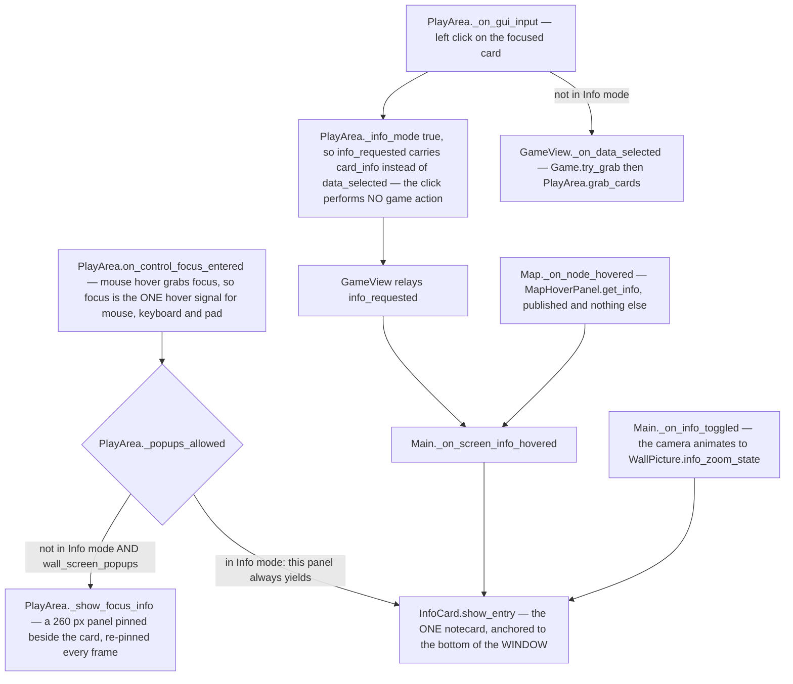

## Flowchart B — what opens, changes and closes the description

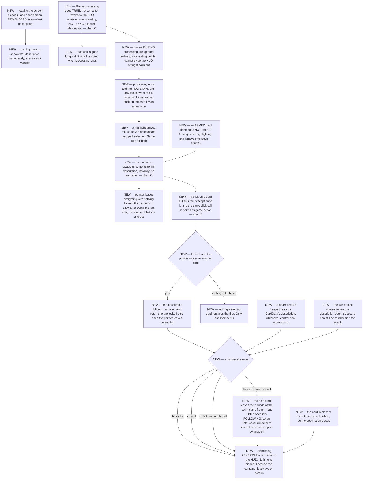

## Flowchart C — the ONE container, and what is inside it

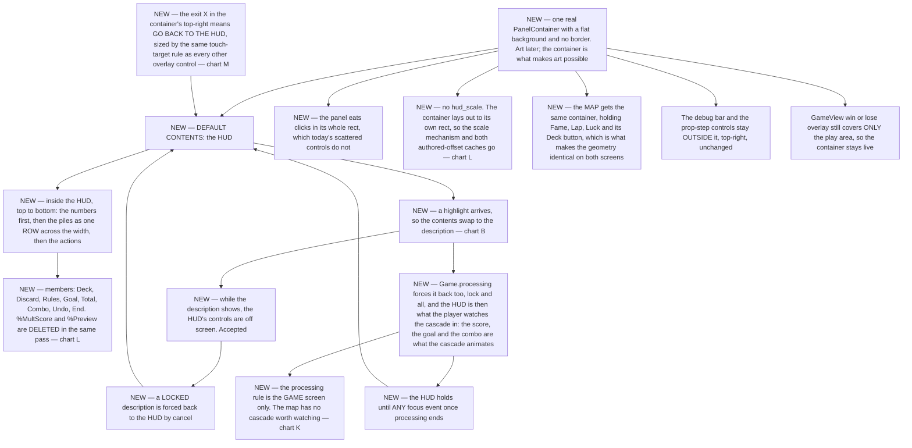

## Flowchart D — the container's geometry

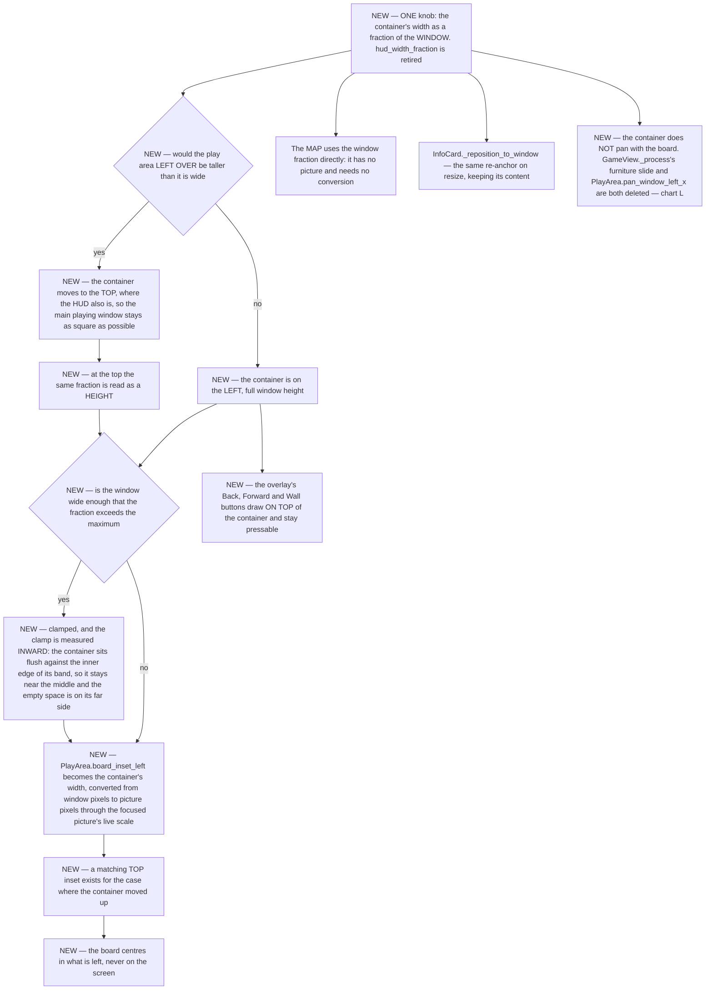

**The arithmetic behind D1, D8 and D10, done once so two nodes cannot quietly disagree.** The
container is a fraction of the WINDOW; `board_inset_left` is consumed in PICTURE pixels; a focused
picture *covers* the window, so its scale is `max(window.x / 1576, window.y / 887)`.

- **At the picture's own aspect the window cancels out entirely.** The inset is
  `0.25 × window.x ÷ (window.x ÷ 1576)` = `0.25 × 1576` = **394 picture px** — exactly today's
  measured `board_inset_left`, at any 16:9 window size. So the board does not move at all on the
  shape the game is authored for.
- **At 32:9** (3840×1080) the scale is driven by width, `3840 ÷ 1576` = 2.44, and
  `container_size_max_px` 640 clamps the container. The inset is `640 ÷ 2.44` = **262 picture px** —
  narrower, because the picture is magnified and the same band of screen covers less of it. Correct,
  and it is why the clamp is measured inward (D7): the container stays beside the board rather than
  drifting to a far edge.

A value therefore exists that satisfies D1, D8 and D10 at once, and at the common aspect it is the
number already shipping.

## Flowchart E — one click, end to end

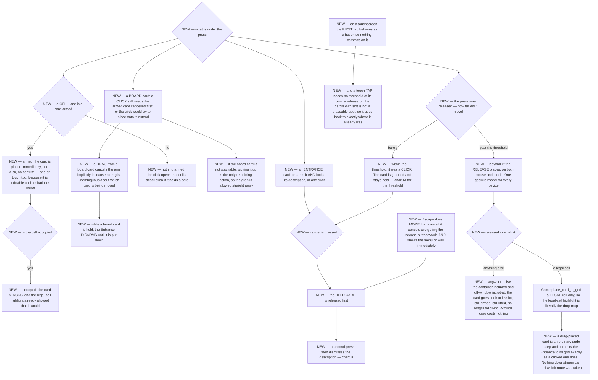

## Flowchart F — the tap gesture

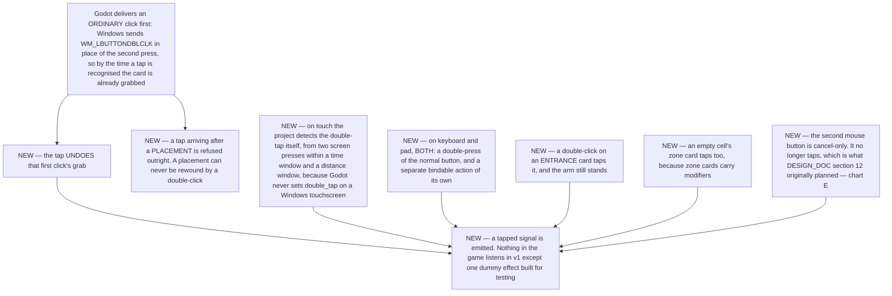

## Flowchart G — arming an Entrance card, and placing it

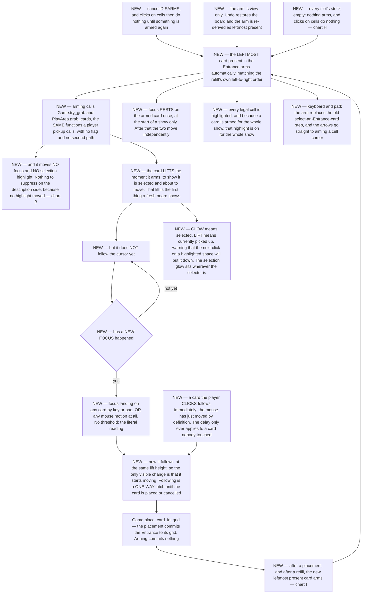

## Flowchart H — the Entrance stocks

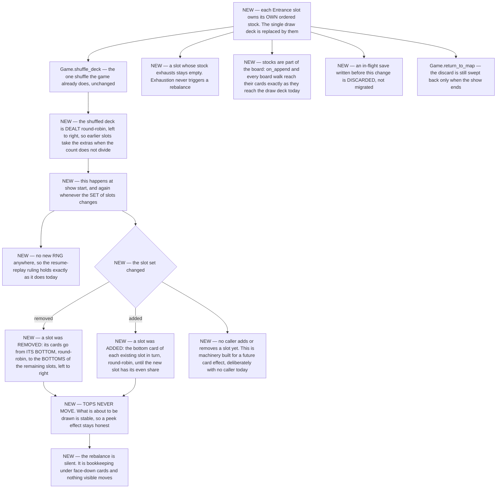

## Flowchart I — the refill, and the flip

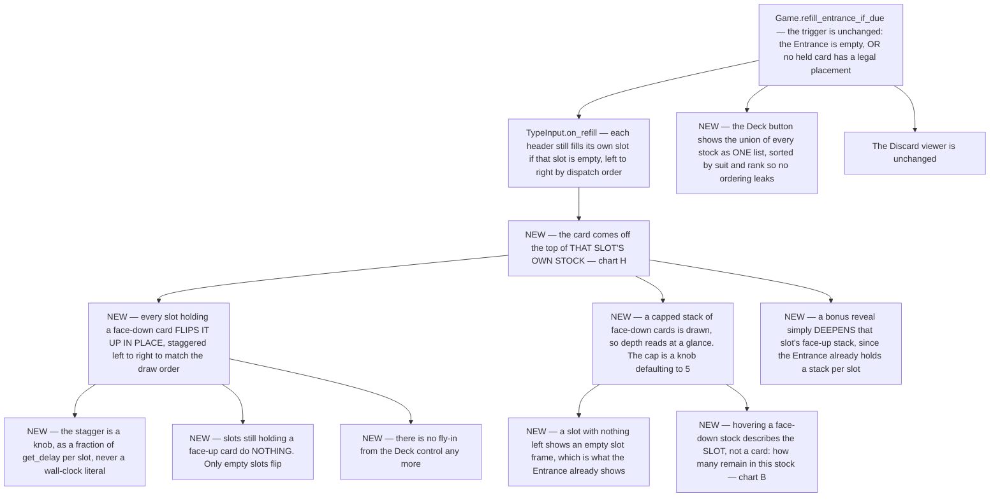

## Flowchart J — ending a show

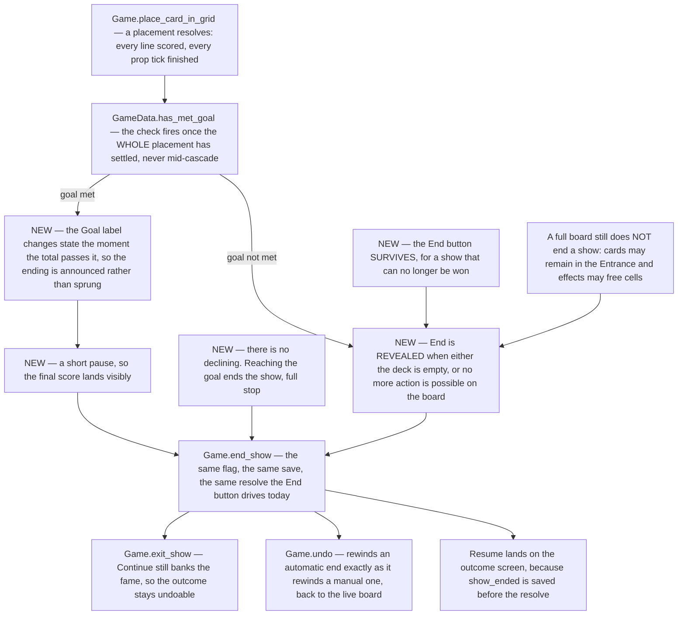

## Flowchart K — the map

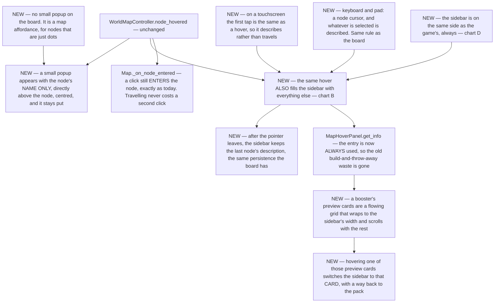

## Flowchart L — everything this design deletes

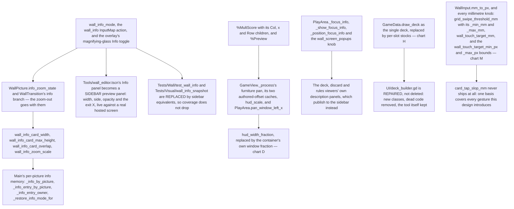

## Flowchart M — how far you must move, and how big a thing must be

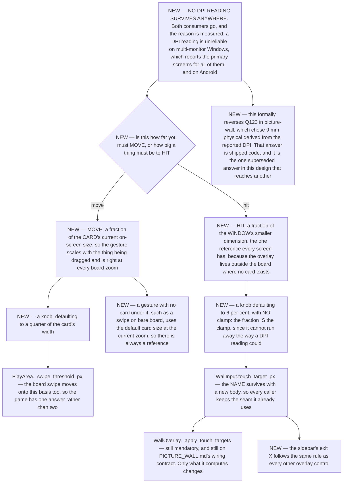

## 5. Tunables

Every number this design introduces, with the space it is measured in. **A number you could judge
from a screenshot is a knob, not a contract** — all of these are exposed live in
`Tools/wall_editor.tscn`, whose Info panel becomes the sidebar preview panel.

| Knob | Space | Start | Means |
|---|---|---|---|
| `container_size_fraction` | fraction of the **WINDOW** | 0.25 | the container's width on the side, and its HEIGHT when the play area left over would be taller than wide — one number read two ways |
| `container_size_max_px` | WINDOW pixels | 640 | the clamp, measured INWARD: past it the container sits flush against the inner edge of its band so it stays near the middle |
| `card_tap_window_ms` | milliseconds | 300 | the self-detected double-tap and double-press window. The OS interval is not readable from Godot, so this is the only one there is |
| `card_drag_threshold` | fraction of the **CARD's current on-screen size** | 0.25 | how far a press must travel before the release places instead of the click grabbing. Scales with the card, so it is right at every board zoom |
| `touch_target_fraction` | fraction of the **WINDOW's smaller dimension** | 0.06 | the minimum size of any overlay control, the sidebar's exit X included. No clamp: the fraction is the clamp |
| `entrance_stock_face_down_cap` | count | **5** — your words: *"knob defaulting to 5"* | how many face-down cards are drawn on a slot's stock, so depth reads at a glance |
| `entrance_flip_stagger` | fraction of `get_delay()` **per slot** | 0.15 | the left-to-right stagger as the Entrance flips up. Never a wall-clock literal — project rule |

**Derived from a rule, never registered** — a stored default here could silently disagree with the
rule that produces it:

- the container's **side or top** is decided per frame by "would the play area left over be taller
  than it is wide" — not a stored orientation;
- `PlayArea.board_inset_left` is the container's width converted through the focused picture's live
  scale, and the matching TOP inset likewise;
- the sidebar's **height** on the side is the window's;
- the **card visual's** size in the sidebar is the board's own card size, so it reads as the same
  object — not a fraction of anything;
- the **lift height** is one value for both armed-and-still and following, so the only visible change
  when following starts is that the card begins to move;
- the **armed Entrance slot** is "leftmost present", re-derived after every undo;
- a slot's **even share** of the deck is round-robin, left to right — a rule, so it cannot drift
  from the rebalance that has to agree with it;
- a gesture with **no card under it** uses the default card size at the current zoom, so
  `card_drag_threshold` always has a reference.

**Knobs this design DELETES:**

- `wall_info_mode`, `wall_info_card_width`, `wall_info_card_max_height`, `wall_info_card_overlap`,
  `wall_info_zoom_scale` — with Info mode;
- `wall_screen_popups` — with the in-board popup;
- `hud_width_fraction` — replaced by `container_size_fraction`;
- ⚠ **every millimetre knob, and the DPI basis with them**: `grid_swipe_threshold_mm`,
  `grid_swipe_threshold_min_mm`, `grid_swipe_threshold_max_mm`, `wall_touch_target_mm`,
  `wall_touch_target_min_px`, `wall_touch_target_max_px`, and `WallInput.mm_to_px()` itself.
  `WallInput.touch_target_px()` keeps its NAME with a new body, so every caller keeps its seam.

**Knobs this design deliberately does NOT add**, because an answer removed the need:

- no hover-dwell knob — a highlight opens the description immediately;
- no slide or fade duration — it appears instantly;
- no single-click delay — the tap undoes the first click's grab rather than delaying every click;
- no `card_tap_slop_mm` — one basis covers every gesture, and it is not a physical one;
- no threshold for a touch TAP — a release on the card's own slot is not a placeable spot, so a tap
  returns the card to exactly where it already was.

---

## 6. What this document deliberately does not contain

- **No code, no file lists, no method signatures, no step ordering, no test plan.** Those are
  `PLAN.md`, `TEST_PLAN.md` and `NAMES.md`, written after you confirm the charts — not before.
- **No new card content.** Descriptions, tappable cards and charge mechanics are named as out of
  scope in section 15 and stay there unless you say otherwise.
- **No re-litigation of settled rulings.** Where this design reverses one — `GAP-023`'s
  click-not-hover, `Q24`'s permanent legal-cell highlight, the HUD following the pan — the reversal
  is a numbered question with the original ruling quoted beside it, never a silent change.

---

## 7. Design provenance and gap protocol — COPY THIS BLOCK INTO ANYTHING DERIVED FROM THIS DOCUMENT

Derived from: `solatro/design/sidebar/DESIGN.md`, version 1. Every step in any derived plan cites
the design node ids it implements.

If you are executing this and you reach a decision the design does not cover:
1. Reversible and clearly within intent → do it, and append one line to `ASSUMPTIONS.md` citing the
   node you were working on. Never silently.
2. Otherwise — two defensible choices differ in observable behaviour, or the choice is expensive to
   reverse, or it is an owner call (balance, look, scope) → **park that thread, file a gap, keep
   working on unaffected threads, and tell the owner.**
3. The design contradicts itself or the code → always a gap, highest priority.
4. ⚠ **Two documents disagreeing is NOT automatically (3).** If both are restating the same answer,
   go read that answer — the conflict is a documentation bug to fix against the source, not a
   decision to escalate. Quote the note in the gap and say why it does not settle the question; if
   you cannot, it was never a gap.
5. ⚠⚠ **THE CODE BEING BROKEN IS NOT A GAP — FIX IT.** If the design says what should happen and
   the code does not do it, that is a BUG, and the only open question is *how* to fix it, which is
   yours. Filing it spends an owner round to be told "yes, fix the bug". Measured: one run filed
   ~50 gaps and a large share were this. **Before filing anything, ask in order:** does the design
   already answer it (→ fix the code); would any defensible choice be invisible in the product
   (→ assume it, log one line); would the owner recognise this as a decision they want (→ only
   now, a gap). A gap asks for a RULING, never for permission — if you are filing to be told it is
   fine to proceed, write the assumption instead.

File gaps at `solatro/design/sidebar/gaps/GAP-NNN.md` using the template below. Write the options in
the questionnaire grammar; they become the next round's questions unchanged.

Do not resolve a gap by picking an answer. Do not proceed on the parked thread. Do not delete a gap
— it is closed by a new design version.

This block, unchanged, goes into every document derived from this one.

### The gap file template

```markdown
# GAP-007 — <one-line title>
status: open | questioned | resolved | withdrawn
outcome: answered | withdrawn | superseded      (added when it closes)
raised: during <execution plan step>
design: <doc> version <N>, nodes <D6, I10>
severity: GAP | CONTRADICTION

**What the design says** — <quote it, cited>
**What the ANSWER says** — <the verbatim note from `answers.json` for every question involved, and
  why it does not settle this>
**What it does not say** — <the decision that has to be made, stated as a decision>
**Why it blocks** — <which triage test it meets, concretely>
**Options I can see** — **(a)** … — consequence · **(b)** … — consequence · *my recommendation* (a)
**Blast radius** — plan steps <4, 9>; design nodes <D6, D7>
**Meanwhile** — parked <thread>; continued on <threads>
```
