# SPOTLIGHT_DESIGN.md — the Spotlight mechanic and its visual effects

**Status: CONFIRMED, version 12. Rounds 1–3 COMPLETE (2026-08-03), design confirmed by the owner
2026-08-03. PHASE 1 OF `PLAN.md` IS IMPLEMENTED (2026-08-04, folded in as v7), and **S11–S14 of
phase 2 — the glow style, its shader, the light layer, the spotlight wire AND chart E's travel — are
all implemented (2026-08-04, v8–v12). S18's tuning tool ships too; S15/S16/S17 remain.** This document still carries no code, no file plan,
no step ordering and no test plan; those live in `PLAN.md`.

⚠ **NO ANSWER CHANGED IN v10 EITHER, AND THAT IS THE FINDING.** GAP-006's per-section dim is not a
new answer — it is **`Q82`'s answer of 2026-08-03, recovered**. The owner wrote *"per anytime
spotlight effect is happening"* as an override at `Q82` in round 1; `answers.log` seq 269 then
**stranded it** (`active: false`) along with 19 others when `QR2` moved to (d), and §17.6's heading
was widened to `[QR2=a|c|d]` afterwards while `Q82`'s own gate was left at `[QR2=a & QR8=a]`. **The
document held the answer the whole time and the gate hid it.** `Q82`'s gate is widened below.
v10 also SCOPES `Q246`=(a) to the momentary cue alone (GAP-005) without altering it. Questionnaire
status: **255 answers, 0 open**.

⚠ **Before handing this document over again, run the gating check** (§0b C8 is what happens when you
do not): every question ID named in any `[gate]` must itself carry `⚑gate`. As of v4 that is 30 of
30, verified. `npm run check` does **not** test this.

## 0a. What round 1 decided — the one page that matters

Three answers between them re-frame the whole feature, and everything downstream reads differently
once they are on the table.

**1. The GLOW is the feature. The dim, the beam and the circle are its supporting cast** (Q83, your
words):

> *"since recc answer implies dim is more important than glow, it is not. The glow is most
> important. Beam and circle and dim are helper to make glow on card more prominent"*

⚠ v1 and v2 were written the other way round — as a *scoring show* that a glow happened to be part
of. Every "how bright / how dark / what wins" question is decided by this sentence, and §17.10 was
the small section rather than the large one. That is corrected here.

**2. Spotlight is a general "this card just became active" cue — it is NOT a scoring feature**
(Q149, Q107, QR5's note, your words):

> *"yes when a card becomes active at anytime it triggers momentary spotlight effect"* ·
> *"Spotlight is used whenever card is entering active state and for highlighting cards about to
> score"* · *"if a card in active slot which no active gains an active effect somehow, it should
> still trigger momentary spotlight to show it has become active"*

⚠ Scoring becomes **one caller of the spotlight**, not the thing the spotlight is for. Placing a
card, a Next dropping stacks, a card gaining an ability mid-game — every one of those is a spotlight.
The scoring cascade is where several fire at once and travel between lines.

**3. The dim belongs to the SPOTLIGHT, not to the act** (Q45, Q82, Q150, Q16, your words):

> *"dims occur at same time spotlight appears. dims go away when spotlight disappears"* ·
> *"per anytime spotlight effect is happening"* · *"yes it is linked to spotlight effect"*

⚠ You answered QR2 = (a), *"for the whole submit"* — but these three say the dim is up exactly while
a spotlight is live, wherever that happens, including outside scoring entirely. Those are different
statements, and §0b C3 is where they are reconciled. QR2 has gained a **(d)** for it.

**The scope also grew** — noted here rather than buried: `active` is renamed to `spotlight`
everywhere (Q2=b), the Spotlight icon in card descriptions is IN (Q5=b, Q184=b), the "show all active
abilities" board-spread toggle is IN (Q186), and the **full film pipeline is IN as a second
deliverable shipped after Spotlight** (QR10=a, Q239=a).

### Version 12 changelog (2026-08-04) — what USING the tuning tool found, and the pattern behind all of it

**The tool was built, and then it immediately paid for itself.** Everything below was found by the
owner driving it or by an instrument built because driving it was not enough.

**1. The origin assignment is a FAN BY DEPTH, not "nearest" (`Q111`, chart E2, GAP-008).** `Q111`=(a)
chose *"nearest to its target"* **and gave "keeps beams mostly vertical and non-crossing" as its
reason.** On a COLUMN every target shares one x, so "nearest" is a tie and the last card gets the
farthest lamp, whose beam crosses every other — the mechanism defeating its own stated purpose. The
owner's rule replaces it:

> *"we first divide top bar into sections, getting wider by row. middle of top gets first `-1-`, 2nd
> row gets lamp area surrounding first row `-212-`, and so on with `-32123-`, with each lamp within a
> row section choosing its closest."*

⚠ **The allocation is driven by DEPTH, not proximity, and that is why it cannot cross:** a deeper
card's lamp is always further from the column, and a lamp further out lands lower. One depth degrades
to one band — the whole bar — so a ROW still spreads full width. ⚠ **An answer that states both a
MECHANISM and a REASON is two claims, and they can diverge**; that is the transferable part.

**2. Chart E's travel is built — S14 is complete.** Every branch against its own answers: `Q61`=(a) a
card in both sections keeps its light and does not move, E3 surplus lights fade in place, `Q65`=(a) a
new light fades in ALREADY AIMED, `Q64`=(a) all travel on one frame, `Q63`=(a) FULL SIZE in transit,
E10 the origin stays fixed while the wide end tracks the circle.

**3. `Q46`/`Q52`/chart D4 say a COLUMN expands every row it passes through**, and the tool had been
written to do the opposite on an invention of mine. `Q52` states the consequence outright — *"Column
scoring on the longest column expands nearly every row at once"*.

⚠⚠ **THE PATTERN BEHIND ALL EIGHT GAPS, AND IT IS NOT "READ MORE CAREFULLY".** Tabulated across the
whole stream, every miss is the same shape: **two representations of one fact, and nothing that
compares them.** Chart vs answer (GAP-001, GAP-003), answer vs answer (GAP-004, GAP-005, GAP-007),
answer vs its own rationale (GAP-008), design vs code (`Q85`, §16's knob table), exit code vs pixels
(two blank captures), a still vs movement over time (a dead cascade), tool vs tool.
⚠ **The pairs that survive are the CROSS-KIND ones** — a chart against an answer, a doc table against
a property list, a green banner against a frame — because no single tool reads both, so the
contradiction has nowhere to surface. Same-kind conflicts get caught.
⚠ **The rule that follows: when a fact gains a SECOND representation, the comparison is written at
that moment.** Better still, delete the second one — `circle_radius` as a `const` *and* a §16 row was
two truths; one `FxSpotlightStyle` property is one. The checks this stream added on that principle:
`designloop check`'s `unclaimed` (answers ↔ plan steps — 190 of 255 unclaimed when first run, `Q85`
among them), `test_the_design_16_knob_table_is_implemented` (doc table ↔ properties — found 13 more
on its first run), the light-shader uniform seam, and `--verify` (behaviour ↔ time).

### Version 11 changelog (2026-08-04) — what building the tuning tool found

**0. `Q85` WAS NEVER IMPLEMENTED, AND THE TOOL FOUND IT IN ITS FIRST HOUR.** `Q85` says the circle is
*"Radius 16 art units, centred on the card's **art-square centre**"*. `SpotlightDirector` centred it
on `visual.global_position` — the card's ORIGIN. Owner, looking at the tool:

> *"circles should be centered on the skill art, not on card center"*
> *"hard to tell which card circle it is on currently"*

Measured: `Art` sits at `(0, 5)` inside `Visual` and its polygon spans ±16, so the square is 32 art
units across — **exactly the diameter `Q85`'s radius of 16 describes**, which is the confirmation
that the answer meant the art square and not the card. The pool sat high and, on a stacked column,
ambiguously between two cards. Fixed: `CardVisual.spotlight_center()` now owns the offset and both
the director and the tool ask the card for it.
⚠ **THE OFFSET LIVES ON THE CARD, NOT IN THE DIRECTOR.** It is authored in `card_visual.tscn` and
rides `Offset`'s transform, which is where the scoring jump lives — a constant copied into the
director would silently disagree the moment a card jumped.
⚠ **This is a SEVENTH instance of the v9 pattern**, and the first found by looking rather than by
reading or playing: an answer recorded, a contract written past it, and nothing that compared the
two. It shipped through S13, S14, every phase-2 gate and two by-eye reviews of `10_light_layer`,
because a circle on a card's origin looks perfectly reasonable **until there is a second card under
it**. The tool's stacked preset is what made it obvious.
⚠ **The regression guard's SHAPE is the transferable part.** The natural assertion — *every light
sits on an art square* — is flaky, because `PlayArea` controls are pooled per slot and a `CardVisual`
can be re-bound between the emit and the check (measured: 2 of 3, with correct code). What is pinned
instead is **no light sits on a card ORIGIN**, plus a probe proving the two points differ at all.
Under the bug every centre was an origin, so the negative form is the one that fails loudly.

**One node, and it is the first time a FIDELITY answer has given way rather than a form one
(`Q174`, `Q175`, `Q176`, chart N, GAP-007).** `Q176`=(a) asked for the tool to be `@tool` *and*
runnable; `Q174`=(a) and `Q175`=(a) asked it to host a real `PlayArea`, real `CardVisual`s and a real
headless `Game`. **Measured: those cannot both hold.** `game.gd`, `game_view.gd`, `play_area.gd`,
`light_layer.gd` and `spotlight_director.gd` are all non-`@tool`, so in the editor they load as
placeholder instances where every method call fails — and the editor instantiates no autoloads, while
the director reads `SettingsManager.settings.card_scale` on every light. Owner:

> *"Just play area simulating effects is enough, dont need full game_view with hud"*
> *"trigger different preset scenarios using editor tool options"*
> *"simulation should include realistic stacking system from play area and cascade scenario and
> mocked solo on active triggers and row separation if not already"*

So **`Q174`=(a) and `Q175`=(a) are SUPERSEDED**: no `Game`, no `GameView`, no `PlayArea`, no HUD.
What the tool hosts is real `CardVisual`s on the **real board pitch**, the real `LightLayer`, the real
shader and the real `SpotlightOrigins`; what it SIMULATES is named — the cascade's order, the solo
activation cue, and row separation.

⚠ **THE COST, AND IT IS PERMANENT: the cascade in the tool is POSED, NOT RUN.** Section membership,
the activation sweep, hand re-evaluation and the hold beat are `Game`'s. **A behaviour question —
"did the light travel when it should have" — must go to `Tools/spotlight_tool.tscn -- --trace` or the suite,
which run the real act. The tool answers "does it look right", and that is the only question it can
answer.** Chart N's N2 (*"hosts a REAL board"*) is true of the geometry and false of the game, and
that distinction is now the tool's own header comment.

⚠ **`Q173`'s reasoning survives intact and is worth re-reading**: it chose the standalone player
because *"a whole-board, multi-phase, screen-space effect cannot be shown on one 70-unit column
beside a burning knife"*. That argument was about the LIGHT LAYER, not about the `Game` — which is
exactly why dropping the game costs the tool nothing it was chosen for.

⚠ **A NEW FAILURE SHAPE, AND IT IS THIS TOOL'S CHARACTERISTIC ONE: a blank frame at exit 0.** Twice
while building it, every check passed, the run reported success, and the picture was empty — once
because the cards deleted themselves (`CardVisual._ready` turns its own `_process` back on, and
`delta_self_moving_logic` frees any non-play-area card with no `control_anchor`, so posing before
`add_child` is undone), once because a `Control` parented straight to a `CanvasLayer` has no parent
rect for its anchors to resolve against. **Neither is detectable from an exit code, and both are
invisible to any assertion that does not read pixels.** The gate now prints `cards=N lit=M` per
preset, which is what separates "nothing was built" from "built, but nothing is lit".

**THE GLOW IS NOW IN THE TOOL, AND IT HAD NEVER BEEN SEEN ON A BOARD.** Owner: *"editor should
include glowing effect on card as well for cards currently active. I believe previous part of plan
had it implemented but havent seen it in action yet for adjustment."* **They are right that it was
built** — S11 shipped `FxGlowStyle` and the three `.tres`, S12 shipped `glow.gdshader`, and both were
rendered and looked at in `fx_snapshot`. **What never existed is the request path putting it on a
card in a board context**: there is no `FxGlow` effect class, only `FxGlowStyle.GLOW_SHADER` as a
stopgap preload. The tool builds the request directly, and this is the first time the glow, the
circle, the beam and the dim have been on screen together.
⚠ **When an effect class IS written, the tool's call site must MOVE to it, not be copied** — two
preloads of one shader are two `Shader` resources, and a style applied through the wrong one silently
misses every uniform the other declares.
⚠ **Gate G2.2 is judgeable for the first time**, because `Q83` makes the glow the main event and the
circle a helper; judging the circle alone was judging the helper.

### Version 10 changelog (2026-08-04) — what implementing S14 and playing the game found

**Two nodes, and both were found by RUNNING the thing, not by reading it.** GAP-005 came from the
owner's report *"see zero spotlight effects"*; GAP-006 from their playtest *"dim and spotlights never
disappear during act currently"*. Neither is a tuning miss and neither the suite nor this document
could have caught either one — see the two ⚠ notes at the end.

**1. The scoring beam and the momentary cue are TWO SIGNALS, and `Q246`'s filter belongs to only one
of them (chart T, `Q246`, GAP-005).** S14 wired the beam to `CardEnvironment.spotlight_cued`, which
`Q246`=(a) filters to skills implementing `on_spotlight`. Exactly one non-test card in the shipped
game implements it, and it is a rules card with no `CardVisual` — **so the light set was empty in
every real act, and no beam, circle or dim had ever appeared in the running game.** Owner's answer:
option (a), a second signal.

> `spotlight_cued` — *which cards have a TALENT to announce*, filtered by `Q246`=(a). Chart T, S15.
> `spotlight_section_changed` — *which cards are BEING SCORED*, filtered by nothing. `Q16`=(c),
> charts E and H/I, S14.

⚠ **`Q246`=(a) is untouched and still right about what it was asked.** What was wrong is that its
answer was applied to a question it was never asked about. A scored row is mostly plain numeral cards
with no skill at all, and the beam lights the row.

**2. The show PULSES PER SECTION — it is a separate axis from the light set (chart C's C5/C16, chart
D's D13/D19/D20, `Q16`, `Q82`, GAP-006).** `QR2`=(d) *"the dim is active if there are BEAMS"* composed
with `Q16`=(c) *"the forced spotlight is never torn down between sections"* to give a dim that is up
for the entire act — which is exactly the reading `QR2` was moved OFF of. Measured in the owner's own
recording: `dim_rising` once and `dim_settled` once across EIGHT scored sections. Owner:

> *"spotlight + dim occurs as cards of section get revealed, with both spotlight and dim effect
> fading away as scoring starts to happen. When next section is revealed, spotlight and dim effect
> are visible again, moving to new location, then fade away again."*
> *"this has always been what I intended so not sure what miss from your end is."*

So **VISIBILITY is now its own axis**: `spotlight_section_changed` still answers *which cards are lit
and where*, and the new `spotlight_reveal_ended` answers *is the show up*. `LightLayer._show` eases
0↔1 on the `Q167` fractions and multiplies both the dim target and every light's intensity, so beams,
circles and dim fade as one show, once per section.

⚠ **`_show` scales light INTENSITY, never the light COUNT, and the lights are NOT freed by the fade.**
They survive at their positions so the next section can TRAVEL from them — chart E's *"no instant
movements or spawning in and out"*. A fade that freed the set would make chart E unbuildable on top of
it. This is also why **option (a) of GAP-006 ("emit an empty set between sections") was not what was
built**: emptying the set is what fights chart E.

⚠ **`D13`'s hold beat had never been implemented, and only the event log found it.** With the fade in,
the log showed `revealed` and `reveal_faded` on the SAME FRAME at `show=0.000` — nothing between them
ever waited, so the dim eased toward a target it was already leaving and never left zero.
`spotlight_hold_fraction` (`Q68`=a, §16) now exists in the code, gated on `if view:` so headless still
waits on nothing (`Q19`=a) and G1.7's parity holds.

⚠ **THE ANSWER WAS NEVER MISSING — A GATE HID IT, AND THIS IS A NEW FAILURE SHAPE.** `Q82` asks
exactly this question ("once per act or per line") and the owner answered it in round 1 with an
override: *"per anytime spotlight effect is happening"*. `answers.log` **seq 269** then stranded 20
questions, `Q82` among them, when `QR2` moved to (d). §17.6's heading was widened to `[QR2=a|c|d]`
afterwards — but `Q82`'s own gate was left at `[QR2=a & QR8=a]`, so it stayed `active: false` and
dropped out of every later reading of this document. **The act-long dim was chosen by nobody: it is
what the composition did in the absence of an answer that was sitting right there.** `Q82`'s gate is
widened and its option (c) authored below.

⚠ **So the previous five gaps and this one are NOT all one defect, and treating them as one is why the
note kept failing.** Five were *a statement written before an answer, never revisited after it*. This
one is *an answer deactivated by a gate and never re-activated when the gate's premise widened* —
which no amount of re-reading the charts would catch, because the question is invisible in the
rendered document. **The mechanism that would have caught it is mechanical: after any strand event,
diff the stranded IDs against the gates that were subsequently widened.** `answers.log` records both,
so this is checkable rather than remembered.

⚠ **v7's resolution then compounded it.** GAP-002 reconciled `Q16` by keeping *"the light travels"*
and dropping *"dims after initially showing, but gets revealed again at start of next scoring
section"*, concluding *"the implementation was already correct."* It never had been — and `Q82`, which
would have contradicted that conclusion outright, was already stranded by then.

⚠ **What DID find them, and it is the transferable part: a test whose fixture supplies the thing being
filtered on cannot detect the filter.** Every spotlight test supplies a fixture skill implementing
`on_spotlight`, which is the only reason the cue ever had content. The regression guards are now
written the other way round — `test_the_section_signal_carries_plain_cards()` scores a column of cards
carrying no skill at all. Composition defects (GAP-006) need a different instrument again: two
individually correct answers, and nothing asked what one implies for the other. The event log's
per-section tally is what showed it.

### Version 9 changelog (2026-08-04) — what implementing S13 found

**`Q74`, `Q75` and `Q76` are WITHDRAWN. The dim covers everything (GAP-004).** One screen-space
surface has one depth (`Q240`=b), and those three exempted the props, the score popups and the focus
panel while `Q73`=(a) dimmed the HUD — which sits later in the draw order than all of them. No
position satisfies the four. Owner:

> *"dim doesnt last long enough to matter for readability, dim everything without worrying about
> certain visuals being exempt"*

⚠ **The reason retires the question class, not just the four questions.** Every exemption was
argued from legibility — *"the number stays readable"*, *"props are performers, they stay lit"* —
and legibility is about how long something is obscured, which none of them asked. Every duration in
this feature is a fraction of `Game.get_delay()` (§16, `Q167`=a). **A future question of the form
"should X be exempt from the dim" is already answered: no.**

⚠ **This is `Q102`'s withdrawal a second time, and the third instance of one defect.** §0b C1 caught
*"in front of the card it is effecting, but not in front of other objects in front of card"* against
one surface and withdrew `Q102` — but `Q73`–`Q76` are the same claim broken into four, and nothing
carried the withdrawal across to them. Together with v7's two and v8's one, **all four gaps found in
implementation are the same shape: a statement written before an answer, never revisited after it.**
The gating check (§0b C8) catches an unreachable question; nothing catches a live answer whose
premise a later answer removed. **When a round lands, re-read what it contradicts, not just what it
fills in.**

### Version 8 changelog (2026-08-04) — what implementing S11 and S12 found

**One node, and it is the same failure shape as both of v7's: a chart argued from a premise that a
later ANSWER had already overturned, and nothing marked the chart stale.**

**`O11`'s colour source is an OFF-PALETTE `Gradient`, not a `PaletteRamp` (GAP-003).** O11 was
written in v2 and justified itself with *"the palette contract forbids lerping colours, and a ramp
is the fix, not a limit"*. Round 1 then overturned exactly that premise, three separate times:
`Q134`=(b) *"light gets freedom to use off-palette colour from the start"*, `Q135`=(b) *"an
off-palette exception for the light layer only"*, and `Q214`'s note *"gradient shouldnt be forced to
be on fixed palette"* — which §0b's answer list already recorded, beside O11, without either one
noticing the other. **Owner, 2026-08-04: the off-palette ramp.** O11 and §16's `glow_ramp` row are
corrected below; `PLAN.md` §1.8's row is known-wrong.

⚠ **What this costs, stated plainly: light is now the only thing in this game outside the palette
contract.** That exception is granted once, is scoped to the light layer, and does not travel — every
other gradient in the project is still a `PaletteRamp` that never interpolates.

⚠ **The lesson is v7's lesson again, at a different node.** Both of phase 1's gaps and this one are
the same defect: a statement written BEFORE an answer, never revisited after it. The gating check
(§0b C8) catches an unreachable question; nothing catches a chart whose reasoning an answer has
retired. When a round lands, the charts it touches need re-reading, not just the question list.

### Version 7 changelog (2026-08-04) — what implementing phase 1 found

Two nodes, both of which an executor misread. **No answer changed; both were wording that let a
correct answer be read two ways.**

**1. `blocks_spotlight()`'s polarity is now stated, not implied (A8, `Q9`, GAP-001).** Chart A8 was
right and `PLAN.md` §1.4 was wrong — it specified `return false` as the default, which under A8
would make **every covered card on the board spotlit**. The answer, in the owner's words:

> *"default is if card is covered by another card stacked on top, then that card is not active
> since its talent is hidden. Kuroko allows card it is on top of to be unhidden instead, activating
> its effect, and revealing allows the card it is attached to be spotlit anywhere even if card is
> covered."*

So: `blocks_spotlight()` is asked of the **covering** card, defaults **`true`**, Kuroko/Ghost Light
override it to `false`, `StampRevealing` is a property of the card **itself**, and A8 **replaces**
`is_data_topmost` rather than sitting in front of it. `PLAN.md` §1.4 is corrected to match.

**2. D20's "stays set for the whole act" now says what it always meant (`Q16`, GAP-002).** It was
read as *accumulating* — every scored section's cards piling up. It means the forced spotlight is
not torn down between sections; it **travels**, and its membership is whichever section is being
scored. Both halves of `Q16`'s answer say so and neither contradicts the other:

> *"whole act? increases or decreases based on cards being scored. dims after initially showing,
> but gets revealed again at start of next scoring section, moves at same time as other row
> expanding and moves down with other cards moving down."*

⚠ *"increases or decreases based on cards being scored"* is the operative half and had been dropped
from every restatement of this answer. **A light that stays up while it moves is one behaviour, not
two competing ones.** D20 and §17.2's `Q16` are reworded; the implementation was already correct.

### Version 6 changelog (2026-08-03) — round 3, answered in chat in one go

⚠ **The questionnaire is now COMPLETE.** All 19 outstanding questions were answered in one pass.
They were asked in chat rather than in the tool because the tool cannot re-present an answered
question and cannot be told "here is the set I need" — the owner's verdict on that workflow was
*"pretty bad UX"*, and it is being fixed in `designloop` rather than worked around again.

**Three of the 19 were corrections to my premise, not answers to my question.** Those matter more
than the answers:

**1. `Q202` — nothing is "skipped", and I had the direction wrong.** I claimed compaction moves cards
into rows the cascade has already scored. Owner: *"not sure what you mean by skipped, further scoring
on that row would include new card."* **They are right for the case that matters.** Rows score in
increasing index order, and erasing at row `z` pulls cards *up* into `z`, `z+1`, … — i.e. into the row
being scored right now (that is the compaction itself) or into rows still pending. The one genuine
skip is narrower than I wrote: a discard in a column at a row the cascade has **already passed**
pulls that column's later cards up into scored rows, and those are not re-scored. **Answer: (a)
accept**, with that distinction recorded rather than the wrong general claim.

**2. `Q248` — there is no board-wide flash on resume, and no code needed.** I claimed a resume makes
every uncovered card a fresh transition. Owner: *"why would it be fresh transition. If it was saved as
active, it should load as active with no transition and already glowing… really dont think this should
take extra code since it should match saved datas."* **Correct, and §1.1 already said so:**
`CardModifierSkill.active` is `@export_storage` — it is saved and rewound with the board. So
`skill_active_check()` compares a saved `active` against `is_active()`, finds no difference, and fires
nothing. A card saved active loads glowing with no cue; a card saved inactive that loads uncovered
transitions normally, exactly as in play. **Answer: (b), and the suppression I proposed in (a) is
deleted — it would have been code to prevent something that cannot happen.**

**3. `Q265` — a correction, then a retraction, and the net result is that NOTHING about the existing
scoring animation changes.** First: *"cards raise, then jump to signify they were scored in a meld.
Lit set is same as raise set, not jump set."* Then, on being shown the code: *"seems i was wrong
about raise, must have been in a previous iteration."*

⚠ **Verified: there is exactly ONE motion today and there never was a second.**
`CardVisual.anim_jump()` (`card_visual.gd:576`) — a rise to `CARD_JUMP_RISE` plus a scale pulse —
applied by `PlayArea.popup_meld` to `result.meld` **only** (`play_area.gd:657`). No separate raise
exists anywhere in the current code.

**So `Q265`=(c): only the meld jumps, exactly as today.** The wider lit set — every card
participating in the section, per `Q31`=(d) — is carried by **the spotlight alone**: those cards are
lit, and that is the whole of how you can tell they are being evaluated. **This is the answer that
removes work rather than adding it:** no new motion, no second amplitude, no change to
`popup_meld`.

**And the ducking rule, with its own refinement:** *"the covering cards dropping down should only go
down far enough such that there is no visible gap between top of ducking cards and top of raised
cards. gap allowed if there is card in row that didnt raise because it wasnt part of set, but no gap
beyond that. Basically check lowest card"* — plus *"gap is allowed if all cards jump at same time
since once ducking has completed it shouldnt track current card bottoms anymore."*

⚠ **The load-bearing half is the second sentence: THE DUCK IS COMPUTED ONCE, NOT LIVE-TRACKED.** The
covering cards duck by an amount worked out at the moment the duck begins, from the geometry as it
stands then. It is **not** a constraint that keeps holding: once the duck has finished, cards that
move afterwards — the meld jumping, say — may open a gap under them, and that gap is accepted. A
live constraint would make the board breathe against every card motion for the whole cascade.

⚠ **This supersedes `Q43`=(a)'s "the row opens to the FULL card height"** — the opening is derived,
sized from the lowest lifted card in that row, with a gap permitted where a card did not lift.
🔶 **One consequence is deliberately left for the flowchart review rather than invented here:** the
reveal (chart I) exists to make a buried *lit* card visible, and under (c) a lit non-meld card never
lifts at all — so whether the row's opening is sized by the lifting cards, by the lit cards, or by
the larger of the two is a question the charts should be read against. It is flagged at K10b.

**The remaining 16, as answered:**

`Q198`=(a) the covering card slides in — free, the array does it · `Q199`=(a) nothing to slide in →
the light retires · `Q200`=(c) the light does not move; it is pinned to the slot · **`Q201`=(b) NO
cap** — the act-level runaway guard is the only bound, which with `Q253`=(a) means there is no
per-section cap at all · `Q203`=(a) re-derive the reveal · `Q204`=(a) the replacement activates —
*"scorer moves on as if discard never happened, new card took its place"* · `Q205`=(a) one rule for
any card leaving a lit slot · `Q206`=(b) the light holds on the empty slot for a beat · `Q243`=(a)
the lights and jumps re-cue when the hand changes · `Q246`=(a) a skill implementing `on_active`
qualifies · `Q247`=(a) one dim, one cue, many lights · `Q249`=(a) a cue never blocks input ·
`Q266`=(a) a section IS the scorer's card list, no geometry inferred · **`Q114`=(a) ~600 px, and
tunable** · **`Q214`=(a) dither the bands — but the gradient is NOT forced onto the fixed palette**
(consistent with `Q134`=b, light gets off-palette freedom) · **`Q42`=(b) the upper zone does get
beams — but only for zones that actually have an active effect.**

### Version 5 changelog (2026-08-03)

**You clicked QR2=(d) and 20 dim answers went inactive. That was my bug, and it is fixed.** I added
option (d) to QR2 in v3 and widened the question lines below it to `[QR2=a|c|d]` — but **not the
`### 17.6` section heading**, which carries a gate of its own and is folded into every question in
that section. So the whole section stayed pruned regardless.

| What | Result |
|---|---|
| §17.6's heading widened to `[QR2=a|c|d]`, plus 17 question gates | **17 of the 20 restored** — Q45, Q73–Q77, Q79, Q80, Q83, Q84, Q127, Q137, Q150, Q155, Q156, Q161, Q163 |
| `Q78`, `Q81`, `Q82` deliberately left pruned | They are specifically about a dim that lasts *the whole act* — "does it fall before or after the board clears", "is it constant through the act", "once per act or per line". Under (d) none of them has a subject. ⚠ Q82's own answer, *"per anytime spotlight effect is happening"*, is not lost — it **is** QR2=(d), which is where it now lives |
| Swept every option added in v2–v4 for the same fault | Found one more: **`Q113=(d)` orphaned `Q114`** — `origin_rise`, the number that sets every beam's length. Widened to `[Q113=b|c|d]` |
| The two checks are now in the skill | An option letter that appears in no downstream gate, and a reachability run against the real `answers.json`. `npm run check` tests neither |

Also folded in: **`Q245=(c)`** (a shallower dim outside scoring than inside it), **`Q262=(a)`**,
**`Q263=(b)`**, **`Q264=(a)`**.

### Version 4 changelog (2026-08-03)

| # | What | Where |
|---|---|---|
| 1 | Round 2's 15 answers folded in. **C1, C3, C4, C5, C6, C7 closed**; C2 half-closed | §0b |
| 2 | **Seven answers settled in chat** and recorded here as the answer of record, because the tool cannot re-present an answered question | §0b, "Answers of record" |
| 3 | **C8b** — why the round-2 re-ask silently did nothing either, and the six clicks that open the 20 | §0b C8b |
| 4 | **C9, C10, C11** — three new collisions round 2 opened, and round 3 (`Q262`–`Q266`) | §0b, §17.21 |
| 5 | **All 30 gating questions now carry `⚑gate` with previews** — was 16 of 30, and the other 14 were the same silent-amputation risk | throughout §17 |

### Version 3 changelog (2026-08-03)

| # | What | Where |
|---|---|---|
| 1 | Round 1's 217 answers folded in; §17 now records the answer beside each question it changed | throughout |
| 2 | **Seven contradictions** round 1 opened, each with the questions that resolve it | **§0b — read this first** |
| 3 | The reframe above: the glow is primary; spotlight is a general activation cue; the dim follows the spotlight | §0a, QR2 (d), Chart T |
| 4 | New **Flowchart T** — the momentary spotlight outside scoring (Q149) | §13b |
| 5 | Q22=(b) **broke Flowchart R's R6**, which assumed the score could not move. Rewritten | §12b |
| 6 | Round 2 is SCOPED: **Q240–Q261**, 22 questions, only the contradictions and the branches your own answers opened | §17.20 |

### Version 2 changelog (2026-08-03) — superseded, kept for the record

### Version 2 changelog (2026-08-03) — what changed and why

*(v2's own note, at the time it was written: round 1 was a quarter answered; two answers were in the
owner's own words, one at a `⚑gate`. Both branches below were authored and both were then answered
again in the completed round — see §0b.)*

| # | Trigger | What changed |
|---|---|---|
| 1 | **QR2 free text** — *"no dim only lasts for as long as it takes for spotlight fx to spawn in, and jump up and score first meld, fading away back to normal lit state for everything else"* | **QR2 gains option (c), the TRANSIENT dim** — the house lights go down for the opening beat only, not the whole submit. New §5b **Flowchart S**, new §17.6b (Q189–Q197), and every §17.6 question re-gated to `[QR2=a\|c]` where it still applies so the answers already given survive the switch. |
| 2 | **Q24 free text** — *"card discards, removed from meld, card stacked above in same column slides into discarded card's place and spotlight now follows that card and goes through activation process"* | **Q24 gains option (c), COMPACT-AND-FOLLOW**, and it is now the default. New §12b **Flowchart R**, new §17.2b (Q198–Q206). Q160 re-gated, because it said the opposite. |
| 3 | **New braindump** — the glow shader for generic Node2Ds, the spotlight circle drawn by the same shader, and the *Dangerous Light* film-light model | **New §1.6 audit facts, new §14b Flowchart O (the glow's model) and Flowchart P (the film pipeline), two new root gates QR9 and QR10, and §17.17/§17.18 (Q207–Q239).** §16's Look table gains the glow knobs. |

⚠ **Nothing already answered was invalidated.** QR2's and Q24's existing answers stay valid — the new
options sit beside them. The only questions you are asked again are QR2 (so option (c) is clickable)
and Q24 (same). Everything else is additive.

⚠ **Chart naming is fixed from here on.** Charts A–L were named by heading letter while their node
prefixes ran one letter ahead from §7 onward (heading *Flowchart G* holds nodes `H1…H9`). The
existing charts are left alone — renumbering nodes would invalidate every answer that cites one — but
**every chart added in v2 is named by its own node prefix** (Flowchart O holds `O1…`, R holds `R1…`).
The prefix is always the truth.

This document exists to be *argued with*. It is the complete behavioural and visual specification of the
Spotlight system as a set of numbered flowcharts, plus every question whose answer changes what
gets built. A separate IMPLEMENTATION plan is written only after every node here is approved.

> **Doc hygiene (START_HERE):** this is a temporary in-flight plan doc. When Spotlight lands, its
> regression-critical residue folds into ARCHITECTURE_REVIEW (§4g for the FX contract, a new §4j
> for the mechanic), DESIGN_DOC §7 gets updated, and **this file is deleted** — git keeps the text.

---

## 0. How to review this document

1. **Every box in every flowchart has an ID** (`D4`, `G2`, …). Every question has an ID (`Q57`).
   Answer by ID. "D4 wrong: it should …" and "Q57: default" are both complete answers.
2. **Every question carries a recommended default.** If the default is right, the answer is the
   single word *default*. Only the overrides need writing out.
3. **Nodes marked `NEW`** do not exist in the code today. Nodes without the marker are existing
   behaviour, named with their real function so you can see exactly where the new work is spliced
   in. `§` references point at the audit facts in §1.
4. **If a step is missing, say where** — "between D6 and D7 there must be …". The flowcharts are
   deliberately over-decomposed so there is somewhere to point.
5. The plan is done when every REACHABLE flowchart node is approved and every REACHABLE question is
   answered. Until then nothing is implemented.

### The questionnaire is itself a flowchart

§17 is **not a flat list** — it is a decision DAG. Every question carries a **gate**: the condition
under which it is asked at all. Answering a root question prunes whole sections.

```
- **Q57** `[Q31=a]` — question text? · **(a)** option — consequence · **(b)** option — consequence · *default* (b) · notes
             ^gate                                                                       ^recommended  ^expect to need free text here
```

| Notation | Meaning |
|---|---|
| `[root]` | always asked |
| `[Q4=b]` | asked only if you answered Q4 with (b) |
| `[Q4=b\|c]` | b or c |
| `[Q4=b & Q9=a]` | both |
| `[Q4≠a]` | any answer but (a) |
| `⚑gate` | this answer prunes other questions, so each option previews what follows (`→ next:`) |
| `⇒ skips …` | what answering this way prunes (a convenience — the gates are the truth) |
| `notes` | a fork where the options are especially likely to be insufficient |

**Always available on every question, so never written on the line:**

- **write your own answer** — "none of these, here is what I actually want". On an ordinary question
  that is an override I resolve on the next pass. On a `⚑gate` question it invalidates every
  question below it, so it stops the round then and there and I go author the new branch.
- **not relevant / not worth answering** — records the recommended default and flags it as
  unreviewed, so the design never has a hole and I can list everything that was waved through.
- **go back and change an earlier answer**, including a gate answer, which may put you on a
  different path. Answers stranded on the abandoned path are kept and marked inactive, never
  deleted, and come back intact if you change your mind again.

**Start at §17.0.** Those ten root questions gate most of the rest: answer them first and a large
part of the document may simply not apply to you.

**Measured, not estimated (2026-08-03, by the parser, version 2):** **248 live questions** — 239
`Q`-numbered plus 10 `QR` root gates — with one (Q140) retired in place. **10 are `⚑gate`**, 70 are
marked `notes`. **49 are askable before any gate is answered**; the other 199 wait on one. The
**longest path is 236 of 248**. (v1 was 195 live, longest path 194; v2 added 53.)

⚠ **So read the pruning honestly: this DAG only saves you work when you CUT something.** Almost every
root default is the "yes, include this" branch, so answering *default* to all ten roots leaves you
with essentially the whole document. Declining is what prunes — QR1=(b) removes 22 questions, QR3=(b)
removes 24, QR4=(b) removes 18, QR5=(c) removes 21 plus the whole of §17.17. The two v2 roots are the
exception and prune by default: **QR10=(b) is the default and skips §17.18's 10 questions**, and
QR9=(c) skips four of §17.17b's seven. If the feature you want is the full one, expect to answer
nearly all of it; the DAG's value is that you can amputate a whole sub-feature in one click, not that
the common path is short.

⚠ **You are 29 questions in and nothing you answered has been thrown away.** v2 added options to two
questions you had already reached (QR2 and Q24) rather than replacing them, and widened the gates on
§17.6 so the dim answers you gave under QR2=(a) still apply under (c). The two you will see again are
QR2 and Q24, so that your own words are there as something to click.

You should never answer a question your earlier answers already made meaningless — if you do, that
is a bug in my gates and worth reporting as one.

---

## 0b. The seven contradictions — six resolved in round 2, one open

**Round 2 (232 answers) closed most of these.** None was you changing your mind — each was two
answers that were individually right and could not both be built. Status as of 2026-08-03:

| # | Status | Resolution |
|---|---|---|
| **C1** the beam's depth | ✅ **RESOLVED, against the original wording** | **Q240=(b) + Q242=(a)**: keep ONE screen-space surface, and accept that a beam crosses in front of everything including props. ⚠ **Q102's *"not in front of other objects in front of card"* is therefore WITHDRAWN** — you were shown the consequence and took it. Chart G's model stands unchanged. |
| **C2** the score moves | 🟡 **HALF** | **Q244=(a)**: whatever the section evaluates to after the effects have fired is the score, including nothing at all — no floor. **Q243 is still unasked** (it was gated on Q24, see C8) and it is the one that decides what the player *sees* while the hand changes under the animation. |
| **C3** what the dim belongs to | ✅ **RESOLVED** | **QR2 = (d)**, settled in chat, with your refinement: **the dim is active if there are BEAMS.** Not "if there is a spotlight" — a glow on its own never dims. That is a sharper rule than any of the four options and it is the one the design now uses. |
| **C4** origins are not a line | ✅ **RESOLVED** | **Q113=(d)** (chat) + **Q250=(a)**: deterministic y scatter, a few lamp-heights, so a rig reads as separate lamps. **Q251=(b)**: x re-spreads every frame while the origin is above the viewport — ⚠ **which contradicts Q164, see C9.** |
| **C5** mutation inside the sweep | ✅ **RESOLVED** | **Q252=(b)** re-derive after every hook, so a card arriving mid-sweep activates too (this is what the compaction needs). **Q253=(a)** one shared cap. |
| **C6** the cost | ✅ **RESOLVED as a process** | **Q254=(a)** build, measure, let the measurement decide. **Q255=(d)** decide what gets cut when there is a number, not now. **Q256=(b)** film parameters live on a shared resource any effect points at — not on `FxStyle`'s base, which the 2026-07-31 ruling forbids. |
| **C7** props | ✅ **RESOLVED** | **Q257=(a)** no prop glow; three styles only. **Q258**: *"props themselves dont get brightened like its an effect or something, just treat it same as non lit cards being coincidentally lit up if beams cross it"* — so a prop is exactly a non-lit card, which is already Q103=(a). Nothing special to build. |

### The seven that were settled in chat, 2026-08-03 — ANSWERS OF RECORD

⚠ These were answered here rather than in the tool, because the tool **only ever presents
*unanswered* questions** (see C8b) and all seven were already answered with free text. **This
document is the record for them; `answers.json` still holds the round-1 free text.**

| Q | Answer | What it unblocks |
|---|---|---|
| **Q24** | **(c) compact and follow** | 11 questions — `Q160`, `Q198`–`Q206`, `Q243` |
| **Q149** | **(b) any card becoming active, at any time** | 4 — `Q246`–`Q249`. Confirms §0a's re-frame and Flowchart T |
| **Q113** | **(d) content-anchored, refined** | 2 — `Q114` (`origin_rise`), `Q118` |
| **QR2** | **(d) the dim follows the spotlight — active if there are BEAMS** | `Q245` |
| **Q31** | **(d) every participating card, and the lit set IS the jump set** | `Q32`. ⚠ **This changes shipped behaviour — see C11** |
| **Q7** | **(d) the zone is irrelevant** — a card gets a spotlight and beam whenever it becomes active, including arriving from the deck | `Q42` |
| **Q213** | **(d) the grid size is a knob**, shipped finer than the art | `Q214` |

### C8b — why the re-ask did not work either, and what actually opens those 20

⚠ **Adding an option to an answered question is invisible to the tool.** The question screen presents
only *unanswered* reachable questions, so the six re-written gates were never shown in round 2 and
the 20 stayed skipped — the same amputation as C8, one level up, and the second time I have cost you
that branch. The seven above are settled here instead.

**To open the 20 in the tool, those six need a letter in `answers.json`, and only you can put it
there:** go back to `Q24`, `Q149`, `Q113`, `QR2`, `Q31`, `Q7`, `Q213` and click the option named
above. Six clicks, and round 3 populates itself. I cannot write those files — they are UI-owned by
design, which is the right rule and is why this has to be a request rather than a fix.

### The original table, for reference

| # | The collision | What it breaks | Settled by |
|---|---|---|---|
| **C1** | **Q102** — *"in front of card it is effecting, but not in front of other objects in front of card"* — against chart G, which is ONE screen-space surface drawn over everything. A single layer has one depth; it cannot be in front of card X and behind the prop sitting on card X. | Chart G's whole render model (§9, consequence 4) | **Q240–Q242** |
| **C2** | **Q22=(b)** — the meld IS re-evaluated after the spotlight effects fire — against **Flowchart R's R6**, which says the score is unchanged. R6 was written under Q22=(a) and the chart itself warned this would happen. | R6, and Q24=(c)'s whole rationale | **Q243, Q244** |
| **C3** | **QR2=(a)** *"the dim is up for the whole submit"* — against **Q45, Q82, Q150, Q16**, which all say the dim is up exactly while a spotlight is live. With Q149 making spotlights fire outside scoring too, "the whole submit" is no longer the right unit at all. | Chart C's C5/C16, chart S, §17.6's framing | **QR2 (d)**, and **Q245–Q249** |
| **C4** | **Q113** — *"no beam origins should have identical y level even if target cards have identical y level on same row"* — against the *origin LINE* that charts H and I are built on. A line has one y. | I3 "place k0 origins evenly across the origin line", Q119, Q120 | **Q250, Q251** |
| **C5** | **Q25=(b)** — `on_active` handlers mutate the board immediately — against chart D's D10→D12 sweep, which sets the whole set and then fires every hook. Mutating inside the sweep changes the set the sweep is walking. | D10–D12, chart B's B10 | **Q252, Q253** |
| **C6** | **The cost story.** Q124=(b) exact deformed silhouette + Q122=(c) halo AND inner lift + Q207 two-to-four layers + Q98=(b) volumetric beam noise from the start + Q210 reach 4 + QR10=(a) the full film pipeline + Q236=(b) *build it all then optimise*. Measured context: the entire existing FX layer's worst case is **5.82 ms**, and 20 burning cards alone are 1.53 ms. | §1.6 fact 5, and the standing rule that "cheap" ships measured or not at all | **Q254–Q256** |
| **C7** | **Q221** — *"should be three card circle beam, no prop"* — against QR5, §14b.1 and U22, all of which say props glow. **Q219** then says a prop is lit *"only if crossing the lit up portion on same layer"*, which is a different mechanism entirely (incidental illumination, not a glow). | §14b.1's client table, U22, the braindump's own "cards and props" | **Q257, Q258** |

### C8 — 20 questions were never asked, and that is my bug

⚠ **A free-text answer has no letter, so a gate that names it can never be true.** Six of your
round-1 answers were on questions that gate other questions, and every one of those subtrees was
silently amputated — no warning, no round ending, nothing on screen to tell you it had happened:

| You wrote your own answer on | Which silently skipped |
|---|---|
| **Q24** (the discard compaction) | **11** — `Q160`, `Q198`–`Q206`, `Q243`. **Including all nine I wrote in v2 specifically for the branch you asked for.** |
| **Q149** (spotlight outside scoring) | 4 — `Q246`–`Q249` |
| **Q113** (the origin model) | 2 — `Q114` (`origin_rise`, the number that decides beam length), `Q118` |
| **Q31** (the spotlight set) | 1 — `Q32` |
| **Q7** (the upper zone) | 1 — `Q42` |
| **Q213** (chunky or smooth) | 1 — `Q214` |

**The fault is in how those six were written, not in how you answered them.** The skill's own rule is
that a question whose answer prunes others must be marked `⚑gate`, at which point free text stops the
round then and there so the branch can be authored. None of these six carried the mark — only the
`QR` roots did — so they behaved like ordinary questions while quietly acting as gates. **Fixed in
v3:** all six are now `⚑gate` with `→ next:` previews, and each has gained a lettered option carrying
your own wording, so clicking it opens the subtree that should have opened the first time. That is
most of what round 2 is.

*(The lesson is now in the skill, and the durable fix is a `run check` warning for "this question
gates others but is not marked `⚑gate`" — which does not exist yet and should. A second one belongs
beside it: **the tool cannot re-present an answered question**, so "add an option and re-ask" is not
a recovery path at all — see C8b.)*

### C9, C10, C11 — three new ones round 2 opened

- **C9 — RESOLVED (`Q262=a`).** Re-spreading wins: an origin above the viewport is invisible, so
  moving it costs nothing to look at, and it is pinned again the moment it comes back into view.
  ⚠ **`Q164`'s "an origin never moves during a dim phase" is therefore narrowed** to "never moves
  while it is on screen" — that is the promise the design keeps.
- **C10 — RESOLVED (`Q263=b`, `Q264=a`).** **Mechanical wins**: the glow follows whether the card is
  actually uncovered on the board, so a stack held in the air over it changes nothing — consistent
  with `Q145=(a)`. The "snappy" half of `Q259` is kept in full by `Q264=(a)`: **no fade at all**,
  instant on and instant off. ⚠ That makes `spotlight_glow_fade_fraction` in §16 a dead knob —
  deleted.
- **C11 — `Q31=(d)` changes shipped behaviour.** The lit set being *exactly* the jump set means
  **every participating card jumps**, where today only `result.meld` does (§1.4). That is a change to
  the existing scoring animation, not a spotlight addition, and it removes the only visual signal
  that distinguishes the scoring hand from the rest of the row. **Q265, Q266.**

**Two more answers that are not contradictions but do change the shape of things**, recorded here so
they are not lost in the question list:

- **Q12** — you challenged the question rather than answering it: *"why would it flicker? only way to
  flicker is if card gets covered and uncovered multiple times which would be correct anyways"*.
  **You are right about natural spotlight and the question was badly framed.** The flicker it was
  worried about is not coverage — it is that `skill_active_check()` is awaited after *every single
  mod invocation* (§1.1), so during one line a FORCED spotlight can be set, a hook can run, and the
  check can re-run several times before the line ends. Under Q13=(a) and Q15=(a), which you took, a
  card that stays spotlit does not re-fire, so there is nothing to damp. **Q12 is withdrawn as
  answered-by-Q13/Q15**; the narrow remainder is **Q259**.
- **Q16 / Q27 / Q31** — you asked three times for the design not to hardcode "a line is a row or a
  column": *"in future its possible for scoring hand shape to not be orthogonal, maybe multiple rows
  and columns at same time or diagonals or any shape possible, so keep that in mind for future
  proofing"* and *"per scoring section, so lines right now but could be more than lines with scorers
  other than cascader"*. That is a structural instruction, not a question — the vocabulary changes
  from **line** to **scoring section**, defined as *whatever set of cards one scorer invocation
  evaluates together*, and nothing downstream may assume it is a row or a column. **Q260, Q261**
  check I have taken it far enough.

---

## 1. Audit facts — what exists today (verified against the code, 2026-08-01)

Everything below was read out of the current source. The design is built on these and nothing else.

### 1.1 "Spotlight" is already in the game, under the name `active`

| Where | What it does |
|---|---|
| `Cards/card_modifier.gd` `CardModifier.is_spotlit()` (was `is_active`) | THE spotlight rule. Rules-deck card → true. `StampGlobal` → true anywhere. Not stage `PLAY`/`ZONE` → false. **`state.forced_spotlight` → true (A6).** `StampRevealing` → true even when covered. Otherwise → **is anything above me blocking (A8)**, which replaced `game.is_data_topmost(data)` identically. |
| `Levels/game.gd:603` `Game.is_data_topmost()` | O(1) via the board position index: a card is topmost when it is the last entry of its column, a zone header when its column is empty. |
| `Cards/card_modifier_skill.gd:11` `active` | The CACHED flag. `@export_storage`, so it is saved and rewound with the board. |
| `Scripts/card_environment.gd:136` `skill_active_check()` | Walks every card; where `skill.active != skill.is_active()` it flips the flag and fires `on_active` / `on_deactive`. |
| `Scripts/card_environment.gd:49` `run_all_mods()` | Dispatch. **Type / stamp / status hooks fire with NO activation check at all. Only `skill` is gated on `skill.active`.** |
| `Scripts/card_environment.gd:78` | `skill_active_check()` is awaited after EVERY single mod invocation (owner ruling §8), plus once per prop tick, at game start and at resume. |

**So today: Spotlight gates skills only, has no visual whatsoever, and no card is ever spotlit
because of scoring.** `StampRevealing` and `StampGlobal` are the two shipped overrides;
`Ghost Light` and `Kuroko` (a `blocks_spotlight()` seam) are catalogued but not built.

### 1.2 The board's geometry — what "row", "column" and "covered" actually mean

```
UpperZoneRight / LowerZoneRight  : HBoxContainer
  └─ one VBoxContainer per COLUMN   (board coord v.y)
       ├─ child 0            = zone/type header card   (v.z == -1)
       ├─ child 1            = row card v.z == 0
       ├─ child 2            = row card v.z == 1
       └─ …  last child gets custom_minimum_size = FULL card
```

- A **column** is one VBox; a **row** is one child index across every VBox of a zone.
- Every non-last control is `card_separation_play_custom` tall — **35 screen px at defaults** —
  while the card art hanging off it is **125 px** tall. So a covered card shows only its top
  **~45 px** (strip + separation) and the rest is painted over by the row below it.
- **Higher `z` draws LATER and therefore ON TOP** (`_order_board_cards`, row-major). The last card
  of a column is both the lowest on screen and the topmost/uncovered one — i.e. the spotlit one.
- The **card art square is 32×32 art units centred on the card** (`Art` polygon, −16..16 on both
  axes, inside a 38×50 card). At `card_scale = 2.5` that is **80×80 screen px centred 62.5 px
  below the card's top edge**. ⚠ **On a covered card only the top ~22 px of that 80 px art square
  is visible** — which is precisely why a spotlight circle of radius 16 art units cannot be shown
  on a covered card without pushing the row below it out of the way first.
- Numbers at shipped defaults (`card_scale 2.5`, `card_separation_scale 1`, `separation 4`):
  card 95×125 px, strip 35 px, container separation 10 px, row pitch 45 px, art circle r = 40 px.

### 1.3 The three existing ways a control's height already changes

There is precedent for exactly the reveal this feature needs. All three live in
`PlayArea.update_card_zone_visuals` / `on_control_focus_entered`:

1. **Held-stack expansion** — the control ABOVE the grabbed card is set to the FULL card size, so
   the card you are dropping onto is fully visible. This is the same operation Spotlight needs.
2. **Focus expansion** — a focused header/row-0 control grows to a fraction of a strip.
3. **Last-child expansion** — every column's last control is a full card tall.

⚠ **Board controls are POOLED per slot and rebound** (`_bind_slot`). Anything height-related must be
re-derived on every rebuild, never set once.

⚠ `PlayArea.separation` is ONE integer applied as a theme constant to every container
(`set_separation`). It is uniform by construction — **there is no per-row separation today**.

⚠ `PlayArea.slot_center_global()` is **pure math on a uniform row pitch** (owner spec 2026-07-15) and
is what every prop anchors to (`PropLayer._repin`, `_slot_point`). **Any per-row expansion breaks
that formula** unless the formula learns about it. Called out again at I6 and Q59.

⚠ The row score gutters (`UpperZoneLeft` / `LowerZoneLeft`) are separate VBoxes whose labels are
sized `card_separation_play_custom` tall, one per row. **They stay aligned with the rows only if
they expand identically.** Called out at I5 and Q57.

### 1.4 The scoring cascade, exactly as it runs today

```
GameView submit_button.pressed
  → Game.submit() → Game._perform_submit()
      processing = true; _begin_act(); _begin_action(&"on_run_scorer"); _act_cancellable = true
      → run_all_mods(&"on_run_scorer")
          → SkillScorerCascadeLower.on_run_scorer()          (a RULES-deck card)
              loop rows 0,1,2,… while any column is that deep:
                → run_all_mods(&"on_score_row", zone, row)
                    → SkillEvalPokerBest.on_score_row()
                        gathers the row's cards, Scoring.PokerHands.score(), takes results[0]
                        → Game.score_line(best, is_row = true, zone, row)
              then loop columns 0..n:
                → run_all_mods(&"on_score_col", zone, col)
                    → SkillEvalPokerBest.on_score_col()  → Game.score_line(best, false, zone, col)
      state.apply_act_score(); view.sync_scores(); state.discard_lower_board(); submits_used += 1
      save_state(); _resolve_game() or processing = false
```

and one line is:

```
Game.score_line(result, is_row, zone, index)
  ├ act_cancelled → return immediately
  ├ δ duplicate-class scaling decided
  ├ if view: await view.animate_meld(result)   → PlayArea.popup_meld → CardVisual.anim_jump per
  │                                               MELD card; awaits the longest raise
  ├ Game.add_line_score(...)                   → gutter BigNumber + row_total/col_total
  ├ Game.register_combo(key)
  ├ if view: await view.show_meld_score(result)→ PlayArea.popup_score → TextPopup, waits delay*0.3
  ├ await Game._run_score_effects(result)      → suit prop spawners → Game.run_props (tick loop)
  │                                               → on_score per meld card → on_after_score
  └ if view: view.reset_meld(result)           → CardVisual.anim_reset (drops the jump)
```

⚠ **`result.meld` is the BEST HAND, not the whole line.** A row of 5 with a pair scores a 2-card
meld, and today only those 2 cards jump. Whether Spotlight follows the meld or the whole line is
**Q31**, and it is the single most consequential question in this document.

⚠ Only `state.lower_zone` is ever scored (`SkillScorerCascadeLower`). The upper zone is never a
scoring participant.

### 1.5 The FX layer this has to live beside

- Statuses declare their own effects via `CardModifierStatus.fx_request() -> Array[FxRequest]`;
  `FxAttachment` (a child of `CardVisual/Offset`) renders them and never learns effect names.
- **Draw order is 100% structural, `z_index == 0` everywhere** (LAYERING.md). `CardLayer` →
  `PropLayer` → `OverlayLayer` are siblings inside the SmoothScroll content, so all three scroll
  with the board. The win/lose `Dim` ColorRects are the only existing screen dim, and they live
  OUTSIDE the scroll, as later `PlayContainer` children.
- **Owner ruling 2:** an effect on a card shows only BETWEEN cards — a covering card paints over it.
- **Owner ruling 10:** the focus highlight is allowed to reach effects.
- **Owner ruling 16:** stack changes ease, never jump.
- **Universal VFX rule:** no FX pixel grid ever rotates; quantize first, rotate after.
- **Palette contract §4i:** every colour resolves to a named entry of one N×1 image; ramps SAMPLE,
  never lerp.
- The clock is script-driven (`delta * pacing()`), never shader `TIME`.
- Every animation length is a FRACTION of `Game.get_delay()`, which shrinks under act compression
  and returns **0.0 when an act is cancelled** — so every Spotlight animation must degrade to an
  instant snap for free.

### 1.6 What the FX layer already gives the glow, and what it does not (verified 2026-08-03)

The new braindump asks for one glow shader serving **cards, props and the spotlight circle**, plus
the *Dangerous Light* film pipeline. Measured against the code, those are two very different asks.

**Already there, and it is most of the glow:**

| Fact | Where | Why it matters |
|---|---|---|
| `FxAttachment` **is** the generic-Node2D host. `class_name FxAttachment extends Node2D`, configured by `configure(body_size, host_rotates, host_shape, …)`. | `UI/Fx/fx_attachment.gd:2,175` | "A glow for generic Node2D like cards and props" is not new machinery. A card hosts one under `CardVisual/Offset`; a prop hosts one. A glow is a new request on the same attachment. |
| **The recipe for a new effect is fixed and small:** one `.gdshader`, one **`FxStyle` SUBCLASS** carrying only that effect's levers, one `.tres`, one `fx_request()`. `FxAttachment` never learns effect names. | VFX.md §5 | The glow is `FxGlowStyle`, not knobs bolted onto `FxStyle`. ⚠ A knob on the base is a knob every other effect's inspector shows (2026-07-31 ruling). |
| **A mask that fits any host already exists**, exactly, including a deformed card: `mask_level()` with `SHAPE_BOX` / `SHAPE_RADII` (the host's own 24 vertices + wedge index) / `SHAPE_SPRITE` (the art's own alpha) / `SHAPE_BALLS`. | `Shaders/fire.gdshader:321` | "form-fitting to any shape and rotation" is solved. A glow can reuse the same mask and the same `body_near` early-out. |
| **The braindump's "can overlap object pixels, unlike the fire shader" is one existing uniform.** `u_inner_alpha` is the alpha the effect draws at *where it covers the host's own art*; fire ships at the opaque/cut end because the owner ruled seeing art through flame *"looks very bad"*. | `fire.gdshader:175, 716` | The glow is the case that lever was written for and nothing uses: a partial `inner_alpha` **is** "readable art under a light". |
| **Reach past the silhouette is a first-class field.** `FxRequest.reach` sizes the quad as body-plus-reach, so an effect legitimately hangs off the card's edge. | `UI/Fx/fx_request.gd` | "shader vfx going off edge of card" is free. |
| The **pixel grid is anchored on the host's origin** and never rotates; quantize first, rotate after. | `fx_common.gdshaderinc:48` | A glow drawn on that grid is chunky at `pixel` size — see the banding warning below. |
| **The clock is `u_time`, pushed per frame by the attachment — never GLSL `TIME`.** | `fire.gdshader:125` | Any animated term in the braindump's pseudocode (scroll, breath, gate weave) must take `u_time`. |
| `brightness` is re-pushed with the player's `fx_intensity` folded in, and reaching 0 is *"a genuine photosensitivity control, not a taste one"*. | `fx_style.gd:52`, VFX.md §7.11 | The glow inherits the accessibility floor for free — and ⚠ VFX.md §7.11 records that `juggle.gdshader` declares no `u_brightness`, so the setting silently misses one effect today. Do not repeat that. |
| **A shader that writes `COLOR` must multiply the host's modulate back in**, or the focus highlight stops reaching it. | VFX.md §4.2 | Directly load-bearing: Q121 is about glow and highlight reading distinctly, and this is how the highlight arrives at all. |

**Not there, and this is the honest half:**

1. ⚠ **There is no screen-read anywhere in the project.** Grepped 2026-08-03 across every `.gd`,
   `.gdshader` and `.tscn` outside `addons/`: **zero** hits for `SCREEN_TEXTURE`,
   `hint_screen_texture`, `BackBufferCopy` or a viewport texture read. Every effect is a quad that
   draws its own thing and composites normally. **Halation, bloom, the film LUT, grain, dust, gate
   weave and chromatic aberration all require reading the already-rendered scene.** They are a
   full-screen post-process subsystem that does not exist, and they would change the look of the
   *entire game*, not of the spotlight. That is **QR10**, and it is a root gate for a reason.
2. ⚠ **There is no HDR buffer.** "Additive accumulation in linear HDR space, tonemap at the end"
   needs a float render target and a post pass to tonemap it. A `canvas_item` shader in the game's
   normal 2D viewport writes straight to an LDR framebuffer, so an additive term above 1.0 clips
   there and then, and "no premature clipping" is precisely what cannot be honoured without (1).
3. ⚠ **The palette contract cuts both ways** (§4i). Every colour resolves to a named entry of one
   N×1 image and ramps **SAMPLE, never lerp** — so the braindump's core→mid→edge *radial colour
   shift* is a perfect fit in SHAPE: it is one ramp lookup on intensity, which is exactly what
   `u_ramp` already does for fire (`vec2(heat, level)`). ⚠ **The ramp itself is off-palette for
   light** (v8 / GAP-003, `Q134`=b) — the lookup is the same, the source is the exception. But a
   film **LUT** is a colour transform
   over arbitrary input colours, which is the opposite of a fixed palette. The two cannot both be
   the authority on colour.
4. ⚠ **A soft gradient on a chunky grid BANDS, and this project has already been bitten by it
   twice.** `u_ramp` is `filter_nearest`, so a smooth falloff quantizes to the ramp's columns; the
   fire shader carries `u_cover_dither` and `fx_bayer` for exactly this, and the FX-pixel-indexed
   dither had to be fixed once already because it was indexed per SCREEN pixel and printed a
   checkerboard inside every chunky block (`fire.gdshader:760`, VFX.md §6.2b). A glow is *mostly*
   gradient, so this is its central look problem, not a detail — **Q213–Q215**.
5. ⚠ **Cost is fill × mask calls, and a glow's quad is larger than fire's.** Fire's whole cost is
   `mask_level` call count × cost per call (`fire.gdshader:28`), held down by `u_taps = 4` and by
   `body_near` rejecting the empty majority (worth 2.1×). A glow with `reach` big enough to read as
   a halo has a *bigger* quad than fire's and, if it does a multi-layer blur, many more taps.
   Measured context: 20 burning cards = 1.53 ms, and ball fire once cost 28.5 ms. **A four-layer
   blurred glow on 78 cards is not obviously affordable** — **Q220**.
6. ⚠ **An effect on a card is occluded by the card covering it** (owner ruling 2), because the quad
   is a child of the host. **The light layer (chart G) is screen-space and is not.** So "the
   spotlight circle drawn by the glow shader, on the card" and "the circle drawn by the light layer,
   punching a hole in the dim" are structurally different pictures — that is **QR9**.
7. **`filter_nearest` art plus a smooth circle is a seam question that has been answered before.**
   Fire tests its occlusion cut at the **unquantized** position so the art's own edge slices the
   chunky pixels (`fire.gdshader:687`); a prop needed the same treatment and the first draft got it
   wrong. The glow inherits the whole of that reasoning — **Q215**.

---

## 2. The state model this design proposes

Four independent facts. Keeping them separate is what stops the feature turning into one tangled
flag. **This is structure I have filled in; the questions are about its behaviour, not its shape.**

| # | Fact | Lives | Meaning |
|---|---|---|---|
| 1 | **Natural spotlight** | derived, no storage | `CardModifier.is_active()` as it is today: uncovered / Revealing / Global / rules. |
| 2 | **Forced spotlight** | per-act state on `GameData` (undo rewinds it, §1 rule 6) | "the scoring beam is on this card right now." Set and cleared by the scoring cascade. |
| 3 | **Spotlight instance** | view only | One travelling light: a target card, a circle, a beam, an origin. Has identity and persists across lines so it can *travel* rather than pop. |
| 4 | **Glow** | view only | The per-host light shader — an `FxRequest` on the host's own `FxAttachment` (§1.6), so a card and a prop use one code path. Driven by (1 OR 2). Independent of (3). |

**Effective spotlight = natural OR forced.** That one sentence is the whole mechanical change;
everything else is presentation.

**Two render homes, and everything visual lands in one of them.** This is the structural fact the v2
braindump puts under question:

| Home | What draws there | Scrolls with the board? | Occluded by a covering card? |
|---|---|---|---|
| **The host's `FxAttachment`** (a `Node2D` quad under `CardVisual/Offset` or `PropVisual`) | the glow, today | yes | **yes** — owner ruling 2 |
| **The light layer** (one screen-space surface, chart G) | the dim, the circles, the beams, today | no — it is fed board→screen positions per frame | no |

The braindump asks for the **circle** to be drawn by the same shader as the glow. Whether that also
moves the circle from the second home to the first — inheriting occlusion, scrolling and the card's
own rotation, and losing the ability to punch a hole in the dim — is **QR9**, and it is the single
most structural question v2 adds.

**Vocabulary used throughout** (naming is **Q1–Q5**):

- **spotlit** — effective spotlight is true for this card.
- **the light layer** — the single screen-space surface that draws the dim, the circles and the
  beams. One layer, not one node per beam.
- **a spotlight** — one instance of (3): origin + beam + circle + target.
- **the dim phase** — the span during which the light layer is at non-zero dim.
- **line** — one row or one column being scored, i.e. one `score_line` call.
- **reveal** — growing a row's gap so a covered card shows its whole face.

---

## 3. Flowchart A — where the mechanical spotlight comes from

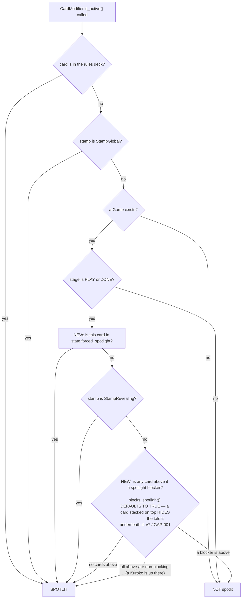

- **A6** is the entire new mechanical fork. Placed AFTER the stage check on purpose: a card that has
  left the board cannot be force-spotlit by a stale entry.
- **A7 is a property of the card ITSELF.** `StampRevealing` keeps *its own* card spotlit anywhere on
  the board, however deeply covered. It is not a statement about anything above it, which is why it
  is a separate fork from A8 and sits before it.
- **A8 REPLACES `game.is_data_topmost(data)`** — it does not sit in front of it. It is the same rule
  stated generally, as the card catalogue already assumes (`Ghost Light`, `Kuroko` — cards that do
  not block the spotlight beneath them). **Q9** decides whether it goes in now or later.
- ⚠ **`blocks_spotlight()` defaults to `true` (v7, GAP-001).** Blocking is what coverage IS: *"if
  card is covered by another card stacked on top, then that card is not active since its talent is
  hidden"*. Kuroko is the override to `false`. With everything blocking, "nothing above me" and "I
  am topmost" are the same statement, so shipping A8 changes no behaviour — which is the whole
  reason it costs nothing now. **A `false` default would light up every covered card on the board**
  and contradict U2; `PLAN.md` §1.4 shipped that mistake and is corrected.
- **One opting-out modifier is enough for its whole card.** A Kuroko stamp unhides the card beneath
  without having to convince its own card's type and suit to agree — otherwise no card could ever
  stop blocking, since every base modifier blocks.

**Q6** — does the forced spotlight bypass `blocks_spotlight` (A6 before A8, as drawn), or is a
forced spotlight still blockable? *Default: bypass — the beam is literally pointed at it.*

---

## 4. Flowchart B — activation edges (who gets told, and when)

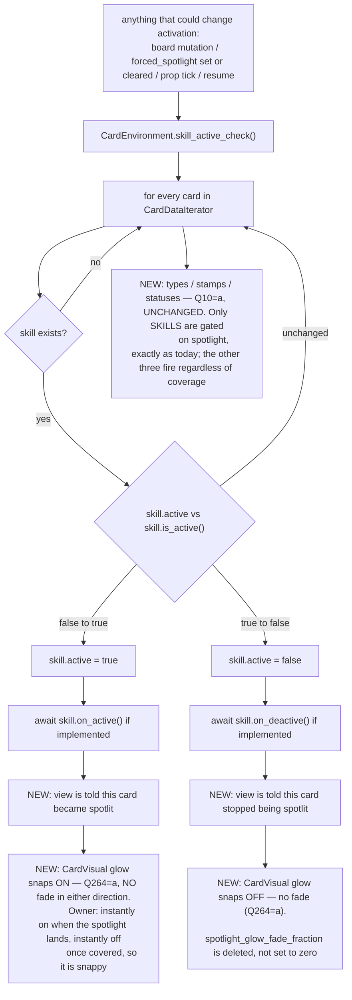

- **B14** is the asymmetry from §1.1: today only skills have an activation flag and activation
  hooks. Types, stamps and statuses fire unconditionally. **Q10** decides whether Spotlight is
  extended to gate them (a real balance change to shipped cards) or stays skill-only.
- **B10/B11** are how the glow learns. The alternative — the view polling `is_active()` per card per
  frame — is rejected: it is an O(board) walk per frame for a fact that changes on a signal.
- ⚠ Because `skill_active_check` runs after *every* mod call, a card can flicker in and out of
  spotlight several times inside one line if an effect moves cards. **Q12** decides whether the
  glow honours that literally or is damped.

---

## 5. Flowchart C — Submit, top level, with the new phases spliced in

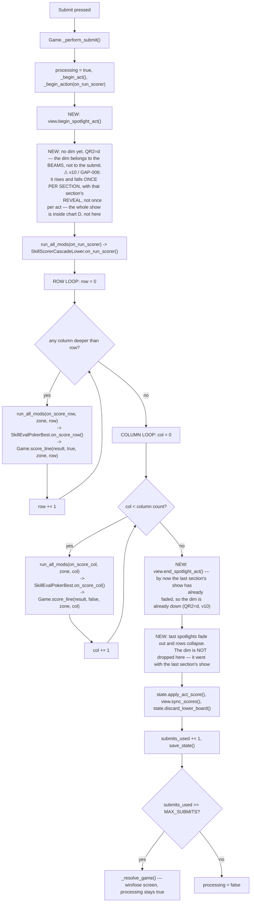

Open forks in this chart:

- **C8 empty row:** the loop breaks at the first fully-empty row. A row where only ONE column is
  deep enough still scores, and today `SkillEvalPokerBest` scores a 1-card high card. Does a 1-card
  line get the full spotlight treatment? **Q33**
- **C9 no meld:** `on_score_row` early-returns when `results` is empty, so `score_line` — and
  therefore the whole spotlight phase — never runs for that line. Is that correct? **Q34**
- **C15/C16 ordering:** the dim comes down BEFORE `apply_act_score` / `discard_lower_board`, so the
  board is still populated while the lights fall. Or after, so the discard sweep happens in the
  dark. **Q78**
- **A cancelled act** (undo mid-submit) short-circuits at `score_line`'s first line and jumps to
  `_restore_pre_act_board`. C15/C16 must still run. **Q151**

---

## 5b. Flowchart S — the TRANSIENT dim `[QR2=c]` — ⚠ NOT THE ANSWER, KEPT AS THE RECORD

⚠ **`QR2` settled at (d), not (c).** This chart was authored for the transient reading and the owner
then described something else again — *the dim is active if there are BEAMS*. It is kept because it
is the record of a branch that was offered and declined, and because §17.6b's nine questions were
written against it. **Chart C and chart D carry the live behaviour.**

Chart C above holds the dim up for the **whole submit**: it rises at C5 and does not fall until C16,
so every line of the cascade — every row, then every column — is scored in the dark. Your own words
described something else:

> *"no dim only lasts for as long as it takes for spotlight fx to spawn in, and jump up and score
> first meld, fading away back to normal lit state for everything else"*

That is a **dramatic opener**, not a lighting state. The house lights go down, the first hand is
performed under them, and then they come back up and the rest of the act runs in normal light. This
chart is that reading written out; it replaces C5 and C16 only, and nothing else in chart C moves.

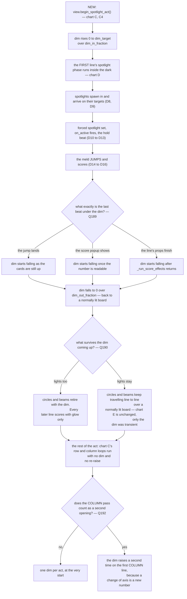

**What this chart deliberately leaves open, because it is genuinely undecided:**

- **S7 — where the beat ends.** "score first meld" could mean the jump, the number, or the props.
  Under act compression these collapse into each other, so the choice only shows at normal pacing.
  **Q189.**
- **S12 — the dim and the lights are separable.** A circle and a beam still read on a lit board;
  they just read as *bright* rather than as *the only thing lit*. Whether the whole show is
  transient or only the darkness is **Q190**, and it is the one that changes how much of chart E and
  chart H still matter.
- **S16 — the row pass and the column pass are two performances.** **Q192.**
- ⚠ **The reveal (chart I) is NOT part of this chart.** Rows expanding to uncover a buried card is
  about *visibility*, not about darkness, so under (c) it keeps running for every line unless you
  say otherwise — **Q193**.
- ⚠ **QR8 = (b) and QR2 = (c) do not compose.** QR8's (b) lights the whole board at the start of the
  submit and holds it; (c) says the dark lasts one meld. If both are chosen, the lights hold and only
  the darkness is brief — stated so it is not discovered later. **Q194.**

---

## 6. Flowchart D — ONE LINE'S SPOTLIGHT PHASE (the core of the feature)

This is the new work. It sits INSIDE `Game.score_line`, before the existing meld jump.

```mermaid
flowchart TD
  D1["Game.score_line(result, is_row, zone, index) entered"] --> D2{"act_cancelled?"}
  D2 -- yes --> D99["return — no spotlight, no scoring"]
  D2 -- no --> D3["NEW: determine the SPOTLIGHT SET for this line"]
  D3 --> D4["NEW: determine the REVEAL SET — which board rows must expand
             to make every member of the spotlight set fully visible"]
  D4 --> D5{"NEW: reveal set empty OR the skip tunable says nothing here can react?
             Q46 — the granularity is FOUR booleans, not two: expand-vs-skip for
             ROW scoring and for COLUMN scoring, each with its own can-react rule"}
  D5 -- skip --> D8
  D5 -- expand --> D6["NEW: PlayArea grows each reveal row's gap
                       to a full card, tweened over reveal_fraction"]
  D6 --> D7["NEW: the reveal does NOT complete first — Q44=b, the rows open and the
             lights arrive SIMULTANEOUSLY. The card is being uncovered as the
             beam swings onto it"]
  D7 --> D8["NEW: spotlight TRANSITION — chart E
             (assign / travel / spawn / retire), concurrent with D6"]
  D8 --> D9["NEW: await every spotlight to arrive on its target"]
  D9 --> D10["NEW: state.forced_spotlight = the spotlight set, announced to the view as
              spotlight_section_changed(cards) — THE SECTION, UNFILTERED (v10 / GAP-005:
              NOT spotlight_cued, whose Q246=a talent filter is chart T's alone).
              This section's REVEAL raises the dim (QR2=d). Per-act state, bumps nothing else"]
  D10 --> D11["await skill_active_check()"]
  D11 --> D12["on_active fires for every card that was NOT already spotlit,
               in board order"]
  D12 --> D12b["NEW: Q25=b — a handler may mutate the board IMMEDIATELY, so the set the
                sweep is walking can change under it. Q252=b: RE-DERIVE after every
                hook, which is what lets a compacted-in card activate (chart R).
                No per-section cap — Q201=b leaves only the act-level runaway guard"]
  D12b --> D13["NEW: await spotlight_hold — the beat that lets those effects read.
                Q68=a, spotlight_hold_fraction. ⚠ v10 / GAP-006: WITHOUT THIS BEAT
                THERE IS NO SHOW — the reveal and its end landed on one frame and the
                dim never left zero. Gated on 'if view:' so headless waits on nothing (Q19=a)"]
  D13 --> D13a["NEW v10 / GAP-006: spotlight_reveal_ended — THE SHOW FADES OUT HERE,
                as this section's scoring begins. The dim and every light's INTENSITY ease
                to 0 together; the light SET is untouched and the lights stay where they are,
                so chart E can travel FROM them (no spawning in and out)"]
  D13a --> D13b["NEW: Q22=b — RE-EVALUATE the hand now, ONCE (Q23=a), over whatever cards
                are in the section after every effect has fired. Q244=a: whatever it
                evaluates to is the score, including nothing at all — no floor.
                If the hand changed, the lights and jumps RE-CUE (Q243=a)"]
  D13b --> D14["EXISTING, UNCHANGED: view.animate_meld(result) -> popup_meld ->
               anim_jump per MELD card. Q265=c — only the meld jumps, exactly as
               today; the wider lit set is carried by the spotlight alone"]
  D14 --> D15["EXISTING: Game.add_line_score(...) + register_combo(...)"]
  D15 --> D16["EXISTING: view.show_meld_score(result) -> popup_score"]
  D16 --> D17["EXISTING: Game._run_score_effects(result)
               -> suit prop spawners -> run_props tick loop
               -> on_score per meld card -> on_after_score"]
  D17 --> D18["EXISTING: view.reset_meld(result) -> anim_reset"]
  D18 --> D19{"NEW: is there a next SCORING SECTION?"}
  D19 -- yes --> D20["NEW: HOLD — the forced spotlight is NOT torn down between sections.
                      It TRAVELS: it stays up for the whole act (Q16) while its MEMBERSHIP
                      moves to whichever section is being scored — Q16, 'increases or
                      decreases based on cards being scored'. It does NOT accumulate;
                      a section that has been scored is no longer force-spotlit.
                      Rows stay expanded. ⚠ v10 / GAP-006 CORRECTS WHAT WAS HERE: the dim
                      does NOT stay up between sections — this section's show already faded
                      at D13a. The lights survive, dark, at their positions; the next
                      section RE-REVEALS, which travels them and raises the dim again.
                      'Visible again, moving to new location, then fade away again.'
                      v7 / GAP-002, v10 / GAP-006"]
  D20 --> D21["the next section re-enters at D1;
               chart E decides what travels where"]
  D19 -- no --> D22["NEW: clear state.forced_spotlight"]
  D22 --> D23["await skill_active_check() -> on_deactive for the released cards"]
  D23 --> D24["NEW: collapse every expanded row over reveal_fraction"]
  D25["NEW: retire every spotlight — and the dim falls WITH the last beam, because
       it belongs to the beams and not to the act (QR2=d). The act's own teardown
       still follows in chart C: rows collapse, then the board is swept"]
  D24 --> D25
```

### The forks inside D

- **D3 — what is in the spotlight set?** Whole line vs meld only vs "only cards that can react".
  **Q31, Q32, Q35–Q42.**
- **D5 — the skip tunable.** Owner: *"Make that a tunable for row and col separately to skip
  expanding a row if there is no inactive spotlight card to activate."* Two independent booleans.
  What counts as "can react" is **Q47** and it is subtle: a card with no `on_active` handler at all
  cannot react, but a card whose handler is conditional might.
- **D10 vs D12 ordering.** The forced flag is set for the WHOLE set at once, then one
  `skill_active_check` sweep fires every `on_active` in board order. The alternative — set and
  activate one card at a time, so the beams light up one after another — is **Q37**.
- **D12 side effects.** An `on_active` handler may move or discard cards. That mutates the very line
  being scored, AFTER the meld was already evaluated by `SkillEvalPokerBest`. **Q22–Q26.**
- **D13 hold.** Owner: *"triggering spotlight effects first before any scoring happens."* The hold
  is what makes that readable. Length is a tunable fraction; **Q68**.
  ⚠ **v10: it is also the only thing separating the reveal from its end.** Set it to 0 and the show
  has no duration at all — measured, before it existed: `revealed` and `reveal_faded` on one frame.
- **D13a fade-out — new in v10 (GAP-006).** The show is an axis of its own, `_show`, multiplying the
  dim target and every light's intensity. **It does not touch the light set**, which is what keeps
  chart E buildable. Whether the pulse READS as a spotlight or as a flicker at compressed act speed is
  untuned and is the tuning tool's (chart L / S18) first job.
- **D19/D20 hold-through.** Not collapsing between lines is what makes the light *travel* instead of
  strobing. But it means rows expanded for row 0 stay expanded while row 1 scores — the board keeps
  growing through the cascade. **Q49, Q50.**

---

## 7. Flowchart E — the spotlight transition between lines

The rule from the brief: *"spotlights spawned during scoring phase need to move their spotlights to
next row/col after done with current set, no instant movements or spawning in and out."*

⚠ **v10 — where P comes from, and what state it is in.** The previous set P is whatever
`spotlight_section_changed` last carried (GAP-005 — the SECTION, not the talent cue), and by the time
the next section arrives P's lights are still alive but FADED: GAP-006's show axis took their
intensity to 0 without freeing them. **That is deliberate and this chart is the reason** — travel
needs somewhere to travel from. So E2's `P ∩ N` and E4's "spawn a new light" are still exactly as
drawn; what changed is that a light being invisible does not mean it is gone.

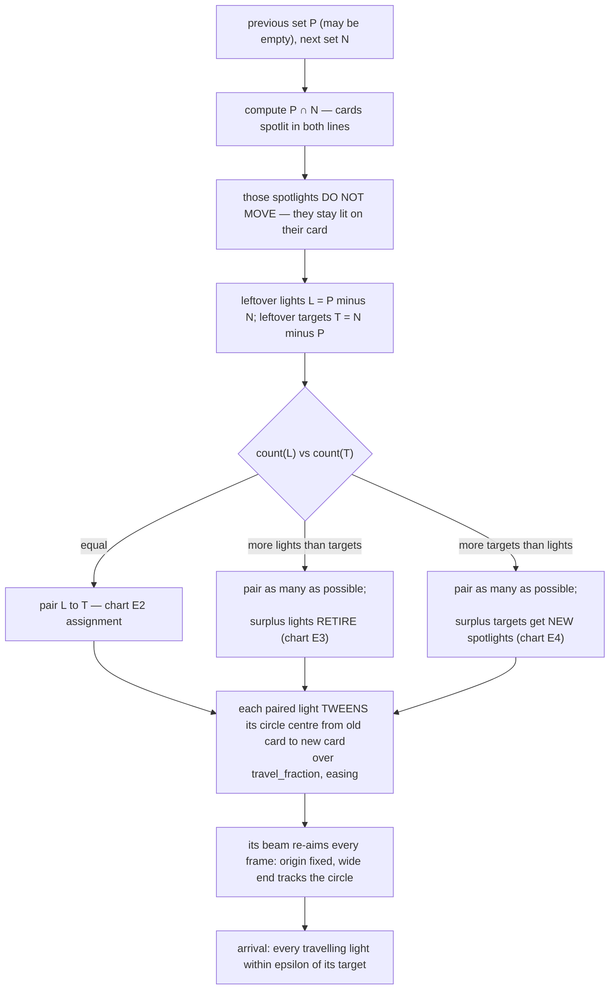

**E2 — the assignment rule** (which leftover light goes to which leftover target):

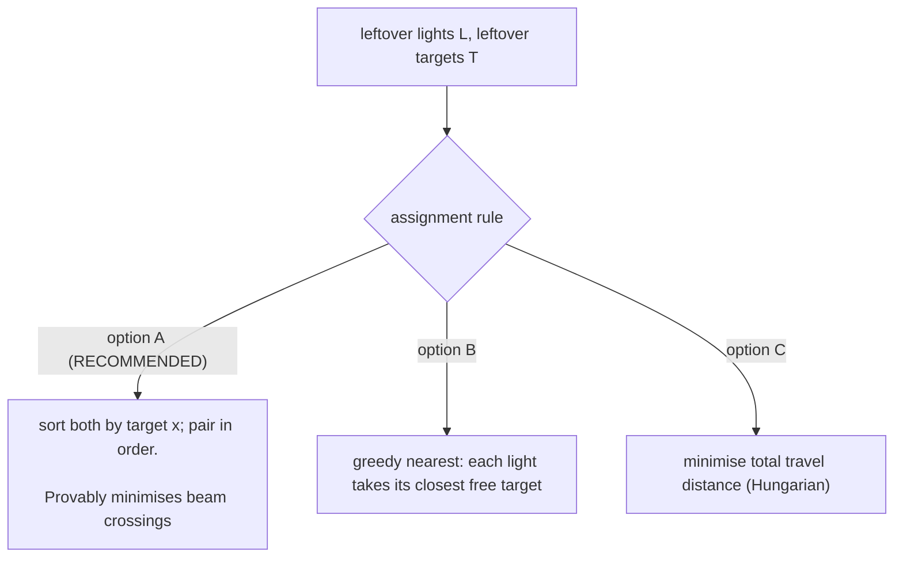

**E3 — retiring a surplus light:** fade the circle and beam to zero over `retire_fraction`, in
place, on the card it was already on. Its ORIGIN is released back to the allocator (or not — **Q109**).

**E4 — spawning a new light:** the allocator hands it an origin (chart G), then it either
(i) fades in already aimed at its target, or (ii) travels in from the origin down the beam.
**Q65.**

Unanswered structure in E:

- **Q61** — is E3 (same card spotlit in two consecutive lines keeps its light) right, or should the
  whole set re-shuffle every line so the lights spread evenly?
- **Q63** — a light that travels: does its circle shrink/dim in transit, or hold full size?
- **Q64** — do lights travel simultaneously, or staggered left-to-right?
- **Q66** — a travelling light passes over cards that are not its target. Do they flicker as it
  crosses, or is the circle only "on" at its endpoints?

---

## 8. Flowchart F — what a card looks like, moment by moment

A card's appearance is the composition of five independent inputs. This chart is the truth table.

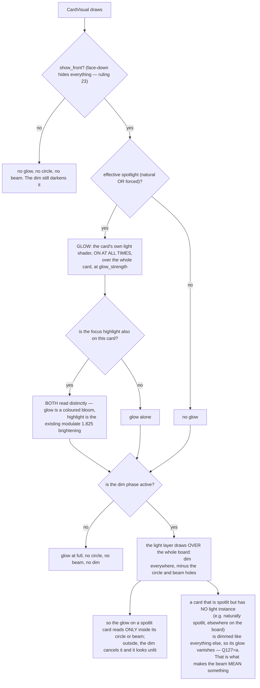

- **G6** — owner: *"cards under spotlight effect have glow shader at all times on entire card.
  Circle and beam parts are only visible during dim screen."*
- **G8** — owner: *"cards under spotlight effect get lit up by shader separately from hover
  highlight, so we know it is active even when covered up it should be visible that card is both
  spotlighted and highlighted."* The two must be distinguishable when both are on: **Q121–Q124**.
- **G13** falls out of the layering for free: the glow lives on the card, UNDER the light layer, so
  the dim multiplies it. No extra machinery needed. This is why the light layer is one screen-space
  surface and not a pile of per-beam nodes.
- **G14** is a real decision, not an oversight: a card that is naturally spotlit (uncovered,
  anywhere on the board) glows all the time — but during the dim phase, with no beam on it, it
  goes dark like everything else. **Q127.**

---

## 9. Flowchart G — the light layer's render model

One full-screen surface. It is handed a list of live spotlights and produces the dim, the circles
and the beams in one pass.

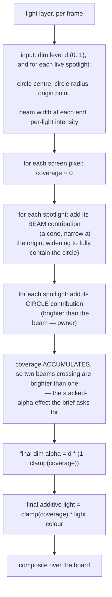

Consequences of this model, stated so they can be rejected:

1. **Everything under the layer is dimmed uniformly** — cards, props, the score popups, the prop
   simulation and the HUD. ✅ **SETTLED v9 (GAP-004): the layer is above ALL of them and there are no
   exemptions.** `Q74`–`Q76` are withdrawn; `Q73`=(a) and `Q77`=(a) already said yes.
2. **Overlaps get brighter for free** and cannot be turned off independently of the model. If two
   beams cross, that region is brighter than either alone; if the sum exceeds 1 the dim is fully
   punched through and the additive term keeps climbing (or clamps — **Q101**).
3. ⚠ **There is NO hard cap — Q107.** Owner: *"No cap. soft cap at how many cards can fit on
   screen."* The uniform array is therefore sized to the widest board the game can actually put on
   screen at once, and the design may not lean on a smaller number. `spotlight_max_lights` in §16 is
   that bound, not a policy.
4. The layer does NOT scroll with the board; it is screen-space. The spotlight positions it is fed
   are converted from board space every frame, which is what makes chart H work.
5. ⚠ **ROUND 1 BROKE THIS MODEL — §0b C1.** Q102: *"same as other props and vfx. in front of card it
   is effecting, but not in front of other objects in front of card."* One screen-space surface has
   exactly one depth. It is drawn over everything or under everything; it cannot be above card X and
   below the prop that sits on card X, because "above X" and "below X's prop" are two different
   positions in a draw order that is 100 % structural with `z_index == 0` everywhere (LAYERING.md).
   The beam has to stop being one surface, or stop being screen-space, or Q102 has to give.
   **Q240–Q242.**

---

## 10. Flowchart H — beam origins, the allocator, and scrolling

The brief's rules, restated: origins are spread evenly across the top of the screen; extra
spotlights take midpoints between existing origins, chosen randomly; when the midpoints run out, the
set doubles and the process repeats.

⚠ **Two round-1 answers changed this chart and the fourth rule is gone.** `Q113`=(d): the origins are
**not a line** — *"no beam origins should have identical y level even if target cards have identical
y level on same row"* — so each carries a deterministic y scatter (`Q250`=a). And *"an origin never
moves once assigned"* is now false in one case: `Q251`=(b) with `Q262`=(a) re-spreads x **every frame
while the origin is above the viewport**, because an origin you cannot see costs nothing to move. It
is pinned again the moment it comes back on screen, which is the promise `Q164` actually keeps.

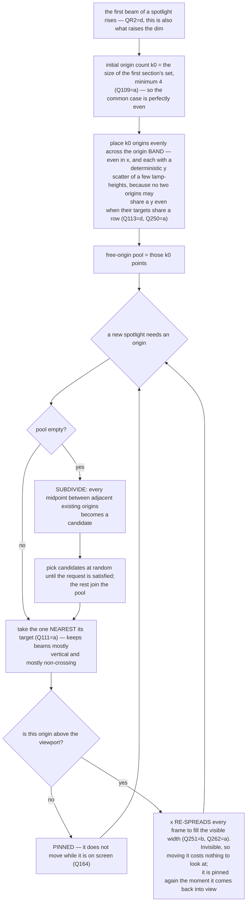

**The origin line itself** is the hard part, and the brief contains two readings that cannot both
be true. Reading them out:

- *"beam origins spread out from across top of screen"* + *"dummy screen size to dictate beam
  origins"* → the origin line is the **top edge of the viewport**, in SCREEN space.
- *"We fake beam origins are static points along board length, so as we scroll down, beam circle
  and origins disappear upwards, new beams and circles spawn from bottom sides of screen and move
  upwards as we scroll down"* + *"fake origin is always higher than its spotlighted card location"*
  → the origin line is a horizontal line in **BOARD/content space**, a fixed distance above the
  card it lights, and it scrolls with the board.

Three concrete models were written out for **Q113**. ✅ **ANSWERED: (d), a refinement of MODEL 2** —
content-anchored, plus the x re-spread and the y scatter above. The chart is kept because it is the
record of what was rejected and why, but the choice is made: **Model 1 is not built** (and `Q118`,
its long-beam mitigation, is pruned with it), and **Model 3 is not built**.

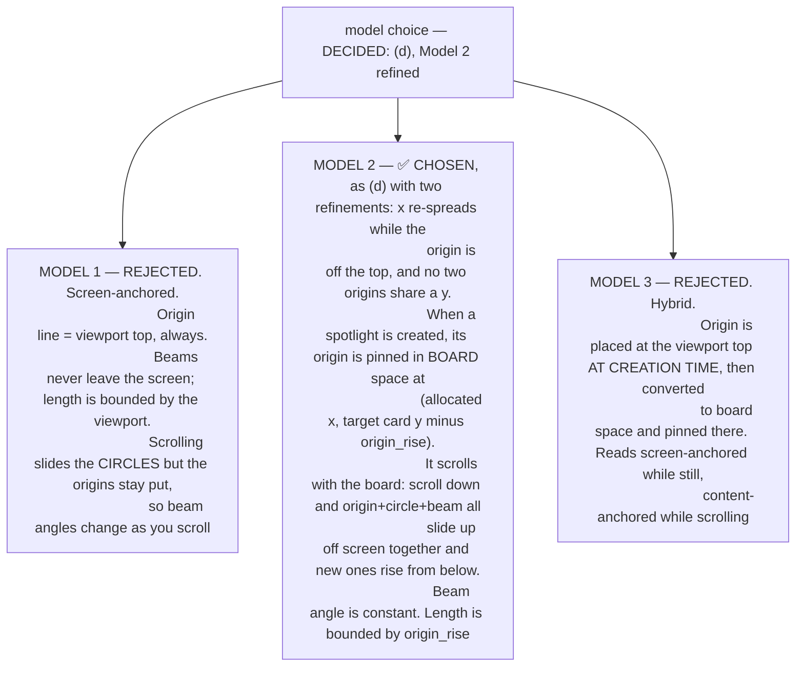

**Deep boards.** The brief flags it: *"if board is extremely deep, spotlights can be extremely far
away and cause incredibly long beams."* Under Model 1 a spotlight 4000 px down the board produces a
4000 px beam at a near-vertical angle. Under Models 2 and 3 the beam is always `origin_rise` long,
which solves it structurally. If Model 1 is chosen, the mitigation is **Q118**.

**Scroll behaviour during the dim phase** is **Q115–Q117**: whether the board auto-scrolls to keep
the scoring line on screen, whether the player may scroll at all while scoring, and what a spotlight
whose target is entirely off screen does.

---

## 11. Flowchart I — the reveal (per-row expansion)

```mermaid
flowchart TD
  K1["spotlight set for this line is known"] --> K2["for each spotlit card, walk its COLUMN upward:
                                                    every card at a HIGHER z in that column
                                                    is covering it"]
  K2 --> K3["the row that must expand is the spotlit card's OWN row z:
             growing the gap below row z pushes rows z+1.. down"]
  K3 --> K4{"is the spotlit card already the last card of its column?"}
  K4 -- yes --> K5["already fully visible — no expansion needed for it"]
  K4 -- no --> K6["mark row z as a reveal row"]
  K6 --> K7{"apply the expansion to EVERY column, or only to
             columns that actually have a card at row z?"}
  K7 -- "every column (RECOMMENDED)" --> K8["rows stay straight across the board;
                                             short columns simply have nothing to push"]
  K7 -- "only occupied columns" --> K9["the board goes ragged: row z+1 sits at different
                                        heights in different columns"]
  K8 --> K10["the reveal row's control height grows, tweened — by the DERIVED amount at K10b,
              never to a fixed full card height"]
  K10 --> K10b["⚠ v13 / GAP-009 — HOW FAR IT OPENS IS A CHOICE BETWEEN TWO FIXED FORMULAS, and the
                DERIVED 'no visible gap, sized from the lowest ___' model is RETIRED. Owner
                2026-08-05: sizing from the lowest card meant a FLUSH (every card lit and jumping)
                lifted rows with nothing to do with the scored set. spotlight_separation_mode:
                CARD_HEIGHT = one full card height, or JUMP_ADJUSTED = card height minus jump
                height, which leaves a non-jumping card slightly covered. Q43=a is NO LONGER
                superseded — it is the CARD_HEIGHT mode"]
  K10b --> K10c["⚠ AND THE DUCK IS COMPUTED ONCE, NOT LIVE-TRACKED. Worked out from the geometry
                 at the moment the duck begins; once finished it stops tracking card bottoms, so
                 a card moving afterwards may open a gap under it and that is accepted"]
  K10d["✅ RESOLVED, GAP-009 (owner 2026-08-05) — the question 'lifted, lit, or the larger' is MOOT:
        the opening is no longer sized from any card. Both modes are fixed amounts computed from the
        card metrics, so a lit non-meld card is either fully uncovered (CARD_HEIGHT) or slightly
        covered (JUMP_ADJUSTED), by the owner's choice rather than by which card sits lowest"]
  K10c --> K10d
  K10d --> K11
  K9 --> K10
  K10 --> K11["cards below ease down to their new anchors —
               CardVisual.delta_self_moving_logic already smooths this for free"]
  K11 --> K12["the ROW SCORE GUTTER labels for that row must grow identically
               or the score numbers desync from their rows"]
  K12 --> K13["PlayArea.slot_center_global must account for the expansion
               or every prop anchored to a row below it lands in the wrong place"]
  K13 --> K14["the scroll content grows taller; see chart H for what that does to the view"]
```

- **K3** is the geometry from §1.2: cards at higher z are drawn later and lower, i.e. "on top" both
  in draw order and in the sense the brief uses. Expanding *this* row's gap pushes *those* away.
- **K7** — the brief says row scoring expands that one row and column scoring expands *every*
  participating card's row ("which yes means expanding entire board if that column is longest").
  Whether the expansion is board-wide per row is **Q51**.
- **K12/K13** are the two things that will silently break if not designed for; both are called out
  as questions (**Q57**, **Q59**) rather than assumed.
- **K10** — full card height, or only enough to clear the art square (which is what the circle
  needs)? The art square's bottom edge is 102.5 px down, so ~103 px reveals the circle but leaves
  the card's bottom 22 px covered. **Q52.**

---

## 12. Flowchart J — interruptions and edge cases

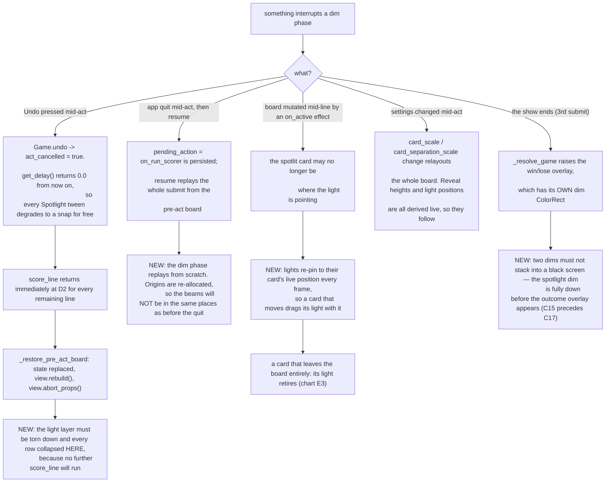

Additional edge cases enumerated as questions rather than drawn:

- Headless (`view == null`): the mechanical spotlight must fire identically, with zero visuals and
  zero waits. **Q19.**
- Act compression: after ~50 activations `get_delay()` shrinks toward zero and past
  `compress_soft_calls` it is exactly 0. A long cascade's spotlight phases become instant.
  **Q158.**
- The runaway cap (`act_event_cap`) cuts an act short. **Q159.**
- A card grabbed by the player while the board is not processing — irrelevant during scoring
  (input is locked) but relevant to the natural spotlight glow. **Q145.**
- Two spotlights land on the same card (a card in both a row set and a col set — impossible within
  one line, possible across lines). **Q62.**

---

## 12b. Flowchart R — a spotlit card is DISCARDED mid-line: compact and follow `[Q24=c]`

Q24 asked what happens when an `on_active` handler discards a card that is in the meld, and offered
"its light retires" or "recompute the score". You wrote a third thing:

> *"card discards, removed from meld, card stacked above in same column slides into discarded card's
> place and spotlight now follows that card and goes through activation process"*

That is a **follow**, not a retirement: the hole closes and the light stays on the slot rather than
on the card. It is now Q24 option (c) and the recommended default.

**The slide is already free, and that is the good news.** A column is `ArrayCardData.datas`, a plain
`Array` — `Game.is_data_topmost` reads `vec3.z == zone_col.datas.size() - 1` (`Levels/game.gd:613`).
Erase the entry at `z` and every card at a higher `z` shifts down one index by itself. Higher `z`
draws later and covers (§1.2), so the card that *was* covering the discarded one is exactly the card
that lands in the vacated slot. Nothing has to be written to make cards slide; what has to be
decided is what the **light** and the **activation** do about it.

```mermaid
flowchart TD
  R1["on_active handler discards a card at column c, row z, during line L"] --> R2["the card leaves the board:
                                                                                  zone_col.datas.erase — every card
                                                                                  at higher z shifts down one index"]
  R2 --> R3{"was the discarded card the LAST of its column?"}
  R3 -- yes --> R4["nothing was covering it, so nothing slides in.
                    The card now at z-1 becomes topmost and NATURALLY spotlit —
                    but it is in row z-1, so it is NOT part of this section.
                    Q199=a — the light retires rather than following downward"]
  R3 -- no --> R5["the card that was at z+1 is now at z:
                   it occupies the discarded card's slot AND its row"]
  R5 --> R6["⚠ THE SCORE MOVES. Q22=b re-evaluates the meld after every
             spotlight effect has fired (Q23=a, once), so the discarded card
             does NOT still score and the hand may be a different hand — C2"]
  R6 --> R7["the discarded card's JUMP is skipped: its visual is gone by D14"]
  R8["its light does NOT retire, and Q200=c means it does not MOVE either:
       the light is pinned to the SLOT, and the replacement card arrives
       underneath it. Nothing has to travel"]
  R7 --> R8
  R8 --> R9["the new occupant joins the line's spotlight set and is force-spotlit"]
  R9 --> R10["skill_active_check runs — it already runs after every mod call, §1.1 —
              and fires on_active on the new occupant"]
  R10 --> R11{"that handler discards a card too?"}
  R11 -- yes --> R12["re-enter at R1. A cap is needed or a column can unzip
                      itself in one line. Q201=b — NO per-section cap: only the
                      act-level runaway guard bounds it"]
  R11 -- no --> R13["the line continues at D13, the hold beat, with the
                     original meld and a changed board"]
  R4 --> R14["every card BELOW the discard in that column also moved up one row.
              Q202=a — and note the direction: compaction pulls cards UP, into the
              section being scored now or into ones still pending, so nothing is
              skipped there. Only a discard in a row the cascade already PASSED
              moves cards into scored rows"]
  R13 --> R14
  R14 --> R15["the reveal rows were computed at D4 against the OLD indices.
               Q203=a — they are RE-DERIVED and re-tweened; the board settles into its
             new shape mid-section rather than holding a stale gap"]
  R15 --> R16["the column is one card shorter, so the board is shorter:
               every reveal below it, every prop anchored below it, and the
               scroll extent all move — chart I, K13"]
```

**Where this is load-bearing, stated so it can be rejected:**

- ⚠ **R6 WAS the whole reason this was cheap, and round 1 took it away.** This chart was written
  under Q22 = (a), *"the meld is fixed before the spotlight phase"*, and said in as many words: *"if
  Q22 is ever changed to (b), R6 becomes a contradiction and this chart needs rewriting."* You
  answered Q22 = (b). So the score is now re-evaluated once, after every spotlight effect has fired
  (Q23 = a), over whatever cards are in the section by then — which means the compaction does not
  just replace a light's target, **it changes the hand**. A pair broken by a discard and re-made by
  the card that slid in is a different score, arrived at during the animation that was showing you
  the first one. **Q243 and Q244** decide what the player sees while that happens.
- **R8 vs Q160.** Q160 said *"a card's visual is freed mid-line → its light retires"*. That is the
  opposite of this, and it was written before you answered. Q160 is re-gated so it only asks about
  the case R3/R4 covers — a discard with nothing to slide in.
- **R11 is the one that can hurt.** Every activation runs `skill_active_check` again, so a chain of
  discards is a loop with no natural bound. Fire it too eagerly and a single spotlight can strip a
  column. `act_event_cap` catches a true runaway but at act granularity, not line granularity.
  **Q201.**
- **R14 is the quiet one.** The compaction moves every card below the discard **up one row**, and
  the row loop in chart C is still counting. A card that was in row 4 is in row 3, which the cascade
  has *already scored*. **Q202** is whether that card is scored twice, or skipped, or neither.
- ⚠ **This chart is about a discard caused by `on_active`.** A card removed by any other route
  mid-line (a prop, an `on_score` effect firing later in the same line) hits the same board
  mechanics. Whether it gets the same follow behaviour is **Q205**.

---

## 13. Flowchart K — the non-scoring spotlight (normal play)

Everything above is the scoring cascade. The glow also has a life outside it.

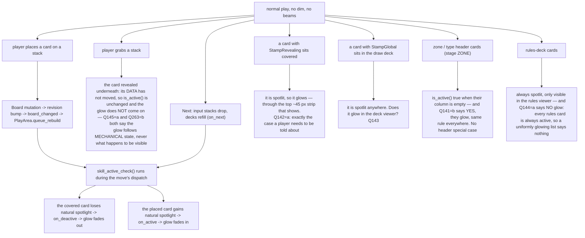

---

## 13b. Flowchart T — the MOMENTARY spotlight, outside scoring `[Q149=b]`

Round 1 promoted this from a "not in this plan" footnote to the feature's main case:

> *"yes when a card becomes active at anytime it triggers momentary spotlight effect"* (Q149) ·
> *"Spotlight is used whenever card is entering active state and for highlighting cards about to
> score"* (Q107) · *"spotlight should show first time a card becomes active which has active hook.
> If a card in active slot which no active gains an active effect somehow, it should still trigger
> momentary spotlight to show it has become active"* (QR5's note)

So the spotlight is not a scoring effect that also glows. **It is an activation cue, and scoring is
the case where a lot of them fire at once and then travel.** Chart M (§13) drew the glow's life
outside scoring; this draws the *spotlight's*.

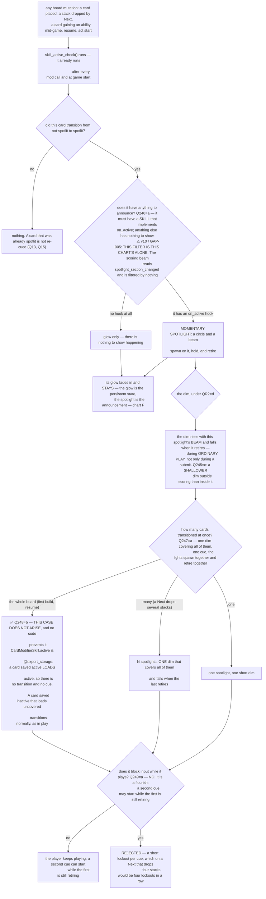

**What this chart makes true that v1 and v2 did not:**

- **Chart D is no longer the entry point.** Scoring calls the same spotlight machinery every other
  activation calls; it differs only in that it force-spotlights a whole section at once and holds
  the lights between sections. §12's chart C becomes *a* caller.
  ⚠ **v10 qualifies this and it is the whole of GAP-005: "the same machinery" is the LIGHT LAYER, not
  the same SIGNAL.** Two signals reach it — `spotlight_cued` (this chart, `Q246`-filtered, S15) and
  `spotlight_section_changed` (the scoring beam, unfiltered, S14). Building the beam on this chart's
  cue is what left the running game with no visible spotlight at all.
- **T14 is the one that will bite.** At the start of a game, and on every resume, `skill_active_check`
  runs over the whole board and every uncovered card is a fresh transition. Under a literal reading
  of Q149 that is a spotlight on every column at once, with the dim up, before the player has done
  anything. **Q248.**
- **T5 matters because of your own words**: *"a card ... which has active hook"*. A card with no
  `on_active` has nothing to announce, and cueing it would make the cue meaningless. But Q10=(a) says
  only skills are gated on spotlight, so "has a hook" has to mean *has a skill with an `on_active`* —
  **Q246** pins it. ⚠ **v10 / GAP-005: and it pins it for THIS chart only** — the scoring beam asks a
  different question (*which cards are being scored*) and takes no filter at all.
- ⚠ **This is the same machinery Q186 asks for.** *"show all active abilities spreads out all rows
  with active talent/skill and uses spotlight effect on all of them with no dimming at all until
  turned off"* — that is chart T's cue, held open, with the dim suppressed. It is in scope (Q186),
  and it is evidence that the dim and the spotlight really are separable, which is what QR2=(d) says.

---

## 14. Flowchart L — the tuning tool

The brief asks for two things that are not the same tool:

- *"add new editor similar to fx editor as effect in next column with parameters for tuning, with
  dummy card stack simulating exactly how it looks in game, and dummy screen size to dictate beam
  origins"*
- *"should be like fx editor, but simulate every possible usage of spotlight with a stubbed game
  view gameplay going through every possible usage of spotlight. Include a way to select which type
  of usage is being tested."*

The first is a tuning column; the second is a scenario player. **Q173** picks one, both, or a
staged pair. The standing project rule that decides most of the rest: *no mocks in tools — the tool
hosts the real scene and real data* (this is why `fx_editor` stands up a real `CardVisual` and real
`PropVisual`s).

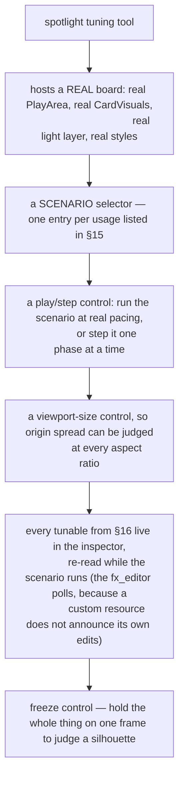

**Scenarios the tool must be able to play** (this list is itself reviewable — **Q182**):

| # | Scenario | What it proves |
|---|---|---|
| S1 | One shallow row, every card already uncovered | The no-expansion path |
| S2 | One row where every card is buried under 3 | The full reveal, board-wide |
| S3 | Row scoring across 5 rows in sequence | Travel between lines, hold-through |
| S4 | Column scoring on the longest column | The whole-board expansion case |
| S5 | Rows then columns, full cascade | The complete act |
| S6 | A line with more spotlights than initial origins | The subdivision allocator |
| S7 | A very deep board, scoring a row near the bottom | Long beams / scrolling |
| S8 | Two spotlights on stacked cards in one column | Unavoidable beam overlap |
| S9 | A card with StampRevealing / StampGlobal in the line | Already-spotlit skip logic |
| S10 | An `on_active` effect that moves a card mid-line | Lights re-pinning |
| S11 | Undo pressed mid-cascade | Snap-and-teardown |
| S12 | Normal play, no scoring | The glow-only path |
| S13 | Hover + spotlight on the same card | The two highlights reading distinctly |
| S14 | `fx_intensity = 0` | The accessibility floor |
| S15 | **The circle at full intensity, held on one frame, over the busiest card face the game can build** | **The readability constraint (§14b.3) — the only way to judge ask 2** |
| S16 | **A discard mid-line that compacts a column** | Flowchart R — compact-and-follow |
| S17 | **The transient dim, at NORMAL pacing** | Flowchart S — where the beat ends is invisible under compression |

---

## 14b. Flowchart O — THE GLOW SHADER `[QR5≠c]`

The v2 braindump, restated as its three asks:

1. *"glow shader I want for both generic node2d like cards and props **and** the spotlight circle
   that will go over cards"* — **one shader, three clients.**
2. *"it cant be too bright and circle needs transparency since glowing object still needs to be
   readable"* — **the art under the light must stay legible.** This is a hard constraint, not a
   preference, and it is what rules out the obvious implementation.
3. *"Should overlap object similar to current fire shader with shader vfx going off edge of card,
   but **can** overlap object pixels unlike fire shader"* — **reach past the silhouette like fire,
   but draw over the art instead of being cut at it.**

### 14b.1 The unification, and it is smaller than it looks

Ask 1 sounds like three effects. It is one, because of a shape the fire shader already has: fire is
not "a card effect" — it is a field computed from a **mask**, and `mask_level()` has one branch per
mask kind (box / the host's own 24-vertex outline / a sprite's alpha / a disc, for balls). The
braindump's own pseudocode has the same shape and calls it `uLightMask`.

So: **the glow is a light field over a mask, and the three clients differ only in which mask.**

| Client | Mask | Where the quad lives |
|---|---|---|
| A glowing card | the host's **exact deformed outline** — Q124=(b), `SHAPE_RADII`, the 24-vertex mask | the card's `FxAttachment` |
| ~~A glowing prop~~ | ~~the art's alpha~~ | ⚠ **CUT by round 1 — §0b C7.** Q221: *"should be three card circle beam, no prop."* Props do not glow. Q219 says a prop is lit *"only if crossing the lit up portion on same layer"* — that is incidental illumination by the beam, a different mechanism. **Q257, Q258** |
| **The beam** | a cone between origin and target | the light layer — but see §0b C1 |
| **The spotlight circle** | a **disc** of `circle_radius`, centred on the card's art square | QR9=(c): **one shader, two hosts** — the circle's quad stays on the light layer |

That is one new shader, one `FxGlowStyle`, three `.tres` (card, circle, beam — Q221), and one extra
mask branch.

⚠ **The braindump said "cards and props" and round 1 said cards only.** That is worth being sure
about: it means a burning prop and a spotlit card no longer share a lighting language, and it means
`FxAttachment`'s genericity — the thing that made this cheap — is only used by one client. It is **not** a second copy of
the fire shader: fire's cover field asks *"how far above the nearest surface below me"* (directional,
`u_taps` downward taps); a glow asks *"how far from the mask am I, in any direction"*, which is a
different and — for the shapes that have one — cheaper question.

### 14b.2 The model

```mermaid
flowchart TD
  O1["glow quad: host body plus reach, one per host — same sizing as fire, FxRequest.reach"] --> O2["body_near early-out:
                                                                                                    reject the empty corners of the quad
                                                                                                    before any lookup — worth 2.1x on fire"]
  O2 --> O3["p = fx_local(UV, extent, pixel) — quantized on the HOST'S ORIGIN, never rotated"]
  O3 --> O4{"which mask? — see 14b.1"}
  O4 -- "host silhouette" --> O5["d = signed distance from p to the mask, measured against the host's
                                 EXACT deformed outline — Q124=b, the 24-vertex mask the fire
                                 shader already carries. Not a rounded rect"]
  O4 -- "disc (the circle)" --> O6["d = length(p - centre) - circle_radius.
                                   One subtraction. This is why the circle is the CHEAP client"]
  O5 --> O7["falloff(d): mix of a smooth curve and inverse-square, per the braindump.
             Inverse-square is what makes the core read HOT instead of foggy"]
  O6 --> O7
  O7 --> O8{"how many layers? Q207 — between 2 and 4, and it is a KNOB:
             owner picks by eye rather than the design fixing it"}
  O8 -- "one" --> O9["intensity = falloff(d) * gain"]
  O8 -- "L layers" --> O10["intensity = sum over layers of falloff(d / radius_i) * gain_i,
                           the multi-exposure simulation — each layer its own reach and gain"]
  O9 --> O11["radial COLOUR SHIFT: core to mid to edge — a RAMP SAMPLE on intensity,
              exactly where fire samples u_ramp.
              ⚠ CORRECTED v8 / GAP-003: the ramp is an OFF-PALETTE Gradient, NOT a PaletteRamp.
              Q134=b, Q135=b and Q214 all grant light off-palette freedom; this node used to
              argue the opposite from a premise those answers had already overturned.
              Light is the ONE exception to the palette contract, and it does not travel"]
  O10 --> O11
  O11 --> O12{"is this fragment OVER the host's own art?"}
  O12 -- no --> O13["outside the silhouette: the halo. Draws at full alpha —
                     this is the part that hangs off the card's edge"]
  O12 -- yes --> O14["over the art: draws at inner_alpha — the lever fire ships at the opaque end
                     and this effect exists to use. Q216=d: START LOW (~0.35) and tune it
                     by eye against scenario S15, the circle over a real card face"]
  O14 --> O15["⚠ the over-art test is done at the UNQUANTIZED position, so the art's own
               edge slices the chunky glow pixels instead of a staircase — fire paid for
               this lesson twice, for cards and again for props"]
  O13 --> O16["dither on the FX PIXEL GRID (never FRAGCOORD) to break the ramp's bands"]
  O15 --> O16
  O16 --> O17["COLOR = ramp sample * brightness * fx_intensity, alpha * opacity * inner_alpha"]
  O17 --> O18["multiply the host's MODULATE back in — or the focus highlight
               never reaches the glow, which is exactly Q121's problem"]
  O18 --> O18b["⚠ Q121=b — the FOCUS HIGHLIGHT is being changed too, so that glow and
                highlight read distinctly on the same card. Not a glow-side fix alone"]
  O18b --> O19{"blend mode — Q218: (c) additive OUTSIDE the card, tinted OVER the art,
                PROVIDED that produces no visible seam between the two. If it does,
                tint everywhere. Never blow out to white"}
  O19 -- "additive, outside the silhouette" --> O20["light adds. Bright, correct for a lamp, and
                             harmless out here because there is no art under it"]
  O19 -- "tinted, over the art" --> O21["light tints. Keeps the card's contrast and cannot blow out —
                                            which is what keeps the rank glyph readable. ⚠ If the
                                            join between O20 and O21 shows a seam, tint BOTH"]
```

### 14b.3 The readability constraint, taken seriously

Ask 2 is the one that decides whether this looks right, so it is written out rather than left to a
tuning pass:

- **A canvas quad cannot brighten what is under it.** With no screen read (§1.6, fact 1), the only
  blends available are add, mix, sub and mul. A light is add or mix. **Add is what "light" means and
  add is what destroys legibility**: adding a bright value to a dark pixel and to a light pixel moves
  both toward the light colour, so the ink and the paper converge and the rank glyph disappears
  first, because it is the smallest dark feature on the card.
- **Which means "not too bright" is a contrast budget, not a brightness knob.** The honest form of
  the constraint is: *the darkest pixel of the card art, plus the glow, must stay some distance below
  the lightest pixel plus the glow.* Since add moves both by the same amount, contrast is preserved
  in absolute terms and destroyed in **relative** terms — and perception is relative. That is why
  `inner_alpha` exists as a separate knob from `brightness`: the halo outside the card can be as
  bright as it likes, and the part over the art is what has to be held down. **Q216** sets it.
- ⚠ **The circle is the worst case, not the card glow.** A halo around a silhouette barely covers
  art at all; the spotlight circle is `r = 16` art units centred on the card's own 32×32 art square
  (§1.2), so it covers **the whole art square and nothing else**. Whatever the answer to ask 2 is,
  it is decided by looking at the circle over a real card face, not at a glowing card.
- **This is a case for the eye, not for the tuning table** (project rule 4: verify visuals by eye).
  The scenario the tool must be able to hold on one frame is *the circle at full intensity over the
  busiest card the game can build* — added to §14's scenario list as **S15**.

### 14b.4 What "overlap like fire, but over the pixels" means precisely

Fire's relationship to its host is governed by two knobs that pull in opposite directions:

| Knob | Fire's value | What it does | The glow wants |
|---|---|---|---|
| `u_sink` | `2.0` | how far *into* the art the effect is allowed, as an **erosion of the mask**. Positive sinks the base below the surface so there is no seam; negative lifts the flame clear so it covers no art at all | positive, and larger — the glow starts *inside* the silhouette |
| `u_inner_alpha` | `1.0` (opaque; the lookup is skipped whole) | the alpha the effect draws at **where it covers the host's art** | strictly between 0 and 1 — this is ask 3 |

So ask 3 — *"can overlap object pixels unlike fire shader"* — is **exactly `inner_alpha < 1`**, a
uniform that already exists, is already documented, is already wired through `FxStyle.apply()`, and
that no shipped style uses because the owner ruled seeing art through flame *"looks very bad"*. The
glow is the effect it was written for. No new mechanism.

---

## 14c. Flowchart P — the film-light pipeline `[QR10≠c]`

The braindump's Part 1 §§3–7 (halation, bloom, film emulation, imperfections, HDR) and most of its
pseudocode are **not a shader on a card**. They are a full-screen post-process over the finished
frame. This chart separates what can be done inside the glow quad from what cannot, so the two are
not accidentally scoped as one job.

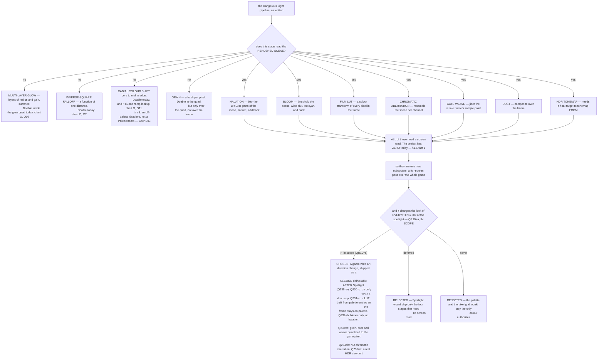

**The three collisions to weigh before answering QR10**, none of which is fatal and all of which are
real:

1. **A LUT and a fixed palette are two authorities on colour.** §4i says every colour resolves to a
   named entry of one N×1 image and ramps SAMPLE rather than lerp; a film LUT remaps arbitrary
   colours to arbitrary colours. Applied over the frame, it takes the game **off palette
   everywhere** — which may be the intent (it is a *look*), but it is the opposite of the contract
   the palette work landed to establish.
2. **Grain, chromatic aberration and gate weave are sub-pixel effects on a pixel-art game.** Grain
   at screen resolution puts a different noise value inside each screen pixel of a chunky FX block —
   the exact bug that was found and fixed once already (`fire.gdshader:760`). Gate weave jitters the
   whole frame by a fraction of a pixel, which on nearest-neighbour pixel art does not read as weave;
   it reads as the art shimmering. Both want to be quantized to the game's pixel size, at which point
   they are a different effect from the film one.
3. **Cost.** Every stage in the right-hand column is a full-screen pass with a blur in it. Against a
   measured budget where the whole FX layer is 5.82 ms of the worst window the game can build, that
   is not a rounding error.

⚠ **I recommended `QR10` = (b), deferred. The answer was (a), IN SCOPE** — and the sequencing worry
behind my recommendation was met anyway by `Q239`=(a): the film pass is a **second deliverable,
shipped after Spotlight and judged against a finished picture**. So the scope grew and the order did
not. What was chosen, stage by stage: `Q230`=c on only while a dim is up · `Q231`=c a LUT built from
palette entries, so the frame stays on-palette · `Q232`=b bloom only, no halation · `Q233`=a grain,
dust and gate weave quantized to the game's pixel · `Q234`=b no chromatic aberration · `Q235`=a a
real HDR viewport · `Q236`=b build the list then optimise · `Q237`=a it respects `fx_intensity = 0`.

⚠ **And the owner wants it on BOTH surfaces** (`QR10`'s note): *"No reason those effects cant also be
on the individual shaders… so that shader can be grainier than rest of image… Or allow tuning film
effects separately between foreground/background/UI so background is more distorted, and stuff like
darker colors get more grain to simulate how shadows in old photography work."* `Q256`=b puts those
parameters on a **shared resource any effect can point at**, never on `FxStyle`'s base.

---

## 15. Every usage of Spotlight, enumerated

The completeness claim of this document rests on this table. **If a usage is missing, that is the
most valuable thing you can tell me.**

| # | Usage | Mechanical | Visual | Covered by |
|---|---|---|---|---|
| U1 | Card is uncovered on the board | natural spotlight | glow | Chart A, M |
| U2 | Card is covered | not spotlit | none | Chart A |
| U3 | `StampRevealing` while covered | spotlit | glow through the visible strip | Q142 |
| U4 | `StampGlobal` anywhere | spotlit | glow, in every view? | Q143 |
| U5 | Rules-deck card | spotlit | glow in the rules viewer? | Q144 |
| U6 | Zone/type header, empty column | spotlit | glow? | Q141 |
| U7 | Row being scored | forced spotlight | dim + reveal + beams | Chart D |
| U8 | Column being scored | forced spotlight | dim + reveal + beams | Chart D |
| U9 | Line→line handover | forced set changes | lights travel | Chart E |
| U10 | Act begins / ends | — | dim raises / falls | Chart C |
| U11 | Card face-down | — | nothing (ruling 23) | Chart F |
| U12 | Card hovered/focused AND spotlit | — | both, distinct | Q121 |
| U13 | Card grabbed and held | ? | ? | Q145 |
| U14 | Card in the deck / discard / choice viewer | ? | ? | Q143, Q147 |
| U15 | Card on the map screen | ? | ? | Q148 |
| U16 | Undo mid-cascade | forced cleared | snap teardown | Chart J |
| U17 | Resume mid-cascade | forced replays | dim replays | Chart J |
| U18 | Headless | forced fires | nothing | Q19 |
| U19 | `on_active` effect mutates the board mid-line | spotlight set may go stale | lights re-pin | Chart J |
| U20 | A future `Ghost Light` / `Kuroko` card | does not block spotlight beneath | the card beneath glows while covered | Q9 |
| U21 | The QOL "show all abilities" board-spread toggle (DESIGN_DOC §7) | — | reuses the reveal machinery | Q186 |
| U22 | **A spotlit card's PROP** | — | glow, same shader | Q219 |
| U23 | **The circle sitting over a card's art square** | — | the readability case — the whole 32×32 picture is under it | Q216, Q217 |
| U24 | **A meld card discarded mid-line by an `on_active`** | the set changes mid-line | the light follows the slot | Chart R |
| U25 | **Every line after the first, once the transient dim has lifted** | unchanged | lights over a normally lit board — or no lights at all | Chart S, Q190 |
| U26 | **A glowing card next to a BURNING card** | — | two effects on one host; the halo and the flame share a quad budget | Q210 |

---

## 16. Proposed tunables

All of these belong in `Scripts/player_settings.gd` (project rule: shared adjustable knobs live
there, and every duration is a FRACTION of `get_delay()`, never wall-clock). Listed so you can
delete the ones you do not want and add the ones I missed — **Q166–Q172**.

**Timing (fractions of `get_delay()`)**

| Knob | Meaning | Suggested |
|---|---|---|
| `spotlight_dim_in_fraction` | **the DIM only** — 0 → target at act start. ⚠ Set BELOW `spotlight_show_in_fraction` to darken the room before the beams arrive (owner 2026-08-05) | 0.5 |
| `spotlight_show_in_fraction` | **the LIGHTS only** — how fast every beam/circle rises. Split from the dim so the two need not peak together | 0.5 |
| `spotlight_show_out_fraction` | the lights' fall, likewise | 0.5 |
| `spotlight_dim_out_fraction` | **the DIM only** — → 0 at act end | 0.5 |
| `spotlight_reveal_fraction` | a row's expand / collapse | 0.4 |
| `spotlight_travel_fraction` | a light moving card → card | 0.5 |
| `spotlight_spawn_fraction` | a new light fading in | 0.3 |
| `spotlight_retire_fraction` | a surplus light fading out | 0.3 |
| `spotlight_hold_fraction` | the beat after `on_active` before scoring. ⚠ **v10: also the only thing giving the per-section show any duration** — at 0, the reveal and its end land on one frame (GAP-006) | 0.5 |

**Behaviour**

| Knob | Meaning | Suggested |
|---|---|---|
| `spotlight_separation_mode` | **GAP-009** — how far a revealed row opens. `CARD_HEIGHT` = one full card height; `JUMP_ADJUSTED` = card height − jump rise, leaving a non-jumping card slightly covered. ⚠ Replaces K10b's derived opening, which a flush turned into a whole-board lift | `CARD_HEIGHT` |
| `spotlight_expand_rows` | expand for ROW lines at all | true |
| `spotlight_expand_cols` | expand for COLUMN lines at all | true |
| `spotlight_skip_row_if_no_reactor` | skip a row expansion when nothing there can react | true |
| `spotlight_skip_col_if_no_reactor` | same for columns | true |
| `spotlight_max_lights` | the light layer's uniform-array size. ⚠ Q107=no cap: this is sized to the widest board the game can put on screen at once, and is a BOUND, not a policy | as many as fit on screen |
| `spotlight_initial_origins` | k0 for the allocator | 4 |

**Look** (these belong on a `FxSpotlightStyle` resource beside the other FX styles, not in
settings — §4g owner ruling 8: one shared location for all effect tuning)

⚠ **BUILT 2026-08-04, AND IT SHOULD HAVE BEEN BUILT IN S13.** `UI/Fx/fx_spotlight_style.gd` +
`Shaders/Styles/spotlight_default.tres`. Until then this table was aspirational: `light.gdshader`
declared **13** look uniforms and `LightLayer` pushed **six**, so every knob below sat at its shader
default with no way to reach it, and `circle_radius` / `beam_width_at_origin` had become `const`s on
`SpotlightDirector`. The owner found it by trying to change the radius in the tuning tool.
**A knob in this table that is not written by `FxSpotlightStyle.apply()` does not exist.**

| Knob | Meaning | Suggested |
|---|---|---|
| `dim_target` | how dark the dim goes. ⚠ **shipped in `player_settings.gd` as `spotlight_dim_target`, not on a style** — the light layer has no style resource for `Q84`=(b) to live on, so `Q168`=(a) is what the code does. **`= 0` is the dim's off switch**: it keeps every beam, circle and glow and drops only the dim, which is the opposite split from `fx_intensity = 0` (`Q83` forbids that one from removing the dim) | 0.75 |
| `spotlight_dim_casual_scale` | `Q245`=(c)'s shallower dim OUTSIDE scoring — multiplies `dim_target` when the cue is not part of an act. Selected by `LightLayer.set_lights(lights, scoring=false)` | 0.35 |
| `circle_radius` | in ART units | 16 |
| `circle_intensity` | brighter than the beam | 1.0 |
| `beam_intensity` | | 0.45 |
| `beam_width_at_origin` | art units | 4 |
| `beam_width_at_target` | must cover the circle | 34 |
| `beam_softness` | edge falloff | — |
| `origin_rise` | how far above its target an origin sits (Models 2/3) | 600 px |
| `light_colour` / `light_ramp` | see Q134 | — |

**The glow shader** (new in v2 — an `FxGlowStyle` subclass beside `FxFireStyle` and `FxJuggleStyle`,
never knobs on the `FxStyle` base; §1.6 and the 2026-07-31 ruling). One `.tres` per client, as fire
ships `fire_card` / `fire_prop` / `fire_ball`.

| Knob | Meaning | Suggested | Question |
|---|---|---|---|
| `pixel` | art units per FX pixel — inherited from `FxStyle` | match the host's art, as fire had to learn to | Q213 |
| `reach` | how far past the silhouette the halo extends, in art units | 8 (card), 5 (prop) | Q210 |
| `layers` | how many glow layers are summed (the multi-exposure sim) | 2 | Q207 |
| `layer_radius[i]` | each layer's falloff radius, as a fraction of `reach` | 0.35 / 1.0 | Q207 |
| `layer_gain[i]` | each layer's gain | 1.0 / 0.4 | Q207 |
| `inverse_square` | 0 = smooth falloff, 1 = pure inverse-square (the "hot core") | 0.6 | Q208 |
| `glow_ramp` | the core→mid→edge ramp, sampled on intensity. ⚠ **an off-palette `Gradient`** — v8 / GAP-003, not a `PaletteRamp` | — | Q211, Q134, Q135, Q214 |
| `brightness` | inherited; `fx_intensity` folds in here | 1.0 | — |
| `inner_alpha` | **the alpha over the host's own art — ask 2's knob** | 0.35 | **Q216** |
| `sink` | how far inside the silhouette the field starts | 4 | Q209 |
| `dither` | breaks the ramp's bands, indexed on the FX pixel grid | 1.0 | Q214 |
| `circle_radius` | the disc mask's radius, in ART units | 16 | Q85 |
| `circle_inner_alpha` | the circle's own over-art alpha, if it is not the glow's | 0.5 | Q217 |
| `breathe_amp` / `breathe_speed` | if the glow animates at all | 0.0 | Q126 |

⚠ **`circle_intensity`, `beam_intensity`, `beam_width_*` and `beam_softness` stay on the light
layer's style** unless QR9 moves the circle onto the card, in which case the circle's knobs move with
it and the two `.tres` files split differently. That is a consequence of QR9, not a separate choice.

---

## 17. THE QUESTIONNAIRE (a decision DAG — see §0)

**Start at §17.0.** Gates are in backticks; `[root]` means always asked. *default* is a complete
answer. `notes` means the options may not cover it and free text is welcome.

### 17.0 ROOT FORKS — answer these first

These ten gate most of the document. **QR2 and QR9/QR10 are new or changed in v2** — QR2 because you
wrote your own answer to it and that answer is now option (c), QR9 and QR10 because the glow
braindump opens two forks nothing in v1 asked about.

- **QR1** `[root]` ⚑gate — Today, a card's abilities only fire while it is uncovered on the board. During scoring, should the cards being scored genuinely COUNT as uncovered — so their abilities fire even if they are buried — or is the spotlight only a light show? · **(a)** mechanical and visual: a scored card really becomes active and its abilities trigger before the hand scores — **→ next:** ~22 questions on what fires, in what order, what happens when an ability moves a card mid-scoring, undo, headless · **(b)** visual only: the lights are theatre, nothing about activation changes — **→ next:** none of that; straight to what gets lit and how it looks · *default* (a) · notes ⇒ (b) skips §17.2 and most of §17.3
- **QR2** `[root]` ⚑gate — During scoring, does the rest of the screen go dark so the lit cards stand out, and if so for how long? A submit scores every row and then every column, which can be a dozen lines. · **(a)** yes, for the WHOLE submit — the house lights stay down until the last column has scored — **→ next:** ~12 questions on what the darkness covers (HUD, props, popups), how dark it goes, and accessibility · **(b)** no dim at all — the lights play over a normally lit board — **→ next:** none of that · **(c)** TRANSIENT — the dark lasts only the opening beat: the lights spawn in, the first meld jumps and scores, then it fades back to a normally lit board and the rest of the act runs in the light. written up as §5b — **→ next:** the same ~12 questions about what the darkness covers, PLUS ~9 on exactly which beat ends it, whether the circles and beams end with it, and whether the column pass gets its own opening · **(d)** THE DIM BELONGS TO THE SPOTLIGHT, not to the submit — it is up exactly while any spotlight is live and down whenever none is, wherever that happens, including outside scoring entirely. This is what your Q45, Q82, Q150 and Q16 answers all describe, and it is the only one of the four that composes with Q149 (a card becoming active at *any* time gets a spotlight) — **→ next:** the same ~12 questions about what the darkness covers, plus §17.20's Q245–Q249 on what that means during ordinary play · *default* (d) — you answered (a) and then described (d) four separate times; §0b C3 · notes ⇒ (b) skips §17.6 and §17.6b; (a) skips §17.6b only
- **QR3** `[root]` ⚑gate — A theatrical spotlight is two things: a bright circle on the card, and the visible cone of light reaching it from a lamp. Which do you want? · **(a)** both — circle on the card, beam from above — **→ next:** ~24 questions on beam shape, where the lamps sit, what happens on a deep board, overlapping beams · **(b)** circle only, no visible beam — **→ next:** none of that; much shorter · **(c)** beam only, no distinct brighter circle — **→ next:** the beam questions but not the circle ones · *default* (a) · notes ⇒ (b) skips §17.8 and §17.9 (24 questions)
- **QR4** `[root]` ⚑gate — Stacked cards cover each other: a buried card shows only its top ~45 px of 125, so a light on it would fall almost entirely on the card in front. Should the board push its rows apart to uncover a card before lighting it? · **(a)** yes, rows slide apart so the lit card is fully visible, then close again — **→ next:** ~18 questions on how far it opens, whether the whole board or one column moves, and what that does to score labels and props · **(b)** no, the light lands on whatever part of the card happens to be visible — **→ next:** none of that · *default* (a) · notes ⇒ (b) skips §17.4 (18 questions)
- **QR5** `[root]` ⚑gate — Separately from the scoring show: should every card whose abilities are currently live carry a soft glow the whole time, so you can see at a glance which cards are doing something? · **(a)** yes, always on, during normal play as well as scoring — **→ next:** ~21 questions on what the glow looks like, how it reads next to the hover highlight, and which screens show it · **(b)** only while a scoring dim is up — **→ next:** the look questions but none about normal play · **(c)** no glow at all; the circles and beams are the only lighting — **→ next:** none of that · *default* (a) · notes ⇒ (c) skips §17.10 and §17.12 (21 questions)
- **QR6** `[root]` ⚑gate — Should a tuning tool be built alongside this — a scene that plays every spotlight situation on a real board so you can tune it by eye, like the existing FX editor? · **(a)** in scope, built alongside the feature — **→ next:** ~10 questions on what it hosts and which situations it must be able to replay · **(b)** follow-up; ship the feature first and tune it in-game — **→ next:** none of that · *default* (a) · notes ⇒ (b) skips §17.15
- **QR7** `[root]` ⚑gate — Scoring moves from row to row and then column to column. When it moves on, does a light TRAVEL from the old card to the new one, or does one set fade out and another fade in? · **(a)** travel — the same lamp swings across, which is what a real followspot does — **→ next:** ~12 questions on how they travel, which light goes to which card, and what happens when the counts do not match · **(b)** fresh set each line, fade out and in — **→ next:** almost none of that · *default* (a) · notes ⇒ (b) skips most of §17.5
- **QR8** `[root]` ⚑gate — Does the lighting follow the scorer line by line, or does everything that is going to be scored light up at once and stay lit? · **(a)** per line — the light follows the scorer, row by row then column by column — **→ next:** the travel questions (how a light gets from one line's cards to the next), the per-line timing of the reveal, and whether rows collapse between lines · **(b)** once per act — the whole board lights up at the start of the submit and holds — **→ next:** the travel and per-line-timing questions stop applying · *default* (a) · notes ⇒ (b) collapses §17.5 and much of §17.4
- **QR9** `[root]` ⚑gate ⚑contract — **NEW in v2.** You want one glow shader serving cards, props *and* the spotlight circle. That is a shader question and a *where does it draw* question, and they can be answered separately. Today the circle is drawn by the screen-space light layer, which is what lets it punch a hole in the dim and ignore the card covering its target; a card-hosted quad instead scrolls with the board, turns with the card, and is painted over by the card in front of it. · **(a)** keep the circle on the light layer with its own shader — one more shader, nothing else changes — **→ next:** nothing new · **(b)** move the circle onto the card's own attachment, drawn by the glow shader — **→ next:** ~7 questions on it being occluded, scrolling, turning with the card, and how it survives the dim at all · **(c)** ONE SHADER, TWO HOSTS — the same `.gdshader` and style class draw the card glow, the prop glow and the circle, but the circle's quad still lives on the light layer, so nothing about occlusion or the dim changes — **→ next:** ~3 questions on what the shared shader has to carry to serve both · *default* (c) — it gives you the single shader you asked for without moving the circle underneath the dim that has to be punched for it · notes
- **QR10** `[root]` ⚑gate — **NEW in v2.** The braindump's film half — halation, bloom, a film LUT, grain, dust, gate weave, chromatic aberration, HDR tonemapping — is a full-screen pass over the finished frame, not a shader on a card, and this project has **no screen read anywhere** today (grepped, §1.6). It would change how the whole game looks, not just the spotlight. · **(a)** in scope now, built alongside Spotlight — **→ next:** ~10 questions on which stages, what it does to the palette contract and to pixel art at screen resolution, and what it costs · **(b)** deferred — Spotlight ships the four stages that need no screen read (multi-layer glow, inverse-square falloff, radial colour shift, in-quad grain) and the film pipeline becomes its own design document — **→ next:** none of that · **(c)** never — the palette and the pixel grid stay the only authorities on colour, and even in-quad grain is dropped — **→ next:** none of that, and one look question is re-asked · *default* (b) — it is a whole-game art-direction change and should not be decided as a side effect of a card glow · notes ⇒ (b)/(c) skip §17.18

### 17.1 Naming and scope

- **Q1** `[root]` — Is the player-facing name **Spotlight**? · **(a)** yes · **(b)** something else · *default* (a) · notes
- **Q2** `[root]` — Is the internal name renamed from `active` to `spotlight`? · **(a)** name the new surfaces spotlight, leave `CardModifierSkill.active` alone · **(b)** rename everything · **(c)** keep `active` everywhere, Spotlight is only a UI word · *default* (a)
- **Q3** `[QR1=a]` ⚑gate — Is the forced/scoring variant a distinct concept the player is told about? · **(a)** no, it is just Spotlight — **→ next:** nothing further · **(b)** yes, it is named separately — **→ next:** one question on whether card text distinguishes the two · *default* (a)
- **Q4** `[Q3=b]` — Does card text distinguish "while spotlit" from "while forced"? · **(a)** yes · **(b)** no · *default* (b)
- **Q5** `[root]` — A Spotlight icon in card descriptions (DESIGN_DOC §7 asks for one)? · **(a)** out of scope here, noted in DESIGN_DOC · **(b)** in scope · *default* (a)
- **Q6** `[QR1=a]` — Forced spotlight bypasses blocking (A6 before A8)? · **(a)** yes, the beam is literally on it · **(b)** no, a blocker still suppresses it · *default* (a)
- **Q7** `[root]` ⚑gate — Only the lower zone is ever scored. Does the upper zone get the full spotlight treatment anyway? · **(a)** natural glow and dimming, never a beam — **→ next:** nothing about beams in the upper zone · **(b)** fully excluded, not even dimmed — **→ next:** nothing · **(c)** beams too, somehow — **→ next:** how a beam reaches a zone that is never scored · **(d)** THE ZONE IS IRRELEVANT — a card gets a spotlight and a beam whenever it becomes active, and entering the board from the deck is one of those moments, wherever it lands. Your round-1 answer, and it composes with Q149 — **→ next:** one question on whether arriving on the board is itself an activation · *default* (d) — it is what you wrote · notes
- **Q8** `[root]` — Do zone/type header cards participate? · **(a)** no beams on headers · **(b)** headers are lit like any other card · *default* (a)

### 17.2 The mechanical rule `[QR1=a]`

- **Q9** `[QR1=a]` ⚑contract — Ship the general `blocks_spotlight` seam (A8) now, or keep `is_data_topmost`? · **(a)** ship the seam now — same cost, and the only shape Ghost Light / Kuroko can be built on · **(b)** keep `is_data_topmost`, add the seam with those cards · *default* (a)
- **Q10** `[QR1=a]` — Does Spotlight gate **types, stamps and statuses** as well as skills (B14)? Today they fire regardless of coverage. · **(a)** no — skills only, as today · **(b)** yes — all four modifier kinds · *default* (a) · notes ⇒ (b) is a balance change to every shipped card
- **Q11** `[QR1=a]` — What hook does a forced spotlight fire? · **(a)** `on_active`, the existing one · **(b)** a new `on_spotlight` distinct from `on_active` · *default* (a)
- **Q12** `[QR5≠c]` — `skill_active_check` runs after every mod call, so a card can flicker spotlit several times inside one line. Does the glow follow that literally? · **(a)** no, minimum on-time damps it · **(b)** yes, literally · *default* (a)
- **Q13** `[QR1=a]` — A card force-spotlit that was ALREADY naturally spotlit — does anything fire? · **(a)** nothing, it never changed state · **(b)** it re-fires · *default* (a)
- **Q14** `[QR1=a]` — On release, a card still naturally spotlit must NOT fire `on_deactive`. · **(a)** confirmed, the release recomputes · **(b)** blanket-clear and let it re-activate · *default* (a)
- **Q15** `[QR1=a]` — A card force-spotlit twice in one act (row pass, then column pass) · **(a)** `on_active` fires once per transition — nothing the second time if it stayed spotlit · **(b)** fires every time it is force-spotlit · *default* (a)
- **Q16** `[QR1=a & QR8=a]` — Does the forced spotlight persist for the whole act or only its line? ⚠ **v10 / GAP-006 — (c) is about the light SET, and it never spoke to VISIBILITY.** The set travels and is never torn down; the SHOW (dim + light intensity) rises and falls once per section, on its reveal. Your free text said both — *"dims after initially showing, but gets revealed again at start of next scoring section"* — and only the first half survived into v7. Both halves are now drawn, at D13a and D20. · **(a)** only its line · **(b)** the whole act, accumulating — every scored section's cards pile up · **(c)** THE WHOLE ACT, TRAVELLING — it is never torn down between sections, and its membership is whichever section is being scored, so a section that has already scored is no longer force-spotlit. Your own answer, added v7 · *default* (c) · notes
- **Q17** `[QR1=a]` ⚑contract — Does forced spotlight bump `GameData.revision`? · **(a)** no — not a board mutation, and a bump forces a rebuild mid-cascade · **(b)** yes · *default* (a)
- **Q18** `[QR1=a]` ⚑contract — Does forced spotlight survive undo? · **(a)** no, per-act state · **(b)** yes · *default* (a)
- **Q19** `[QR1=a]` — Headless: does the mechanical spotlight fire identically, with no waits? · **(a)** yes — otherwise headless scoring diverges and the resume-replay contract breaks · **(b)** no, headless skips it · *default* (a)
- **Q20** `[QR1=a]` — Do spotlight-triggered activations register combo classes (§15a U)? · **(a)** yes, they count · **(b)** no, they are excluded · *default* (a)
- **Q21** `[QR1=a]` — Do they touch patience? · **(a)** no (patience is already inactive during a submit) · **(b)** yes · *default* (a)
- **Q22** `[QR1=a]` ⚑gate ⚑contract — An `on_active` handler moves a card out of the section. Does the score use the ORIGINAL hand? · **(a)** yes, the hand is fixed before the spotlight phase — **→ next:** nothing further · **(b)** no, re-evaluate — **→ next:** when re-evaluation runs, whether a worse hand still scores, and what the player sees while the hand changes under the animation · *default* (a) ⇒ (a) skips Q23
- **Q23** `[Q22=b]` ⚑contract — When is the meld re-evaluated? · **(a)** after all spotlight effects fire, once · **(b)** after each card's effect · *default* (a) · notes
- **Q24** `[QR1=a]` ⚑gate — During scoring, a card's own ability fires and discards a card that is part of the hand being scored. The hand's value was already worked out before any ability fired, so the score does not move — but a card has just vanished from the middle of a stack, and a light is pointing at where it was. · **(a)** the light retires; the discarded card's jump is skipped — **→ next:** nothing further · **(b)** the score is recomputed without it — **→ next:** nothing further · **(c)** COMPACT AND FOLLOW — the column closes up, the card that was covering it slides into its place, and the light follows the slot: the new occupant is spotlit and goes through the whole activation. Score unchanged. This is your own answer from round 1, written up as §12b — **→ next:** ~9 questions on which neighbour slides in, what happens when nothing can, whether the chain needs a cap, and what it does to rows the cascade has already scored · *default* (c) — it is what you asked for, and picking the letter is what opens those nine · notes ⇒ (a)/(b) skip §17.2b
- **Q25** `[QR1=a]` ⚑gate ⚑contract — May `on_active` handlers mutate the board during scoring? · **(a)** no, they defer (ruling B10) — **→ next:** when the deferred work runs · **(b)** yes, immediately — **→ next:** what happens to the list the activation sweep is walking, and whether the resulting loop needs a cap · *default* (a) ⇒ (b) skips Q26
- **Q26** `[Q25=a]` — When does the deferred work run? · **(a)** after the line, before the next line · **(b)** at the very end of the act · *default* (a)
- **Q27** `[QR1=a & QR8=a]` — Do activations happen per line (chart D) or for the whole act up front? · **(a)** per line · **(b)** whole act up front · *default* (a)
- **Q28** `[QR1=a]` — Is there a MECHANICAL cap on simultaneously force-spotlit cards? · **(a)** no · **(b)** yes, a number · *default* (a)
- **Q29** `[QR1=a]` — Does being spotlit make a card targetable or interactable in any new way? · **(a)** no · **(b)** yes · *default* (a) · notes
- **Q30** `[QR1=a]` — Will content ever QUERY "is this card spotlit" (a card reading "while 3 cards are spotlit")? · **(a)** not in this plan, but the state is queryable so it is possible later · **(b)** yes, design the query surface now · *default* (a)


**Two answers in this section were re-stated in v7 after phase 1 was implemented. Both are quoted
rather than summarised, because summarising them is exactly what went wrong.**

**`Q9` = (a), and the CONTRACT it did not ask about (GAP-001).** `Q9` decided to *ship* the seam;
it never asked what the seam's default is or what it replaces, and `PLAN.md` §1.4 filled that in
backwards. The owner's answer:

> *"default is if card is covered by another card stacked on top, then that card is not active
> since its talent is hidden. Kuroko allows card it is on top of to be unhidden instead, activating
> its effect, and revealing allows the card it is attached to be spotlit anywhere even if card is
> covered."*

`blocks_spotlight()` is asked of the **covering** card, defaults **`true`**, is overridden to
`false` by Kuroko / Ghost Light, and one opting-out modifier is enough for its whole card. It
**replaces** `is_data_topmost` rather than preceding it. `StampRevealing` is not part of it at all —
it is a property of the card itself (A7).

**`Q16` = (c), quoted in full (GAP-002).** This was answered in free text because (a) and (b) did
not contain the answer; option (c) was added in v7 so it has a letter. **Every earlier restatement
of this answer kept the first half and dropped the second, and the second is the operative one:**

> *"whole act? **increases or decreases based on cards being scored.** dims after initially showing,
> but gets revealed again at start of next scoring section, moves at same time as other row
> expanding and moves down with other cards moving down. In future its possible for scoring hand
> shape to not be orthogonal, maybe multiple rows and columns at same time or diagonals or any
> shape possible, so keep that in mind for future proofing"*

*"Decreases"* rules out (b); *"whole act"* rules out (a). **They are one behaviour — a light that
stays up while it moves — not two competing ones.** GAP-002 was filed on reading them as two, and
is withdrawn.

### 17.2b The discard compaction `[Q24=c]`

Nine questions opened by "compact and follow". §12b draws the same thing as a chart. The one fact
every question below rests on: a column is a plain array, so **erasing a card slides every card
below it up one slot automatically** — the board already does that, and it does it whether or not
Spotlight exists.

- **Q198** `[Q24=c]` — You said *"card stacked above in same column slides into discarded card's place"*. Cards in a column overlap downward: the one drawn on top of another sits lower on screen and hides its bottom. Which neighbour slides in? · **(a)** the card that was COVERING it — the one on top of it, which sits just below it on screen. This is what the board does by itself when an array entry is erased, so it costs nothing · **(b)** the card ABOVE it on screen — the one it was itself covering, which would mean the stack slides down instead of up · *default* (a) · notes
- **Q199** `[Q24=c]` — The discarded card was the last of its column — nothing was covering it, so nothing can slide in. · **(a)** the light retires, as Q24=(a) would have done. The card that was under it becomes uncovered and naturally spotlit, but it is in a different row and is not part of this line · **(b)** the light follows downward to the newly uncovered card and force-spotlights it anyway, even though it is not in the line being scored · *default* (a)
- **Q200** `[Q24=c]` — How does the light get from the discarded card to its replacement? They are one row apart, which is 45 px at defaults. · **(a)** it travels, using the same tween as a line-to-line move but shorter · **(b)** it snaps — the card slid into the same slot, so the light was already almost there · **(c)** it stays exactly where it is; the replacement card arrives underneath it · *default* (c) — the light is pinned to the SLOT for this one case, so nothing has to move at all · notes
- **Q201** `[Q24=c]` ⚑contract — The replacement card activates, and its ability discards a card too, and so on. A column could unzip itself in one line. Is there a cap? · **(a)** yes, a cap on follows per line (a tunable, suggested 3) — beyond it the light retires and the line proceeds · **(b)** no cap; `act_event_cap` already stops a true runaway at act level · **(c)** cap at one follow — a slot is filled at most once per line · *default* (a) · notes ⇐ **the one that can hurt: without a bound this loop has no natural end**
- **Q202** `[Q24=c]` — The compaction moves every card BELOW the discard up one row, while the scoring cascade is still counting rows. A card that was in row 4 is now in row 3 — a row the cascade has already scored. · **(a)** accept it: rows are scored by index, the index is re-read each iteration, and a card that moves up is simply scored in whatever row it is in when that row comes up — so it can be skipped · **(b)** a card that has already been scored this act is never scored again, tracked per card · **(c)** freeze the row indices for the whole act, so the cascade scores the board as it was at submit · *default* (a) · notes ⇐ this is a SCORING question, not a lighting one, and it exists today for any mid-act discard
- **Q203** `[Q24=c & QR4=a]` — The rows that had to slide apart were worked out before the discard. After it, the board is one card shorter in that column. · **(a)** re-derive the reveal set and re-tween — the board settles into its new shape mid-line · **(b)** leave the reveal as it was; the extra gap is harmless and re-tweening mid-line is visual noise · *default* (a) · notes
- **Q204** `[Q24=c]` — Does the replacement card fire `on_active` even though it cannot affect this hand's score (the meld was fixed before any ability fired)? · **(a)** yes — it is spotlit, and spotlit means your abilities fire; the score not moving is a separate fact · **(b)** no — an activation that cannot matter is ceremony · *default* (a) — it is your own words, *"goes through activation process"*
- **Q205** `[Q24=c]` — A card can also leave the board mid-line by other routes — a prop, an `on_score` effect firing later in the same line. Do those get the same compact-and-follow? · **(a)** yes, one rule for any card that leaves a slot the light is on · **(b)** no, only an `on_active` discard during the spotlight phase · *default* (a) — two rules for the same picture is how the two diverge later
- **Q206** `[Q24=c]` — Does the discarded card get any exit cue of its own before its light moves on? · **(a)** no — it discards exactly as it does today, and the light is on its replacement by the next frame · **(b)** yes, a beat: the light holds on the empty slot for a moment first · *default* (b) — a card vanishing from under a spotlight with no pause reads as a glitch rather than as an event · notes

### 17.3 What is in the spotlight set

- **Q31** `[root]` ⚑gate ⚑contract — **THE BIG ONE.** What is the spotlight set for one scoring section? · **(a)** every card in the line — **→ next:** whether a 5-card row with a 2-card pair really lights all five · **(b)** only the cards in `result.meld` (the best hand) — **→ next:** none of that · **(c)** every card in the line is lit, but only the meld cards jump — **→ next:** the same as (a) · **(d)** EVERY CARD PARTICIPATING IN THE HAND, and the lit set is **exactly the set that jumps** — shape-agnostic, so it is a row or a column today and any shape a future scorer evaluates together. Your round-1 answer — **→ next:** the same question as (a), plus whether every participating card now JUMPS (today only the meld does) · *default* (d) — it is what you wrote · notes
- **Q32** `[Q31=a|c]` — A 5-card row whose meld is a 2-card pair: all 5 get beams, 2 jump. Intended? · **(a)** yes · **(b)** no, rethink · *default* (a)
- **Q33** `[root]` — A line with exactly one card (ragged row, 1-card column) · **(a)** full treatment, no special case · **(b)** skipped, not worth a cue · *default* (a)
- **Q34** `[root]` — A line that produces NO meld never reaches `score_line`, so it silently gets no spotlight · **(a)** correct — nothing was evaluated, nothing is spotlit · **(b)** wrong, it should still light up · *default* (a)
- **Q35** `[root]` ⚑gate — A card in the section that is ALREADY spotlit — does it still get a beam and circle? · **(a)** yes, it is being evaluated like the rest — **→ next:** one question confirming the reveal skip and the light are independent · **(b)** no, only newly-spotlit cards get lights — **→ next:** nothing further · *default* (a)
- **Q36** `[QR4=a & Q35=a]` — Confirm the skip tunable and the beam are independent: skipping the EXPANSION does not skip the LIGHT · **(a)** independent, confirmed · **(b)** no, skipping should skip both · *default* (a)
- **Q37** `[root]` — Do a line's beams arrive simultaneously, or one at a time with each card's `on_active` firing as its beam lands? · **(a)** simultaneously · **(b)** one at a time, left to right · *default* (a) — (b) multiplies cascade length by line width
- **Q38** `[QR3≠b]` — Beam-to-target assignment rule · **(a)** order-preserving (sort by x, pair in order) — provably fewest crossings · **(b)** greedy nearest · **(c)** minimum total travel · *default* (a)
- **Q39** `[root]` — A COLUMN line spans many rows. Every card in it gets its own beam? · **(a)** yes · **(b)** no, one beam for the whole column · *default* (a)
- **Q40** `[root]` — For a column line, does the column's own top card (already visible) count in the set? · **(a)** yes · **(b)** no · *default* (a)
- **Q41** `[root]` — Do zone/type header cards ever join a line's set? · **(a)** no · **(b)** yes · *default* (a)
- **Q42** `[Q7≠c]` — Does the upper zone ever get a beam? · **(a)** no · **(b)** yes · *default* (a)

### 17.4 The reveal `[QR4=a]`

- **Q43** `[QR4=a]` — How far does a row expansion open? · **(a)** the FULL card height (matches the existing held-stack expansion) · **(b)** only enough to clear the 32×32 art square (~103 px of 125) · **(c)** a tunable fraction · *default* (a) · notes
- **Q44** `[QR4=a]` — Reveal before the lights arrive (D6 → D8) or simultaneously? · **(a)** before — the light lands on an already-visible card · **(b)** simultaneously · *default* (a)
- **Q45** `[QR4=a & QR2=a|c|d]` — Reveal before or after the dim rises? · **(a)** after — the dim rises once at act start, reveals happen inside it · **(b)** before · *default* (a)
- **Q46** `[QR4=a]` ⚑contract — Is `expand_rows` / `expand_cols` (two independent booleans) the right granularity? · **(a)** yes · **(b)** one shared boolean · **(c)** finer than that · *default* (a) · notes
- **Q47** `[QR4=a]` — What counts as "a card that can react", for the skip tunable? · **(a)** not already spotlit · **(b)** not already spotlit AND its skill implements `on_active` · **(c)** (b) plus type/stamp/status hooks · *default* (b) — (c) only makes sense if Q10=(b)
- **Q48** `[QR4=a]` — If NO card in a line can react · **(a)** it still gets lights, just no expansion — the audience still watches the hand · **(b)** the line is skipped entirely, no lights either · *default* (a)
- **Q49** `[QR4=a & QR8=a]` ⚑gate — Between sections, do expanded rows collapse? · **(a)** collapse the rows the next section does not need — **→ next:** one question on the visible bounce when a shared row collapses and re-expands · **(b)** stay expanded until the whole cascade ends — **→ next:** nothing further · *default* (a) — (b) grows the board monotonically through the act ⇒ (b) skips Q50
- **Q50** `[Q49=a]` — Collapsing and re-expanding shared rows will visibly bounce · **(a)** hold shared rows, collapse only the rest · **(b)** accept the bounce, it reads as motion · *default* (a)
- **Q51** `[QR4=a]` — Does a row expansion apply to every column, or only columns with a card in that row? · **(a)** every column — rows stay straight across the board · **(b)** only occupied columns — the board goes ragged · *default* (a)
- **Q52** `[QR4=a]` — Column scoring on the longest column expands nearly every row at once, roughly tripling board height · **(a)** accept (the brief says so explicitly) · **(b)** cap it somehow · *default* (a) · notes
- **Q53** `[QR4=a]` — Does the reveal push rows DOWN or pull the revealed card UP? · **(a)** down · **(b)** up · *default* (a) — up moves the card away from the light travelling to it
- **Q54** `[QR4=a]` — Does the board recentre so the expansion grows symmetrically? · **(a)** no, rows below simply move down · **(b)** yes, recentre · *default* (a)
- **Q55** `[QR4=a]` — All reveal rows expand at once, or staggered? · **(a)** at once · **(b)** staggered top to bottom · *default* (a)
- **Q56** `[QR4=a]` — Do the pushed-down cards react (shove, tilt)? The existing ease already tilts and bobs by travel · **(a)** whatever falls out of the existing ease · **(b)** an authored shove · **(c)** nothing, freeze them · *default* (a)
- **Q57** `[QR4=a]` — Row score gutter labels must expand with their rows or the numbers desync · **(a)** they follow exactly · **(b)** they stay put and desync is accepted · *default* (a)
- **Q58** `[QR4=a]` — Does the column score gutter (horizontal, along the bottom) need anything? · **(a)** no · **(b)** yes · *default* (a)
- **Q59** `[QR4=a]` — Props anchored to rows below an expansion must move with their rows · **(a)** confirmed, props stay glued to their slots · **(b)** props hold screen position · *default* (a)
- **Q60** `[QR4=a]` — Reveal vs the existing focus/hover expansion — which wins? · **(a)** the larger of the two · **(b)** spotlight always wins · **(c)** hover always wins · *default* (a)

### 17.5 Travel and transition `[QR7=a & QR8=a]`

- **Q61** `[QR7=a]` — A card spotlit in two consecutive lines keeps its own light (E3)? · **(a)** yes · **(b)** no, the whole set re-shuffles each line to spread the lights evenly · *default* (a)
- **Q62** `[QR3≠b]` — Can two lights ever target the same card? · **(a)** no, one light per card, enforced · **(b)** yes, they stack and brighten · *default* (a)
- **Q63** `[QR7=a]` — Does a travelling light dim or shrink in transit? · **(a)** no, holds full size like a real followspot · **(b)** dims · **(c)** shrinks · *default* (a)
- **Q64** `[QR7=a]` — Do lights travel simultaneously or staggered? · **(a)** simultaneously · **(b)** staggered left to right · *default* (a)
- **Q65** `[QR3≠b]` — A NEW light appears · **(a)** fades in already aimed at its target · **(b)** travels in along its beam from the origin (reads as a searchlight sweep) · *default* (a)
- **Q66** `[QR7=a]` ⚑gate — Does a travelling light illuminate the cards it passes over? · **(a)** yes, incidentally — the light layer is positional — **→ next:** whether a card it crosses is force-spotlit MECHANICALLY as well as visually · **(b)** no, the circle is only on at its endpoints — **→ next:** nothing further · *default* (a) ⇒ (b) skips Q67
- **Q67** `[Q66=a & QR1=a]` — Does a card it passes over get force-spotlit MECHANICALLY? · **(a)** absolutely not — the mechanical set changes only at D10 · **(b)** yes · *default* (a)
- **Q68** `[root]` — Is there a beat (`spotlight_hold_fraction`) between the effects firing and the scoring jump? · **(a)** yes, ~half a delay · **(b)** no, straight into scoring · *default* (a)
- **Q69** `[QR7=a]` — A line's set is IDENTICAL to the previous line's · **(a)** nothing moves; the hold and scoring proceed · **(b)** re-cue anyway (blink) · *default* (a)
- **Q70** `[QR7=a]` — Between the row pass and the column pass (a whole change of axis) · **(a)** same transition machinery, no special case · **(b)** a distinct transition marks the axis change · *default* (a) · notes
- **Q71** `[root]` — The transition already waits for the previous line's props (`_run_score_effects` is awaited). No change? · **(a)** confirmed · **(b)** the next line's lights should start moving during the props · *default* (a)
- **Q72** `[root]` — Any audible or visual "cue" marker at the moment the set changes? · **(a)** out of scope (no audio in this plan) · **(b)** a visual cue, specify in notes · *default* (a) · notes

### 17.6 The dim `[QR2=a|c|d]`

⚠ **v2 re-gate.** These were written for QR2=(a). Everything that is still a real question under the
transient dim now reads `[QR2=a|c]`, so **the answers you have already given survive if you switch
QR2 to (c)**. The four that are genuinely about a dim that lasts the whole act stay `[QR2=a]`.

- **Q73** `[QR2=a|c|d]` — Does the dim cover the **HUD** (buttons, score labels, deck/discard/rules)? · **(a)** yes · **(b)** no, the HUD stays lit · *default* (a)
- **Q74** — ⚠ *WITHDRAWN v9 (GAP-004). Not asked.* **The dim covers the props.** Its (a) assumed *"PropLayer draws above the light layer"*, which `Q240`=(b)'s single surface made unavailable. Owner: *"dim everything without worrying about certain visuals being exempt"*
- **Q75** — ⚠ *WITHDRAWN v9 (GAP-004). Not asked.* **The dim covers the score popups.** Its (a) was *"the number stays readable"*; the dim is a fraction of `Game.get_delay()` and does not last long enough to threaten reading it
- **Q76** — ⚠ *WITHDRAWN v9 (GAP-004). Not asked.* **The dim covers the focus inspector panel.** Same reason as `Q75`
- **Q77** `[QR2=a|c|d & QR5≠c]` — Does the dim cover the **card glow**? · **(a)** YES — this is the mechanism that makes the glow read only inside the circle and beam (G13) · **(b)** no, the glow punches through · *default* (a)
- **Q78** `[QR2=a]` — Does the dim fall before or after `discard_lower_board` sweeps the board? · **(a)** before — the sweep happens in the light · **(b)** after — the board clears in the dark · *default* (a)
- **Q79** `[QR2=a|c|d]` — Dim colour · **(a)** flat multiply toward a dark palette entry, not black · **(b)** a colour cast (cool blue "house lights down") · **(c)** pure black · *default* (a)
- **Q80** `[QR2=a|c|d]` — Texture? · **(a)** uniform · **(b)** vignette · **(c)** subtle noise · *default* (a)
- **Q81** `[QR2=a]` — Is the dim level constant through the act? · **(a)** constant · **(b)** deepens as the cascade proceeds · *default* (a)
- **Q82** `[QR2=a|d & QR8=a]` — Does the dim raise once per act (C5) or per line? ⚠ **GATE WIDENED IN v10 (GAP-006), AND THIS IS THE WHOLE STORY OF THAT GAP.** Your override answer here has existed since 2026-08-03 and `answers.log` seq 269 stranded it when `QR2` moved to (d) — one of 20. §17.6's heading was widened to `[QR2=a|c|d]`; this question's own gate was not, so the answer stayed inactive and the act-long dim reached the running game **chosen by nobody**. Option (c) authors the branch the override always described, by the standing rule for this workflow: widen the gate and add the option, never replace. · **(a)** once per act · **(b)** per line · **(c)** PER SECTION, tied to that section's REVEAL — *"per anytime spotlight effect is happening"*, your own words, round 1. A section is the general form of "line" (`ScoringSection`, S1), so this is (b) stated shape-agnostically · *default* (c) · notes
- **Q83** `[QR2=a|c|d]` — `fx_intensity = 0` (the accessibility floor) · **(a)** removes beams and glow, KEEPS a reduced dim — removing it entirely makes the mechanic invisible · **(b)** removes everything including the dim · **(c)** removes nothing, dim is not an "effect" · *default* (a) · notes
- **Q84** `[QR2=a|c|d]` ⚑contract — A separate player setting for dim depth (a 75 % dim every submit may be fatiguing)? · **(a)** yes, `dim_target` is a player setting · **(b)** no, style-resource only · *default* (a)

### 17.6b The TRANSIENT dim `[QR2=c]`

⚠ **v10 / GAP-006: these nine are still unasked, and the reason they stayed unasked is now the
interesting part.** `QR2` settled at (d), which pruned this subtree — but (d) plus `Q16`=(c) composed
into an act-long dim, and the owner's answer to that was a per-section pulse, i.e. **something much
closer to (c) than to what shipped**. The subtree was pruned on the strength of a gate, not on the
strength of the behaviour the gate implied. Of the nine, `Q189` (which beat is the last one under the
dark) is now **answered by construction** — the show fades when the section's scoring begins, chart D
D13a — and `Q190` (do the lights survive the dim) is answered **yes**: they survive, faded, so chart E
can travel from them. `Q191`, `Q192` and the rest remain genuinely open should the pulse need shaping
at S18.

Nine questions that only exist because the dark is brief. Each is self-contained; §5b draws the same
thing as a chart if you would rather look at it.

- **Q189** `[QR2=c]` — You said the dark lasts until the first meld has *"jump[ed] up and score[d]"*. A hand scoring is actually four beats in a row: the cards rise, the score number pops up, the suit props run, and then the cards drop back. Which of those is the last one under the dark? · **(a)** the jump — the dim starts falling while the cards are still up, so the light comes back as they land · **(b)** the score popup — the dim holds until the number is readable, then falls · **(c)** the props — the dim holds through the whole prop show for that line, which can be long · **(d)** the cards dropping back — the full beat, dim falls last · *default* (b) — the number is the payoff, and (c) makes the dark's length depend on how many props that hand happened to spawn · notes
- **Q190** `[QR2=c]` — When the lights come back up, do the spotlight circles and beams go with them, or do they keep playing over a normally lit board for the rest of the act? · **(a)** they keep playing — only the *darkness* was transient; the followspot still travels line to line, just over a lit board · **(b)** they end with the dim — every later line scores with the card glow only, no circles and no beams · **(c)** they finish the current line and then retire · *default* (a) — otherwise the whole followspot machinery (charts E, G, H) exists for exactly one line of every submit · notes ⇐ **this is the one to scrutinise: (b) makes roughly half this document apply to one line per act**
- **Q191** `[QR2=c]` — Does the dim fade back up smoothly, or cut? · **(a)** fades over `dim_out_fraction`, the same knob the whole-act version uses · **(b)** a faster fade than the raise — lights up quickly, lights down slowly · **(c)** cuts instantly · *default* (b)
- **Q192** `[QR2=c]` — A submit scores every ROW and then every COLUMN. The column pass is a whole change of axis. Does it get its own opening — the dark coming down a second time for the first column's meld? · **(a)** no, one dark per submit, at the very start · **(b)** yes, once per axis: the rows open in the dark and so do the columns · *default* (a) — twice a submit is twice as often as it is dramatic · notes
- **Q193** `[QR2=c]` — Rows sliding apart to uncover a buried card (the reveal) is about visibility, not darkness. Does it keep happening for every line after the dark has gone? · **(a)** yes — every line still opens its rows, lit or not; the reveal and the dim are independent · **(b)** no, the reveal is part of the opening too and later lines score with the board as it stands · *default* (a)
- **Q194** `[QR2=c & QR8=b]` — You have also said the whole board lights up at once at the start of a submit and holds (QR8=b). Combined with a transient dark, that means the lights stay on every scored card for the whole act while only the darkness is brief. Is that the picture? · **(a)** yes, that is what I want · **(b)** no — if the dark is brief the lights should be too · *default* (a)
- **Q195** `[QR2=c]` — What if the first line produces no meld and is skipped (a row with no scoring hand never reaches `score_line` at all)? · **(a)** the opening moves to the first line that *does* score — the dark raises lazily on the first real meld · **(b)** the dark raises at the submit regardless and falls after the first line that scores · **(c)** the dark raises and falls on the submit boundary whether anything scores or not · *default* (a)
- **Q196** `[QR2=c]` — Does anything later in the act bring the dark back — a very large hand, a combo, a final line? · **(a)** no, once per submit and that is the whole of it · **(b)** yes, on a threshold worth naming (notes) · *default* (a) · notes
- **Q197** `[QR2=c]` — Under act compression the delay shrinks toward zero, so late in a long cascade the opening beat would be instant. Does the transient dim get exempted? · **(a)** no — it is the FIRST line of the act, so compression has barely started; nothing to exempt · **(b)** yes, give the opening a floor so it is always readable · *default* (a) — compression counts activations within an act, and the opening happens before there have been any

### 17.7 The circle `[QR3≠c]`

- **Q85** `[QR3≠c]` — Radius 16 art units, centred on the card's art-square centre? · **(a)** yes · **(b)** different radius (notes) · **(c)** centred somewhere else (notes) · *default* (a) · notes
- **Q86** `[QR3≠c]` — Does the circle scale with `card_scale`? · **(a)** yes, it is defined in art units · **(b)** no, fixed screen pixels · *default* (a)
- **Q87** `[QR3≠c]` — Edge · **(a)** soft falloff over the outer ~15 % · **(b)** hard-edged disc · *default* (a)
- **Q88** `[QR3=a]` — Circle vs beam brightness · **(a)** two independent knobs · **(b)** a fixed ratio · *default* (a)
- **Q89** `[QR3≠c]` — Does the circle pulse or flicker? · **(a)** no, steady followspot · **(b)** yes (notes) · *default* (a)
- **Q90** `[QR3≠c]` — Does the circle track the card's scoring jump (`anim_jump`, 10 art units)? · **(a)** yes, pinned to the card · **(b)** no, it stays where the card was · *default* (a)
- **Q91** `[QR3≠c]` — Does it track the card's idle float/bob? · **(a)** yes · **(b)** no · *default* (a)
- **Q92** `[QR3≠c]` — Does the circle clip at the play-area edge? · **(a)** no, screen-space, draws where it lands · **(b)** clipped to the board rect · *default* (a)

### 17.8 The beam `[QR3=a|c]`

- **Q93** `[QR3=a|c]` — Beam shape: narrow at the origin, widening to contain the circle at the card · **(a)** confirmed · **(b)** the other way round · **(c)** parallel-sided · *default* (a)
- **Q94** `[QR3=a|c]` — Width at the origin · **(a)** ~4 art units, so the lamp reads as a lamp · **(b)** effectively a point · *default* (a)
- **Q95** `[QR3=a]` — Width at the card · **(a)** slightly wider than the circle (34 vs 32) · **(b)** exactly the circle diameter · *default* (a)
- **Q96** `[QR3=a|c]` — Soft edges across the beam's width? · **(a)** yes · **(b)** hard edges · *default* (a)
- **Q97** `[QR3=a|c]` — Fade along the beam's length · **(a)** slight fade toward the lamp, stage end brightest · **(b)** brightest at the lamp · **(c)** even · *default* (a)
- **Q98** `[QR3=a|c]` ⚑gate — Volumetric texture in the beam (dust motes / the god-rays noise from the brief)? · **(a)** no for v1, clean cone first — **→ next:** nothing further · **(b)** yes, from the start — **→ next:** whether that noise scrolls · *default* (a) ⇒ (a) skips Q99
- **Q99** `[Q98=b]` — Does the noise scroll? · **(a)** yes, slowly · **(b)** static · *default* (a)
- **Q100** `[QR3=a|c]` ⚑gate — Overlapping beams add and get brighter, including three or four on a stacked column · **(a)** confirmed, that is the ask — **→ next:** whether the accumulated brightness clamps or blows out · **(b)** no, take the max instead of the sum — **→ next:** nothing further, since a max cannot exceed one beam · *default* (a)
- **Q101** `[Q100=a]` — Does accumulated brightness clamp? · **(a)** clamp at 1 · **(b)** unclamped, blows out to white · *default* (a)
- **Q102** `[QR3=a|c]` — Do beams pass in front of or behind cards? · **(a)** in front of everything — a beam is light in the air · **(b)** behind cards, in front of the board · *default* (a)
- **Q103** `[QR3=a|c]` — Does a beam crossing a NON-spotlit card make it visible? · **(a)** yes, incidentally · **(b)** no, mask it to its target · *default* (a)
- **Q104** `[QR3=a|c]` — Beams crossing each other · **(a)** acceptable and rare; the stacked-column case is unavoidable · **(b)** must never cross, even at a cost · *default* (a)
- **Q105** `[QR3=a|c]` — Sway? · **(a)** dead steady · **(b)** slight wobble · *default* (a)
- **Q106** `[QR3=a|c]` — The lamp end · **(a)** a small bright blob, no fixture art · **(b)** nothing at all · **(c)** a drawn fixture · *default* (a)
- **Q107** `[QR3≠b]` — `spotlight_max_lights` exceeded (a 20-card row) · **(a)** the extra cards stay force-spotlit mechanically and share the nearest light — visuals degrade, the mechanic does not · **(b)** raise the cap to the widest board the game can build · **(c)** the extra cards get no light at all · *default* (a) · notes
- **Q108** `[QR3=a|c]` — Minimum spacing below which two beams merge into one wider beam? · **(a)** no · **(b)** yes (notes) · *default* (a)

### 17.9 Origins, scrolling and deep boards `[QR3=a|c]`

- **Q109** `[QR3=a|c]` — `spotlight_initial_origins` k0 · **(a)** the size of the first line's set, minimum 4 — makes the common case perfectly even · **(b)** a fixed number regardless · *default* (a)
- **Q110** `[QR3=a|c]` — Does an origin freed by a retiring light return to the pool? · **(a)** yes · **(b)** no, it is burned for the rest of the dim phase · *default* (a)
- **Q111** `[QR3=a|c]` — With several origins free, which does a new light take? · **(a)** nearest to its target — keeps beams mostly vertical and non-crossing · **(b)** random · **(c)** leftmost first · *default* (a)
- **Q112** `[QR3=a|c]` — The subdivision picks midpoints "at random". Must that be replay-stable? · **(a)** no — presentation only, plain `randf()`; a resume mid-cascade re-rolls · **(b)** yes, seed it off the game state so a resume reproduces it · *default* (a)
- **Q113** `[root]` ⚑gate — **THE OTHER BIG ONE — the origin model.** The braindump contains two incompatible readings; §10 writes all three out. · **(a)** Model 1 screen-anchored: the origin line is the viewport top, always — **→ next:** how a very long beam on a deep board is mitigated · **(b)** Model 2 content-anchored: the origin is pinned in board space at `origin_rise` above its target and scrolls with the board — **→ next:** how far above its target an origin sits · **(c)** Model 3 hybrid: placed at the viewport top at creation, then pinned in board space — **→ next:** the same `origin_rise` question · **(d)** MODEL 2, REFINED — content-anchored so the origin's nominal height above its target is constant, **but** its x may shift to spread the lamps evenly across the viewport top once that height is above the viewport, **and no two origins may share a y** even when their targets are on the same row. Your round-1 answer — **→ next:** the same `origin_rise` question, plus how the y scatter and the x re-spread are specified · *default* (d) — it is what you wrote; the two refinements are pinned by Q250 and Q251 · notes
- **Q114** `[Q113=b|c|d]` — `origin_rise` — how far above its target does an origin sit? · **(a)** ~600 px, roughly five card heights · **(b)** a different number (notes) · *default* (a) · notes
- **Q115** `[root]` — Does the board AUTO-SCROLL during the cascade to keep the scoring line visible? · **(a)** yes · **(b)** no, the player scrolls themselves · *default* (a) — otherwise a deep board scores rows nobody can see
- **Q116** `[root]` — May the player scroll manually during the dim phase? · **(a)** yes — input is locked for card actions, not for looking · **(b)** no, the view is locked · *default* (a)
- **Q117** `[QR3=a|c]` — A light whose target is completely off screen · **(a)** its beam still draws, entering from the screen edge · **(b)** it is suppressed until the target is on screen · *default* (a)
- **Q118** `[Q113=a]` — Model 1 only: how is a very long beam mitigated? · **(a)** clamp the length and fade the far end · **(b)** clamp the angle · **(c)** move the origin down toward the target · *default* (a) · notes
- **Q119** `[QR3=a|c]` — Horizontal margins on the origin line? · **(a)** yes, 5 % inset each side · **(b)** no, full width · *default* (a)
- **Q120** `[QR3=a|c]` — Does the origin spread scale with viewport WIDTH (ultrawide gets a wider spread)? · **(a)** yes · **(b)** no, a fixed spread centred · *default* (a)

### 17.10 The card glow `[QR5≠c]`

- **Q121** `[QR5≠c]` — Glow and focus-highlight on the same card must read distinctly (the highlight is a whole-card `modulate` brighten; the glow is a coloured bloom). Enough separation? · **(a)** yes, different mechanism and colour · **(b)** no, the highlight needs changing too · *default* (a) · notes
- **Q122** `[QR5≠c]` ⚑gate — Glow form · **(a)** OUTER glow, a halo around the silhouette — **→ next:** whether the reference shader's look is the intended one · **(b)** INNER lift, the face itself brightens — **→ next:** nothing further · **(c)** both — **→ next:** nothing further · *default* (a) — an inner lift is indistinguishable from the focus highlight, the exact confusion the brief wants avoided ⇒ (b)/(c) skip Q123
- **Q123** `[Q122=a|c]` — The reference shader in the brief is `blend_add` with a rounded-rect distance field. Is that the intended look? · **(a)** yes · **(b)** something else (notes) · *default* (a) · notes
- **Q124** `[QR5≠c]` ⚑contract — Does the glow follow the card's deformed star-rig silhouette? · **(a)** no, a plain rounded rect for v1 · **(b)** yes, exact silhouette · *default* (a) — the mask machinery exists but is expensive, and a halo need not be exact
- **Q125** `[QR5≠c]` — Is the glow occluded by covering cards (owner ruling 2, as fire is)? · **(a)** yes, occluded — consistent with every other effect · **(b)** no, it draws over covering cards · *default* (a) · notes
- **Q126** `[QR5≠c]` — Does the glow animate? · **(a)** steady · **(b)** slow breathe · **(c)** flicker · *default* (a) — photosensitivity and board-wide noise both argue against a board of pulsing halos
- **Q127** `[QR2=a|c|d & QR5=a]` — During the dim, a naturally spotlit card with no beam on it · **(a)** is dimmed like everything else, so its glow vanishes — that is what makes the beam mean something · **(b)** keeps its glow through the dim · *default* (a)
- **Q128** `[QR5≠c]` — Does glow intensity scale with anything (effect count, rarity)? · **(a)** no, one strength · **(b)** yes (notes) · *default* (a)
- **Q129** `[QR5≠c]` — Does a face-down card ever glow? · **(a)** no (ruling 23) · **(b)** yes · *default* (a)
- **Q130** `[QR5≠c & QR1=a]` — Does a force-spotlit card glow BRIGHTER than a naturally spotlit one? · **(a)** no, same glow — the beam is the difference · **(b)** yes · *default* (a)
- **Q131** `[QR5=a]` ⚑gate — Does the glow appear in the deck / discard / choice viewers? · **(a)** no for v1 — it needs a live game to know activation, and viewers show cards out of context — **→ next:** nothing further · **(b)** yes — **→ next:** two questions on which viewers specifically · *default* (a) ⇒ (a) makes Q143/Q147 formalities
- **Q132** `[QR5≠c]` — Does the glow ride the card's jump / float / tilt? · **(a)** yes, it is part of the card · **(b)** no, it stays put · *default* (a)
- **Q133** `[QR5≠c]` — Does `fx_intensity = 0` remove the glow entirely? · **(a)** yes · **(b)** no, it is readability not decoration · *default* (a)

### 17.11 Colour and palette

- **Q134** `[root]` — Where do the light colours come from? · **(a)** the existing palette via named roles and a new `PaletteRamp` — try this FIRST, per the brief · **(b)** light gets freedom to use off-palette colour from the start · *default* (a) ⇒ (a) still reaches Q135 as a contingency
- **Q135** `[root]` — If the palette proves too limiting, what is the escape hatch? · **(a)** new entries appended to the palette image · **(b)** an off-palette exception for the light layer only · *default* (a) — extending the palette keeps the one-place rule; an exception restarts the drift the palette work ended
- **Q136** `[root]` ⚑gate — Circle, beam and glow · **(a)** same hue at different intensities — a followspot is one lamp — **→ next:** one question on whether a core-to-edge colour shift still counts as one hue · **(b)** three separately chosen colours — **→ next:** nothing further · *default* (a)
- **Q137** `[QR2=a|c|d]` — Is the dim colour a palette entry rather than pure black? · **(a)** yes · **(b)** pure black · *default* (a)
- **Q138** `[root]` — Additive blending produces off-palette pixels where light overlaps art · **(a)** accepted, as it already is for the FX quads · **(b)** not acceptable, find another blend · *default* (a)
- **Q139** `[root]` — Does the light colour shift with anything (score size, combo count, act number)? · **(a)** no · **(b)** yes (notes) · *default* (a) · notes

### 17.12 Spotlight outside scoring `[QR5=a]`

- **Q140** — *superseded by QR5. Not asked.*
- **Q141** `[QR5=a]` — Do zone/type header cards glow when their column is empty (they are `is_active()` true)? · **(a)** no — a rules slot, not a performer · **(b)** yes, same rule everywhere · *default* (a)
- **Q142** `[QR5=a]` — Does a `StampRevealing` card glow while covered (only its top strip shows)? · **(a)** yes — exactly the case a player needs to know about · **(b)** no · *default* (a)
- **Q143** `[QR5=a & Q131=b]` — Does a `StampGlobal` card glow in the deck / discard viewer? · **(a)** yes · **(b)** no · *default* (a)
- **Q144** `[QR5=a]` — Do rules-deck cards glow in the rules viewer? · **(a)** no — every rules card is always active, so a uniformly glowing list carries no information · **(b)** yes · *default* (a)
- **Q145** `[QR5≠c]` — While the player HOLDS a stack, the card underneath is visually revealed but its data has not moved · **(a)** neither changes — the glow follows mechanical state, not visual state · **(b)** the revealed card glows · **(c)** the held stack glows · *default* (a) · notes
- **Q146** `[QR5=a]` — Does an uncovered card in the input/upper zone glow? · **(a)** yes, same rule everywhere · **(b)** no, lower zone only · *default* (a)
- **Q147** `[QR5=a & Q131=b]` — Do choice-viewer / booster-pack cards glow? · **(a)** no · **(b)** yes · *default* (a)
- **Q148** `[QR5=a]` — Do map-screen cards glow? · **(a)** no · **(b)** yes · *default* (a)
- **Q149** `[QR3≠b]` ⚑gate — Is there ever a spotlight OUTSIDE a scoring cascade — a card becoming able to act, at any moment, getting its own moment of light? · **(a)** not in this plan — scoring only; the obvious next use, and the machinery would support it later — **→ next:** nothing · **(b)** yes, design it now: **any** card becoming active at any time triggers a momentary spotlight, and scoring is simply where many fire at once. Your round-1 answer, drawn as chart T — **→ next:** ~4 questions on what qualifies as "becoming active", what happens when a whole board activates at once (game start, resume), and whether a cue blocks play · *default* (b) — it is what you wrote, and §0a says it re-frames the feature · notes
- **Q150** `[QR2=a|c|d]` — Does anything other than scoring ever raise the dim? · **(a)** no · **(b)** yes (notes) · *default* (a) · notes

### 17.13 Interruptions

- **Q151** `[root]` — Undo mid-cascade: `get_delay()` is 0 during a cancelled act, so dim, lights and expansions all snap away instantly · **(a)** accept the snap — every other cancelled animation snaps · **(b)** force a minimum fade for the dim · *default* (a)
- **Q152** `[root]` — Undo at the win/lose screen — anything spotlight-specific? · **(a)** no, the dim is long gone · **(b)** yes (notes) · *default* (a)
- **Q153** `[root]` — Resume mid-cascade replays the submit, so origins are re-rolled and the beams land elsewhere · **(a)** accept — presentation, and nobody saw the original · **(b)** make it reproduce (see Q112) · *default* (a)
- **Q154** `[root]` — A settings change mid-cascade (`card_scale`) relayouts everything; the lights re-derive from live positions · **(a)** accept the discontinuity · **(b)** block settings changes during an act · *default* (a)
- **Q155** `[QR2=a|c|d]` — The win/lose overlay has its own dim; two dims must not stack into black · **(a)** confirmed, the spotlight dim is fully down first (C15 before C17) · **(b)** let them stack · *default* (a)
- **Q156** `[QR2=a|c|d]` — Submit on an EMPTY board: no lines, no spotlight phase · **(a)** the dim never raises (it raises lazily on the first line) · **(b)** it raises and falls anyway · *default* (a)
- **Q157** `[root]` — Every column one card deep: one row line, then N single-card column lines. A lot of ceremony for very little board · **(a)** accept · **(b)** collapse trivial lines into one cue · *default* (a) · notes
- **Q158** `[root]` — Act compression zeroes the delay after ~2000 activations, so late lines get instant spotlight phases · **(a)** accept — exempting the spotlight would make a runaway cascade take minutes · **(b)** exempt the spotlight phase from compression · **(c)** exempt it up to a floor · *default* (a)
- **Q159** `[root]` — `act_event_cap` trips ("the audience went home") · **(a)** nothing special, the act ends and the dim falls normally · **(b)** a distinct visual (lights cut out) · *default* (a) · notes
- **Q160** `[Q24≠c]` — A card's visual is freed mid-line (discarded by an effect) · **(a)** its light retires · **(b)** its light travels to a neighbour · *default* (a) · notes ⇐ superseded by Q24=(c), which answers this with "the light follows the slot". Only asked if you did not take that branch
- **Q161** `[QR2=a|c|d]` — Two acts in a row: the dim falls and rises again · **(a)** accept · **(b)** hold the dim between acts · *default* (a)
- **Q162** `[root]` — Does the dim phase block opening the deck / discard / rules viewers? · **(a)** no, they stay clickable as they already do during processing · **(b)** yes, block them · *default* (a)
- **Q163** `[QR2=a|c|d]` — A viewer opened during the dim phase · **(a)** not dimmed, it draws over everything · **(b)** dimmed with the rest · *default* (a)
- **Q164** `[QR3=a|c]` — Window resize during a dim phase; origins were placed against the old width · **(a)** hold — an origin never moves during a dim phase · **(b)** re-spread them · *default* (a)
- **Q165** `[root]` — Alt-tab / pause: the light layer's clock is script-driven and stops with the tree · **(a)** accept, same as every other effect · **(b)** keep it running · *default* (a)

### 17.14 Tunables

- **Q166** `[root]` — Is the §16 timing list complete? · **(a)** yes · **(b)** no (notes) · *default* (a) · notes
- **Q167** `[root]` ⚑contract — All timings as fractions of `get_delay()`, never wall-clock? · **(a)** yes, project rule · **(b)** some should be absolute · *default* (a)
- **Q168** `[root]` — Which LOOK knobs are player settings rather than style-resource knobs? · **(a)** `dim_target` and `fx_intensity` in settings, everything else on the style · **(b)** all of them in settings · **(c)** none, style only · *default* (a)
- **Q169** `[root]` — One style resource or two? · **(a)** two — the light layer and the card glow are different shaders, one folder (as fire does for card vs prop) · **(b)** one combined · *default* (a)
- **Q170** `[root]` — Are the suggested VALUES in §16 in the right ballpark? · **(a)** yes, starting points to tune by eye · **(b)** start more dramatic · **(c)** start subtler · *default* (a)
- **Q171** `[QR4=a]` — Do the skip tunables default ON or OFF? · **(a)** ON — skip the expansion when nothing can react · **(b)** OFF — always expand, so the animation is consistent · *default* (a)
- **Q172** `[root]` — Any knob missing? · **(a)** no · **(b)** yes (notes) · *default* (a) · notes

### 17.15 The tool `[QR6=a]`

- **Q173** `[QR6=a]` — Form of the tool · **(a)** a STANDALONE scenario player — a whole-board, multi-phase, screen-space effect cannot be shown on one 70-unit column beside a burning knife · **(b)** a tuning column added to `fx_editor` · **(c)** both · *default* (a)
- **Q174** `[QR6=a]` — Does it host a real `PlayArea` and real `CardVisual`s (the no-mocks rule)? · **(a)** yes · **(b)** a lighter stand-in is fine · *default* (a)
- **Q175** `[QR6=a]` — Does it host a real `Game`? · **(a)** yes, a real headless `Game` with a fixed test deck — the only way the firing order and the cascade are the real ones · **(b)** a fake board with no Game · *default* (a)
- **Q176** `[QR6=a]` — Editor tool or run scene? · **(a)** both — `@tool` for live knob dragging, runnable so an agent can screenshot it without opening the editor · **(b)** editor only · **(c)** run only · *default* (a)
- **Q177** `[QR6=a & QR3≠b]` — A controllable viewport size (the brief's "dummy screen size to dictate beam origins")? · **(a)** yes · **(b)** no · *default* (a)
- **Q178** `[QR6=a]` — Step-by-phase control, like the existing prop-step debug buttons? · **(a)** yes · **(b)** no · *default* (a)
- **Q179** `[QR6=a]` — A freeze control, like `fx_editor`'s `time_scale = 0`? · **(a)** yes · **(b)** no · *default* (a)
- **Q180** `[QR6=a]` — Does the tool ship with the game? · **(a)** editor-side only, like `fx_editor` and `formation_editor` · **(b)** ships as a debug screen · *default* (a)
- **Q181** `[QR6=a]` — Is the tool also the source of reviewable snapshots? · **(a)** yes, a separate snapshot scene reusing `snapshot_scene.gd` · **(b)** no, snapshots are a separate job · *default* (a)
- **Q182** `[QR6=a]` — Is the S1–S14 scenario list complete? · **(a)** yes · **(b)** no (notes) · *default* (a) · notes ⇐ **the one to scrutinise**

### 17.17 The glow shader itself `[QR5≠c]`

New in v2. §17.10 asked what the glow *looks like*; this asks what it *is*. §14b draws it. Every
question here is about one shader that draws a card's halo, a prop's halo and — depending on QR9 —
the spotlight circle, from one light field over one mask.

- **Q207** `[QR5≠c]` — Real backlit animation got its glow by exposing the same frame several times through different diffusions, and the braindump asks to simulate that with several glow layers summed, each with its own reach and gain. How many? · **(a)** one layer — a single falloff, cheapest, and the difference is subtle at the sizes a card is drawn at · **(b)** two — a tight bright core plus a wide soft halo. This is where almost all of the effect is · **(c)** four, the braindump's maximum — every layer costs a full pass of the falloff over the quad · *default* (b) · notes
- **Q208** `[QR5≠c]` — Real light falls off as one over distance squared, which drops hard and makes the middle read as *hot* rather than as fog; a plain smooth fade reads soft and even. The braindump asks for a blend of the two. Is that adjustable, or is one shape picked and baked? · **(a)** adjustable — one knob from "smooth" to "pure inverse-square", tuned by eye · **(b)** baked at whatever looks right, no knob · *default* (a) — it is one `mix`, and it is the single knob that decides whether the glow reads as a lamp or as a smudge
- **Q209** `[QR5≠c]` — Where does the falloff *start* — at the card's edge, or inside it? · **(a)** inside, by a few art units, so the light is already at full strength when it crosses the silhouette and there is no seam at the edge. This is exactly what fire's `sink` does · **(b)** at the edge — the glow is strictly outside the card · *default* (a)
- **Q210** `[QR5≠c]` — How far past the card's edge does the halo reach? For scale: a card is 38×50 art units and the fire on it reaches 7. · **(a)** ~8 art units — comparable to the fire, so a glowing card and a burning card sit in the same visual budget · **(b)** wider, ~16 — unmistakable, and it will overlap the neighbouring card in a stack (rows are 45 px apart at defaults) · **(c)** tighter, ~4 — a rim rather than a halo · *default* (a) · notes ⇐ the budget note in VFX.md is that effect heights are held to half a card separation *so the card behind stays visible*, and a halo is the effect most likely to break it
- **Q211** `[QR5≠c]` — The braindump's light changes colour as it fades: white-hot at the core, warm in the middle, cooler at the edge. Do you want that, or one colour at varying strength? · **(a)** yes, a core→mid→edge shift. It costs nothing extra: it is a ramp lookup on intensity, which is exactly how fire already gets its colours, and it satisfies the palette rule by construction · **(b)** one colour, varying only in strength — simpler and cannot clash with a card's own art · *default* (a) · notes
- **Q212** `[QR5≠c & Q136=a]` — You have said the circle, beam and glow are one hue at different intensities (Q136). A core→mid→edge shift means the glow spans three palette entries. Is that still "one hue"? · **(a)** yes — the three entries are a ramp *of* that hue, light to dark, not three different colours · **(b)** no, drop the shift and keep one flat entry · *default* (a)
- **Q213** `[QR5≠c]` ⚑gate — This game's effects are drawn as chunky pixels on a grid, at a size set per effect. A glow is almost entirely gradient. Is it chunky like the fire, or smooth? · **(a)** chunky, on the same grid at the same size as the card's own art — consistent with everything else, and the gradient becomes visible steps — **→ next:** one question on dithering those steps · **(b)** smooth, at screen resolution — the only effect in the game that is not pixelated, which will read as "from a different game" next to the fire — **→ next:** nothing; a smooth gradient has no bands to break · **(c)** chunky, but at a finer grid than the art, so the steps are small — **→ next:** the same dithering question · **(d)** MAKE THE GRID A KNOB — one tunable running from the art's own grid all the way down to screen resolution, shipped at something finer than the art so the gradient is smooth, and tuned by eye. Your round-1 answer — **→ next:** the same dithering question, since at any setting coarser than screen resolution there are still bands · *default* (d) — it is what you wrote · notes ⇐ **this is the look call, and it cannot be judged from a description — it needs the tool and an eye**
- **Q214** `[QR5≠c & Q213=a|c|d]` — Chunky plus a fixed palette means the gradient lands in a handful of flat bands with hard edges between them. The project's answer to that elsewhere is a dither — a checkerboard along each band edge that breaks it up without softening it. · **(a)** yes, dither the bands, same Bayer pattern the rest of the repo uses · **(b)** no, let the bands read as bands — hard steps are a legitimate pixel-art look · *default* (a) · notes
- **Q215** `[QR5≠c]` — Where the glow crosses the card's own edge, that boundary can be tested at the chunky grid's resolution or at the art's real resolution. Fire had to be changed to the second, twice — for cards and then again for props — because the first drew a visible staircase along a straight edge. · **(a)** the art's real resolution, the lesson already paid for · **(b)** the chunky grid, and accept the staircase · *default* (a)
- **Q216** `[QR5≠c]` — **THE READABILITY QUESTION.** *"It can't be too bright and the circle needs transparency since the glowing object still needs to be readable."* Light adds, and adding the same amount to the card's dark ink and to its light paper moves both toward the light colour — so the first thing to disappear under a bright circle is the rank glyph. The knob that controls this is separate from overall brightness: it is the alpha the effect draws at *where it covers the card's own art*, and it already exists in the FX layer, unused, because fire ships at the opaque end. Where should it sit? · **(a)** low, ~0.35 — the art stays clearly readable and the light over it is a wash · **(b)** medium, ~0.5 — a real lift, glyphs still legible on the shipped card art · **(c)** high, ~0.8 — the card is genuinely lit and the busiest faces will get hard to read · **(d)** start at (a) and tune it against the S15 scenario before shipping · *default* (d) — this is a call for the eye against a real card face, and (d) is the honest version of it · notes
- **Q217** `[QR5≠c]` — Same question for the spotlight circle, which is the harder case: the circle is 16 art units of radius centred on the card's 32×32 art square, so it covers **the whole picture and nothing else**. Does it use the same over-art alpha as the glow, or its own? · **(a)** its own knob — the circle is doing a different job and covers a different thing · **(b)** the same knob, one number for all light over art · *default* (a)
- **Q218** `[QR5≠c]` — How does the light combine with what is under it? · **(a)** additive — this is what light does, it can blow out to white, and it is the direct threat to Q216 · **(b)** a tint that cannot exceed full brightness — keeps contrast, reads flatter and safer · **(c)** additive outside the card, tinted over the art — the two halves of the effect blend differently, which is more code but is exactly what the readability constraint is asking for · *default* (c) · notes
- **Q219** `[QR5≠c]` — Do PROPS glow when they are spotlit? §17.10 only ever asked about cards, and the braindump explicitly names props. · **(a)** yes, same shader, same rule — a prop belonging to a spotlit card glows with it · **(b)** yes, but props follow their own activation, not their card's · **(c)** no — props are already the most animated things on screen and a halo on each is noise · *default* (a) · notes
- **Q220** `[QR5=a]` — With the glow on all the time during normal play, a full board is up to ~78 cards and every uncovered one glows. Measured context: 20 burning cards cost 1.53 ms of GPU, and the whole FX layer's worst case is 5.82 ms. A multi-layer glow on every uncovered card is a new cost of the same order. Which way does that get resolved? · **(a)** measure it before choosing a layer count — build the single-layer version, price it, and add the second layer only if it fits · **(b)** cap the glow to a number of cards and drop the rest · **(c)** accept whatever it costs; correctness of look first, optimisation later · *default* (a) — the project's standing rule is that "cheap" ships measured or not at all · notes
- **Q221** `[QR5≠c]` — One `.tres` per client or one shared? Fire ships three (`fire_card`, `fire_prop`, `fire_ball`) because a card's art units and a prop's screen pixels are different scales. · **(a)** three — card, prop, circle — for the same reason fire needs three · **(b)** one shared, with the scale differences handled in code · *default* (a)
- **Q222** `[QR5≠c & QR10≠c]` — The braindump asks for film grain "so the light feels embedded rather than sitting on top". Inside the glow quad, that is a hash per pixel and it is cheap — but it only grains the *glow*, not the frame, which is a different thing from what film does. Worth having? · **(a)** yes, a subtle grain on the glow itself, quantized to the effect's own pixels so it does not fight the pixel art · **(b)** no — grain that stops at the quad's edge draws attention to the quad's edge · *default* (b) · notes

### 17.17b What a shared shader has to carry `[QR9=b|c]`

- **Q223** `[QR9=b|c]` — The glow's field is measured from the host's own outline; the circle's is measured from a point. One shader serving both needs to know which. · **(a)** a mask-kind uniform, exactly as the fire shader already switches between box, outline, sprite and disc — one more branch, and the branch is uniform so it costs nothing · **(b)** two shaders that share an include file instead · *default* (a)
- **Q224** `[QR9=b|c]` — Does the circle inherit the glow's core→mid→edge colour shift, or is it flat? · **(a)** inherits it — a followspot's pool of light really is hotter in the middle · **(b)** flat, so the circle reads as a defined shape rather than as a blur · *default* (a)
- **Q225** `[QR9=b|c]` — Does the circle inherit the glow's multi-layer construction (Q207)? · **(a)** yes, one code path · **(b)** no, the circle is always single-layer — it is the effect that runs on the most pixels · *default* (a)
- **Q226** `[QR9=b]` — Drawn on the card, the circle is painted over by the card in front of it (owner ruling 2), exactly as fire is. But the reason the row slides apart (chart I) is to make the buried card visible in the first place — so a circle that is then occluded anyway partly undoes the reveal. · **(a)** accept: after the reveal the card is fully visible, so nothing occludes it in practice · **(b)** exempt the circle from occlusion — it is light in the air, not an effect on a card · *default* (b) · notes
- **Q227** `[QR9=b]` — Drawn on the card, the circle turns and squashes with the card (its rotation, its offset spin, its 3-D basis squash) unless it is explicitly kept upright. Fire is its own quad precisely to avoid this. · **(a)** keep it upright and unsquashed — a lamp does not roll with the thing it is lighting · **(b)** let it ride the card · *default* (a)
- **Q228** `[QR9=b]` — Drawn on the card, the circle is *under* the dim and would be darkened along with everything else, so it would not read at all. The dim would have to be punched with a matching hole at the circle's position every frame. · **(a)** yes, punch the dim — the light layer is told where every circle is, which it already is · **(b)** draw the dim *below* the card layer instead so card-hosted effects escape it — but then the cards themselves are not dimmed, which is the whole point · *default* (a) · notes ⇐ **if this reads as a lot of machinery to get back to where QR9=(c) already is, that is the honest comparison**
- **Q229** `[QR9=c]` — With one shader on two hosts, the circle's quad is placed by the light layer in screen space and the glow's by the host in art space. The shader has to be told which space it is in. · **(a)** a uniform, set once per quad — the same way the shader is already told its pixel size and extent · **(b)** the light layer converts to art units so both are the same · *default* (a)

### 17.18 The film-light pipeline `[QR10=a]`

Only asked if you put the full film pipeline in scope. §14c draws what each stage needs.

- **Q230** `[QR10=a]` — This pipeline reads the finished frame, which nothing in the game does today. Where does that pass live? · **(a)** one full-screen node over the whole game, always on · **(b)** over the play area only, so menus and the map are untouched · **(c)** on only while a spotlight dim is up — the film look is part of the show, not part of the game · *default* (c) · notes
- **Q231** `[QR10=a]` — A film LUT remaps every colour in the frame to another colour. The palette contract says every colour in the game resolves to a named entry of one shared image. These are two different authorities on colour, and after a LUT the game is off-palette everywhere. · **(a)** accept — the LUT *is* the look, and the palette governs the art rather than the final frame · **(b)** no LUT; keep the palette as the last word · **(c)** a LUT that is itself built from palette entries, so the output stays on-palette · *default* (c) · notes
- **Q232** `[QR10=a]` — Halation (bright light bleeding red into the film base) and bloom (light scattering to a cyan haze) are two separate stages in the braindump, each with its own threshold, radius and tint. Both? · **(a)** both, as written — they genuinely look different · **(b)** bloom only — halation on a pixel-art frame at these brightnesses may not be visible at all · **(c)** neither; the multi-layer glow already provides the halo · *default* (b) · notes
- **Q233** `[QR10=a]` — Grain, dust and gate weave at screen resolution put sub-pixel detail on top of art whose whole identity is chunky pixels. Gate weave in particular jitters the frame by a fraction of a pixel, which on nearest-neighbour art reads as shimmer rather than as a camera. · **(a)** quantize all three to the game's pixel size — they become a different, coarser effect, but they belong to the same picture · **(b)** at screen resolution, as film does, and accept that the frame stops reading as pixel art · **(c)** drop gate weave and dust, keep grain · *default* (a) · notes
- **Q234** `[QR10=a]` — Chromatic aberration resamples the frame per colour channel, which on a fixed palette produces colours that are in no palette entry, along every edge in the game. · **(a)** accept — the same exception already granted to additive FX blending (Q138) · **(b)** no chromatic aberration · *default* (b)
- **Q235** `[QR10=a]` — "Accumulate in HDR, tonemap at the end" needs a floating-point render target and a tonemap pass; a normal 2D canvas clips above full brightness immediately. · **(a)** yes, render the play area to an HDR viewport — a real change to how the game renders, and the only way the braindump's model is honoured · **(b)** no HDR; clamp as the game already does, and tune the glow so it never wants more headroom · *default* (b)
- **Q236** `[QR10=a]` — Every stage above is a full-screen pass with a blur in it, against a measured FX budget where the whole layer's worst case is 5.82 ms. · **(a)** prototype and measure before committing to a stage list · **(b)** build the full list and optimise afterwards · *default* (a)
- **Q237** `[QR10=a]` — Does the film pipeline respect `fx_intensity = 0` (the photosensitivity floor)? · **(a)** yes, it turns off entirely at 0 · **(b)** it is grading, not an effect, and stays on · *default* (a)
- **Q238** `[QR10=a]` — Is the pipeline's own tuning surface part of the spotlight tool (§17.15), or its own? · **(a)** the same tool, one more panel — it has a real board to look at · **(b)** its own, since it applies to the whole game · *default* (a)
- **Q239** `[QR10=a]` — Is this one scope with Spotlight, or two deliverables shipped in order? · **(a)** two: Spotlight ships first and is judged on its own; the film pass follows against a finished picture · **(b)** one — the look only makes sense assembled · *default* (a) · notes

### 17.20 ROUND 2 — the contradictions, and only those `[root]`

**Everything else in §17 is answered and stays answered.** Round 2 is about 40 questions and it is
three things, none of which is re-treading ground:

1. **Six re-asks so your own words get a letter** — `Q7`, `Q24`, `Q31`, `Q113`, `Q149`, `Q213`. Each
   now carries an option that IS what you wrote. Clicking it is what re-opens the 20 questions §0b
   C8 says were silently skipped, including the nine written for the compaction branch you asked
   for. **`QR2` too**, for its new option (d).
2. **The 20 that were skipped** — they arrive by themselves once (1) is done.
3. **The 22 below**, which are new: the seven contradictions, and the ground your own answers opened.

The 22 are self-contained; §0b has the collisions in table form.

**C1 — the beam's depth**

- **Q240** `[root]` ⚑gate — You said a beam should sit *"in front of card it is effecting, but not in front of other objects in front of card"*. The lighting is currently one full-screen surface drawn over the whole board, and a single surface has a single depth: it is over everything, or under everything. It cannot be above one card and below the prop standing on that card. Which do you want? · **(a)** the beam becomes a per-target quad living beside the card in the board's own draw order, so the game's existing structural layering puts it exactly where you described — one quad per beam instead of one surface for all of them — **→ next:** ~2 questions on what that costs and what it does to overlapping beams adding up · **(b)** keep one screen-space surface and accept that a beam crosses in front of everything, props included — **→ next:** one question confirming what that looks like on a busy board · **(c)** keep one surface but draw it UNDER the cards, so a beam is visible only between and around them — **→ next:** the same one question · *default* (a) — it is the only one that matches what you asked for, and it is what every other effect in the game already does · notes
- **Q241** `[Q240=a]` — Beams as per-target quads lose the thing the single surface gave for free: two beams crossing accumulate into a brighter patch (Q100=a, which you confirmed). Separate quads composite instead, and additive quads still brighten where they overlap — but the *dim* they punch through does not. · **(a)** accept: overlaps still brighten because the blending is additive; only the dim hole is per-beam · **(b)** keep the dim's holes on the shared surface and only the beam's visible cone as quads — the dim stays one surface, the light does not · *default* (b) · notes
- **Q242** `[Q240=b|c]` — Confirm the consequence you are accepting: on a board with props out, a beam crosses in front of (or behind) every prop it passes, regardless of which card that prop belongs to. · **(a)** yes, accepted · **(b)** no — go back to (a) on Q240 · *default* (a)

**C2 — the score moves under the animation**

- **Q243** `[Q22=b & Q24=c]` — You chose both "re-evaluate the hand after the spotlight effects fire" and "when a scored card is discarded, the column closes up and the next card slides in and activates". Together those mean the hand being scored can become a *different hand* part-way through the performance that is showing it. What does the player see? · **(a)** the lights and jumps re-cue: cards that left the hand drop and go dark, cards that joined rise and light up, then the score lands · **(b)** the performance is not interrupted — the original cards keep performing and only the final number reflects the new hand · **(c)** the performance restarts for the new hand · *default* (a) — (b) shows a number that does not match what is lit, which is the one thing a spotlight exists to prevent · notes
- **Q244** `[Q22=b]` ⚑contract — Re-evaluation runs once, after all spotlight effects (Q23=a). If the new hand is WORSE than the original — a pair broken and not re-made — does it still score? · **(a)** yes, whatever the section evaluates to at that point is the score, including nothing at all · **(b)** the original hand is a floor; re-evaluation can only improve it · *default* (a) · notes

**C3 — what the dim actually belongs to** *(QR2 has gained option (d); these follow from it)*

- **Q245** `[QR2=d]` — With the dim tied to the spotlight rather than to a submit, a card placed during ordinary play triggers a spotlight, and therefore a dim. Every placement dims the screen for a moment. · **(a)** yes — that is what "the dim is a helper that makes the glow prominent" means, and it is brief · **(b)** no — outside scoring the spotlight plays with no dim at all, exactly as Q186's board-spread toggle does · **(c)** a much shallower dim outside scoring than inside it · *default* (c) · notes ⇐ **the one to scrutinise: (a) means the screen pulses dark on every single card you place**
- **Q246** `[Q149=b]` — You said a card gets a cue when it *"becomes active which has active hook"*. Only skills are gated on spotlight today (Q10=a), so what exactly qualifies? ⚠ **v10 / GAP-005 SCOPES (a), it does not change it.** This filter governs the MOMENTARY CUE only (`spotlight_cued`, chart T, S15). The scoring beam reads `spotlight_section_changed` and is filtered by nothing, because a scored row is mostly plain numeral cards. Applying (a) to the beam is what made the spotlight invisible in the running game. · **(a)** the card has a skill that implements `on_active` — anything else has nothing to announce · **(b)** any card that becomes spotlit, hook or not · **(c)** any card whose skill has *any* hook, since becoming active is what lets it run at all · *default* (a) — it is your own wording · notes
- **Q247** `[Q149=b]` — Several cards become spotlit in the same instant (a Next drops four stacks). · **(a)** one dim covering all of them, one cue, the lights spawn together and retire together · **(b)** one cue per card, overlapping · **(c)** one cue per card, queued so they play in sequence · *default* (a) — (c) makes a four-stack Next four times as long
- **Q248** `[Q149=b]` — At the start of a run, and on every resume, the activation check sweeps the whole board and **every uncovered card is a fresh transition at once**. Taken literally that is a spotlight on every column, with a dim, before the player has touched anything. · **(a)** suppress cues during a board build or resume — only a transition caused by a player action or an effect is announced · **(b)** cue them all; it reads as the show starting · **(c)** cue them all but with no dim and no beams, glow only · *default* (a) · notes
- **Q249** `[Q149=b]` — Does a momentary cue block input while it plays? · **(a)** no — it is a flourish, the player keeps playing and a second cue can start while the first retires · **(b)** yes, a short lockout, so the cue is always seen · *default* (a) — (b) on a Next that drops four stacks is four lockouts in a row

**C4 — origins are no longer a line**

- **Q250** `[QR3=a|c]` — You said *"no beam origins should have identical y level even if target cards have identical y level on same row"*. The allocator in chart H places origins along a horizontal LINE, which by definition gives them all one y. How should y vary? · **(a)** each origin gets a small deterministic y offset from the nominal line — a few lamp-heights of scatter, so a rig reads as separate lamps rather than a rail · **(b)** y is derived per origin from its target, so origins fan with the shape of the row · **(c)** random y within a band, re-rolled per dim phase · *default* (a) · notes
- **Q251** `[QR3=a|c]` ⚑gate — You also said x *"can shift to maximize usage of viewport top evenly if y level is above viewport top"*. That is a second placement rule that only applies when the content-anchored origin has scrolled off the top. When does the x spread get recomputed? · **(a)** once, when the origin is allocated — an origin never moves during a dim phase (Q164=a, which you confirmed) — **→ next:** nothing further · **(b)** every frame while the origin is above the viewport, so the spread keeps filling the visible width as you scroll — **→ next:** one question resolving this against Q164, which says an origin never moves · *default* (a) · notes ⇐ (b) contradicts Q164, which is why it is worth asking rather than assuming

**C5 — mutation inside the activation sweep**

- **Q252** `[Q25=b]` ⚑contract — You allowed `on_active` handlers to mutate the board immediately rather than deferring. The activation sweep walks the section's cards in board order firing hooks; a hook that moves or discards a card changes the very list being walked. · **(a)** snapshot the list before the sweep and walk the snapshot — cards added by a handler are not activated this section · **(b)** re-derive after every hook, so a card that arrives mid-sweep is activated too (this is what Flowchart R's follow already does) · **(c)** snapshot, but re-run the whole sweep once if the board changed · *default* (b) — it is what you asked for at Q24, and (a) would make the compaction's new occupant *not* activate · notes
- **Q253** `[Q25=b]` — Immediate mutation plus re-derivation is a loop that can feed itself. Flowchart R already needed a cap for the discard case (Q201). Is that the same cap? · **(a)** yes, one cap on activations per scoring section covers both · **(b)** two separate caps · *default* (a)

**C6 — the cost, honestly**

- **Q254** `[root]` — Round 1 chose, all together: the card's exact deformed outline as the glow mask, halo *and* inner lift, two-to-four glow layers, volumetric noise in the beam from the start, and the full film pipeline. For scale: the entire existing effects layer's worst case is **5.82 ms of GPU**, 20 burning cards alone are 1.53 ms, and a full board is 78 cards. · **(a)** build it, measure it, and let the measurement decide what gets cut — with the understanding that something probably will · **(b)** set a budget up front (a millisecond figure) and design to it · **(c)** build it and accept whatever it costs · *default* (a) · notes
- **Q255** `[root]` — If the measurement says something has to give, what goes FIRST? · **(a)** glow layer count — drop from four to two to one · **(b)** the exact outline — fall back to a rounded rect, which is a shape difference nobody may notice on a halo · **(c)** the beam's volumetric noise · **(d)** decide when there is a number, not now · *default* (b) — it is the biggest saving for the least visible change, and Q124 chose the exact outline for correctness rather than for looks · notes
- **Q256** `[QR10=a]` — You want the film effects on the screen pass *and* on individual shaders, tuned separately, so *"shader can be grainier than rest of image"* and *"darker colors get more grain to simulate how shadows in old photography work"*. Per-effect film parameters mean every effect shader carries the film uniforms too. · **(a)** yes — film parameters live on `FxStyle`'s base so every effect has them, and the screen pass has its own set · **(b)** a separate film-parameters resource that any effect can point at, so the values are shared and tunable in one place · **(c)** screen pass only for now; per-shader film in the follow-up deliverable (Q239=a already ships them separately) · *default* (b) · notes ⇐ ⚠ (a) is a knob on the shared base, which the 2026-07-31 ruling exists to prevent

**C7 — props**

- **Q257** `[QR5≠c]` — Confirming the cut: props never carry a glow of their own, even when the card they belong to is spotlit. · **(a)** correct, no prop glow — three styles only: card, circle, beam · **(b)** props glow after all · *default* (a) — it is your own answer at Q221 · notes
- **Q258** `[QR5≠c]` — You said a prop is lit *"only if crossing the lit up portion on same layer"*. Props draw in `PropLayer`, which is a sibling of the card layer, and you have also said props stay lit during the dim (Q74=a). What does "same layer" mean here? · **(a)** a prop is brightened where a beam or circle physically overlaps it on screen, whatever card it belongs to · **(b)** only a prop belonging to a spotlit card is brightened, and only where the light overlaps it · **(c)** props are not brightened at all; they are simply never dimmed · *default* (a) · notes

**Two more your answers opened**

- **Q259** `[QR5≠c]` — You are right that natural spotlight only changes when a card is covered or uncovered, so there is nothing to damp there (Q12 is withdrawn). The narrow case that remains: during one scoring section the FORCED spotlight is set, hooks run, and the activation check re-runs several times before the section ends. Under Q13/Q15 a card that stays spotlit does not re-fire — but should the *glow* still be held at full for a minimum time, so a card spotlit for a very short section does not flash? · **(a)** yes, a minimum on-time on the glow only · **(b)** no, the glow follows the state exactly · *default* (a)
- **Q260** `[root]` ⚑gate ⚑contract — You asked three times that this not hardcode "a line is a row or a column" — *"could be more than lines with scorers other than cascader"*, *"maybe multiple rows and columns at same time or diagonals or any shape possible"*. v3 renames the unit from **line** to **scoring section**: whatever set of cards one scorer invocation evaluates together. Is that far enough? · **(a)** yes — a section is an arbitrary set of cards, and nothing in the design may assume its shape — **→ next:** one question re-deriving the reveal, the beam assignment and the skip tunables from the card set instead of from rows and columns · **(b)** further: sections should be able to overlap and run concurrently — **→ next:** the same question · **(c)** rows and columns are enough for now, note the rest as a follow-up — **→ next:** nothing further · *default* (a) · notes
- **Q261** `[Q260=a|b]` — Several things in this design read geometry off the assumption that a section is a row or a column: the reveal expands *"the spotlit card's own row"*, beam-to-target assignment sorts by x, and the skip tunables are named `expand_rows` / `expand_cols`. · **(a)** re-derive all three from the section's actual card set — the reveal expands whatever rows the section touches, assignment sorts by x regardless of shape, and the tunables become per-section-kind rather than row/col · **(b)** keep the row/column names and generalise later · *default* (a) — (b) is how the assumption survives into the code · notes

### 17.21 ROUND 3 — the three round 2 opened `[root]`

Five questions. Everything else waiting is the 20 that C8b explains — they populate themselves once
the six gating questions carry a letter.

- **Q262** `[Q251=b]` — You want the beam origins' x to re-spread every frame while they are above the viewport, and you have also confirmed that an origin never moves once placed during a dim phase. Those cannot both hold. Which wins? · **(a)** re-spreading wins: an origin off the top of the screen is invisible anyway, so moving it costs nothing to look at, and it is pinned again the moment it comes back into view · **(b)** the pin wins: an origin is placed once and never moves, and the spread simply is not re-optimised while scrolling · **(c)** re-spread, but only when the scroll settles rather than every frame · *default* (a) — it keeps both promises where each is actually visible · notes
- **Q263** `[QR5≠c]` — You said the glow appears the instant the spotlight lands on a card and is *"instantly lost once covered visually so its snappy"*. Elsewhere you confirmed the glow follows MECHANICAL state, not visual state — which is why picking up a stack does not light the card revealed underneath, even though it has become visible. "Covered visually" is the opposite test. Which is it? · **(a)** visual: if the player cannot see the card, it does not glow, however the covering happened — including a held stack hovering over it · **(b)** mechanical: the glow follows whether the card is actually uncovered on the board; a stack held in the air over it changes nothing · **(c)** mechanical for whether it glows, visual for whether it is DRAWN — the glow exists but is occluded, which is already what Q125=(a) says happens to it · *default* (c) — it is the one that makes both your answers true at once · notes
- **Q264** `[QR5≠c]` — Confirming the snappiness itself, which Q259 settled: no fade in or out on the glow at all? · **(a)** correct — instant on, instant off, no `glow_fade_fraction` · **(b)** instant ON, short fade OFF · **(c)** keep a short fade both ways · *default* (a) — it is what you asked for, and it makes `spotlight_glow_fade_fraction` in §16 a dead knob to delete
- **Q265** `[Q31=d]` — Making the lit set exactly the jump set means **every participating card jumps**, where today only the best hand's cards do. That is a change to the existing scoring animation. Intended? · **(a)** yes — everything being scored rises together, and the hand is not visually singled out at all · **(b)** yes, but the best hand's cards jump HIGHER, so the hand is still readable within the lift · **(c)** no — keep today's behaviour, only the best hand jumps, and the lit set is simply wider than the jumping set · *default* (b) · notes ⇐ **(a) removes the only cue that currently tells you which cards actually made the score**
- **Q266** `[Q31=d]` ⚑contract — With the section shape no longer assumed to be a row or column, "every participating card" needs a definition that survives a future diagonal or multi-row scorer. · **(a)** whatever set of cards the scorer handed to `score_line` — the section IS its card list, and no geometry is inferred from it anywhere · **(b)** the cards the scorer evaluated AND any it names as contributing, which may differ · *default* (a) · notes

### 17.19 Explicitly out of scope — confirm (the terminal group)

- **Q183** `[root]` — Audio (a clunk as the lamp strikes, a hum during the dim) · **(a)** out of scope · **(b)** in scope · *default* (a)
- **Q184** `[root]` — The Spotlight ICON in card descriptions (DESIGN_DOC §7) · **(a)** out of scope · **(b)** in scope · *default* (a)
- **Q185** `[root]` — `Ghost Light` / `Kuroko` / other `blocks_spotlight` cards as CONTENT · **(a)** out of scope; only the seam (Q9) is in scope · **(b)** in scope · *default* (a)
- **Q186** `[root]` — The QOL "show all active abilities" toggle that spreads the board (DESIGN_DOC §7) — it reuses this plan's reveal machinery exactly · **(a)** out of scope, noted as the obvious follow-up · **(b)** in scope, build it on the same machinery now · *default* (a) · notes
- **Q187** `[root]` — The "peek over the card blocking them" idle motion for blocked skill cards (DESIGN_DOC §7) · **(a)** out of scope · **(b)** in scope · *default* (a)
- **Q188** `[root]` — Deck-trigger surfacing (effects firing from inside the deck showing on the deck slot, DESIGN_DOC §7) · **(a)** out of scope · **(b)** in scope · *default* (a)

---

## 18. What this document deliberately does not contain

- No file list, no class names beyond the ones that already exist, no method signatures, no step
  ordering, no migration notes, no test plan. All of that is the IMPLEMENTATION plan, written after
  this one is approved.
- No performance numbers. The light layer is one full-screen pass with a small uniform array, which
  is cheap, but "cheap" ships measured or not at all (§4g standing rule) — the measurement belongs
  to the implementation plan.
- No answers substituted for questions. Where the brief was ambiguous (the origin model, Q113; the
  spotlight set, Q31) both readings are written out rather than silently resolved.

---

## 19. Conversion contract — this document is machine-readable on purpose

This plan is **paused** pending the Design Loop tool (`designloop/design/designloop/DESIGN.md`), which
will present exactly this questionnaire one question at a time in a browser. When that tool ships,
this document is ingested rather than rewritten. What makes that possible:

1. **Every question is one line, in the §0 grammar**, and nothing else in §17 is a list item at that
   indent level. A parser recovers `id`, `gate`, `text`, `options[]`, `default`, `notes?` from the
   line alone. There is deliberately **no second machine-readable copy** — two copies drift, and the
   prose is the one a human reads.
2. **Gate expressions use one closed syntax**: `[root]`, `=`, `≠`, `|` (or), `&` (and), over
   `Qn`/`QRn` identifiers and single option letters. No other forms appear.
3. **IDs are stable and never reused.** Q140 is retired in place (superseded by QR5) rather than
   renumbered, so an answer recorded against an ID always means the same thing.
4. **The design flowcharts are mermaid with explicit node IDs**, so they load into the tool's
   canvas as a graph and every node is annotatable.
5. **Section headings carry their own gate** (`### 17.4 The reveal [QR4=a]`), so a whole group can
   be pruned without reading its members.
6. **`⚑gate` questions carry a `→ next:` preview per option**, so a branch is never chosen blind.
   The eight root questions are all marked.

**One known gap, stated rather than hidden.** The tool's rule 4 is that every question must be
answerable *alone on a screen with nothing else visible*. The eight root questions in §17.0 have
been rewritten to that bar. **The other 180 have not** — many still lean on a section reference
("as drawn in chart D", "the brief says", "§10 writes all three out") that works in a document and
fails on a single screen. Making each one self-contained is a mechanical pass over §17, best done
at conversion time when the tool can flag the offenders. Until then, answering in chat is
unaffected: the document is right there.

If the tool is not ready when this plan resumes, nothing is lost: answer by ID in chat exactly as
described in §0. The document is the questionnaire either way.

---

## 20. Gap protocol — what to do when execution meets design space this plan does not cover

This plan claims completeness. That claim will eventually be wrong, and the failure mode to prevent
is an implementing agent deciding quietly and the owner finding out from the diff.

**Gap reports live at `solatro/gaps/GAP-NNN.md`.** Template:

```markdown
# GAP-007 — <one-line title>
status: open | questioned | resolved | withdrawn
raised: <date>, during <execution plan step>
design: SPOTLIGHT_DESIGN.md version <N>, nodes <D6, I10>
severity: GAP | CONTRADICTION

**What the design says** — <quote it, cited by node or section>
**What it does not say** — <the decision that has to be made, stated as a decision>
**Why it blocks** — <which triage test it meets, concretely>
**Options I can see** — **(a)** … — consequence · **(b)** … — consequence · *my recommendation* (a)
**Blast radius** — plan steps <4, 9>; design nodes <D6, D7>
**Meanwhile** — parked <thread>; continued on <threads>
```

Writing the options in §0's questionnaire grammar is not a formality: they become the next round's
questions unchanged, so escalating costs one file.

### The block that travels

```markdown
## Design provenance and gap protocol — COPY THIS BLOCK INTO ANYTHING DERIVED FROM THIS DOCUMENT

Derived from: solatro/SPOTLIGHT_DESIGN.md, version <N>, confirmed <date>. Every step below cites
the design node IDs it implements (`Step 4 — implements D6, D7, I10`).

If you are executing this and you reach a decision the design does not cover:
1. Reversible and clearly within intent → do it, and append one line to `solatro/ASSUMPTIONS.md`
   citing the node you were working on. Never silently.
2. Otherwise — two defensible choices differ in what the player sees, or the choice is expensive to
   reverse (save format, a public seam, art direction), or it is an owner call (balance, look,
   scope) → **park that thread, file a gap, keep working on unaffected threads, and tell the owner.**
3. The design contradicts itself or the code → always a gap, highest priority.

File gaps at `solatro/gaps/GAP-NNN.md` using the template in SPOTLIGHT_DESIGN.md §20. Write the
options in the questionnaire grammar; they become the next round's questions unchanged.

Do not resolve a gap by picking an answer. Do not proceed on the parked thread. Do not delete a gap
— it is closed by a new design version.

This block, unchanged, goes into every document derived from this one.
```

### Closing a gap

The owner is offered a **scoped** round — the open gaps' own options as questions, plus whatever
they open. Never this whole questionnaire again. That produces design version N+1 with a changelog;
every execution-plan step citing a changed node is marked **stale** and re-derived before it is
worked again. Untouched steps were never blocked and are not thrown away.

Closed gaps are kept with their resolutions. They are the record of where this plan was thin, and
the best available evidence for making the next questionnaire better — the `flowchart-design`
skill's self-improvement clause feeds on exactly this.
